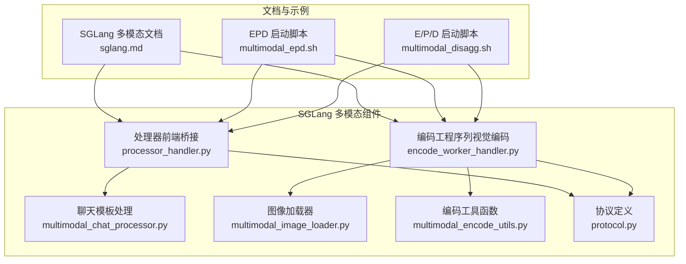
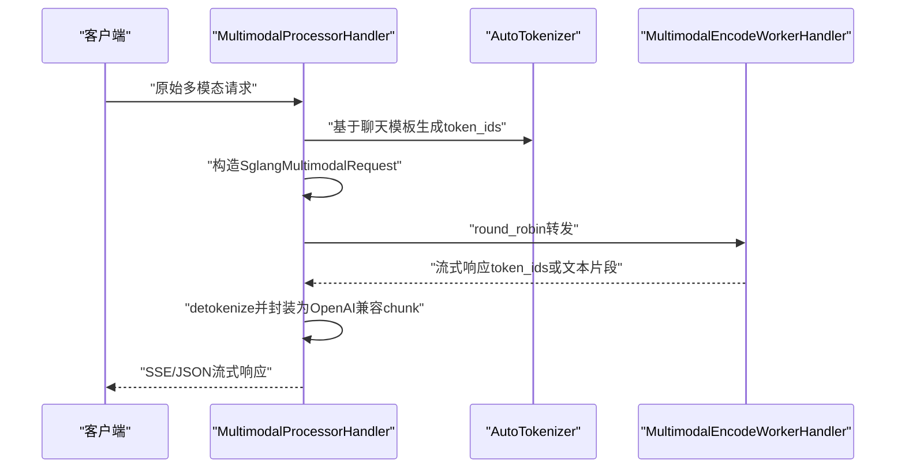
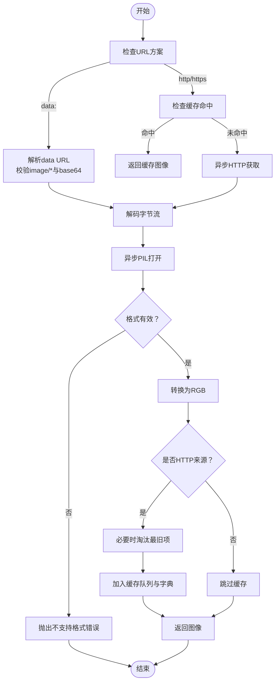
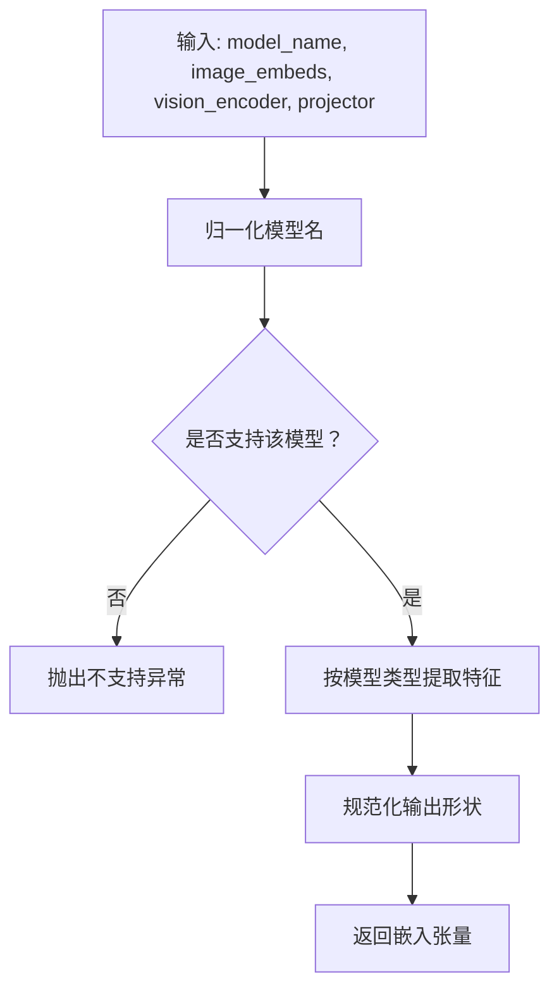
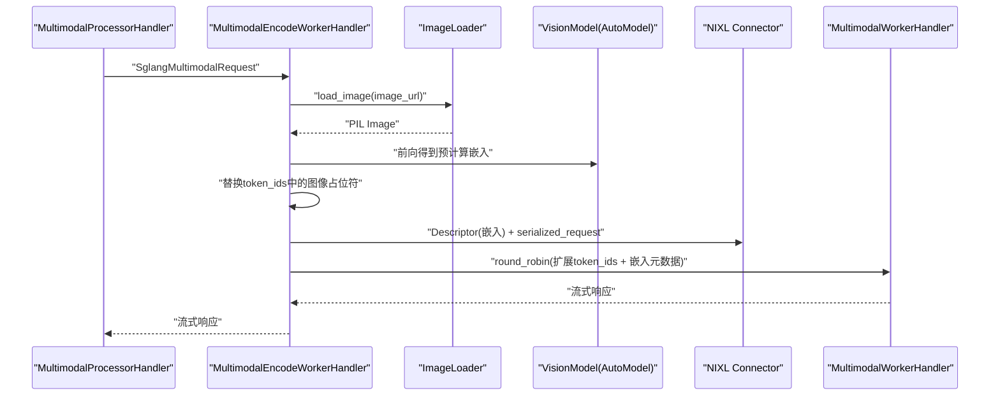
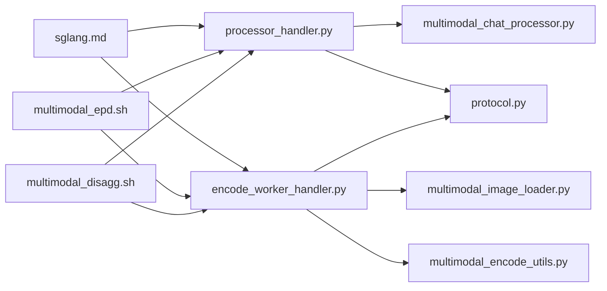
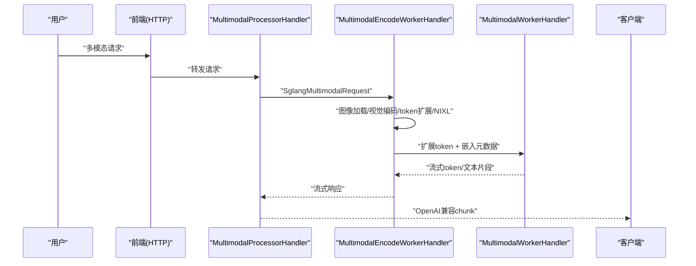

# 多模态处理

<cite>
**本文引用的文件**
- [multimodal_chat_processor.py](file://components/src/dynamo/sglang/multimodal_utils/multimodal_chat_processor.py)
- [multimodal_image_loader.py](file://components/src/dynamo/sglang/multimodal_utils/multimodal_image_loader.py)
- [multimodal_encode_utils.py](file://components/src/dynamo/sglang/multimodal_utils/multimodal_encode_utils.py)
- [processor_handler.py](file://components/src/dynamo/sglang/request_handlers/multimodal/processor_handler.py)
- [encode_worker_handler.py](file://components/src/dynamo/sglang/request_handlers/multimodal/encode_worker_handler.py)
- [protocol.py](file://components/src/dynamo/sglang/protocol.py)
- [sglang.md](file://docs/multimodal/sglang.md)
- [multimodal_epd.sh](file://examples/backends/sglang/launch/multimodal_epd.sh)
- [multimodal_disagg.sh](file://examples/backends/sglang/launch/multimodal_disagg.sh)
</cite>

## 目录
1. [简介](#简介)
2. [项目结构](#项目结构)
3. [核心组件](#核心组件)
4. [架构总览](#架构总览)
5. [详细组件分析](#详细组件分析)
6. [依赖关系分析](#依赖关系分析)
7. [性能考量](#性能考量)
8. [故障排查指南](#故障排查指南)
9. [结论](#结论)
10. [附录](#附录)

## 简介
本文件面向使用 SGLang 后端进行多模态（图像+文本）推理的开发者，系统性说明多模态数据处理架构、聊天处理器实现、编码工具函数、图像加载器工作原理，并给出完整的端到端处理链路示例与配置指南。重点覆盖以下方面：
- 图像加载：支持 HTTP/HTTPS 与 data URL（Base64），具备缓存与格式校验
- 文本编码：基于 SGLang 聊天模板，生成 token_ids 并与图像占位符对齐
- 多模态融合：在编码阶段生成视觉嵌入，替换单个图像 token 为多个 patch token
- 组件交互：EPD/E/PD/E/P/D 三种部署模式下的消息流与数据传输（NIXL/RDMA）
- 性能优化：缓存策略、设备选择、批处理与并行度调优

## 项目结构
围绕 SGLang 后端的多模态处理，核心代码位于 components/src/dynamo/sglang 下的 multimodal_utils 与 request_handlers/multimodal 子目录，配套文档位于 docs/multimodal/sglang.md。

图表来源
- [multimodal_chat_processor.py](file://components/src/dynamo/sglang/multimodal_utils/multimodal_chat_processor.py#L1-L163)
- [multimodal_image_loader.py](file://components/src/dynamo/sglang/multimodal_utils/multimodal_image_loader.py#L1-L121)
- [multimodal_encode_utils.py](file://components/src/dynamo/sglang/multimodal_utils/multimodal_encode_utils.py#L1-L171)
- [processor_handler.py](file://components/src/dynamo/sglang/request_handlers/multimodal/processor_handler.py#L1-L222)
- [encode_worker_handler.py](file://components/src/dynamo/sglang/request_handlers/multimodal/encode_worker_handler.py#L1-L189)
- [protocol.py](file://components/src/dynamo/sglang/protocol.py#L1-L134)
- [sglang.md](file://docs/multimodal/sglang.md#L1-L434)
- [multimodal_epd.sh](file://examples/backends/sglang/launch/multimodal_epd.sh#L1-L89)
- [multimodal_disagg.sh](file://examples/backends/sglang/launch/multimodal_disagg.sh#L1-L106)

章节来源
- [sglang.md](file://docs/multimodal/sglang.md#L18-L76)

## 核心组件
- 聊天模板处理模块：负责将用户消息中的文本与图像占位符映射为 SGLang 的对话结构，并生成 token_ids。
- 图像加载器：支持 HTTP/HTTPS 与 data URL（Base64），内置缓存与格式校验，异步加载避免阻塞事件循环。
- 编码工具函数：根据模型类型选择合适的视觉编码路径，提取图像特征并规范化输出形状。
- 处理器（MultimodalProcessorHandler）：接收原始多模态请求，构造 SGLang 请求并转发给编码工程序列。
- 编码工程序列（MultimodalEncodeWorkerHandler）：下载/加载图像，运行视觉编码器生成嵌入，替换 token 序列中的图像占位符，并通过 NIXL/RDMA 将嵌入传递给下游工作节点。

章节来源
- [multimodal_chat_processor.py](file://components/src/dynamo/sglang/multimodal_utils/multimodal_chat_processor.py#L11-L48)
- [multimodal_image_loader.py](file://components/src/dynamo/sglang/multimodal_utils/multimodal_image_loader.py#L44-L121)
- [multimodal_encode_utils.py](file://components/src/dynamo/sglang/multimodal_utils/multimodal_encode_utils.py#L13-L171)
- [processor_handler.py](file://components/src/dynamo/sglang/request_handlers/multimodal/processor_handler.py#L28-L222)
- [encode_worker_handler.py](file://components/src/dynamo/sglang/request_handlers/multimodal/encode_worker_handler.py#L37-L189)

## 架构总览
SGLang 多模态支持三种部署模式：EPD（聚合）、E/PD（编码分离）、E/P/D（完全解耦）。文档中对各模式的组件职责、消息流与数据传输（NIXL/RDMA）有详细说明。

```mermaid
graph TB
subgraph "EPD简单聚合"
FE["前端(HTTP)"] --> DEC["DecodeWorkerHandler内部完成编码/预填充/解码"]
end
subgraph "E/PD编码分离"
FE2["前端(HTTP)"] --> PROC["MultimodalProcessorHandler"]
PROC --> ENC["MultimodalEncodeWorkerHandler视觉编码"]
ENC --> PD["MultimodalWorkerHandler预填充+解码"]
end
subgraph "E/P/D完全解耦"
FE3["前端(HTTP)"] --> PROC2["MultimodalProcessorHandler"]
PROC2 --> ENC2["MultimodalEncodeWorkerHandler视觉编码"]
ENC2 --> DEC2["MultimodalWorkerHandlerDecode入口"]
DEC2 --> PREF["MultimodalPrefillWorkerHandlerPrefill入口"]
end
```

图表来源
- [sglang.md](file://docs/multimodal/sglang.md#L77-L253)

章节来源
- [sglang.md](file://docs/multimodal/sglang.md#L20-L76)

## 详细组件分析

### 聊天处理器（MultimodalProcessorHandler）
职责与流程：
- 校验并解析原始多模态请求
- 使用聊天模板将消息转换为 SGLang 对话结构，生成 token_ids
- 构造 SglangMultimodalRequest，包含 token_ids 与图像 URL
- 转发至编码工程序列，并对下游返回进行流式解码与 OpenAI 兼容响应封装

图表来源
- [processor_handler.py](file://components/src/dynamo/sglang/request_handlers/multimodal/processor_handler.py#L57-L222)
- [multimodal_chat_processor.py](file://components/src/dynamo/sglang/multimodal_utils/multimodal_chat_processor.py#L11-L48)
- [protocol.py](file://components/src/dynamo/sglang/protocol.py#L119-L128)

章节来源
- [processor_handler.py](file://components/src/dynamo/sglang/request_handlers/multimodal/processor_handler.py#L28-L222)
- [multimodal_chat_processor.py](file://components/src/dynamo/sglang/multimodal_utils/multimodal_chat_processor.py#L11-L163)
- [protocol.py](file://components/src/dynamo/sglang/protocol.py#L105-L134)

### 图像加载器（ImageLoader）
能力与策略：
- 支持 HTTP/HTTPS 与 data URL（Base64）两种输入
- 内置全局共享 HTTP 客户端，限制连接数与 keepalive
- 基于 URL 的图片缓存（LRU 队列），避免重复下载
- 异步加载避免阻塞事件循环；格式校验仅接受 JPEG/PNG/WEBP
- data URL 必须为 image/* 类型且采用 base64 编码

图表来源
- [multimodal_image_loader.py](file://components/src/dynamo/sglang/multimodal_utils/multimodal_image_loader.py#L54-L121)

章节来源
- [multimodal_image_loader.py](file://components/src/dynamo/sglang/multimodal_utils/multimodal_image_loader.py#L44-L121)

### 编码工具函数（encode_image_embeddings）
能力与模型适配：
- 模型名称归一化与匹配，支持本地路径与 HF 缓存路径
- 针对 Qwen2.5-VL 的视觉编码路径，要求提供 grid_thw 信息
- 输出规范化为统一形状，并在无投影器时直接返回编码结果

图表来源
- [multimodal_encode_utils.py](file://components/src/dynamo/sglang/multimodal_utils/multimodal_encode_utils.py#L19-L171)

章节来源
- [multimodal_encode_utils.py](file://components/src/dynamo/sglang/multimodal_utils/multimodal_encode_utils.py#L13-L171)

### 编码工程序列（MultimodalEncodeWorkerHandler）
职责与流程：
- 加载图像（通过 ImageLoader）
- 使用 AutoImageProcessor 与 AutoModel 进行视觉编码
- 依据嵌入形状替换 token_ids 中的图像占位符（如 “<tool_call>”）
- 通过 NIXL/RDMA 描述符序列化嵌入元数据并发送给下游
- 返回下游响应并进行流式解码

图表来源
- [encode_worker_handler.py](file://components/src/dynamo/sglang/request_handlers/multimodal/encode_worker_handler.py#L94-L189)
- [multimodal_image_loader.py](file://components/src/dynamo/sglang/multimodal_utils/multimodal_image_loader.py#L54-L121)
- [multimodal_encode_utils.py](file://components/src/dynamo/sglang/multimodal_utils/multimodal_encode_utils.py#L131-L171)
- [protocol.py](file://components/src/dynamo/sglang/protocol.py#L119-L128)

章节来源
- [encode_worker_handler.py](file://components/src/dynamo/sglang/request_handlers/multimodal/encode_worker_handler.py#L37-L189)
- [protocol.py](file://components/src/dynamo/sglang/protocol.py#L119-L128)

### 数据结构与协议
- MultiModalRequest：OpenAI 风格的消息列表，支持 text、image_url、video_url
- SglangMultimodalRequest：包含 token_ids、停止条件、采样参数以及图像网格维度与嵌入形状等多模态字段
- 协议还定义了 PreprocessedRequest、SamplingOptions 等通用 LLM 协议类型

章节来源
- [protocol.py](file://components/src/dynamo/sglang/protocol.py#L74-L134)

## 依赖关系分析
- MultimodalProcessorHandler 依赖聊天模板处理模块与协议定义，负责上游到编码工程序列的桥接
- MultimodalEncodeWorkerHandler 依赖图像加载器与编码工具函数，负责视觉编码与 token 扩展
- 编码工具函数依赖模型名称归一化与特定模型的特征提取逻辑
- 文档与启动脚本定义了不同部署模式下的组件组合与参数

图表来源
- [processor_handler.py](file://components/src/dynamo/sglang/request_handlers/multimodal/processor_handler.py#L1-L222)
- [encode_worker_handler.py](file://components/src/dynamo/sglang/request_handlers/multimodal/encode_worker_handler.py#L1-L189)
- [multimodal_chat_processor.py](file://components/src/dynamo/sglang/multimodal_utils/multimodal_chat_processor.py#L1-L163)
- [multimodal_image_loader.py](file://components/src/dynamo/sglang/multimodal_utils/multimodal_image_loader.py#L1-L121)
- [multimodal_encode_utils.py](file://components/src/dynamo/sglang/multimodal_utils/multimodal_encode_utils.py#L1-L171)
- [protocol.py](file://components/src/dynamo/sglang/protocol.py#L1-L134)
- [sglang.md](file://docs/multimodal/sglang.md#L1-L434)
- [multimodal_epd.sh](file://examples/backends/sglang/launch/multimodal_epd.sh#L1-L89)
- [multimodal_disagg.sh](file://examples/backends/sglang/launch/multimodal_disagg.sh#L1-L106)

章节来源
- [sglang.md](file://docs/multimodal/sglang.md#L280-L403)

## 性能考量
- 图像缓存：ImageLoader 对 HTTP 来源的图像进行 LRU 缓存，减少重复下载与网络开销
- 异步 I/O：HTTP 获取与 PIL 打开均在异步线程池执行，避免阻塞事件循环
- 设备选择：编码工程序列在 GPU 上运行（device_map="auto"），dtype=float16 降低显存占用
- token 扩展：将单个图像 token 替换为 patch 数量对应的 token，确保下游解码阶段的上下文对齐
- NIXL/RDMA：在 E/PD 与 E/P/D 模式下，嵌入张量通过 RDMA 零拷贝传输，减少 CPU 拷贝与带宽占用
- 启动脚本参数：示例脚本中设置 page-size、tp、禁用 radix cache 等参数以平衡吞吐与延迟

章节来源
- [multimodal_image_loader.py](file://components/src/dynamo/sglang/multimodal_utils/multimodal_image_loader.py#L44-L121)
- [encode_worker_handler.py](file://components/src/dynamo/sglang/request_handlers/multimodal/encode_worker_handler.py#L56-L64)
- [sglang.md](file://docs/multimodal/sglang.md#L395-L403)
- [multimodal_epd.sh](file://examples/backends/sglang/launch/multimodal_epd.sh#L70-L85)
- [multimodal_disagg.sh](file://examples/backends/sglang/launch/multimodal_disagg.sh#L70-L102)

## 故障排查指南
- 图像加载失败
  - 检查 URL 方案是否为 http/https 或 data:image/...;base64
  - data URL 必须为 image/* 类型且 base64 编码
  - 若为 HTTP/HTTPS，确认网络可达与响应非空
- 不支持的图像格式
  - 仅支持 JPEG/PNG/WEBP；其他格式会触发“不支持格式”错误
- 嵌入生成异常
  - 对于 Qwen2.5-VL，必须提供 image_grid_thw；缺失将抛出异常
  - 模型名称需与已支持模型匹配，否则提示“模型不受支持”
- token 扩展问题
  - 确认聊天模板中图像占位符与模型一致；编码工程序列会根据占位符 ID 替换为对应数量的 patch token
- NIXL/RDMA 传输失败
  - 检查编码工程序列是否成功创建 Descriptor 并写入 serialized_request
  - 下游工作节点需正确读取 embeddings_shape 并发起 RDMA 读取操作

章节来源
- [multimodal_image_loader.py](file://components/src/dynamo/sglang/multimodal_utils/multimodal_image_loader.py#L64-L121)
- [multimodal_encode_utils.py](file://components/src/dynamo/sglang/multimodal_utils/multimodal_encode_utils.py#L99-L171)
- [encode_worker_handler.py](file://components/src/dynamo/sglang/request_handlers/multimodal/encode_worker_handler.py#L118-L189)

## 结论
SGLang 后端的多模态处理通过清晰的组件分层实现了从输入解析、文本编码、图像加载与视觉编码到下游解码的完整链路。借助聊天模板与 token 扩展机制，系统能够高效地将图像信息融入语言模型的上下文中；结合 NIXL/RDMA 的零拷贝传输，在解耦部署模式下仍可保持较低的跨节点延迟。开发者可根据业务需求选择 EPD/E/PD/E/P/D 任一模式，并参考本文的配置与优化建议提升整体性能与稳定性。

## 附录

### 多模态数据处理链路（端到端示例）
- 输入：OpenAI 风格的多模态消息（文本 + 图像 URL）
- 处理：
  - 聊天模板处理：生成 token_ids
  - 编码工程序列：加载图像、视觉编码、替换图像 token、NIXL/RDMA 传输嵌入
  - 下游工作节点：预填充 + 解码，生成流式响应
- 输出：OpenAI 兼容的流式 JSON chunk

图表来源
- [sglang.md](file://docs/multimodal/sglang.md#L129-L253)
- [processor_handler.py](file://components/src/dynamo/sglang/request_handlers/multimodal/processor_handler.py#L57-L222)
- [encode_worker_handler.py](file://components/src/dynamo/sglang/request_handlers/multimodal/encode_worker_handler.py#L94-L189)

### 配置指南与最佳实践
- 模型与模板
  - 指定模型路径与聊天模板（如 qwen2-vl）
  - 确保 served_model_name 与实际模型一致，便于编码工具函数进行模型匹配
- 部署模式
  - EPD：适合快速上线，所有处理在引擎内完成
  - E/PD：编码与解码分离，便于横向扩展
  - E/P/D：完全解耦，支持 KV 缓存通过 bootstrap 共享
- 启动参数建议
  - 设置 page-size、tp、禁用 radix cache 等参数以平衡性能
  - 在解耦模式下配置 --disaggregation-mode 与 --disaggregation-bootstrap-port
- 性能优化
  - 启用图像缓存，减少重复下载
  - 使用 float16 与 GPU 设备加速视觉编码
  - 控制并发与连接上限，避免网络成为瓶颈

章节来源
- [sglang.md](file://docs/multimodal/sglang.md#L39-L76)
- [multimodal_epd.sh](file://examples/backends/sglang/launch/multimodal_epd.sh#L14-L85)
- [multimodal_disagg.sh](file://examples/backends/sglang/launch/multimodal_disagg.sh#L14-L102)