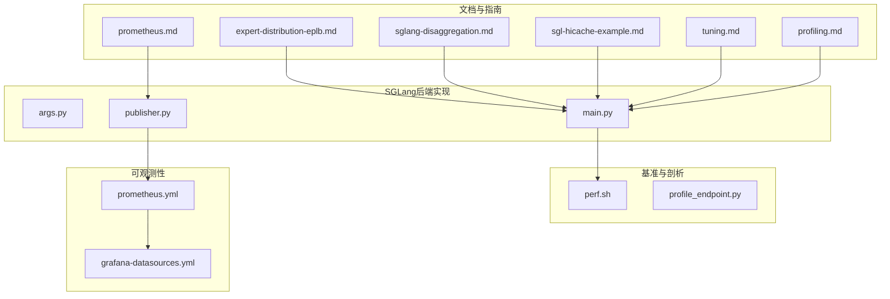
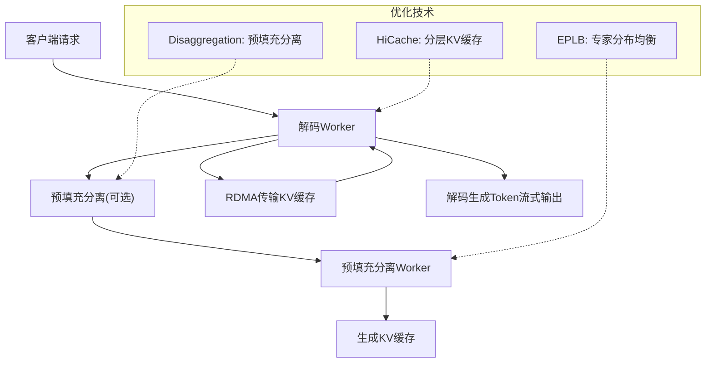
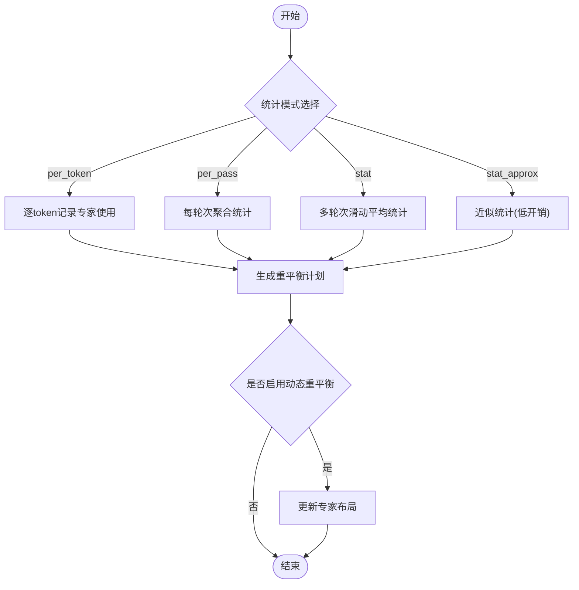
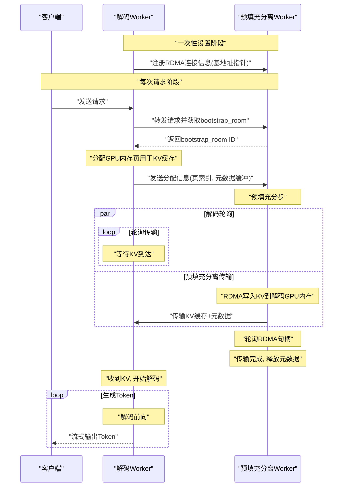
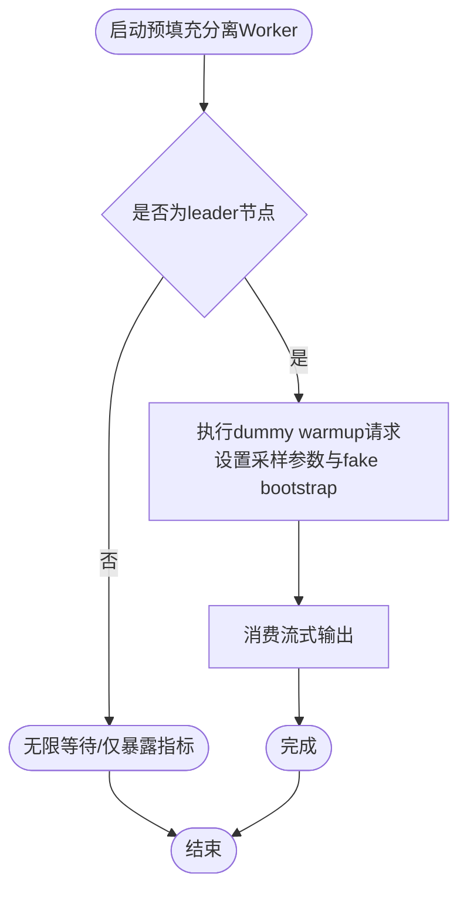
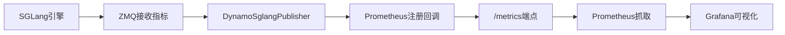
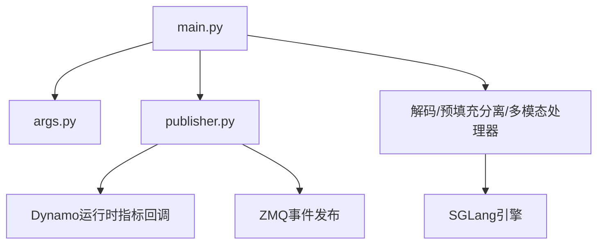

# 性能优化

<cite>
**本文引用的文件**
- [expert-distribution-eplb.md](file://docs/backends/sglang/expert-distribution-eplb.md)
- [sglang-disaggregation.md](file://docs/backends/sglang/sglang-disaggregation.md)
- [sgl-hicache-example.md](file://docs/backends/sglang/sgl-hicache-example.md)
- [prometheus.md](file://docs/backends/sglang/prometheus.md)
- [tuning.md](file://docs/performance/tuning.md)
- [args.py](file://components/src/dynamo/sglang/args.py)
- [main.py](file://components/src/dynamo/sglang/main.py)
- [publisher.py](file://components/src/dynamo/sglang/publisher.py)
- [perf.sh](file://benchmarks/llm/perf.sh)
- [profile_endpoint.py](file://benchmarks/profiler/profile_endpoint.py)
- [prometheus.yml](file://deploy/observability/prometheus.yml)
- [grafana-datasources.yml](file://deploy/observability/grafana-datasources.yml)
- [profiling.md](file://docs/backends/sglang/profiling.md)
</cite>

## 目录
1. [简介](#简介)
2. [项目结构](#项目结构)
3. [核心组件](#核心组件)
4. [架构总览](#架构总览)
5. [详细组件分析](#详细组件分析)
6. [依赖关系分析](#依赖关系分析)
7. [性能考量与调优](#性能考量与调优)
8. [故障排查指南](#故障排查指南)
9. [结论](#结论)
10. [附录：基准测试与监控配置](#附录基准测试与监控配置)

## 简介
本文件面向SGLang后端在Dynamo平台上的性能优化，系统性阐述以下主题：
- 高性能特性：专家分布均衡（EPLB）、分解聚合（Disaggregation）架构、HiCache分层缓存
- 预填充预热机制：通过dummy warmup降低首次TTFT
- 指标发布与监控：Prometheus集成与多维度性能指标采集
- 架构优势：计算与内存资源的协同优化
- 基准测试方法与调优策略：结合脚本与工具链给出可操作的实证路径
- 配置与监控实践：帮助开发者实现最优推理性能

## 项目结构
围绕SGLang后端性能优化，相关代码与文档主要分布在如下位置：
- 文档与指南：docs/backends/sglang、docs/performance
- 后端实现：components/src/dynamo/sglang（参数解析、主流程、指标发布）
- 基准与剖析：benchmarks/llm、benchmarks/profiler
- 可观测性：deploy/observability（Prometheus/Grafana配置）

**图表来源**
- [expert-distribution-eplb.md](file://docs/backends/sglang/expert-distribution-eplb.md#L1-L62)
- [sglang-disaggregation.md](file://docs/backends/sglang/sglang-disaggregation.md#L1-L89)
- [sgl-hicache-example.md](file://docs/backends/sglang/sgl-hicache-example.md#L1-L66)
- [prometheus.md](file://docs/backends/sglang/prometheus.md#L1-L124)
- [tuning.md](file://docs/performance/tuning.md#L1-L149)
- [args.py](file://components/src/dynamo/sglang/args.py#L1-L640)
- [main.py](file://components/src/dynamo/sglang/main.py#L1-L664)
- [publisher.py](file://components/src/dynamo/sglang/publisher.py#L1-L201)
- [perf.sh](file://benchmarks/llm/perf.sh#L1-L271)
- [profile_endpoint.py](file://benchmarks/profiler/profile_endpoint.py#L1-L124)
- [prometheus.yml](file://deploy/observability/prometheus.yml#L1-L63)
- [grafana-datasources.yml](file://deploy/observability/grafana-datasources.yml#L1-L24)

**章节来源**
- [args.py](file://components/src/dynamo/sglang/args.py#L1-L640)
- [main.py](file://components/src/dynamo/sglang/main.py#L1-L664)
- [publisher.py](file://components/src/dynamo/sglang/publisher.py#L1-L201)
- [expert-distribution-eplb.md](file://docs/backends/sglang/expert-distribution-eplb.md#L1-L62)
- [sglang-disaggregation.md](file://docs/backends/sglang/sglang-disaggregation.md#L1-L89)
- [sgl-hicache-example.md](file://docs/backends/sglang/sgl-hicache-example.md#L1-L66)
- [prometheus.md](file://docs/backends/sglang/prometheus.md#L1-L124)
- [tuning.md](file://docs/performance/tuning.md#L1-L149)
- [perf.sh](file://benchmarks/llm/perf.sh#L1-L271)
- [profile_endpoint.py](file://benchmarks/profiler/profile_endpoint.py#L1-L124)
- [prometheus.yml](file://deploy/observability/prometheus.yml#L1-L63)
- [grafana-datasources.yml](file://deploy/observability/grafana-datasources.yml#L1-L24)

## 核心组件
- 参数与配置解析：统一解析SGLang与Dynamo参数，支持嵌套配置文件抽取、端点类型、多模态、嵌入等模式切换。
- 主流程与初始化：按工作角色（解码、预填充分离、扩散、嵌入、多模态）初始化引擎与路由；在预填充分离场景中执行dummy warmup以降低首次TTFT。
- 指标发布与监控：通过ZMQ接收SGLang调度器指标，注册Prometheus回调，统一暴露sglang:前缀指标；支持系统端口导出Dynamo运行时指标。

**章节来源**
- [args.py](file://components/src/dynamo/sglang/args.py#L324-L585)
- [main.py](file://components/src/dynamo/sglang/main.py#L69-L286)
- [publisher.py](file://components/src/dynamo/sglang/publisher.py#L136-L201)

## 架构总览
SGLang在Dynamo中的性能优化由三大支柱构成：
- 专家分布均衡（EPLB）：动态重平衡MoE专家分布，缓解热点GPU瓶颈，提升整体吞吐与资源利用率。
- 分解聚合（Disaggregation）：将预填充分离到独立worker，解码worker专注生成阶段，配合RDMA零拷贝传输KV缓存，显著降低首Token延迟并提高资源利用率。
- HiCache分层缓存：在设备与主机之间建立分层KV缓存池，通过写策略与存储后端选择，平衡延迟与容量。

**图表来源**
- [sglang-disaggregation.md](file://docs/backends/sglang/sglang-disaggregation.md#L37-L67)
- [sgl-hicache-example.md](file://docs/backends/sglang/sgl-hicache-example.md#L10-L34)
- [expert-distribution-eplb.md](file://docs/backends/sglang/expert-distribution-eplb.md#L32-L56)

## 详细组件分析

### 专家分布均衡（EPLB）
- 核心思想：冗余专家+组受限路由+两级负载均衡（节点级与全局级），在保持路由约束的前提下最大化局部亲和，减少跨节点流量。
- 实现要点：支持per_token/per_pass/stat/stat_approx四种统计模式，动态重平衡周期可配置，支持从外部文件或JSON初始化专家布局。
- 运行时影响：降低专家热点，提升GPU利用率与吞吐，适合大规模MoE模型。

**图表来源**
- [expert-distribution-eplb.md](file://docs/backends/sglang/expert-distribution-eplb.md#L24-L56)

**章节来源**
- [expert-distribution-eplb.md](file://docs/backends/sglang/expert-distribution-eplb.md#L12-L56)

### 分解聚合（Disaggregation）架构
- 架构优势：预填充分离、解码专注、RDMA零拷贝KV传输、并发Poll与传输并行，显著降低TTFT并提升资源利用率。
- Dynamo集成：无集中LB，采用发现机制，先路由至解码worker，再通过轮询或KV感知选择预填充分离worker，使用bootstrap server与NIXL/Mooncake完成RDMA连接与传输。

**图表来源**
- [sglang-disaggregation.md](file://docs/backends/sglang/sglang-disaggregation.md#L37-L67)

**章节来源**
- [sglang-disaggregation.md](file://docs/backends/sglang/sglang-disaggregation.md#L10-L89)

### 预填充预热（Dummy Warmup）降低TTFT
- 目标：在预填充分离leader节点上执行dummy warmup，避免首次请求的深度GEMM预热导致的TTFT尖峰。
- 实现：构造极短采样参数与fake bootstrap参数，异步发起一次生成请求并消费流式结果，超时控制在30分钟。
- 效果：显著降低首次请求延迟，改善用户体验。

**图表来源**
- [main.py](file://components/src/dynamo/sglang/main.py#L617-L650)

**章节来源**
- [main.py](file://components/src/dynamo/sglang/main.py#L233-L235)
- [main.py](file://components/src/dynamo/sglang/main.py#L617-L650)

### 指标发布与监控（Prometheus集成）
- 指标来源：SGLang引擎指标（sglang:前缀）与Dynamo运行时指标（dynamo_*前缀）统一暴露于同一/metrics端点。
- 发布方式：ZMQ接收SGLang调度器指标，注册Prometheus回调，MultiProcessCollector聚合共享内存中的多进程指标。
- 可视化：Prometheus抓取Dynamo前端与后端目标，Grafana作为数据源进行仪表盘展示。

**图表来源**
- [publisher.py](file://components/src/dynamo/sglang/publisher.py#L136-L201)
- [prometheus.md](file://docs/backends/sglang/prometheus.md#L104-L124)
- [prometheus.yml](file://deploy/observability/prometheus.yml#L44-L49)
- [grafana-datasources.yml](file://deploy/observability/grafana-datasources.yml#L18-L24)

**章节来源**
- [publisher.py](file://components/src/dynamo/sglang/publisher.py#L106-L134)
- [publisher.py](file://components/src/dynamo/sglang/publisher.py#L136-L201)
- [prometheus.md](file://docs/backends/sglang/prometheus.md#L18-L124)
- [prometheus.yml](file://deploy/observability/prometheus.yml#L1-L63)
- [grafana-datasources.yml](file://deploy/observability/grafana-datasources.yml#L1-L24)

### HiCache分层缓存
- 启用方式：通过命令行参数开启分层缓存，设置页大小、写策略、存储后端等。
- 工作原理：在设备与主机之间建立分层KV缓存池，通过写策略（如write_through）与后端（如nixl）选择，平衡延迟与容量。
- 使用建议：根据CPU内存情况调整hicache-ratio，确保主机侧缓存池足够支撑高峰流量。

**章节来源**
- [sgl-hicache-example.md](file://docs/backends/sglang/sgl-hicache-example.md#L10-L34)

## 依赖关系分析
- 组件耦合与内聚：SGLang后端通过Dynamo分布式运行时组织，不同工作角色（解码/预填充分离/多模态/嵌入/扩散）通过统一的endpoint与路由协作。
- 外部依赖：Prometheus多进程指标聚合、ZMQ事件发布、RDMA零拷贝传输、模型下载与并行化参数（TP/DP）。
- 关键接口契约：指标发布回调、健康检查payload、端点类型与tokenizer选择策略。

**图表来源**
- [main.py](file://components/src/dynamo/sglang/main.py#L19-L34)
- [args.py](file://components/src/dynamo/sglang/args.py#L183-L214)
- [publisher.py](file://components/src/dynamo/sglang/publisher.py#L170-L201)

**章节来源**
- [main.py](file://components/src/dynamo/sglang/main.py#L19-L34)
- [args.py](file://components/src/dynamo/sglang/args.py#L183-L214)
- [publisher.py](file://components/src/dynamo/sglang/publisher.py#L170-L201)

## 性能考量与调优
- 分离部署收益：预填充分离降低TTFT，解码专注生成阶段，提升资源利用率；需谨慎调节批大小、最大token数与块大小以平衡KV缓存与中间张量规模。
- 并行化映射：对稠密模型通常采用“节点内TP、跨节点PP”；MoE模型需结合注意力DP与专家并行策略。
- 块大小权衡：过小导致P->D传输碎片化与前缀缓存命中率下降；过大则增加内存碎片与前缀缓存压力；常见经验为128。
- 预填充分离参数：在预填充分离场景下，优先让预填充分离引擎饱和，设置max-local-prefill-length以保证GPU利用率。
- 调优流程：使用AIPerf在固定ISL/OSL/并发条件下对比SLA，确定最佳GPU数量与并行度组合。

**章节来源**
- [tuning.md](file://docs/performance/tuning.md#L18-L149)

## 故障排查指南
- 指标不可见：确认已设置系统端口并启用指标；检查Prometheus抓取配置与网络连通性。
- TTFT异常高：检查是否启用预填充分离与dummy warmup；核对预填充分离引擎是否饱和。
- EPLB效果不明显：确认统计模式与缓冲区大小设置合理；评估是否需要更频繁的重平衡。
- Profiling：通过系统服务器的/engine/*端点启动/停止PyTorch Profiler，生成Chrome trace文件进行分析。

**章节来源**
- [prometheus.md](file://docs/backends/sglang/prometheus.md#L18-L124)
- [profiling.md](file://docs/backends/sglang/profiling.md#L1-L45)

## 结论
通过EPLB、分解聚合与HiCache三项核心技术，SGLang在Dynamo平台上实现了专家资源均衡、预填充分离与分层KV缓存的协同优化，显著降低了TTFT并提升了整体吞吐与资源利用率。结合Prometheus/Grafana监控体系与AIPerf基准脚本，开发者可以系统地进行参数调优与性能验证，从而在不同负载场景下获得最优推理性能。

## 附录：基准测试与监控配置
- 基准脚本：perf.sh支持聚合与分解两种模式，可指定TP/DP或预填充分离/解码并行度，自动运行多并发级别测试并生成结果目录与部署配置快照。
- 端点剖析：profile_endpoint.py支持单独剖析prefill或decode阶段，便于定位瓶颈。
- 监控配置：prometheus.yml定义了抓取Dynamo前端与后端的目标；grafana-datasources.yml配置Prometheus为默认数据源。

**章节来源**
- [perf.sh](file://benchmarks/llm/perf.sh#L1-L271)
- [profile_endpoint.py](file://benchmarks/profiler/profile_endpoint.py#L1-L124)
- [prometheus.yml](file://deploy/observability/prometheus.yml#L1-L63)
- [grafana-datasources.yml](file://deploy/observability/grafana-datasources.yml#L1-L24)