# 核心架构设计

<cite>
**本文档引用的文件**
- [components/src/dynamo/sglang/main.py](file://components/src/dynamo/sglang/main.py)
- [components/src/dynamo/sglang/args.py](file://components/src/dynamo/sglang/args.py)
- [components/src/dynamo/sglang/register.py](file://components/src/dynamo/sglang/register.py)
- [components/src/dynamo/sglang/health_check.py](file://components/src/dynamo/sglang/health_check.py)
- [components/src/dynamo/sglang/publisher.py](file://components/src/dynamo/sglang/publisher.py)
- [components/src/dynamo/sglang/request_handlers/handler_base.py](file://components/src/dynamo/sglang/request_handlers/handler_base.py)
- [components/src/dynamo/sglang/request_handlers/llm/decode_handler.py](file://components/src/dynamo/sglang/request_handlers/llm/decode_handler.py)
- [components/src/dynamo/sglang/request_handlers/multimodal/worker_handler.py](file://components/src/dynamo/sglang/request_handlers/multimodal/worker_handler.py)
- [components/src/dynamo/sglang/protocol.py](file://components/src/dynamo/sglang/protocol.py)
- [components/src/dynamo/sglang/__version__](file://components/src/dynamo/sglang/__version__)
- [docs/backends/sglang/sglang-disaggregation.md](file://docs/backends/sglang/sglang-disaggregation.md)
- [docs/backends/sglang/prometheus.md](file://docs/backends/sglang/prometheus.md)
- [docs/backends/sglang/gpt-oss.md](file://docs/backends/sglang/gpt-oss.md)
- [docs/backends/sglang/expert-distribution-eplb.md](file://docs/backends/sglang/expert-distribution-eplb.md)
- [docs/backends/sglang/diffusion-lm.md](file://docs/backends/sglang/diffusion-lm.md)
- [docs/backends/sglang/sgl-hicache-example.md](file://docs/backends/sglang/sgl-hicache-example.md)
- [docs/backends/sglang/profiling.md](file://docs/backends/sglang/profiling.md)
- [docs/kubernetes/deployment/multinode-deployment.md](file://docs/kubernetes/deployment/multinode-deployment.md)
- [docs/kubernetes/service_discovery.md](file://docs/kubernetes/service_discovery.md)
- [docs/observability/health-checks.md](file://docs/observability/health-checks.md)
- [docs/observability/metrics.md](file://docs/observability/metrics.md)
- [docs/fault_tolerance/graceful_shutdown.md](file://docs/fault_tolerance/graceful_shutdown.md)
- [examples/backends/sglang/deploy/README.md](file://examples/backends/sglang/deploy/README.md)
- [tests/router/test_router_e2e_with_sglang.py](file://tests/router/test_router_e2e_with_sglang.py)
- [tests/fault_tolerance/gpu_memory_service/test_gms_sleep_wake_sglang.py](file://tests/fault_tolerance/gpu_memory_service/test_gms_sleep_wake_sglang.py)
- [tests/fault_tolerance/gpu_memory_service/test_gms_shadow_failover_sglang.py](file://tests/fault_tolerance/gpu_memory_service/test_gms_shadow_failover_sglang.py)
</cite>

## 目录
1. [引言](#引言)
2. [项目结构](#项目结构)
3. [核心组件](#核心组件)
4. [架构总览](#架构总览)
5. [详细组件分析](#详细组件分析)
6. [依赖关系分析](#依赖关系分析)
7. [性能考虑](#性能考虑)
8. [故障排查指南](#故障排查指南)
9. [结论](#结论)
10. [附录](#附录)

## 引言
本文件面向SGLang后端的核心架构设计，系统性阐述以下主题：
- 主程序流程与参数解析机制
- 注册系统与健康检查实现
- 多节点部署架构（领导者与非领导者节点）
- 引擎集成、异步处理与优雅关闭
- 关键组件交互关系与数据流
- 架构决策的技术背景与性能考量

目标是帮助开发者快速理解并高效扩展SGLang后端在Dynamo平台上的实现策略。

## 项目结构
SGLang后端位于components/src/dynamo/sglang目录，采用按功能域分层的组织方式：
- 入口与控制流：main.py
- 参数解析与配置：args.py
- 注册与发现：register.py
- 健康检查：health_check.py
- 指标与事件发布：publisher.py
- 请求处理器：request_handlers/
  - handler_base.py（抽象基类）
  - llm/decode_handler.py（解码/聚合/拆分模式）
  - multimodal/worker_handler.py（多模态聚合/拆分）
- 协议定义：protocol.py

图表来源
- [components/src/dynamo/sglang/main.py](file://components/src/dynamo/sglang/main.py#L1-L664)
- [components/src/dynamo/sglang/args.py](file://components/src/dynamo/sglang/args.py#L1-L640)
- [components/src/dynamo/sglang/register.py](file://components/src/dynamo/sglang/register.py#L1-L265)
- [components/src/dynamo/sglang/health_check.py](file://components/src/dynamo/sglang/health_check.py#L1-L121)
- [components/src/dynamo/sglang/publisher.py](file://components/src/dynamo/sglang/publisher.py#L1-L201)
- [components/src/dynamo/sglang/request_handlers/handler_base.py](file://components/src/dynamo/sglang/request_handlers/handler_base.py#L1-L393)
- [components/src/dynamo/sglang/request_handlers/llm/decode_handler.py](file://components/src/dynamo/sglang/request_handlers/llm/decode_handler.py#L1-L300)
- [components/src/dynamo/sglang/request_handlers/multimodal/worker_handler.py](file://components/src/dynamo/sglang/request_handlers/multimodal/worker_handler.py#L1-L521)
- [components/src/dynamo/sglang/protocol.py](file://components/src/dynamo/sglang/protocol.py#L1-L134)

章节来源
- [components/src/dynamo/sglang/main.py](file://components/src/dynamo/sglang/main.py#L1-L664)
- [components/src/dynamo/sglang/args.py](file://components/src/dynamo/sglang/args.py#L1-L640)

## 核心组件
- 主程序worker：负责参数解析、运行时初始化、多节点分支、端点服务与注册、指标发布与优雅关闭。
- 参数解析器Config/ServerArgs/DynamoArgs：统一解析SGLang与Dynamo参数，支持嵌套配置文件提取、工具/推理解析器选择、端点格式校验等。
- 注册系统register_llm_with_readiness_gate：向Dynamo运行时注册模型，发布运行时配置（如KV块数、批内最大token数、最大并发请求数），并使用就绪门协调请求处理。
- 健康检查SglangHealthCheckPayload/SglangPrefillHealthCheckPayload：为解码/预填充工作负载生成最小化健康检查载荷，确保启动阶段可用性验证。
- 指标与事件发布DynamoSglangPublisher：通过ZMQ接收SGLang调度器指标，发布到Dynamo指标端点；可选启用KV事件发布；支持Prometheus多进程收集。
- 请求处理器BaseWorkerHandler/DecodeWorkerHandler/MultimodalWorkerHandler：抽象基类提供取消监控、内存占用释放/恢复、引擎路由注册；具体处理器实现OpenAI兼容流式输出、多模态输入处理、拆分模式下的引导信息传递。

章节来源
- [components/src/dynamo/sglang/main.py](file://components/src/dynamo/sglang/main.py#L69-L664)
- [components/src/dynamo/sglang/args.py](file://components/src/dynamo/sglang/args.py#L137-L585)
- [components/src/dynamo/sglang/register.py](file://components/src/dynamo/sglang/register.py#L18-L265)
- [components/src/dynamo/sglang/health_check.py](file://components/src/dynamo/sglang/health_check.py#L50-L121)
- [components/src/dynamo/sglang/publisher.py](file://components/src/dynamo/sglang/publisher.py#L51-L201)
- [components/src/dynamo/sglang/request_handlers/handler_base.py](file://components/src/dynamo/sglang/request_handlers/handler_base.py#L21-L393)
- [components/src/dynamo/sglang/request_handlers/llm/decode_handler.py](file://components/src/dynamo/sglang/request_handlers/llm/decode_handler.py#L17-L300)
- [components/src/dynamo/sglang/request_handlers/multimodal/worker_handler.py](file://components/src/dynamo/sglang/request_handlers/multimodal/worker_handler.py#L227-L521)

## 架构总览
SGLang后端在Dynamo中的整体架构由“参数解析—运行时初始化—端点服务—注册—健康检查—指标/事件发布—请求处理—优雅关闭”构成的闭环。

图表来源
- [components/src/dynamo/sglang/main.py](file://components/src/dynamo/sglang/main.py#L69-L210)
- [components/src/dynamo/sglang/args.py](file://components/src/dynamo/sglang/args.py#L324-L585)
- [components/src/dynamo/sglang/register.py](file://components/src/dynamo/sglang/register.py#L224-L265)
- [components/src/dynamo/sglang/health_check.py](file://components/src/dynamo/sglang/health_check.py#L50-L121)
- [components/src/dynamo/sglang/publisher.py](file://components/src/dynamo/sglang/publisher.py#L170-L201)

## 详细组件分析

### 主程序流程与参数解析
- 主程序入口uvloop.run(worker())，在worker中完成：
  - 解析参数（含SGLang与Dynamo参数、嵌套配置文件提取、工具/推理解析器优先级、端点格式校验、模板路径展开与校验）
  - 初始化DistributedRuntime（支持NATS/TCP/HTTP请求平面，NATS/ZMQ事件平面）
  - 信号处理：SIGTERM/SIGINT触发graceful_shutdown
  - 根据模式选择初始化路径：解码/预填充/扩散/嵌入/多模态处理器
  - 非领导者节点仅暴露指标，无限等待终止
- 参数解析的关键点：
  - 自动推断disaggregation bootstrap端口
  - 强制stream_output=True以优化流式性能
  - use_sglang_tokenizer与skip_tokenizer_init的互斥逻辑
  - 从server_args.kv_events_config派生use_kv_events

```mermaid
flowchart TD
Start(["开始"]) --> Parse["解析CLI参数<br/>合并配置文件"]
Parse --> Validate["校验端点格式/模板路径/互斥选项"]
Validate --> InitRuntime["初始化DistributedRuntime"]
InitRuntime --> SelectMode{"选择工作模式"}
SelectMode --> |解码/聚合| InitDecode["初始化DecodeWorkerHandler"]
SelectMode --> |预填充| InitPrefill["初始化PrefillWorkerHandler"]
SelectMode --> |扩散| InitDiffusion["初始化DiffusionWorkerHandler"]
SelectMode --> |嵌入| InitEmbedding["初始化EmbeddingWorkerHandler"]
SelectMode --> |多模态处理器| InitProcessor["初始化MultimodalProcessorHandler"]
SelectMode --> |多模态编码/解码| InitMM["初始化MultimodalWorkerHandler"]
InitDecode --> LeaderCheck{"是否领导者节点"}
InitPrefill --> LeaderCheck
InitDiffusion --> LeaderCheck
InitEmbedding --> LeaderCheck
InitProcessor --> LeaderCheck
InitMM --> LeaderCheck
LeaderCheck --> |否| MetricsOnly["仅配置指标发布并等待"]
LeaderCheck --> |是| Serve["serve_endpoint + 注册模型"]
Serve --> Ready["就绪门触发，开始处理请求"]
MetricsOnly --> Wait["等待终止信号"]
```

图表来源
- [components/src/dynamo/sglang/main.py](file://components/src/dynamo/sglang/main.py#L69-L144)
- [components/src/dynamo/sglang/args.py](file://components/src/dynamo/sglang/args.py#L324-L585)

章节来源
- [components/src/dynamo/sglang/main.py](file://components/src/dynamo/sglang/main.py#L69-L144)
- [components/src/dynamo/sglang/args.py](file://components/src/dynamo/sglang/args.py#L324-L585)

### 注册系统与健康检查
- 注册系统：
  - 生成ModelRuntimeConfig（推理解析器、工具调用解析器、本地索引器开关、KV块数、批内最大token数、最大并发序列数）
  - 从SGLang引擎提取bootstrap主机与端口，用于拆分模式下decode与prefill的协调
  - 使用就绪门（asyncio.Event）协调端点服务与注册完成，避免请求过早到达
- 健康检查：
  - 解码工作负载：基于BOS token构建最小化生成请求，支持文本或token两种输入
  - 预填充工作负载：包装为请求结构，便于拆分模式下的引导信息传递

图表来源
- [components/src/dynamo/sglang/register.py](file://components/src/dynamo/sglang/register.py#L18-L265)
- [components/src/dynamo/sglang/health_check.py](file://components/src/dynamo/sglang/health_check.py#L50-L121)

章节来源
- [components/src/dynamo/sglang/register.py](file://components/src/dynamo/sglang/register.py#L18-L265)
- [components/src/dynamo/sglang/health_check.py](file://components/src/dynamo/sglang/health_check.py#L50-L121)

### 多节点部署架构（领导者与非领导者节点）
- 领导者节点（node_rank=0）职责：
  - 完整初始化引擎、端点、注册、指标发布与事件发布
  - 提供对外服务接口，处理请求
- 非领导者节点（node_rank>=1）职责：
  - 仅初始化指标发布（共享内存/进程间指标）
  - 无限等待终止信号，不参与请求处理
- 多节点部署要点：
  - 通过环境变量SGLANG_BLOCK_NONZERO_RANK_CHILDREN控制非零节点阻塞行为
  - 事件平面与KV事件联动：当事件平面为NATS且启用KV事件时，强制启用NATS
  - 支持TCP/NATS/HTTP请求平面与NATS/ZMQ事件平面组合

图表来源
- [components/src/dynamo/sglang/main.py](file://components/src/dynamo/sglang/main.py#L39-L66)
- [components/src/dynamo/sglang/main.py](file://components/src/dynamo/sglang/main.py#L128-L144)
- [components/src/dynamo/sglang/args.py](file://components/src/dynamo/sglang/args.py#L84-L89)

章节来源
- [components/src/dynamo/sglang/main.py](file://components/src/dynamo/sglang/main.py#L39-L66)
- [components/src/dynamo/sglang/main.py](file://components/src/dynamo/sglang/main.py#L128-L144)
- [components/src/dynamo/sglang/args.py](file://components/src/dynamo/sglang/args.py#L84-L89)

### 引擎集成、异步处理与优雅关闭
- 引擎集成：
  - 通过sgl.Engine(server_args=server_args)创建引擎实例
  - 强制stream_output=True，确保SGLang返回离散token片段，便于Dynamo直接透传
- 异步处理：
  - 所有生成均使用async_generate，支持流式输出
  - 取消监控：通过Future获取SGLang请求ID，在上下文停止时调用abort_request
  - 多模态：支持预填充阶段的RDMA嵌入传输与解码阶段的KV缓存复用
- 优雅关闭：
  - 注册SIGTERM/SIGINT信号处理器，触发graceful_shutdown
  - runtime.shutdown()使端点失效，等待在途请求完成（可配置）

图表来源
- [components/src/dynamo/sglang/request_handlers/handler_base.py](file://components/src/dynamo/sglang/request_handlers/handler_base.py#L290-L393)
- [components/src/dynamo/sglang/request_handlers/llm/decode_handler.py](file://components/src/dynamo/sglang/request_handlers/llm/decode_handler.py#L89-L177)

章节来源
- [components/src/dynamo/sglang/request_handlers/handler_base.py](file://components/src/dynamo/sglang/request_handlers/handler_base.py#L290-L393)
- [components/src/dynamo/sglang/request_handlers/llm/decode_handler.py](file://components/src/dynamo/sglang/request_handlers/llm/decode_handler.py#L89-L177)
- [docs/fault_tolerance/graceful_shutdown.md](file://docs/fault_tolerance/graceful_shutdown.md#L1-L50)

### 请求处理器与数据流
- 解码处理器DecodeWorkerHandler：
  - 聚合模式：直接调用引擎，支持OpenAI格式流式输出
  - 拆分模式：从预填充获取bootstrap信息（主机、端口、房间号），再进行解码
- 多模态处理器MultimodalWorkerHandler：
  - 聚合模式：从序列化请求中读取嵌入张量，构造多模态项，直接调用引擎
  - 拆分模式：先向预填充客户端请求bootstrap信息，再进行解码
- 基类BaseWorkerHandler：
  - 提供内存占用释放/恢复（KV缓存、权重、CUDA图）
  - 提供引擎路由注册（profile、内存管理等）

图表来源
- [components/src/dynamo/sglang/request_handlers/handler_base.py](file://components/src/dynamo/sglang/request_handlers/handler_base.py#L21-L393)
- [components/src/dynamo/sglang/request_handlers/llm/decode_handler.py](file://components/src/dynamo/sglang/request_handlers/llm/decode_handler.py#L17-L300)
- [components/src/dynamo/sglang/request_handlers/multimodal/worker_handler.py](file://components/src/dynamo/sglang/request_handlers/multimodal/worker_handler.py#L227-L521)

章节来源
- [components/src/dynamo/sglang/request_handlers/llm/decode_handler.py](file://components/src/dynamo/sglang/request_handlers/llm/decode_handler.py#L89-L300)
- [components/src/dynamo/sglang/request_handlers/multimodal/worker_handler.py](file://components/src/dynamo/sglang/request_handlers/multimodal/worker_handler.py#L272-L521)
- [components/src/dynamo/sglang/request_handlers/handler_base.py](file://components/src/dynamo/sglang/request_handlers/handler_base.py#L175-L393)

### 指标与事件发布
- 指标发布：
  - 通过ZMQ PULL从SGLang引擎接收调度器指标，发布到Dynamo指标端点
  - 初始化dummy指标以启动指标端点
  - 支持Prometheus多进程收集（共享内存指标）
- 事件发布：
  - 从server_args.kv_events_config解析ZMQ端点，启用KV事件发布
  - 可选启用本地索引器（跟踪工作节点自身KV缓存状态）

图表来源
- [components/src/dynamo/sglang/publisher.py](file://components/src/dynamo/sglang/publisher.py#L90-L134)
- [components/src/dynamo/sglang/publisher.py](file://components/src/dynamo/sglang/publisher.py#L136-L201)

章节来源
- [components/src/dynamo/sglang/publisher.py](file://components/src/dynamo/sglang/publisher.py#L51-L201)

### 协议与数据结构
- 标准LLM协议：StopConditions、SamplingOptions、PreprocessedRequest、EmbeddingRequest、DisaggPreprocessedRequest
- 多模态协议：TextContent/ImageContent/VideoContent、ChatMessage、MultiModalRequest、SglangMultimodalRequest、DisaggSglangMultimodalRequest
- 作用：统一请求/响应格式，支撑OpenAI兼容流式输出与拆分模式下的引导信息传递

章节来源
- [components/src/dynamo/sglang/protocol.py](file://components/src/dynamo/sglang/protocol.py#L14-L134)

## 依赖关系分析
SGLang后端模块之间的依赖关系如下：

图表来源
- [components/src/dynamo/sglang/main.py](file://components/src/dynamo/sglang/main.py#L1-L35)
- [components/src/dynamo/sglang/args.py](file://components/src/dynamo/sglang/args.py#L1-L26)
- [components/src/dynamo/sglang/register.py](file://components/src/dynamo/sglang/register.py#L1-L16)
- [components/src/dynamo/sglang/publisher.py](file://components/src/dynamo/sglang/publisher.py#L1-L25)
- [components/src/dynamo/sglang/request_handlers/handler_base.py](file://components/src/dynamo/sglang/request_handlers/handler_base.py#L1-L19)
- [components/src/dynamo/sglang/request_handlers/llm/decode_handler.py](file://components/src/dynamo/sglang/request_handlers/llm/decode_handler.py#L1-L15)
- [components/src/dynamo/sglang/request_handlers/multimodal/worker_handler.py](file://components/src/dynamo/sglang/request_handlers/multimodal/worker_handler.py#L1-L20)
- [components/src/dynamo/sglang/protocol.py](file://components/src/dynamo/sglang/protocol.py#L1-L10)

章节来源
- [components/src/dynamo/sglang/main.py](file://components/src/dynamo/sglang/main.py#L1-L35)
- [components/src/dynamo/sglang/args.py](file://components/src/dynamo/sglang/args.py#L1-L26)

## 性能考虑
- 流式优化：强制stream_output=True，SGLang返回离散token片段，Dynamo直接透传，降低拷贝与转换开销。
- 拆分模式预热：预填充工作负载在领导者节点进行一次空闲预热，减少首次TTFT（深度Gemms预缓存）。
- 指标与事件：ZMQ/Prometheus多进程指标收集，避免单点瓶颈；事件平面按需启用NATS。
- 内存管理：支持GPU内存占用释放/恢复，结合GMS（GPU内存服务）实现影子引擎与睡眠唤醒，提升资源利用率。
- 多模态：RDMA嵌入直传，零拷贝GPU到GPU传输，最大化并行度。

章节来源
- [components/src/dynamo/sglang/main.py](file://components/src/dynamo/sglang/main.py#L617-L650)
- [components/src/dynamo/sglang/publisher.py](file://components/src/dynamo/sglang/publisher.py#L136-L201)
- [docs/backends/sglang/sglang-disaggregation.md](file://docs/backends/sglang/sglang-disaggregation.md#L75-L89)
- [tests/fault_tolerance/gpu_memory_service/test_gms_sleep_wake_sglang.py](file://tests/fault_tolerance/gpu_memory_service/test_gms_sleep_wake_sglang.py#L41-L77)
- [tests/fault_tolerance/gpu_memory_service/test_gms_shadow_failover_sglang.py](file://tests/fault_tolerance/gpu_memory_service/test_gms_shadow_failover_sglang.py#L43-L68)

## 故障排查指南
- 健康检查失败：
  - 检查BOS token提取与输入格式（文本/token）
  - 确认use_text_input与skip_tokenizer_init配置一致性
- 注册失败：
  - 查看运行时配置提取日志（KV块数、批内最大token数、最大并发序列数）
  - 确认bootstrap主机/端口解析与网络可达性
- 拆分模式异常：
  - 预填充未返回bootstrap信息或房间号
  - 多模态嵌入形状不匹配（tokenization变化导致对齐问题）
- 优雅关闭：
  - 确认SIGTERM/SIGINT信号已注册
  - 检查端点graceful_shutdown参数与在途请求处理时间

章节来源
- [components/src/dynamo/sglang/health_check.py](file://components/src/dynamo/sglang/health_check.py#L20-L47)
- [components/src/dynamo/sglang/register.py](file://components/src/dynamo/sglang/register.py#L147-L221)
- [components/src/dynamo/sglang/request_handlers/multimodal/worker_handler.py](file://components/src/dynamo/sglang/request_handlers/multimodal/worker_handler.py#L360-L376)
- [docs/fault_tolerance/graceful_shutdown.md](file://docs/fault_tolerance/graceful_shutdown.md#L1-L50)

## 结论
SGLang后端在Dynamo平台实现了高内聚、低耦合的模块化架构：参数解析与配置统一、注册系统与健康检查完备、指标与事件发布灵活、请求处理器抽象清晰、多模态与拆分模式支持充分。通过异步流式处理、多进程指标收集、内存占用管理与优雅关闭机制，整体具备良好的性能表现与运维弹性。

## 附录
- 多节点部署参考：Kubernetes CRD模板与部署模式说明
- 观测性：健康检查与指标文档
- 示例：多模态与拆分模式部署示例

章节来源
- [examples/backends/sglang/deploy/README.md](file://examples/backends/sglang/deploy/README.md#L1-L58)
- [docs/observability/health-checks.md](file://docs/observability/health-checks.md)
- [docs/observability/metrics.md](file://docs/observability/metrics.md)
- [docs/backends/sglang/sglang-disaggregation.md](file://docs/backends/sglang/sglang-disaggregation.md#L75-L89)