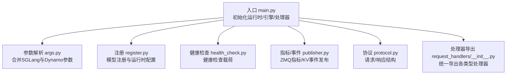
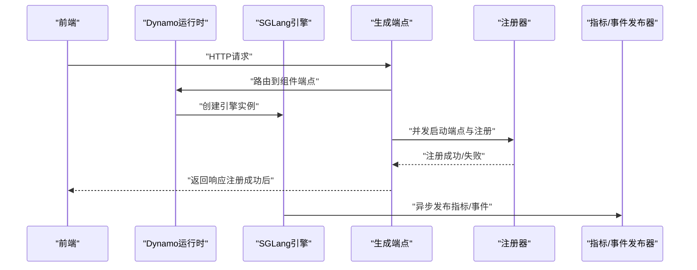
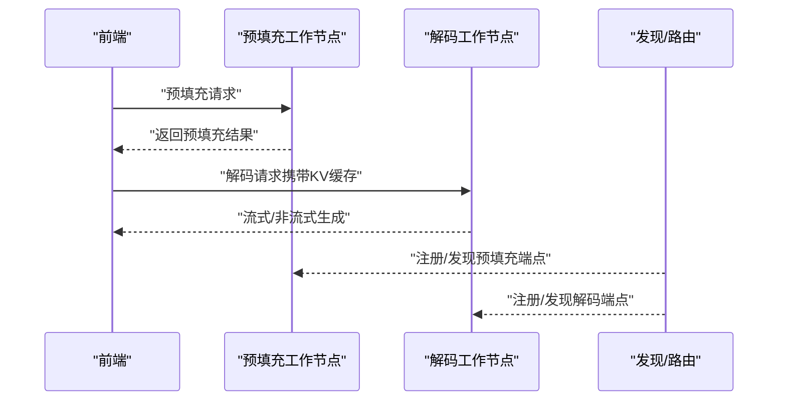
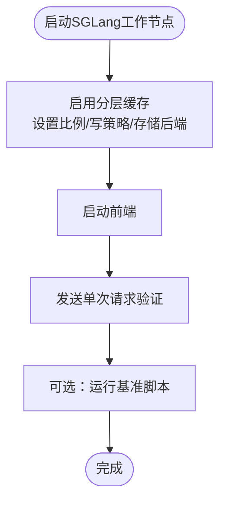
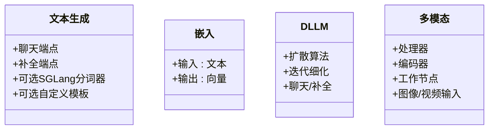
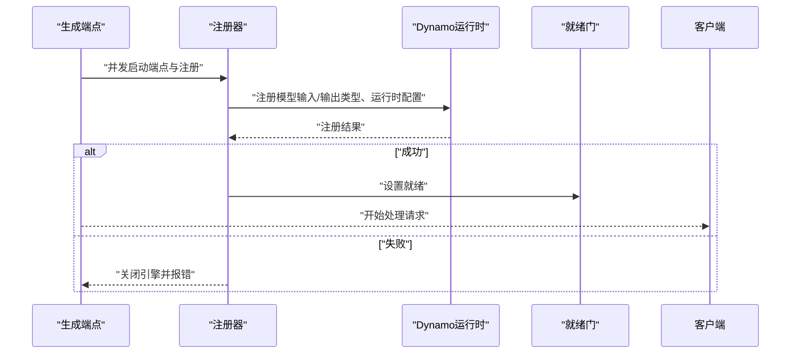
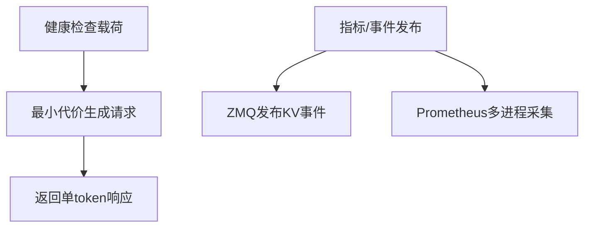
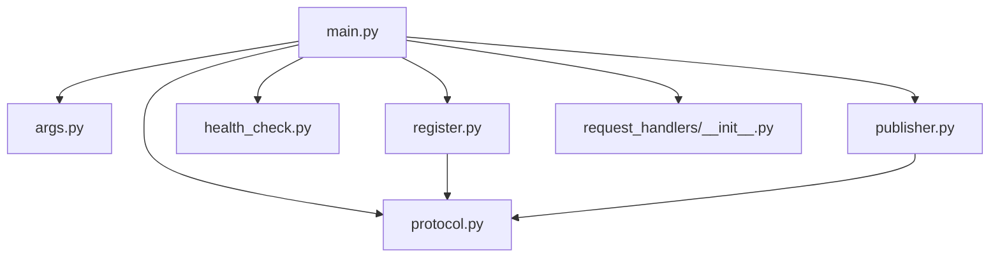

# 模型集成

<cite>
**本文引用的文件**
- [components/src/dynamo/sglang/main.py](file://components/src/dynamo/sglang/main.py)
- [components/src/dynamo/sglang/register.py](file://components/src/dynamo/sglang/register.py)
- [components/src/dynamo/sglang/args.py](file://components/src/dynamo/sglang/args.py)
- [components/src/dynamo/sglang/protocol.py](file://components/src/dynamo/sglang/protocol.py)
- [components/src/dynamo/sglang/health_check.py](file://components/src/dynamo/sglang/health_check.py)
- [components/src/dynamo/sglang/publisher.py](file://components/src/dynamo/sglang/publisher.py)
- [components/src/dynamo/sglang/request_handlers/__init__.py](file://components/src/dynamo/sglang/request_handlers/__init__.py)
- [docs/backends/sglang/gpt-oss.md](file://docs/backends/sglang/gpt-oss.md)
- [docs/backends/sglang/sgl-hicache-example.md](file://docs/backends/sglang/sgl-hicache-example.md)
- [docs/backends/sglang/diffusion-lm.md](file://docs/backends/sglang/diffusion-lm.md)
- [examples/backends/sglang/deploy/README.md](file://examples/backends/sglang/deploy/README.md)
</cite>

## 目录
1. [简介](#简介)
2. [项目结构](#项目结构)
3. [核心组件](#核心组件)
4. [架构总览](#架构总览)
5. [详细组件分析](#详细组件分析)
6. [依赖关系分析](#依赖关系分析)
7. [性能考量](#性能考量)
8. [故障排查指南](#故障排查指南)
9. [结论](#结论)
10. [附录](#附录)

## 简介
本章节面向希望在Dynamo平台中集成SGLang后端的开发者，系统性说明以下主题：
- 支持GPT-OSS等推理模型的配置与参数设置，以及推理流程
- SDL HiCache（分层缓存）示例，展示如何通过HiCache优化KV缓存与吞吐
- 不同模型类型的适配策略：文本生成、嵌入、扩散模型的特殊处理
- 模型注册机制与“就绪门”控制，确保模型加载完成后才对外提供服务
- 配置示例与部署指南，覆盖本地与Kubernetes环境
- 性能调优与故障排查建议，帮助构建稳定高效的模型服务

## 项目结构
SGLang后端位于components/src/dynamo/sglang目录，主要由以下模块组成：
- 入口与运行时：main.py负责解析参数、初始化分布式运行时、启动引擎与处理器，并设置就绪门与健康检查
- 注册与发现：register.py负责将模型注册到Dynamo运行时并发布运行时配置
- 参数解析：args.py定义SGLang与Dynamo的联合参数解析逻辑，含多模态、嵌入、扩散等模式
- 协议与数据结构：protocol.py定义标准LLM协议、嵌入请求、多模态请求及拆分聚合请求结构
- 健康检查：health_check.py提供SGLang专用健康检查载荷，兼容文本输入与token输入
- 指标与事件：publisher.py负责从SGLang收集指标并通过ZMQ发布KV事件
- 请求处理器导出：request_handlers/__init__.py统一导出各类处理器

图表来源
- [components/src/dynamo/sglang/main.py](file://components/src/dynamo/sglang/main.py#L69-L123)
- [components/src/dynamo/sglang/args.py](file://components/src/dynamo/sglang/args.py#L324-L585)
- [components/src/dynamo/sglang/register.py](file://components/src/dynamo/sglang/register.py#L18-L68)
- [components/src/dynamo/sglang/health_check.py](file://components/src/dynamo/sglang/health_check.py#L50-L86)
- [components/src/dynamo/sglang/publisher.py](file://components/src/dynamo/sglang/publisher.py#L170-L200)
- [components/src/dynamo/sglang/protocol.py](file://components/src/dynamo/sglang/protocol.py#L42-L67)
- [components/src/dynamo/sglang/request_handlers/__init__.py](file://components/src/dynamo/sglang/request_handlers/__init__.py#L21-L34)

章节来源
- [components/src/dynamo/sglang/main.py](file://components/src/dynamo/sglang/main.py#L69-L123)
- [components/src/dynamo/sglang/args.py](file://components/src/dynamo/sglang/args.py#L324-L585)

## 核心组件
- 运行时与引擎初始化：根据Serving模式（聚合/预填充/解码）与多模态/嵌入/扩散等标志选择对应初始化路径，创建SGLang引擎与Dynamo组件端点
- 就绪门与注册：并发启动HTTP端点与模型注册，使用asyncio.Event作为就绪信号，确保只有在注册成功后才开始处理请求
- 健康检查：为不同模式提供专用健康检查载荷，自动推断BOS token以构造最小代价的探测请求
- 指标与事件：通过ZMQ订阅SGLang调度器指标，发布KV块活跃度事件；可选启用Prometheus多进程采集
- 参数解析：统一解析SGLang与Dynamo参数，自动下载模型、设置默认端点、解析多模态/嵌入/扩散模式

章节来源
- [components/src/dynamo/sglang/main.py](file://components/src/dynamo/sglang/main.py#L125-L210)
- [components/src/dynamo/sglang/register.py](file://components/src/dynamo/sglang/register.py#L224-L265)
- [components/src/dynamo/sglang/health_check.py](file://components/src/dynamo/sglang/health_check.py#L50-L121)
- [components/src/dynamo/sglang/publisher.py](file://components/src/dynamo/sglang/publisher.py#L170-L201)
- [components/src/dynamo/sglang/args.py](file://components/src/dynamo/sglang/args.py#L324-L585)

## 架构总览
下图展示了SGLang后端在Dynamo中的整体交互：前端发起请求，后端按模式初始化相应组件，注册模型并等待就绪门，随后进入请求处理循环。

图表来源
- [components/src/dynamo/sglang/main.py](file://components/src/dynamo/sglang/main.py#L180-L200)
- [components/src/dynamo/sglang/register.py](file://components/src/dynamo/sglang/register.py#L224-L265)
- [components/src/dynamo/sglang/publisher.py](file://components/src/dynamo/sglang/publisher.py#L170-L201)

## 详细组件分析

### GPT-OSS模型支持与推理流程
- 模型特性：GPT-OSS是具备工具调用能力的推理模型，需要在工作节点上启用推理解析器与工具调用解析器
- 启动方式：分别启动解码工作节点与预填充工作节点，使用NIXL作为跨节点传输后端
- 推理流程：预填充阶段进行上下文编码，解码阶段进行增量生成；预填充工作节点在首次请求前执行热身以降低首词延迟

图表来源
- [docs/backends/sglang/gpt-oss.md](file://docs/backends/sglang/gpt-oss.md#L11-L48)
- [components/src/dynamo/sglang/main.py](file://components/src/dynamo/sglang/main.py#L617-L650)

章节来源
- [docs/backends/sglang/gpt-oss.md](file://docs/backends/sglang/gpt-oss.md#L11-L48)
- [components/src/dynamo/sglang/main.py](file://components/src/dynamo/sglang/main.py#L617-L650)

### SDL HiCache示例：分层缓存优化
- 启用方式：通过命令行参数开启分层缓存，设置主机侧缓存与设备侧缓存的比例、写策略与存储后端
- 工作原理：将部分KV缓存迁移到主机内存池，结合NIXL作为主机存储后端，降低显存占用并提升吞吐
- 使用步骤：先启动SGLang工作节点，再启动前端；可选运行基准脚本评估性能

图表来源
- [docs/backends/sglang/sgl-hicache-example.md](file://docs/backends/sglang/sgl-hicache-example.md#L10-L65)

章节来源
- [docs/backends/sglang/sgl-hicache-example.md](file://docs/backends/sglang/sgl-hicache-example.md#L10-L65)

### 不同模型类型的适配策略
- 文本生成（聊天/补全）
  - 默认启用聊天与补全端点类型；可选择使用SGLang内置分词器或Dynamo预处理器
  - 支持自定义Jinja模板（需禁用SGLang内置分词器）
- 嵌入模型
  - 通过嵌入工作节点模式启动，输入类型为文本，输出为向量
- 扩散语言模型（DLLM）
  - 通过算法参数指定扩散算法（如低置信度迭代细化），支持聊天与补全端点
- 多模态
  - 提供处理器、编码器与工作节点三类组件，支持图像/视频输入；解码模式下可连接预填充客户端

图表来源
- [components/src/dynamo/sglang/args.py](file://components/src/dynamo/sglang/args.py#L137-L175)
- [components/src/dynamo/sglang/protocol.py](file://components/src/dynamo/sglang/protocol.py#L42-L67)
- [docs/backends/sglang/diffusion-lm.md](file://docs/backends/sglang/diffusion-lm.md#L45-L49)

章节来源
- [components/src/dynamo/sglang/args.py](file://components/src/dynamo/sglang/args.py#L137-L175)
- [components/src/dynamo/sglang/protocol.py](file://components/src/dynamo/sglang/protocol.py#L42-L67)
- [docs/backends/sglang/diffusion-lm.md](file://docs/backends/sglang/diffusion-lm.md#L45-L49)

### 模型注册机制与就绪门控制
- 注册流程：并发启动HTTP端点与模型注册，注册器提取运行时配置（推理解析器、工具调用解析器、分页大小、批令牌上限等），并向Dynamo注册
- 就绪门：使用asyncio.Event在注册成功后触发，未就绪的请求将排队等待
- 异常处理：注册失败时关闭引擎并抛出错误，避免对外暴露未就绪状态

图表来源
- [components/src/dynamo/sglang/main.py](file://components/src/dynamo/sglang/main.py#L180-L200)
- [components/src/dynamo/sglang/register.py](file://components/src/dynamo/sglang/register.py#L224-L265)

章节来源
- [components/src/dynamo/sglang/main.py](file://components/src/dynamo/sglang/main.py#L180-L200)
- [components/src/dynamo/sglang/register.py](file://components/src/dynamo/sglang/register.py#L224-L265)

### 健康检查与指标/事件发布
- 健康检查载荷：根据是否使用文本输入自动选择prompt或token_ids，并设置极短生成长度与确定性采样参数
- 指标发布：通过ZMQ订阅SGLang调度器指标，发布KV块活跃度事件；可选启用Prometheus多进程采集
- 事件平面：支持NATS与ZMQ两种事件平面，按配置决定是否启用KV事件

图表来源
- [components/src/dynamo/sglang/health_check.py](file://components/src/dynamo/sglang/health_check.py#L50-L121)
- [components/src/dynamo/sglang/publisher.py](file://components/src/dynamo/sglang/publisher.py#L170-L201)

章节来源
- [components/src/dynamo/sglang/health_check.py](file://components/src/dynamo/sglang/health_check.py#L50-L121)
- [components/src/dynamo/sglang/publisher.py](file://components/src/dynamo/sglang/publisher.py#L170-L201)

### 参数解析与配置要点
- 参数来源：合并SGLang ServerArgs与DynamoArgs，自动下载模型、设置默认端点、解析多模态/嵌入/扩散模式
- 关键选项：
  - 端点类型：chat/completions
  - 分词器选择：使用SGLang内置或Dynamo预处理器
  - 自定义模板：与SGLang内置分词器互斥
  - 多模态/嵌入/扩散标志：自动推断工作节点角色
  - 调试与可观测性：日志级别、指标开关、事件平面

章节来源
- [components/src/dynamo/sglang/args.py](file://components/src/dynamo/sglang/args.py#L324-L585)

## 依赖关系分析
SGLang后端模块之间的依赖关系如下：

图表来源
- [components/src/dynamo/sglang/main.py](file://components/src/dynamo/sglang/main.py#L18-L34)
- [components/src/dynamo/sglang/register.py](file://components/src/dynamo/sglang/register.py#L13-L16)
- [components/src/dynamo/sglang/publisher.py](file://components/src/dynamo/sglang/publisher.py#L17-L24)
- [components/src/dynamo/sglang/protocol.py](file://components/src/dynamo/sglang/protocol.py#L6-L9)
- [components/src/dynamo/sglang/request_handlers/__init__.py](file://components/src/dynamo/sglang/request_handlers/__init__.py#L4-L19)

章节来源
- [components/src/dynamo/sglang/main.py](file://components/src/dynamo/sglang/main.py#L18-L34)
- [components/src/dynamo/sglang/register.py](file://components/src/dynamo/sglang/register.py#L13-L16)
- [components/src/dynamo/sglang/publisher.py](file://components/src/dynamo/sglang/publisher.py#L17-L24)
- [components/src/dynamo/sglang/protocol.py](file://components/src/dynamo/sglang/protocol.py#L6-L9)
- [components/src/dynamo/sglang/request_handlers/__init__.py](file://components/src/dynamo/sglang/request_handlers/__init__.py#L4-L19)

## 性能考量
- 预填充热身：在预填充工作节点上执行一次性热身请求，降低首次令牌时间（TTFT）
- 分层缓存（HiCache）：通过主机侧缓存池与NIXL存储后端减少显存压力，提升吞吐
- 流式输出：强制启用SGLang的流式输出，避免累积token带来的开销
- 事件平面与指标：合理配置事件平面与指标采集，避免不必要的网络/磁盘开销
- 批处理与并发：根据max_running_requests与max_prefill_tokens调整批处理规模，平衡延迟与吞吐

章节来源
- [components/src/dynamo/sglang/main.py](file://components/src/dynamo/sglang/main.py#L617-L650)
- [docs/backends/sglang/sgl-hicache-example.md](file://docs/backends/sglang/sgl-hicache-example.md#L10-L28)
- [components/src/dynamo/sglang/args.py](file://components/src/dynamo/sglang/args.py#L524-L542)

## 故障排查指南
- 注册失败
  - 现象：启动后立即报错并关闭引擎
  - 排查：检查模型路径与名称、端点格式、推理解析器与工具调用解析器配置
- 就绪门不触发
  - 现象：请求长时间排队无响应
  - 排查：确认注册流程是否成功、日志中是否存在就绪门设置信息
- 健康检查失败
  - 现象：探活接口异常
  - 排查：确认BOS token获取逻辑、文本输入与token输入模式是否匹配
- 指标/事件异常
  - 现象：指标缺失或事件未发布
  - 排查：检查ZMQ端点格式、IPv6地址括号包裹、事件平面配置与KV事件开关

章节来源
- [components/src/dynamo/sglang/register.py](file://components/src/dynamo/sglang/register.py#L255-L265)
- [components/src/dynamo/sglang/health_check.py](file://components/src/dynamo/sglang/health_check.py#L20-L47)
- [components/src/dynamo/sglang/publisher.py](file://components/src/dynamo/sglang/publisher.py#L27-L49)

## 结论
通过SGLang后端与Dynamo运行时的深度集成，可以高效地支持多种模型类型与 Serving 模式。借助就绪门控制、健康检查、指标与事件发布，以及分层缓存等优化手段，能够构建稳定且高性能的模型服务。建议在生产环境中结合实际硬件与流量特征，持续调优批处理规模、事件平面与缓存策略，并完善监控与告警体系。

## 附录

### 配置示例与部署指南
- GPT-OSS（推理+工具调用）
  - 解码工作节点与预填充工作节点分别启动，使用NIXL传输后端，并启用推理解析器与工具调用解析器
- SDL HiCache（分层缓存）
  - 启用分层缓存、设置缓存比例与写策略、选择NIXL作为主机存储后端
- 扩散语言模型（DLLM）
  - 指定扩散算法（如低置信度迭代细化），支持聊天与补全端点
- Kubernetes部署
  - 参考示例模板，配置容器镜像、工作目录与args，准备HuggingFace密钥后部署

章节来源
- [docs/backends/sglang/gpt-oss.md](file://docs/backends/sglang/gpt-oss.md#L11-L48)
- [docs/backends/sglang/sgl-hicache-example.md](file://docs/backends/sglang/sgl-hicache-example.md#L10-L65)
- [docs/backends/sglang/diffusion-lm.md](file://docs/backends/sglang/diffusion-lm.md#L10-L49)
- [examples/backends/sglang/deploy/README.md](file://examples/backends/sglang/deploy/README.md#L60-L122)