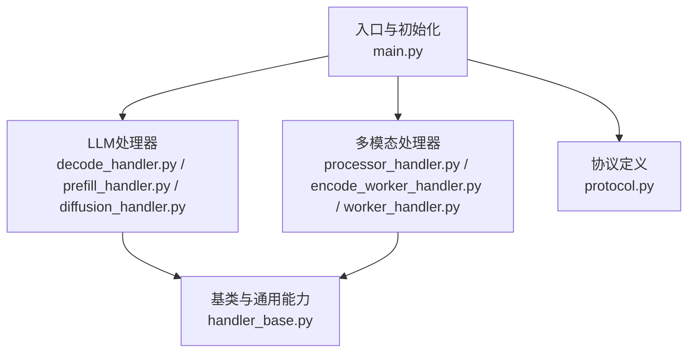
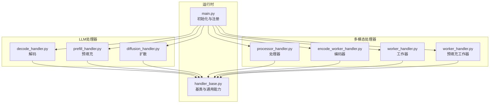
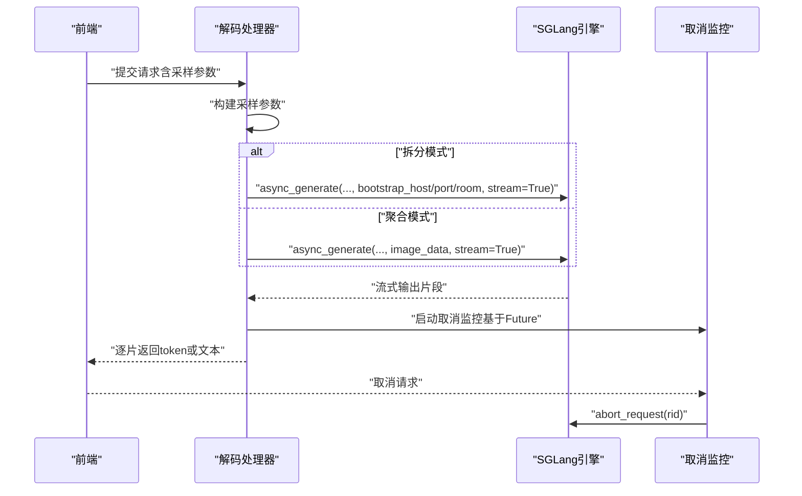
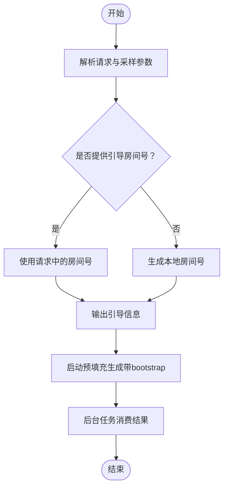
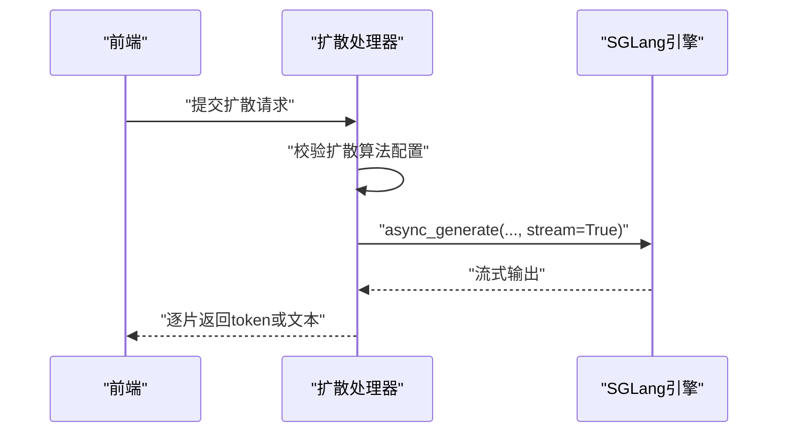
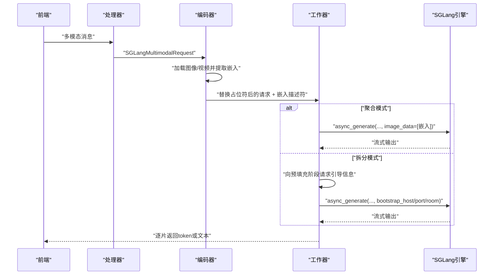
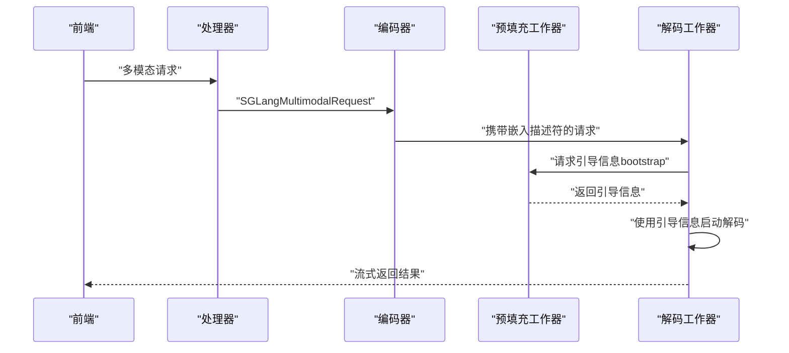
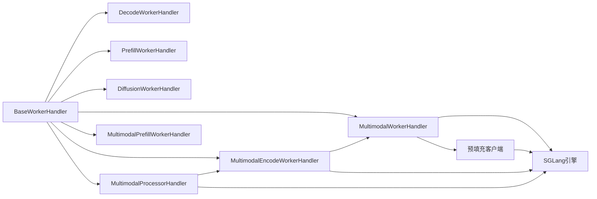

# LLM处理器

<cite>
**本文引用的文件**
- [components/src/dynamo/sglang/main.py](file://components/src/dynamo/sglang/main.py)
- [components/src/dynamo/sglang/request_handlers/__init__.py](file://components/src/dynamo/sglang/request_handlers/__init__.py)
- [components/src/dynamo/sglang/request_handlers/llm/__init__.py](file://components/src/dynamo/sglang/request_handlers/llm/__init__.py)
- [components/src/dynamo/sglang/request_handlers/llm/decode_handler.py](file://components/src/dynamo/sglang/request_handlers/llm/decode_handler.py)
- [components/src/dynamo/sglang/request_handlers/llm/prefill_handler.py](file://components/src/dynamo/sglang/request_handlers/llm/prefill_handler.py)
- [components/src/dynamo/sglang/request_handlers/llm/diffusion_handler.py](file://components/src/dynamo/sglang/request_handlers/llm/diffusion_handler.py)
- [components/src/dynamo/sglang/request_handlers/multimodal/__init__.py](file://components/src/dynamo/sglang/request_handlers/multimodal/__init__.py)
- [components/src/dynamo/sglang/request_handlers/multimodal/processor_handler.py](file://components/src/dynamo/sglang/request_handlers/multimodal/processor_handler.py)
- [components/src/dynamo/sglang/request_handlers/multimodal/encode_worker_handler.py](file://components/src/dynamo/sglang/request_handlers/multimodal/encode_worker_handler.py)
- [components/src/dynamo/sglang/request_handlers/multimodal/worker_handler.py](file://components/src/dynamo/sglang/request_handlers/multimodal/worker_handler.py)
- [components/src/dynamo/sglang/protocol.py](file://components/src/dynamo/sglang/protocol.py)
- [components/src/dynamo/sglang/request_handlers/handler_base.py](file://components/src/dynamo/sglang/request_handlers/handler_base.py)
- [examples/multimodal/components/worker.py](file://examples/multimodal/components/worker.py)
</cite>

## 目录
1. [简介](#简介)
2. [项目结构](#项目结构)
3. [核心组件](#核心组件)
4. [架构总览](#架构总览)
5. [详细组件分析](#详细组件分析)
6. [依赖关系分析](#依赖关系分析)
7. [性能考量](#性能考量)
8. [故障排查指南](#故障排查指南)
9. [结论](#结论)
10. [附录](#附录)

## 简介
本文件系统性梳理 SGLang 在 Dynamo 平台上的 LLM 处理器实现，覆盖以下三类核心处理器：
- 解码处理器（DecodeWorkerHandler）：负责流式响应生成、采样策略与性能优化，支持聚合与拆分两种服务模式。
- 预填充处理器（PrefillWorkerHandler）：在拆分模式下提供预填充阶段的 KV 缓存与引导信息，支撑后续解码阶段。
- 扩散语言模型处理器（DiffusionWorkerHandler）：基于 SGLang 的扩散算法，面向特定图像生成任务的推理流程。

同时，文档涵盖多模态链路（文本+图像/视频）在聚合与拆分模式下的端到端处理路径，并给出初始化、请求处理与结果返回的关键流程图与路径引用，帮助开发者按需选择处理器类型并进行性能调优。

## 项目结构
SGLang 组件位于 components/src/dynamo/sglang 下，按职责划分为：
- 入口与初始化：main.py 负责解析参数、构建引擎、注册端点、启动指标与健康检查。
- 请求处理器：llm 与 multimodal 子包分别实现纯文本与多模态的解码、预填充、编码与处理器等。
- 协议定义：protocol.py 定义标准 LLM 与多模态请求/响应数据结构。
- 基类与通用能力：handler_base.py 提供输入参数管理、取消监控、内存占用释放/恢复、追踪头注入等通用能力。

图表来源
- [components/src/dynamo/sglang/main.py](file://components/src/dynamo/sglang/main.py#L125-L434)
- [components/src/dynamo/sglang/request_handlers/llm/decode_handler.py](file://components/src/dynamo/sglang/request_handlers/llm/decode_handler.py#L17-L56)
- [components/src/dynamo/sglang/request_handlers/llm/prefill_handler.py](file://components/src/dynamo/sglang/request_handlers/llm/prefill_handler.py#L16-L54)
- [components/src/dynamo/sglang/request_handlers/llm/diffusion_handler.py](file://components/src/dynamo/sglang/request_handlers/llm/diffusion_handler.py#L14-L53)
- [components/src/dynamo/sglang/request_handlers/multimodal/processor_handler.py](file://components/src/dynamo/sglang/request_handlers/multimodal/processor_handler.py#L28-L55)
- [components/src/dynamo/sglang/request_handlers/multimodal/encode_worker_handler.py](file://components/src/dynamo/sglang/request_handlers/multimodal/encode_worker_handler.py#L37-L92)
- [components/src/dynamo/sglang/request_handlers/multimodal/worker_handler.py](file://components/src/dynamo/sglang/request_handlers/multimodal/worker_handler.py#L227-L262)
- [components/src/dynamo/sglang/protocol.py](file://components/src/dynamo/sglang/protocol.py#L19-L134)
- [components/src/dynamo/sglang/request_handlers/handler_base.py](file://components/src/dynamo/sglang/request_handlers/handler_base.py#L21-L60)

章节来源
- [components/src/dynamo/sglang/main.py](file://components/src/dynamo/sglang/main.py#L125-L434)
- [components/src/dynamo/sglang/request_handlers/__init__.py](file://components/src/dynamo/sglang/request_handlers/__init__.py#L1-L35)
- [components/src/dynamo/sglang/request_handlers/llm/__init__.py](file://components/src/dynamo/sglang/request_handlers/llm/__init__.py#L1-L12)
- [components/src/dynamo/sglang/request_handlers/multimodal/__init__.py](file://components/src/dynamo/sglang/request_handlers/multimodal/__init__.py#L1-L14)

## 核心组件
- 解码处理器（DecodeWorkerHandler）
  - 支持聚合与拆分两种模式；在拆分模式下通过 bootstrap 信息连接预填充阶段的 KV 缓存。
  - 提供 token 流与文本流两种输出格式，自动注入完成原因与用量统计。
  - 内置取消监控，确保请求被取消时能及时中止引擎生成。
- 预填充处理器（PrefillWorkerHandler）
  - 仅在拆分模式下工作，负责生成引导房间号与引导信息，随后执行预填充生成并消费结果。
  - 通过异步任务持续消费引擎输出，避免阻塞。
- 扩散语言模型处理器（DiffusionWorkerHandler）
  - 继承解码处理器，面向扩散算法的推理；要求引擎已配置扩散算法参数。
  - 输出格式与解码处理器一致，便于统一接入。
- 多模态处理器族
  - 处理器（MultimodalProcessorHandler）：将用户侧多模态消息转换为 SGLang 可用的对话模板与输入，转发给编码器。
  - 编码器（MultimodalEncodeWorkerHandler）：加载图像/视频，提取嵌入，替换占位符为对应数量的图像 token，并通过 RDMA 描述符传递嵌入给下游。
  - 工作器（MultimodalWorkerHandler）：在聚合模式直接注入图像数据；在拆分模式向预填充阶段请求引导信息后进入解码阶段。
  - 预填充工作器（MultimodalPrefillWorkerHandler）：在拆分模式下接收编码器传来的嵌入，启动预填充生成并消费结果。

章节来源
- [components/src/dynamo/sglang/request_handlers/llm/decode_handler.py](file://components/src/dynamo/sglang/request_handlers/llm/decode_handler.py#L17-L56)
- [components/src/dynamo/sglang/request_handlers/llm/prefill_handler.py](file://components/src/dynamo/sglang/request_handlers/llm/prefill_handler.py#L16-L54)
- [components/src/dynamo/sglang/request_handlers/llm/diffusion_handler.py](file://components/src/dynamo/sglang/request_handlers/llm/diffusion_handler.py#L14-L53)
- [components/src/dynamo/sglang/request_handlers/multimodal/processor_handler.py](file://components/src/dynamo/sglang/request_handlers/multimodal/processor_handler.py#L28-L55)
- [components/src/dynamo/sglang/request_handlers/multimodal/encode_worker_handler.py](file://components/src/dynamo/sglang/request_handlers/multimodal/encode_worker_handler.py#L37-L92)
- [components/src/dynamo/sglang/request_handlers/multimodal/worker_handler.py](file://components/src/dynamo/sglang/request_handlers/multimodal/worker_handler.py#L227-L262)
- [components/src/dynamo/sglang/request_handlers/multimodal/worker_handler.py](file://components/src/dynamo/sglang/request_handlers/multimodal/worker_handler.py#L408-L426)

## 架构总览
SGLang 在 Dynamo 中的运行时由入口模块统一初始化，根据配置选择不同处理器并注册端点。处理器通过基类提供的输入参数管理、取消监控与追踪头注入等能力，保证请求在聚合或拆分模式下的正确流转。

图表来源
- [components/src/dynamo/sglang/main.py](file://components/src/dynamo/sglang/main.py#L125-L434)
- [components/src/dynamo/sglang/request_handlers/handler_base.py](file://components/src/dynamo/sglang/request_handlers/handler_base.py#L21-L60)
- [components/src/dynamo/sglang/request_handlers/llm/decode_handler.py](file://components/src/dynamo/sglang/request_handlers/llm/decode_handler.py#L17-L56)
- [components/src/dynamo/sglang/request_handlers/llm/prefill_handler.py](file://components/src/dynamo/sglang/request_handlers/llm/prefill_handler.py#L16-L54)
- [components/src/dynamo/sglang/request_handlers/llm/diffusion_handler.py](file://components/src/dynamo/sglang/request_handlers/llm/diffusion_handler.py#L14-L53)
- [components/src/dynamo/sglang/request_handlers/multimodal/processor_handler.py](file://components/src/dynamo/sglang/request_handlers/multimodal/processor_handler.py#L28-L55)
- [components/src/dynamo/sglang/request_handlers/multimodal/encode_worker_handler.py](file://components/src/dynamo/sglang/request_handlers/multimodal/encode_worker_handler.py#L37-L92)
- [components/src/dynamo/sglang/request_handlers/multimodal/worker_handler.py](file://components/src/dynamo/sglang/request_handlers/multimodal/worker_handler.py#L227-L262)

## 详细组件分析

### 解码处理器（DecodeWorkerHandler）
- 初始化与清理
  - 初始化时记录服务模式（聚合/拆分），并在清理时关闭引擎。
- 采样参数构建
  - 支持两类输入格式：令牌级请求与 OpenAI 风格请求，映射温度、top_p、top_k、最大新 token 数与忽略 EOS 等参数。
- 请求处理
  - 拆分模式：必须提供 bootstrap 信息（主机、端口、房间），随后以流式方式调用引擎生成；根据是否跳过分词器决定输出 token 流或文本流。
  - 聚合模式：可直接传入图像数据，其余逻辑同上。
- 流式输出
  - token 流：透传引擎返回的离散 token 片段，附加完成原因与用量统计。
  - 文本流：封装为 OpenAI 兼容的增量块，包含角色与内容增量。
- 取消与追踪
  - 使用 Future 模式在首个响应到达后获取 SGLang 请求 ID，并通过后台任务监听上下文取消，调用引擎中止请求。
- 性能优化要点
  - 保持 stream_output=true，减少重复输出开销。
  - 合理设置采样参数，避免过度采样导致的额外计算。

图表来源
- [components/src/dynamo/sglang/request_handlers/llm/decode_handler.py](file://components/src/dynamo/sglang/request_handlers/llm/decode_handler.py#L89-L177)
- [components/src/dynamo/sglang/request_handlers/handler_base.py](file://components/src/dynamo/sglang/request_handlers/handler_base.py#L345-L393)

章节来源
- [components/src/dynamo/sglang/request_handlers/llm/decode_handler.py](file://components/src/dynamo/sglang/request_handlers/llm/decode_handler.py#L17-L56)
- [components/src/dynamo/sglang/request_handlers/llm/decode_handler.py](file://components/src/dynamo/sglang/request_handlers/llm/decode_handler.py#L89-L177)
- [components/src/dynamo/sglang/request_handlers/llm/decode_handler.py](file://components/src/dynamo/sglang/request_handlers/llm/decode_handler.py#L179-L300)
- [components/src/dynamo/sglang/request_handlers/handler_base.py](file://components/src/dynamo/sglang/request_handlers/handler_base.py#L345-L393)

### 预填充处理器（PrefillWorkerHandler）
- 初始化
  - 从引擎提取引导主机与端口，生成本地引导房间号。
- 请求处理
  - 解析内部请求与采样参数，优先使用请求中提供的引导房间号；否则自动生成。
  - 首个输出携带引导信息（用于后续解码阶段），随后启动预填充生成并将结果交由后台任务消费。
- 取消与追踪
  - 通过 Future 获取请求 ID 并在取消时触发引擎中止；无需显式检查取消状态。

图表来源
- [components/src/dynamo/sglang/request_handlers/llm/prefill_handler.py](file://components/src/dynamo/sglang/request_handlers/llm/prefill_handler.py#L56-L136)
- [components/src/dynamo/sglang/request_handlers/handler_base.py](file://components/src/dynamo/sglang/request_handlers/handler_base.py#L216-L273)

章节来源
- [components/src/dynamo/sglang/request_handlers/llm/prefill_handler.py](file://components/src/dynamo/sglang/request_handlers/llm/prefill_handler.py#L16-L54)
- [components/src/dynamo/sglang/request_handlers/llm/prefill_handler.py](file://components/src/dynamo/sglang/request_handlers/llm/prefill_handler.py#L56-L136)

### 扩散语言模型处理器（DiffusionWorkerHandler）
- 初始化校验
  - 检查引擎是否配置了扩散算法参数，若未配置则记录警告。
- 请求处理
  - 与解码处理器类似，构建输入参数与采样参数，开启流式生成；根据是否跳过分词器选择输出格式。
- 清理
  - 调用父类清理流程。

图表来源
- [components/src/dynamo/sglang/request_handlers/llm/diffusion_handler.py](file://components/src/dynamo/sglang/request_handlers/llm/diffusion_handler.py#L54-L95)

章节来源
- [components/src/dynamo/sglang/request_handlers/llm/diffusion_handler.py](file://components/src/dynamo/sglang/request_handlers/llm/diffusion_handler.py#L14-L53)
- [components/src/dynamo/sglang/request_handlers/llm/diffusion_handler.py](file://components/src/dynamo/sglang/request_handlers/llm/diffusion_handler.py#L54-L95)

### 多模态处理器（聚合与拆分）
- 处理器（MultimodalProcessorHandler）
  - 将用户侧多模态消息转换为 SGLang 对话模板与输入，构造 SGLangMultimodalRequest，并转发给编码器。
  - 使用 SGLang 的聊天处理器进行反分词与增量文本拼接，输出 OpenAI 兼容的增量块。
- 编码器（MultimodalEncodeWorkerHandler）
  - 加载图像/视频，使用图像处理器与视觉模型提取嵌入，替换占位符为对应数量的图像 token。
  - 通过 RDMA 描述符将嵌入序列化并传递给下游工作器。
- 工作器（MultimodalWorkerHandler）
  - 聚合模式：直接将图像嵌入注入到引擎生成中。
  - 拆分模式：向预填充阶段请求引导信息，再进入解码阶段。
- 预填充工作器（MultimodalPrefillWorkerHandler）
  - 接收编码器传来的嵌入，启动预填充生成并消费结果，不对外返回文本。

图表来源
- [components/src/dynamo/sglang/request_handlers/multimodal/processor_handler.py](file://components/src/dynamo/sglang/request_handlers/multimodal/processor_handler.py#L57-L222)
- [components/src/dynamo/sglang/request_handlers/multimodal/encode_worker_handler.py](file://components/src/dynamo/sglang/request_handlers/multimodal/encode_worker_handler.py#L94-L180)
- [components/src/dynamo/sglang/request_handlers/multimodal/worker_handler.py](file://components/src/dynamo/sglang/request_handlers/multimodal/worker_handler.py#L272-L358)
- [components/src/dynamo/sglang/request_handlers/multimodal/worker_handler.py](file://components/src/dynamo/sglang/request_handlers/multimodal/worker_handler.py#L431-L515)

章节来源
- [components/src/dynamo/sglang/request_handlers/multimodal/processor_handler.py](file://components/src/dynamo/sglang/request_handlers/multimodal/processor_handler.py#L28-L55)
- [components/src/dynamo/sglang/request_handlers/multimodal/processor_handler.py](file://components/src/dynamo/sglang/request_handlers/multimodal/processor_handler.py#L57-L222)
- [components/src/dynamo/sglang/request_handlers/multimodal/encode_worker_handler.py](file://components/src/dynamo/sglang/request_handlers/multimodal/encode_worker_handler.py#L37-L92)
- [components/src/dynamo/sglang/request_handlers/multimodal/encode_worker_handler.py](file://components/src/dynamo/sglang/request_handlers/multimodal/encode_worker_handler.py#L94-L180)
- [components/src/dynamo/sglang/request_handlers/multimodal/worker_handler.py](file://components/src/dynamo/sglang/request_handlers/multimodal/worker_handler.py#L227-L262)
- [components/src/dynamo/sglang/request_handlers/multimodal/worker_handler.py](file://components/src/dynamo/sglang/request_handlers/multimodal/worker_handler.py#L272-L358)
- [components/src/dynamo/sglang/request_handlers/multimodal/worker_handler.py](file://components/src/dynamo/sglang/request_handlers/multimodal/worker_handler.py#L408-L426)
- [components/src/dynamo/sglang/request_handlers/multimodal/worker_handler.py](file://components/src/dynamo/sglang/request_handlers/multimodal/worker_handler.py#L431-L515)

### 多模态链路在拆分模式下的端到端流程
- 前端发起请求，经由处理器转换为 SGLang 请求。
- 编码器加载媒体、提取嵌入并替换占位符，将嵌入通过 RDMA 描述符传递给下游。
- 工作器向预填充阶段请求引导信息，随后进入解码阶段。
- 示例参考：在示例工程中展示了如何在拆分模式下更新解码请求的提示 token 与 KV 传输参数，确保解码阶段正确获取 KV 块。

图表来源
- [examples/multimodal/components/worker.py](file://examples/multimodal/components/worker.py#L348-L372)
- [components/src/dynamo/sglang/request_handlers/multimodal/worker_handler.py](file://components/src/dynamo/sglang/request_handlers/multimodal/worker_handler.py#L377-L400)

章节来源
- [examples/multimodal/components/worker.py](file://examples/multimodal/components/worker.py#L348-L372)

## 依赖关系分析
- 组件耦合
  - 所有处理器均继承自 BaseWorkerHandler，共享输入参数管理、取消监控、追踪头注入与内存占用控制等能力。
  - 多模态链路中，处理器依赖编码器客户端，编码器依赖下游工作器客户端；在拆分模式下，工作器依赖预填充客户端。
- 外部依赖
  - SGLang 引擎：提供 async_generate、abort_request、pause/continue generation、内存占用控制等接口。
  - Dynamo 运行时：提供端点注册、实例等待、路由与发现等能力。
  - RDMA 连接器：用于高效传输嵌入等大体积中间数据。

图表来源
- [components/src/dynamo/sglang/request_handlers/handler_base.py](file://components/src/dynamo/sglang/request_handlers/handler_base.py#L21-L60)
- [components/src/dynamo/sglang/request_handlers/llm/decode_handler.py](file://components/src/dynamo/sglang/request_handlers/llm/decode_handler.py#L17-L56)
- [components/src/dynamo/sglang/request_handlers/llm/prefill_handler.py](file://components/src/dynamo/sglang/request_handlers/llm/prefill_handler.py#L16-L54)
- [components/src/dynamo/sglang/request_handlers/llm/diffusion_handler.py](file://components/src/dynamo/sglang/request_handlers/llm/diffusion_handler.py#L14-L53)
- [components/src/dynamo/sglang/request_handlers/multimodal/processor_handler.py](file://components/src/dynamo/sglang/request_handlers/multimodal/processor_handler.py#L28-L55)
- [components/src/dynamo/sglang/request_handlers/multimodal/encode_worker_handler.py](file://components/src/dynamo/sglang/request_handlers/multimodal/encode_worker_handler.py#L37-L92)
- [components/src/dynamo/sglang/request_handlers/multimodal/worker_handler.py](file://components/src/dynamo/sglang/request_handlers/multimodal/worker_handler.py#L227-L262)

章节来源
- [components/src/dynamo/sglang/request_handlers/handler_base.py](file://components/src/dynamo/sglang/request_handlers/handler_base.py#L175-L201)
- [components/src/dynamo/sglang/request_handlers/multimodal/worker_handler.py](file://components/src/dynamo/sglang/request_handlers/multimodal/worker_handler.py#L249-L255)

## 性能考量
- 流式输出与增量传输
  - 保持 stream_output=true，避免重复输出与额外拷贝，降低首 token 时间（TTFT）与续行延迟。
- 采样参数优化
  - 合理设置温度、top_p/top_k、最大新 token 数等，避免过度采样导致的无效计算。
- 拆分模式预热
  - 预填充阶段可通过暖启请求减少深度 GEMM 预缓存的首次耗时，提升整体吞吐。
- 内存占用控制
  - 在需要时调用 release/resume memory occupation 有序释放/恢复 KV 缓存、权重与 CUDA 图，配合暂停/继续生成，确保安全切换。
- 取消与资源回收
  - 取消监控确保请求被中止后及时回收资源，避免僵尸任务与内存泄漏。

章节来源
- [components/src/dynamo/sglang/main.py](file://components/src/dynamo/sglang/main.py#L617-L650)
- [components/src/dynamo/sglang/request_handlers/handler_base.py](file://components/src/dynamo/sglang/request_handlers/handler_base.py#L61-L155)
- [components/src/dynamo/sglang/request_handlers/handler_base.py](file://components/src/dynamo/sglang/request_handlers/handler_base.py#L290-L393)

## 故障排查指南
- 解码阶段无输出或提前结束
  - 检查是否正确设置 bootstrap 信息（拆分模式）；确认采样参数与停止条件合理。
  - 若出现“无输出但未完成”的情况，解码处理器会返回错误完成原因，应检查上游预填充阶段是否正常产出 KV。
- 预填充阶段卡住或无响应
  - 确认引导房间号生成与传递正确；检查后台消费任务是否被取消或异常退出。
- 多模态嵌入形状不匹配
  - 常见于 tokenization 变化导致的 token 数与嵌入 patch 数不一致；应核对输入 token 序列长度与嵌入形状，并确保编码器替换占位符逻辑正确。
- 扩散算法未生效
  - 检查引擎是否配置了扩散算法参数；未配置时处理器会记录警告，需修正配置后再试。

章节来源
- [components/src/dynamo/sglang/request_handlers/llm/decode_handler.py](file://components/src/dynamo/sglang/request_handlers/llm/decode_handler.py#L217-L241)
- [components/src/dynamo/sglang/request_handlers/llm/prefill_handler.py](file://components/src/dynamo/sglang/request_handlers/llm/prefill_handler.py#L137-L161)
- [components/src/dynamo/sglang/request_handlers/multimodal/worker_handler.py](file://components/src/dynamo/sglang/request_handlers/multimodal/worker_handler.py#L360-L376)
- [components/src/dynamo/sglang/request_handlers/llm/diffusion_handler.py](file://components/src/dynamo/sglang/request_handlers/llm/diffusion_handler.py#L38-L52)

## 结论
SGLang 在 Dynamo 中提供了完整的 LLM 推理链路：解码处理器负责流式生成与采样控制，预填充处理器在拆分模式下提供 KV 引导，扩散处理器适配特定算法，多模态处理器族覆盖从消息处理到嵌入编码再到生成的全链路。通过统一的基类能力与清晰的端到端流程，开发者可根据业务需求灵活选择聚合或拆分模式，并结合采样参数、内存控制与取消监控等手段实现高性能与高可靠的服务。

## 附录
- 关键数据结构与协议
  - 标准 LLM 协议：StopConditions、SamplingOptions、PreprocessedRequest、DisaggPreprocessedRequest。
  - 多模态协议：MultiModalRequest、MultiModalInput、SglangMultimodalRequest、DisaggSglangMultimodalRequest。
- 使用场景建议
  - 纯文本推理：优先选择解码处理器（聚合或拆分视部署拓扑而定）。
  - 图像/视频生成：使用多模态处理器族，聚合模式适合单机部署，拆分模式适合分布式与大规模并发。
  - 特定扩散任务：启用扩散处理器并确保引擎配置正确。

章节来源
- [components/src/dynamo/sglang/protocol.py](file://components/src/dynamo/sglang/protocol.py#L19-L134)