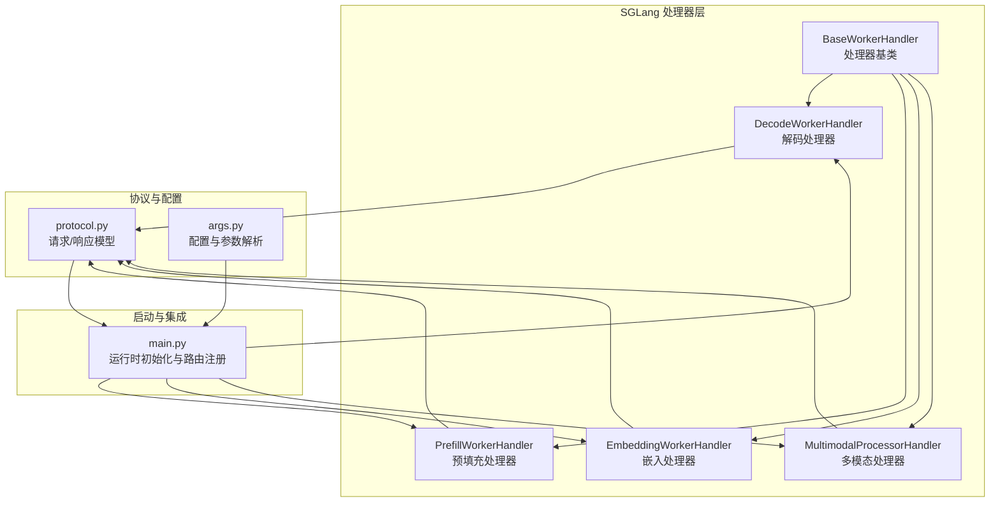
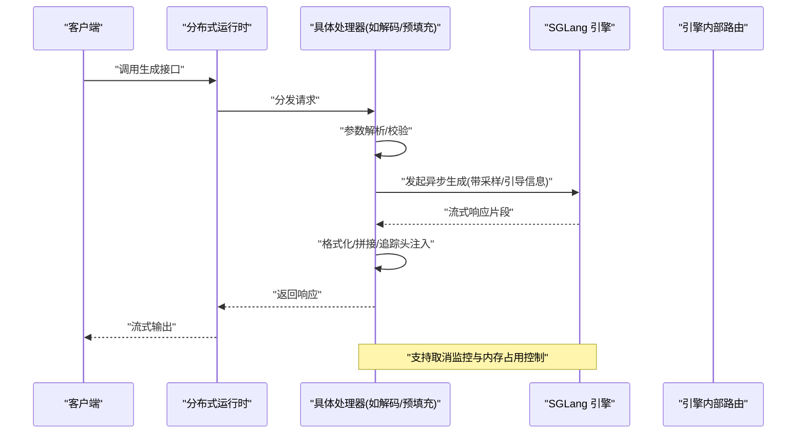
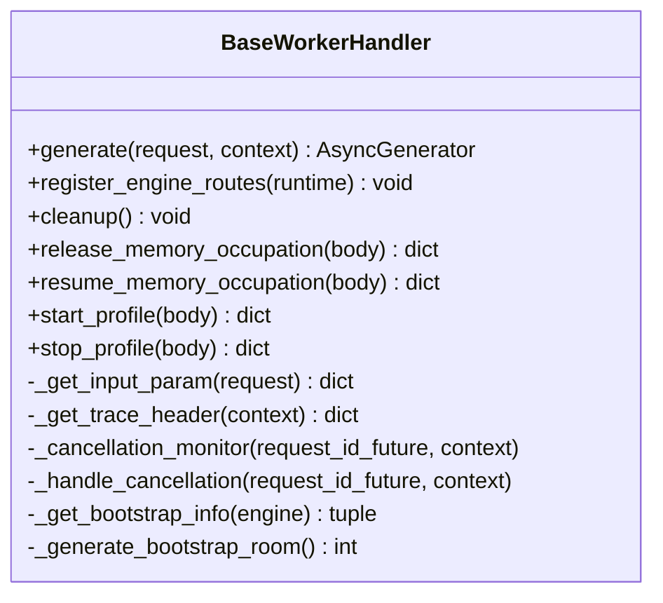
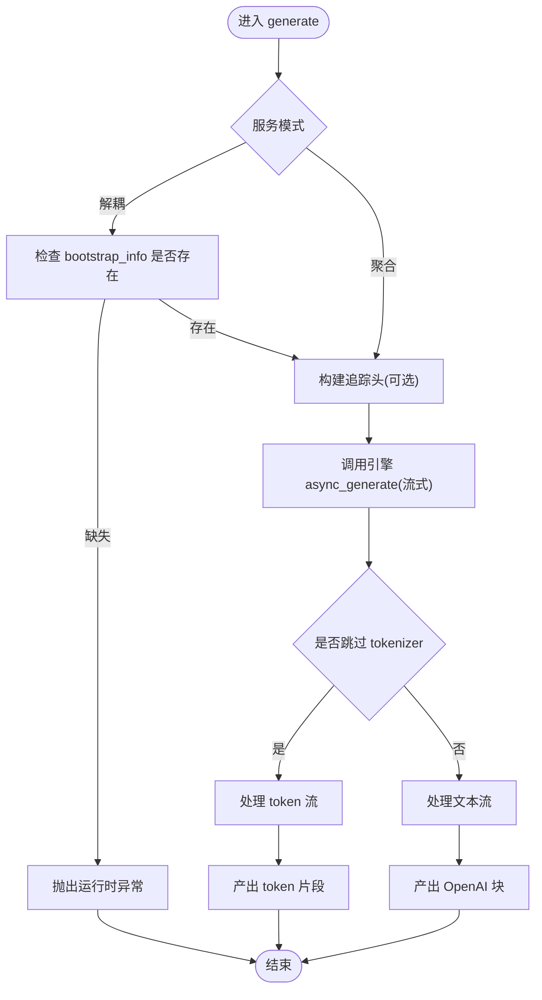
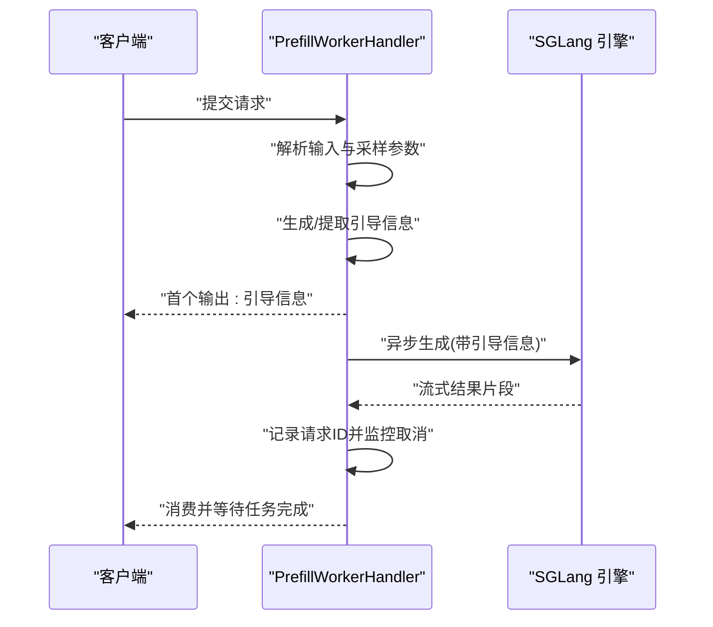
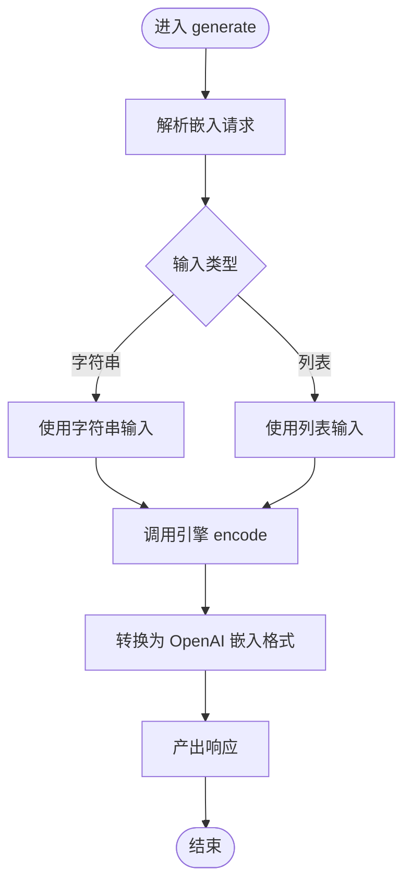
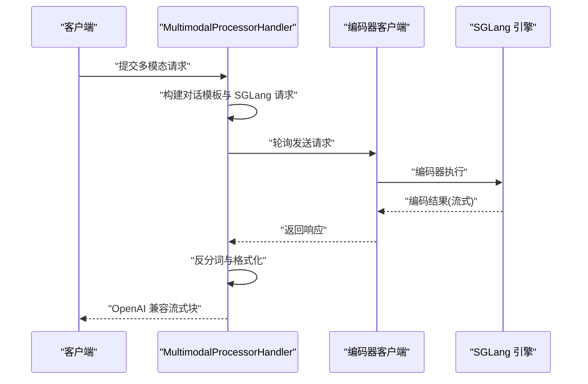
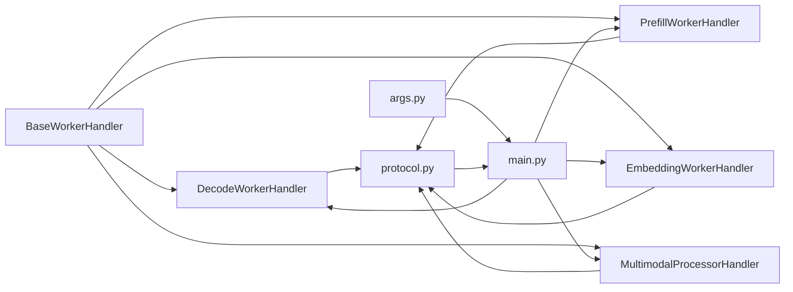

# 处理器基类

<cite>
**本文引用的文件**
- [components/src/dynamo/sglang/request_handlers/handler_base.py](file://components/src/dynamo/sglang/request_handlers/handler_base.py)
- [components/src/dynamo/sglang/request_handlers/llm/decode_handler.py](file://components/src/dynamo/sglang/request_handlers/llm/decode_handler.py)
- [components/src/dynamo/sglang/request_handlers/llm/prefill_handler.py](file://components/src/dynamo/sglang/request_handlers/llm/prefill_handler.py)
- [components/src/dynamo/sglang/request_handlers/embedding/embedding_handler.py](file://components/src/dynamo/sglang/request_handlers/embedding/embedding_handler.py)
- [components/src/dynamo/sglang/request_handlers/multimodal/processor_handler.py](file://components/src/dynamo/sglang/request_handlers/multimodal/processor_handler.py)
- [components/src/dynamo/sglang/protocol.py](file://components/src/dynamo/sglang/protocol.py)
- [components/src/dynamo/sglang/args.py](file://components/src/dynamo/sglang/args.py)
- [components/src/dynamo/sglang/main.py](file://components/src/dynamo/sglang/main.py)
- [tests/serve/test_sglang.py](file://tests/serve/test_sglang.py)
</cite>

## 目录
1. [简介](#简介)
2. [项目结构](#项目结构)
3. [核心组件](#核心组件)
4. [架构总览](#架构总览)
5. [详细组件分析](#详细组件分析)
6. [依赖关系分析](#依赖关系分析)
7. [性能考量](#性能考量)
8. [故障排查指南](#故障排查指南)
9. [结论](#结论)
10. [附录](#附录)

## 简介
本文件面向 SGLang 处理器基类，系统性阐述其设计模式与架构原则，覆盖通用接口定义、生命周期管理、错误处理与资源管理策略；详解基类提供的公共能力（请求验证、参数解析、响应格式化、性能监控）；说明继承体系的设计思路与代码复用路径；并给出可直接参考的使用示例与最佳实践，帮助开发者正确继承与扩展处理器基类。

## 项目结构
SGLang 处理器位于组件子模块中，采用“按功能域分层 + 按职责细分”的组织方式：
- 基类：统一抽象与通用能力
- 具体处理器：按业务类型拆分（LLM 解码、预填充、嵌入、多模态）
- 协议与配置：定义输入输出模型与运行时参数
- 启动入口：根据配置选择初始化路径与处理器实例

图表来源
- [components/src/dynamo/sglang/request_handlers/handler_base.py](file://components/src/dynamo/sglang/request_handlers/handler_base.py#L21-L393)
- [components/src/dynamo/sglang/request_handlers/llm/decode_handler.py](file://components/src/dynamo/sglang/request_handlers/llm/decode_handler.py#L17-L300)
- [components/src/dynamo/sglang/request_handlers/llm/prefill_handler.py](file://components/src/dynamo/sglang/request_handlers/llm/prefill_handler.py#L16-L161)
- [components/src/dynamo/sglang/request_handlers/embedding/embedding_handler.py](file://components/src/dynamo/sglang/request_handlers/embedding/embedding_handler.py#L16-L86)
- [components/src/dynamo/sglang/request_handlers/multimodal/processor_handler.py](file://components/src/dynamo/sglang/request_handlers/multimodal/processor_handler.py#L28-L222)
- [components/src/dynamo/sglang/protocol.py](file://components/src/dynamo/sglang/protocol.py#L1-L134)
- [components/src/dynamo/sglang/args.py](file://components/src/dynamo/sglang/args.py#L183-L640)
- [components/src/dynamo/sglang/main.py](file://components/src/dynamo/sglang/main.py#L69-L664)

章节来源
- [components/src/dynamo/sglang/main.py](file://components/src/dynamo/sglang/main.py#L69-L210)
- [components/src/dynamo/sglang/args.py](file://components/src/dynamo/sglang/args.py#L183-L200)

## 核心组件
- 处理器基类 BaseWorkerHandler：定义统一的生成接口、生命周期钩子、内存占用控制、性能剖析、取消监控与追踪头注入等通用能力。
- 具体处理器：
  - 解码处理器 DecodeWorkerHandler：支持聚合与解耦两种服务模式，负责流式输出 token 或文本。
  - 预填充处理器 PrefillWorkerHandler：在解耦模式下提供引导信息（主机、端口、房间号），并消费结果。
  - 嵌入处理器 EmbeddingWorkerHandler：将输入转换为嵌入向量，并返回 OpenAI 风格的响应。
  - 多模态处理器 MultimodalProcessorHandler：将用户消息转换为 SGLang 可用的对话模板，转发给编码器并回传流式响应。
- 协议与配置：定义请求/响应数据结构、采样参数、停止条件、多模态消息与输入等；配置解析器负责合并 CLI 与配置文件、推导服务模式与端点。
- 启动入口：根据配置选择初始化路径，构造引擎与处理器，注册引擎内部路由与前端服务端点。

章节来源
- [components/src/dynamo/sglang/request_handlers/handler_base.py](file://components/src/dynamo/sglang/request_handlers/handler_base.py#L21-L393)
- [components/src/dynamo/sglang/request_handlers/llm/decode_handler.py](file://components/src/dynamo/sglang/request_handlers/llm/decode_handler.py#L17-L300)
- [components/src/dynamo/sglang/request_handlers/llm/prefill_handler.py](file://components/src/dynamo/sglang/request_handlers/llm/prefill_handler.py#L16-L161)
- [components/src/dynamo/sglang/request_handlers/embedding/embedding_handler.py](file://components/src/dynamo/sglang/request_handlers/embedding/embedding_handler.py#L16-L86)
- [components/src/dynamo/sglang/request_handlers/multimodal/processor_handler.py](file://components/src/dynamo/sglang/request_handlers/multimodal/processor_handler.py#L28-L222)
- [components/src/dynamo/sglang/protocol.py](file://components/src/dynamo/sglang/protocol.py#L1-L134)
- [components/src/dynamo/sglang/args.py](file://components/src/dynamo/sglang/args.py#L183-L640)
- [components/src/dynamo/sglang/main.py](file://components/src/dynamo/sglang/main.py#L69-L664)

## 架构总览
SGLang 处理器基类通过统一接口与通用能力，屏蔽不同后端与服务模式的差异，向上提供一致的生成与生命周期管理体验。整体交互如下：

图表来源
- [components/src/dynamo/sglang/request_handlers/handler_base.py](file://components/src/dynamo/sglang/request_handlers/handler_base.py#L190-L201)
- [components/src/dynamo/sglang/request_handlers/llm/decode_handler.py](file://components/src/dynamo/sglang/request_handlers/llm/decode_handler.py#L89-L177)
- [components/src/dynamo/sglang/request_handlers/llm/prefill_handler.py](file://components/src/dynamo/sglang/request_handlers/llm/prefill_handler.py#L56-L135)
- [components/src/dynamo/sglang/main.py](file://components/src/dynamo/sglang/main.py#L158-L210)

## 详细组件分析

### 处理器基类 BaseWorkerHandler
- 设计要点
  - 抽象接口：定义 generate 方法作为统一生成入口，返回异步生成器，便于流式输出。
  - 生命周期：提供 register_engine_routes 注册引擎内部路由（如内存占用释放/恢复、性能剖析），cleanup 资源清理钩子。
  - 请求处理：封装输入参数获取（基于 tokenizer 或 token 列表）、采样参数映射、追踪头注入。
  - 取消与安全：提供 _cancellation_monitor 上下文管理器与 _handle_cancellation 异步任务，确保在上下文取消时能及时中断引擎请求。
  - 内存与发现：release_memory_occupation/resume_memory_occupation 提供安全的 GPU 内存占用控制，并与服务发现注册/反注册配合。
  - 引导信息：在解耦模式下生成或提取引导信息（主机、端口、房间号），用于下游 decode worker 连接。
- 关键方法与职责
  - generate：抽象方法，由子类实现具体逻辑。
  - register_engine_routes：注册引擎内部管理路由。
  - _get_input_param/_build_sampling_params：请求参数解析与映射。
  - _get_trace_header：注入外部追踪头。
  - _cancellation_monitor/_handle_cancellation：取消监控与清理。
  - release_memory_occupation/resume_memory_occupation：内存占用控制。
  - _get_bootstrap_info/_generate_bootstrap_room：引导信息生成与解析。

图表来源
- [components/src/dynamo/sglang/request_handlers/handler_base.py](file://components/src/dynamo/sglang/request_handlers/handler_base.py#L21-L393)

章节来源
- [components/src/dynamo/sglang/request_handlers/handler_base.py](file://components/src/dynamo/sglang/request_handlers/handler_base.py#L21-L393)

### 解码处理器 DecodeWorkerHandler
- 功能特性
  - 支持聚合与解耦两种模式：解耦模式下必须提供 bootstrap_info，否则抛出异常。
  - 流式输出：根据是否跳过 tokenizer 初始化，分别输出 token 序列或 OpenAI 风格文本块。
  - 取消监控：在流式过程中检查上下文状态，必要时触发引擎侧 abort_request。
  - 追踪头注入：当启用追踪时，将 trace_id/span_id 注入到外部追踪头参数。
- 参数解析
  - 当 skip_tokenizer_init 为真时，从 token 基础格式解析采样参数；否则从 OpenAI 格式解析。
- 输出格式
  - token 模式：仅返回新增 token 与完成原因。
  - 文本模式：返回 OpenAI chat.completion.chunk 格式，包含索引、增量内容与完成原因。

图表来源
- [components/src/dynamo/sglang/request_handlers/llm/decode_handler.py](file://components/src/dynamo/sglang/request_handlers/llm/decode_handler.py#L89-L177)
- [components/src/dynamo/sglang/request_handlers/handler_base.py](file://components/src/dynamo/sglang/request_handlers/handler_base.py#L275-L393)

章节来源
- [components/src/dynamo/sglang/request_handlers/llm/decode_handler.py](file://components/src/dynamo/sglang/request_handlers/llm/decode_handler.py#L17-L300)

### 预填充处理器 PrefillWorkerHandler
- 功能特性
  - 在解耦模式下生成引导信息（bootstrap_host/port/room），并立即作为首个输出返回，满足异步生成器契约。
  - 将输入参数与采样参数传递给引擎，消费结果但不进行额外处理，交由取消监控保障生命周期。
  - 维护后台任务集合，统一清理。
- 引导信息
  - 若请求中已携带 bootstrap_room，则优先使用；否则本地生成随机房间号。
- 取消与清理
  - 使用 Future 记录首次请求 ID，结合取消监控自动中断生成。

图表来源
- [components/src/dynamo/sglang/request_handlers/llm/prefill_handler.py](file://components/src/dynamo/sglang/request_handlers/llm/prefill_handler.py#L56-L135)
- [components/src/dynamo/sglang/request_handlers/handler_base.py](file://components/src/dynamo/sglang/request_handlers/handler_base.py#L290-L393)

章节来源
- [components/src/dynamo/sglang/request_handlers/llm/prefill_handler.py](file://components/src/dynamo/sglang/request_handlers/llm/prefill_handler.py#L16-L161)

### 嵌入处理器 EmbeddingWorkerHandler
- 功能特性
  - 接收 EmbeddingRequest，支持字符串或列表输入。
  - 调用引擎 encode 接口生成嵌入向量。
  - 将结果转换为 OpenAI 风格的嵌入响应，包含对象类型、嵌入数组与使用统计。
- 清理
  - 在 cleanup 中关闭引擎。

图表来源
- [components/src/dynamo/sglang/request_handlers/embedding/embedding_handler.py](file://components/src/dynamo/sglang/request_handlers/embedding/embedding_handler.py#L32-L86)

章节来源
- [components/src/dynamo/sglang/request_handlers/embedding/embedding_handler.py](file://components/src/dynamo/sglang/request_handlers/embedding/embedding_handler.py#L16-L86)

### 多模态处理器 MultimodalProcessorHandler
- 功能特性
  - 将用户消息转换为 SGLang 对话模板，生成 SGLang 请求。
  - 通过客户端轮询发送至编码器工作节点，接收并处理流式响应。
  - 使用 SGLang 的聊天处理器进行反分词，构造 OpenAI 兼容的流式块。
  - 统一清理逻辑。
- 错误处理
  - 对异常进行捕获并返回包含错误信息的最终块。

图表来源
- [components/src/dynamo/sglang/request_handlers/multimodal/processor_handler.py](file://components/src/dynamo/sglang/request_handlers/multimodal/processor_handler.py#L57-L222)

章节来源
- [components/src/dynamo/sglang/request_handlers/multimodal/processor_handler.py](file://components/src/dynamo/sglang/request_handlers/multimodal/processor_handler.py#L28-L222)

### 协议与配置
- 协议模型
  - StopConditions/SamplingOptions：定义停止条件与采样选项。
  - PreprocessedRequest/DisaggPreprocessedRequest：预处理后的请求与解耦场景下的包装。
  - EmbeddingRequest：嵌入请求模型。
  - MultiModalRequest/MultiModalInput/SglangMultimodalRequest：多模态请求与输入模型。
- 配置解析
  - Config 包含 SGLang ServerArgs 与 DynamoArgs，推导服务模式（聚合/预填充/解码）。
  - parse_args 负责合并 CLI 与配置文件、设置默认端点、下载模型、强制流式输出策略等。

章节来源
- [components/src/dynamo/sglang/protocol.py](file://components/src/dynamo/sglang/protocol.py#L1-L134)
- [components/src/dynamo/sglang/args.py](file://components/src/dynamo/sglang/args.py#L183-L640)

### 启动与路由注册
- 启动流程
  - 解析参数与配置，初始化分布式运行时与 SGLang 引擎。
  - 根据配置选择初始化路径（聚合/解耦/嵌入/多模态等）。
  - 实例化对应处理器，注册引擎内部路由与前端服务端点。
- 路由注册
  - 处理器通过 register_engine_routes 注册内存占用控制与性能剖析等内部路由。

章节来源
- [components/src/dynamo/sglang/main.py](file://components/src/dynamo/sglang/main.py#L69-L210)
- [components/src/dynamo/sglang/request_handlers/handler_base.py](file://components/src/dynamo/sglang/request_handlers/handler_base.py#L175-L188)

## 依赖关系分析
- 组件耦合
  - 处理器基类与具体处理器之间为强继承关系，共享通用能力与生命周期。
  - 具体处理器依赖协议模型与配置解析器，确保输入输出一致性与参数合法性。
  - 启动入口负责装配引擎、处理器与运行时，形成闭环。
- 外部依赖
  - SGLang 引擎：提供异步生成、内存占用控制、性能剖析与取消能力。
  - 分布式运行时：提供端点服务、健康检查与注册门控。

图表来源
- [components/src/dynamo/sglang/request_handlers/handler_base.py](file://components/src/dynamo/sglang/request_handlers/handler_base.py#L21-L393)
- [components/src/dynamo/sglang/request_handlers/llm/decode_handler.py](file://components/src/dynamo/sglang/request_handlers/llm/decode_handler.py#L17-L300)
- [components/src/dynamo/sglang/request_handlers/llm/prefill_handler.py](file://components/src/dynamo/sglang/request_handlers/llm/prefill_handler.py#L16-L161)
- [components/src/dynamo/sglang/request_handlers/embedding/embedding_handler.py](file://components/src/dynamo/sglang/request_handlers/embedding/embedding_handler.py#L16-L86)
- [components/src/dynamo/sglang/request_handlers/multimodal/processor_handler.py](file://components/src/dynamo/sglang/request_handlers/multimodal/processor_handler.py#L28-L222)
- [components/src/dynamo/sglang/protocol.py](file://components/src/dynamo/sglang/protocol.py#L1-L134)
- [components/src/dynamo/sglang/args.py](file://components/src/dynamo/sglang/args.py#L183-L640)
- [components/src/dynamo/sglang/main.py](file://components/src/dynamo/sglang/main.py#L69-L210)

## 性能考量
- 流式输出优化
  - 强制 stream_output=True，使引擎发送“自上次输出以来的新 token”片段，避免累积开销，提升首 token 时间表现。
- 解耦模式预热
  - 预填充工作节点在领导节点上执行 dummy 预热请求，降低首次 TTFT。
- 取消与中断
  - 取消监控在首次请求 ID 到达后启动，确保在上下文停止时能及时中断引擎请求，减少无效计算。
- 内存占用控制
  - 释放/恢复内存前先反注册发现与暂停生成，确保安全顺序，避免并发冲突。

章节来源
- [components/src/dynamo/sglang/args.py](file://components/src/dynamo/sglang/args.py#L526-L542)
- [components/src/dynamo/sglang/main.py](file://components/src/dynamo/sglang/main.py#L617-L650)
- [components/src/dynamo/sglang/request_handlers/handler_base.py](file://components/src/dynamo/sglang/request_handlers/handler_base.py#L61-L155)

## 故障排查指南
- 常见问题与定位
  - 解耦模式缺少引导信息：解码处理器会在缺少 bootstrap_info 时抛出运行时异常，需检查预填充阶段是否正确返回引导信息。
  - 取消未生效：确认 _cancellation_monitor 已在生成循环中使用，且首次响应到达后请求 ID 已被设置。
  - 内存释放失败：检查释放/恢复顺序与异常日志，确保在暂停生成后再释放内存。
- 日志与指标
  - 启动入口会打印关键配置与健康检查负载，便于快速核对端点类型与模板设置。
  - 测试用例覆盖聚合/解耦/多模态/嵌入等多种场景，可作为行为参考与回归依据。

章节来源
- [components/src/dynamo/sglang/request_handlers/llm/decode_handler.py](file://components/src/dynamo/sglang/request_handlers/llm/decode_handler.py#L113-L116)
- [components/src/dynamo/sglang/request_handlers/handler_base.py](file://components/src/dynamo/sglang/request_handlers/handler_base.py#L290-L393)
- [components/src/dynamo/sglang/main.py](file://components/src/dynamo/sglang/main.py#L164-L178)
- [tests/serve/test_sglang.py](file://tests/serve/test_sglang.py#L45-L287)

## 结论
SGLang 处理器基类通过统一接口、生命周期管理与通用能力封装，实现了跨模式（聚合/解耦/多模态/嵌入）的一致处理体验。继承体系清晰，复用路径明确，结合参数解析、取消监控、内存控制与性能剖析，能够支撑高可用与高性能的服务场景。建议在扩展时遵循基类约定，重用通用能力，确保行为一致性与可观测性。

## 附录
- 使用示例与扩展模式
  - 聚合解码：在聚合模式下，直接调用引擎 async_generate 并按文本模式输出 OpenAI 兼容块。
  - 解耦解码：在解耦模式下，确保预填充阶段返回引导信息，解码阶段使用该信息连接下游。
  - 嵌入：按 EmbeddingRequest 输入，调用 encode 并转换为 OpenAI 嵌入响应。
  - 多模态：将用户消息转换为 SGLang 对话模板，经编码器处理后回传流式块。
- 最佳实践
  - 明确服务模式：根据配置推导模式，避免在错误模式下调用。
  - 正确使用取消监控：在生成循环中始终包裹 _cancellation_monitor，确保及时中断。
  - 规范内存控制：释放/恢复内存时严格遵循“反注册→暂停→释放/恢复→继续→注册”的顺序。
  - 参数解析一致性：根据 skip_tokenizer_init 选择对应的参数映射策略，保证输入兼容性。
  - 健康检查与端点类型：在启动时提供健康检查负载与端点类型，确保前端正确接入。

章节来源
- [components/src/dynamo/sglang/request_handlers/llm/decode_handler.py](file://components/src/dynamo/sglang/request_handlers/llm/decode_handler.py#L89-L177)
- [components/src/dynamo/sglang/request_handlers/llm/prefill_handler.py](file://components/src/dynamo/sglang/request_handlers/llm/prefill_handler.py#L56-L135)
- [components/src/dynamo/sglang/request_handlers/embedding/embedding_handler.py](file://components/src/dynamo/sglang/request_handlers/embedding/embedding_handler.py#L32-L86)
- [components/src/dynamo/sglang/request_handlers/multimodal/processor_handler.py](file://components/src/dynamo/sglang/request_handlers/multimodal/processor_handler.py#L57-L222)
- [components/src/dynamo/sglang/main.py](file://components/src/dynamo/sglang/main.py#L158-L210)