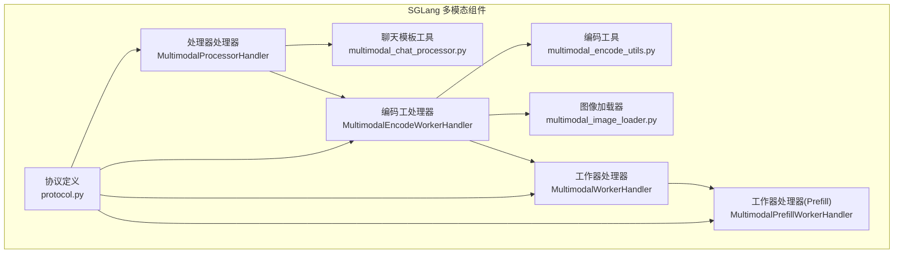
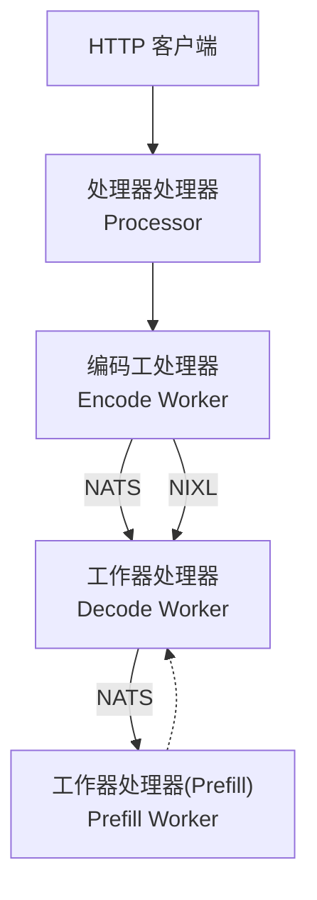
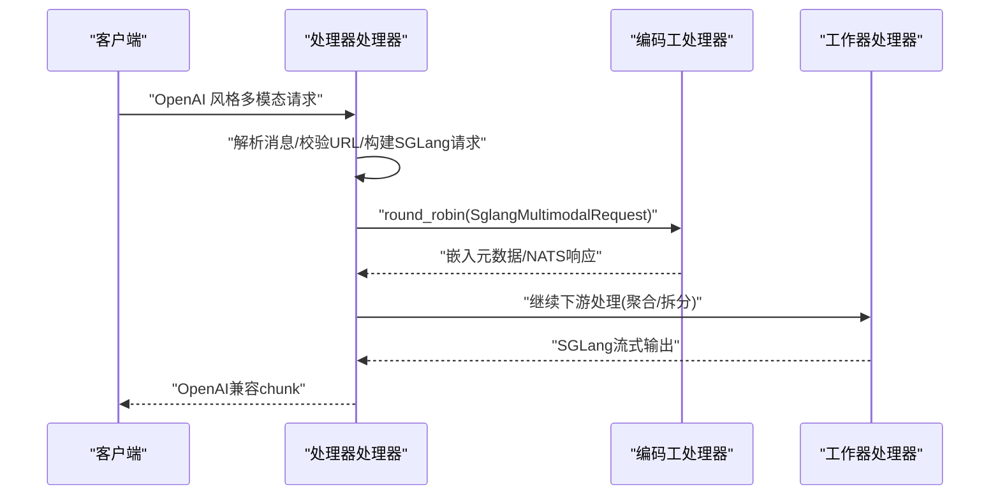
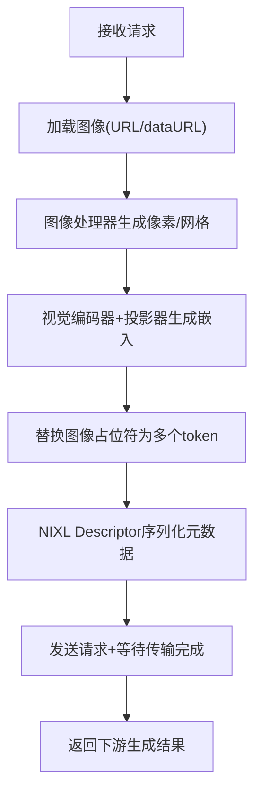
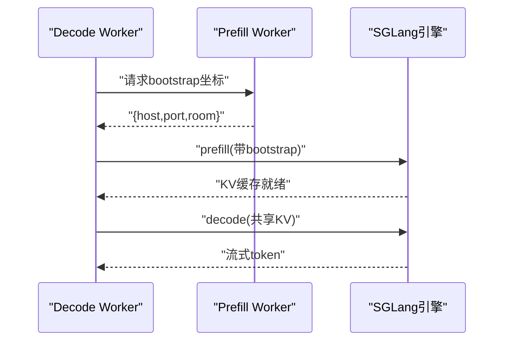
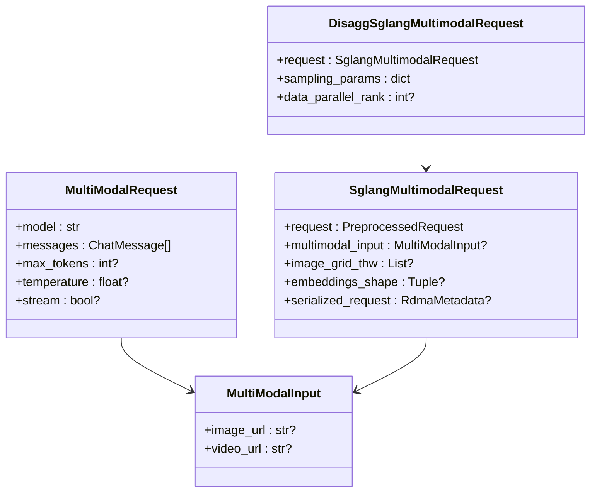
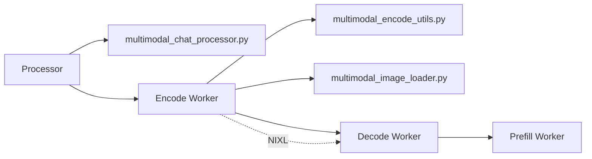

# 多模态处理器

<cite>
**本文引用的文件**
- [components/src/dynamo/sglang/request_handlers/multimodal/processor_handler.py](file://components/src/dynamo/sglang/request_handlers/multimodal/processor_handler.py)
- [components/src/dynamo/sglang/request_handlers/multimodal/encode_worker_handler.py](file://components/src/dynamo/sglang/request_handlers/multimodal/encode_worker_handler.py)
- [components/src/dynamo/sglang/request_handlers/multimodal/worker_handler.py](file://components/src/dynamo/sglang/request_handlers/multimodal/worker_handler.py)
- [components/src/dynamo/sglang/multimodal_utils/multimodal_chat_processor.py](file://components/src/dynamo/sglang/multimodal_utils/multimodal_chat_processor.py)
- [components/src/dynamo/sglang/multimodal_utils/multimodal_encode_utils.py](file://components/src/dynamo/sglang/multimodal_utils/multimodal_encode_utils.py)
- [components/src/dynamo/sglang/multimodal_utils/multimodal_image_loader.py](file://components/src/dynamo/sglang/multimodal_utils/multimodal_image_loader.py)
- [components/src/dynamo/sglang/protocol.py](file://components/src/dynamo/sglang/protocol.py)
- [docs/multimodal/sglang.md](file://docs/multimodal/sglang.md)
- [examples/multimodal/components/processor.py](file://examples/multimodal/components/processor.py)
- [examples/multimodal/components/encode_worker.py](file://examples/multimodal/components/encode_worker.py)
</cite>

## 目录
1. [简介](#简介)
2. [项目结构](#项目结构)
3. [核心组件](#核心组件)
4. [架构总览](#架构总览)
5. [详细组件分析](#详细组件分析)
6. [依赖关系分析](#依赖关系分析)
7. [性能考量](#性能考量)
8. [故障排查指南](#故障排查指南)
9. [结论](#结论)
10. [附录](#附录)

## 简介
本文件系统性阐述 SGLang 多模态处理器在 Dynamo 平台中的设计与实现，覆盖“编码工处理器”（Encode Worker）、“处理器处理器”（Processor）与“工作器处理器”（Decode/Prefill Workers）的协同机制；详述图像、视频等多模态数据的预处理、特征提取与融合策略；解释编码工的并行能力与负载均衡；说明工作器的任务调度与状态管理；给出端到端请求处理流程与性能调优建议。

## 项目结构
SGLang 多模态相关代码主要位于 components/src/dynamo/sglang 下的 request_handlers/multimodal 与 multimodal_utils 子目录，并配套协议定义与文档说明。示例工程 examples/multimodal 展示了 vLLM 的多模态实现，便于对比理解。

图表来源
- [components/src/dynamo/sglang/request_handlers/multimodal/processor_handler.py](file://components/src/dynamo/sglang/request_handlers/multimodal/processor_handler.py#L28-L222)
- [components/src/dynamo/sglang/request_handlers/multimodal/encode_worker_handler.py](file://components/src/dynamo/sglang/request_handlers/multimodal/encode_worker_handler.py#L37-L189)
- [components/src/dynamo/sglang/request_handlers/multimodal/worker_handler.py](file://components/src/dynamo/sglang/request_handlers/multimodal/worker_handler.py#L227-L521)
- [components/src/dynamo/sglang/multimodal_utils/multimodal_chat_processor.py](file://components/src/dynamo/sglang/multimodal_utils/multimodal_chat_processor.py#L11-L163)
- [components/src/dynamo/sglang/multimodal_utils/multimodal_encode_utils.py](file://components/src/dynamo/sglang/multimodal_utils/multimodal_encode_utils.py#L13-L171)
- [components/src/dynamo/sglang/multimodal_utils/multimodal_image_loader.py](file://components/src/dynamo/sglang/multimodal_utils/multimodal_image_loader.py#L44-L121)
- [components/src/dynamo/sglang/protocol.py](file://components/src/dynamo/sglang/protocol.py#L105-L134)

章节来源
- [components/src/dynamo/sglang/request_handlers/multimodal/__init__.py](file://components/src/dynamo/sglang/request_handlers/multimodal/__init__.py#L1-L13)
- [docs/multimodal/sglang.md](file://docs/multimodal/sglang.md#L1-L434)

## 核心组件
- 处理器处理器（Processor）
  - 负责将 OpenAI 风格的多模态请求转换为 SGLang 内部格式，生成 token_ids，并将包含 token 序列与图像 URL 的请求转发给编码工。
  - 支持流式响应的 OpenAI 兼容输出封装。
- 编码工处理器（Encode Worker）
  - 加载视觉模型与图像处理器，下载并解码图像，生成嵌入向量，替换单个图像占位符为对应 patch 数量的 token，并通过 NIXL 将嵌入零拷贝传输至下游工作器。
- 工作器处理器（Decode/Prefill Workers）
  - 在聚合模式下直接将嵌入注入引擎进行 prefill+decode；
  - 在拆分模式下，先由 Decode Worker 向 Prefill Worker 请求 bootstrap 坐标，再通过内部连接共享 KV 缓存完成后续生成。

章节来源
- [components/src/dynamo/sglang/request_handlers/multimodal/processor_handler.py](file://components/src/dynamo/sglang/request_handlers/multimodal/processor_handler.py#L28-L222)
- [components/src/dynamo/sglang/request_handlers/multimodal/encode_worker_handler.py](file://components/src/dynamo/sglang/request_handlers/multimodal/encode_worker_handler.py#L37-L189)
- [components/src/dynamo/sglang/request_handlers/multimodal/worker_handler.py](file://components/src/dynamo/sglang/request_handlers/multimodal/worker_handler.py#L227-L521)
- [docs/multimodal/sglang.md](file://docs/multimodal/sglang.md#L20-L434)

## 架构总览
SGLang 多模态支持 EPD、E/PD、E/P/D 三种部署形态，其中 E/PD/E/P/D 分别表示“仅编码分离”、“编码+预填/解码分离”、“编码+预填/解码完全拆分”。拆分模式下使用 bootstrap 机制在 Decode 与 Prefill 之间共享 KV 状态，同时利用 NIXL 进行嵌入张量的零拷贝传输。

图表来源
- [docs/multimodal/sglang.md](file://docs/multimodal/sglang.md#L280-L328)
- [components/src/dynamo/sglang/request_handlers/multimodal/processor_handler.py](file://components/src/dynamo/sglang/request_handlers/multimodal/processor_handler.py#L57-L115)
- [components/src/dynamo/sglang/request_handlers/multimodal/encode_worker_handler.py](file://components/src/dynamo/sglang/request_handlers/multimodal/encode_worker_handler.py#L162-L176)
- [components/src/dynamo/sglang/request_handlers/multimodal/worker_handler.py](file://components/src/dynamo/sglang/request_handlers/multimodal/worker_handler.py#L377-L400)

## 详细组件分析

### 处理器处理器（MultimodalProcessorHandler）
职责与流程
- 解析原始多模态请求，校验消息内容中必须包含图像或视频 URL；
- 使用聊天模板与分词器生成 SGLang 内部的 token_ids；
- 封装为 SglangMultimodalRequest 并通过 round_robin 发送给编码工；
- 流式消费编码工返回的响应，进行解码与 OpenAI 兼容封装后逐块返回。

关键点
- 图像/视频 URL 校验与互斥；
- 使用聊天模板将图像占位符插入文本；
- 统一的流式响应处理与错误兜底。

图表来源
- [components/src/dynamo/sglang/request_handlers/multimodal/processor_handler.py](file://components/src/dynamo/sglang/request_handlers/multimodal/processor_handler.py#L57-L222)
- [components/src/dynamo/sglang/multimodal_utils/multimodal_chat_processor.py](file://components/src/dynamo/sglang/multimodal_utils/multimodal_chat_processor.py#L11-L48)

章节来源
- [components/src/dynamo/sglang/request_handlers/multimodal/processor_handler.py](file://components/src/dynamo/sglang/request_handlers/multimodal/processor_handler.py#L28-L222)
- [components/src/dynamo/sglang/multimodal_utils/multimodal_chat_processor.py](file://components/src/dynamo/sglang/multimodal_utils/multimodal_chat_processor.py#L11-L163)

### 编码工处理器（MultimodalEncodeWorkerHandler）
职责与流程
- 加载 AutoImageProcessor 与 AutoModel（视觉编码器），初始化分词器以识别图像占位符；
- 从 URL 加载图像，使用图像处理器生成像素张量与网格维度；
- 调用 encode_image_embeddings 生成嵌入，替换请求中的图像占位符为对应数量的 token；
- 通过 NIXL Descriptor 将嵌入零拷贝传输至下游工作器，并等待传输完成；
- 返回下游工作器的生成结果。

关键点
- 图像缓存与 HTTP 客户端复用；
- 模型特定的嵌入编码（如 Qwen2.5-VL）；
- 占位符到 token 序列的扩展逻辑。

图表来源
- [components/src/dynamo/sglang/request_handlers/multimodal/encode_worker_handler.py](file://components/src/dynamo/sglang/request_handlers/multimodal/encode_worker_handler.py#L94-L181)
- [components/src/dynamo/sglang/multimodal_utils/multimodal_encode_utils.py](file://components/src/dynamo/sglang/multimodal_utils/multimodal_encode_utils.py#L131-L171)
- [components/src/dynamo/sglang/multimodal_utils/multimodal_image_loader.py](file://components/src/dynamo/sglang/multimodal_utils/multimodal_image_loader.py#L54-L121)

章节来源
- [components/src/dynamo/sglang/request_handlers/multimodal/encode_worker_handler.py](file://components/src/dynamo/sglang/request_handlers/multimodal/encode_worker_handler.py#L37-L189)
- [components/src/dynamo/sglang/multimodal_utils/multimodal_encode_utils.py](file://components/src/dynamo/sglang/multimodal_utils/multimodal_encode_utils.py#L13-L171)
- [components/src/dynamo/sglang/multimodal_utils/multimodal_image_loader.py](file://components/src/dynamo/sglang/multimodal_utils/multimodal_image_loader.py#L44-L121)

### 工作器处理器（MultimodalWorkerHandler 与 MultimodalPrefillWorkerHandler）
职责与流程
- 聚合模式：直接将嵌入注入 SGLang 引擎进行 prefill+decode；
- 拆分模式：Decode Worker 先向 Prefill Worker 获取 bootstrap 坐标，随后通过内部连接共享 KV 缓存，再进行解码；
- 统一的流式输出处理与错误标准化。

图表来源
- [components/src/dynamo/sglang/request_handlers/multimodal/worker_handler.py](file://components/src/dynamo/sglang/request_handlers/multimodal/worker_handler.py#L272-L400)
- [docs/multimodal/sglang.md](file://docs/multimodal/sglang.md#L255-L279)

章节来源
- [components/src/dynamo/sglang/request_handlers/multimodal/worker_handler.py](file://components/src/dynamo/sglang/request_handlers/multimodal/worker_handler.py#L227-L521)
- [docs/multimodal/sglang.md](file://docs/multimodal/sglang.md#L192-L254)

### 数据结构与协议
- MultiModalRequest/MultiModalInput/SglangMultimodalRequest：定义多模态输入、SGLang 内部请求与扩展字段（如 image_grid_thw、embeddings_shape、serialized_request）。
- StopConditions/SamplingOptions：采样参数与停止条件。
- DisaggSglangMultimodalRequest：拆分模式下的预填阶段请求。

图表来源
- [components/src/dynamo/sglang/protocol.py](file://components/src/dynamo/sglang/protocol.py#L105-L134)

章节来源
- [components/src/dynamo/sglang/protocol.py](file://components/src/dynamo/sglang/protocol.py#L19-L134)

## 依赖关系分析
- 处理器处理器依赖聊天模板工具将用户消息转换为 SGLang prompt，并生成 token_ids；
- 编码工处理器依赖图像加载器与编码工具，完成图像下载、处理与嵌入生成；
- 工作器处理器依赖 NIXL Connector 读取来自上游的嵌入张量；
- 所有组件通过 NATS round_robin 进行跨进程通信，拆分模式下 Decode/Prefill 通过 bootstrap 协作。

图表来源
- [components/src/dynamo/sglang/request_handlers/multimodal/processor_handler.py](file://components/src/dynamo/sglang/request_handlers/multimodal/processor_handler.py#L14-L23)
- [components/src/dynamo/sglang/request_handlers/multimodal/encode_worker_handler.py](file://components/src/dynamo/sglang/request_handlers/multimodal/encode_worker_handler.py#L14-L17)
- [components/src/dynamo/sglang/request_handlers/multimodal/worker_handler.py](file://components/src/dynamo/sglang/request_handlers/multimodal/worker_handler.py#L12-L19)

章节来源
- [components/src/dynamo/sglang/request_handlers/multimodal/__init__.py](file://components/src/dynamo/sglang/request_handlers/multimodal/__init__.py#L1-L13)
- [docs/multimodal/sglang.md](file://docs/multimodal/sglang.md#L280-L328)

## 性能考量
- 并行与负载均衡
  - 编码工与工作器均通过 NATS round_robin 接收请求，实例规模可按需扩展以提升吞吐；
  - 图像加载器内置缓存队列，减少重复下载与解码开销。
- 数据传输
  - 嵌入张量通过 NIXL 进行零拷贝传输，降低 CPU/GPU 间拷贝成本；
  - 拆分模式下，KV 缓存通过 bootstrap 机制在 Decode/Prefill 间共享，避免重复计算。
- 模型与硬件
  - 视觉编码器与分词器在 GPU 上运行（若可用），可显著加速图像处理；
  - 对于 Qwen2.5-VL 等模型，占位符扩展与网格维度对 token 序列长度影响较大，应关注内存占用与吞吐平衡。

章节来源
- [components/src/dynamo/sglang/multimodal_utils/multimodal_image_loader.py](file://components/src/dynamo/sglang/multimodal_utils/multimodal_image_loader.py#L44-L121)
- [components/src/dynamo/sglang/request_handlers/multimodal/encode_worker_handler.py](file://components/src/dynamo/sglang/request_handlers/multimodal/encode_worker_handler.py#L21-L35)
- [docs/multimodal/sglang.md](file://docs/multimodal/sglang.md#L330-L347)

## 故障排查指南
常见问题与定位
- 图像 URL 格式不支持
  - 仅支持 HTTP/HTTPS；不支持 data URL（base64）；
  - 若出现“缺少图像 URL”的错误，请检查请求中是否包含 image_url 或 video_url。
- 嵌入形状不匹配
  - 当 token 序列长度与嵌入 patch 数不一致时，会触发形状不匹配错误；
  - 建议核对聊天模板与图像占位符替换逻辑，确保占位符被正确扩展为对应数量的 token。
- NIXL 传输失败
  - 检查 serialized_request 是否正确序列化以及下游 Connector 是否初始化；
  - 确认 RDMA 元数据有效且双方设备对齐。
- 拆分模式 bootstrap 未返回
  - 确认 Decode Worker 正确调用 Prefill Worker 获取坐标；
  - 检查网络连通性与 NATS 服务状态。

章节来源
- [components/src/dynamo/sglang/request_handlers/multimodal/processor_handler.py](file://components/src/dynamo/sglang/request_handlers/multimodal/processor_handler.py#L80-L81)
- [components/src/dynamo/sglang/request_handlers/multimodal/worker_handler.py](file://components/src/dynamo/sglang/request_handlers/multimodal/worker_handler.py#L360-L376)
- [components/src/dynamo/sglang/request_handlers/multimodal/encode_worker_handler.py](file://components/src/dynamo/sglang/request_handlers/multimodal/encode_worker_handler.py#L162-L171)
- [docs/multimodal/sglang.md](file://docs/multimodal/sglang.md#L405-L414)

## 结论
SGLang 多模态处理器通过“处理器-编码工-工作器”的分层设计，实现了从 OpenAI 风格请求到 SGLang 引擎的高效转换与执行。编码工负责图像处理与嵌入生成，并通过 NIXL 与拆分模式的 bootstrap 机制，将计算与数据在不同组件间有序协作。该架构在保证易用性的同时，提供了良好的扩展性与性能潜力。

## 附录
- 示例对比：vLLM 多模态处理器展示了类似的“处理器-编码工-工作器”链路，便于理解不同后端的差异与共性。
- 参考路径
  - [examples/multimodal/components/processor.py](file://examples/multimodal/components/processor.py#L196-L262)
  - [examples/multimodal/components/encode_worker.py](file://examples/multimodal/components/encode_worker.py#L73-L154)