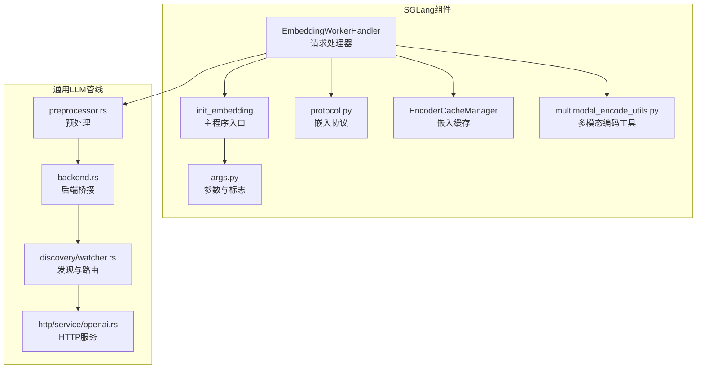
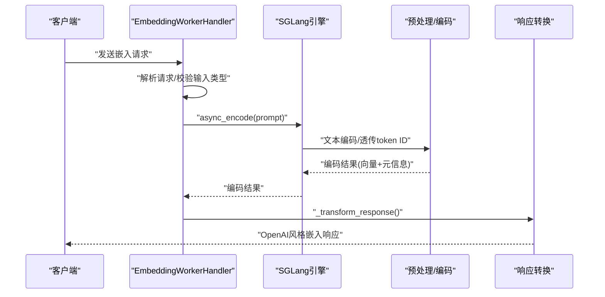
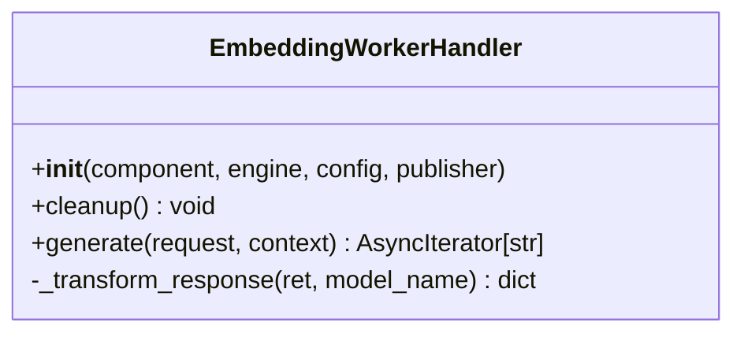
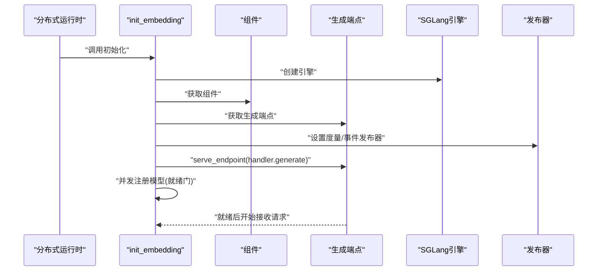
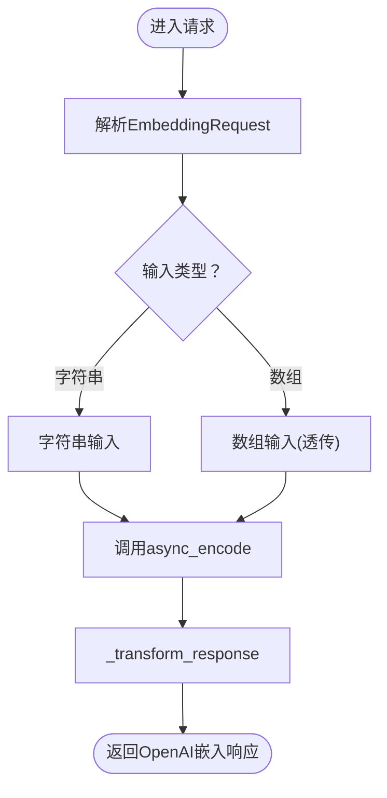
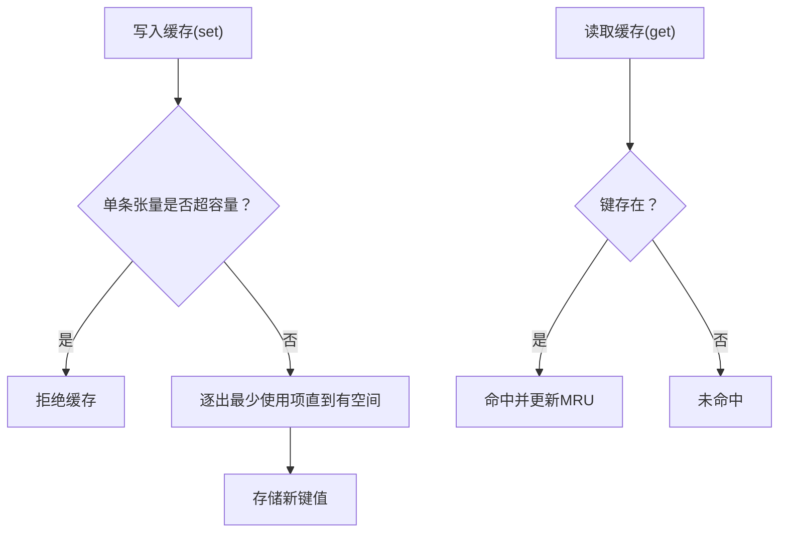
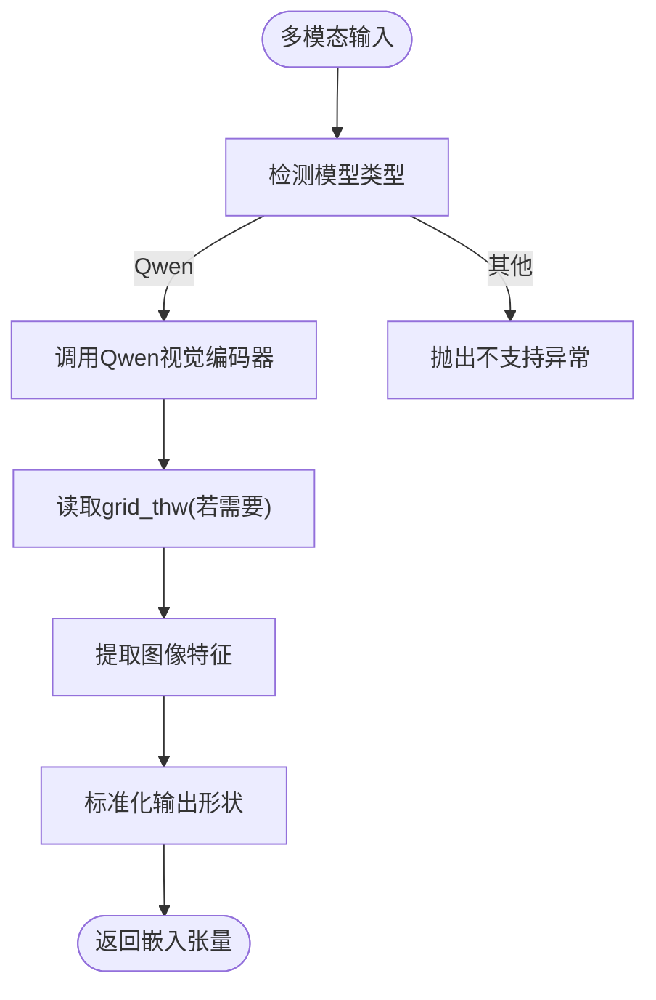
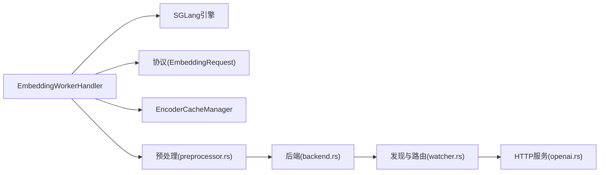

# 嵌入处理器

<cite>
**本文引用的文件**
- [components/src/dynamo/sglang/request_handlers/embedding/embedding_handler.py](file://components/src/dynamo/sglang/request_handlers/embedding/embedding_handler.py)
- [components/src/dynamo/sglang/request_handlers/embedding/__init__.py](file://components/src/dynamo/sglang/request_handlers/embedding/__init__.py)
- [components/src/dynamo/sglang/main.py](file://components/src/dynamo/sglang/main.py)
- [components/src/dynamo/sglang/args.py](file://components/src/dynamo/sglang/args.py)
- [components/src/dynamo/sglang/protocol.py](file://components/src/dynamo/sglang/protocol.py)
- [components/src/dynamo/common/memory/encoder_cache_manager.py](file://components/src/dynamo/common/memory/encoder_cache_manager.py)
- [components/src/dynamo/sglang/multimodal_utils/multimodal_encode_utils.py](file://components/src/dynamo/sglang/multimodal_utils/multimodal_encode_utils.py)
- [lib/llm/src/preprocessor.rs](file://lib/llm/src/preprocessor.rs)
- [lib/llm/src/backend.rs](file://lib/llm/src/backend.rs)
- [lib/llm/src/discovery/watcher.rs](file://lib/llm/src/discovery/watcher.rs)
- [lib/llm/src/http/service/openai.rs](file://lib/llm/src/http/service/openai.rs)
</cite>

## 目录
1. [简介](#简介)
2. [项目结构](#项目结构)
3. [核心组件](#核心组件)
4. [架构总览](#架构总览)
5. [详细组件分析](#详细组件分析)
6. [依赖分析](#依赖分析)
7. [性能考虑](#性能考虑)
8. [故障排查指南](#故障排查指南)
9. [结论](#结论)
10. [附录](#附录)

## 简介
本文件面向SGLang嵌入处理器（Embedding Worker）的实现与使用，系统性阐述嵌入向量生成的端到端流程：从请求解析、文本编码、特征提取到向量归一化与响应转换；明确输入格式、输出维度与精度控制；说明批量处理、内存优化与并发控制；并给出与其他处理器的协作关系与数据流。文末提供配置、调用与结果解析的示例路径，以及性能优化建议与常见问题解决方案。

## 项目结构
SGLang嵌入处理器位于组件层的“sglang”子模块中，核心文件包括：
- 请求处理器：负责接收OpenAI风格的嵌入请求，调用引擎执行编码，并将结果转换为统一的OpenAI嵌入响应格式。
- 主程序入口：根据配置初始化嵌入工作节点，注册健康检查与度量指标，启动服务端点。
- 参数与协议：定义嵌入请求的输入类型、模型名称等协议字段。
- 内存缓存：提供编码器嵌入的LRU缓存管理器，用于热点向量复用与内存控制。
- 多模态工具：在多模态场景下对图像/视频进行编码与投影，支撑文本-视觉联合嵌入。

图表来源
- [components/src/dynamo/sglang/request_handlers/embedding/embedding_handler.py](file://components/src/dynamo/sglang/request_handlers/embedding/embedding_handler.py#L1-L86)
- [components/src/dynamo/sglang/main.py](file://components/src/dynamo/sglang/main.py#L374-L434)
- [components/src/dynamo/sglang/args.py](file://components/src/dynamo/sglang/args.py#L94-L99)
- [components/src/dynamo/sglang/protocol.py](file://components/src/dynamo/sglang/protocol.py#L54-L61)
- [components/src/dynamo/common/memory/encoder_cache_manager.py](file://components/src/dynamo/common/memory/encoder_cache_manager.py#L29-L177)
- [components/src/dynamo/sglang/multimodal_utils/multimodal_encode_utils.py](file://components/src/dynamo/sglang/multimodal_utils/multimodal_encode_utils.py#L131-L171)
- [lib/llm/src/preprocessor.rs](file://lib/llm/src/preprocessor.rs#L491-L525)
- [lib/llm/src/backend.rs](file://lib/llm/src/backend.rs#L292-L320)
- [lib/llm/src/discovery/watcher.rs](file://lib/llm/src/discovery/watcher.rs#L554-L581)
- [lib/llm/src/http/service/openai.rs](file://lib/llm/src/http/service/openai.rs#L648-L680)

章节来源
- [components/src/dynamo/sglang/request_handlers/embedding/embedding_handler.py](file://components/src/dynamo/sglang/request_handlers/embedding/embedding_handler.py#L1-L86)
- [components/src/dynamo/sglang/main.py](file://components/src/dynamo/sglang/main.py#L374-L434)
- [components/src/dynamo/sglang/args.py](file://components/src/dynamo/sglang/args.py#L94-L99)

## 核心组件
- 嵌入工作处理器（EmbeddingWorkerHandler）
  - 负责解析嵌入请求、调用引擎异步编码、将返回结果转换为OpenAI风格的嵌入响应。
  - 支持字符串与数组两类输入；内部将数组输入直接透传给引擎。
- 主程序初始化（init_embedding）
  - 创建SGLang引擎实例，注册健康检查与度量指标，启动生成端点，等待模型就绪后对外提供服务。
- 协议与参数
  - 嵌入请求协议定义了模型名、输入（字符串/字符串数组/整数数组/整数数组的数组）与可选维度字段。
  - 启动参数支持以“嵌入工作节点”模式运行，并自动设置SGLang的嵌入标志位。
- 缓存管理
  - 提供基于容量的LRU嵌入缓存，按字节容量限制存储张量，命中/未命中统计便于观测复用效果。
- 多模态工具
  - 在多模态场景下对图像/视频进行编码与投影，支撑跨模态嵌入生成。

章节来源
- [components/src/dynamo/sglang/request_handlers/embedding/embedding_handler.py](file://components/src/dynamo/sglang/request_handlers/embedding/embedding_handler.py#L16-L86)
- [components/src/dynamo/sglang/main.py](file://components/src/dynamo/sglang/main.py#L374-L434)
- [components/src/dynamo/sglang/protocol.py](file://components/src/dynamo/sglang/protocol.py#L54-L61)
- [components/src/dynamo/sglang/args.py](file://components/src/dynamo/sglang/args.py#L94-L99)
- [components/src/dynamo/common/memory/encoder_cache_manager.py](file://components/src/dynamo/common/memory/encoder_cache_manager.py#L29-L177)
- [components/src/dynamo/sglang/multimodal_utils/multimodal_encode_utils.py](file://components/src/dynamo/sglang/multimodal_utils/multimodal_encode_utils.py#L131-L171)

## 架构总览
SGLang嵌入处理器在Dynamo框架中的位置如下：
- 入口：通过主程序初始化嵌入工作节点，绑定生成端点。
- 协议：遵循OpenAI嵌入请求格式，内部转换为SGLang引擎可识别的编码请求。
- 预处理：文本输入经分词器编码为token ID序列；token ID输入直接透传。
- 引擎：调用SGLang引擎的异步编码接口，产出嵌入向量与元信息。
- 响应：将引擎输出转换为OpenAI嵌入响应格式，包含对象类型、索引、嵌入向量与用量统计。

图表来源
- [components/src/dynamo/sglang/request_handlers/embedding/embedding_handler.py](file://components/src/dynamo/sglang/request_handlers/embedding/embedding_handler.py#L32-L57)
- [lib/llm/src/preprocessor.rs](file://lib/llm/src/preprocessor.rs#L491-L525)
- [lib/llm/src/http/service/openai.rs](file://lib/llm/src/http/service/openai.rs#L648-L680)

## 详细组件分析

### 组件A：嵌入工作处理器（EmbeddingWorkerHandler）
职责与行为
- 解析嵌入请求：支持字符串与数组输入；数组输入直接透传至引擎。
- 异步编码：调用引擎的异步编码接口，获取嵌入向量与元信息。
- 响应转换：将引擎输出转换为OpenAI嵌入响应格式，包含对象类型、索引、嵌入向量与用量统计。

图表来源
- [components/src/dynamo/sglang/request_handlers/embedding/embedding_handler.py](file://components/src/dynamo/sglang/request_handlers/embedding/embedding_handler.py#L16-L86)

章节来源
- [components/src/dynamo/sglang/request_handlers/embedding/embedding_handler.py](file://components/src/dynamo/sglang/request_handlers/embedding/embedding_handler.py#L16-L86)

### 组件B：主程序初始化（init_embedding）
职责与行为
- 创建SGLang引擎实例，准备度量与事件发布器。
- 注册健康检查负载，等待模型注册完成（就绪门）。
- 启动生成端点，同时并发注册模型，确保请求排队直至就绪。
- 异常时记录错误并清理资源，结束时取消度量任务并关闭引擎。

图表来源
- [components/src/dynamo/sglang/main.py](file://components/src/dynamo/sglang/main.py#L374-L434)

章节来源
- [components/src/dynamo/sglang/main.py](file://components/src/dynamo/sglang/main.py#L374-L434)

### 组件C：协议与输入格式（EmbeddingRequest）
输入格式要求
- 输入类型：字符串、字符串数组、整数数组、整数数组的数组。
- 模型名：用于标识所用的嵌入模型。
- 可选维度：OpenAI风格的维度字段，部分模型支持。

输出向量维度与精度
- 输出向量由底层模型决定；在响应转换阶段会将浮点元素转为单精度（f32）以保持一致性。

图表来源
- [components/src/dynamo/sglang/protocol.py](file://components/src/dynamo/sglang/protocol.py#L54-L61)
- [components/src/dynamo/sglang/request_handlers/embedding/embedding_handler.py](file://components/src/dynamo/sglang/request_handlers/embedding/embedding_handler.py#L42-L57)
- [lib/llm/src/preprocessor.rs](file://lib/llm/src/preprocessor.rs#L728-L748)

章节来源
- [components/src/dynamo/sglang/protocol.py](file://components/src/dynamo/sglang/protocol.py#L54-L61)
- [components/src/dynamo/sglang/request_handlers/embedding/embedding_handler.py](file://components/src/dynamo/sglang/request_handlers/embedding/embedding_handler.py#L42-L57)
- [lib/llm/src/preprocessor.rs](file://lib/llm/src/preprocessor.rs#L728-L748)

### 组件D：内存优化与缓存（EncoderCacheManager）
能力概述
- LRU缓存：按内容哈希键映射到张量，超出容量时逐出最久未使用项。
- 容量控制：以字节为单位的容量上限，避免内存膨胀。
- 统计指标：命中/未命中计数与命中率，便于评估复用效果。
- 线程安全：设计为单线程使用（如事件循环），避免锁开销。

图表来源
- [components/src/dynamo/common/memory/encoder_cache_manager.py](file://components/src/dynamo/common/memory/encoder_cache_manager.py#L104-L152)

章节来源
- [components/src/dynamo/common/memory/encoder_cache_manager.py](file://components/src/dynamo/common/memory/encoder_cache_manager.py#L29-L177)

### 组件E：多模态嵌入（图像/视频编码）
能力概述
- 模型适配：针对不同多模态模型（如Qwen系列）选择合适的编码器。
- 特征提取：调用视觉编码器提取图像/视频特征，必要时结合网格维度信息。
- 归一化形状：确保输出张量维度一致，便于后续拼接或投影。
- 投影器：对需要的模型（如LLaVA）进行投影变换以匹配文本嵌入空间。

图表来源
- [components/src/dynamo/sglang/multimodal_utils/multimodal_encode_utils.py](file://components/src/dynamo/sglang/multimodal_utils/multimodal_encode_utils.py#L131-L171)

章节来源
- [components/src/dynamo/sglang/multimodal_utils/multimodal_encode_utils.py](file://components/src/dynamo/sglang/multimodal_utils/multimodal_encode_utils.py#L131-L171)

## 依赖分析
- 处理器与引擎
  - EmbeddingWorkerHandler依赖SGLang引擎的异步编码接口，将编码结果转换为OpenAI风格响应。
- 预处理与后端
  - 通用LLM预处理器负责将文本输入编码为token ID序列，或将token ID输入透传；后端作为桥接层传递到具体引擎。
- 发现与路由
  - 发现器构建前后端闭环，形成嵌入请求的处理链路。
- HTTP服务
  - HTTP服务层负责将嵌入请求路由到嵌入引擎，收集度量并返回响应。

图表来源
- [components/src/dynamo/sglang/request_handlers/embedding/embedding_handler.py](file://components/src/dynamo/sglang/request_handlers/embedding/embedding_handler.py#L16-L86)
- [lib/llm/src/preprocessor.rs](file://lib/llm/src/preprocessor.rs#L491-L525)
- [lib/llm/src/backend.rs](file://lib/llm/src/backend.rs#L292-L320)
- [lib/llm/src/discovery/watcher.rs](file://lib/llm/src/discovery/watcher.rs#L554-L581)
- [lib/llm/src/http/service/openai.rs](file://lib/llm/src/http/service/openai.rs#L648-L680)

章节来源
- [lib/llm/src/preprocessor.rs](file://lib/llm/src/preprocessor.rs#L491-L525)
- [lib/llm/src/backend.rs](file://lib/llm/src/backend.rs#L292-L320)
- [lib/llm/src/discovery/watcher.rs](file://lib/llm/src/discovery/watcher.rs#L554-L581)
- [lib/llm/src/http/service/openai.rs](file://lib/llm/src/http/service/openai.rs#L648-L680)

## 性能考虑
- 批量处理
  - 文本批处理：预处理器支持批量编码，减少多次往返开销；在数组输入场景下可直接透传批量token ID。
- 并发控制
  - 异步编码：通过异步接口提升吞吐；就绪门确保模型加载期间请求排队，避免过载。
  - 度量与健康检查：开启度量有助于定位瓶颈，健康检查保障可用性。
- 内存优化
  - 嵌入缓存：对热点向量进行LRU缓存，降低重复计算与传输成本；合理设置容量以平衡命中率与内存占用。
  - 张量连续性：缓存管理器要求张量连续，确保准确的大小计算。
- 精度控制
  - 响应转换阶段将浮点元素转为单精度（f32），兼顾精度与带宽效率。

章节来源
- [lib/llm/src/preprocessor.rs](file://lib/llm/src/preprocessor.rs#L503-L517)
- [components/src/dynamo/common/memory/encoder_cache_manager.py](file://components/src/dynamo/common/memory/encoder_cache_manager.py#L66-L82)
- [components/src/dynamo/sglang/request_handlers/embedding/embedding_handler.py](file://components/src/dynamo/sglang/request_handlers/embedding/embedding_handler.py#L59-L85)

## 故障排查指南
- 输入类型错误
  - 现象：请求输入类型不在允许范围内。
  - 排查：确认输入为字符串、字符串数组、整数数组或整数数组的数组之一。
  - 参考路径：[components/src/dynamo/sglang/request_handlers/embedding/embedding_handler.py](file://components/src/dynamo/sglang/request_handlers/embedding/embedding_handler.py#L46-L51)
- 引擎未就绪
  - 现象：请求被阻塞直至模型注册完成。
  - 排查：检查就绪门逻辑与模型注册状态；查看日志中的度量与健康检查信息。
  - 参考路径：[components/src/dynamo/sglang/main.py](file://components/src/dynamo/sglang/main.py#L396-L422)
- 缓存过大
  - 现象：单条张量超过缓存容量上限，被拒绝缓存。
  - 排查：调整缓存容量或拆分向量；检查张量形状与元素大小。
  - 参考路径：[components/src/dynamo/common/memory/encoder_cache_manager.py](file://components/src/dynamo/common/memory/encoder_cache_manager.py#L121-L127)
- 多模态模型不支持
  - 现象：模型未在支持列表中，抛出不支持异常。
  - 排查：确认模型名称与支持列表匹配；检查模型规范化逻辑。
  - 参考路径：[components/src/dynamo/sglang/multimodal_utils/multimodal_encode_utils.py](file://components/src/dynamo/sglang/multimodal_utils/multimodal_encode_utils.py#L155-L163)

章节来源
- [components/src/dynamo/sglang/request_handlers/embedding/embedding_handler.py](file://components/src/dynamo/sglang/request_handlers/embedding/embedding_handler.py#L46-L51)
- [components/src/dynamo/sglang/main.py](file://components/src/dynamo/sglang/main.py#L396-L422)
- [components/src/dynamo/common/memory/encoder_cache_manager.py](file://components/src/dynamo/common/memory/encoder_cache_manager.py#L121-L127)
- [components/src/dynamo/sglang/multimodal_utils/multimodal_encode_utils.py](file://components/src/dynamo/sglang/multimodal_utils/multimodal_encode_utils.py#L155-L163)

## 结论
SGLang嵌入处理器通过清晰的协议、异步编码与OpenAI风格响应转换，实现了高效稳定的嵌入向量生成能力。配合预处理、后端桥接与发现路由，形成完整的请求处理链路。借助嵌入缓存与批量处理、并发控制与度量监控，可在生产环境中获得良好的吞吐与稳定性。多模态工具进一步扩展了文本-视觉联合嵌入的应用场景。

## 附录
- 配置与启动
  - 以嵌入工作节点模式启动：参考参数定义与初始化流程。
  - 示例路径：
    - [components/src/dynamo/sglang/args.py](file://components/src/dynamo/sglang/args.py#L94-L99)
    - [components/src/dynamo/sglang/main.py](file://components/src/dynamo/sglang/main.py#L374-L434)
- 调用与结果解析
  - 请求格式：参见嵌入请求协议定义。
  - 响应格式：参见响应转换逻辑。
  - 示例路径：
    - [components/src/dynamo/sglang/protocol.py](file://components/src/dynamo/sglang/protocol.py#L54-L61)
    - [components/src/dynamo/sglang/request_handlers/embedding/embedding_handler.py](file://components/src/dynamo/sglang/request_handlers/embedding/embedding_handler.py#L59-L85)
- 多模态嵌入
  - 图像/视频编码与投影：参考多模态工具函数。
  - 示例路径：
    - [components/src/dynamo/sglang/multimodal_utils/multimodal_encode_utils.py](file://components/src/dynamo/sglang/multimodal_utils/multimodal_encode_utils.py#L131-L171)