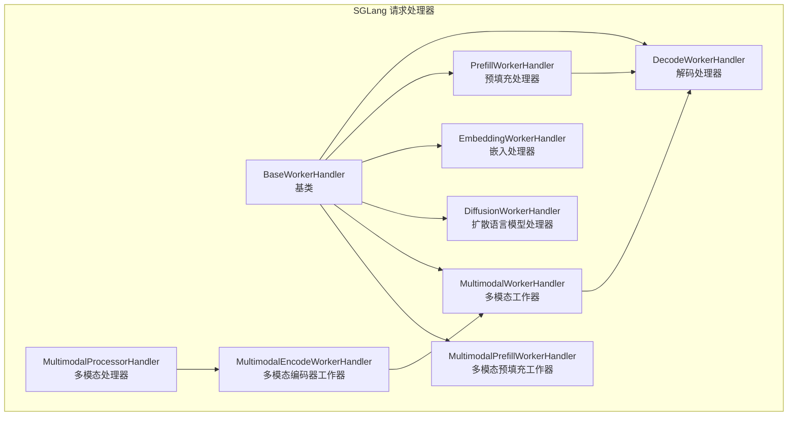
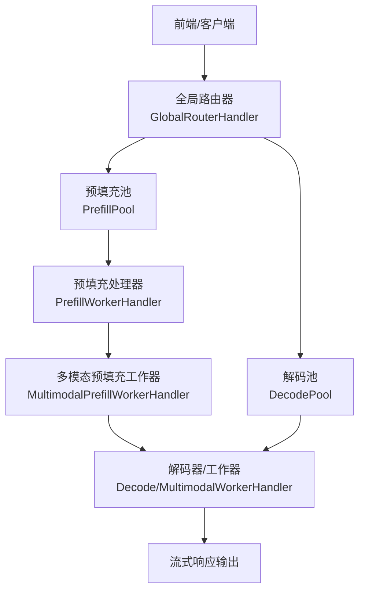
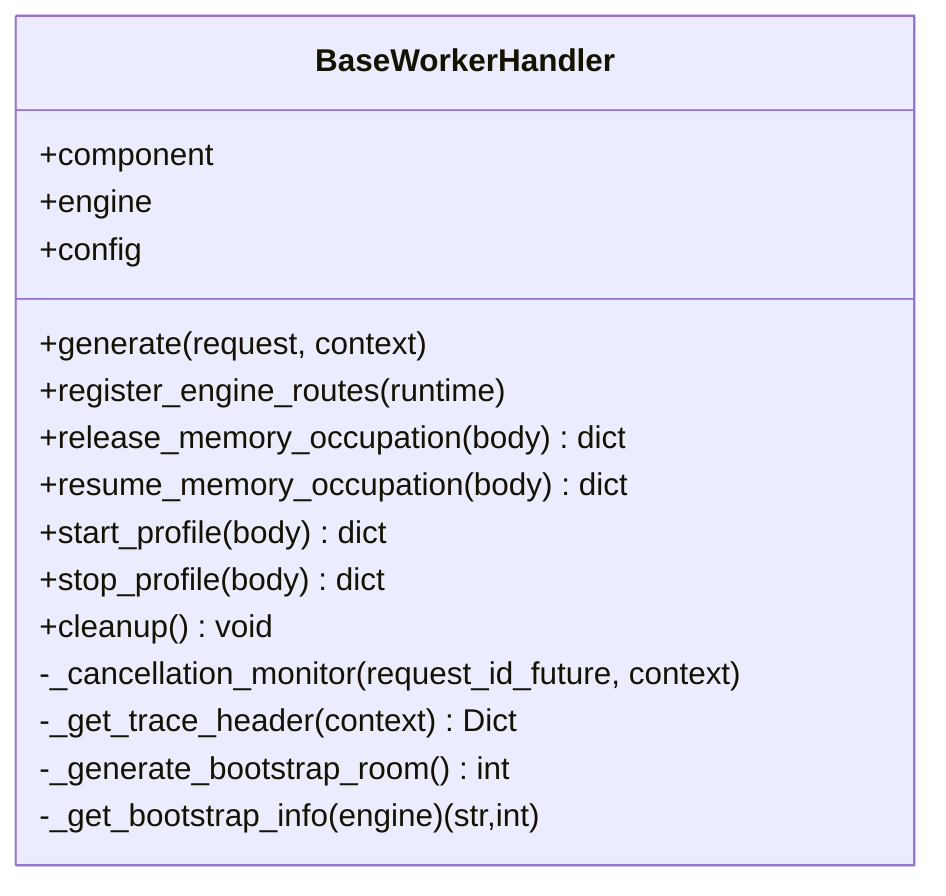
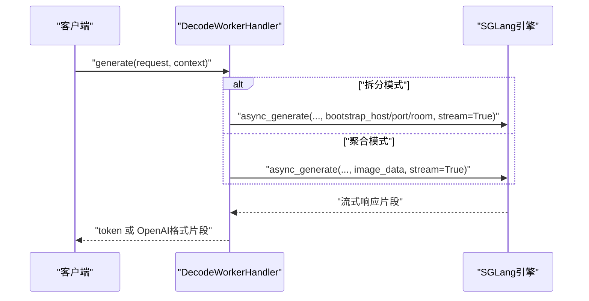
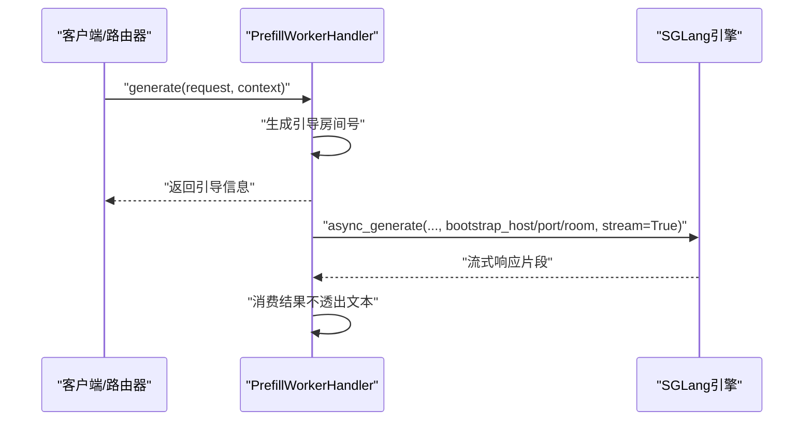
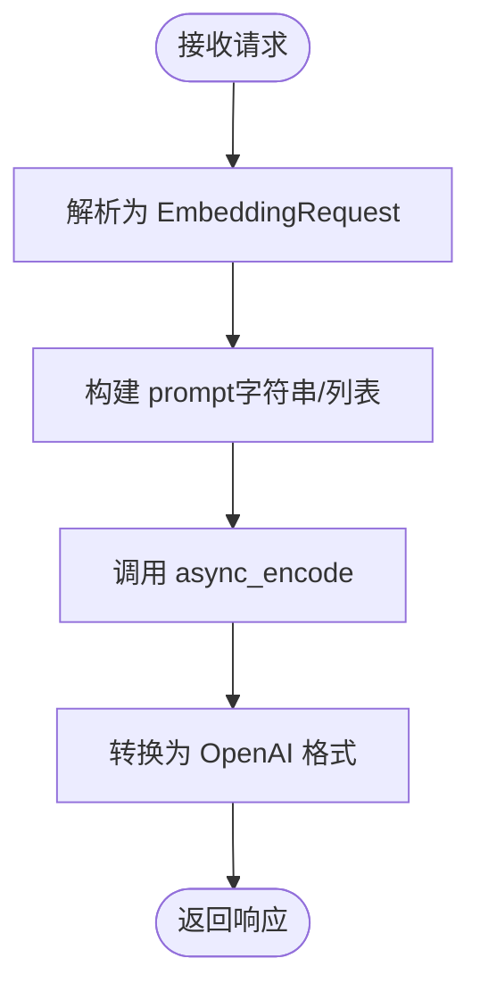
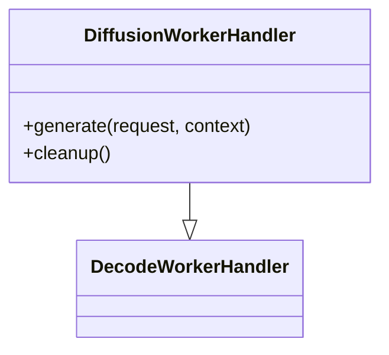
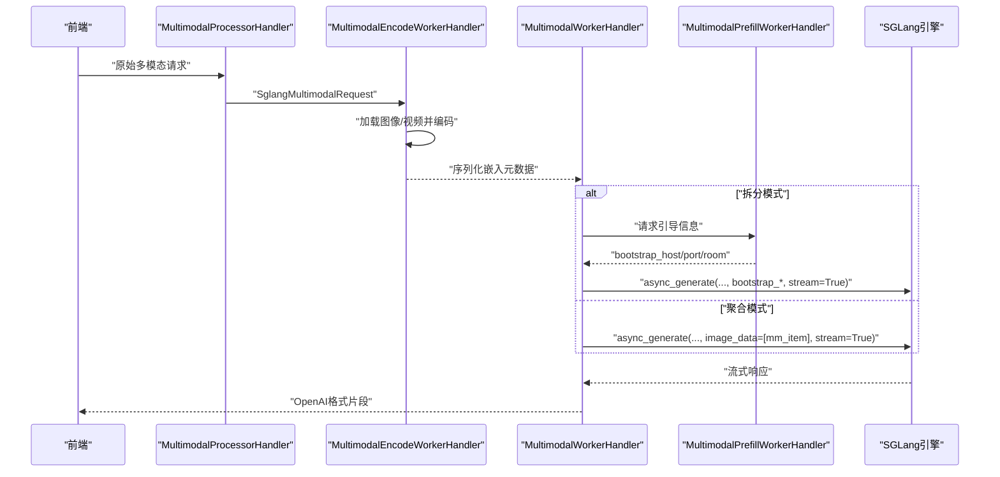
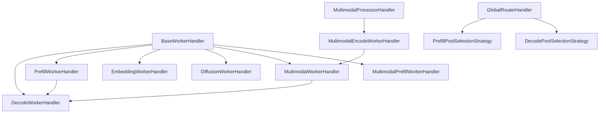

# 请求处理器

<cite>
**本文引用的文件**   
- [components/src/dynamo/sglang/request_handlers/handler_base.py](file://components/src/dynamo/sglang/request_handlers/handler_base.py)
- [components/src/dynamo/sglang/request_handlers/llm/decode_handler.py](file://components/src/dynamo/sglang/request_handlers/llm/decode_handler.py)
- [components/src/dynamo/sglang/request_handlers/llm/prefill_handler.py](file://components/src/dynamo/sglang/request_handlers/llm/prefill_handler.py)
- [components/src/dynamo/sglang/request_handlers/embedding/embedding_handler.py](file://components/src/dynamo/sglang/request_handlers/embedding/embedding_handler.py)
- [components/src/dynamo/sglang/request_handlers/llm/diffusion_handler.py](file://components/src/dynamo/sglang/request_handlers/llm/diffusion_handler.py)
- [components/src/dynamo/sglang/request_handlers/multimodal/worker_handler.py](file://components/src/dynamo/sglang/request_handlers/multimodal/worker_handler.py)
- [components/src/dynamo/sglang/request_handlers/multimodal/processor_handler.py](file://components/src/dynamo/sglang/request_handlers/multimodal/processor_handler.py)
- [components/src/dynamo/sglang/request_handlers/multimodal/encode_worker_handler.py](file://components/src/dynamo/sglang/request_handlers/multimodal/encode_worker_handler.py)
- [components/src/dynamo/sglang/main.py](file://components/src/dynamo/sglang/main.py)
- [components/src/dynamo/global_router/handler.py](file://components/src/dynamo/global_router/handler.py)
- [components/src/dynamo/global_router/pool_selection.py](file://components/src/dynamo/global_router/pool_selection.py)
- [docs/backends/sglang/expert-distribution-eplb.md](file://docs/backends/sglang/expert-distribution-eplb.md)
</cite>

## 目录
1. [简介](#简介)
2. [项目结构](#项目结构)
3. [核心组件](#核心组件)
4. [架构总览](#架构总览)
5. [详细组件分析](#详细组件分析)
6. [依赖关系分析](#依赖关系分析)
7. [性能考量](#性能考量)
8. [故障排查指南](#故障排查指南)
9. [结论](#结论)
10. [附录](#附录)

## 简介
本文件系统性梳理 SGLang 后端请求处理器的实现与工作机制，覆盖以下处理器类型：
- 解码处理器：支持聚合与拆分（解码）两种模式，负责流式生成文本或 token。
- 预填充处理器：在拆分模式下提供首 token 生成与引导信息（bootstrap），用于后续解码阶段。
- 嵌入处理器：将输入文本转换为向量表示，输出 OpenAI 兼容格式。
- 扩散语言模型处理器：基于 SGLang 的扩散算法实现推理。
- 多模态处理器：包含“处理器-编码器-工作器”三层流水线，完成从编码到解码的完整链路。

同时，文档阐述处理器基类的设计模式、通用能力与扩展机制；解释专家分布均衡（EPLB）在请求路由中的应用；并给出性能调优与故障排查建议。

## 项目结构
SGLang 请求处理器位于组件目录中，按功能划分为 LLM、嵌入、扩散与多模态四类处理器，并通过统一的基类提供公共能力。全局路由器负责将请求路由至不同池（prefill/decode）以实现负载均衡与性能目标控制。

图表来源
- [components/src/dynamo/sglang/request_handlers/handler_base.py](file://components/src/dynamo/sglang/request_handlers/handler_base.py#L21-L393)
- [components/src/dynamo/sglang/request_handlers/llm/decode_handler.py](file://components/src/dynamo/sglang/request_handlers/llm/decode_handler.py#L17-L300)
- [components/src/dynamo/sglang/request_handlers/llm/prefill_handler.py](file://components/src/dynamo/sglang/request_handlers/llm/prefill_handler.py#L16-L161)
- [components/src/dynamo/sglang/request_handlers/embedding/embedding_handler.py](file://components/src/dynamo/sglang/request_handlers/embedding/embedding_handler.py#L16-L86)
- [components/src/dynamo/sglang/request_handlers/llm/diffusion_handler.py](file://components/src/dynamo/sglang/request_handlers/llm/diffusion_handler.py#L14-L99)
- [components/src/dynamo/sglang/request_handlers/multimodal/processor_handler.py](file://components/src/dynamo/sglang/request_handlers/multimodal/processor_handler.py#L28-L222)
- [components/src/dynamo/sglang/request_handlers/multimodal/encode_worker_handler.py](file://components/src/dynamo/sglang/request_handlers/multimodal/encode_worker_handler.py#L37-L189)
- [components/src/dynamo/sglang/request_handlers/multimodal/worker_handler.py](file://components/src/dynamo/sglang/request_handlers/multimodal/worker_handler.py#L227-L521)

章节来源
- [components/src/dynamo/sglang/request_handlers/handler_base.py](file://components/src/dynamo/sglang/request_handlers/handler_base.py#L21-L393)
- [components/src/dynamo/sglang/request_handlers/llm/decode_handler.py](file://components/src/dynamo/sglang/request_handlers/llm/decode_handler.py#L17-L300)
- [components/src/dynamo/sglang/request_handlers/llm/prefill_handler.py](file://components/src/dynamo/sglang/request_handlers/llm/prefill_handler.py#L16-L161)
- [components/src/dynamo/sglang/request_handlers/embedding/embedding_handler.py](file://components/src/dynamo/sglang/request_handlers/embedding/embedding_handler.py#L16-L86)
- [components/src/dynamo/sglang/request_handlers/llm/diffusion_handler.py](file://components/src/dynamo/sglang/request_handlers/llm/diffusion_handler.py#L14-L99)
- [components/src/dynamo/sglang/request_handlers/multimodal/processor_handler.py](file://components/src/dynamo/sglang/request_handlers/multimodal/processor_handler.py#L28-L222)
- [components/src/dynamo/sglang/request_handlers/multimodal/encode_worker_handler.py](file://components/src/dynamo/sglang/request_handlers/multimodal/encode_worker_handler.py#L37-L189)
- [components/src/dynamo/sglang/request_handlers/multimodal/worker_handler.py](file://components/src/dynamo/sglang/request_handlers/multimodal/worker_handler.py#L227-L521)

## 核心组件
- 处理器基类 BaseWorkerHandler：提供统一的生命周期管理（注册引擎路由、内存占用释放/恢复、性能剖析）、上下文取消监控、引导信息生成与提取、追踪头注入等通用能力。
- 解码处理器 DecodeWorkerHandler：在聚合与拆分两种模式下进行流式解码，支持 token 与文本两种输出格式。
- 预填充处理器 PrefillWorkerHandler：在拆分模式下生成首 token 并返回引导信息（bootstrap），随后消费结果但不直接输出文本。
- 嵌入处理器 EmbeddingWorkerHandler：将输入文本转为向量，输出 OpenAI 兼容格式。
- 扩散语言模型处理器 DiffusionWorkerHandler：继承解码处理器，使用特定扩散算法配置进行推理。
- 多模态处理器：由“处理器-编码器-工作器-解码器”构成，支持预填充与解码阶段的多模态数据处理。

章节来源
- [components/src/dynamo/sglang/request_handlers/handler_base.py](file://components/src/dynamo/sglang/request_handlers/handler_base.py#L21-L393)
- [components/src/dynamo/sglang/request_handlers/llm/decode_handler.py](file://components/src/dynamo/sglang/request_handlers/llm/decode_handler.py#L17-L300)
- [components/src/dynamo/sglang/request_handlers/llm/prefill_handler.py](file://components/src/dynamo/sglang/request_handlers/llm/prefill_handler.py#L16-L161)
- [components/src/dynamo/sglang/request_handlers/embedding/embedding_handler.py](file://components/src/dynamo/sglang/request_handlers/embedding/embedding_handler.py#L16-L86)
- [components/src/dynamo/sglang/request_handlers/llm/diffusion_handler.py](file://components/src/dynamo/sglang/request_handlers/llm/diffusion_handler.py#L14-L99)
- [components/src/dynamo/sglang/request_handlers/multimodal/worker_handler.py](file://components/src/dynamo/sglang/request_handlers/multimodal/worker_handler.py#L227-L521)

## 架构总览
SGLang 后端通过统一入口启动不同处理器，依据服务模式（聚合/拆分/多模态/扩散/嵌入）选择对应组件。全局路由器根据请求特征（如 ISL、TTFT、上下文长度、ITL）将请求路由到合适的池（prefill/decode），从而实现性能目标驱动的负载均衡。

图表来源
- [components/src/dynamo/sglang/main.py](file://components/src/dynamo/sglang/main.py#L125-L286)
- [components/src/dynamo/global_router/handler.py](file://components/src/dynamo/global_router/handler.py#L23-L232)
- [components/src/dynamo/global_router/pool_selection.py](file://components/src/dynamo/global_router/pool_selection.py#L22-L318)

章节来源
- [components/src/dynamo/sglang/main.py](file://components/src/dynamo/sglang/main.py#L125-L286)
- [components/src/dynamo/global_router/handler.py](file://components/src/dynamo/global_router/handler.py#L23-L232)
- [components/src/dynamo/global_router/pool_selection.py](file://components/src/dynamo/global_router/pool_selection.py#L22-L318)

## 详细组件分析

### 处理器基类设计与扩展机制
- 统一接口与生命周期
  - generate：异步生成器接口，子类需实现具体逻辑。
  - register_engine_routes：注册引擎内部路由（如性能剖析、内存占用释放/恢复）。
  - cleanup：资源清理钩子，子类可重写。
- 取消与追踪
  - _cancellation_monitor：后台任务监控请求取消，必要时调用引擎 abort_request。
  - _get_trace_header：注入外部追踪头，便于端到端链路追踪。
- 引导信息与网络
  - _generate_bootstrap_room/_get_bootstrap_info：为拆分模式生成引导房间号并解析引导主机/端口，支持 IPv6 安全格式化。
- 内存占用管理
  - release_memory_occupation/resume_memory_occupation：按标签（KV缓存、权重、CUDA图）暂停/恢复内存占用，并重新注册发现服务。

图表来源
- [components/src/dynamo/sglang/request_handlers/handler_base.py](file://components/src/dynamo/sglang/request_handlers/handler_base.py#L21-L393)

章节来源
- [components/src/dynamo/sglang/request_handlers/handler_base.py](file://components/src/dynamo/sglang/request_handlers/handler_base.py#L21-L393)

### 解码处理器（DecodeWorkerHandler）
- 聚合模式：直接调用引擎 async_generate，支持图像 URL 注入；根据是否跳过分词器决定输出格式（token 或文本）。
- 拆分模式：需要前端提供的引导信息（bootstrap_info），随后发起解码流式生成。
- 流式处理：分别提供 token 与文本两类流处理器，前者透传新 token 片段，后者封装为 OpenAI 格式。

图表来源
- [components/src/dynamo/sglang/request_handlers/llm/decode_handler.py](file://components/src/dynamo/sglang/request_handlers/llm/decode_handler.py#L89-L177)

章节来源
- [components/src/dynamo/sglang/request_handlers/llm/decode_handler.py](file://components/src/dynamo/sglang/request_handlers/llm/decode_handler.py#L17-L300)

### 预填充处理器（PrefillWorkerHandler）
- 生成引导信息：返回包含引导主机、端口与房间号的引导参数，满足拆分模式契约。
- 结果消费：启动异步任务消费引擎输出，但不直接产出文本，仅用于建立连接与预热。

图表来源
- [components/src/dynamo/sglang/request_handlers/llm/prefill_handler.py](file://components/src/dynamo/sglang/request_handlers/llm/prefill_handler.py#L56-L135)

章节来源
- [components/src/dynamo/sglang/request_handlers/llm/prefill_handler.py](file://components/src/dynamo/sglang/request_handlers/llm/prefill_handler.py#L16-L161)

### 嵌入处理器（EmbeddingWorkerHandler）
- 输入：支持字符串或列表形式的输入。
- 输出：OpenAI 兼容的 embedding 列表与使用统计。

图表来源
- [components/src/dynamo/sglang/request_handlers/embedding/embedding_handler.py](file://components/src/dynamo/sglang/request_handlers/embedding/embedding_handler.py#L32-L85)

章节来源
- [components/src/dynamo/sglang/request_handlers/embedding/embedding_handler.py](file://components/src/dynamo/sglang/request_handlers/embedding/embedding_handler.py#L16-L86)

### 扩散语言模型处理器（DiffusionWorkerHandler）
- 继承自解码处理器，使用引擎配置中的扩散算法进行推理，输出格式与解码一致。

图表来源
- [components/src/dynamo/sglang/request_handlers/llm/diffusion_handler.py](file://components/src/dynamo/sglang/request_handlers/llm/diffusion_handler.py#L14-L99)
- [components/src/dynamo/sglang/request_handlers/llm/decode_handler.py](file://components/src/dynamo/sglang/request_handlers/llm/decode_handler.py#L17-L300)

章节来源
- [components/src/dynamo/sglang/request_handlers/llm/diffusion_handler.py](file://components/src/dynamo/sglang/request_handlers/llm/diffusion_handler.py#L14-L99)

### 多模态处理器流水线
- 多模态处理器（MultimodalProcessorHandler）：将前端消息转换为 SGLang 对话格式，转发给编码器工作器。
- 多模态编码器工作器（MultimodalEncodeWorkerHandler）：加载图像/视频，计算视觉嵌入，替换占位 token，并通过下游客户端转发给预填充/解码工作器。
- 多模态工作器（MultimodalWorkerHandler）：聚合模式下直接将嵌入注入引擎；拆分模式下从预填充工作器获取引导信息后进行解码。
- 多模态预填充工作器（MultimodalPrefillWorkerHandler）：处理多模态输入，生成引导信息并执行预填充阶段的生成。

图表来源
- [components/src/dynamo/sglang/request_handlers/multimodal/processor_handler.py](file://components/src/dynamo/sglang/request_handlers/multimodal/processor_handler.py#L57-L222)
- [components/src/dynamo/sglang/request_handlers/multimodal/encode_worker_handler.py](file://components/src/dynamo/sglang/request_handlers/multimodal/encode_worker_handler.py#L94-L189)
- [components/src/dynamo/sglang/request_handlers/multimodal/worker_handler.py](file://components/src/dynamo/sglang/request_handlers/multimodal/worker_handler.py#L272-L405)
- [components/src/dynamo/sglang/request_handlers/llm/prefill_handler.py](file://components/src/dynamo/sglang/request_handlers/llm/prefill_handler.py#L56-L135)

章节来源
- [components/src/dynamo/sglang/request_handlers/multimodal/processor_handler.py](file://components/src/dynamo/sglang/request_handlers/multimodal/processor_handler.py#L28-L222)
- [components/src/dynamo/sglang/request_handlers/multimodal/encode_worker_handler.py](file://components/src/dynamo/sglang/request_handlers/multimodal/encode_worker_handler.py#L37-L189)
- [components/src/dynamo/sglang/request_handlers/multimodal/worker_handler.py](file://components/src/dynamo/sglang/request_handlers/multimodal/worker_handler.py#L227-L521)
- [components/src/dynamo/sglang/request_handlers/llm/prefill_handler.py](file://components/src/dynamo/sglang/request_handlers/llm/prefill_handler.py#L16-L161)

## 依赖关系分析
- 组件耦合
  - 所有处理器均继承自 BaseWorkerHandler，共享通用能力与生命周期管理。
  - 多模态链路中，处理器依赖编码器工作器，编码器再依赖下游客户端（预填充/解码）。
  - 全局路由器通过分布式运行时连接各池本地路由器，实现跨池请求路由。
- 外部依赖
  - SGLang 引擎：所有处理器最终调用 async_generate 进行推理。
  - Dynamo 运行时与端点：注册引擎路由、健康检查、度量发布与实例等待。
  - NIXL 连接器：多模态嵌入传输与读取。

图表来源
- [components/src/dynamo/sglang/request_handlers/handler_base.py](file://components/src/dynamo/sglang/request_handlers/handler_base.py#L21-L393)
- [components/src/dynamo/sglang/request_handlers/llm/decode_handler.py](file://components/src/dynamo/sglang/request_handlers/llm/decode_handler.py#L17-L300)
- [components/src/dynamo/sglang/request_handlers/llm/prefill_handler.py](file://components/src/dynamo/sglang/request_handlers/llm/prefill_handler.py#L16-L161)
- [components/src/dynamo/sglang/request_handlers/multimodal/processor_handler.py](file://components/src/dynamo/sglang/request_handlers/multimodal/processor_handler.py#L28-L222)
- [components/src/dynamo/sglang/request_handlers/multimodal/encode_worker_handler.py](file://components/src/dynamo/sglang/request_handlers/multimodal/encode_worker_handler.py#L37-L189)
- [components/src/dynamo/sglang/request_handlers/multimodal/worker_handler.py](file://components/src/dynamo/sglang/request_handlers/multimodal/worker_handler.py#L227-L521)
- [components/src/dynamo/global_router/handler.py](file://components/src/dynamo/global_router/handler.py#L23-L232)
- [components/src/dynamo/global_router/pool_selection.py](file://components/src/dynamo/global_router/pool_selection.py#L22-L318)

章节来源
- [components/src/dynamo/sglang/request_handlers/handler_base.py](file://components/src/dynamo/sglang/request_handlers/handler_base.py#L21-L393)
- [components/src/dynamo/global_router/handler.py](file://components/src/dynamo/global_router/handler.py#L23-L232)
- [components/src/dynamo/global_router/pool_selection.py](file://components/src/dynamo/global_router/pool_selection.py#L22-L318)

## 性能考量
- 预填充预热：在拆分模式下对预填充引擎执行一次 dummy 请求，降低首次 TTFT。
- 引擎内部优化：SGLang 引擎的 CUDA Graph、权重/缓存占用管理与内存释放/恢复机制有助于减少抖动。
- 多模态路径优化：
  - 预填充阶段仅建立连接与预热，不输出文本，避免冗余传输。
  - 解码阶段可复用预填充的 KV 缓存，减少重复视觉编码。
- 全局路由与池选择：通过网格化策略将请求映射到最优池，平衡 TTFT/ITL 目标，提升整体吞吐与延迟表现。

章节来源
- [components/src/dynamo/sglang/main.py](file://components/src/dynamo/sglang/main.py#L617-L650)
- [components/src/dynamo/sglang/request_handlers/handler_base.py](file://components/src/dynamo/sglang/request_handlers/handler_base.py#L61-L156)
- [components/src/dynamo/global_router/handler.py](file://components/src/dynamo/global_router/handler.py#L122-L214)
- [components/src/dynamo/global_router/pool_selection.py](file://components/src/dynamo/global_router/pool_selection.py#L44-L133)

## 故障排查指南
- 取消与超时
  - 使用 _cancellation_monitor 确保在请求被取消时能及时触发 abort_request。
  - 若出现“无输出但未结束”，检查流式处理中 finish_reason 是否正确传递。
- 内存占用问题
  - 使用 release_memory_occupation/resume_memory_occupation 按标签精确控制内存释放与恢复。
  - 注意 unregister/register 发现服务顺序，避免新请求进入旧状态。
- 多模态对齐错误
  - 当 token 数与嵌入形状不匹配时，会触发形状不一致错误；检查 token 化与嵌入生成是否一致。
- 引导信息缺失
  - 拆分模式下若缺少 bootstrap_info，将抛出异常；确保预填充阶段已返回引导信息。
- 全局路由选择异常
  - 检查配置文件中的网格映射维度与分辨率一致性，避免索引越界。

章节来源
- [components/src/dynamo/sglang/request_handlers/handler_base.py](file://components/src/dynamo/sglang/request_handlers/handler_base.py#L290-L393)
- [components/src/dynamo/sglang/request_handlers/llm/decode_handler.py](file://components/src/dynamo/sglang/request_handlers/llm/decode_handler.py#L109-L123)
- [components/src/dynamo/sglang/request_handlers/multimodal/worker_handler.py](file://components/src/dynamo/sglang/request_handlers/multimodal/worker_handler.py#L360-L376)
- [components/src/dynamo/global_router/pool_selection.py](file://components/src/dynamo/global_router/pool_selection.py#L152-L252)

## 结论
SGLang 后端请求处理器通过统一基类与清晰的职责划分，实现了从文本到多模态、从预填充到解码的完整推理链路。结合全局路由器的网格化池选择策略与 EPLB 的专家分布均衡，系统能够在复杂场景下实现高性能与低延迟的服务质量。开发者可通过本文档提供的初始化、处理与清理流程示例，以及性能与故障排查建议，快速集成并优化 SGLang 后端的高吞吐特性。

## 附录
- EPLB 在 SGLang 中的应用要点
  - 动态重平衡：通过启用标志与迭代间隔周期性触发，基于最新使用统计更新专家放置。
  - 专家使用记录：支持 per_token/per_pass/stat/stat_approx 等模式，权衡精度与开销。
  - 初始化布局：可提供预计算的专家分布文件，加速达到平衡状态。

章节来源
- [docs/backends/sglang/expert-distribution-eplb.md](file://docs/backends/sglang/expert-distribution-eplb.md#L19-L61)