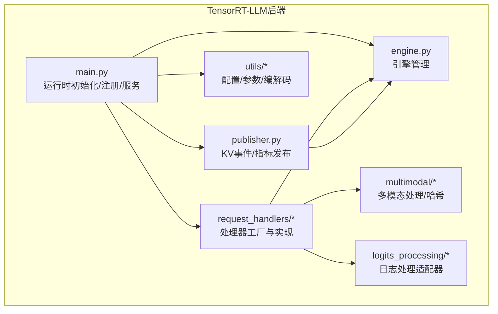
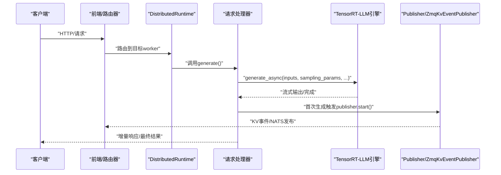
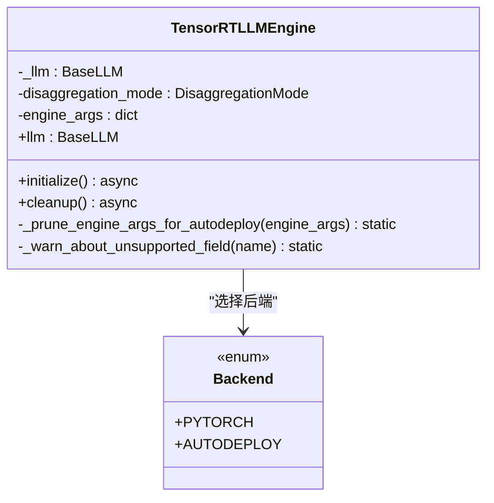
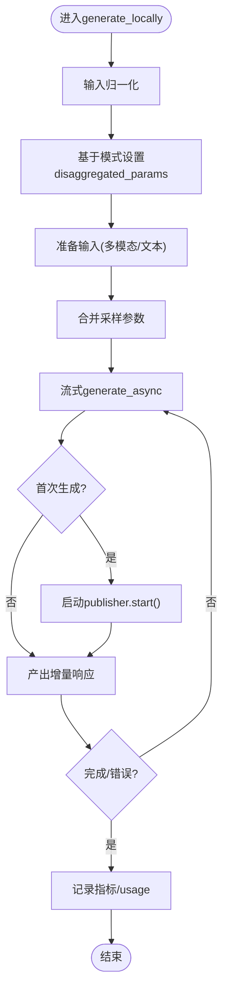
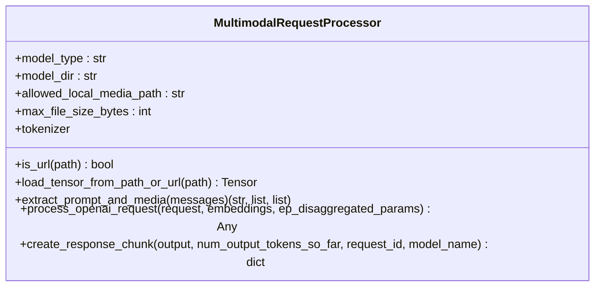
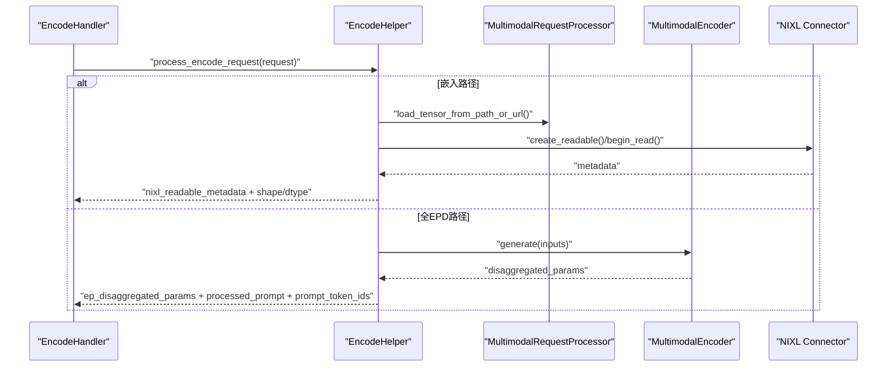
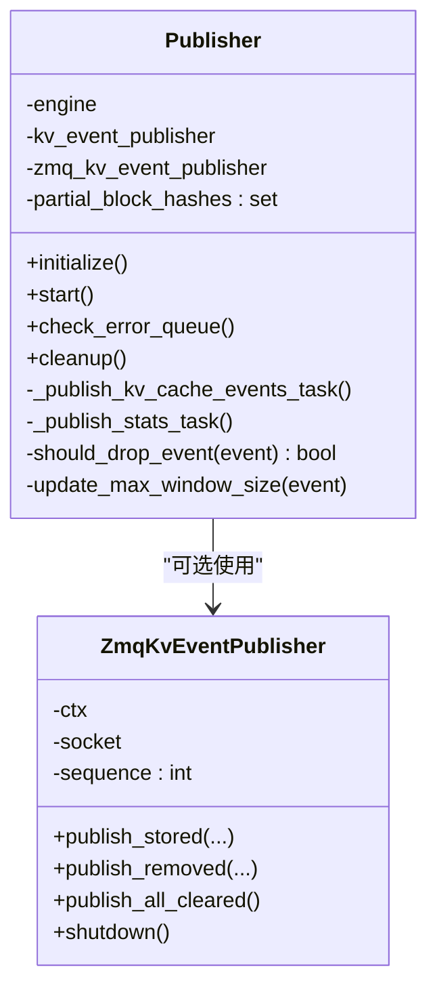
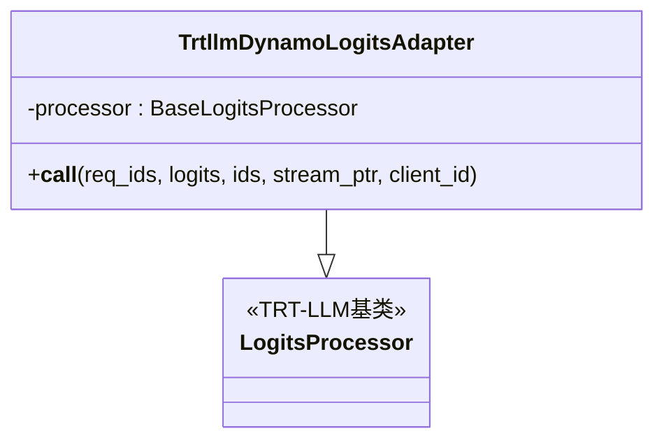
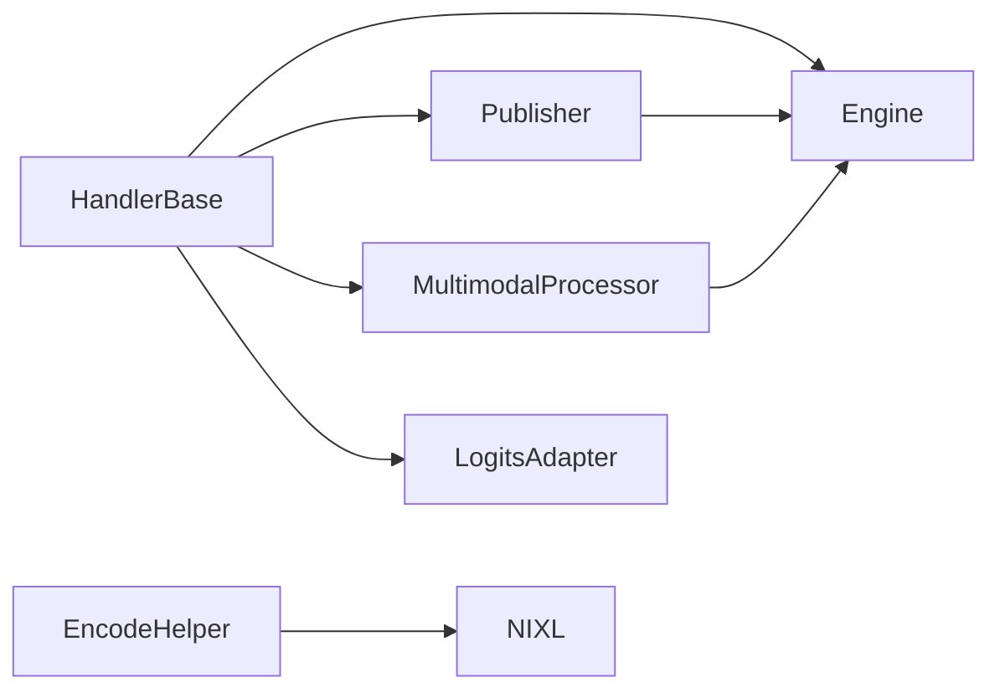

# TensorRT-LLM后端

<cite>
**本文引用的文件**
- [engine.py](file://components/src/dynamo/trtllm/engine.py)
- [constants.py](file://components/src/dynamo/trtllm/constants.py)
- [main.py](file://components/src/dynamo/trtllm/main.py)
- [encode_helper.py](file://components/src/dynamo/trtllm/encode_helper.py)
- [multimodal_processor.py](file://components/src/dynamo/trtllm/multimodal_processor.py)
- [publisher.py](file://components/src/dynamo/trtllm/publisher.py)
- [trtllm_utils.py](file://components/src/dynamo/trtllm/utils/trtllm_utils.py)
- [adapter.py](file://components/src/dynamo/trtllm/logits_processing/adapter.py)
- [handlers.py](file://components/src/dynamo/trtllm/request_handlers/handlers.py)
- [handler_base.py](file://components/src/dynamo/trtllm/request_handlers/handler_base.py)
- [disagg_utils.py](file://components/src/dynamo/trtllm/utils/disagg_utils.py)
- [hasher.py](file://components/src/dynamo/trtllm/multimodal/hasher.py)
- [kv-cache-transfer.md](file://docs/backends/trtllm/kv-cache-transfer.md)
- [gemma3_sliding_window_attention.md](file://docs/backends/trtllm/gemma3_sliding_window_attention.md)
- [llama4_plus_eagle.md](file://docs/backends/trtllm/llama4_plus_eagle.md)
- [gpt-oss.md](file://docs/backends/trtllm/gpt-oss.md)
</cite>

## 目录
1. [简介](#简介)
2. [项目结构](#项目结构)
3. [核心组件](#核心组件)
4. [架构总览](#架构总览)
5. [关键组件深度解析](#关键组件深度解析)
6. [依赖关系分析](#依赖关系分析)
7. [性能考量与优化](#性能考量与优化)
8. [故障排查指南](#故障排查指南)
9. [结论](#结论)
10. [附录](#附录)

## 简介
本文件系统性阐述TensorRT-LLM后端在Dynamo平台中的实现与使用，覆盖引擎管理、编码助手、多模态处理器、日志处理适配器、发布订阅机制与分布式工具等模块，并结合官方文档对KV缓存传输、滑动窗口注意力、Eagle推测解码等性能优化进行说明。同时给出针对Gemma3、Llama4、GPT-OSS等模型的优化配置要点与多节点部署策略，辅以性能调优建议与硬件要求，帮助开发者实现极致推理性能。

## 项目结构
TensorRT-LLM后端位于components/src/dynamo/trtllm目录下，采用按功能域划分的组织方式：
- engine：引擎生命周期与后端类型管理
- request_handlers：请求处理器工厂与具体处理器（聚合/预填充/解码/编码）
- utils：命令行参数解析、配置对象、编解码工具
- multimodal：多模态请求处理与内容哈希
- logits_processing：日志流处理适配器
- publisher：KV事件与指标发布器
- 根目录入口：main.py负责运行时初始化、注册与服务暴露

图表来源
- [main.py](file://components/src/dynamo/trtllm/main.py#L128-L520)
- [engine.py](file://components/src/dynamo/trtllm/engine.py#L24-L142)
- [handlers.py](file://components/src/dynamo/trtllm/request_handlers/handlers.py#L20-L262)
- [publisher.py](file://components/src/dynamo/trtllm/publisher.py#L257-L684)
- [trtllm_utils.py](file://components/src/dynamo/trtllm/utils/trtllm_utils.py#L29-L450)
- [multimodal_processor.py](file://components/src/dynamo/trtllm/multimodal_processor.py#L45-L278)
- [adapter.py](file://components/src/dynamo/trtllm/logits_processing/adapter.py#L15-L89)

章节来源
- [main.py](file://components/src/dynamo/trtllm/main.py#L128-L520)
- [engine.py](file://components/src/dynamo/trtllm/engine.py#L24-L142)
- [handlers.py](file://components/src/dynamo/trtllm/request_handlers/handlers.py#L20-L262)
- [publisher.py](file://components/src/dynamo/trtllm/publisher.py#L257-L684)
- [trtllm_utils.py](file://components/src/dynamo/trtllm/utils/trtllm_utils.py#L29-L450)
- [multimodal_processor.py](file://components/src/dynamo/trtllm/multimodal_processor.py#L45-L278)
- [adapter.py](file://components/src/dynamo/trtllm/logits_processing/adapter.py#L15-L89)

## 核心组件
- 引擎管理（TensorRTLLMEngine）：封装LLM/MultimodalEncoder实例，支持PyTorch与自动部署后端；根据拆分模式选择编码器或标准引擎初始化；提供异步上下文管理与清理。
- 请求处理器（HandlerBase/工厂）：统一生成流程，支持聚合、预填充、解码、编码四种模式；负责输入归一化、采样参数合并、日志概率提取、完成原因与用量统计、取消监控与优雅关闭。
- 多模态处理器（MultimodalRequestProcessor）：从OpenAI格式消息中抽取文本与媒体，加载嵌入或图像数据，构造默认输入加载器，支持增量响应块生成。
- 编码助手（EncodeHelper）：在编码模式下处理两种路径（预计算嵌入NIXL直传/全EPD路径），支持RDMA读取、张量序列化/反序列化、DisaggregatedParams编解码。
- 发布器（Publisher/ZmqKvEventPublisher）：从引擎拉取KV缓存事件与统计，按是否启用合并器选择ZMQ或NATS发布；维护部分块集合避免误删；线程化轮询与指数回退。
- 日志处理适配器（TrtllmDynamoLogitsAdapter）：桥接Dynamo BaseLogitsProcessor到TensorRT-LLM接口，支持CUDA外部流与错误保护。
- 工具集（trtllm_utils/disagg_utils/hasher）：命令行参数解析、配置对象、DisaggregatedParams编解码、BLAKE3多模态哈希。

章节来源
- [engine.py](file://components/src/dynamo/trtllm/engine.py#L24-L142)
- [handler_base.py](file://components/src/dynamo/trtllm/request_handlers/handler_base.py#L73-L821)
- [handlers.py](file://components/src/dynamo/trtllm/request_handlers/handlers.py#L20-L262)
- [multimodal_processor.py](file://components/src/dynamo/trtllm/multimodal_processor.py#L45-L278)
- [encode_helper.py](file://components/src/dynamo/trtllm/encode_helper.py#L16-L440)
- [publisher.py](file://components/src/dynamo/trtllm/publisher.py#L257-L684)
- [adapter.py](file://components/src/dynamo/trtllm/logits_processing/adapter.py#L15-L89)
- [trtllm_utils.py](file://components/src/dynamo/trtllm/utils/trtllm_utils.py#L29-L450)
- [disagg_utils.py](file://components/src/dynamo/trtllm/utils/disagg_utils.py#L22-L50)
- [hasher.py](file://components/src/dynamo/trtllm/multimodal/hasher.py#L21-L50)

## 架构总览
TensorRT-LLM后端通过DistributedRuntime连接请求平面与事件平面，支持NATS或ZMQ；在启用KV事件与指标发布时，引擎产生的KV事件与统计由Publisher线程化采集并发布至ZMQ或NATS，供路由与监控使用；多模态场景下，编码阶段可借助NIXL进行高效RDMA传输，减少网络与CPU开销。

图表来源
- [main.py](file://components/src/dynamo/trtllm/main.py#L430-L520)
- [handler_base.py](file://components/src/dynamo/trtllm/request_handlers/handler_base.py#L685-L785)
- [publisher.py](file://components/src/dynamo/trtllm/publisher.py#L420-L470)

章节来源
- [main.py](file://components/src/dynamo/trtllm/main.py#L430-L520)
- [handler_base.py](file://components/src/dynamo/trtllm/request_handlers/handler_base.py#L685-L785)
- [publisher.py](file://components/src/dynamo/trtllm/publisher.py#L420-L470)

## 关键组件深度解析

### 引擎管理（TensorRTLLMEngine）
- 支持后端类型：PyTorch与自动部署（_autodeploy），后者会裁剪不支持的参数并发出警告。
- 拆分模式：
  - ENCODE：使用MultimodalEncoder初始化，仅传递必要参数。
  - 其他：使用LLM标准初始化，传入完整engine_args。
- 提供异步上下文管理器，确保异常时正确清理。

图表来源
- [engine.py](file://components/src/dynamo/trtllm/engine.py#L24-L142)
- [constants.py](file://components/src/dynamo/trtllm/constants.py#L7-L12)

章节来源
- [engine.py](file://components/src/dynamo/trtllm/engine.py#L24-L142)
- [constants.py](file://components/src/dynamo/trtllm/constants.py#L7-L12)

### 请求处理器（HandlerBase/工厂）
- 工厂模式：根据拆分模式返回对应处理器（聚合/预填充/解码/编码）。
- 统一生成流程：
  - 输入归一化（max_tokens移动到stop_conditions，温度移动到sampling_options）
  - 基于模式设置disaggregated_params（上下文仅/仅生成）
  - 准备输入（多模态/文本）
  - 合并采样参数（含logprobs/prompt_logprobs/max/min_tokens/stop_token_ids等）
  - 流式生成，提取logprobs与top_logprobs，计算usage与prompt_tokens_details
  - 取消监控：支持请求取消与运行时关闭信号
- 特殊处理：
  - 预填充阶段强制max_tokens=1
  - 解码阶段必须提供disaggregated_params
  - 可选测试用logits_processor（通过环境变量启用）

图表来源
- [handler_base.py](file://components/src/dynamo/trtllm/request_handlers/handler_base.py#L562-L800)
- [handlers.py](file://components/src/dynamo/trtllm/request_handlers/handlers.py#L20-L262)

章节来源
- [handler_base.py](file://components/src/dynamo/trtllm/request_handlers/handler_base.py#L73-L821)
- [handlers.py](file://components/src/dynamo/trtllm/request_handlers/handlers.py#L20-L262)

### 多模态处理器（MultimodalRequestProcessor）
- 从OpenAI消息中抽取文本与图片/嵌入路径，支持本地文件限制与大小检查。
- 使用default_multimodal_input_loader处理不同模态输入，复用已初始化的tokenizer。
- 支持增量响应块生成，首块包含角色信息，后续基于前次解码文本计算差分。

图表来源
- [multimodal_processor.py](file://components/src/dynamo/trtllm/multimodal_processor.py#L45-L278)

章节来源
- [multimodal_processor.py](file://components/src/dynamo/trtllm/multimodal_processor.py#L45-L278)

### 编码助手（EncodeHelper）
- 两种工作流：
  - 嵌入路径：从文件/URL加载预计算嵌入，创建NIXL可读操作，供预填充阶段RDMA读取。
  - 全EPD路径：调用MultimodalEncoder生成disaggregated_params，返回给预填充阶段。
- 支持张量序列化/反序列化、RDMA读取、辅助数据打包与还原。

图表来源
- [encode_helper.py](file://components/src/dynamo/trtllm/encode_helper.py#L16-L440)
- [handlers.py](file://components/src/dynamo/trtllm/request_handlers/handlers.py#L56-L88)

章节来源
- [encode_helper.py](file://components/src/dynamo/trtllm/encode_helper.py#L16-L440)
- [handlers.py](file://components/src/dynamo/trtllm/request_handlers/handlers.py#L56-L88)

### 发布订阅机制（Publisher/ZmqKvEventPublisher）
- 事件来源：引擎get_kv_cache_events_async/get_stats_async
- 发布路径：
  - 启用合并器：ZmqKvEventPublisher（纯Python ZMQ发布器）→ 合并器 → 动态路由
  - 无合并器：直接使用NATS发布器（KvEventPublisher）
- 过滤与校正：
  - 初始created事件用于识别全局注意力层的最大窗口尺寸
  - 部分块（不足kv_block_size）不发送移除事件
  - 块哈希转换为有符号i64以兼容下游

图表来源
- [publisher.py](file://components/src/dynamo/trtllm/publisher.py#L257-L684)

章节来源
- [publisher.py](file://components/src/dynamo/trtllm/publisher.py#L257-L684)

### 日志处理适配器（TrtllmDynamoLogitsAdapter）
- 将Dynamo BaseLogitsProcessor包装为TensorRT-LLM的LogitsProcessor接口
- 支持CUDA外部流，单请求/单beam限制，错误时不修改logits

图表来源
- [adapter.py](file://components/src/dynamo/trtllm/logits_processing/adapter.py#L15-L89)

章节来源
- [adapter.py](file://components/src/dynamo/trtllm/logits_processing/adapter.py#L15-L89)

### 分布式与工具集
- 命令行参数与配置：Config对象承载所有运行参数，支持覆盖与深更新；默认端点随拆分模式变化。
- DisaggregatedParams编解码：将opaque_state在字节与base64间转换，便于跨进程/网络传输。
- 多模态哈希：基于BLAKE3对原始字节进行快速、确定性哈希，避免解码开销。

章节来源
- [trtllm_utils.py](file://components/src/dynamo/trtllm/utils/trtllm_utils.py#L29-L450)
- [disagg_utils.py](file://components/src/dynamo/trtllm/utils/disagg_utils.py#L22-L50)
- [hasher.py](file://components/src/dynamo/trtllm/multimodal/hasher.py#L21-L50)

## 依赖关系分析
- 组件耦合：
  - HandlerBase依赖引擎、发布器、多模态处理器、日志处理适配器、分布式运行时与指标收集器。
  - EncodeHelper与NIXL连接器耦合，用于RDMA传输。
  - Publisher与引擎紧密耦合，通过异步迭代器获取事件与统计。
- 外部依赖：
  - TensorRT-LLM LLM/MultimodalEncoder、SamplingParams、KvCacheConfig、SchedulerConfig等。
  - Prometheus、NATS、ZMQ、BLAKE3等。

图表来源
- [handler_base.py](file://components/src/dynamo/trtllm/request_handlers/handler_base.py#L73-L100)
- [encode_helper.py](file://components/src/dynamo/trtllm/encode_helper.py#L12-L14)
- [publisher.py](file://components/src/dynamo/trtllm/publisher.py#L257-L360)

章节来源
- [handler_base.py](file://components/src/dynamo/trtllm/request_handlers/handler_base.py#L73-L100)
- [encode_helper.py](file://components/src/dynamo/trtllm/encode_helper.py#L12-L14)
- [publisher.py](file://components/src/dynamo/trtllm/publisher.py#L257-L360)

## 性能考量与优化
- KV缓存传输
  - 默认使用NIXL（UCX后端）进行跨节点/跨GPU的KV缓存传输，具备高吞吐低延迟特性；也可通过UCX直接配置。
  - 在GPT-OSS等大模型部署中，明确设置cache_transceiver_config.backend为UCX以获得稳定性能。
- 滑动窗口注意力（Gemma3）
  - 通过可变滑动窗口注意力（VSWA）提升长上下文效率；注意版本兼容性（0.5.1包含回归，建议使用0.5.0运行时镜像）。
- 推测解码（Eagle，Llama4）
  - 在GB200多节点上部署Llama4+ Eagle，结合拆分预填充/解码工作负载，显著降低尾延迟。
- 调度与批处理
  - 动态批调度策略（GUARANTEED_NO_EVICT）与窗口平均参数有助于稳定吞吐。
  - 合理设置max_batch_size、max_num_tokens与max_seq_len，避免显存溢出。
- 指标与可观测性
  - 启用publish_events_and_metrics后，TRT-LLM原生指标通过Prometheus导出，结合Dynamo指标回调统一暴露。
- 多模态与RDMA
  - 对于图像/视频等大体积媒体，优先采用NIXL直传路径，减少CPU拷贝与网络往返。
- 硬件与容器
  - GPT-OSS 120B单节点8卡部署示例展示了合理的GPU分配与共享内存/栈限制设置。
  - 多节点部署需保证网络连通与端口占用检查。

章节来源
- [kv-cache-transfer.md](file://docs/backends/trtllm/kv-cache-transfer.md#L24-L41)
- [gemma3_sliding_window_attention.md](file://docs/backends/trtllm/gemma3_sliding_window_attention.md#L18-L65)
- [llama4_plus_eagle.md](file://docs/backends/trtllm/llama4_plus_eagle.md#L18-L86)
- [gpt-oss.md](file://docs/backends/trtllm/gpt-oss.md#L8-L121)
- [main.py](file://components/src/dynamo/trtllm/main.py#L405-L429)

## 故障排查指南
- 常见问题
  - CUDA显存不足：降低max_num_tokens、max_batch_size或调整free_gpu_memory_fraction。
  - 工作进程未连接：确认etcd/NATS服务运行、网络连通、CUDA_VISIBLE_DEVICES与端口占用。
  - 性能异常：监控GPU利用率、检查批大小与chunked prefill设置、核对KV事件发布链路。
  - 容器启动失败：验证NVIDIA Container Toolkit安装、Docker守护进程GPU支持与磁盘空间。
- 错误处理
  - 请求级错误：通过RequestError捕获并返回错误原因，不触发整体关闭。
  - 发布器错误队列：在生成前检查publisher.error_queue，出现异常立即抛出。
  - 优雅关闭：支持信号处理与运行时关闭事件，触发引擎清理与进程退出。

章节来源
- [handler_base.py](file://components/src/dynamo/trtllm/request_handlers/handler_base.py#L175-L222)
- [publisher.py](file://components/src/dynamo/trtllm/publisher.py#L587-L617)
- [gpt-oss.md](file://docs/backends/trtllm/gpt-oss.md#L484-L510)

## 结论
TensorRT-LLM后端在Dynamo中通过清晰的模块化设计实现了高性能推理服务：引擎管理抽象、统一的请求处理流程、完善的多模态与日志处理适配、灵活的发布订阅机制，以及针对KV缓存传输、滑动窗口注意力与推测解码等关键性能特性的工程化落地。配合官方文档提供的模型优化配置与多节点部署策略，开发者可在不同硬件与场景下实现极致推理性能。

## 附录
- 命令行参数与默认行为
  - 端点默认值随拆分模式变化（聚合/预填充/编码），可通过--endpoint覆盖。
  - 支持自定义Jinja模板、推理与工具调用解析器、事件与指标发布开关。
- 配置覆盖
  - 支持从YAML读取额外engine参数并通过--override-engine-args进行JSON覆盖，采用深更新策略。

章节来源
- [trtllm_utils.py](file://components/src/dynamo/trtllm/utils/trtllm_utils.py#L139-L434)