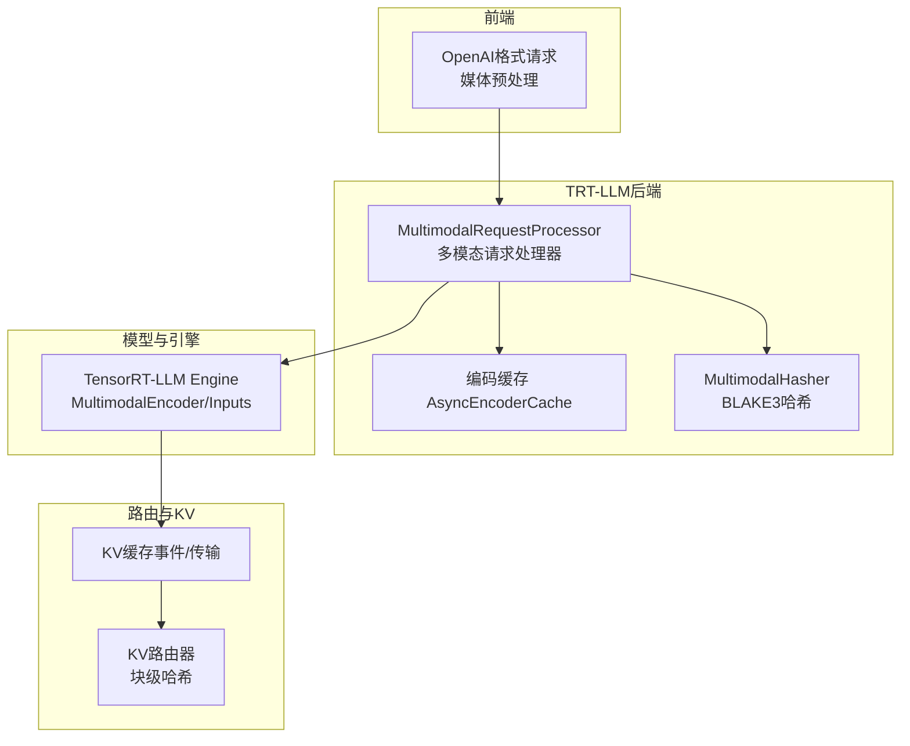
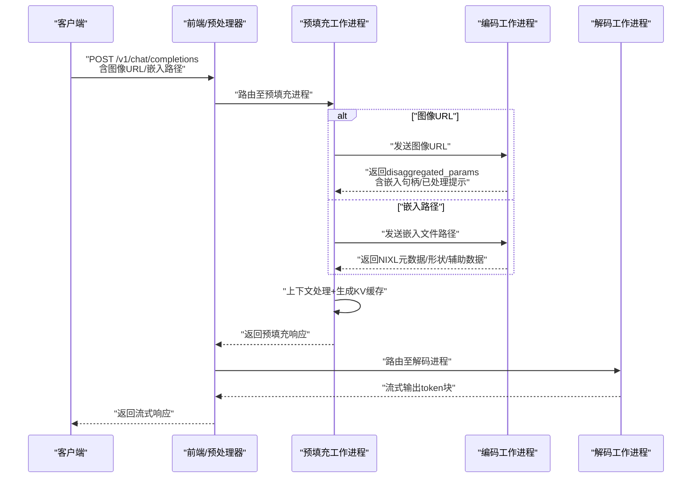
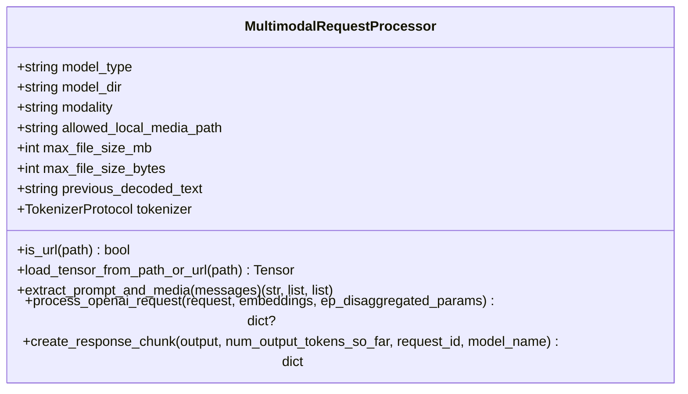
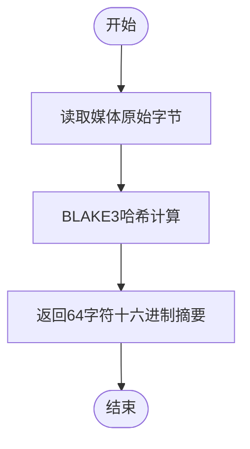
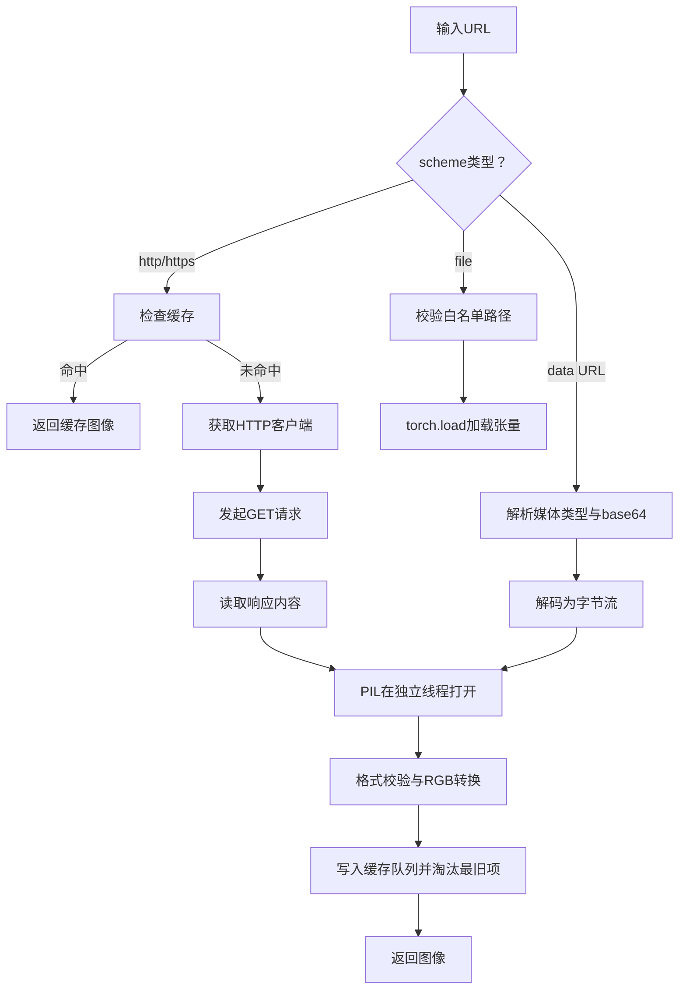
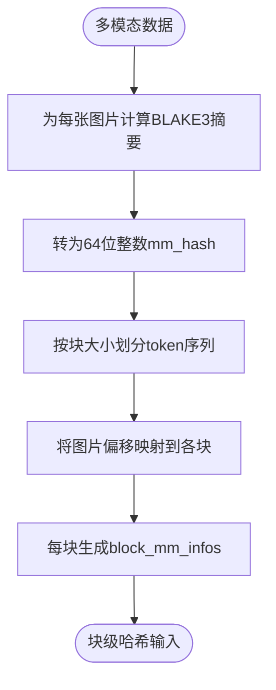
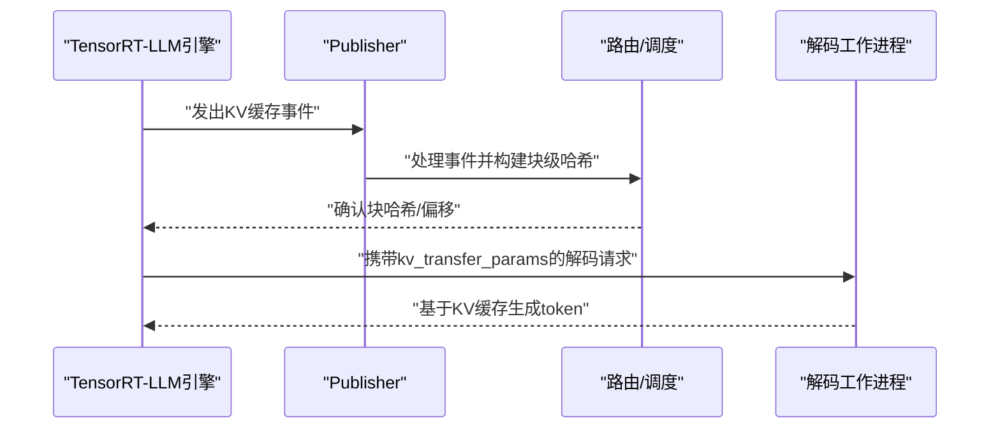
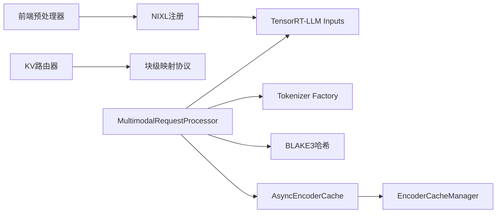

# 多模态处理

<cite>
**本文引用的文件**
- [multimodal_processor.py](file://components/src/dynamo/trtllm/multimodal_processor.py)
- [hasher.py](file://components/src/dynamo/trtllm/multimodal/hasher.py)
- [async_encoder_cache.py](file://components/src/dynamo/common/multimodal/async_encoder_cache.py)
- [chat_message_utils.py](file://examples/multimodal/utils/chat_message_utils.py)
- [image_loader.py](file://examples/multimodal/utils/image_loader.py)
- [protocol.py](file://examples/multimodal/utils/protocol.py)
- [http_client.py](file://examples/multimodal/utils/http_client.py)
- [encode_utils.py](file://examples/multimodal/utils/encode_utils.py)
- [local_media_server.py](file://benchmarks/multimodal/local_media_server.py)
- [trtllm.md](file://docs/multimodal/trtllm.md)
- [kvbm_integrations.md](file://docs/kvbm/kvbm_integrations.md)
- [preprocessed_handler.py](file://components/src/dynamo/vllm/multimodal_handlers/preprocessed_handler.py)
- [worker_handler.py](file://components/src/dynamo/vllm/multimodal_handlers/worker_handler.py)
- [protocols.rs](file://lib/kv-router/src/protocols.rs)
- [layout.rs](file://lib/llm/src/block_manager/layout.rs)
- [publisher.py](file://components/src/dynamo/trtllm/publisher.py)
- [test_router.py](file://examples/deployments/router_standalone_trtllm/test_router.py)
- [api.py](file://examples/deployments/router_standalone_trtllm/api.py)
- [preprocessor.rs](file://lib/llm/tests/preprocessor.rs)
- [README.md](file://lib/llm/src/preprocessor/media/README.md)
</cite>

## 目录
1. [简介](#简介)
2. [项目结构](#项目结构)
3. [核心组件](#核心组件)
4. [架构总览](#架构总览)
5. [详细组件分析](#详细组件分析)
6. [依赖关系分析](#依赖关系分析)
7. [性能考量](#性能考量)
8. [故障排查指南](#故障排查指南)
9. [结论](#结论)
10. [附录](#附录)

## 简介
本文件面向TensorRT-LLM后端的多模态处理，围绕MultimodalRequestProcessor的架构与实现进行深入解析，覆盖多模态请求预处理、媒体文件处理、模型集成机制；详述多模态哈希算法、媒体缓存策略与请求路由优化；梳理多模态工具集（聊天消息处理、图像加载器、协议定义、HTTP客户端）；阐述KV缓存在多模态场景下的特殊处理逻辑、多模态模型的性能优化与内存管理策略，并提供部署指南、媒体处理最佳实践与性能调优技巧。

## 项目结构
多模态能力在TRT-LLM后端主要由以下层次构成：
- 前端预处理：媒体下载、解码、NIXL注册（Rust侧）
- 后端处理：TRT-LLM工作进程（Python侧），负责多模态输入加载与模型集成
- 路由与哈希：基于BLAKE3的多模态哈希，结合块级哈希用于KV缓存命中
- 编码缓存：异步编码缓存，支持请求合并与去重
- 工具与协议：图像加载、协议定义、HTTP客户端等

**图表来源**
- [multimodal_processor.py](file://components/src/dynamo/trtllm/multimodal_processor.py#L45-L278)
- [hasher.py](file://components/src/dynamo/trtllm/multimodal/hasher.py#L21-L50)
- [async_encoder_cache.py](file://components/src/dynamo/common/multimodal/async_encoder_cache.py#L44-L136)
- [trtllm.md](file://docs/multimodal/trtllm.md#L18-L477)

**章节来源**
- [trtllm.md](file://docs/multimodal/trtllm.md#L18-L477)

## 核心组件
- MultimodalRequestProcessor：负责从OpenAI格式消息中提取文本与媒体信息，加载嵌入或图像数据，调用TensorRT-LLM默认多模态输入加载器，生成可被引擎消费的输入；同时支持增量流式响应拼接。
- MultimodalHasher：使用BLAKE3对原始字节进行哈希，保证快速且确定性，避免语义差异导致的哈希不一致。
- AsyncEncoderCache：异步封装编码缓存，支持同一内容的请求合并与去重，降低重复编码开销。
- 图像加载器与HTTP客户端：统一处理HTTP/HTTPS、data URL与本地文件（受控路径），并提供基础缓存与超时控制。
- 协议定义：标准化聊天消息、多模态请求、vLLM生成请求等数据结构，确保跨组件序列化与传输一致性。
- 预处理与路由：前端预处理将媒体解码并通过NIXL注册；路由根据块级哈希与多模态对象偏移进行调度。

**章节来源**
- [multimodal_processor.py](file://components/src/dynamo/trtllm/multimodal_processor.py#L45-L278)
- [hasher.py](file://components/src/dynamo/trtllm/multimodal/hasher.py#L21-L50)
- [async_encoder_cache.py](file://components/src/dynamo/common/multimodal/async_encoder_cache.py#L44-L136)
- [image_loader.py](file://examples/multimodal/utils/image_loader.py#L31-L108)
- [http_client.py](file://examples/multimodal/utils/http_client.py#L27-L48)
- [protocol.py](file://examples/multimodal/utils/protocol.py#L34-L191)
- [preprocessed_handler.py](file://components/src/dynamo/vllm/multimodal_handlers/preprocessed_handler.py#L198-L243)

## 架构总览
下图展示E/P/D（全链路）多模态推理流程，涵盖图像URL到嵌入、KV缓存生成与解码流式输出的关键步骤。

**图表来源**
- [trtllm.md](file://docs/multimodal/trtllm.md#L147-L342)

## 详细组件分析

### MultimodalRequestProcessor：多模态请求处理核心
- 请求解析与预处理
  - 支持从extra_args/messages中提取消息列表，兼容Rust预处理器输出。
  - 提取文本提示、图像URL与嵌入路径，设置模态类型（如image）。
- 媒体加载与安全控制
  - URL检测：区分HTTP/HTTPS与file://；对file://做本地路径白名单校验，防止越权访问。
  - 文件大小限制：读取最多超过阈值1字节以提前失败，避免大文件占用。
  - 本地文件仅允许在配置的受限目录内，且必须在白名单子树内。
- 模型集成与输入生成
  - 支持三种模式：EPD（经编码器处理后的提示）、NIXL嵌入、直接图像URL或嵌入路径。
  - 调用TensorRT-LLM默认多模态输入加载器，传入tokenizer、模型目录、模型类型、模态、提示与媒体参数。
- 流式响应增量拼接
  - 使用tokenizer解码当前token_ids，与上次解码文本比较，计算增量delta，首块包含角色字段。

**图表来源**
- [multimodal_processor.py](file://components/src/dynamo/trtllm/multimodal_processor.py#L45-L278)

**章节来源**
- [multimodal_processor.py](file://components/src/dynamo/trtllm/multimodal_processor.py#L45-L278)

### 多模态哈希算法：BLAKE3原字节哈希
- 设计目标：快速、确定性、无语义差异；对同一视觉内容的不同容器格式产生不同哈希，符合“按原始字节”原则。
- 实现要点：静态方法对原始字节执行BLAKE3哈希，返回64字符十六进制字符串。
- 应用价值：用于KV路由器的块级哈希构建，确保相同图像在不同请求间命中缓存块。

**图表来源**
- [hasher.py](file://components/src/dynamo/trtllm/multimodal/hasher.py#L21-L50)

**章节来源**
- [hasher.py](file://components/src/dynamo/trtllm/multimodal/hasher.py#L21-L50)

### 媒体文件缓存策略：图像加载器与HTTP客户端
- 图像加载器
  - 支持HTTP/HTTPS、data URL与本地文件（受控路径）；data URL要求image/类型与base64编码。
  - 对HTTP(S)请求采用异步HTTP客户端，PIL解码在独立线程执行，避免阻塞事件循环。
  - 内置LRU式缓存队列，限制最大缓存数量，自动淘汰最旧条目。
- HTTP客户端
  - 全局共享实例，复用连接池与keepalive；可配置超时与连接上限，减少握手开销。

**图表来源**
- [image_loader.py](file://examples/multimodal/utils/image_loader.py#L31-L108)
- [http_client.py](file://examples/multimodal/utils/http_client.py#L27-L48)

**章节来源**
- [image_loader.py](file://examples/multimodal/utils/image_loader.py#L31-L108)
- [http_client.py](file://examples/multimodal/utils/http_client.py#L27-L48)

### 请求路由优化：多模态哈希与块级映射
- mm_hash计算
  - 将每张图片的BLAKE3摘要转为64位整数，作为mm_hash参与后续哈希计算。
- 块级信息构建
  - 将请求级多模态对象偏移映射到每个块级范围，形成每块对应的mm_objects列表。
- 路由一致性测试
  - 单测验证不同mm_hash应产生不同块哈希；相同输入应幂等一致；多图场景下不同图片不应出现错误缓存命中。

**图表来源**
- [api.py](file://examples/deployments/router_standalone_trtllm/api.py#L321-L357)
- [test_router.py](file://examples/deployments/router_standalone_trtllm/test_router.py#L379-L933)
- [protocols.rs](file://lib/kv-router/src/protocols.rs#L328-L353)

**章节来源**
- [api.py](file://examples/deployments/router_standalone_trtllm/api.py#L321-L357)
- [test_router.py](file://examples/deployments/router_standalone_trtllm/test_router.py#L379-L933)
- [protocols.rs](file://lib/kv-router/src/protocols.rs#L328-L353)

### KV缓存传输与多模态集成
- KV事件与存储
  - 引擎通过事件轮询获取KV缓存事件，过滤非全局注意力层事件，仅处理有效块。
- vLLM多模态处理
  - 在预填充阶段，根据模型类型决定是否保留原始未扩展提示，以匹配解码阶段的展开行为。
  - 将KV传输参数注入采样参数，驱动解码阶段的缓存迁移。
- TRT-LLM解码优化
  - 解码阶段若存在预填充元数据，可直接复用已处理提示与token_ids，跳过图像重处理，利用KV缓存上下文。

**图表来源**
- [publisher.py](file://components/src/dynamo/trtllm/publisher.py#L461-L476)
- [worker_handler.py](file://components/src/dynamo/vllm/multimodal_handlers/worker_handler.py#L307-L329)
- [handler_base.py](file://components/src/dynamo/trtllm/request_handlers/handler_base.py#L454-L485)

**章节来源**
- [publisher.py](file://components/src/dynamo/trtllm/publisher.py#L461-L476)
- [worker_handler.py](file://components/src/dynamo/vllm/multimodal_handlers/worker_handler.py#L307-L329)
- [handler_base.py](file://components/src/dynamo/trtllm/request_handlers/handler_base.py#L454-L485)

### 多模态工具集：聊天消息、图像加载、协议与HTTP
- 聊天消息处理
  - 提取用户消息中的文本内容，按换行拼接，便于下游模型理解。
- 图像加载器
  - 统一处理多种来源，内置缓存与格式校验，保障稳定性与性能。
- 协议定义
  - 定义聊天消息、多模态请求、vLLM生成请求等结构，支持序列化与反序列化。
- HTTP客户端
  - 全局共享实例，配置连接池与超时，提升并发效率。

**章节来源**
- [chat_message_utils.py](file://examples/multimodal/utils/chat_message_utils.py#L7-L26)
- [image_loader.py](file://examples/multimodal/utils/image_loader.py#L31-L108)
- [protocol.py](file://examples/multimodal/utils/protocol.py#L34-L191)
- [http_client.py](file://examples/multimodal/utils/http_client.py#L27-L48)

### 编码与嵌入：模型特定编码器与投影
- 编码流程
  - 根据模型名称选择编码器与投影器（如LLaVA需要投影器，Qwen2-VL不需要）。
  - 支持网格维度（image_grid_thw）传递，增强多尺度建模。
- 输出规范化
  - 统一输出形状，确保与后续多模态输入适配。

**章节来源**
- [encode_utils.py](file://examples/multimodal/utils/encode_utils.py#L58-L133)

### 前端媒体解码与NIXL注册
- 媒体解码
  - 支持图像与视频解码，限制最大宽高与分配，避免内存溢出。
- NIXL注册
  - 将解码后的像素值等数据通过NIXL注册，供后端零拷贝访问。

**章节来源**
- [README.md](file://lib/llm/src/preprocessor/media/README.md#L1-L41)
- [preprocessor.rs](file://lib/llm/tests/preprocessor.rs#L614-L649)

## 依赖关系分析
- 组件耦合
  - MultimodalRequestProcessor依赖TensorRT-LLM输入加载器与tokenizer工厂，耦合度低但功能集中。
  - AsyncEncoderCache与EncoderCacheManager通过Future协调并发，避免重复计算。
  - 路由层依赖BLAKE3哈希与块级映射协议，确保KV缓存命中正确性。
- 外部依赖
  - httpx用于HTTP客户端；PIL用于图像解码；blake3用于哈希；msgspec/pydantic用于协议序列化。

**图表来源**
- [multimodal_processor.py](file://components/src/dynamo/trtllm/multimodal_processor.py#L217-L226)
- [async_encoder_cache.py](file://components/src/dynamo/common/multimodal/async_encoder_cache.py#L44-L136)
- [protocols.rs](file://lib/kv-router/src/protocols.rs#L328-L353)
- [README.md](file://lib/llm/src/preprocessor/media/README.md#L1-L41)

**章节来源**
- [multimodal_processor.py](file://components/src/dynamo/trtllm/multimodal_processor.py#L217-L226)
- [async_encoder_cache.py](file://components/src/dynamo/common/multimodal/async_encoder_cache.py#L44-L136)
- [protocols.rs](file://lib/kv-router/src/protocols.rs#L328-L353)
- [README.md](file://lib/llm/src/preprocessor/media/README.md#L1-L41)

## 性能考量
- 并发与去重
  - AsyncEncoderCache通过Future与缓存队列实现请求合并，显著降低重复编码成本。
- I/O与解码
  - 图像加载器使用独立线程执行PIL解码，避免阻塞事件循环；HTTP客户端复用连接池，减少握手开销。
- KV缓存布局
  - 块级布局类型自动检测，依据张量形状选择外维连续或块连续，提升设备内存访问效率。
- 路由与哈希
  - BLAKE3原字节哈希快速且稳定；块级映射确保多图场景下缓存命中准确，减少冗余块生成。

**章节来源**
- [async_encoder_cache.py](file://components/src/dynamo/common/multimodal/async_encoder_cache.py#L78-L124)
- [image_loader.py](file://examples/multimodal/utils/image_loader.py#L80-L100)
- [layout.rs](file://lib/llm/src/block_manager/layout.rs#L164-L179)

## 故障排查指南
- 媒体加载失败
  - 检查URL scheme与白名单路径；确认文件大小未超限；data URL需满足image/与base64格式。
- 哈希不一致或缓存误命中
  - 确认BLAKE3哈希计算与块级映射逻辑；单测验证不同mm_hash应产生不同块哈希。
- KV缓存事件异常
  - 检查事件来源是否为全局注意力层；确认kv_transfer_params正确注入解码请求。
- 嵌入编码问题
  - 校验模型名称与投影器配置；确保网格维度（image_grid_thw）正确传递。

**章节来源**
- [multimodal_processor.py](file://components/src/dynamo/trtllm/multimodal_processor.py#L79-L138)
- [test_router.py](file://examples/deployments/router_standalone_trtllm/test_router.py#L379-L933)
- [publisher.py](file://components/src/dynamo/trtllm/publisher.py#L472-L476)
- [encode_utils.py](file://examples/multimodal/utils/encode_utils.py#L58-L133)

## 结论
MultimodalRequestProcessor在TRT-LLM多模态流水线中承担关键角色：统一请求解析、安全加载媒体、生成模型输入并支持流式响应。配合BLAKE3哈希与块级映射，路由系统能够高效命中KV缓存；异步编码缓存进一步降低重复计算成本。通过规范化的协议与HTTP客户端，系统在易用性与性能之间取得平衡。建议在生产环境中严格配置白名单路径与文件大小限制，合理设置HTTP客户端参数，并在多图场景下关注mm_hash与块级映射的一致性。

## 附录
- 部署指南与最佳实践
  - 参考官方文档了解聚合与拆分部署模式、E/P/D流程与NIXL使用注意事项。
  - 在大规模模型或多节点场景下，优先采用E/P/D架构分离编码与推理负载。
- 性能调优建议
  - 合理设置HTTP客户端连接池与超时；启用图像缓存并控制最大缓存数量。
  - 利用BLAKE3哈希与块级映射减少重复块生成；在解码阶段复用预填充元数据以避免图像重处理。
  - 关注KV缓存布局类型自动检测，确保设备内存访问最优。

**章节来源**
- [trtllm.md](file://docs/multimodal/trtllm.md#L18-L477)
- [kvbm_integrations.md](file://docs/kvbm/kvbm_integrations.md#L19-L45)