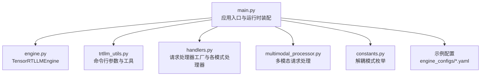
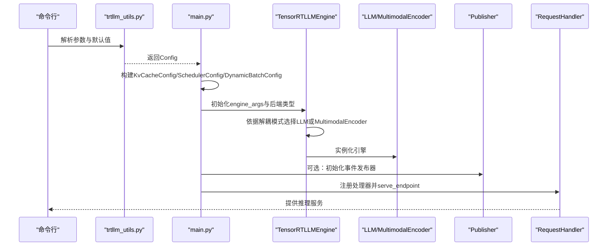
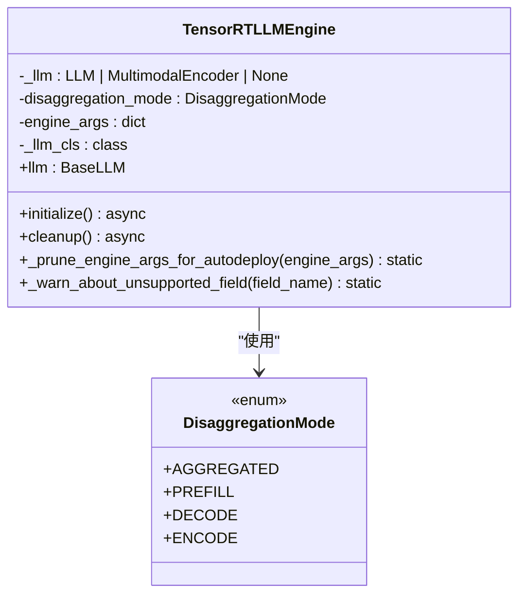
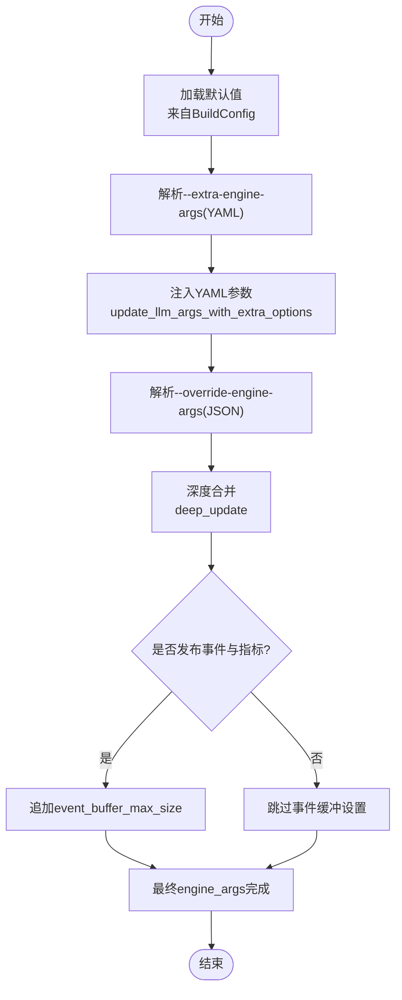
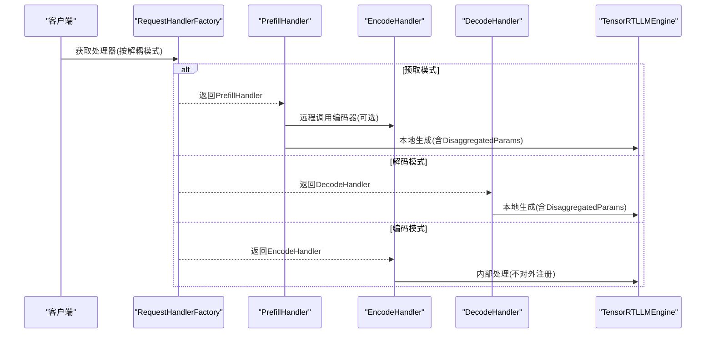
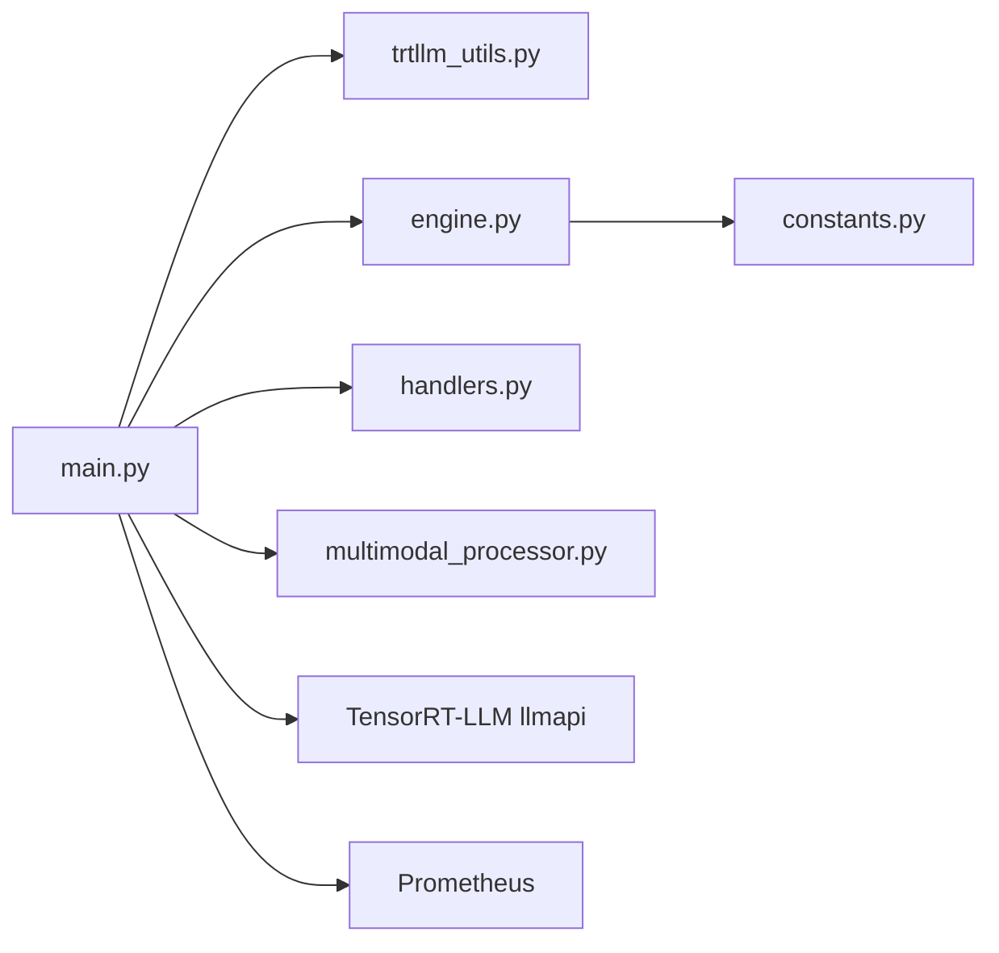

# 引擎管理与配置

<cite>
**本文引用的文件**
- [engine.py](file://components/src/dynamo/trtllm/engine.py)
- [constants.py](file://components/src/dynamo/trtllm/constants.py)
- [main.py](file://components/src/dynamo/trtllm/main.py)
- [trtllm_utils.py](file://components/src/dynamo/trtllm/utils/trtllm_utils.py)
- [handlers.py](file://components/src/dynamo/trtllm/request_handlers/handlers.py)
- [multimodal_processor.py](file://components/src/dynamo/trtllm/multimodal_processor.py)
- [agg.yaml](file://examples/backends/trtllm/engine_configs/qwen3/agg.yaml)
- [encode.yaml](file://examples/backends/trtllm/engine_configs/llama4/multimodal/llama4-Scout/encode.yaml)
- [prefill.yaml](file://examples/backends/trtllm/engine_configs/deepseek-r1/disagg/simple/prefill.yaml)
- [README.md（引擎配置）](file://examples/backends/trtllm/engine_configs/README.md)
- [trtllm.py（配置修改器）](file://benchmarks/profiler/utils/config_modifiers/trtllm.py)
</cite>

## 目录
1. [简介](#简介)
2. [项目结构](#项目结构)
3. [核心组件](#核心组件)
4. [架构总览](#架构总览)
5. [详细组件分析](#详细组件分析)
6. [依赖关系分析](#依赖关系分析)
7. [性能考虑](#性能考虑)
8. [故障排查指南](#故障排查指南)
9. [结论](#结论)
10. [附录](#附录)

## 简介
本文件面向TensorRT-LLM引擎在Dynamo平台中的管理与配置，系统性阐述以下主题：
- TensorRTLLMEngine类的实现架构：初始化流程、参数配置、性能优化设置与资源管理
- 核心配置组件KvCacheConfig、SchedulerConfig、DynamicBatchConfig的作用与配置方法
- 引擎参数覆盖机制、额外引擎参数处理与配置优先级规则
- 分布式实用工具函数、常量定义与命令行参数解析的实现细节
- 引擎性能调优指南、硬件要求匹配与配置最佳实践

## 项目结构
围绕TRT-LLM后端的关键模块与职责如下：
- engine.py：定义TensorRTLLMEngine与上下文管理器，负责引擎实例化、清理与后端选择
- constants.py：定义解耦模式枚举DisaggregationMode
- main.py：应用入口，构建调度器、缓存、连接器配置，解析命令行参数并注册服务
- trtllm_utils.py：命令行参数解析、默认值、深度合并与端点解析等工具
- request_handlers/handlers.py：请求处理器工厂与不同解耦模式下的生成逻辑
- multimodal_processor.py：多模态请求预处理与响应增量拼接
- 示例配置：examples/backends/trtllm/engine_configs 下的多种部署场景配置

图表来源
- [main.py](file://components/src/dynamo/trtllm/main.py#L128-L520)
- [engine.py](file://components/src/dynamo/trtllm/engine.py#L24-L142)
- [trtllm_utils.py](file://components/src/dynamo/trtllm/utils/trtllm_utils.py#L139-L434)
- [handlers.py](file://components/src/dynamo/trtllm/request_handlers/handlers.py#L20-L262)
- [multimodal_processor.py](file://components/src/dynamo/trtllm/multimodal_processor.py#L45-L278)
- [constants.py](file://components/src/dynamo/trtllm/constants.py#L7-L12)

章节来源
- [main.py](file://components/src/dynamo/trtllm/main.py#L128-L520)
- [engine.py](file://components/src/dynamo/trtllm/engine.py#L24-L142)
- [trtllm_utils.py](file://components/src/dynamo/trtllm/utils/trtllm_utils.py#L139-L434)
- [handlers.py](file://components/src/dynamo/trtllm/request_handlers/handlers.py#L20-L262)
- [multimodal_processor.py](file://components/src/dynamo/trtllm/multimodal_processor.py#L45-L278)
- [constants.py](file://components/src/dynamo/trtllm/constants.py#L7-L12)

## 核心组件
- TensorRTLLMEngine：封装LLM/MultimodalEncoder实例，支持pytorch与_autodeploy两种后端；提供异步initialize/cleanup与属性访问
- 配置对象Config：统一承载命令行参数与默认值，用于构建engine_args
- 请求处理器：根据解耦模式（聚合/预取/解码/编码）分发到对应处理器
- 多模态处理器：对图像URL或嵌入路径进行安全加载与输入拼装
- 常量：解耦模式枚举，区分prefill/decode/encode/prefill_and_decode

章节来源
- [engine.py](file://components/src/dynamo/trtllm/engine.py#L24-L142)
- [trtllm_utils.py](file://components/src/dynamo/trtllm/utils/trtllm_utils.py#L29-L104)
- [handlers.py](file://components/src/dynamo/trtllm/request_handlers/handlers.py#L20-L262)
- [multimodal_processor.py](file://components/src/dynamo/trtllm/multimodal_processor.py#L45-L278)
- [constants.py](file://components/src/dynamo/trtllm/constants.py#L7-L12)

## 架构总览
下图展示从命令行参数到引擎实例化、调度器与缓存配置、事件发布与处理器注册的完整流程。

图表来源
- [trtllm_utils.py](file://components/src/dynamo/trtllm/utils/trtllm_utils.py#L139-L434)
- [main.py](file://components/src/dynamo/trtllm/main.py#L162-L520)
- [engine.py](file://components/src/dynamo/trtllm/engine.py#L54-L91)

章节来源
- [main.py](file://components/src/dynamo/trtllm/main.py#L162-L520)
- [engine.py](file://components/src/dynamo/trtllm/engine.py#L54-L91)
- [trtllm_utils.py](file://components/src/dynamo/trtllm/utils/trtllm_utils.py#L139-L434)

## 详细组件分析

### TensorRTLLMEngine 类
- 职责
  - 后端选择：pytorch或_autodeploy；后者会裁剪不支持字段
  - 引擎实例化：按解耦模式选择LLM或MultimodalEncoder
  - 生命周期管理：异步initialize/cleanup，异常处理与资源释放
- 关键点
  - 对engine_args进行深拷贝，避免外部副作用
  - Autodeploy模式下裁剪不支持字段并发出警告
  - 解耦模式ENCODE使用MultimodalEncoder构造器

图表来源
- [engine.py](file://components/src/dynamo/trtllm/engine.py#L24-L142)
- [constants.py](file://components/src/dynamo/trtllm/constants.py#L7-L12)

章节来源
- [engine.py](file://components/src/dynamo/trtllm/engine.py#L24-L142)
- [constants.py](file://components/src/dynamo/trtllm/constants.py#L7-L12)

### 配置与参数覆盖机制
- 参数来源与优先级
  1) 默认值（来自BuildConfig字段）
  2) YAML额外参数（--extra-engine-args）
  3) JSON覆盖参数（--override-engine-args）
  4) 运行时动态设置（如事件缓冲大小、后端类型）
- 关键实现
  - 使用update_llm_args_with_extra_options注入YAML额外参数
  - 使用deep_update递归合并JSON覆盖字典
  - 发布事件与指标时强制后端为pytorch，并追加事件缓冲大小

图表来源
- [main.py](file://components/src/dynamo/trtllm/main.py#L233-L274)
- [trtllm_utils.py](file://components/src/dynamo/trtllm/utils/trtllm_utils.py#L437-L450)

章节来源
- [main.py](file://components/src/dynamo/trtllm/main.py#L233-L274)
- [trtllm_utils.py](file://components/src/dynamo/trtllm/utils/trtllm_utils.py#L437-L450)

### 核心配置组件
- KvCacheConfig
  - 作用：控制KV缓存内存分配比例、数据类型、块复用策略等
  - 在main.py中基于free_gpu_memory_fraction构建；当启用特定连接器时关闭部分复用
  - 示例：qwen3/agg.yaml与llama4-Scout/encode.yaml展示了不同dtype与复用策略
- SchedulerConfig + DynamicBatchConfig
  - 作用：容量调度策略（Guaranteed No Evict）、动态批处理窗口与自适应
  - 在main.py中创建并注入engine_args
- 示例配置要点
  - 混合专家并行（moe_expert_parallel_size）与注意力数据并行（enable_attention_dp）需与模型兼容
  - 预取/解码分离时KV缓存dtype必须一致
  - CUDA Graph与overlap_scheduler相关开关影响吞吐与延迟

章节来源
- [main.py](file://components/src/dynamo/trtllm/main.py#L197-L212)
- [agg.yaml](file://examples/backends/trtllm/engine_configs/qwen3/agg.yaml#L24-L34)
- [encode.yaml](file://examples/backends/trtllm/engine_configs/llama4/multimodal/llama4-Scout/encode.yaml#L24-L29)
- [prefill.yaml](file://examples/backends/trtllm/engine_configs/deepseek-r1/disagg/simple/prefill.yaml#L27-L35)
- [README.md（引擎配置）](file://examples/backends/trtllm/engine_configs/README.md#L32-L43)

### 命令行参数解析与工具函数
- 命令行参数
  - --endpoint/--model-path/--served-model-name
  - 并行度：--tensor-parallel-size/--pipeline-parallel-size/--expert-parallel-size
  - 批处理与序列长度：--max-batch-size/--max-num-tokens/--max-seq-len/--max-beam-width
  - 内存与事件：--free-gpu-memory-fraction/--publish-events-and-metrics/--connector
  - 解耦模式与多模态：--disaggregation-mode/--modality/--encode-endpoint
  - 存储与平面：--store-kv/--request-plane/--event-plane
  - 其他：--dyn-tool-call-parser/--dyn-reasoning-parser/--custom-jinja-template
- 工具函数
  - parse_endpoint：解析命名空间/组件/端点
  - deep_update：递归字典合并
  - Config：统一承载所有参数与默认值

章节来源
- [trtllm_utils.py](file://components/src/dynamo/trtllm/utils/trtllm_utils.py#L139-L434)
- [trtllm_utils.py](file://components/src/dynamo/trtllm/utils/trtllm_utils.py#L115-L137)
- [trtllm_utils.py](file://components/src/dynamo/trtllm/utils/trtllm_utils.py#L437-L450)

### 请求处理与解耦模式
- 工厂模式：根据DisaggregationMode返回Aggregated/Prefill/Decode/Encode处理器
- 生成流程
  - 聚合模式：本地全链路生成
  - 预取模式：可调用编码器获取DisaggregatedParams或嵌入张量，再本地生成
  - 解码模式：接收预取阶段的参数，本地继续生成
  - 编码模式：内部工作流，处理多模态特征提取

图表来源
- [handlers.py](file://components/src/dynamo/trtllm/request_handlers/handlers.py#L20-L262)
- [engine.py](file://components/src/dynamo/trtllm/engine.py#L54-L91)

章节来源
- [handlers.py](file://components/src/dynamo/trtllm/request_handlers/handlers.py#L20-L262)
- [engine.py](file://components/src/dynamo/trtllm/engine.py#L54-L91)

### 多模态处理
- 功能
  - 安全加载：限制本地文件访问目录、校验URL与文件大小
  - 输入拼装：支持图像URL与嵌入路径，结合编码器输出或本地加载
  - 流式增量：基于tokenizer增量拼接响应块
- 关键点
  - 通过tokenizer_factory复用已初始化tokenizer
  - 支持EPD（Encoder-Prefill-Decode）与PD（Prompt-Decode）两种流程

章节来源
- [multimodal_processor.py](file://components/src/dynamo/trtllm/multimodal_processor.py#L45-L278)

## 依赖关系分析
- 组件耦合
  - main.py高度协调各模块：参数解析、引擎构建、调度器与缓存配置、事件发布、处理器注册
  - engine.py与constants.py低耦合，仅通过枚举交互
  - handlers.py依赖engine与multimodal_processor，形成清晰职责边界
- 外部依赖
  - TensorRT-LLM llmapi：KvCacheConfig、SchedulerConfig、DynamicBatchConfig、SamplingParams、MetricsCollector
  - Pydantic/Transformers：配置验证与模型配置读取
  - Prometheus：指标导出

图表来源
- [main.py](file://components/src/dynamo/trtllm/main.py#L24-L66)
- [engine.py](file://components/src/dynamo/trtllm/engine.py#L9-L14)
- [handlers.py](file://components/src/dynamo/trtllm/request_handlers/handlers.py#L7-L17)
- [multimodal_processor.py](file://components/src/dynamo/trtllm/multimodal_processor.py#L25-L28)

章节来源
- [main.py](file://components/src/dynamo/trtllm/main.py#L24-L66)
- [engine.py](file://components/src/dynamo/trtllm/engine.py#L9-L14)
- [handlers.py](file://components/src/dynamo/trtllm/request_handlers/handlers.py#L7-L17)
- [multimodal_processor.py](file://components/src/dynamo/trtllm/multimodal_processor.py#L25-L28)

## 性能考虑
- 并行度与显存
  - tensor_parallel_size与moe_expert_parallel_size提升吞吐但占用更多显存
  - free_gpu_memory_fraction决定KV缓存可用显存比例，需结合attention_dp与dtype调整
- 批处理与调度
  - DynamicBatchConfig开启批次自适应，合理设置moving_average_window
  - SchedulerConfig采用Guaranteed No Evict策略保证QoS
- CUDA Graph与重叠调度
  - cuda_graph_config与disable_overlap_scheduler影响延迟与吞吐平衡
- 事件与指标
  - 发布事件与指标时强制后端为pytorch，并追加event_buffer_max_size以启用KV事件
- 示例参考
  - qwen3/agg.yaml：启用chunked prefill与CUDA Graph
  - llama4-Scout/encode.yaml：降低free_gpu_memory_fraction与禁用block_reuse以适配编码器
  - deepseek-r1/disagg/prefill.yaml：预取/解码分离且dtype保持一致

章节来源
- [main.py](file://components/src/dynamo/trtllm/main.py#L197-L212)
- [main.py](file://components/src/dynamo/trtllm/main.py#L248-L274)
- [agg.yaml](file://examples/backends/trtllm/engine_configs/qwen3/agg.yaml#L24-L34)
- [encode.yaml](file://examples/backends/trtllm/engine_configs/llama4/multimodal/llama4-Scout/encode.yaml#L24-L29)
- [prefill.yaml](file://examples/backends/trtllm/engine_configs/deepseek-r1/disagg/simple/prefill.yaml#L27-L35)
- [README.md（引擎配置）](file://examples/backends/trtllm/engine_configs/README.md#L32-L43)

## 故障排查指南
- 后端不支持字段
  - Autodeploy模式下会裁剪不支持字段并发出警告，检查engine_args是否被意外移除
- 参数覆盖失败
  - JSON覆盖格式错误会导致进程退出；确认override-engine-args为合法JSON
- 事件发布问题
  - 仅pytorch后端支持事件与指标发布；确保engine_args.backend为pytorch
  - 发布事件需要设置event_buffer_max_size，否则无法生成KV事件
- 多模态加载失败
  - 本地文件访问受限于allowed_local_media_path；URL下载受max_file_size_mb限制
- 解耦模式配置不一致
  - 预取/解码分离时KV缓存dtype必须一致；注意wide_ep场景需专家负载均衡配置

章节来源
- [engine.py](file://components/src/dynamo/trtllm/engine.py#L94-L125)
- [main.py](file://components/src/dynamo/trtllm/main.py#L238-L246)
- [main.py](file://components/src/dynamo/trtllm/main.py#L265-L273)
- [multimodal_processor.py](file://components/src/dynamo/trtllm/multimodal_processor.py#L104-L138)
- [README.md（引擎配置）](file://examples/backends/trtllm/engine_configs/README.md#L41-L42)

## 结论
本文系统梳理了TensorRT-LLM引擎在Dynamo中的管理与配置体系，涵盖引擎生命周期、核心配置组件、参数覆盖与优先级、分布式发布与处理器分发，并结合示例配置给出性能调优建议。遵循本文的最佳实践与排障指引，可帮助开发者在不同硬件与部署场景下稳定、高效地运行TRT-LLM推理服务。

## 附录
- 配置转换与TP规模调整
  - Profiler侧提供将解码-only解耦配置转换为聚合配置的工具方法，包括启用block_reuse与移除cache_transceiver_config
  - 支持通过override-engine-args更新tensor_parallel_size

章节来源
- [trtllm.py（配置修改器）](file://benchmarks/profiler/utils/config_modifiers/trtllm.py#L94-L192)
- [trtllm.py（配置修改器）](file://benchmarks/profiler/utils/config_modifiers/trtllm.py#L195-L229)