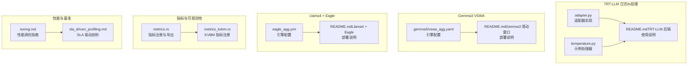
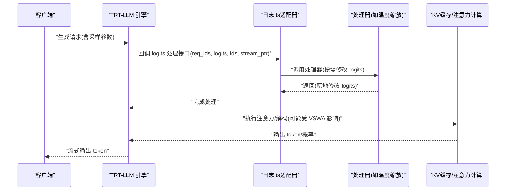
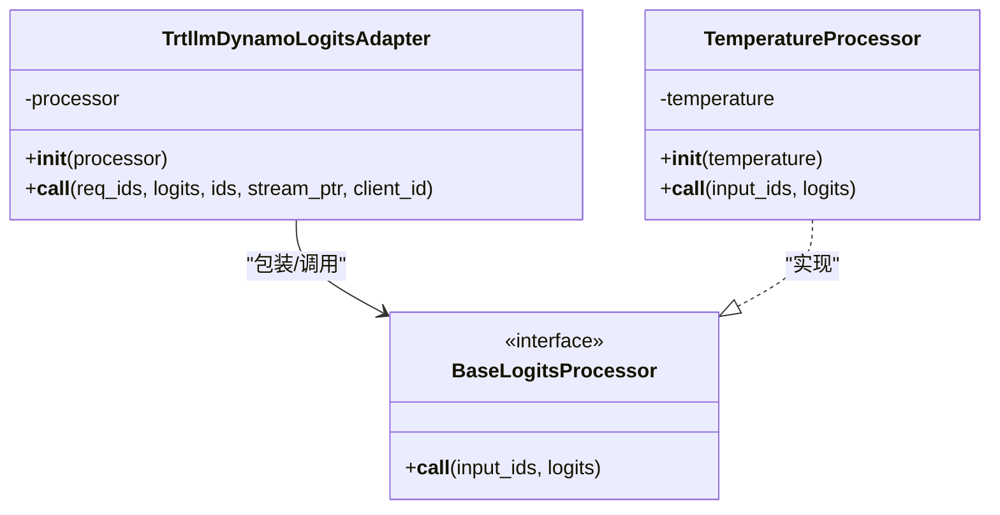
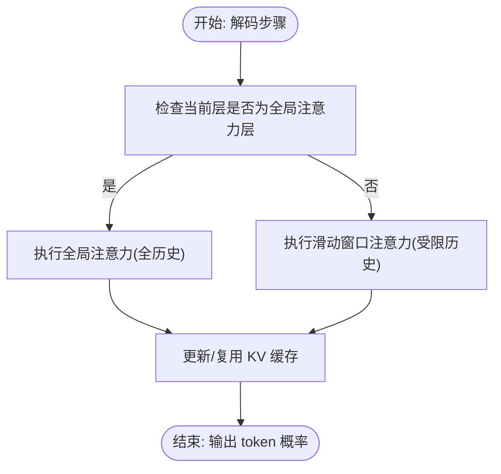
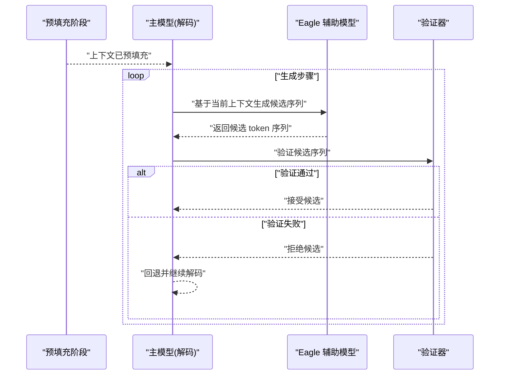
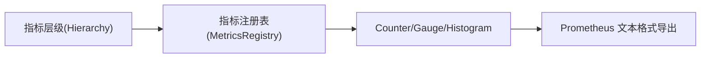
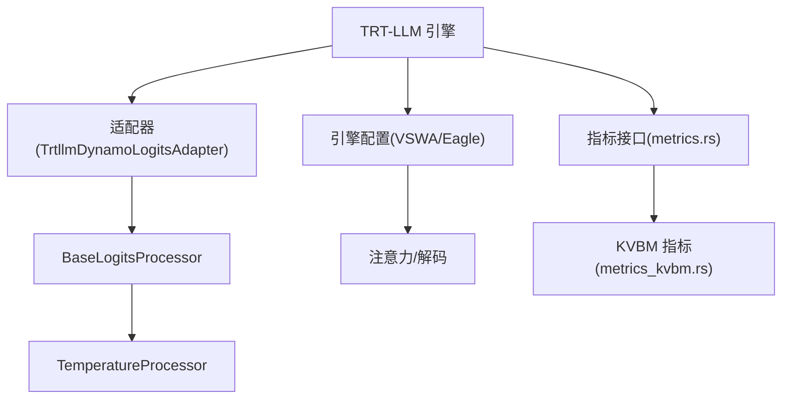

# 性能优化技术

<cite>
**本文引用的文件**   
- [adapter.py](file://components/src/dynamo/trtllm/logits_processing/adapter.py)
- [temperature.py](file://lib/bindings/python/src/dynamo/logits_processing/examples/temperature.py)
- [README.md（TRT-LLM 后端）](file://docs/backends/trtllm/README.md)
- [README.md（Gemma3 滑动窗口注意力）](file://docs/backends/trtllm/gemma3_sliding_window_attention.md)
- [gemma3/vswa_agg.yaml](file://examples/backends/trtllm/engine_configs/gemma3/vswa_agg.yaml)
- [eagle_agg.yml](file://examples/backends/trtllm/engine_configs/llama4/eagle/eagle_agg.yml)
- [README.md（Llama4 + Eagle 推测解码）](file://docs/backends/trtllm/llama4_plus_eagle.md)
- [metrics.rs](file://lib/runtime/src/metrics.rs)
- [metrics_kvbm.rs](file://lib/llm/src/block_manager/metrics_kvbm.rs)
- [tuning.md](file://docs/performance/tuning.md)
- [sla_driven_profiling.md](file://docs/benchmarks/sla_driven_profiling.md)
</cite>

## 目录
1. [简介](#简介)
2. [项目结构](#项目结构)
3. [核心组件](#核心组件)
4. [架构总览](#架构总览)
5. [详细组件分析](#详细组件分析)
6. [依赖关系分析](#依赖关系分析)
7. [性能考量](#性能考量)
8. [故障排查指南](#故障排查指南)
9. [结论](#结论)
10. [附录](#附录)

## 简介
本文件聚焦于 TensorRT-LLM 在实际部署中的性能优化技术，围绕以下主题展开：日志its处理适配器与采样参数调优、Gemma3 的可变滑动窗口注意力（VSWA）在推理中的应用、Llama4 + Eagle 推测解码在吞吐与延迟上的协同优化；并结合分布式运行时的指标体系与 Prometheus 集成，给出性能基准测试、瓶颈分析与系统调优实践建议。

## 项目结构
本仓库中与性能优化直接相关的关键位置如下：
- TRT-LLM 日志its处理适配器与示例处理器位于 components 与 lib/bindings 下
- Gemma3 可变滑动窗口注意力的部署说明与引擎配置位于 examples 与 docs/backends/trtllm
- Llama4 + Eagle 推测解码的部署说明与引擎配置位于 examples 与 docs/backends/trtllm
- 分布式运行时指标与 Prometheus 集成位于 lib/runtime 与 lib/llm
- 性能调优与 SLA 驱动的性能剖析位于 docs/performance 与 docs/benchmarks

**图表来源**
- [adapter.py](file://components/src/dynamo/trtllm/logits_processing/adapter.py#L1-L89)
- [temperature.py](file://lib/bindings/python/src/dynamo/logits_processing/examples/temperature.py#L1-L42)
- [README.md（TRT-LLM 后端）](file://docs/backends/trtllm/README.md#L256-L293)
- [gemma3/vswa_agg.yaml](file://examples/backends/trtllm/engine_configs/gemma3/vswa_agg.yaml#L1-L27)
- [README.md（Gemma3 滑动窗口注意力）](file://docs/backends/trtllm/gemma3_sliding_window_attention.md#L1-L65)
- [eagle_agg.yml](file://examples/backends/trtllm/engine_configs/llama4/eagle/eagle_agg.yml#L1-L40)
- [README.md（Llama4 + Eagle 推测解码）](file://docs/backends/trtllm/llama4_plus_eagle.md#L1-L31)
- [metrics.rs](file://lib/runtime/src/metrics.rs#L354-L1492)
- [metrics_kvbm.rs](file://lib/llm/src/block_manager/metrics_kvbm.rs#L282-L325)
- [tuning.md](file://docs/performance/tuning.md#L1-L149)
- [sla_driven_profiling.md](file://docs/benchmarks/sla_driven_profiling.md#L1-L637)

**章节来源**
- [adapter.py](file://components/src/dynamo/trtllm/logits_processing/adapter.py#L1-L89)
- [temperature.py](file://lib/bindings/python/src/dynamo/logits_processing/examples/temperature.py#L1-L42)
- [README.md（TRT-LLM 后端）](file://docs/backends/trtllm/README.md#L256-L293)
- [gemma3/vswa_agg.yaml](file://examples/backends/trtllm/engine_configs/gemma3/vswa_agg.yaml#L1-L27)
- [README.md（Gemma3 滑动窗口注意力）](file://docs/backends/trtllm/gemma3_sliding_window_attention.md#L1-L65)
- [eagle_agg.yml](file://examples/backends/trtllm/engine_configs/llama4/eagle/eagle_agg.yml#L1-L40)
- [README.md（Llama4 + Eagle 推测解码）](file://docs/backends/trtllm/llama4_plus_eagle.md#L1-L31)
- [metrics.rs](file://lib/runtime/src/metrics.rs#L354-L1492)
- [metrics_kvbm.rs](file://lib/llm/src/block_manager/metrics_kvbm.rs#L282-L325)
- [tuning.md](file://docs/performance/tuning.md#L1-L149)
- [sla_driven_profiling.md](file://docs/benchmarks/sla_driven_profiling.md#L1-L637)

## 核心组件
- 日志its处理适配器：将 Dynamo 的 BaseLogitsProcessor 适配到 TRT-LLM 的 LogitsProcessor 接口，支持温度缩放等采样后处理，并在 CUDA 流上下文中执行以避免同步开销。
- Gemma3 可变滑动窗口注意力（VSWA）：通过引擎配置指定多层注意力窗口大小，使部分层采用全局注意力，其余层采用滑动窗口，从而在长序列场景下平衡内存占用与计算效率。
- Llama4 + Eagle 推测解码：在 TRT-LLM 引擎中启用 Eagle 推测解码，利用辅助模型预测候选 token，减少主模型无效解码次数，显著提升吞吐。
- 指标与 Prometheus 集成：统一的指标注册接口，支持 Counter、Gauge、Histogram 等类型，并提供 KVBM 特定指标注册能力，便于在 Prometheus 中可视化与告警。

**章节来源**
- [adapter.py](file://components/src/dynamo/trtllm/logits_processing/adapter.py#L15-L89)
- [temperature.py](file://lib/bindings/python/src/dynamo/logits_processing/examples/temperature.py#L11-L42)
- [gemma3/vswa_agg.yaml](file://examples/backends/trtllm/engine_configs/gemma3/vswa_agg.yaml#L19-L27)
- [eagle_agg.yml](file://examples/backends/trtllm/engine_configs/llama4/eagle/eagle_agg.yml#L24-L32)
- [metrics.rs](file://lib/runtime/src/metrics.rs#L354-L1492)
- [metrics_kvbm.rs](file://lib/llm/src/block_manager/metrics_kvbm.rs#L282-L325)

## 架构总览
下图展示了从请求进入 TRT-LLM 到日志its处理、注意力计算与指标采集的整体流程。

**图表来源**
- [adapter.py](file://components/src/dynamo/trtllm/logits_processing/adapter.py#L29-L70)
- [temperature.py](file://lib/bindings/python/src/dynamo/logits_processing/examples/temperature.py#L29-L42)
- [gemma3/vswa_agg.yaml](file://examples/backends/trtllm/engine_configs/gemma3/vswa_agg.yaml#L19-L27)
- [eagle_agg.yml](file://examples/backends/trtllm/engine_configs/llama4/eagle/eagle_agg.yml#L24-L32)

## 详细组件分析

### 日志its处理适配器与采样参数优化
- 适配器职责：将 Dynamo 的 BaseLogitsProcessor 包装为 TRT-LLM 的 LogitsProcessor，确保在每步解码时对 logits 进行原地修改，且在 CUDA 流中执行以降低同步成本。
- 限制与约束：当前仅支持逐请求处理（batch size=1），beam 宽度>1 不支持；处理器必须原地修改 logits，不能返回新张量；若处理器需要分词，需确保分词器已初始化。
- 采样参数调整建议：
  - 温度缩放：通过示例处理器演示如何按比例缩放 logits，从而影响采样分布的“平滑”程度；较低温度使分布更尖锐，较高温度增加多样性但可能降低确定性。
  - Top-p/Top-k：可在自定义处理器中扩展实现，或通过 TRT-LLM 的 SamplingParams 参数配合使用。
  - 核心原则：在保证 SLA 的前提下，尽量减少额外算子带来的延迟；优先在 CUDA 流内完成轻量级变换。

**图表来源**
- [adapter.py](file://components/src/dynamo/trtllm/logits_processing/adapter.py#L15-L89)
- [temperature.py](file://lib/bindings/python/src/dynamo/logits_processing/examples/temperature.py#L11-L42)

**章节来源**
- [adapter.py](file://components/src/dynamo/trtllm/logits_processing/adapter.py#L15-L89)
- [temperature.py](file://lib/bindings/python/src/dynamo/logits_processing/examples/temperature.py#L11-L42)
- [README.md（TRT-LLM 后端）](file://docs/backends/trtllm/README.md#L256-L293)

### Gemma3 可变滑动窗口注意力（VSWA）
- 应用背景：Gemma3 在部分层使用全局注意力，在另一些层使用滑动窗口注意力，以兼顾长上下文与计算效率。
- 引擎配置要点：
  - 通过引擎配置文件设置最大注意力窗口列表，不同层对应不同窗口上限，从而在解码阶段动态切换注意力模式。
  - 建议版本：在特定版本的运行镜像中使用 VSWA，以避免已知回归问题。
- 性能收益：
  - 内存占用：滑动窗口层限制了注意力计算的历史长度，降低 KV 缓存峰值。
  - 计算效率：全局注意力层保留关键信息，滑动窗口层减少长距离依赖的计算负担。
  - 推理速度：在长序列场景下，整体 TTFT/ITL 得到改善。

**图表来源**
- [gemma3/vswa_agg.yaml](file://examples/backends/trtllm/engine_configs/gemma3/vswa_agg.yaml#L19-L27)
- [README.md（Gemma3 滑动窗口注意力）](file://docs/backends/trtllm/gemma3_sliding_window_attention.md#L1-L65)

**章节来源**
- [gemma3/vswa_agg.yaml](file://examples/backends/trtllm/engine_configs/gemma3/vswa_agg.yaml#L19-L27)
- [README.md（Gemma3 滑动窗口注意力）](file://docs/backends/trtllm/gemma3_sliding_window_attention.md#L1-L65)

### Llama4 + Eagle 推测解码
- 协同机制：主模型负责最终 token 的确定性输出，辅助模型（Eagle）预测候选 token 序列；通过验证机制决定是否接受推测结果，未通过则回退到主模型继续解码。
- 引擎配置要点：
  - 启用推测解码类型为 Eagle，设置最大草稿长度与辅助模型目录。
  - 调整批大小、最大 token 数与 CUDA Graph 批尺寸，以提升吞吐与稳定性。
- 吞吐量优化：
  - 增大批大小与最大 token 数，提高 GPU 利用率。
  - 合理设置草稿长度，避免过长导致验证失败率上升。
  - 使用 CUDA Graph 与填充策略减少调度开销。

**图表来源**
- [eagle_agg.yml](file://examples/backends/trtllm/engine_configs/llama4/eagle/eagle_agg.yml#L24-L32)

**章节来源**
- [eagle_agg.yml](file://examples/backends/trtllm/engine_configs/llama4/eagle/eagle_agg.yml#L24-L32)
- [README.md（Llama4 + Eagle 推测解码）](file://docs/backends/trtllm/llama4_plus_eagle.md#L1-L31)

### 分布式指标与 Prometheus 集成
- 统一指标接口：提供创建 Counter、Gauge、Histogram 的通用方法，支持常量标签与自动标签注入，便于在不同层级（DRT/Namespace/Component/Endpoint）注册指标。
- KVBM 指标：针对 KV 块管理提供独立的指标注册器，支持整数计数器与 Gauge 的创建。
- Prometheus 导出：通过运行时提供的接口将指标汇总为 Prometheus 文本格式，供 Prometheus 抓取与 Grafana 展示。

**图表来源**
- [metrics.rs](file://lib/runtime/src/metrics.rs#L354-L1492)
- [metrics_kvbm.rs](file://lib/llm/src/block_manager/metrics_kvbm.rs#L282-L325)

**章节来源**
- [metrics.rs](file://lib/runtime/src/metrics.rs#L354-L1492)
- [metrics_kvbm.rs](file://lib/llm/src/block_manager/metrics_kvbm.rs#L282-L325)

## 依赖关系分析
- 日志its处理链路：TRT-LLM 的 LogitsProcessor 接口由适配器实现，适配器内部调用 BaseLogitsProcessor 的具体实现（如温度缩放）。
- 注意力计算链路：引擎配置决定注意力窗口策略，进而影响 KV 缓存复用与注意力核的计算复杂度。
- 推测解码链路：主模型与辅助模型通过验证器协作，验证失败时回退到主模型，保证正确性与稳定性。
- 指标链路：运行时指标接口将指标注册到统一注册表，最终导出为 Prometheus 文本格式。

**图表来源**
- [adapter.py](file://components/src/dynamo/trtllm/logits_processing/adapter.py#L15-L89)
- [temperature.py](file://lib/bindings/python/src/dynamo/logits_processing/examples/temperature.py#L11-L42)
- [gemma3/vswa_agg.yaml](file://examples/backends/trtllm/engine_configs/gemma3/vswa_agg.yaml#L19-L27)
- [eagle_agg.yml](file://examples/backends/trtllm/engine_configs/llama4/eagle/eagle_agg.yml#L24-L32)
- [metrics.rs](file://lib/runtime/src/metrics.rs#L354-L1492)
- [metrics_kvbm.rs](file://lib/llm/src/block_manager/metrics_kvbm.rs#L282-L325)

**章节来源**
- [adapter.py](file://components/src/dynamo/trtllm/logits_processing/adapter.py#L15-L89)
- [temperature.py](file://lib/bindings/python/src/dynamo/logits_processing/examples/temperature.py#L11-L42)
- [gemma3/vswa_agg.yaml](file://examples/backends/trtllm/engine_configs/gemma3/vswa_agg.yaml#L19-L27)
- [eagle_agg.yml](file://examples/backends/trtllm/engine_configs/llama4/eagle/eagle_agg.yml#L24-L32)
- [metrics.rs](file://lib/runtime/src/metrics.rs#L354-L1492)
- [metrics_kvbm.rs](file://lib/llm/src/block_manager/metrics_kvbm.rs#L282-L325)

## 性能考量
- 并行化映射与资源分配：根据模型规模选择合适的张量并行（TP）、专家并行（MoE 的 TEP/DEP）等映射，平衡吞吐与延迟。
- 批大小与最大 token 数：预填充引擎偏好小批大 token，解码引擎偏好大批小 token；块大小过小导致碎片与传输效率低，过大导致前缀缓存命中率下降。
- KV 缓存与注意力窗口：合理设置最大注意力窗口与自由显存比例，结合 VSWA 在长序列场景下降低内存与计算压力。
- 推测解码参数：草稿长度与辅助模型目录直接影响吞吐与正确性；批大小与 CUDA Graph 批尺寸应与硬件匹配。
- 指标与观测：通过统一指标接口与 Prometheus 导出，持续监控 TTFT、ITL、吞吐/GPU、KV 使用率等关键指标，指导调参。

**章节来源**
- [tuning.md](file://docs/performance/tuning.md#L1-L149)
- [gemma3/vswa_agg.yaml](file://examples/backends/trtllm/engine_configs/gemma3/vswa_agg.yaml#L16-L27)
- [eagle_agg.yml](file://examples/backends/trtllm/engine_configs/llama4/eagle/eagle_agg.yml#L16-L40)
- [metrics.rs](file://lib/runtime/src/metrics.rs#L354-L1492)

## 故障排查指南
- 日志its处理错误：适配器在异常时会记录错误并跳过修改 logits，避免污染后续解码；请检查处理器是否满足逐请求与原地修改的要求。
- VSWA 兼容性：某些运行镜像版本存在回归，建议使用推荐版本以启用 VSWA。
- 推测解码验证失败：适当降低草稿长度或更换辅助模型，同时检查批大小与 CUDA Graph 设置。
- 指标导出异常：确认指标名称与标签规范化、常量标签冲突与自动标签注入逻辑，确保 Prometheus 可抓取。

**章节来源**
- [adapter.py](file://components/src/dynamo/trtllm/logits_processing/adapter.py#L50-L70)
- [README.md（Gemma3 滑动窗口注意力）](file://docs/backends/trtllm/gemma3_sliding_window_attention.md#L23-L27)
- [eagle_agg.yml](file://examples/backends/trtllm/engine_configs/llama4/eagle/eagle_agg.yml#L24-L32)
- [metrics.rs](file://lib/runtime/src/metrics.rs#L202-L236)

## 结论
通过对日志its处理适配器、Gemma3 VSWA 与 Llama4 + Eagle 推测解码的深入解析，以及分布式指标与 Prometheus 集成的实践，可以系统性地提升 TensorRT-LLM 的推理性能。结合 SLA 驱动的性能剖析与调优指南，能够在不同负载条件下实现吞吐与延迟的平衡，并通过可观测性持续迭代优化。

## 附录
- 性能基准测试与调优建议：
  - 使用 SLA 驱动剖析（DGDR）自动搜索最优并行化映射与引擎配置，产出推荐配置与插值数据。
  - 通过 AIPerf 或 AI Configurator 快速评估不同配置下的 TTFT/ITL/吞吐/GPU。
  - 在长序列场景优先考虑 VSWA 与合理的 KV 缓存策略；在高并发场景优先考虑批大小与 CUDA Graph。
- 瓶颈分析技巧：
  - 关注注意力核（FMHA/XQA）与密集层的占比，结合块大小与 KV 使用率定位瓶颈。
  - 利用 Prometheus 指标与 Grafana 仪表盘进行端到端时延拆解与资源利用率分析。

**章节来源**
- [sla_driven_profiling.md](file://docs/benchmarks/sla_driven_profiling.md#L1-L637)
- [tuning.md](file://docs/performance/tuning.md#L1-L149)