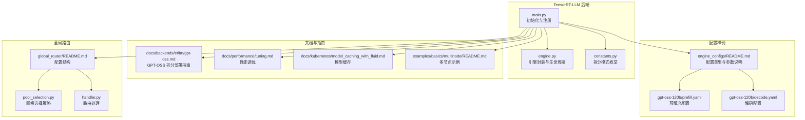
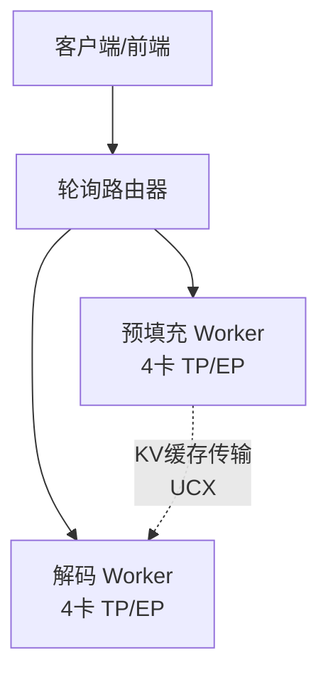
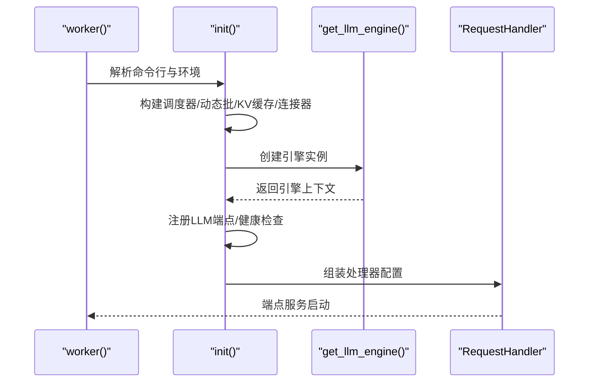
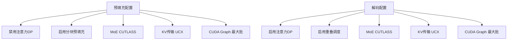
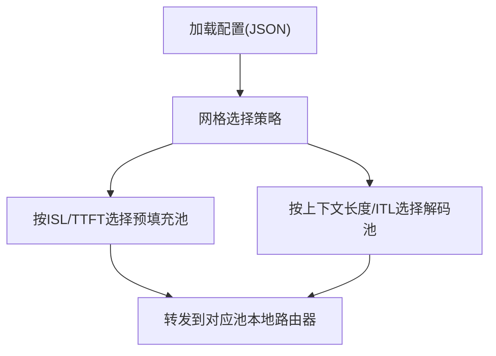
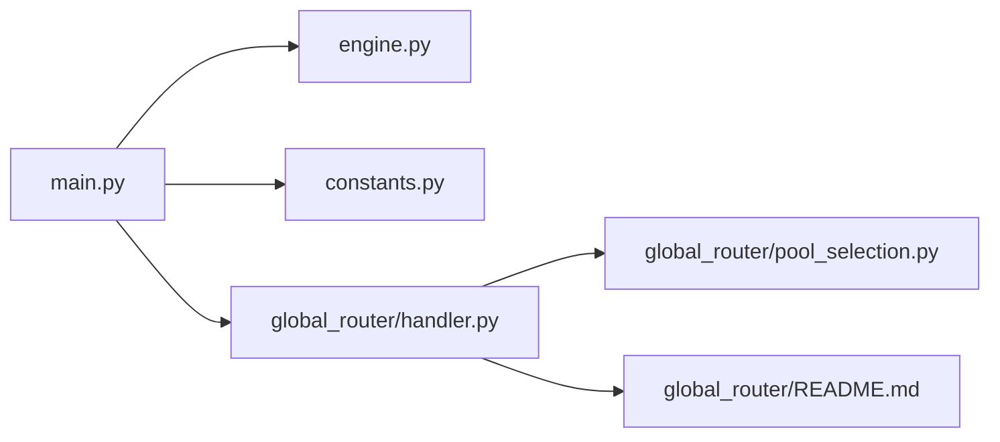

# 特定模型配置

<cite>
**本文引用的文件**
- [components/src/dynamo/trtllm/engine.py](file://components/src/dynamo/trtllm/engine.py)
- [components/src/dynamo/trtllm/main.py](file://components/src/dynamo/trtllm/main.py)
- [components/src/dynamo/trtllm/constants.py](file://components/src/dynamo/trtllm/constants.py)
- [examples/backends/trtllm/engine_configs/README.md](file://examples/backends/trtllm/engine_configs/README.md)
- [examples/backends/trtllm/engine_configs/gpt-oss-120b/prefill.yaml](file://examples/backends/trtllm/engine_configs/gpt-oss-120b/prefill.yaml)
- [examples/backends/trtllm/engine_configs/gpt-oss-120b/decode.yaml](file://examples/backends/trtllm/engine_configs/gpt-oss-120b/decode.yaml)
- [docs/backends/trtllm/gpt-oss.md](file://docs/backends/trtllm/gpt-oss.md)
- [components/src/dynamo/global_router/README.md](file://components/src/dynamo/global_router/README.md)
- [components/src/dynamo/global_router/pool_selection.py](file://components/src/dynamo/global_router/pool_selection.py)
- [components/src/dynamo/global_router/handler.py](file://components/src/dynamo/global_router/handler.py)
- [docs/performance/tuning.md](file://docs/performance/tuning.md)
- [docs/kubernetes/model_caching_with_fluid.md](file://docs/kubernetes/model_caching_with_fluid.md)
- [examples/basics/multinode/README.md](file://examples/basics/multinode/README.md)
</cite>

## 目录
1. [简介](#简介)
2. [项目结构](#项目结构)
3. [核心组件](#核心组件)
4. [架构总览](#架构总览)
5. [详细组件分析](#详细组件分析)
6. [依赖关系分析](#依赖关系分析)
7. [性能考量](#性能考量)
8. [故障排查指南](#故障排查指南)
9. [结论](#结论)
10. [附录](#附录)

## 简介
本文件面向使用 TensorRT-LLM 的 GPT-oss 模型部署场景，系统化梳理“特定模型配置”的设计与实现，覆盖以下关键主题：
- GPT-oss 在 TensorRT-LLM 中的配置要点与参数含义
- 推理配置优化（并行度、批大小、最大令牌数、KV 缓存、CUDA Graph）
- 部署策略（单机/多机、聚合/拆分、路由器与全局路由）
- 多节点部署、模型缓存与资源分配优化
- 参数调优建议、部署最佳实践与性能对比分析

## 项目结构
围绕 TensorRT-LLM 的 GPT-oss 配置与运行，相关代码与文档主要分布在如下位置：
- 运行时与引擎：components/src/dynamo/trtllm/*
- 引擎配置样例：examples/backends/trtllm/engine_configs/*
- 文档说明：docs/backends/trtllm/gpt-oss.md 等
- 全局路由与池选择：components/src/dynamo/global_router/*
- 性能调优与多节点：docs/performance/tuning.md、examples/basics/multinode/*
- 模型缓存与 Fluid：docs/kubernetes/model_caching_with_fluid.md

**图表来源**
- [components/src/dynamo/trtllm/main.py](file://components/src/dynamo/trtllm/main.py#L128-L520)
- [components/src/dynamo/trtllm/engine.py](file://components/src/dynamo/trtllm/engine.py#L24-L142)
- [components/src/dynamo/trtllm/constants.py](file://components/src/dynamo/trtllm/constants.py#L7-L12)
- [examples/backends/trtllm/engine_configs/README.md](file://examples/backends/trtllm/engine_configs/README.md#L1-L44)
- [examples/backends/trtllm/engine_configs/gpt-oss-120b/prefill.yaml](file://examples/backends/trtllm/engine_configs/gpt-oss-120b/prefill.yaml#L15-L28)
- [examples/backends/trtllm/engine_configs/gpt-oss-120b/decode.yaml](file://examples/backends/trtllm/engine_configs/gpt-oss-120b/decode.yaml#L15-L26)
- [docs/backends/trtllm/gpt-oss.md](file://docs/backends/trtllm/gpt-oss.md#L1-L517)
- [components/src/dynamo/global_router/README.md](file://components/src/dynamo/global_router/README.md#L74-L148)
- [components/src/dynamo/global_router/pool_selection.py](file://components/src/dynamo/global_router/pool_selection.py#L22-L318)
- [components/src/dynamo/global_router/handler.py](file://components/src/dynamo/global_router/handler.py#L23-L232)
- [docs/performance/tuning.md](file://docs/performance/tuning.md#L18-L149)
- [docs/kubernetes/model_caching_with_fluid.md](file://docs/kubernetes/model_caching_with_fluid.md#L1-L329)
- [examples/basics/multinode/README.md](file://examples/basics/multinode/README.md#L1-L21)

**章节来源**
- [components/src/dynamo/trtllm/main.py](file://components/src/dynamo/trtllm/main.py#L128-L520)
- [examples/backends/trtllm/engine_configs/README.md](file://examples/backends/trtllm/engine_configs/README.md#L1-L44)

## 核心组件
- 引擎封装与生命周期管理：负责根据传入参数初始化 TensorRT-LLM 引擎或自动部署后端，支持编码器模式与标准 LLM 模式，并在退出时清理资源。
- 初始化流程：构建调度器、动态批配置、KV 缓存配置、连接器配置；解析命令行参数与外部引擎配置；注册 LLM 服务端点；可选启用事件/指标发布与 KVBM 合并器。
- 拆分模式常量：定义聚合、预填充、解码、编码四种工作模式，用于区分不同角色的 worker。

**章节来源**
- [components/src/dynamo/trtllm/engine.py](file://components/src/dynamo/trtllm/engine.py#L24-L142)
- [components/src/dynamo/trtllm/main.py](file://components/src/dynamo/trtllm/main.py#L162-L520)
- [components/src/dynamo/trtllm/constants.py](file://components/src/dynamo/trtllm/constants.py#L7-L12)

## 架构总览
下图展示 GPT-oss 在 TensorRT-LLM 下的典型拆分部署：前端通过轮询路由到预填充/解码 worker，二者分别在不同 GPU 上执行，通过 UCX 进行 KV 缓存传输。

**图表来源**
- [docs/backends/trtllm/gpt-oss.md](file://docs/backends/trtllm/gpt-oss.md#L468-L476)

## 详细组件分析

### 引擎初始化与运行时配置
- 动态批配置：启用批量大小自适应，窗口长度移动平均，提升吞吐稳定性。
- 调度器配置：容量调度策略保证无驱逐的 Guaranteed 调度，结合动态批。
- KV 缓存配置：按显存比例分配，可选禁用部分复用以适配 KVBM。
- 事件与指标：当开启发布时，注入事件缓冲区大小，注册 TRT-LLM 原生指标回调。
- 连接器：支持 KVBM 连接器模块与合并器端点，便于跨进程/跨节点事件聚合。
- 默认采样参数：根据是否多模态决定是否进行反分词，避免重复处理。

**图表来源**
- [components/src/dynamo/trtllm/main.py](file://components/src/dynamo/trtllm/main.py#L128-L520)
- [components/src/dynamo/trtllm/engine.py](file://components/src/dynamo/trtllm/engine.py#L128-L142)

**章节来源**
- [components/src/dynamo/trtllm/main.py](file://components/src/dynamo/trtllm/main.py#L162-L520)

### GPT-oss 拆分配置详解
- 预填充配置（prefill.yaml）：
  - 关闭注意力数据并行，启用分块预填充，加速长上下文输入处理。
  - 使用 CUTLASS 后端优化 MoE 层，UCX 作为 KV 缓存传输后端。
  - CUDA Graph 最大批尺寸与填充策略，提升吞吐。
- 解码配置（decode.yaml）：
  - 开启注意力数据并行，启用重叠调度，提升解码阶段效率。
  - MoE 层同样采用 CUTLASS 后端，UCX 传输 KV。
  - 更高的 CUDA Graph 最大批尺寸以适配持续生成。
- 命令行参数要点：
  - 并行度：张量并行与专家并行均为 4。
  - 内存：GPU 显存占用比例 0.9。
  - 批规模与最大令牌数：预填充与解码分别设置不同上限。

**图表来源**
- [examples/backends/trtllm/engine_configs/gpt-oss-120b/prefill.yaml](file://examples/backends/trtllm/engine_configs/gpt-oss-120b/prefill.yaml#L15-L28)
- [examples/backends/trtllm/engine_configs/gpt-oss-120b/decode.yaml](file://examples/backends/trtllm/engine_configs/gpt-oss-120b/decode.yaml#L15-L26)

**章节来源**
- [docs/backends/trtllm/gpt-oss.md](file://docs/backends/trtllm/gpt-oss.md#L87-L121)
- [examples/backends/trtllm/engine_configs/README.md](file://examples/backends/trtllm/engine_configs/README.md#L18-L44)

### 全局路由与池选择
- 配置结构：定义预填充/解码池数量、命名空间列表，以及基于 ISL/TTFT 与上下文长度/ITL 的二维网格映射。
- 选择策略：计算网格索引并夹取至有效范围，从映射表中查得目标池索引。
- 处理器：连接各池本地路由器，接收前端请求后按策略转发，支持默认 SLA 目标回退。

**图表来源**
- [components/src/dynamo/global_router/README.md](file://components/src/dynamo/global_router/README.md#L74-L148)
- [components/src/dynamo/global_router/pool_selection.py](file://components/src/dynamo/global_router/pool_selection.py#L22-L318)
- [components/src/dynamo/global_router/handler.py](file://components/src/dynamo/global_router/handler.py#L122-L215)

**章节来源**
- [components/src/dynamo/global_router/README.md](file://components/src/dynamo/global_router/README.md#L74-L148)
- [components/src/dynamo/global_router/pool_selection.py](file://components/src/dynamo/global_router/pool_selection.py#L22-L318)
- [components/src/dynamo/global_router/handler.py](file://components/src/dynamo/global_router/handler.py#L23-L232)

### 多节点部署策略
- 示例入口：多节点 TRTLLM 工作负载在 Slurm 环境下的组织方式与参考路径。
- 建议：结合全局路由的池选择能力，按节点/拓扑划分命名空间，统一由前端路由到对应池。

**章节来源**
- [examples/basics/multinode/README.md](file://examples/basics/multinode/README.md#L18-L21)

### 模型缓存与资源分配优化
- 模型缓存：通过 Fluid 将远端存储（如 S3/MinIO/HuggingFace）虚拟化为本地 PVC，显著降低冷启动与热身时间。
- 资源分配：优先将工作负载亲和到缓存所在节点，减少网络 I/O；合理设置显存占用比例与批规模，平衡吞吐与延迟。
- KVBM：在启用 KVBM 时，KV 缓存配置需禁用部分复用，确保一致性。

**章节来源**
- [docs/kubernetes/model_caching_with_fluid.md](file://docs/kubernetes/model_caching_with_fluid.md#L1-L329)
- [components/src/dynamo/trtllm/main.py](file://components/src/dynamo/trtllm/main.py#L197-L203)

## 依赖关系分析
- 组件耦合：
  - main.py 依赖 engine.py 提供的引擎封装与生命周期管理。
  - main.py 依赖 constants.py 的拆分模式枚举，以区分不同 worker 角色。
  - 全局路由模块相互协作：README 定义配置结构，pool_selection.py 实现选择逻辑，handler.py 执行路由转发。
- 外部依赖：
  - TensorRT-LLM LLM API、Prometheus 指标收集、NATS/事件平面通信、KVBM 连接器（可选）。

**图表来源**
- [components/src/dynamo/trtllm/main.py](file://components/src/dynamo/trtllm/main.py#L52-L66)
- [components/src/dynamo/trtllm/engine.py](file://components/src/dynamo/trtllm/engine.py#L12-L14)
- [components/src/dynamo/trtllm/constants.py](file://components/src/dynamo/trtllm/constants.py#L7-L12)
- [components/src/dynamo/global_router/handler.py](file://components/src/dynamo/global_router/handler.py#L16-L18)
- [components/src/dynamo/global_router/pool_selection.py](file://components/src/dynamo/global_router/pool_selection.py#L13-L17)
- [components/src/dynamo/global_router/README.md](file://components/src/dynamo/global_router/README.md#L74-L105)

**章节来源**
- [components/src/dynamo/trtllm/main.py](file://components/src/dynamo/trtllm/main.py#L52-L66)
- [components/src/dynamo/trtllm/engine.py](file://components/src/dynamo/trtllm/engine.py#L12-L14)
- [components/src/dynamo/trtllm/constants.py](file://components/src/dynamo/trtllm/constants.py#L7-L12)
- [components/src/dynamo/global_router/handler.py](file://components/src/dynamo/global_router/handler.py#L16-L18)
- [components/src/dynamo/global_router/pool_selection.py](file://components/src/dynamo/global_router/pool_selection.py#L13-L17)
- [components/src/dynamo/global_router/README.md](file://components/src/dynamo/global_router/README.md#L74-L105)

## 性能考量
- 并行度与资源：TP/EP 在单节点内最大化利用显存与带宽；跨节点采用 PP 以扩展规模。
- 批规模与最大令牌数：预填充偏向小批大上下文，解码偏向大批小上下文；块大小影响前缀缓存命中率与传输效率。
- 动态批与调度：启用动态批与移动平均窗口，提升稳定吞吐。
- KV 缓存：显存占用比例与 dtype（如 FP8）直接影响缓存容量与内存带宽；在 KVBM 场景下需谨慎配置复用策略。
- 全局路由：通过网格映射将请求路由到最优池，平衡 TTFT 与 ITL，缓解队列积压。

**章节来源**
- [docs/performance/tuning.md](file://docs/performance/tuning.md#L18-L149)
- [components/src/dynamo/trtllm/main.py](file://components/src/dynamo/trtllm/main.py#L204-L212)

## 故障排查指南
- 常见问题与对策：
  - 显存不足：降低最大令牌数与显存占用比例；确认模型权重格式兼容性。
  - Worker 无法连接：检查 etcd/NATS 服务状态、网络连通性、可见 GPU 设置。
  - 性能异常：监控 GPU 利用率与瓶颈；核对批规模与分块预填充设置；确保端口未被占用。
- 日志与诊断：
  - 启用 TRT-LLM 日志级别映射，便于定位底层错误。
  - 启用事件/指标发布，结合 Prometheus/Grafana 观测关键指标。

**章节来源**
- [docs/backends/trtllm/gpt-oss.md](file://docs/backends/trtllm/gpt-oss.md#L484-L510)
- [components/src/dynamo/trtllm/main.py](file://components/src/dynamo/trtllm/main.py#L11-L22)

## 结论
针对 GPT-oss 在 TensorRT-LLM 的部署，建议采用“预填充/解码”拆分架构，结合合理的并行度、批规模与 KV 缓存策略，并通过全局路由实现 SLA 驱动的池选择。配合模型缓存与资源亲和，可在多节点环境下获得更稳定的吞吐与更低的延迟。实际落地时应以 AIPerf 等工具进行基准测试，依据业务 SLA 进行参数微调。

## 附录

### 配置文件结构与参数速览
- 聚合配置（agg）：单节点组合预填充与解码，适合小规模或开发测试。
- 拆分配置（disagg）：预填充/解码分离，适合生产高并发场景。
- 关键参数：
  - 并行度：tensor_parallel_size、moe_expert_parallel_size、pipeline_parallel_size
  - 内存：kv_cache_config.free_gpu_memory_fraction、dtype
  - 批处理：max_batch_size、max_num_tokens、max_seq_len
  - 调度：disable_overlap_scheduler、cuda_graph_config

**章节来源**
- [examples/backends/trtllm/engine_configs/README.md](file://examples/backends/trtllm/engine_configs/README.md#L18-L44)

### GPT-oss 部署步骤与验证
- 下载模型、准备容器与环境变量
- 启动前端与预填充/解码 worker（分别绑定不同 GPU）
- 健康检查与端到端测试
- 使用 AIPerf 进行高并发压力测试

**章节来源**
- [docs/backends/trtllm/gpt-oss.md](file://docs/backends/trtllm/gpt-oss.md#L29-L210)