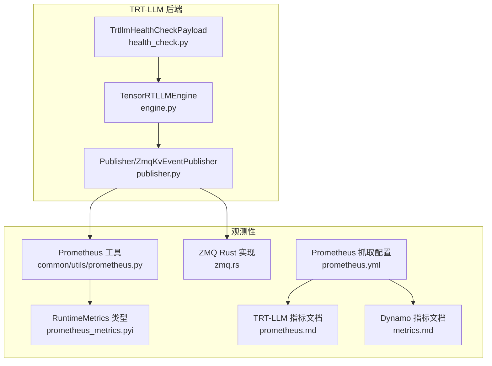
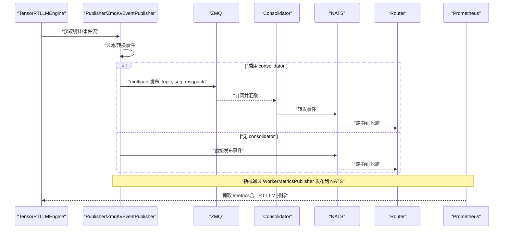
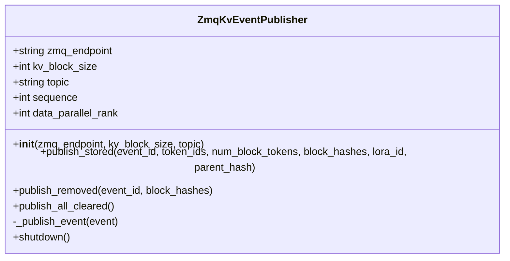
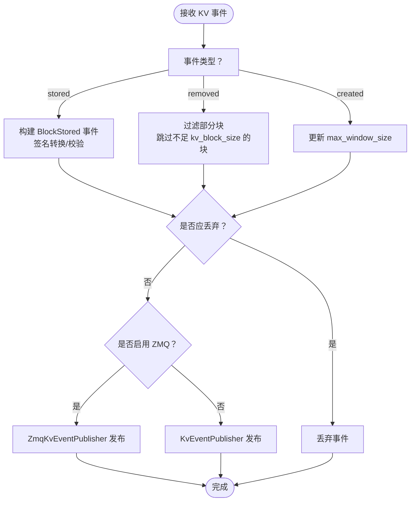
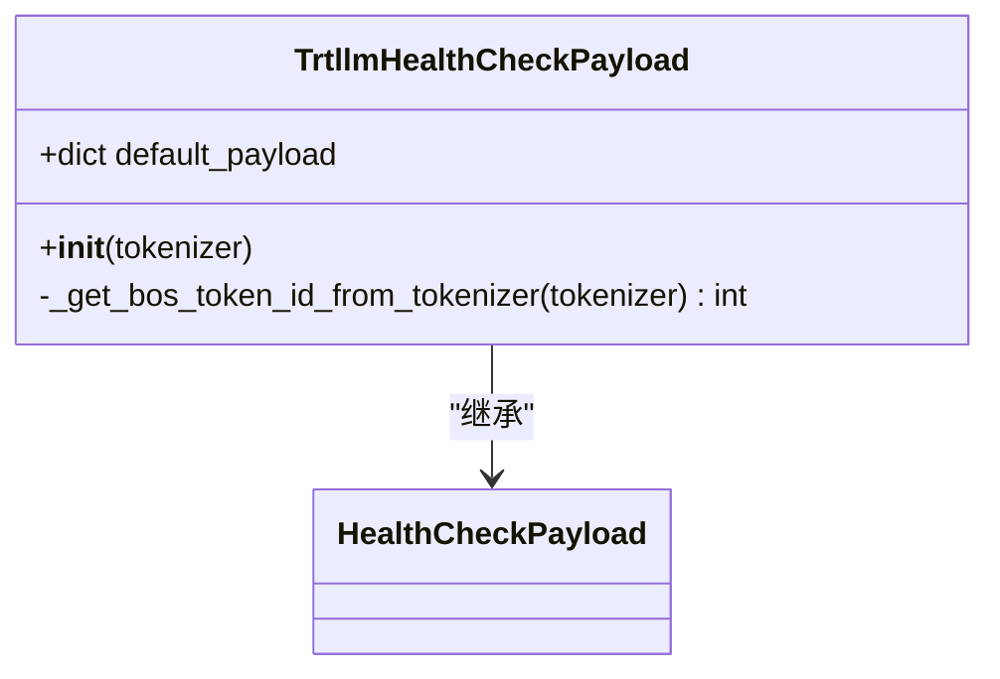
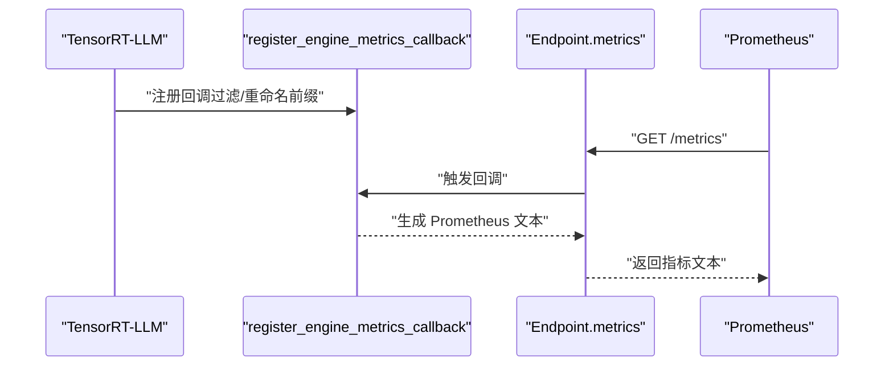
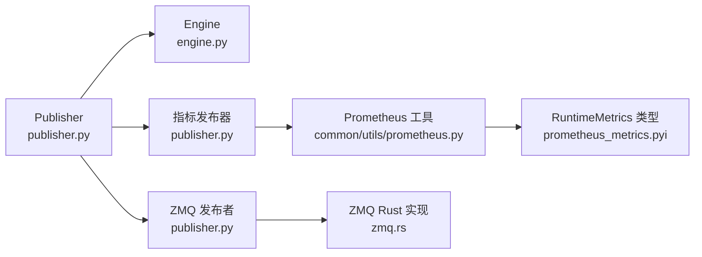

# 监控与指标

<cite>
**本文引用的文件**
- [components/src/dynamo/trtllm/publisher.py](file://components/src/dynamo/trtllm/publisher.py)
- [components/src/dynamo/trtllm/health_check.py](file://components/src/dynamo/trtllm/health_check.py)
- [components/src/dynamo/trtllm/engine.py](file://components/src/dynamo/trtllm/engine.py)
- [components/src/dynamo/trtllm/constants.py](file://components/src/dynamo/trtllm/constants.py)
- [components/src/dynamo/common/utils/prometheus.py](file://components/src/dynamo/common/utils/prometheus.py)
- [lib/bindings/python/src/dynamo/prometheus_metrics.pyi](file://lib/bindings/python/src/dynamo/prometheus_metrics.pyi)
- [lib/llm/src/block_manager/distributed/zmq.rs](file://lib/llm/src/block_manager/distributed/zmq.rs)
- [deploy/observability/prometheus.yml](file://deploy/observability/prometheus.yml)
- [docs/backends/trtllm/prometheus.md](file://docs/backends/trtllm/prometheus.md)
- [docs/observability/metrics.md](file://docs/observability/metrics.md)
</cite>

## 目录
1. [简介](#简介)
2. [项目结构](#项目结构)
3. [核心组件](#核心组件)
4. [架构总览](#架构总览)
5. [组件详解](#组件详解)
6. [依赖关系分析](#依赖关系分析)
7. [性能考量](#性能考量)
8. [故障排查指南](#故障排查指南)
9. [结论](#结论)
10. [附录](#附录)

## 简介
本文件面向运维与平台工程团队，系统化梳理 TensorRT-LLM 在 Dynamo 平台上的监控与指标体系，重点覆盖以下方面：
- ZmqKvEventPublisher 的实现原理与事件发布机制：KV 缓存事件监听、事件过滤与发布策略
- 健康检查机制：TrtllmHealthCheckPayload 的结构与健康状态评估逻辑
- Prometheus 指标采集与暴露：原生 TensorRT-LLM 指标的集成、自定义指标的添加与标签管理
- 监控配置与可视化：Prometheus 抓取配置、Grafana 仪表盘建议
- 指标解读与故障诊断：常见问题定位与优化建议
- 性能分析工具使用：结合非 Prometheus 指标进行深度分析

## 项目结构
围绕监控与指标的关键代码分布在如下模块：
- TRT-LLM 后端发布与健康检查：publisher.py、health_check.py
- 引擎与模式常量：engine.py、constants.py
- Prometheus 工具与类型声明：common/utils/prometheus.py、prometheus_metrics.pyi
- 分布式 ZMQ 通信（KV 路由相关）：lib/llm/src/block_manager/distributed/zmq.rs
- 观测性配置与文档：deploy/observability/prometheus.yml、docs/backends/trtllm/prometheus.md、docs/observability/metrics.md

**图表来源**
- [components/src/dynamo/trtllm/engine.py](file://components/src/dynamo/trtllm/engine.py#L24-L91)
- [components/src/dynamo/trtllm/publisher.py](file://components/src/dynamo/trtllm/publisher.py#L257-L684)
- [components/src/dynamo/trtllm/health_check.py](file://components/src/dynamo/trtllm/health_check.py#L51-L92)
- [components/src/dynamo/common/utils/prometheus.py](file://components/src/dynamo/common/utils/prometheus.py#L28-L240)
- [lib/bindings/python/src/dynamo/prometheus_metrics.pyi](file://lib/bindings/python/src/dynamo/prometheus_metrics.pyi#L12-L32)
- [lib/llm/src/block_manager/distributed/zmq.rs](file://lib/llm/src/block_manager/distributed/zmq.rs#L1-L596)
- [deploy/observability/prometheus.yml](file://deploy/observability/prometheus.yml#L20-L50)
- [docs/backends/trtllm/prometheus.md](file://docs/backends/trtllm/prometheus.md#L1-L194)
- [docs/observability/metrics.md](file://docs/observability/metrics.md#L1-L224)

**章节来源**
- [components/src/dynamo/trtllm/publisher.py](file://components/src/dynamo/trtllm/publisher.py#L1-L684)
- [components/src/dynamo/trtllm/health_check.py](file://components/src/dynamo/trtllm/health_check.py#L1-L92)
- [components/src/dynamo/common/utils/prometheus.py](file://components/src/dynamo/common/utils/prometheus.py#L1-L240)
- [lib/llm/src/block_manager/distributed/zmq.rs](file://lib/llm/src/block_manager/distributed/zmq.rs#L1-L596)
- [deploy/observability/prometheus.yml](file://deploy/observability/prometheus.yml#L1-L63)
- [docs/backends/trtllm/prometheus.md](file://docs/backends/trtllm/prometheus.md#L1-L194)
- [docs/observability/metrics.md](file://docs/observability/metrics.md#L1-L224)

## 核心组件
- ZmqKvEventPublisher：纯 Python 的 ZMQ 发布者，负责将 TensorRT-LLM 的 KV 缓存事件以 vLLM 兼容格式序列化并通过 multipart 消息发送到 ZMQ，供 consolidator 订阅并进一步路由至 NATS/路由器。
- Publisher：协调 KV 事件与指标发布，支持两种路径：
  - 使用 ZMQ（启用 consolidator）：ZmqKvEventPublisher → ZMQ → consolidator → NATS → 路由器
  - 直接 NATS（无 consolidator）：KvEventPublisher → NATS → 路由器
- TrtllmHealthCheckPayload：基于 HealthCheckPayload 的 TRT-LLM 默认健康检查载荷，构造最小化、快速完成的请求，用于健康探测。
- Prometheus 工具：提供注册回调、过滤/重命名前缀、排除特定前缀等能力，将 TensorRT-LLM 指标通过 Dynamo 的 /metrics 端点统一暴露。

**章节来源**
- [components/src/dynamo/trtllm/publisher.py](file://components/src/dynamo/trtllm/publisher.py#L63-L183)
- [components/src/dynamo/trtllm/publisher.py](file://components/src/dynamo/trtllm/publisher.py#L257-L684)
- [components/src/dynamo/trtllm/health_check.py](file://components/src/dynamo/trtllm/health_check.py#L51-L92)
- [components/src/dynamo/common/utils/prometheus.py](file://components/src/dynamo/common/utils/prometheus.py#L28-L240)

## 架构总览
下图展示 TRT-LLM 在 Dynamo 中的监控与指标路径，包括 KV 事件发布、指标聚合与暴露、以及健康检查流程。

**图表来源**
- [components/src/dynamo/trtllm/publisher.py](file://components/src/dynamo/trtllm/publisher.py#L340-L470)
- [components/src/dynamo/trtllm/publisher.py](file://components/src/dynamo/trtllm/publisher.py#L149-L175)
- [lib/llm/src/block_manager/distributed/zmq.rs](file://lib/llm/src/block_manager/distributed/zmq.rs#L235-L284)
- [docs/backends/trtllm/prometheus.md](file://docs/backends/trtllm/prometheus.md#L10-L194)

## 组件详解

### ZmqKvEventPublisher：实现原理与事件发布机制
- 初始化与绑定
  - 创建 ZMQ 上下文与 PUB Socket，并绑定到指定端点
  - 维护序列号与数据并行 rank（当前 TRT-LLM 不使用 DP）
- 事件格式与消息封装
  - 事件批次格式：[timestamp, [event], data_parallel_rank]
  - 使用 msgpack 序列化批次，构建 multipart 消息 [topic, sequence, payload]
  - 事件类型包括 BlockStored、BlockRemoved、AllBlocksCleared
- 发布策略
  - BlockStored：将块哈希转为有符号 i64，携带 token_ids、block_size、lora_id 等字段
  - BlockRemoved：过滤部分块（不足 kv_block_size 的块）避免误删
  - AllBlocksCleared：清空事件
- 错误处理
  - 发送异常记录错误日志；提供 shutdown 关闭 socket 与上下文

**图表来源**
- [components/src/dynamo/trtllm/publisher.py](file://components/src/dynamo/trtllm/publisher.py#L81-L183)

**章节来源**
- [components/src/dynamo/trtllm/publisher.py](file://components/src/dynamo/trtllm/publisher.py#L81-L183)

### KV 事件过滤与发布策略
- 初始 created 事件处理
  - 通过初始 "created" 事件识别全局注意力层的最大窗口大小（max_window_size）
  - 仅保留与 max_window_size 对齐的事件，确保 KV 路由准确性
- 过滤逻辑
  - 若事件未包含 window_size 或仍在处理初始 created，则不过滤
  - 当事件 window_size 不等于 max_window_size 时丢弃
- 发布选择
  - 若提供 zmq_endpoint：仅向 ZMQ 发布（consolidator 模式）
  - 否则：使用 NATS 发布（直连模式）

**图表来源**
- [components/src/dynamo/trtllm/publisher.py](file://components/src/dynamo/trtllm/publisher.py#L472-L652)

**章节来源**
- [components/src/dynamo/trtllm/publisher.py](file://components/src/dynamo/trtllm/publisher.py#L472-L652)

### 健康检查机制：TrtllmHealthCheckPayload
- 结构与默认值
  - 默认 payload 包含 token_ids（使用 BOS token）、stop 条件与采样参数
  - 采样参数设置为低随机性（temperature=0、beam_width=1），确保快速稳定返回
- BOS token 解析
  - 优先从 tokenizer 获取 bos_token_id，失败时回退为 1
  - 支持从包装的 HuggingFace tokenizer 中提取
- 用途
  - 作为最小化、可快速完成的请求，用于健康探测与可用性验证

**图表来源**
- [components/src/dynamo/trtllm/health_check.py](file://components/src/dynamo/trtllm/health_check.py#L51-L92)

**章节来源**
- [components/src/dynamo/trtllm/health_check.py](file://components/src/dynamo/trtllm/health_check.py#L17-L92)

### Prometheus 指标收集与暴露机制
- 指标集成
  - 通过 register_engine_metrics_callback 将 TensorRT-LLM 指标注册到 Dynamo 的 /metrics 端点
  - 可选过滤前缀、排除特定前缀、为指标名添加前缀（如 trtllm_）
- 回调与文本格式
  - get_prometheus_expfmt 返回 Prometheus 文本格式指标串
  - 支持 HELP/TYPE 注释行与指标行的正则匹配与重写
- 类型与接口
  - RuntimeMetrics 提供 register_prometheus_expfmt_callback 接口，允许外部引擎（如 TRT-LLM）将指标注入到统一输出
- 暴露位置
  - 默认在后端组件系统端口（DYN_SYSTEM_PORT，默认 8081）的 /metrics 端点
  - Prometheus 抓取配置示例见 deploy/observability/prometheus.yml

**图表来源**
- [components/src/dynamo/common/utils/prometheus.py](file://components/src/dynamo/common/utils/prometheus.py#L28-L143)
- [lib/bindings/python/src/dynamo/prometheus_metrics.pyi](file://lib/bindings/python/src/dynamo/prometheus_metrics.pyi#L19-L31)
- [deploy/observability/prometheus.yml](file://deploy/observability/prometheus.yml#L46-L49)

**章节来源**
- [components/src/dynamo/common/utils/prometheus.py](file://components/src/dynamo/common/utils/prometheus.py#L28-L240)
- [lib/bindings/python/src/dynamo/prometheus_metrics.pyi](file://lib/bindings/python/src/dynamo/prometheus_metrics.pyi#L12-L32)
- [deploy/observability/prometheus.yml](file://deploy/observability/prometheus.yml#L1-L63)
- [docs/backends/trtllm/prometheus.md](file://docs/backends/trtllm/prometheus.md#L1-L194)
- [docs/observability/metrics.md](file://docs/observability/metrics.md#L61-L124)

### 非 Prometheus 性能指标与事件
- TRT-LLM 提供更丰富的性能数据（非 Prometheus）
  - RequestPerfMetrics：包含时间线、KV 缓存统计、推测解码指标等
  - 引擎统计：engine.llm.get_stats_async()
  - KV 缓存事件：engine.llm.get_kv_cache_events_async()
- 使用建议
  - 通过 TRT-LLM 的结果结构与引擎 API 获取细粒度性能信息，辅助定位延迟、吞吐瓶颈与 KV 缓存行为

**章节来源**
- [docs/backends/trtllm/prometheus.md](file://docs/backends/trtllm/prometheus.md#L134-L171)

## 依赖关系分析
- 组件耦合
  - Publisher 依赖 Engine 的统计与事件接口，依赖 WorkerMetricsPublisher 发布指标
  - ZmqKvEventPublisher 依赖 ZMQ 与 msgpack，负责事件序列化与发送
  - Prometheus 工具通过回调机制与 Endpoint 集成，避免直接耦合具体引擎
- 外部依赖
  - ZMQ（Python）用于 KV 事件发布
  - Prometheus 客户端库用于指标格式化与导出
  - TRT-LLM 的 MetricsCollector 与引擎 API 提供原生指标与事件

**图表来源**
- [components/src/dynamo/trtllm/publisher.py](file://components/src/dynamo/trtllm/publisher.py#L257-L363)
- [components/src/dynamo/trtllm/engine.py](file://components/src/dynamo/trtllm/engine.py#L24-L91)
- [components/src/dynamo/common/utils/prometheus.py](file://components/src/dynamo/common/utils/prometheus.py#L28-L77)
- [lib/llm/src/block_manager/distributed/zmq.rs](file://lib/llm/src/block_manager/distributed/zmq.rs#L1-L596)

**章节来源**
- [components/src/dynamo/trtllm/publisher.py](file://components/src/dynamo/trtllm/publisher.py#L257-L363)
- [components/src/dynamo/trtllm/engine.py](file://components/src/dynamo/trtllm/engine.py#L24-L91)
- [components/src/dynamo/common/utils/prometheus.py](file://components/src/dynamo/common/utils/prometheus.py#L28-L77)
- [lib/llm/src/block_manager/distributed/zmq.rs](file://lib/llm/src/block_manager/distributed/zmq.rs#L1-L596)

## 性能考量
- 发布与轮询策略
  - 统计与 KV 事件采用带退避的轮询，避免过度占用 CPU
  - 统计轮询超时与事件轮询超时分别控制开销
- 事件过滤
  - 仅保留与最大窗口对齐的事件，减少 KV 路由噪声
- 指标前缀与标签
  - 通过 add_prefix 为 TRT-LLM 指标添加 trtllm_ 前缀，避免与 Dynamo 自身指标冲突
  - 排除 python_/process_ 等无关指标，降低输出体积
- 端口与抓取
  - DYN_SYSTEM_PORT 控制后端指标端口；Prometheus 抓取配置需与实际端口一致

**章节来源**
- [components/src/dynamo/trtllm/publisher.py](file://components/src/dynamo/trtllm/publisher.py#L394-L444)
- [components/src/dynamo/common/utils/prometheus.py](file://components/src/dynamo/common/utils/prometheus.py#L108-L240)
- [deploy/observability/prometheus.yml](file://deploy/observability/prometheus.yml#L16-L50)

## 故障排查指南
- ZMQ 发布异常
  - 症状：无法发送事件或连接失败
  - 排查：确认端点绑定成功、socket 正常、multipart 消息格式正确
  - 参考：ZmqKvEventPublisher 的错误日志与 shutdown 流程
- KV 事件被过滤
  - 症状：某些事件未出现在路由中
  - 排查：检查是否仍处于初始 created 事件阶段、window_size 是否与 max_window_size 一致
  - 参考：should_drop_event 与 update_max_window_size 的逻辑
- 指标缺失或前缀不正确
  - 症状：/metrics 中缺少 TRT-LLM 指标或前缀不符合预期
  - 排查：确认已注册回调、add_prefix 设置、exclude_prefixes 是否影响了目标指标
  - 参考：register_engine_metrics_callback 与 get_prometheus_expfmt
- 健康检查失败
  - 症状：健康探测返回失败
  - 排查：确认默认 payload 的 token_ids、stop 条件与采样参数合理；检查 BOS token 解析
  - 参考：TrtllmHealthCheckPayload 的初始化与 BOS 解析

**章节来源**
- [components/src/dynamo/trtllm/publisher.py](file://components/src/dynamo/trtllm/publisher.py#L173-L182)
- [components/src/dynamo/trtllm/publisher.py](file://components/src/dynamo/trtllm/publisher.py#L633-L652)
- [components/src/dynamo/common/utils/prometheus.py](file://components/src/dynamo/common/utils/prometheus.py#L28-L77)
- [components/src/dynamo/trtllm/health_check.py](file://components/src/dynamo/trtllm/health_check.py#L58-L92)

## 结论
通过 ZmqKvEventPublisher 与 Publisher 的协同，Dynamo 能够在启用/禁用 consolidator 的场景下稳定地发布 KV 缓存事件；借助 Prometheus 工具链，TensorRT-LLM 的原生指标得以统一暴露并与 Dynamo 自身指标共存。配合健康检查与非 Prometheus 指标，运维团队可以建立完善的可观测性体系，实现对 TRT-LLM 后端运行状态的全面监控与高效诊断。

## 附录

### 监控配置指南
- 启用后端指标端口
  - 设置 DYN_SYSTEM_PORT（默认 8081），后端组件将在该端口暴露 /metrics
- Prometheus 抓取配置
  - 参考 deploy/observability/prometheus.yml 中的 job_name 与 targets
  - 确保抓取间隔与后端最大延迟相匹配
- 可视化
  - 参考 TRT-LLM 指标文档与 Dynamo 指标文档中的示例与标签说明

**章节来源**
- [deploy/observability/prometheus.yml](file://deploy/observability/prometheus.yml#L16-L50)
- [docs/backends/trtllm/prometheus.md](file://docs/backends/trtllm/prometheus.md#L20-L62)
- [docs/observability/metrics.md](file://docs/observability/metrics.md#L16-L60)

### 指标解读方法
- TRT-LLM 指标
  - 前缀 trtllm_，包含请求成功数、端到端延迟、首 token 时间、每输出 token 时间、队列时间等
  - 标签通常包含 model_name、engine_type、finished_reason 等
- Dynamo 指标
  - 前缀 dynamo_*，涵盖前端与组件级指标，便于分层定位问题
- 指标过滤与重命名
  - 使用 add_prefix、exclude_prefixes、metric_prefix_filters 精准控制输出

**章节来源**
- [docs/backends/trtllm/prometheus.md](file://docs/backends/trtllm/prometheus.md#L64-L131)
- [docs/observability/metrics.md](file://docs/observability/metrics.md#L61-L175)
- [components/src/dynamo/common/utils/prometheus.py](file://components/src/dynamo/common/utils/prometheus.py#L108-L240)

### 告警配置建议
- 基于 TRT-LLM 指标
  - 请求成功率下降、端到端延迟突增、队列时间异常升高
- 基于 Dynamo 指标
  - 组件请求速率、并发请求数、响应字节、前端队列长度
- 基于健康检查
  - 健康探测失败次数阈值与恢复时间窗

**章节来源**
- [docs/backends/trtllm/prometheus.md](file://docs/backends/trtllm/prometheus.md#L106-L131)
- [docs/observability/metrics.md](file://docs/observability/metrics.md#L101-L175)
- [components/src/dynamo/trtllm/health_check.py](file://components/src/dynamo/trtllm/health_check.py#L51-L92)

### 性能分析工具使用
- 非 Prometheus 指标
  - 使用 TRT-LLM 的 RequestPerfMetrics、engine.llm.get_stats_async、get_kv_cache_events_async 获取细粒度性能数据
- 指标对比
  - 将 Prometheus 指标与非 Prometheus 指标关联，定位延迟来源与 KV 行为异常

**章节来源**
- [docs/backends/trtllm/prometheus.md](file://docs/backends/trtllm/prometheus.md#L134-L171)