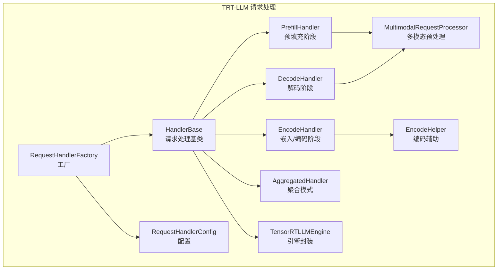
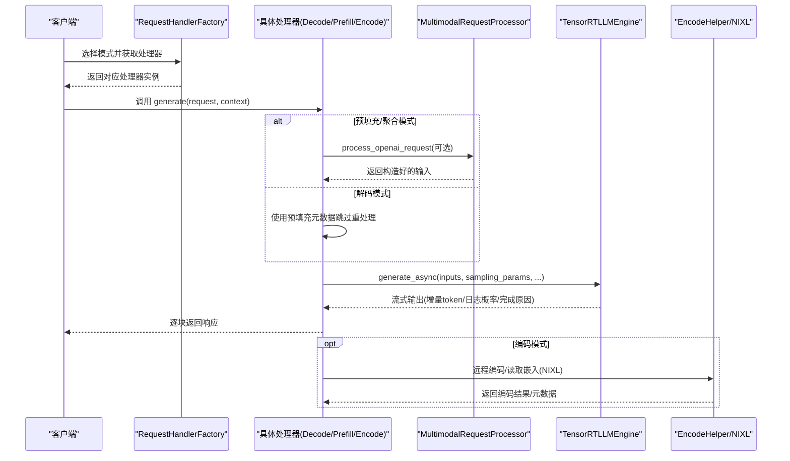
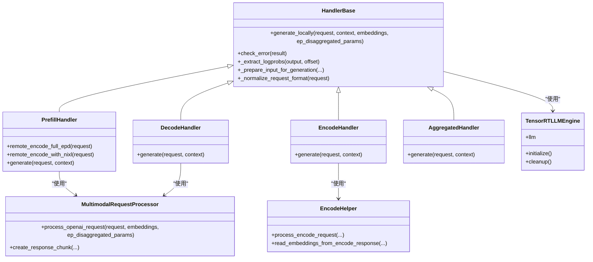

# 请求处理器

<cite>
**本文引用的文件**
- [components/src/dynamo/trtllm/request_handlers/handler_base.py](file://components/src/dynamo/trtllm/request_handlers/handler_base.py)
- [components/src/dynamo/trtllm/request_handlers/handlers.py](file://components/src/dynamo/trtllm/request_handlers/handlers.py)
- [components/src/dynamo/trtllm/multimodal_processor.py](file://components/src/dynamo/trtllm/multimodal_processor.py)
- [components/src/dynamo/trtllm/engine.py](file://components/src/dynamo/trtllm/engine.py)
- [components/src/dynamo/trtllm/constants.py](file://components/src/dynamo/trtllm/constants.py)
- [components/src/dynamo/trtllm/main.py](file://components/src/dynamo/trtllm/main.py)
- [components/src/dynamo/trtllm/encode_helper.py](file://components/src/dynamo/trtllm/encode_helper.py)
</cite>

## 目录
1. [简介](#简介)
2. [项目结构](#项目结构)
3. [核心组件](#核心组件)
4. [架构总览](#架构总览)
5. [详细组件分析](#详细组件分析)
6. [依赖关系分析](#依赖关系分析)
7. [性能考量](#性能考量)
8. [故障排查指南](#故障排查指南)
9. [结论](#结论)
10. [附录](#附录)

## 简介
本文件系统化梳理 TensorRT-LLM 后端的请求处理器体系，围绕 HandlerBase 基类与多种处理器（DecodeHandler、PrefillHandler、EncodeHandler、AggregatedHandler）展开，重点说明：
- 请求预处理与格式归一化
- 响应生成与流式输出
- 错误处理与优雅停机
- 多模态支持（图像编码器、嵌入向量、解码器链路）
- 工厂模式、配置管理与生命周期管理
- 扩展指南与性能优化建议

## 项目结构
TRT-LLM 请求处理相关代码集中在 components/src/dynamo/trtllm 下，关键模块如下：
- request_handlers：处理器基类与具体处理器实现
- multimodal_processor：多模态请求预处理与输入构造
- engine：引擎封装与多后端初始化
- main：服务入口、运行时注册、健康检查与端点绑定
- encode_helper：编码辅助工具（嵌入向量序列化/反序列化、NIXL 读写、EPD 流程）

图表来源
- [components/src/dynamo/trtllm/request_handlers/handler_base.py](file://components/src/dynamo/trtllm/request_handlers/handler_base.py#L73-L821)
- [components/src/dynamo/trtllm/request_handlers/handlers.py](file://components/src/dynamo/trtllm/request_handlers/handlers.py#L20-L262)
- [components/src/dynamo/trtllm/multimodal_processor.py](file://components/src/dynamo/trtllm/multimodal_processor.py#L45-L278)
- [components/src/dynamo/trtllm/engine.py](file://components/src/dynamo/trtllm/engine.py#L24-L142)
- [components/src/dynamo/trtllm/encode_helper.py](file://components/src/dynamo/trtllm/encode_helper.py#L16-L440)

章节来源
- [components/src/dynamo/trtllm/request_handlers/handler_base.py](file://components/src/dynamo/trtllm/request_handlers/handler_base.py#L73-L821)
- [components/src/dynamo/trtllm/request_handlers/handlers.py](file://components/src/dynamo/trtllm/request_handlers/handlers.py#L20-L262)
- [components/src/dynamo/trtllm/multimodal_processor.py](file://components/src/dynamo/trtllm/multimodal_processor.py#L45-L278)
- [components/src/dynamo/trtllm/engine.py](file://components/src/dynamo/trtllm/engine.py#L24-L142)
- [components/src/dynamo/trtllm/encode_helper.py](file://components/src/dynamo/trtllm/encode_helper.py#L16-L440)

## 核心组件
- HandlerBase：统一的请求处理抽象，负责请求格式归一化、采样参数合并、日志概率提取、取消监控、分发参数打包/解码、多模态输入准备、流式响应生成与统计上报。
- 具体处理器：
  - DecodeHandler：仅进行解码阶段，复用预填充阶段的分发参数与提示信息。
  - PrefillHandler：仅进行上下文预填充，产出分发参数与提示信息供后续解码使用；支持远程编码（EPD）与 NIXL 嵌入传输。
  - EncodeHandler：专用编码器工作节点，执行图像编码或加载预计算嵌入并通过 NIXL 提供 RDMA 传输。
  - AggregatedHandler：单机全链路（预填充+解码），适合非分布式部署。
- MultimodalRequestProcessor：从 OpenAI 风格消息中抽取文本、图像 URL 或嵌入路径，构造 TRT-LLM 输入；支持增量解码与首包角色注入。
- TensorRTLLMEngine：根据模式选择 LLM 或 MultimodalEncoder 初始化，提供统一的 generate_async 接口与清理流程。
- RequestHandlerFactory/Config：按模式选择处理器实例，集中注入引擎、发布器、多模态处理器、连接器等依赖。

章节来源
- [components/src/dynamo/trtllm/request_handlers/handler_base.py](file://components/src/dynamo/trtllm/request_handlers/handler_base.py#L73-L821)
- [components/src/dynamo/trtllm/request_handlers/handlers.py](file://components/src/dynamo/trtllm/request_handlers/handlers.py#L20-L262)
- [components/src/dynamo/trtllm/multimodal_processor.py](file://components/src/dynamo/trtllm/multimodal_processor.py#L45-L278)
- [components/src/dynamo/trtllm/engine.py](file://components/src/dynamo/trtllm/engine.py#L24-L142)
- [components/src/dynamo/trtllm/constants.py](file://components/src/dynamo/trtllm/constants.py#L7-L12)

## 架构总览
下图展示 TRT-LLM 请求在不同模式下的处理路径与组件交互：

图表来源
- [components/src/dynamo/trtllm/request_handlers/handlers.py](file://components/src/dynamo/trtllm/request_handlers/handlers.py#L20-L262)
- [components/src/dynamo/trtllm/request_handlers/handler_base.py](file://components/src/dynamo/trtllm/request_handlers/handler_base.py#L562-L800)
- [components/src/dynamo/trtllm/multimodal_processor.py](file://components/src/dynamo/trtllm/multimodal_processor.py#L167-L232)
- [components/src/dynamo/trtllm/encode_helper.py](file://components/src/dynamo/trtllm/encode_helper.py#L372-L440)

## 详细组件分析

### HandlerBase 基类设计与通用功能
- 请求预处理
  - 格式归一化：将 max_tokens 移至 stop_conditions，temperature 移至 sampling_options，确保引擎内部字段一致。
  - 分发参数设置：根据模式（预填充/解码）构建或解码 LlmDisaggregatedParams，并在预填充阶段打包提示元数据，供解码阶段复用。
  - 多模态输入准备：优先使用预填充元数据避免重复加载图像；否则通过 MultimodalRequestProcessor 构造输入；最后回退到纯 token_ids。
- 响应生成
  - 流式输出：基于 generate_async 的迭代结果，逐块返回 token_ids、log_probs、top_logprobs、finish_reason 等。
  - 统计与用量：在首次生成开始时启动发布器；在完成时汇总 prompt/completion/total tokens，并补充缓存复用统计。
  - 日志概率提取：对新生成 token 计算对数概率与 top-k 概率列表，兼容 TRT-LLM 输出格式差异。
- 错误处理与取消
  - 取消监控：监听请求取消与全局关闭事件，必要时调用 generation_result.abort() 中断生成；解码阶段出于稳定性考虑禁用 abort。
  - 请求级错误：捕获引擎抛出的 RequestError，转换为客户端可见的错误响应。
  - 致命错误：触发运行时与引擎清理并强制进程退出，配合上层重启策略。
- 配置与生命周期
  - 通过 RequestHandlerConfig 注入引擎、默认采样参数、发布器、分发模式、多模态处理器、连接器、运行时与指标收集器等。
  - 支持优雅停机：接收关闭事件后停止接受新请求并清理资源。

章节来源
- [components/src/dynamo/trtllm/request_handlers/handler_base.py](file://components/src/dynamo/trtllm/request_handlers/handler_base.py#L73-L821)

### DecodeHandler（解码阶段）
- 角色定位：仅负责解码，不参与上下文预填充。
- 特殊逻辑：
  - 若存在预填充阶段返回的分发参数与提示元数据，则直接复用，避免重复加载图像或嵌入。
  - 在解码模式下，分发参数 request_type 设为 generation_only，且移除多模态嵌入句柄以满足引擎校验。
- 适用场景：分布式解码工作节点，接收来自前端或路由的已预填充结果。

章节来源
- [components/src/dynamo/trtllm/request_handlers/handlers.py](file://components/src/dynamo/trtllm/request_handlers/handlers.py#L238-L262)
- [components/src/dynamo/trtllm/request_handlers/handler_base.py](file://components/src/dynamo/trtllm/request_handlers/handler_base.py#L254-L300)

### PrefillHandler（预填充阶段）
- 角色定位：仅负责上下文预填充，产出分发参数与提示信息。
- 多模态支持：
  - EPD 完整链路：调用 encode_client 远程执行 MultimodalEncoder，解包返回的 DisaggregatedParams 与 processed_prompt/prompt_token_ids。
  - NIXL 嵌入传输：当检测到嵌入路径（.pt/.pth/.bin），通过 NIXL 将编码器生成的嵌入以 RDMA 方式传输给预填充工作节点。
- 响应规范：预填充阶段 max_tokens 强制为 1，仅产出一次响应；同时打包分发参数与提示元数据，供解码阶段复用。

章节来源
- [components/src/dynamo/trtllm/request_handlers/handlers.py](file://components/src/dynamo/trtllm/request_handlers/handlers.py#L91-L236)
- [components/src/dynamo/trtllm/encode_helper.py](file://components/src/dynamo/trtllm/encode_helper.py#L130-L190)
- [components/src/dynamo/trtllm/encode_helper.py](file://components/src/dynamo/trtllm/encode_helper.py#L271-L370)

### EncodeHandler（嵌入/编码阶段）
- 角色定位：专用编码器工作节点，不对外暴露服务端点。
- 功能要点：
  - 无多模态处理器时抛出运行时错误，防止误用。
  - 两种编码路径：
    - 嵌入路径（NIXL）：加载本地/远端嵌入张量，创建可读操作并通过 NIXL 传输给预填充工作节点。
    - 全 EPD（图像 URL）：调用 MultimodalEncoder 生成 DisaggregatedParams 与 processed_prompt/prompt_token_ids。
  - 返回值：编码结果（含分发参数、提示与 token ids）或 NIXL 元数据（形状、dtype、辅助张量）。

章节来源
- [components/src/dynamo/trtllm/request_handlers/handlers.py](file://components/src/dynamo/trtllm/request_handlers/handlers.py#L56-L89)
- [components/src/dynamo/trtllm/encode_helper.py](file://components/src/dynamo/trtllm/encode_helper.py#L211-L440)

### AggregatedHandler（聚合模式）
- 角色定位：单机全链路（预填充+解码），无需外部编码器。
- 行为特征：直接调用 HandlerBase.generate_locally，完成本地预填充与解码。

章节来源
- [components/src/dynamo/trtllm/request_handlers/handlers.py](file://components/src/dynamo/trtllm/request_handlers/handlers.py#L41-L54)

### 多模态处理器（MultimodalRequestProcessor）
- 输入解析：从 OpenAI 风格 messages 抽取文本、图像 URL 与嵌入路径，识别模态类型。
- 输入构造：调用 TRT-LLM 默认多模态输入加载器，支持媒体（图像）与嵌入张量两种路径；复用已初始化的 tokenizer。
- 增量解码：维护上次解码文本缓存，计算增量 delta 并组装首包包含 role 字段的流式响应。
- 文件安全：限制本地文件访问路径与大小，拒绝越权访问与超限文件。

章节来源
- [components/src/dynamo/trtllm/multimodal_processor.py](file://components/src/dynamo/trtllm/multimodal_processor.py#L140-L232)
- [components/src/dynamo/trtllm/multimodal_processor.py](file://components/src/dynamo/trtllm/multimodal_processor.py#L234-L278)

### 多模态处理器的特殊处理逻辑
- 图像编码器处理器（EncodeHelper）
  - 嵌入路径（NIXL）：创建 Descriptor 与可读操作，等待预填充工作节点完成 RDMA 读取。
  - 全 EPD：通过 MultimodalEncoder 生成 DisaggregatedParams 与 processed_prompt，编码为字典以便网络传输。
- 工作节点处理器（PrefillHandler/DecodeHandler）
  - 预填充：解包 EPD 参数，保留 processed_prompt 与 prompt_token_ids，打包提示元数据。
  - 解码：使用预填充元数据，跳过图像/嵌入重处理，直接进入生成阶段。
- 处理器处理器（MultimodalRequestProcessor）
  - 作为“处理器”协调消息解析、媒体加载与输入构造，屏蔽多模态细节。

章节来源
- [components/src/dynamo/trtllm/encode_helper.py](file://components/src/dynamo/trtllm/encode_helper.py#L130-L190)
- [components/src/dynamo/trtllm/encode_helper.py](file://components/src/dynamo/trtllm/encode_helper.py#L271-L370)
- [components/src/dynamo/trtllm/request_handlers/handlers.py](file://components/src/dynamo/trtllm/request_handlers/handlers.py#L91-L236)
- [components/src/dynamo/trtllm/request_handlers/handler_base.py](file://components/src/dynamo/trtllm/request_handlers/handler_base.py#L444-L512)

### 处理器工厂模式与配置管理
- 工厂映射：根据 DisaggregationMode（prefill/decode/encode/prefill_and_decode）选择对应处理器。
- 配置注入：RequestHandlerConfig 统一封装引擎、默认采样参数、发布器、分发模式、编码器客户端、多模态处理器、连接器、运行时与指标收集器等。
- 生命周期：服务入口 main 中初始化运行时、引擎、发布器与健康检查负载，随后注册模型并绑定端点。

章节来源
- [components/src/dynamo/trtllm/request_handlers/handlers.py](file://components/src/dynamo/trtllm/request_handlers/handlers.py#L20-L39)
- [components/src/dynamo/trtllm/request_handlers/handlers.py](file://components/src/dynamo/trtllm/request_handlers/handlers.py#L431-L444)
- [components/src/dynamo/trtllm/main.py](file://components/src/dynamo/trtllm/main.py#L128-L520)

### 处理器生命周期管理
- 初始化：main 中构建 engine_args，按模式选择 LLM 或 MultimodalEncoder，初始化发布器与指标收集器。
- 运行期：注册模型类型与端点，serve_endpoint 绑定处理器 generate 方法。
- 关闭：信号处理触发 DistributedRuntime 优雅停机，HandlerBase 在致命错误时触发引擎清理与进程退出。

章节来源
- [components/src/dynamo/trtllm/engine.py](file://components/src/dynamo/trtllm/engine.py#L54-L91)
- [components/src/dynamo/trtllm/main.py](file://components/src/dynamo/trtllm/main.py#L145-L157)
- [components/src/dynamo/trtllm/main.py](file://components/src/dynamo/trtllm/main.py#L505-L520)
- [components/src/dynamo/trtllm/request_handlers/handler_base.py](file://components/src/dynamo/trtllm/request_handlers/handler_base.py#L544-L561)

## 依赖关系分析
- 组件耦合
  - HandlerBase 依赖引擎（LLM/MultimodalEncoder）、发布器、多模态处理器、连接器、运行时与指标收集器。
  - PrefillHandler/DecodeHandler 依赖 MultimodalRequestProcessor 与 EncodeHelper（NIXL）。
  - EncodeHandler 依赖 EncodeHelper 与连接器。
- 外部依赖
  - TRT-LLM LLM/MultimodalEncoder、SamplingParams、MetricsCollector
  - Prometheus REGISTRY、ZMQ 发布器
  - NIXL Connector（RDMA 传输）

图表来源
- [components/src/dynamo/trtllm/request_handlers/handler_base.py](file://components/src/dynamo/trtllm/request_handlers/handler_base.py#L73-L821)
- [components/src/dynamo/trtllm/request_handlers/handlers.py](file://components/src/dynamo/trtllm/request_handlers/handlers.py#L41-L262)
- [components/src/dynamo/trtllm/multimodal_processor.py](file://components/src/dynamo/trtllm/multimodal_processor.py#L45-L278)
- [components/src/dynamo/trtllm/engine.py](file://components/src/dynamo/trtllm/engine.py#L24-L142)
- [components/src/dynamo/trtllm/encode_helper.py](file://components/src/dynamo/trtllm/encode_helper.py#L16-L440)

## 性能考量
- 流式输出与增量解码
  - 通过逐块返回 token_ids 与 log_probs，降低首 token 延迟并提升用户体验。
  - MultimodalRequestProcessor 使用增量解码，减少重复解码开销。
- 分发参数复用
  - 预填充阶段打包提示元数据，解码阶段直接复用，避免重复加载图像/嵌入。
- 指标与可观测性
  - 启用返回性能指标后，可获取缓存复用统计与吞吐度量；结合 Prometheus 暴露 TRT-LLM 原生指标。
- 后端选择
  - Autodeploy 后端会裁剪不支持的参数，需在配置中避免传入不受支持字段。

章节来源
- [components/src/dynamo/trtllm/request_handlers/handler_base.py](file://components/src/dynamo/trtllm/request_handlers/handler_base.py#L685-L784)
- [components/src/dynamo/trtllm/multimodal_processor.py](file://components/src/dynamo/trtllm/multimodal_processor.py#L234-L278)
- [components/src/dynamo/trtllm/engine.py](file://components/src/dynamo/trtllm/engine.py#L94-L125)
- [components/src/dynamo/trtllm/main.py](file://components/src/dynamo/trtllm/main.py#L405-L429)

## 故障排查指南
- 常见错误与定位
  - 预填充阶段无输出：检查 generate_async 是否返回空 outputs，必要时返回 error finish_reason。
  - 解码阶段缺少分发参数：抛出 ValueError，确认预填充阶段是否正确打包并传递。
  - 请求被取消：捕获 asyncio.CancelledError，记录请求 ID 并停止生成。
  - 引擎异常：捕获 RequestError，转换为客户端可见错误响应。
  - 致命错误：触发运行时与引擎清理并强制退出，配合上层重启策略。
- 多模态问题
  - 本地文件访问被拒：检查 allowed_local_media_path 配置与路径合法性。
  - 嵌入路径/URL 加载失败：检查文件大小限制与网络可达性。
- NIXL 传输问题
  - 读取未完成：确保 EncodeHelper 等待 readable_op 完成后再返回。
  - 类型/形状不匹配：核对 embeddings_dtype 与 shape 序列化/反序列化一致性。

章节来源
- [components/src/dynamo/trtllm/request_handlers/handler_base.py](file://components/src/dynamo/trtllm/request_handlers/handler_base.py#L786-L800)
- [components/src/dynamo/trtllm/multimodal_processor.py](file://components/src/dynamo/trtllm/multimodal_processor.py#L79-L138)
- [components/src/dynamo/trtllm/encode_helper.py](file://components/src/dynamo/trtllm/encode_helper.py#L130-L190)

## 结论
TRT-LLM 请求处理器通过 HandlerBase 抽象统一了预处理、生成与响应流程，结合工厂模式与配置注入实现了灵活的多模式支持。多模态链路覆盖从图像 URL 到嵌入路径的完整场景，并通过 NIXL 实现高效传输。整体设计兼顾性能与可扩展性，便于二次开发与集成。

## 附录

### 扩展指南与最佳实践
- 自定义处理器开发
  - 继承 HandlerBase 并实现 generate 方法；在 generate_locally 内复用现有预处理与生成逻辑，按需扩展输入准备与响应格式。
  - 如需新增模式，更新 RequestHandlerFactory 映射并在 constants 中添加枚举值。
- 多模态扩展
  - 在 MultimodalRequestProcessor 中扩展媒体类型或输入加载逻辑；注意保持与 TRT-LLM 输入格式一致。
  - 对于新的编码路径，完善 EncodeHelper 的处理分支并确保元数据与张量格式正确。
- 性能优化
  - 启用返回性能指标以观察缓存复用与吞吐变化。
  - 使用预填充元数据复用避免重复 I/O。
  - 控制日志概率 top-k 数量，平衡精度与带宽。
  - 合理设置批大小与最大令牌数，避免过度占用显存。

章节来源
- [components/src/dynamo/trtllm/request_handlers/handlers.py](file://components/src/dynamo/trtllm/request_handlers/handlers.py#L20-L39)
- [components/src/dynamo/trtllm/constants.py](file://components/src/dynamo/trtllm/constants.py#L7-L12)
- [components/src/dynamo/trtllm/multimodal_processor.py](file://components/src/dynamo/trtllm/multimodal_processor.py#L167-L232)
- [components/src/dynamo/trtllm/encode_helper.py](file://components/src/dynamo/trtllm/encode_helper.py#L372-L440)