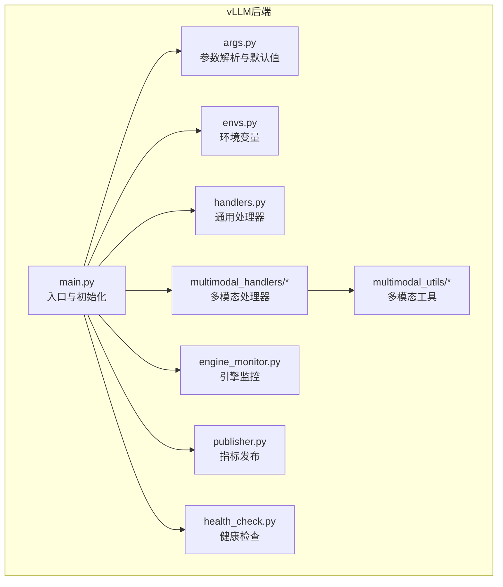
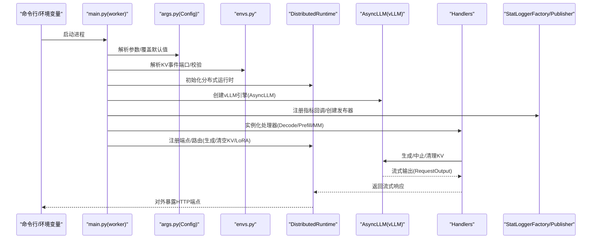
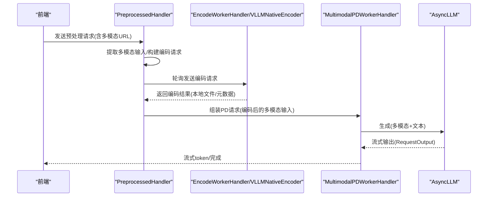
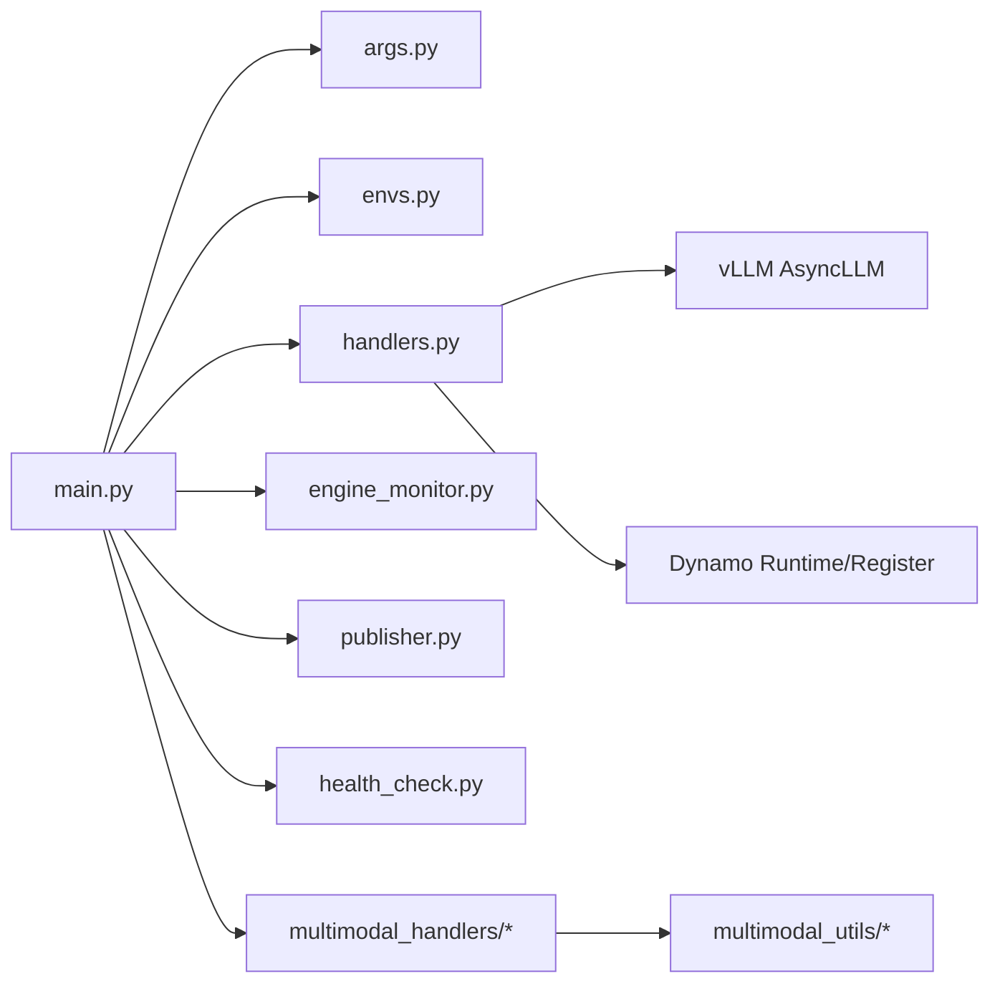

# vLLM后端

<cite>
**本文档引用的文件**
- [components/src/dynamo/vllm/main.py](file://components/src/dynamo/vllm/main.py)
- [components/src/dynamo/vllm/args.py](file://components/src/dynamo/vllm/args.py)
- [components/src/dynamo/vllm/envs.py](file://components/src/dynamo/vllm/envs.py)
- [components/src/dynamo/vllm/handlers.py](file://components/src/dynamo/vllm/handlers.py)
- [components/src/dynamo/vllm/engine_monitor.py](file://components/src/dynamo/vllm/engine_monitor.py)
- [components/src/dynamo/vllm/publisher.py](file://components/src/dynamo/vllm/publisher.py)
- [components/src/dynamo/vllm/health_check.py](file://components/src/dynamo/vllm/health_check.py)
- [components/src/dynamo/vllm/multimodal_handlers/__init__.py](file://components/src/dynamo/vllm/multimodal_handlers/__init__.py)
- [components/src/dynamo/vllm/multimodal_handlers/encode_worker_handler.py](file://components/src/dynamo/vllm/multimodal_handlers/encode_worker_handler.py)
- [components/src/dynamo/vllm/multimodal_handlers/preprocessed_handler.py](file://components/src/dynamo/vllm/multimodal_handlers/preprocessed_handler.py)
- [components/src/dynamo/vllm/multimodal_utils/encode_utils.py](file://components/src/dynamo/vllm/multimodal_utils/encode_utils.py)
- [components/src/dynamo/vllm/multimodal_utils/image_loader.py](file://components/src/dynamo/vllm/multimodal_utils/image_loader.py)
- [components/README.md](file://components/README.md)
</cite>

## 目录
1. [简介](#简介)
2. [项目结构](#项目结构)
3. [核心组件](#核心组件)
4. [架构总览](#架构总览)
5. [详细组件分析](#详细组件分析)
6. [依赖关系分析](#依赖关系分析)
7. [性能考虑](#性能考虑)
8. [故障排查指南](#故障排查指南)
9. [结论](#结论)
10. [附录](#附录)

## 简介
本文件系统性阐述 Dynamo vLLM 后端的实现架构与运行机制，覆盖主入口点、处理器设计、参数配置与环境变量管理，并深入解析 vLLM 特有的 Broadest Feature Coverage 能力：完整的 OpenAI 兼容 API、LoRA 微调支持、工具调用、多模态处理等。同时，文档详述 LMCache 集成、DeepSeek R1 优化、GPT-oss 支持、多节点部署、提示词嵌入与推测式解码等高级特性，提供性能优化策略、配置选项、错误处理与监控集成的实践指导。

## 项目结构
vLLM 后端位于 components/src/dynamo/vllm 目录，采用按职责分层的模块化组织：
- 入口与运行时：main.py、args.py、envs.py
- 处理器与调度：handlers.py（生成器与请求处理）、multimodal_handlers/*（多模态专用处理器）
- 运行时监控与指标：engine_monitor.py、publisher.py
- 健康检查：health_check.py
- 多模态工具链：multimodal_utils/*（图像加载、编码、协议等）

图表来源
- [components/src/dynamo/vllm/main.py](file://components/src/dynamo/vllm/main.py#L1-L1028)
- [components/src/dynamo/vllm/args.py](file://components/src/dynamo/vllm/args.py#L1-L649)
- [components/src/dynamo/vllm/envs.py](file://components/src/dynamo/vllm/envs.py#L1-L83)
- [components/src/dynamo/vllm/handlers.py](file://components/src/dynamo/vllm/handlers.py#L1-L1540)
- [components/src/dynamo/vllm/multimodal_handlers/__init__.py](file://components/src/dynamo/vllm/multimodal_handlers/__init__.py#L1-L25)
- [components/src/dynamo/vllm/multimodal_utils/encode_utils.py](file://components/src/dynamo/vllm/multimodal_utils/encode_utils.py#L1-L211)
- [components/src/dynamo/vllm/engine_monitor.py](file://components/src/dynamo/vllm/engine_monitor.py#L1-L82)
- [components/src/dynamo/vllm/publisher.py](file://components/src/dynamo/vllm/publisher.py#L1-L116)
- [components/src/dynamo/vllm/health_check.py](file://components/src/dynamo/vllm/health_check.py#L1-L121)

章节来源
- [components/README.md](file://components/README.md#L20-L33)

## 核心组件
- 主入口与初始化：负责解析命令行参数、设置环境变量、下载模型、初始化 vLLM 引擎、注册端点、启动 KV 事件发布与指标收集、处理优雅停机。
- 参数与环境：集中定义 vLLM 引擎参数、Dynamo 扩展参数、连接器配置、KV 事件端口、多模态开关与提示模板等。
- 通用处理器：封装生成逻辑、采样参数构建、LoRA 动态加载/卸载、KV 缓存清理、文本/令牌模式切换、中止监控、提示词嵌入解码等。
- 多模态处理器：编码器工作流（RDMA/本地缓存）、vLLM 原生编码器（ECConnector）、预处理处理器（多模态输入提取与路由）。
- 运行时监控与指标：引擎健康检查、异常时自动关闭、指标发布工厂与数据汇聚。
- 健康检查：为 vLLM 提供默认健康检查负载，支持文本/令牌两种输入模式。

章节来源
- [components/src/dynamo/vllm/main.py](file://components/src/dynamo/vllm/main.py#L76-L152)
- [components/src/dynamo/vllm/args.py](file://components/src/dynamo/vllm/args.py#L110-L467)
- [components/src/dynamo/vllm/handlers.py](file://components/src/dynamo/vllm/handlers.py#L230-L734)
- [components/src/dynamo/vllm/multimodal_handlers/encode_worker_handler.py](file://components/src/dynamo/vllm/multimodal_handlers/encode_worker_handler.py#L52-L365)
- [components/src/dynamo/vllm/multimodal_handlers/preprocessed_handler.py](file://components/src/dynamo/vllm/multimodal_handlers/preprocessed_handler.py#L42-L384)
- [components/src/dynamo/vllm/engine_monitor.py](file://components/src/dynamo/vllm/engine_monitor.py#L23-L82)
- [components/src/dynamo/vllm/publisher.py](file://components/src/dynamo/vllm/publisher.py#L34-L116)
- [components/src/dynamo/vllm/health_check.py](file://components/src/dynamo/vllm/health_check.py#L82-L121)

## 架构总览
vLLM 后端通过分布式运行时（DistributedRuntime）统一编排，支持多种工作角色（预填充/解码/编码/处理器），并可选启用多模态、LoRA、KV 事件、指标与健康检查。关键流程包括：参数解析与默认值覆盖、引擎初始化、端点注册、KV 事件发布器配置、指标收集、请求处理与响应流式返回。

图表来源
- [components/src/dynamo/vllm/main.py](file://components/src/dynamo/vllm/main.py#L76-L152)
- [components/src/dynamo/vllm/args.py](file://components/src/dynamo/vllm/args.py#L559-L606)
- [components/src/dynamo/vllm/envs.py](file://components/src/dynamo/vllm/envs.py#L57-L83)
- [components/src/dynamo/vllm/publisher.py](file://components/src/dynamo/vllm/publisher.py#L81-L116)
- [components/src/dynamo/vllm/handlers.py](file://components/src/dynamo/vllm/handlers.py#L230-L377)

## 详细组件分析

### 主入口与初始化（main.py）
- 角色：解析参数、设置环境变量、下载模型、初始化 vLLM 引擎、选择初始化分支（预填充/解码/多模态/原生编码器）、注册端点、KV 事件发布器、指标收集、健康检查、优雅停机。
- 关键点：
  - 多节点非主导节点处理：仅运行 vLLM 工作进程，不提供服务端点。
  - Prometheus 多进程指标：在 K8s 场景下避免重复时间序列冲突，分别注册全局与多进程收集器。
  - KV 事件发布器：根据 dp_rank 为每个并行副本创建独立发布端点；可选订阅 KVBM 合并器。
  - vLLM 引擎：设置运行器、跳过 tokenizer 初始化、禁用统计日志等默认行为；支持 GMS 加载格式与 LoRA 运行时更新环境变量。
  - 模型注册：从 vLLM 引擎元数据获取 KV 块数、最大并发序列数、批处理令牌数等，注入到运行时配置。

章节来源
- [components/src/dynamo/vllm/main.py](file://components/src/dynamo/vllm/main.py#L51-L152)
- [components/src/dynamo/vllm/main.py](file://components/src/dynamo/vllm/main.py#L154-L210)
- [components/src/dynamo/vllm/main.py](file://components/src/dynamo/vllm/main.py#L212-L286)
- [components/src/dynamo/vllm/main.py](file://components/src/dynamo/vllm/main.py#L289-L361)
- [components/src/dynamo/vllm/main.py](file://components/src/dynamo/vllm/main.py#L363-L416)
- [components/src/dynamo/vllm/main.py](file://components/src/dynamo/vllm/main.py#L418-L528)
- [components/src/dynamo/vllm/main.py](file://components/src/dynamo/vllm/main.py#L530-L674)
- [components/src/dynamo/vllm/main.py](file://components/src/dynamo/vllm/main.py#L676-L700)
- [components/src/dynamo/vllm/main.py](file://components/src/dynamo/vllm/main.py#L702-L755)
- [components/src/dynamo/vllm/main.py](file://components/src/dynamo/vllm/main.py#L757-L793)
- [components/src/dynamo/vllm/main.py](file://components/src/dynamo/vllm/main.py#L795-L800)

### 参数与环境（args.py、envs.py）
- Config 类：集中承载 Dynamo 扩展参数（命名空间、组件、端点、迁移限制、工具/推理解析器、端点类型、多模态开关、vLLM 原生编码器参数、use_vllm_tokenizer、KV 事件开关等）与 vLLM AsyncEngineArgs。
- 参数解析与默认值覆盖：
  - 连接器列表：支持 nixl、lmcache、kvbm、none/null，组合为多连接器或 PdConnector。
  - KV 转移配置：基于连接器列表自动生成 KVTransferConfig，或使用用户提供的显式配置。
  - KV 事件配置：根据是否启用前缀缓存与 decode worker 判断是否需要发布 KV 事件，默认端口来自环境变量。
  - vLLM 默认覆盖：runner=generate、skip_tokenizer_init=False、禁用请求/统计日志等。
  - 多模态互斥校验：确保仅启用一种多模态角色，并要求开启 --enable-multimodal。
  - vLLM 原生编码器：校验共享存储路径等必要参数。
- 环境变量：DYN_VLLM_KV_EVENT_PORT 的解析与范围校验。

章节来源
- [components/src/dynamo/vllm/args.py](file://components/src/dynamo/vllm/args.py#L30-L108)
- [components/src/dynamo/vllm/args.py](file://components/src/dynamo/vllm/args.py#L110-L467)
- [components/src/dynamo/vllm/args.py](file://components/src/dynamo/vllm/args.py#L470-L557)
- [components/src/dynamo/vllm/args.py](file://components/src/dynamo/vllm/args.py#L559-L606)
- [components/src/dynamo/vllm/args.py](file://components/src/dynamo/vllm/args.py#L607-L649)
- [components/src/dynamo/vllm/envs.py](file://components/src/dynamo/vllm/envs.py#L57-L83)

### 通用处理器（handlers.py）
- 抽象基类 BaseWorkerHandler：封装生成器、采样参数构建、KV 清理、睡眠/唤醒、中止监控、LoRA 管理（加载/卸载/列举）、提示词嵌入解码、文本/令牌模式切换、输入参数管理等。
- 采样参数构建：
  - 预处理请求格式：支持 guided_decoding 结构化输出、stop_token_ids 合并、logprobs/prompt_logprobs 解析、动态 max_tokens 计算。
  - OpenAI 兼容格式：映射温度、top_p、频率惩罚等参数，支持 max_tokens/stop/ignore_eos/min_tokens。
- LoRA 动态管理：
  - 通过环境变量启用，使用 LoRAManager 下载并添加到 vLLM 引擎，发布/注销 ModelDeploymentCard，保证幂等与一致性。
  - 并发控制：按 LoRA 名称加锁，避免重复加载。
- 多模态支持：图像/视频 URL 解析、前端解码变体（待实现）。
- 提示词嵌入：支持 base64 编码的 PyTorch 张量，解码为 vLLM EmbedsPrompt 输入。

章节来源
- [components/src/dynamo/vllm/handlers.py](file://components/src/dynamo/vllm/handlers.py#L230-L377)
- [components/src/dynamo/vllm/handlers.py](file://components/src/dynamo/vllm/handlers.py#L75-L173)
- [components/src/dynamo/vllm/handlers.py](file://components/src/dynamo/vllm/handlers.py#L175-L228)
- [components/src/dynamo/vllm/handlers.py](file://components/src/dynamo/vllm/handlers.py#L392-L734)
- [components/src/dynamo/vllm/handlers.py](file://components/src/dynamo/vllm/handlers.py#L743-L806)

### 多模态处理器与工具链
- 编码器工作流：
  - 传统编码器：图像加载、处理器、视觉编码器、投影器、嵌入哈希、本地缓存/传输元数据、回传给 PD 工作器。
  - vLLM 原生编码器：使用 TokensPrompt 直接触发 vLLM 内部编码器执行，写入 ECConnector 缓存，返回 mm_hash 与连接器元数据。
- 预处理处理器：
  - 从预处理请求中提取多模态输入（图像/视频 URL），批量发送至编码器，再将编码后的多模态输入注入到 PD 工作器请求中。
  - ECConnector 处理器：复用预处理逻辑，但直接使用 vLLM 原生编码器，支持预分词输入与占位符令牌。
- 工具链：
  - 图像加载：HTTP/HTTPS/data URL 支持，带缓存与格式校验。
  - 编码工具：模型特定编码器选择、投影器、EC 转移配置构造。

图表来源
- [components/src/dynamo/vllm/multimodal_handlers/preprocessed_handler.py](file://components/src/dynamo/vllm/multimodal_handlers/preprocessed_handler.py#L62-L147)
- [components/src/dynamo/vllm/multimodal_handlers/encode_worker_handler.py](file://components/src/dynamo/vllm/multimodal_handlers/encode_worker_handler.py#L90-L220)
- [components/src/dynamo/vllm/multimodal_handlers/encode_worker_handler.py](file://components/src/dynamo/vllm/multimodal_handlers/encode_worker_handler.py#L255-L353)
- [components/src/dynamo/vllm/multimodal_utils/image_loader.py](file://components/src/dynamo/vllm/multimodal_utils/image_loader.py#L41-L108)
- [components/src/dynamo/vllm/multimodal_utils/encode_utils.py](file://components/src/dynamo/vllm/multimodal_utils/encode_utils.py#L88-L133)

章节来源
- [components/src/dynamo/vllm/multimodal_handlers/__init__.py](file://components/src/dynamo/vllm/multimodal_handlers/__init__.py#L4-L24)
- [components/src/dynamo/vllm/multimodal_handlers/preprocessed_handler.py](file://components/src/dynamo/vllm/multimodal_handlers/preprocessed_handler.py#L42-L247)
- [components/src/dynamo/vllm/multimodal_handlers/encode_worker_handler.py](file://components/src/dynamo/vllm/multimodal_handlers/encode_worker_handler.py#L52-L365)
- [components/src/dynamo/vllm/multimodal_utils/image_loader.py](file://components/src/dynamo/vllm/multimodal_utils/image_loader.py#L31-L108)
- [components/src/dynamo/vllm/multimodal_utils/encode_utils.py](file://components/src/dynamo/vllm/multimodal_utils/encode_utils.py#L135-L211)

### 运行时监控与指标（engine_monitor.py、publisher.py）
- 引擎监控：定期健康检查，失败时触发引擎关闭与运行时关闭，防止僵尸进程占用资源。
- 指标发布：StatLoggerFactory 为 vLLM 提供自定义统计日志器，DynamoStatLoggerPublisher 将 KV 使用情况转换为活跃块数并发布到 NATS 端点；NullStatLogger 在非当前 dp_rank 时忽略记录。

章节来源
- [components/src/dynamo/vllm/engine_monitor.py](file://components/src/dynamo/vllm/engine_monitor.py#L23-L82)
- [components/src/dynamo/vllm/publisher.py](file://components/src/dynamo/vllm/publisher.py#L34-L116)

### 健康检查（health_check.py）
- 提供 vLLM 专属健康检查负载：支持文本输入与令牌输入两种模式，自动提取 BOS token ID 作为默认提示，温度与停止条件默认安全值，便于快速探测引擎可用性。

章节来源
- [components/src/dynamo/vllm/health_check.py](file://components/src/dynamo/vllm/health_check.py#L21-L80)
- [components/src/dynamo/vllm/health_check.py](file://components/src/dynamo/vllm/health_check.py#L82-L121)

## 依赖关系分析
- 组件耦合：
  - main.py 依赖 args.py（参数）、envs.py（端口）、handlers.py（处理器）、engine_monitor.py（监控）、publisher.py（指标）、health_check.py（健康检查）。
  - handlers.py 依赖 vLLM 引擎接口、Dynamo 运行时与注册接口、LoRA 管理器。
  - 多模态处理器依赖 encode_utils 与 image_loader。
- 外部依赖：
  - vLLM AsyncLLM、KV 事件发布、Prometheus 多进程、NATS/ZMQ、NIXL（可选）。

图表来源
- [components/src/dynamo/vllm/main.py](file://components/src/dynamo/vllm/main.py#L42-L46)
- [components/src/dynamo/vllm/handlers.py](file://components/src/dynamo/vllm/handlers.py#L26-L37)

章节来源
- [components/src/dynamo/vllm/main.py](file://components/src/dynamo/vllm/main.py#L42-L46)
- [components/src/dynamo/vllm/handlers.py](file://components/src/dynamo/vllm/handlers.py#L26-L37)

## 性能考虑
- 多进程指标：在容器/K8s 环境中，通过 PROMETHEUS_MULTIPROC_DIR 与 MultiProcessCollector 避免重复时间序列；若冲突则使用分离 Registry。
- 连接器后端选择：TP=1 且使用 NIXL 时强制分布式执行器为 mp，避免单进程导致的 GIL 竞争。
- KV 事件与前缀缓存：启用前缀缓存并正确配置 KVEventsConfig，decode worker 不发布 KV 事件；支持 KVBM 合并器订阅。
- 多模态缓存：图像加载缓存、编码器本地缓存与 RDMA 可选路径，减少重复 I/O。
- 采样参数动态计算：根据模型最大长度与输入长度动态设置 max_tokens，避免无效等待。

章节来源
- [components/src/dynamo/vllm/main.py](file://components/src/dynamo/vllm/main.py#L154-L210)
- [components/src/dynamo/vllm/args.py](file://components/src/dynamo/vllm/args.py#L289-L312)
- [components/src/dynamo/vllm/args.py](file://components/src/dynamo/vllm/args.py#L470-L507)
- [components/src/dynamo/vllm/multimodal_utils/image_loader.py](file://components/src/dynamo/vllm/multimodal_utils/image_loader.py#L31-L108)
- [components/src/dynamo/vllm/handlers.py](file://components/src/dynamo/vllm/handlers.py#L163-L172)

## 故障排查指南
- 引擎崩溃：VllmEngineMonitor 定期检查健康，失败时触发引擎与运行时关闭并退出进程，便于外部重启。
- 优雅停机：信号处理器捕获 SIGTERM/SIGINT，调用 DistributedRuntime.shutdown，区分是否等待在途请求完成。
- 中止监控：为每个请求创建后台任务监听取消，及时 abort vLLM 请求，避免资源泄露。
- LoRA 加载失败：检查 DYN_LORA_ENABLED 是否启用、URI 是否可达、并发加载锁状态；失败时进行回滚并返回错误。
- 多模态问题：确认 --enable-multimodal 开启、URL 格式正确、图像格式支持；视频/音频暂未支持。
- 指标缺失：检查 PROMETHEUS_MULTIPROC_DIR 设置与 MultiProcessCollector 注册；确认注册了 vLLM/lmcache/dynamo_component 前缀指标。

章节来源
- [components/src/dynamo/vllm/engine_monitor.py](file://components/src/dynamo/vllm/engine_monitor.py#L49-L82)
- [components/src/dynamo/vllm/main.py](file://components/src/dynamo/vllm/main.py#L64-L74)
- [components/src/dynamo/vllm/handlers.py](file://components/src/dynamo/vllm/handlers.py#L341-L370)
- [components/src/dynamo/vllm/handlers.py](file://components/src/dynamo/vllm/handlers.py#L456-L592)
- [components/src/dynamo/vllm/multimodal_handlers/preprocessed_handler.py](file://components/src/dynamo/vllm/multimodal_handlers/preprocessed_handler.py#L198-L247)

## 结论
vLLM 后端通过清晰的模块划分与运行时编排，实现了对 vLLM 的深度集成与扩展：OpenAI 兼容 API、LoRA 动态管理、多模态流水线、KV 事件与前缀缓存、指标与健康检查、多节点与多连接器支持。配合参数与环境变量的灵活配置，可在不同部署形态（单机/多机、容器/K8s）下获得稳定与高性能的推理服务。

## 附录

### OpenAI 兼容 API 与工具调用
- 采样参数映射：handlers.py 提供 OpenAI 兼容的采样参数构建函数，支持温度、top_p、频率惩罚、最大/最小生成长度等。
- 工具调用与推理解析：通过 --dyn-tool-call-parser 与 --dyn-reasoning-parser 注入解析器名称，结合端点类型启用相应能力。

章节来源
- [components/src/dynamo/vllm/handlers.py](file://components/src/dynamo/vllm/handlers.py#L175-L228)
- [components/src/dynamo/vllm/args.py](file://components/src/dynamo/vllm/args.py#L146-L161)

### LMCache 集成与 KV 事件
- 连接器：通过 --connector lmcache 自动配置 KVTransferConfig；支持多连接器串联。
- KV 事件：启用前缀缓存时自动创建 KVEventsConfig，decode worker 不发布事件；支持 KVBM 合并器订阅。

章节来源
- [components/src/dynamo/vllm/args.py](file://components/src/dynamo/vllm/args.py#L509-L557)
- [components/src/dynamo/vllm/args.py](file://components/src/dynamo/vllm/args.py#L470-L507)
- [components/src/dynamo/vllm/main.py](file://components/src/dynamo/vllm/main.py#L212-L286)

### DeepSeek R1 优化与 GPT-oss 支持
- DeepSeek R1：通过 vLLM 原生编码器（ECConnector）与预分词输入，结合占位符令牌实现高效多模态处理。
- GPT-oss：可通过自定义 jinja 模板与端点类型配置，满足不同模型的对话/补全需求。

章节来源
- [components/src/dynamo/vllm/multimodal_handlers/encode_worker_handler.py](file://components/src/dynamo/vllm/multimodal_handlers/encode_worker_handler.py#L222-L353)
- [components/src/dynamo/vllm/args.py](file://components/src/dynamo/vllm/args.py#L161-L171)

### 多节点部署与提示词嵌入
- 多节点：非主导节点仅运行 vLLM 工作进程，不提供服务端点；decode worker 不发布 KV 事件。
- 提示词嵌入：支持 base64 编码的 PyTorch 张量作为输入，解码为 vLLM EmbedsPrompt。

章节来源
- [components/src/dynamo/vllm/main.py](file://components/src/dynamo/vllm/main.py#L51-L62)
- [components/src/dynamo/vllm/handlers.py](file://components/src/dynamo/vllm/handlers.py#L743-L806)

### 推测式解码
- 通过 vLLM 引擎参数与采样策略（如 guided_decoding）实现结构化输出与更优吞吐/延迟权衡；具体配置由 AsyncEngineArgs 与采样参数构建函数共同决定。

章节来源
- [components/src/dynamo/vllm/handlers.py](file://components/src/dynamo/vllm/handlers.py#L94-L104)
- [components/src/dynamo/vllm/args.py](file://components/src/dynamo/vllm/args.py#L284-L287)