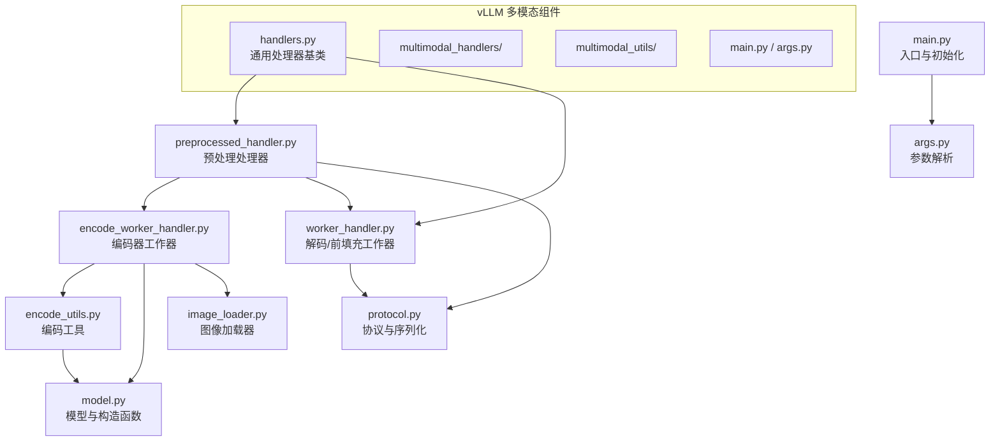
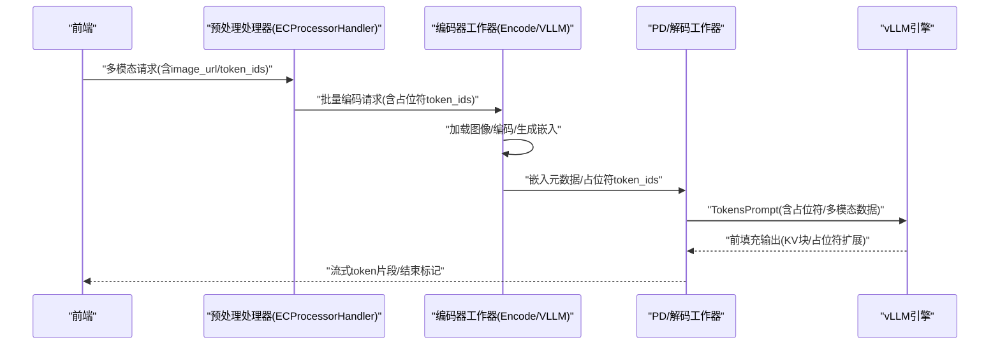
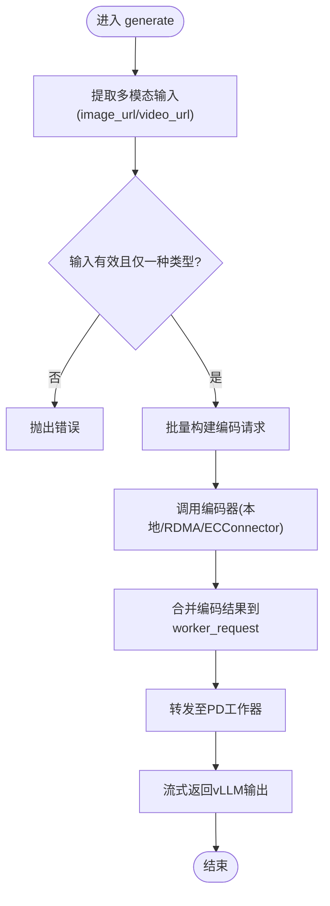
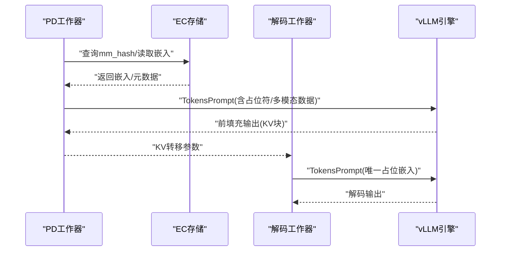
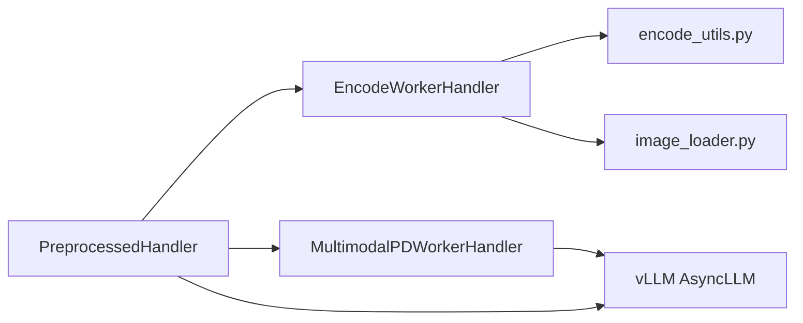

# 多模态处理器

<cite>
**本文引用的文件**
- [components/src/dynamo/vllm/multimodal_handlers/encode_worker_handler.py](file://components/src/dynamo/vllm/multimodal_handlers/encode_worker_handler.py)
- [components/src/dynamo/vllm/multimodal_handlers/preprocessed_handler.py](file://components/src/dynamo/vllm/multimodal_handlers/preprocessed_handler.py)
- [components/src/dynamo/vllm/multimodal_handlers/worker_handler.py](file://components/src/dynamo/vllm/multimodal_handlers/worker_handler.py)
- [components/src/dynamo/vllm/multimodal_utils/encode_utils.py](file://components/src/dynamo/vllm/multimodal_utils/encode_utils.py)
- [components/src/dynamo/vllm/multimodal_utils/model.py](file://components/src/dynamo/vllm/multimodal_utils/model.py)
- [components/src/dynamo/vllm/multimodal_utils/protocol.py](file://components/src/dynamo/vllm/multimodal_utils/protocol.py)
- [components/src/dynamo/vllm/multimodal_utils/image_loader.py](file://components/src/dynamo/vllm/multimodal_utils/image_loader.py)
- [components/src/dynamo/vllm/handlers.py](file://components/src/dynamo/vllm/handlers.py)
- [components/src/dynamo/vllm/main.py](file://components/src/dynamo/vllm/main.py)
- [components/src/dynamo/vllm/args.py](file://components/src/dynamo/vllm/args.py)
</cite>

## 目录
1. [简介](#简介)
2. [项目结构](#项目结构)
3. [核心组件](#核心组件)
4. [架构总览](#架构总览)
5. [详细组件分析](#详细组件分析)
6. [依赖关系分析](#依赖关系分析)
7. [性能考量](#性能考量)
8. [故障排查指南](#故障排查指南)
9. [结论](#结论)
10. [附录：配置与使用示例](#附录配置与使用示例)

## 简介
本文件面向 vLLM 多模态处理器组件，系统性梳理并解释以下三类组件的设计与实现：
- 编码器工作器（EncodeWorkerHandler）：负责图像等多模态输入的编码与嵌入生成，并通过 RDMA/NIXL 或本地磁盘进行传输或缓存。
- 预处理处理器（PreprocessedHandler）：对接前端请求，提取多模态输入，调度编码器与解码/前填充工作器，流式返回结果。
- 解码工作器（MultimodalDecodeWorkerHandler）：在解码阶段消费 KV 块，结合多模态特征完成文本生成。

同时，文档深入阐述 ECConnector 模式下的原生编码器实现原理，包括自动缓存管理与共享存储机制；并给出多模态数据在分布式环境中的处理流程、配置方法、错误处理与性能优化建议。

## 项目结构
vLLM 多模态相关代码主要位于 components/src/dynamo/vllm 下，按职责划分为：
- handlers 层：通用处理器基类与多模态专用处理器（编码、预处理、解码/前填充）
- multimodal_utils 层：协议定义、模型加载与编码工具、图像加载器等
- main/args：入口与命令行参数解析，支持 ECConnector 的启用与配置



图表来源
- [components/src/dynamo/vllm/handlers.py](file://components/src/dynamo/vllm/handlers.py#L1-L200)
- [components/src/dynamo/vllm/multimodal_handlers/encode_worker_handler.py](file://components/src/dynamo/vllm/multimodal_handlers/encode_worker_handler.py#L1-L120)
- [components/src/dynamo/vllm/multimodal_handlers/preprocessed_handler.py](file://components/src/dynamo/vllm/multimodal_handlers/preprocessed_handler.py#L1-L120)
- [components/src/dynamo/vllm/multimodal_handlers/worker_handler.py](file://components/src/dynamo/vllm/multimodal_handlers/worker_handler.py#L1-L120)
- [components/src/dynamo/vllm/multimodal_utils/protocol.py](file://components/src/dynamo/vllm/multimodal_utils/protocol.py#L1-L120)
- [components/src/dynamo/vllm/multimodal_utils/encode_utils.py](file://components/src/dynamo/vllm/multimodal_utils/encode_utils.py#L1-L120)
- [components/src/dynamo/vllm/multimodal_utils/model.py](file://components/src/dynamo/vllm/multimodal_utils/model.py#L1-L120)
- [components/src/dynamo/vllm/multimodal_utils/image_loader.py](file://components/src/dynamo/vllm/multimodal_utils/image_loader.py#L1-L108)
- [components/src/dynamo/vllm/main.py](file://components/src/dynamo/vllm/main.py#L800-L999)
- [components/src/dynamo/vllm/args.py](file://components/src/dynamo/vllm/args.py#L110-L468)

章节来源
- [components/src/dynamo/vllm/multimodal_handlers/__init__.py](file://components/src/dynamo/vllm/multimodal_handlers/__init__.py#L1-L24)

## 核心组件
- 编码器工作器（EncodeWorkerHandler/VLLMEncodeWorkerHandler）
  - 负责将图像 URL 加载为 PIL 图像，调用模型特定编码器生成嵌入，支持 RDMA/NIXL 或本地 safetensors 文件缓存。
  - 支持 vLLM 原生编码器（ECConnector 模式），直接由 vLLM 引擎执行编码并将 mm_hash 写入共享存储。
- 预处理处理器（PreprocessedHandler/ECProcessorHandler）
  - 提取前端传入的多模态输入，批量调度编码器；随后将预处理后的请求转发给 PD 工作器（或 ECConnector 消费者）。
  - ECProcessorHandler 使用 vLLM 原生编码器请求格式，携带占位符 token_ids，使 vLLM 在 TokensPrompt 中正确匹配占位符。
- 解码工作器（MultimodalDecodeWorkerHandler/MultimodalPDWorkerHandler）
  - PD 工作器负责前填充与可选的解码阶段；在 ECConnector 消费者模式下，从共享存储加载嵌入。
  - 解码工作器在 Qwen VL 场景中构造唯一占位嵌入以避免前缀缓存误命中。

章节来源
- [components/src/dynamo/vllm/multimodal_handlers/encode_worker_handler.py](file://components/src/dynamo/vllm/multimodal_handlers/encode_worker_handler.py#L52-L365)
- [components/src/dynamo/vllm/multimodal_handlers/preprocessed_handler.py](file://components/src/dynamo/vllm/multimodal_handlers/preprocessed_handler.py#L42-L384)
- [components/src/dynamo/vllm/multimodal_handlers/worker_handler.py](file://components/src/dynamo/vllm/multimodal_handlers/worker_handler.py#L31-L365)

## 架构总览
vLLM 多模态在分布式环境中的典型路径如下：
- 数据接收：前端将包含多模态 URL 的请求发送到处理器端点。
- 预处理：预处理处理器提取多模态输入，构建 vLLMMultimodalRequest 或 VLLMNativeEncoderRequest。
- 编码：编码器工作器对图像进行编码，生成嵌入并通过 RDMA/NIXL 或本地缓存写入共享存储。
- 分发与解码：PD 工作器根据是否启用 ECConnector 消费模式，从共享存储加载嵌入或直接读取内存嵌入；随后进行前填充与解码（可选）。
- 流式响应：将 vLLM 输出转换为可序列化对象，逐段返回给客户端。



图表来源
- [components/src/dynamo/vllm/multimodal_handlers/preprocessed_handler.py](file://components/src/dynamo/vllm/multimodal_handlers/preprocessed_handler.py#L281-L384)
- [components/src/dynamo/vllm/multimodal_handlers/encode_worker_handler.py](file://components/src/dynamo/vllm/multimodal_handlers/encode_worker_handler.py#L255-L353)
- [components/src/dynamo/vllm/multimodal_handlers/worker_handler.py](file://components/src/dynamo/vllm/multimodal_handlers/worker_handler.py#L163-L365)

## 详细组件分析

### 编码器工作器（EncodeWorkerHandler/VLLMEncodeWorkerHandler）
- EncodeWorkerHandler
  - 功能：加载图像 URL，调用模型特定编码器生成嵌入；支持本地 safetensors 缓存或 RDMA/NIXL 描述符传输。
  - 关键点：
    - 图像加载：使用 ImageLoader，支持 HTTP/HTTPS 与 data URL；内置 LRU 缓存。
    - 编码：根据模型类型选择编码路径（LLaVA 投影器 + 视觉塔，Qwen 直接视觉编码）。
    - 传输：可切换本地文件或 NIXL 描述符；RDMA 时需异步 connector 初始化。
    - 缓存：按 image_url 计算哈希键，缓存嵌入元数据，避免重复编码。
- VLLMEncodeWorkerHandler（ECConnector 模式）
  - 功能：直接调用 vLLM 引擎执行编码，生成 mm_hash 并写入共享存储；返回每个多模态项的响应。
  - 关键点：
    - 输入：VLLMNativeEncoderRequest，包含占位符 token_ids 与多模态组列表。
    - 执行：使用 TokensPrompt 将占位符 token_ids 传递给 vLLM，确保与多模态占位符一致。
    - 输出：为每个输入项返回 VLLMNativeEncoderResponse，包含 mm_hash 与连接器元数据。

```mermaid
classDiagram
class EncodeWorkerHandler {
+generate(request, context)
-image_loader
-vision_encoder
-projector
-cached_embeddings
-_connector
}
class VLLMEncodeWorkerHandler {
+generate(request, context)
-engine_client
-image_loader
-config
}
EncodeWorkerHandler --> ImageLoader : "使用"
EncodeWorkerHandler --> "NIXL Connector" : "可选"
VLLMEncodeWorkerHandler --> "vLLM AsyncLLM" : "调用"
```

图表来源
- [components/src/dynamo/vllm/multimodal_handlers/encode_worker_handler.py](file://components/src/dynamo/vllm/multimodal_handlers/encode_worker_handler.py#L52-L365)
- [components/src/dynamo/vllm/multimodal_utils/image_loader.py](file://components/src/dynamo/vllm/multimodal_utils/image_loader.py#L31-L108)

章节来源
- [components/src/dynamo/vllm/multimodal_handlers/encode_worker_handler.py](file://components/src/dynamo/vllm/multimodal_handlers/encode_worker_handler.py#L90-L220)
- [components/src/dynamo/vllm/multimodal_handlers/encode_worker_handler.py](file://components/src/dynamo/vllm/multimodal_handlers/encode_worker_handler.py#L255-L353)

### 预处理处理器（PreprocessedHandler/ECProcessorHandler）
- PreprocessedHandler
  - 功能：从请求中提取多模态输入（image_url/video_url），构建 vLLMMultimodalRequest，批量调度编码器，再转发给 PD 工作器。
  - 关键点：
    - 多模态输入提取：支持 URL 变体与 decoded 变体（当前标准 worker 不支持 decoded）。
    - 批量编码：按 ENCODE_BATCH_SIZE 聚合请求，减少网络往返。
    - 响应流：将 vLLM RequestOutput 转换为可序列化对象，逐段返回。
- ECProcessorHandler（ECConnector 模式）
  - 功能：使用 VLLMNativeEncoderRequest，携带占位符 token_ids，直接调用 vLLM 原生编码器；随后将完整请求转发给 PD 工作器。
  - 关键点：
    - 占位符 token_ids：来自前端 Rust tokenization，保证与模型占位符一致。
    - 全量多模态：将所有图像一次性加入请求，便于 vLLM 统一处理。



图表来源
- [components/src/dynamo/vllm/multimodal_handlers/preprocessed_handler.py](file://components/src/dynamo/vllm/multimodal_handlers/preprocessed_handler.py#L63-L143)
- [components/src/dynamo/vllm/multimodal_handlers/preprocessed_handler.py](file://components/src/dynamo/vllm/multimodal_handlers/preprocessed_handler.py#L281-L384)

章节来源
- [components/src/dynamo/vllm/multimodal_handlers/preprocessed_handler.py](file://components/src/dynamo/vllm/multimodal_handlers/preprocessed_handler.py#L63-L143)
- [components/src/dynamo/vllm/multimodal_handlers/preprocessed_handler.py](file://components/src/dynamo/vllm/multimodal_handlers/preprocessed_handler.py#L281-L384)

### 解码工作器（MultimodalDecodeWorkerHandler/MultimodalPDWorkerHandler）
- MultimodalDecodeWorkerHandler
  - 功能：在解码阶段消费 KV 块，结合多模态数据生成文本；针对 Qwen VL，构造唯一占位嵌入以避免前缀缓存误匹配。
- MultimodalPDWorkerHandler
  - 功能：前填充与可选解码；在 ECConnector 消费者模式下，从共享存储加载嵌入；支持 RDMA/NIXL 读取或本地 safetensors。
  - 关键点：
    - ECConnector 消费者：使用 PIL 图像加载，vLLM 自动检测并从缓存加载嵌入。
    - RDMA/NIXL：创建 Descriptor 并发起异步读取，等待完成后再构造多模态数据。
    - 多图合并：对多个图像嵌入进行拼接，适配不同模型的数据结构。



图表来源
- [components/src/dynamo/vllm/multimodal_handlers/worker_handler.py](file://components/src/dynamo/vllm/multimodal_handlers/worker_handler.py#L163-L365)

章节来源
- [components/src/dynamo/vllm/multimodal_handlers/worker_handler.py](file://components/src/dynamo/vllm/multimodal_handlers/worker_handler.py#L63-L108)
- [components/src/dynamo/vllm/multimodal_handlers/worker_handler.py](file://components/src/dynamo/vllm/multimodal_handlers/worker_handler.py#L163-L365)

## 依赖关系分析
- 组件耦合
  - 预处理处理器依赖 vLLM 的 AsyncEngineArgs、SamplingParams 与 RequestOutput；通过 Client 客户端与编码器/工作器通信。
  - 编码器工作器依赖模型加载与编码工具，支持本地缓存与 RDMA/NIXL 传输。
  - 解码/前填充工作器依赖 vLLM 的 AsyncLLM 与 TokensPrompt，处理 KV 转移参数与多模态数据。
- 外部依赖
  - vLLM 引擎与配置（AsyncEngineArgs、ECTransferConfig、KVTransferConfig/KVEventsConfig）
  - Dynamo 运行时 Client 与端点注册
  - NIXL 连接器（用于 RDMA/NIXL 传输）



图表来源
- [components/src/dynamo/vllm/multimodal_handlers/preprocessed_handler.py](file://components/src/dynamo/vllm/multimodal_handlers/preprocessed_handler.py#L42-L143)
- [components/src/dynamo/vllm/multimodal_handlers/encode_worker_handler.py](file://components/src/dynamo/vllm/multimodal_handlers/encode_worker_handler.py#L52-L120)
- [components/src/dynamo/vllm/multimodal_handlers/worker_handler.py](file://components/src/dynamo/vllm/multimodal_handlers/worker_handler.py#L31-L120)
- [components/src/dynamo/vllm/multimodal_utils/encode_utils.py](file://components/src/dynamo/vllm/multimodal_utils/encode_utils.py#L165-L211)

章节来源
- [components/src/dynamo/vllm/multimodal_handlers/preprocessed_handler.py](file://components/src/dynamo/vllm/multimodal_handlers/preprocessed_handler.py#L42-L143)
- [components/src/dynamo/vllm/multimodal_handlers/encode_worker_handler.py](file://components/src/dynamo/vllm/multimodal_handlers/encode_worker_handler.py#L52-L120)
- [components/src/dynamo/vllm/multimodal_handlers/worker_handler.py](file://components/src/dynamo/vllm/multimodal_handlers/worker_handler.py#L31-L120)

## 性能考量
- 编码阶段
  - 图像加载缓存：ImageLoader 对 HTTP(S) URL 实施 LRU 缓存，减少重复下载与解码开销。
  - 本地缓存：在 TRANSFER_LOCAL=1 时，使用 safetensors 文件缓存嵌入，避免 RDMA/NIXL 开销。
  - 模型特定编码：优先使用 vLLM 原生编码器（ECConnector 模式）以获得更好的性能与一致性。
- 传输与存储
  - RDMA/NIXL：适用于跨节点高效传输，但需注意异步初始化与 descriptor 生命周期。
  - 共享存储：ECConnector 模式下，嵌入写入共享存储，消费者按 mm_hash 自动加载，降低重复计算。
- 解码阶段
  - 前缀缓存：在 ECConnector 消费者模式下，前填充阶段仍可利用前缀缓存；解码阶段为避免误命中，采用唯一占位嵌入。
  - KV 转移：在解码阶段通过 kv_transfer_params 传递 KV 块，减少重复计算。

[本节为通用指导，不直接分析具体文件]

## 故障排查指南
- 常见错误与定位
  - 缺少 image_url：编码器会校验每条输入必须包含 image_url。
  - 不支持的视频输入：当前标准编码器不支持视频 URL。
  - 无效的多模态输入类型：预处理处理器要求仅一种类型（image_url 或 video_url）。
  - ECConnector 配置缺失：当使用 ECExampleConnector 后端时，必须提供 --ec-storage-path。
  - RDMA 描述符为空：PD 工作器在 NIXL 模式下若 descriptor 为 None，会抛出异常。
- 日志与调试
  - 各组件均记录关键步骤与耗时统计，便于定位瓶颈。
  - ECProcessorHandler 会在编码完成后打印嵌入缓存提示。
- 建议排查步骤
  - 确认命令行参数与环境变量配置正确（如 --ec-connector-backend/--ec-storage-path/--ec-consumer-mode）。
  - 检查共享存储路径可访问性与权限。
  - 在 RDMA 模式下确认 NIXL side channel 主机已正确设置。

章节来源
- [components/src/dynamo/vllm/multimodal_handlers/encode_worker_handler.py](file://components/src/dynamo/vllm/multimodal_handlers/encode_worker_handler.py#L113-L220)
- [components/src/dynamo/vllm/multimodal_handlers/preprocessed_handler.py](file://components/src/dynamo/vllm/multimodal_handlers/preprocessed_handler.py#L69-L99)
- [components/src/dynamo/vllm/args.py](file://components/src/dynamo/vllm/args.py#L351-L361)
- [components/src/dynamo/vllm/multimodal_handlers/worker_handler.py](file://components/src/dynamo/vllm/multimodal_handlers/worker_handler.py#L217-L227)

## 结论
vLLM 多模态处理器通过“预处理-编码-分发-解码”的流水线实现了高效的多模态推理。ECConnector 模式进一步将编码与解码解耦，借助共享存储实现嵌入复用与跨节点协作。通过合理的缓存策略、传输方式与 KV 转移机制，系统在性能与可扩展性之间取得平衡。建议在生产环境中优先采用 ECConnector 模式，并结合前缀缓存与合适的传输后端以获得最佳效果。

[本节为总结性内容，不直接分析具体文件]

## 附录：配置与使用示例
- 启用 ECConnector 模式的编码器工作器
  - 参数要点：--vllm-native-encoder-worker、--ec-connector-backend、--ec-storage-path、--ec-extra-config（可选）、--ec-consumer-mode（仅 PD/解码工作器启用）
  - 初始化流程：在 main.py 中创建 ECTransferConfig 并设置到 engine_args，随后启动 VLLMEncodeWorkerHandler
- 启用 ECConnector 模式的处理器
  - 参数要点：--ec-processor、--enable-multimodal、--mm-prompt-template（可选）
  - 初始化流程：在 main.py 中创建 ECProcessorHandler，连接 encoder 与 backend 组件端点
- 启用 ECConnector 消费者模式的 PD/解码工作器
  - 参数要点：--multimodal-worker 或 --multimodal-decode-worker、--ec-consumer-mode
  - 初始化流程：在 main.py 中创建 ECTransferConfig（角色为 ec_consumer），随后启动 MultimodalPDWorkerHandler 或 MultimodalDecodeWorkerHandler
- 错误处理与性能优化
  - 使用 TRANSFER_LOCAL 控制本地缓存与 RDMA/NIXL 的切换
  - 在 RDMA 模式下确保 NIXL side channel 主机正确设置
  - 对于 Qwen VL 模型，在解码阶段使用唯一占位嵌入避免前缀缓存误命中

章节来源
- [components/src/dynamo/vllm/main.py](file://components/src/dynamo/vllm/main.py#L800-L999)
- [components/src/dynamo/vllm/args.py](file://components/src/dynamo/vllm/args.py#L220-L247)
- [components/src/dynamo/vllm/multimodal_utils/encode_utils.py](file://components/src/dynamo/vllm/multimodal_utils/encode_utils.py#L165-L211)