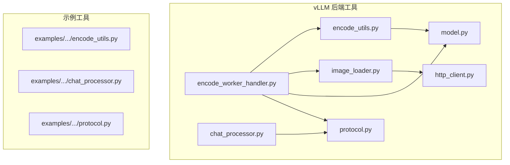
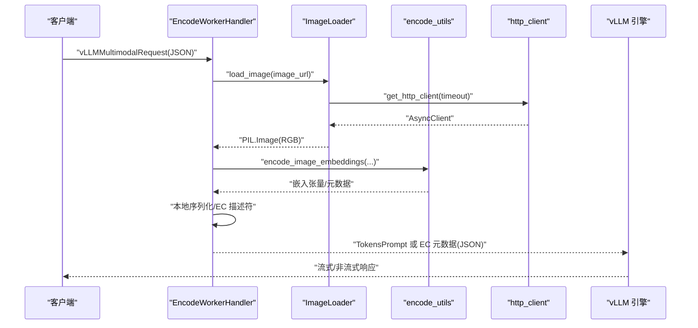
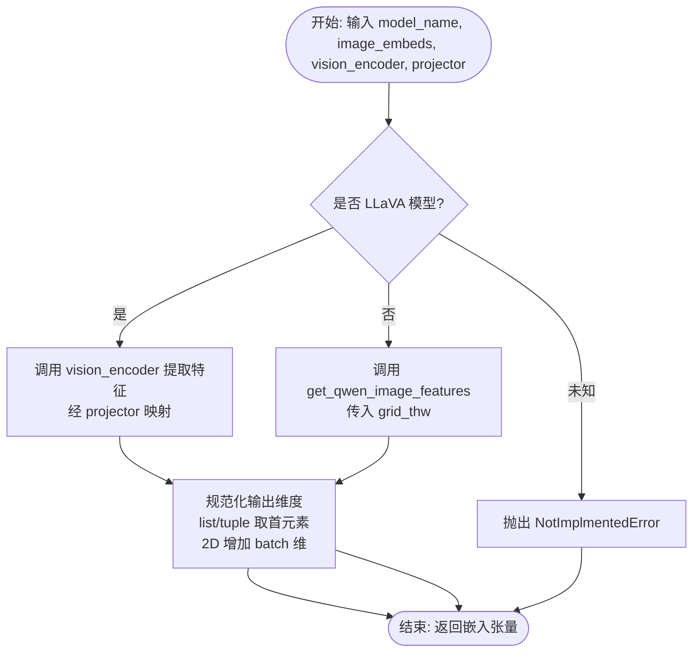
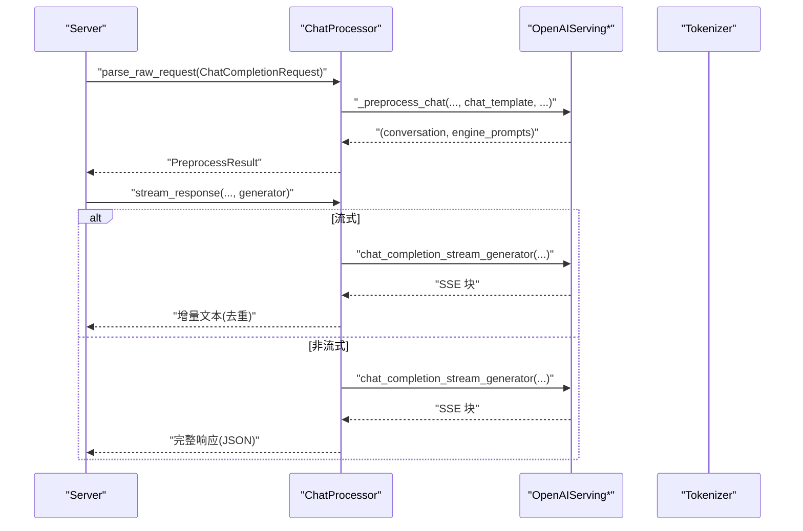
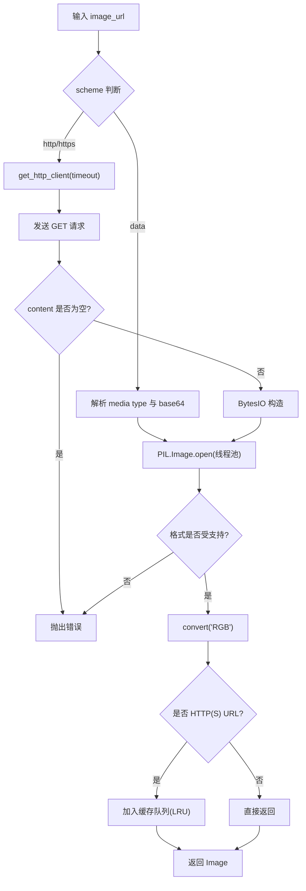
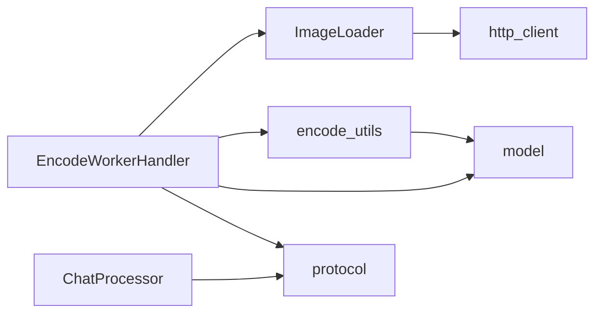

# 多模态工具类

<cite>
**本文引用的文件**   
- [components/src/dynamo/vllm/multimodal_utils/encode_utils.py](file://components/src/dynamo/vllm/multimodal_utils/encode_utils.py)
- [components/src/dynamo/vllm/multimodal_utils/chat_processor.py](file://components/src/dynamo/vllm/multimodal_utils/chat_processor.py)
- [components/src/dynamo/vllm/multimodal_utils/image_loader.py](file://components/src/dynamo/vllm/multimodal_utils/image_loader.py)
- [components/src/dynamo/vllm/multimodal_utils/http_client.py](file://components/src/dynamo/vllm/multimodal_utils/http_client.py)
- [components/src/dynamo/vllm/multimodal_utils/model.py](file://components/src/dynamo/vllm/multimodal_utils/model.py)
- [components/src/dynamo/vllm/multimodal_handlers/encode_worker_handler.py](file://components/src/dynamo/vllm/multimodal_handlers/encode_worker_handler.py)
- [components/src/dynamo/vllm/multimodal_utils/protocol.py](file://components/src/dynamo/vllm/multimodal_utils/protocol.py)
- [examples/multimodal/utils/encode_utils.py](file://examples/multimodal/utils/encode_utils.py)
- [examples/multimodal/utils/chat_processor.py](file://examples/multimodal/utils/chat_processor.py)
- [examples/multimodal/utils/protocol.py](file://examples/multimodal/utils/protocol.py)
</cite>

## 目录
1. [简介](#简介)
2. [项目结构](#项目结构)
3. [核心组件](#核心组件)
4. [架构总览](#架构总览)
5. [组件详解](#组件详解)
6. [依赖关系分析](#依赖关系分析)
7. [性能与优化](#性能与优化)
8. [故障排查指南](#故障排查指南)
9. [结论](#结论)
10. [附录：使用示例与最佳实践](#附录使用示例与最佳实践)

## 简介
本文件面向 vLLM 多模态流水线中的工具类集合，系统性梳理并说明以下核心模块：
- 编码工具（encode_utils）：负责图像嵌入编码、模型特定特征提取、EC 转移配置生成等。
- 聊天处理器（chat_processor）：负责消息预处理、OpenAI 风格聊天/补全请求的预处理与流式响应。
- 图像加载器（image_loader）：负责从 HTTP/HTTPS、data URL、本地资源加载图片，并进行格式校验与缓存。
- HTTP 客户端（http_client）：提供全局共享的异步 HTTP 客户端，统一超时与连接限制。

文档还覆盖多模态数据格式转换、消息处理协议、网络通信机制、工具类协作关系与数据流转过程，并给出实际使用示例、错误处理与调试技巧。

## 项目结构
围绕 vLLM 的多模态能力，相关代码主要分布在如下位置：
- vLLM 后端侧工具与处理器：components/src/dynamo/vllm/multimodal_utils 与 multimodal_handlers
- 示例侧工具与协议：examples/multimodal/utils

**图表来源**
- [components/src/dynamo/vllm/multimodal_utils/encode_utils.py](file://components/src/dynamo/vllm/multimodal_utils/encode_utils.py#L1-L211)
- [components/src/dynamo/vllm/multimodal_utils/chat_processor.py](file://components/src/dynamo/vllm/multimodal_utils/chat_processor.py#L1-L360)
- [components/src/dynamo/vllm/multimodal_utils/image_loader.py](file://components/src/dynamo/vllm/multimodal_utils/image_loader.py#L1-L108)
- [components/src/dynamo/vllm/multimodal_utils/http_client.py](file://components/src/dynamo/vllm/multimodal_utils/http_client.py#L1-L48)
- [components/src/dynamo/vllm/multimodal_utils/model.py](file://components/src/dynamo/vllm/multimodal_utils/model.py#L1-L264)
- [components/src/dynamo/vllm/multimodal_handlers/encode_worker_handler.py](file://components/src/dynamo/vllm/multimodal_handlers/encode_worker_handler.py#L1-L365)
- [components/src/dynamo/vllm/multimodal_utils/protocol.py](file://components/src/dynamo/vllm/multimodal_utils/protocol.py#L1-L191)
- [examples/multimodal/utils/encode_utils.py](file://examples/multimodal/utils/encode_utils.py#L1-L133)
- [examples/multimodal/utils/chat_processor.py](file://examples/multimodal/utils/chat_processor.py#L1-L348)
- [examples/multimodal/utils/protocol.py](file://examples/multimodal/utils/protocol.py#L1-L191)

**章节来源**
- [components/src/dynamo/vllm/multimodal_utils/encode_utils.py](file://components/src/dynamo/vllm/multimodal_utils/encode_utils.py#L1-L211)
- [components/src/dynamo/vllm/multimodal_utils/chat_processor.py](file://components/src/dynamo/vllm/multimodal_utils/chat_processor.py#L1-L360)
- [components/src/dynamo/vllm/multimodal_utils/image_loader.py](file://components/src/dynamo/vllm/multimodal_utils/image_loader.py#L1-L108)
- [components/src/dynamo/vllm/multimodal_utils/http_client.py](file://components/src/dynamo/vllm/multimodal_utils/http_client.py#L1-L48)
- [components/src/dynamo/vllm/multimodal_utils/model.py](file://components/src/dynamo/vllm/multimodal_utils/model.py#L1-L264)
- [components/src/dynamo/vllm/multimodal_handlers/encode_worker_handler.py](file://components/src/dynamo/vllm/multimodal_handlers/encode_worker_handler.py#L1-L365)
- [components/src/dynamo/vllm/multimodal_utils/protocol.py](file://components/src/dynamo/vllm/multimodal_utils/protocol.py#L1-L191)
- [examples/multimodal/utils/encode_utils.py](file://examples/multimodal/utils/encode_utils.py#L1-L133)
- [examples/multimodal/utils/chat_processor.py](file://examples/multimodal/utils/chat_processor.py#L1-L348)
- [examples/multimodal/utils/protocol.py](file://examples/multimodal/utils/protocol.py#L1-L191)

## 核心组件
- 编码工具（encode_utils）
  - 功能：根据模型类型选择编码路径（LLaVA 投影或 Qwen 视觉编码），输出规范化后的嵌入张量；提供 EC 转移配置构造函数。
  - 关键点：支持 Qwen-VL 的 grid_thw 参数传递；对输出维度进行归一化；提供嵌入哈希与 EC 配置生成。
- 聊天处理器（chat_processor）
  - 功能：解析原始请求，调用 vLLM OpenAI 服务进行预处理，支持流式与非流式响应；按增量内容切分返回，避免重复文本。
  - 关键点：兼容新旧 vLLM 协议导入；提供 CompletionsProcessor 与 MixIn 辅助流程。
- 图像加载器（image_loader）
  - 功能：支持 data URL、HTTP/HTTPS 加载；基于线程池避免阻塞事件循环；缓存 HTTP(S) 图片；格式校验与 RGB 转换。
  - 关键点：LRU 式队列控制缓存大小；异常明确提示来源。
- HTTP 客户端（http_client）
  - 功能：全局共享异步 HTTP 客户端，统一超时、重定向与连接限制。
  - 关键点：惰性初始化与关闭检测；日志记录初始化参数。

**章节来源**
- [components/src/dynamo/vllm/multimodal_utils/encode_utils.py](file://components/src/dynamo/vllm/multimodal_utils/encode_utils.py#L88-L133)
- [components/src/dynamo/vllm/multimodal_utils/chat_processor.py](file://components/src/dynamo/vllm/multimodal_utils/chat_processor.py#L136-L294)
- [components/src/dynamo/vllm/multimodal_utils/image_loader.py](file://components/src/dynamo/vllm/multimodal_utils/image_loader.py#L31-L108)
- [components/src/dynamo/vllm/multimodal_utils/http_client.py](file://components/src/dynamo/vllm/multimodal_utils/http_client.py#L27-L47)

## 架构总览
下图展示 vLLM 多模态请求在后端侧的处理链路：图像加载 → 嵌入编码 → EC 转移/本地序列化 → 请求转发至 vLLM 前/解码阶段。

**图表来源**
- [components/src/dynamo/vllm/multimodal_handlers/encode_worker_handler.py](file://components/src/dynamo/vllm/multimodal_handlers/encode_worker_handler.py#L90-L220)
- [components/src/dynamo/vllm/multimodal_utils/image_loader.py](file://components/src/dynamo/vllm/multimodal_utils/image_loader.py#L41-L108)
- [components/src/dynamo/vllm/multimodal_utils/http_client.py](file://components/src/dynamo/vllm/multimodal_utils/http_client.py#L27-L47)
- [components/src/dynamo/vllm/multimodal_utils/encode_utils.py](file://components/src/dynamo/vllm/multimodal_utils/encode_utils.py#L88-L133)

## 组件详解

### 编码工具（encode_utils）
- 模型路由与编码
  - LLaVA：通过视觉编码器提取特征，再经投影器映射到语言空间。
  - Qwen-VL：直接调用视觉编码器，要求提供 grid_thw 以支持多尺度网格。
- 输出规范化
  - 若返回为列表/元组，取首个元素；若为 2D 张量，增加 batch 维度。
- EC 转移配置
  - 支持从额外 JSON 配置解析；可指定共享存储路径；记录日志便于排障。

**图表来源**
- [components/src/dynamo/vllm/multimodal_utils/encode_utils.py](file://components/src/dynamo/vllm/multimodal_utils/encode_utils.py#L88-L133)
- [components/src/dynamo/vllm/multimodal_utils/encode_utils.py](file://components/src/dynamo/vllm/multimodal_utils/encode_utils.py#L46-L86)

**章节来源**
- [components/src/dynamo/vllm/multimodal_utils/encode_utils.py](file://components/src/dynamo/vllm/multimodal_utils/encode_utils.py#L46-L133)
- [components/src/dynamo/vllm/multimodal_utils/encode_utils.py](file://components/src/dynamo/vllm/multimodal_utils/encode_utils.py#L165-L211)

### 聊天处理器（chat_processor）
- 预处理
  - 解析原始请求对象；根据是否存在 chat_template 决定模板；调用 OpenAI 服务进行对话与提示词渲染。
- 流式与非流式响应
  - 流式：逐条解析 SSE 数据，仅输出新增文本部分，避免重复。
  - 非流式：聚合所有增量，拼接完整文本后一次性返回。
- 兼容性
  - 尝试新旧 vLLM 导入路径；提供 CompletionsProcessor 与 MixIn 辅助。

**图表来源**
- [components/src/dynamo/vllm/multimodal_utils/chat_processor.py](file://components/src/dynamo/vllm/multimodal_utils/chat_processor.py#L157-L197)
- [components/src/dynamo/vllm/multimodal_utils/chat_processor.py](file://components/src/dynamo/vllm/multimodal_utils/chat_processor.py#L198-L294)

**章节来源**
- [components/src/dynamo/vllm/multimodal_utils/chat_processor.py](file://components/src/dynamo/vllm/multimodal_utils/chat_processor.py#L136-L294)

### 图像加载器（image_loader）
- 数据源支持
  - data URL：校验媒体类型与 base64 编码。
  - HTTP/HTTPS：通过全局 HTTP 客户端拉取，空内容报错。
- 格式与并发
  - 使用线程池避免阻塞事件循环；仅接受 JPEG/PNG/WEBP；统一转为 RGB。
- 缓存策略
  - HTTP(S) URL 使用队列维护 LRU 缓存，满载时淘汰最旧项。

**图表来源**
- [components/src/dynamo/vllm/multimodal_utils/image_loader.py](file://components/src/dynamo/vllm/multimodal_utils/image_loader.py#L41-L108)
- [components/src/dynamo/vllm/multimodal_utils/http_client.py](file://components/src/dynamo/vllm/multimodal_utils/http_client.py#L27-L47)

**章节来源**
- [components/src/dynamo/vllm/multimodal_utils/image_loader.py](file://components/src/dynamo/vllm/multimodal_utils/image_loader.py#L31-L108)
- [components/src/dynamo/vllm/multimodal_utils/http_client.py](file://components/src/dynamo/vllm/multimodal_utils/http_client.py#L27-L47)

### HTTP 客户端（http_client）
- 设计要点
  - 全局单例，惰性初始化；检测关闭状态重建；设置超时、跟随重定向与连接上限。
  - 日志记录初始化参数，便于运维观察。

**章节来源**
- [components/src/dynamo/vllm/multimodal_utils/http_client.py](file://components/src/dynamo/vllm/multimodal_utils/http_client.py#L27-L47)

### 协议与数据模型（protocol）
- vLLM 生成请求包装
  - 将 TokensPrompt 与 SamplingParams 包装为可序列化对象，解决 vLLM 内部类型不可序列化问题。
- 多模态请求与输入
  - 定义 vLLMMultimodalRequest、MultiModalInput、消息内容类型（文本/图像/音频/视频）等。
- vLLM 原生编码请求/响应
  - VLLMNativeEncoderRequest：携带 token_ids 与多模态组，用于原生编码器执行。
  - VLLMNativeEncoderResponse：返回 mm_hash 与连接器元数据，供后续解码阶段使用。

**章节来源**
- [components/src/dynamo/vllm/multimodal_utils/protocol.py](file://components/src/dynamo/vllm/multimodal_utils/protocol.py#L73-L100)
- [components/src/dynamo/vllm/multimodal_utils/protocol.py](file://components/src/dynamo/vllm/multimodal_utils/protocol.py#L157-L165)
- [components/src/dynamo/vllm/multimodal_utils/protocol.py](file://components/src/dynamo/vllm/multimodal_utils/protocol.py#L162-L182)

## 依赖关系分析
- 组件耦合
  - EncodeWorkerHandler 依赖 ImageLoader、encode_utils、model 工具与协议定义；负责端到端编码与传输。
  - ChatProcessor 依赖 vLLM OpenAI 服务接口，内部封装预处理与流式响应。
  - ImageLoader 依赖 http_client 与 PIL；提供缓存与格式校验。
- 外部依赖
  - vLLM：引擎参数、Token 化、OpenAI 服务、多模态哈希等。
  - Transformers：AutoImageProcessor、AutoModel 加载。
  - httpx：异步 HTTP 客户端。
  - safetensors：本地序列化嵌入。

**图表来源**
- [components/src/dynamo/vllm/multimodal_handlers/encode_worker_handler.py](file://components/src/dynamo/vllm/multimodal_handlers/encode_worker_handler.py#L21-L30)
- [components/src/dynamo/vllm/multimodal_utils/image_loader.py](file://components/src/dynamo/vllm/multimodal_utils/image_loader.py#L26-L26)
- [components/src/dynamo/vllm/multimodal_utils/encode_utils.py](file://components/src/dynamo/vllm/multimodal_utils/encode_utils.py#L25-L25)
- [components/src/dynamo/vllm/multimodal_utils/chat_processor.py](file://components/src/dynamo/vllm/multimodal_utils/chat_processor.py#L20-L47)
- [components/src/dynamo/vllm/multimodal_utils/protocol.py](file://components/src/dynamo/vllm/multimodal_utils/protocol.py#L157-L165)

**章节来源**
- [components/src/dynamo/vllm/multimodal_handlers/encode_worker_handler.py](file://components/src/dynamo/vllm/multimodal_handlers/encode_worker_handler.py#L52-L80)
- [components/src/dynamo/vllm/multimodal_utils/chat_processor.py](file://components/src/dynamo/vllm/multimodal_utils/chat_processor.py#L136-L156)

## 性能与优化
- I/O 与并发
  - 图像加载采用线程池与异步 HTTP 客户端，避免阻塞事件循环；建议合理设置 http_timeout 与缓存大小。
- 编码与传输
  - 对于 Qwen-VL，确保 grid_thw 正确传递，避免重复计算；必要时启用本地序列化以减少跨节点传输开销。
- 连接与复用
  - 共享 httpx.AsyncClient，设置合理的 keepalive 与最大连接数，降低握手成本。
- 前缀缓存与占位符
  - 在 vLLM 原生编码模式中，利用 token_ids 中的占位符与 mm_hash，结合 MultiModalHasher，提升前缀缓存命中率。

[本节为通用指导，不直接分析具体文件]

## 故障排查指南
- 图像加载失败
  - data URL：检查媒体类型与 base64 编码；确认包含逗号分隔的数据段。
  - HTTP/HTTPS：确认响应内容非空；检查网络连通与超时设置。
  - 格式不支持：仅支持 JPEG/PNG/WEBP；请转换为 RGB。
- 编码错误
  - LLaVA 缺少投影器：确保 projector 可用；否则抛出错误。
  - Qwen-VL 缺少 grid_thw：必须提供网格维度；否则抛出错误。
- vLLM 原生编码
  - 未提供 multimodal_inputs：检查请求体；确保至少一个 image_url 或 video_url。
  - mm_hash 计算失败：确认模型与图像一致；检查 MultiModalHasher 使用方式。
- 日志与调试
  - 打开详细日志，关注编码耗时统计、缓存命中与 EC 元数据；必要时开启 VLLM_ENCODER 调试开关。

**章节来源**
- [components/src/dynamo/vllm/multimodal_utils/image_loader.py](file://components/src/dynamo/vllm/multimodal_utils/image_loader.py#L52-L108)
- [components/src/dynamo/vllm/multimodal_utils/encode_utils.py](file://components/src/dynamo/vllm/multimodal_utils/encode_utils.py#L110-L133)
- [components/src/dynamo/vllm/multimodal_handlers/encode_worker_handler.py](file://components/src/dynamo/vllm/multimodal_handlers/encode_worker_handler.py#L273-L296)

## 结论
本文档系统梳理了 vLLM 多模态工具类集合：编码工具负责模型特定特征提取与传输配置；聊天处理器提供 OpenAI 风格的消息预处理与响应流式化；图像加载器与 HTTP 客户端保障媒体数据的高效获取与缓存；协议层则统一了请求/响应结构。通过合理使用这些工具与遵循性能与排障建议，可在生产环境中稳定地实现高质量的多模态推理服务。

[本节为总结性内容，不直接分析具体文件]

## 附录：使用示例与最佳实践
- 处理不同媒体类型
  - 图像：通过 data URL 或 HTTP/HTTPS；注意 base64 与格式校验；对 Qwen-VL 提供 grid_thw。
  - 视频/音频：当前示例侧重图像；后续可扩展为 TokensPrompt 的多模态字典。
- 自定义处理器
  - 参考 ProcessMixIn 与 ChatProcessor/CompletionsProcessor 的结构，按需扩展预处理与响应逻辑。
- 优化数据传输
  - 合理设置 http_timeout 与缓存大小；在跨节点场景优先考虑 EC Connector 或本地序列化；利用 mm_hash 与占位符提升前缀缓存命中。
- 错误处理与调试
  - 为每一步骤添加日志；捕获并记录异常；对常见错误（缺少 grid_thw、格式不支持、HTTP 空内容）提供明确提示。

[本节为通用指导，不直接分析具体文件]