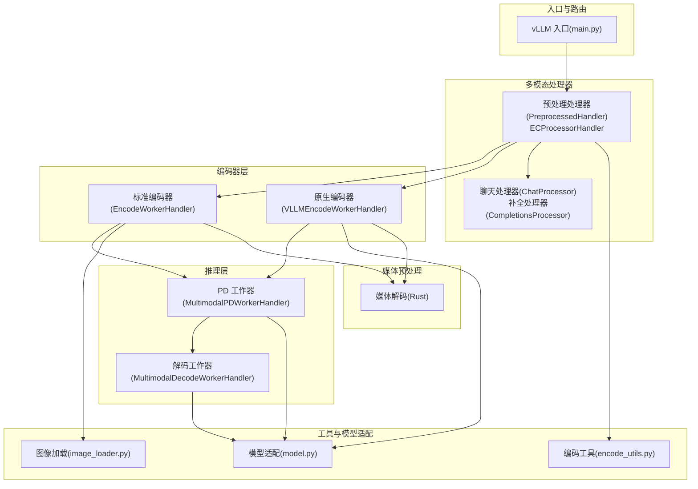
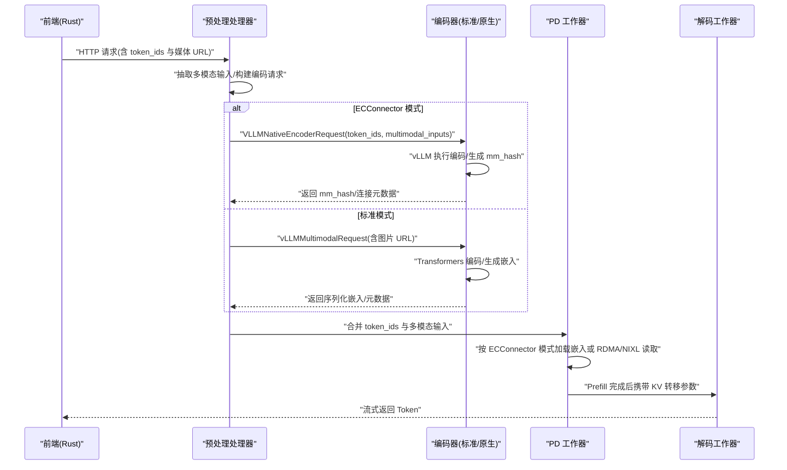
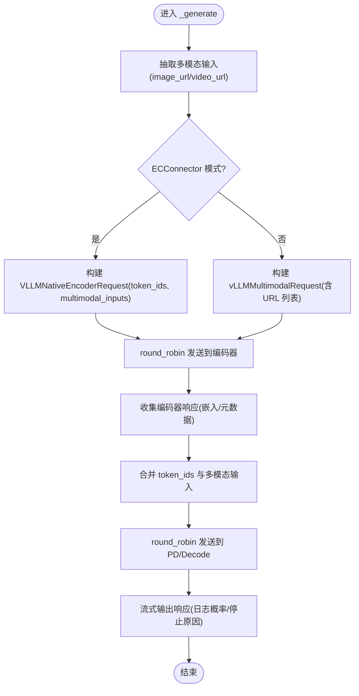
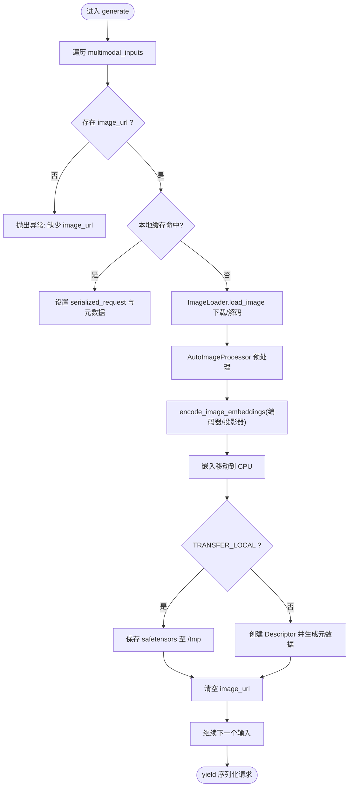
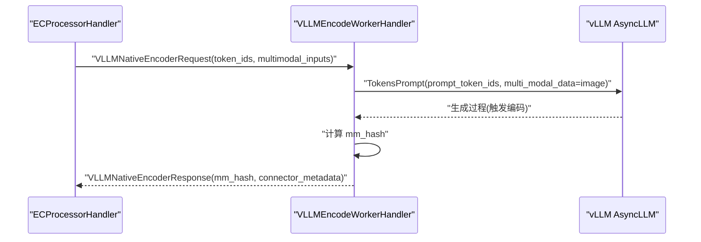
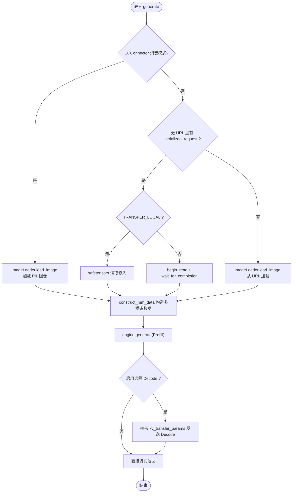
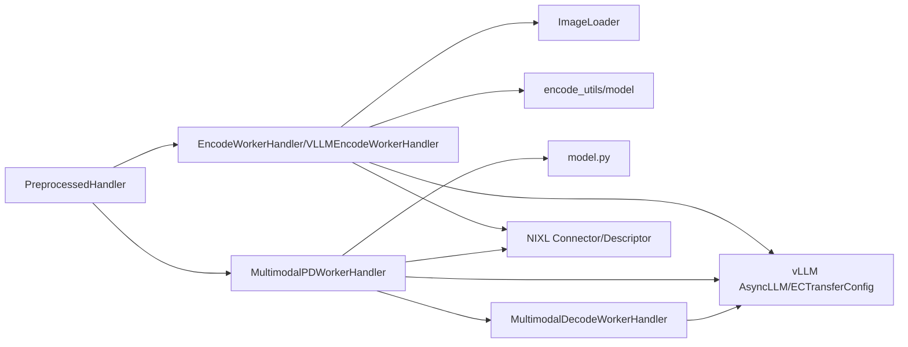
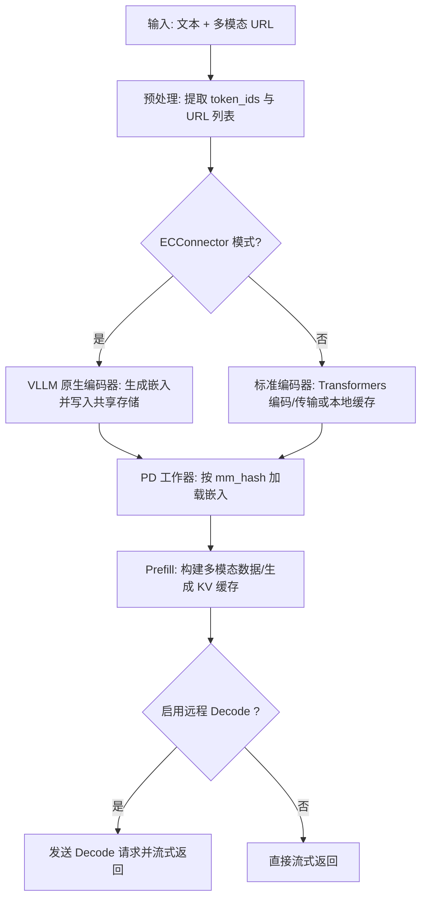

# 多模态支持

<cite>
**本文引用的文件**
- [components/src/dynamo/vllm/multimodal_handlers/encode_worker_handler.py](file://components/src/dynamo/vllm/multimodal_handlers/encode_worker_handler.py)
- [components/src/dynamo/vllm/multimodal_handlers/preprocessed_handler.py](file://components/src/dynamo/vllm/multimodal_handlers/preprocessed_handler.py)
- [components/src/dynamo/vllm/multimodal_handlers/worker_handler.py](file://components/src/dynamo/vllm/multimodal_handlers/worker_handler.py)
- [components/src/dynamo/vllm/multimodal_utils/encode_utils.py](file://components/src/dynamo/vllm/multimodal_utils/encode_utils.py)
- [components/src/dynamo/vllm/multimodal_utils/model.py](file://components/src/dynamo/vllm/multimodal_utils/model.py)
- [components/src/dynamo/vllm/multimodal_utils/image_loader.py](file://components/src/dynamo/vllm/multimodal_utils/image_loader.py)
- [components/src/dynamo/vllm/multimodal_utils/chat_processor.py](file://components/src/dynamo/vllm/multimodal_utils/chat_processor.py)
- [components/src/dynamo/vllm/main.py](file://components/src/dynamo/vllm/main.py)
- [examples/backends/vllm/launch/agg_multimodal_ec_connector.sh](file://examples/backends/vllm/launch/agg_multimodal_ec_connector.sh)
- [docs/multimodal/index.md](file://docs/multimodal/index.md)
- [lib/llm/src/preprocessor/media/decoders/video.rs](file://lib/llm/src/preprocessor/media/decoders/video.rs)
- [lib/llm/src/preprocessor/media/common.rs](file://lib/llm/src/preprocessor/media/common.rs)
- [lib/llm/src/preprocessor/media/rdma.rs](file://lib/llm/src/preprocessor/media/rdma.rs)
- [lib/memory/src/disk.rs](file://lib/memory/src/disk.rs)
- [lib/llm/src/block_manager/storage/disk.rs](file://lib/llm/src/block_manager/storage/disk.rs)
- [lib/llm/src/block_manager/v2/memory/disk.rs](file://lib/llm/src/block_manager/v2/memory/disk.rs)
- [components/src/dynamo/common/tests/memory/test_encoder_cache_manager.py](file://components/src/dynamo/common/tests/memory/test_encoder_cache_manager.py)
</cite>

## 目录
1. [简介](#简介)
2. [项目结构](#项目结构)
3. [核心组件](#核心组件)
4. [架构总览](#架构总览)
5. [详细组件分析](#详细组件分析)
6. [依赖关系分析](#依赖关系分析)
7. [性能考量](#性能考量)
8. [故障排查指南](#故障排查指南)
9. [结论](#结论)
10. [附录](#附录)

## 简介
本技术文档围绕 vLLM 多模态支持能力，系统性阐述多模态处理架构与实现细节，覆盖编码器工作器、预处理处理器与聊天处理器的设计原理；详述图像、音频、视频等多模态数据的加载、编码与处理流程；深入解析 ECConnector 模式下的原生编码器实现及其自动缓存管理与存储机制；说明多模态数据在分布式环境中的传输与同步策略，并提供可操作的配置与使用示例，以及性能优化、内存管理与错误处理策略。

## 项目结构
vLLM 多模态子系统主要由以下层次构成：
- 组件入口与路由：通过命令行参数选择不同工作器或处理器（如原生编码器、ECProcessor、标准预处理/解码/PD 工作器）。
- 多模态处理器层：负责请求预处理、分发到编码器或直接进入推理引擎。
- 编码器层：将图像/视频等媒体转为嵌入向量，支持 RDMA/NIXL 传输或本地持久化。
- 推理层：Prefill/Decode 或 PD（Prefill+Decode）工作器，按需进行 KV 缓存转移与远程解码。
- 工具与模型适配层：封装模型加载、编码器组件提取、嵌入构造与 Qwen 特定参数传递。
- 媒体预处理库：提供统一的媒体解码接口与 RDMA 描述符支持，支撑前端解码与跨节点传输。

图表来源
- [components/src/dynamo/vllm/main.py](file://components/src/dynamo/vllm/main.py#L124-L149)
- [components/src/dynamo/vllm/multimodal_handlers/preprocessed_handler.py](file://components/src/dynamo/vllm/multimodal_handlers/preprocessed_handler.py#L249-L384)
- [components/src/dynamo/vllm/multimodal_handlers/encode_worker_handler.py](file://components/src/dynamo/vllm/multimodal_handlers/encode_worker_handler.py#L222-L365)
- [components/src/dynamo/vllm/multimodal_handlers/worker_handler.py](file://components/src/dynamo/vllm/multimodal_handlers/worker_handler.py#L31-L365)
- [components/src/dynamo/vllm/multimodal_utils/encode_utils.py](file://components/src/dynamo/vllm/multimodal_utils/encode_utils.py#L165-L211)
- [components/src/dynamo/vllm/multimodal_utils/model.py](file://components/src/dynamo/vllm/multimodal_utils/model.py#L135-L264)
- [components/src/dynamo/vllm/multimodal_utils/image_loader.py](file://components/src/dynamo/vllm/multimodal_utils/image_loader.py#L41-L108)
- [lib/llm/src/preprocessor/media/decoders/video.rs](file://lib/llm/src/preprocessor/media/decoders/video.rs#L327-L366)

章节来源
- [components/src/dynamo/vllm/main.py](file://components/src/dynamo/vllm/main.py#L124-L149)
- [docs/multimodal/index.md](file://docs/multimodal/index.md#L150-L203)

## 核心组件
- 预处理处理器（PreprocessedHandler/ECProcessorHandler）
  - 负责从原始请求中抽取多模态输入（图像/视频 URL），构建编码请求并分发给编码器；随后将编码结果与预处理后的提示词合并，发送至 PD/Decode 工作器。
  - ECConnector 模式下，直接使用 vLLM 原生编码器生成嵌入并写入共享存储，后续由 PD 工作器按 mm_hash 自动加载。
- 标准编码器（EncodeWorkerHandler）
  - 使用 Transformers 图像处理器与模型特定编码器/投影器生成嵌入，支持 RDMA/NIXL 传输或本地 safetensors 文件缓存。
- 原生编码器（VLLMEncodeWorkerHandler）
  - 在 ECConnector 模式下，调用 vLLM 引擎执行编码，生成 mm_hash 并写入共享存储，供后续消费端使用。
- PD/解码工作器（MultimodalPDWorkerHandler/MultimodalDecodeWorkerHandler）
  - PD 工作器根据是否启用 ECConnector 消费模式，决定是直接从磁盘加载嵌入还是通过 RDMA/NIXL 读取；随后进行 Prefill 并按需触发远程 Decode。
  - 解码工作器接收 KV 转移参数，完成 Token 生成。
- 工具与模型适配（encode_utils.py、model.py、image_loader.py）
  - 提供嵌入哈希、编码器组件提取、ECConnector 配置创建、Qwen 特定参数构造、图像加载与缓存、模型名称规范化与检测等能力。
- 媒体预处理（Rust）
  - 提供统一的媒体解码接口（图像/视频）、RDMA 描述符与内存布局信息，支撑前端解码与跨节点传输。

章节来源
- [components/src/dynamo/vllm/multimodal_handlers/preprocessed_handler.py](file://components/src/dynamo/vllm/multimodal_handlers/preprocessed_handler.py#L42-L247)
- [components/src/dynamo/vllm/multimodal_handlers/encode_worker_handler.py](file://components/src/dynamo/vllm/multimodal_handlers/encode_worker_handler.py#L52-L221)
- [components/src/dynamo/vllm/multimodal_handlers/encode_worker_handler.py](file://components/src/dynamo/vllm/multimodal_handlers/encode_worker_handler.py#L222-L365)
- [components/src/dynamo/vllm/multimodal_handlers/worker_handler.py](file://components/src/dynamo/vllm/multimodal_handlers/worker_handler.py#L31-L365)
- [components/src/dynamo/vllm/multimodal_utils/encode_utils.py](file://components/src/dynamo/vllm/multimodal_utils/encode_utils.py#L34-L211)
- [components/src/dynamo/vllm/multimodal_utils/model.py](file://components/src/dynamo/vllm/multimodal_utils/model.py#L135-L264)
- [components/src/dynamo/vllm/multimodal_utils/image_loader.py](file://components/src/dynamo/vllm/multimodal_utils/image_loader.py#L41-L108)
- [lib/llm/src/preprocessor/media/decoders/video.rs](file://lib/llm/src/preprocessor/media/decoders/video.rs#L327-L366)

## 架构总览
vLLM 多模态支持采用“前端解码 + 编码器 + 推理引擎”的分层设计。ECConnector 模式下，编码阶段由 vLLM 原生执行，嵌入写入共享存储，后续推理阶段通过 mm_hash 自动加载，避免重复计算。标准模式下，编码器将嵌入以 RDMA/NIXL 或本地文件形式传递给 PD/Decode 工作器。

图表来源
- [components/src/dynamo/vllm/multimodal_handlers/preprocessed_handler.py](file://components/src/dynamo/vllm/multimodal_handlers/preprocessed_handler.py#L281-L384)
- [components/src/dynamo/vllm/multimodal_handlers/encode_worker_handler.py](file://components/src/dynamo/vllm/multimodal_handlers/encode_worker_handler.py#L255-L365)
- [components/src/dynamo/vllm/multimodal_handlers/worker_handler.py](file://components/src/dynamo/vllm/multimodal_handlers/worker_handler.py#L163-L365)

章节来源
- [docs/multimodal/index.md](file://docs/multimodal/index.md#L150-L203)

## 详细组件分析

### 预处理处理器（PreprocessedHandler/ECProcessorHandler）
- 功能职责
  - 从请求中提取多模态输入（图像/视频 URL），构建编码请求并分发给编码器。
  - 对于 ECConnector 模式，直接使用 vLLM 原生编码器，传入已包含占位符 token 的 token_ids，确保嵌入与提示词对齐。
  - 将编码结果与预处理后的提示词合并，发送至 PD/Decode 工作器，并复用响应流式输出逻辑。
- 关键流程
  - 解析请求，构建 vLLMMultimodalRequest 或 VLLMNativeEncoderRequest。
  - 通过 round_robin 分发到编码器客户端。
  - 收集编码器响应，组装最终请求并发送至 PD/Decode 客户端。
  - 流式输出响应，提取日志概率与停止原因等信息。

图表来源
- [components/src/dynamo/vllm/multimodal_handlers/preprocessed_handler.py](file://components/src/dynamo/vllm/multimodal_handlers/preprocessed_handler.py#L63-L247)
- [components/src/dynamo/vllm/multimodal_handlers/preprocessed_handler.py](file://components/src/dynamo/vllm/multimodal_handlers/preprocessed_handler.py#L281-L384)

章节来源
- [components/src/dynamo/vllm/multimodal_handlers/preprocessed_handler.py](file://components/src/dynamo/vllm/multimodal_handlers/preprocessed_handler.py#L42-L247)
- [components/src/dynamo/vllm/multimodal_handlers/preprocessed_handler.py](file://components/src/dynamo/vllm/multimodal_handlers/preprocessed_handler.py#L249-L384)

### 标准编码器（EncodeWorkerHandler）
- 功能职责
  - 加载图像，使用 AutoImageProcessor 进行预处理，调用模型特定编码器/投影器生成嵌入。
  - 支持本地 safetensors 缓存与 RDMA/NIXL 传输两种路径；对 Qwen 等模型附加 image_grid_thw 信息。
- 关键流程
  - 逐项检查并缓存 image_url，若命中则直接复用本地嵌入文件。
  - 否则下载图像，预处理并编码，将嵌入移动到 CPU，准备传输或保存。
  - 通过 TRANSFER_LOCAL 判断本地缓存或 RDMA 描述符元数据回传。
  - 清空 image_url 字段，避免后续误用。

图表来源
- [components/src/dynamo/vllm/multimodal_handlers/encode_worker_handler.py](file://components/src/dynamo/vllm/multimodal_handlers/encode_worker_handler.py#L90-L221)

章节来源
- [components/src/dynamo/vllm/multimodal_handlers/encode_worker_handler.py](file://components/src/dynamo/vllm/multimodal_handlers/encode_worker_handler.py#L52-L221)

### 原生编码器（VLLMEncodeWorkerHandler）
- 功能职责
  - 在 ECConnector 模式下，直接调用 vLLM 引擎执行编码，传入 token_ids 与多模态输入，生成 mm_hash 并写入共享存储。
  - 适用于 LLaVA/Qwen 等模型，确保与提示词占位符对齐。
- 关键流程
  - 校验输入，加载图像/视频（当前仅图像）。
  - 构造 TokensPrompt(prompt_token_ids, multi_modal_data)，调用 engine.generate 触发编码。
  - 遍历媒体列表，计算 mm_hash，构造 VLLMNativeEncoderResponse 并逐条返回。

图表来源
- [components/src/dynamo/vllm/multimodal_handlers/encode_worker_handler.py](file://components/src/dynamo/vllm/multimodal_handlers/encode_worker_handler.py#L255-L365)
- [components/src/dynamo/vllm/multimodal_handlers/preprocessed_handler.py](file://components/src/dynamo/vllm/multimodal_handlers/preprocessed_handler.py#L281-L384)

章节来源
- [components/src/dynamo/vllm/multimodal_handlers/encode_worker_handler.py](file://components/src/dynamo/vllm/multimodal_handlers/encode_worker_handler.py#L222-L365)
- [components/src/dynamo/vllm/multimodal_handlers/preprocessed_handler.py](file://components/src/dynamo/vllm/multimodal_handlers/preprocessed_handler.py#L281-L384)

### PD/解码工作器（MultimodalPDWorkerHandler/MultimodalDecodeWorkerHandler）
- 功能职责
  - PD 工作器：根据是否启用 ECConnector 消费模式，决定从磁盘加载嵌入或通过 RDMA/NIXL 读取；随后进行 Prefill，并按需触发远程 Decode。
  - 解码工作器：接收 KV 转移参数，完成 Token 生成。
  - 对 Qwen VL 模型，构造 image_grid_thw 与占位嵌入，保证 mRoPE 初始化一致性。
- 关键流程
  - 解析请求，构建 multi_modal_data。
  - ECConnector 消费模式：使用 PIL 加载图像，vLLM 检测 mm_hash 自动从缓存加载嵌入。
  - 非 ECConnector 模式：本地加载或 RDMA/NIXL 读取嵌入，构造 image/video 数据结构。
  - Prefill 完成后，携带 kv_transfer_params 发送 Decode 请求（或直接流式返回）。

图表来源
- [components/src/dynamo/vllm/multimodal_handlers/worker_handler.py](file://components/src/dynamo/vllm/multimodal_handlers/worker_handler.py#L163-L365)

章节来源
- [components/src/dynamo/vllm/multimodal_handlers/worker_handler.py](file://components/src/dynamo/vllm/multimodal_handlers/worker_handler.py#L31-L365)

### 工具与模型适配（encode_utils.py、model.py、image_loader.py）
- 编码工具（encode_utils.py）
  - get_embedding_hash：基于输入生成唯一哈希，用于缓存键。
  - encode_image_embeddings：根据模型类型选择编码路径（LLaVA/Qwen），并规范化输出形状。
  - get_encoder_components：提取模型的视觉编码器与投影器。
  - create_ec_transfer_config：创建 ECTransferConfig，配置 ECConnector 后端与共享存储路径。
- 模型适配（model.py）
  - SupportedModels：声明受支持的多模态模型集合。
  - is_model_supported/is_qwen_vl_model：模型名归一化与匹配。
  - load_vision_model：在 ECConnector 模式下加载 Qwen 视觉模块，禁用 v1 多进程以避免额外显存占用。
  - construct_mm_data/construct_qwen_decode_mm_data：构造多模态数据结构，Qwen 解码时生成占位嵌入以避免前缀缓存误匹配。
- 图像加载（image_loader.py）
  - 支持 HTTP/HTTPS 与 data URL；内置 LRU 缓存队列；校验格式并转换为 RGB。

章节来源
- [components/src/dynamo/vllm/multimodal_utils/encode_utils.py](file://components/src/dynamo/vllm/multimodal_utils/encode_utils.py#L34-L211)
- [components/src/dynamo/vllm/multimodal_utils/model.py](file://components/src/dynamo/vllm/multimodal_utils/model.py#L33-L264)
- [components/src/dynamo/vllm/multimodal_utils/image_loader.py](file://components/src/dynamo/vllm/multimodal_utils/image_loader.py#L41-L108)

### 媒体预处理（Rust）
- 统一的媒体解码接口，支持图像与视频；提供 EncodedMediaData 与 DecodedMediaData 结构，便于后续传输与内存布局管理。
- 支持从文件名推断分辨率与帧数，便于视频采样与形状校验。

章节来源
- [lib/llm/src/preprocessor/media/common.rs](file://lib/llm/src/preprocessor/media/common.rs#L1-L12)
- [lib/llm/src/preprocessor/media/decoders/video.rs](file://lib/llm/src/preprocessor/media/decoders/video.rs#L327-L366)
- [lib/llm/src/preprocessor/media/rdma.rs](file://lib/llm/src/preprocessor/media/rdma.rs#L80-L108)

## 依赖关系分析
- 组件耦合
  - 预处理处理器依赖编码器客户端与 PD/Decode 客户端；编码器依赖图像加载器与模型组件；PD/解码工作器依赖 vLLM 引擎与 KV 转移参数。
- 外部依赖
  - vLLM 引擎（AsyncLLM、ECTransferConfig、TokensPrompt、SamplingParams）。
  - Transformers（AutoImageProcessor、AutoModel）。
  - NIXL/RDMA（Descriptor、Readable、begin_read）。
  - Prometheus（指标采集）。
- 可能的循环依赖
  - 通过 Client 抽象与异步生成器避免直接循环引用；各模块职责清晰，未见循环导入。

图表来源
- [components/src/dynamo/vllm/multimodal_handlers/preprocessed_handler.py](file://components/src/dynamo/vllm/multimodal_handlers/preprocessed_handler.py#L42-L247)
- [components/src/dynamo/vllm/multimodal_handlers/encode_worker_handler.py](file://components/src/dynamo/vllm/multimodal_handlers/encode_worker_handler.py#L52-L221)
- [components/src/dynamo/vllm/multimodal_handlers/worker_handler.py](file://components/src/dynamo/vllm/multimodal_handlers/worker_handler.py#L31-L365)
- [components/src/dynamo/vllm/multimodal_utils/encode_utils.py](file://components/src/dynamo/vllm/multimodal_utils/encode_utils.py#L165-L211)
- [components/src/dynamo/vllm/multimodal_utils/model.py](file://components/src/dynamo/vllm/multimodal_utils/model.py#L135-L264)
- [components/src/dynamo/vllm/multimodal_utils/image_loader.py](file://components/src/dynamo/vllm/multimodal_utils/image_loader.py#L41-L108)

章节来源
- [components/src/dynamo/vllm/multimodal_handlers/preprocessed_handler.py](file://components/src/dynamo/vllm/multimodal_handlers/preprocessed_handler.py#L42-L247)
- [components/src/dynamo/vllm/multimodal_handlers/encode_worker_handler.py](file://components/src/dynamo/vllm/multimodal_handlers/encode_worker_handler.py#L52-L221)
- [components/src/dynamo/vllm/multimodal_handlers/worker_handler.py](file://components/src/dynamo/vllm/multimodal_handlers/worker_handler.py#L31-L365)

## 性能考量
- 编码缓存
  - 标准模式：本地 safetensors 缓存与 LRU 队列，减少重复下载与编码开销。
  - ECConnector 模式：vLLM 自动生成 mm_hash 并写入共享存储，后续消费端按需加载，避免重复计算。
- 传输优化
  - TRANSFER_LOCAL 控制本地文件或 RDMA/NIXL 传输；CPU 移动嵌入避免 UCX/InfiniBand 问题。
  - Qwen 解码时使用占位嵌入，防止前缀缓存误匹配，同时保持前缀缓存在 Prefill 阶段的有效性。
- 内存与存储
  - ECConnector 存储路径通过 ECTransferConfig 注入；支持自定义共享目录，结合磁盘缓存策略降低显存压力。
  - Rust 媒体解码与 RDMA 描述符减少中间拷贝，提升吞吐。

章节来源
- [components/src/dynamo/vllm/multimodal_handlers/encode_worker_handler.py](file://components/src/dynamo/vllm/multimodal_handlers/encode_worker_handler.py#L171-L200)
- [components/src/dynamo/vllm/multimodal_utils/encode_utils.py](file://components/src/dynamo/vllm/multimodal_utils/encode_utils.py#L165-L211)
- [components/src/dynamo/vllm/multimodal_utils/model.py](file://components/src/dynamo/vllm/multimodal_utils/model.py#L208-L264)
- [lib/memory/src/disk.rs](file://lib/memory/src/disk.rs#L20-L37)
- [lib/llm/src/block_manager/storage/disk.rs](file://lib/llm/src/block_manager/storage/disk.rs#L20-L37)
- [lib/llm/src/block_manager/v2/memory/disk.rs](file://lib/llm/src/block_manager/v2/memory/disk.rs#L20-L37)

## 故障排查指南
- 常见错误与定位
  - 缺少 image_url：标准编码器会抛出异常，检查请求中是否包含有效的图片 URL。
  - 不支持的模型：encode_image_embeddings 会在不支持的模型上抛出异常，确认模型是否在受支持列表中。
  - ECConnector 配置缺失：create_ec_transfer_config 需要共享存储路径，否则抛出异常。
  - RDMA 描述符为空：PD 工作器在 TRANSFER_LOCAL=false 时需要有效 Descriptor，否则抛出运行时错误。
- 日志与指标
  - 各组件均记录关键步骤与耗时统计，便于定位瓶颈。
  - Prometheus 指标采集已在入口处配置，建议结合多进程模式与回调注册使用。
- 缓存与清理
  - 标准编码器本地缓存文件需定期清理；测试用例验证了 LRU 淘汰行为与覆盖更新。

章节来源
- [components/src/dynamo/vllm/multimodal_handlers/encode_worker_handler.py](file://components/src/dynamo/vllm/multimodal_handlers/encode_worker_handler.py#L113-L118)
- [components/src/dynamo/vllm/multimodal_utils/encode_utils.py](file://components/src/dynamo/vllm/multimodal_utils/encode_utils.py#L185-L210)
- [components/src/dynamo/vllm/multimodal_handlers/worker_handler.py](file://components/src/dynamo/vllm/multimodal_handlers/worker_handler.py#L217-L227)
- [components/src/dynamo/common/tests/memory/test_encoder_cache_manager.py](file://components/src/dynamo/common/tests/memory/test_encoder_cache_manager.py#L41-L84)

## 结论
vLLM 多模态支持通过“前端解码 + 编码器 + 推理引擎”的分层架构实现了高扩展性与高性能。ECConnector 模式将编码与缓存管理下沉至 vLLM，显著简化了分布式部署与缓存一致性；标准模式则保留了灵活的传输路径（RDMA/NIXL/本地文件）。配合完善的工具链与模型适配层，系统能够稳定支持图像与视频等多模态输入，并在分布式环境中实现高效的传输与同步。

## 附录

### 配置与启动示例
- ECConnector 聚合部署脚本
  - 启动前端、ECProcessor 与 vLLM 原生编码器工作器，指定模型、ECConnector 后端与共享存储路径。
- 命令行参数要点
  - vLLM 原生编码器：--vllm-native-encoder-worker、--enable-multimodal、--model、--ec-connector-backend、--ec-storage-path。
  - ECProcessor：--ec-processor、--enable-multimodal、--model。
  - PD/Decode 工作器：--multimodal-worker/--multimodal-decode-worker/--multimodal-encode-prefill-worker，按需启用分布式解码。

章节来源
- [examples/backends/vllm/launch/agg_multimodal_ec_connector.sh](file://examples/backends/vllm/launch/agg_multimodal_ec_connector.sh#L43-L92)
- [components/src/dynamo/vllm/main.py](file://components/src/dynamo/vllm/main.py#L124-L149)

### 多模态数据处理流程（概念图）

[此图为概念性流程示意，无需图表来源]