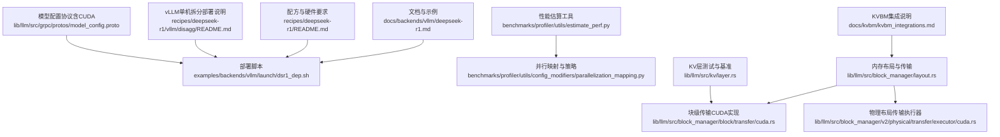
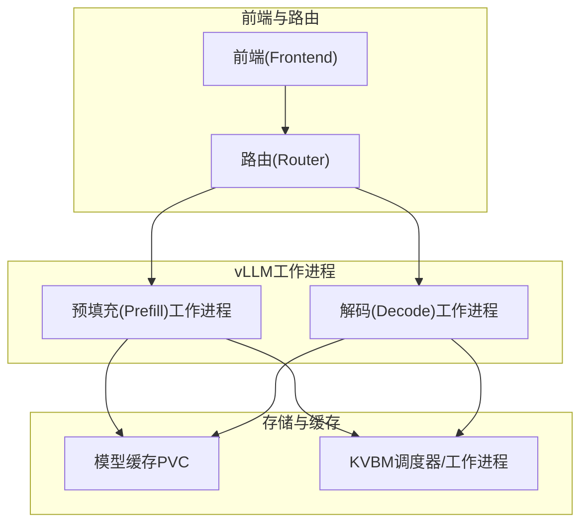
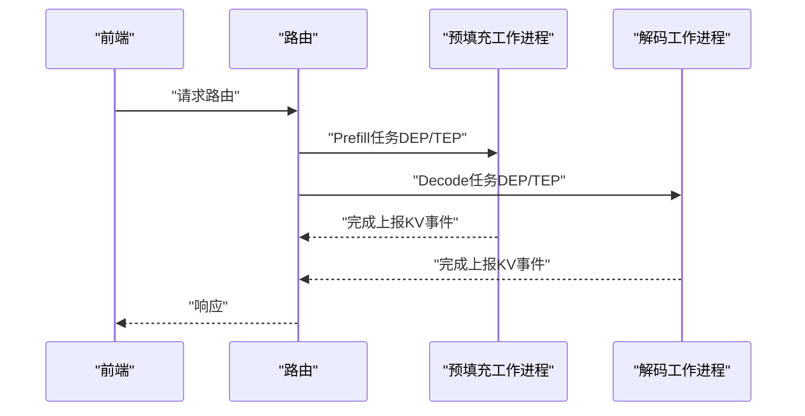
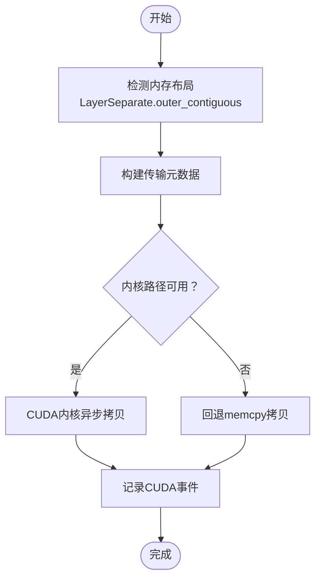
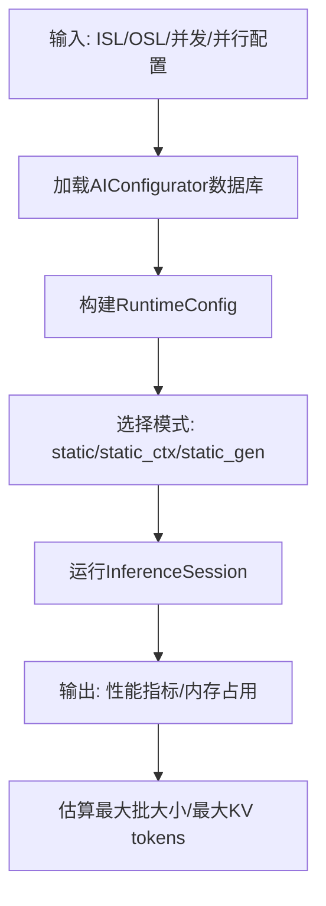
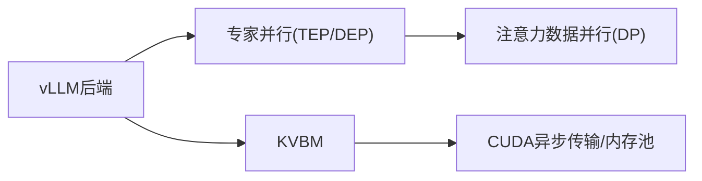

# DeepSeek R1优化技术

<cite>
**本文档引用的文件**
- [docs/backends/vllm/deepseek-r1.md](file://docs/backends/vllm/deepseek-r1.md)
- [recipes/deepseek-r1/README.md](file://recipes/deepseek-r1/README.md)
- [recipes/deepseek-r1/vllm/disagg/README.md](file://recipes/deepseek-r1/vllm/disagg/README.md)
- [examples/backends/vllm/launch/dsr1_dep.sh](file://examples/backends/vllm/launch/dsr1_dep.sh)
- [benchmarks/profiler/utils/estimate_perf.py](file://benchmarks/profiler/utils/estimate_perf.py)
- [benchmarks/profiler/utils/config_modifiers/parallelization_mapping.py](file://benchmarks/profiler/utils/config_modifiers/parallelization_mapping.py)
- [docs/kvbm/kvbm_integrations.md](file://docs/kvbm/kvbm_integrations.md)
- [lib/llm/src/block_manager/layout.rs](file://lib/llm/src/block_manager/layout.rs)
- [lib/llm/src/block_manager/block/transfer/cuda.rs](file://lib/llm/src/block_manager/block/transfer/cuda.rs)
- [lib/llm/src/block_manager/v2/physical/transfer/executor/cuda.rs](file://lib/llm/src/block_manager/v2/physical/transfer/executor/cuda.rs)
- [lib/llm/src/kv/layer.rs](file://lib/llm/src/kv/layer.rs)
- [lib/llm/src/grpc/protos/model_config.proto](file://lib/llm/src/grpc/protos/model_config.proto)
</cite>

## 目录
1. [引言](#引言)
2. [项目结构](#项目结构)
3. [核心组件](#核心组件)
4. [架构总览](#架构总览)
5. [详细组件分析](#详细组件分析)
6. [依赖关系分析](#依赖关系分析)
7. [性能考量](#性能考量)
8. [故障排查指南](#故障排查指南)
9. [结论](#结论)
10. [附录](#附录)

## 引言
本技术文档聚焦于DeepSeek R1在Dynamo平台中的专用优化方案，涵盖推理加速、内存管理与计算图优化的关键技术路径。DeepSeek R1作为参数量达671B的Mixture-of-Experts（MoE）模型，对显存占用与并行策略提出了极高要求。Dynamo通过数据并行注意力（DP）与专家并行（DEP/TEP/WideEP）相结合的方式，在多节点环境下实现高效解码与预填充（Prefill）协同，同时结合KV缓存管理（KVBM）与CUDA异步传输优化，最大化吞吐与延迟指标。

## 项目结构
围绕DeepSeek R1的优化，仓库中与之直接相关的模块主要分布在以下位置：
- 文档与示例：docs/backends/vllm/deepseek-r1.md、recipes/deepseek-r1/README.md、recipes/deepseek-r1/vllm/disagg/README.md、examples/backends/vllm/launch/dsr1_dep.sh
- 性能估算与并行映射：benchmarks/profiler/utils/estimate_perf.py、benchmarks/profiler/utils/config_modifiers/parallelization_mapping.py
- KV缓存与内存布局：docs/kvbm/kvbm_integrations.md、lib/llm/src/block_manager/layout.rs、lib/llm/src/block_manager/block/transfer/cuda.rs、lib/llm/src/block_manager/v2/physical/transfer/executor/cuda.rs、lib/llm/src/kv/layer.rs
- 模型配置与CUDA优化开关：lib/llm/src/grpc/protos/model_config.proto

**图表来源**
- [docs/backends/vllm/deepseek-r1.md](file://docs/backends/vllm/deepseek-r1.md#L6-L43)
- [recipes/deepseek-r1/README.md](file://recipes/deepseek-r1/README.md#L1-L104)
- [recipes/deepseek-r1/vllm/disagg/README.md](file://recipes/deepseek-r1/vllm/disagg/README.md#L1-L99)
- [examples/backends/vllm/launch/dsr1_dep.sh](file://examples/backends/vllm/launch/dsr1_dep.sh#L1-L120)
- [benchmarks/profiler/utils/estimate_perf.py](file://benchmarks/profiler/utils/estimate_perf.py#L1-L234)
- [benchmarks/profiler/utils/config_modifiers/parallelization_mapping.py](file://benchmarks/profiler/utils/config_modifiers/parallelization_mapping.py#L41-L130)
- [docs/kvbm/kvbm_integrations.md](file://docs/kvbm/kvbm_integrations.md#L1-L45)
- [lib/llm/src/block_manager/layout.rs](file://lib/llm/src/block_manager/layout.rs#L153-L179)
- [lib/llm/src/block_manager/block/transfer/cuda.rs](file://lib/llm/src/block_manager/block/transfer/cuda.rs#L40-L79)
- [lib/llm/src/block_manager/v2/physical/transfer/executor/cuda.rs](file://lib/llm/src/block_manager/v2/physical/transfer/executor/cuda.rs#L68-L275)
- [lib/llm/src/kv/layer.rs](file://lib/llm/src/kv/layer.rs#L1721-L1755)
- [lib/llm/src/grpc/protos/model_config.proto](file://lib/llm/src/grpc/protos/model_config.proto#L961-L999)

**章节来源**
- [docs/backends/vllm/deepseek-r1.md](file://docs/backends/vllm/deepseek-r1.md#L6-L43)
- [recipes/deepseek-r1/README.md](file://recipes/deepseek-r1/README.md#L1-L104)
- [recipes/deepseek-r1/vllm/disagg/README.md](file://recipes/deepseek-r1/vllm/disagg/README.md#L1-L99)
- [examples/backends/vllm/launch/dsr1_dep.sh](file://examples/backends/vllm/launch/dsr1_dep.sh#L1-L120)

## 核心组件
- 数据并行注意力与专家并行（DEP/TEP/WideEP）
  - vLLM通过--enable-expert-parallel启用专家并行；DEP使用注意力的数据并行（attention DP），而TP/TEP不用于注意力的DP。
  - 参考：[docs/backends/vllm/deepseek-r1.md](file://docs/backends/vllm/deepseek-r1.md#L8-L8)，[recipes/deepseek-r1/README.md](file://recipes/deepseek-r1/README.md#L101-L103)，[benchmarks/profiler/utils/config_modifiers/parallelization_mapping.py](file://benchmarks/profiler/utils/config_modifiers/parallelization_mapping.py#L76-L88)

- KV缓存管理（KVBM）
  - 通过调度器与工作进程协作，异步完成块的上载（Host/Disk→Device）与下传（Device→Host/Disk），并支持事件与度量上报。
  - 参考：[docs/kvbm/kvbm_integrations.md](file://docs/kvbm/kvbm_integrations.md#L21-L44)

- 内存布局与块传输
  - 支持按层分离的内存布局（LayerSeparate），自动检测外维连续性，确保块间无重叠且高效访问。
  - CUDA异步H2D/D2H/D2D传输，支持内核路径与回退到memcpy路径，并记录CUDA事件以跟踪完成状态。
  - 参考：[lib/llm/src/block_manager/layout.rs](file://lib/llm/src/block_manager/layout.rs#L153-L179)，[lib/llm/src/block_manager/block/transfer/cuda.rs](file://lib/llm/src/block_manager/block/transfer/cuda.rs#L40-L79)，[lib/llm/src/block_manager/v2/physical/transfer/executor/cuda.rs](file://lib/llm/src/block_manager/v2/physical/transfer/executor/cuda.rs#L68-L182)

- 性能估算与并行映射
  - 基于AIConfigurator数据库进行静态上下文与生成阶段的性能估计，支持MoE模型的TP/EP尺寸输入。
  - 并行映射类提供TP/TEP/DEP的等效规模转换与可整除性检查，辅助配置选择。
  - 参考：[benchmarks/profiler/utils/estimate_perf.py](file://benchmarks/profiler/utils/estimate_perf.py#L29-L133)，[benchmarks/profiler/utils/config_modifiers/parallelization_mapping.py](file://benchmarks/profiler/utils/config_modifiers/parallelization_mapping.py#L41-L130)

**章节来源**
- [docs/backends/vllm/deepseek-r1.md](file://docs/backends/vllm/deepseek-r1.md#L8-L8)
- [recipes/deepseek-r1/README.md](file://recipes/deepseek-r1/README.md#L101-L103)
- [benchmarks/profiler/utils/config_modifiers/parallelization_mapping.py](file://benchmarks/profiler/utils/config_modifiers/parallelization_mapping.py#L41-L130)
- [docs/kvbm/kvbm_integrations.md](file://docs/kvbm/kvbm_integrations.md#L21-L44)
- [lib/llm/src/block_manager/layout.rs](file://lib/llm/src/block_manager/layout.rs#L153-L179)
- [lib/llm/src/block_manager/block/transfer/cuda.rs](file://lib/llm/src/block_manager/block/transfer/cuda.rs#L40-L79)
- [lib/llm/src/block_manager/v2/physical/transfer/executor/cuda.rs](file://lib/llm/src/block_manager/v2/physical/transfer/executor/cuda.rs#L68-L182)
- [benchmarks/profiler/utils/estimate_perf.py](file://benchmarks/profiler/utils/estimate_perf.py#L29-L133)

## 架构总览
DeepSeek R1在Dynamo中的运行架构由前端（Frontend）、路由（Router）、vLLM工作进程（Decode/Prefill）以及KVBM组成。vLLM工作进程通过数据并行注意力与专家并行实现高吞吐解码，同时利用KVBM进行块的异步上下载，减少显存压力并提升并发。

**图表来源**
- [docs/backends/vllm/deepseek-r1.md](file://docs/backends/vllm/deepseek-r1.md#L8-L8)
- [docs/kvbm/kvbm_integrations.md](file://docs/kvbm/kvbm_integrations.md#L21-L44)
- [recipes/deepseek-r1/vllm/disagg/README.md](file://recipes/deepseek-r1/vllm/disagg/README.md#L61-L69)

## 详细组件分析

### 组件A：数据并行注意力与专家并行（DEP/TEP/WideEP）
- 设计要点
  - vLLM通过--enable-expert-parallel开启专家并行；DEP对注意力使用数据并行（attention DP），而TP/TEP不用于注意力的DP。
  - 配置映射类提供TP/TEP/DEP的等效规模与可整除性校验，避免头数或专家数与并行度不匹配导致的错误。
- 关键参数与调优
  - --data_parallel_size、--data-parallel-rank、--enable-expert-parallel、--gpu-memory-utilization
  - 参考：[examples/backends/vllm/launch/dsr1_dep.sh](file://examples/backends/vllm/launch/dsr1_dep.sh#L98-L116)，[benchmarks/profiler/utils/config_modifiers/parallelization_mapping.py](file://benchmarks/profiler/utils/config_modifiers/parallelization_mapping.py#L76-L88)

**图表来源**
- [examples/backends/vllm/launch/dsr1_dep.sh](file://examples/backends/vllm/launch/dsr1_dep.sh#L86-L116)
- [docs/backends/vllm/deepseek-r1.md](file://docs/backends/vllm/deepseek-r1.md#L8-L8)

**章节来源**
- [examples/backends/vllm/launch/dsr1_dep.sh](file://examples/backends/vllm/launch/dsr1_dep.sh#L98-L116)
- [benchmarks/profiler/utils/config_modifiers/parallelization_mapping.py](file://benchmarks/profiler/utils/config_modifiers/parallelization_mapping.py#L76-L88)

### 组件B：KV缓存管理（KVBM）与块传输
- 设计要点
  - 调度器负责块的上/下载编排与元数据构建，工作进程在前向结束时异步执行上/下载。
  - 内存布局采用按层分离（LayerSeparate），自动检测外维连续性，保证块区域不重叠。
  - CUDA传输支持内核路径与回退路径，记录CUDA事件以跟踪完成状态。
- 关键参数与调优
  - VLLM_NIXL_SIDE_CHANNEL_PORT、DYN_VLLM_KV_EVENT_PORT、VLLM_ALL2ALL_BACKEND、VLLM_USE_DEEP_GEMM、VLLM_RANDOMIZE_DP_DUMMY_INPUTS
  - 参考：[docs/kvbm/kvbm_integrations.md](file://docs/kvbm/kvbm_integrations.md#L21-L44)，[lib/llm/src/block_manager/layout.rs](file://lib/llm/src/block_manager/layout.rs#L153-L179)，[lib/llm/src/block_manager/v2/physical/transfer/executor/cuda.rs](file://lib/llm/src/block_manager/v2/physical/transfer/executor/cuda.rs#L68-L182)

**图表来源**
- [lib/llm/src/block_manager/layout.rs](file://lib/llm/src/block_manager/layout.rs#L153-L179)
- [lib/llm/src/block_manager/v2/physical/transfer/executor/cuda.rs](file://lib/llm/src/block_manager/v2/physical/transfer/executor/cuda.rs#L68-L182)

**章节来源**
- [docs/kvbm/kvbm_integrations.md](file://docs/kvbm/kvbm_integrations.md#L21-L44)
- [lib/llm/src/block_manager/layout.rs](file://lib/llm/src/block_manager/layout.rs#L153-L179)
- [lib/llm/src/block_manager/v2/physical/transfer/executor/cuda.rs](file://lib/llm/src/block_manager/v2/physical/transfer/executor/cuda.rs#L68-L182)

### 组件C：性能估算与配置建议
- 设计要点
  - 使用AIConfigurator数据库进行静态上下文与生成阶段的性能估计，支持MoE模型的TP/EP设置。
  - 提供最大批大小与最大KV token估算，辅助容量规划。
- 关键参数与调优
  - --isl、--osl、--ttft、--itl、num-gpus-per-node、max-num-gpus-per-engine
  - 参考：[benchmarks/profiler/utils/estimate_perf.py](file://benchmarks/profiler/utils/estimate_perf.py#L76-L234)，[benchmarks/profiler/utils/profiler_argparse.py](file://benchmarks/profiler/utils/profiler_argparse.py#L220-L254)

**图表来源**
- [benchmarks/profiler/utils/estimate_perf.py](file://benchmarks/profiler/utils/estimate_perf.py#L76-L234)

**章节来源**
- [benchmarks/profiler/utils/estimate_perf.py](file://benchmarks/profiler/utils/estimate_perf.py#L76-L234)
- [benchmarks/profiler/utils/profiler_argparse.py](file://benchmarks/profiler/utils/profiler_argparse.py#L220-L254)

## 依赖关系分析
- vLLM后端与并行策略
  - vLLM通过--enable-expert-parallel启用专家并行；DEP对注意力使用数据并行，TP/TEP不用于注意力的DP。
  - 参考：[docs/backends/vllm/deepseek-r1.md](file://docs/backends/vllm/deepseek-r1.md#L8-L8)，[benchmarks/profiler/utils/config_modifiers/parallelization_mapping.py](file://benchmarks/profiler/utils/config_modifiers/parallelization_mapping.py#L76-L88)

- KVBM与框架集成
  - 通过调度器与工作进程接口，影响KV缓存行为、调度与前向执行。
  - 参考：[docs/kvbm/kvbm_integrations.md](file://docs/kvbm/kvbm_integrations.md#L21-L44)

- CUDA优化与内存池
  - CUDA内存池与事件记录用于异步传输与释放阈值控制，降低碎片化与峰值内存。
  - 参考：[lib/llm/src/block_manager/v2/physical/transfer/executor/cuda.rs](file://lib/llm/src/block_manager/v2/physical/transfer/executor/cuda.rs#L211-L232)

**图表来源**
- [docs/backends/vllm/deepseek-r1.md](file://docs/backends/vllm/deepseek-r1.md#L8-L8)
- [docs/kvbm/kvbm_integrations.md](file://docs/kvbm/kvbm_integrations.md#L21-L44)
- [lib/llm/src/block_manager/v2/physical/transfer/executor/cuda.rs](file://lib/llm/src/block_manager/v2/physical/transfer/executor/cuda.rs#L211-L232)

**章节来源**
- [docs/backends/vllm/deepseek-r1.md](file://docs/backends/vllm/deepseek-r1.md#L8-L8)
- [docs/kvbm/kvbm_integrations.md](file://docs/kvbm/kvbm_integrations.md#L21-L44)
- [lib/llm/src/block_manager/v2/physical/transfer/executor/cuda.rs](file://lib/llm/src/block_manager/v2/physical/transfer/executor/cuda.rs#L211-L232)

## 性能考量
- 硬件与内存
  - DeepSeek R1需要大显存，建议使用H200 SXM或GB200 NVL72，注意NCCL错误通常指示OOM，可通过--mem-fraction-static降低占用。
  - 参考：[recipes/deepseek-r1/README.md](file://recipes/deepseek-r1/README.md#L74-L104)

- 并行策略
  - DEP/TEP/WideEP结合使用，DEP对注意力使用数据并行，TEP/DEP对专家进行切分；需确保头数与专家数可被相应并行度整除。
  - 参考：[benchmarks/profiler/utils/config_modifiers/parallelization_mapping.py](file://benchmarks/profiler/utils/config_modifiers/parallelization_mapping.py#L108-L130)

- KV缓存与传输
  - 使用LayerSeparate布局与CUDA异步传输，减少同步开销；根据并发调整缓冲区数量与释放阈值。
  - 参考：[lib/llm/src/block_manager/layout.rs](file://lib/llm/src/block_manager/layout.rs#L153-L179)，[lib/llm/src/block_manager/v2/physical/transfer/executor/cuda.rs](file://lib/llm/src/block_manager/v2/physical/transfer/executor/cuda.rs#L211-L232)

- 性能估算
  - 利用AIConfigurator进行静态上下文/生成阶段性能估计，结合最大批大小与最大KV tokens估算指导容量规划。
  - 参考：[benchmarks/profiler/utils/estimate_perf.py](file://benchmarks/profiler/utils/estimate_perf.py#L157-L234)

[本节为通用性能讨论，未直接分析具体代码文件]

## 故障排查指南
- NCCL错误
  - 多为显存不足导致，建议降低--mem-fraction-static或减少并发。
  - 参考：[recipes/deepseek-r1/README.md](file://recipes/deepseek-r1/README.md#L87-L88)

- 多节点网络
  - 需要InfiniBand/IBGDA支持，必要时参考vLLM EP文档与系统驱动配置脚本。
  - 参考：[recipes/deepseek-r1/vllm/disagg/README.md](file://recipes/deepseek-r1/vllm/disagg/README.md#L95-L96)

- KV缓存与传输异常
  - 检查块布局是否正确、地址收集是否一致、CUDA事件是否成功记录。
  - 参考：[lib/llm/src/block_manager/block/transfer/cuda.rs](file://lib/llm/src/block_manager/block/transfer/cuda.rs#L40-L79)，[lib/llm/src/block_manager/v2/physical/transfer/executor/cuda.rs](file://lib/llm/src/block_manager/v2/physical/transfer/executor/cuda.rs#L170-L181)

**章节来源**
- [recipes/deepseek-r1/README.md](file://recipes/deepseek-r1/README.md#L87-L88)
- [recipes/deepseek-r1/vllm/disagg/README.md](file://recipes/deepseek-r1/vllm/disagg/README.md#L95-L96)
- [lib/llm/src/block_manager/block/transfer/cuda.rs](file://lib/llm/src/block_manager/block/transfer/cuda.rs#L40-L79)
- [lib/llm/src/block_manager/v2/physical/transfer/executor/cuda.rs](file://lib/llm/src/block_manager/v2/physical/transfer/executor/cuda.rs#L170-L181)

## 结论
DeepSeek R1在Dynamo中的优化以“数据并行注意力 + 专家并行（DEP/TEP/WideEP）”为核心，结合KVBM异步块管理与CUDA异步传输，形成高效的解码与预填充协同体系。通过AIConfigurator进行性能估算与容量规划，并配合严格的并行映射与内存布局设计，可在多节点环境下稳定发挥模型潜力。针对不同后端（vLLM/SGLang/TRT-LLM）与硬件（H200/GB200），应依据本文档提供的参数与调优建议进行部署与迭代。

[本节为总结性内容，未直接分析具体代码文件]

## 附录
- 快速开始与测试
  - 参考：[recipes/deepseek-r1/README.md](file://recipes/deepseek-r1/README.md#L21-L65)，[docs/backends/vllm/deepseek-r1.md](file://docs/backends/vllm/deepseek-r1.md#L24-L43)

- 启动脚本参数说明
  - 参考：[examples/backends/vllm/launch/dsr1_dep.sh](file://examples/backends/vllm/launch/dsr1_dep.sh#L15-L60)

**章节来源**
- [recipes/deepseek-r1/README.md](file://recipes/deepseek-r1/README.md#L21-L65)
- [docs/backends/vllm/deepseek-r1.md](file://docs/backends/vllm/deepseek-r1.md#L24-L43)
- [examples/backends/vllm/launch/dsr1_dep.sh](file://examples/backends/vllm/launch/dsr1_dep.sh#L15-L60)