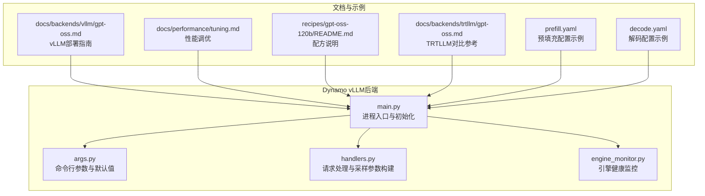
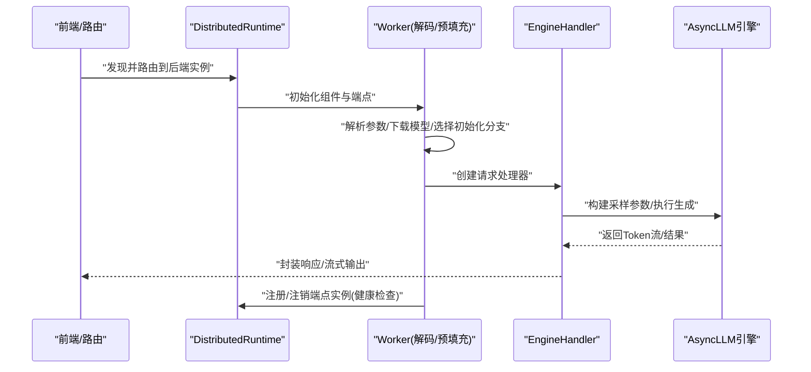
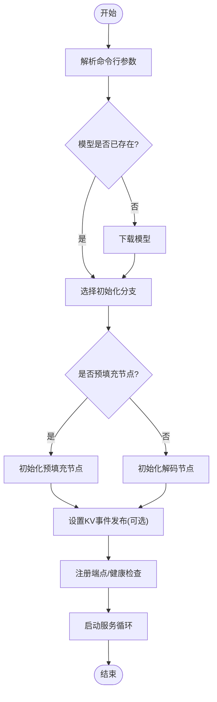
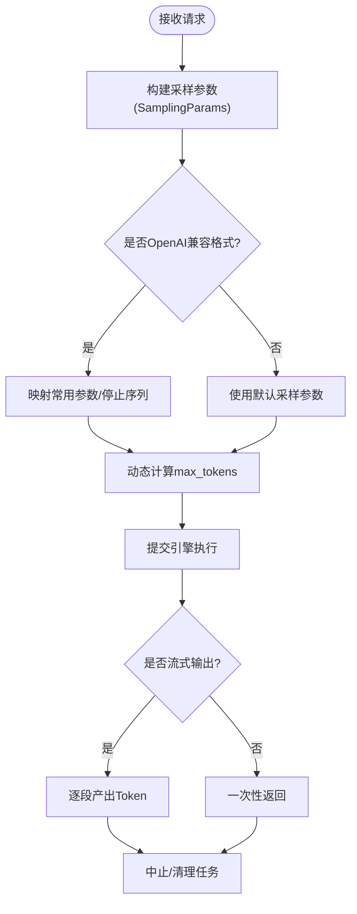
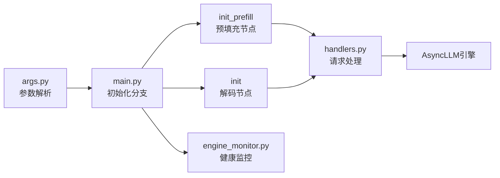

# GPT-OSS支持

<cite>
**本文引用的文件**
- [docs/backends/vllm/gpt-oss.md](file://docs/backends/vllm/gpt-oss.md)
- [components/src/dynamo/vllm/main.py](file://components/src/dynamo/vllm/main.py)
- [components/src/dynamo/vllm/args.py](file://components/src/dynamo/vllm/args.py)
- [components/src/dynamo/vllm/handlers.py](file://components/src/dynamo/vllm/handlers.py)
- [components/src/dynamo/vllm/engine_monitor.py](file://components/src/dynamo/vllm/engine_monitor.py)
- [docs/performance/tuning.md](file://docs/performance/tuning.md)
- [benchmarks/profiler/utils/config_modifiers/vllm.py](file://benchmarks/profiler/utils/config_modifiers/vllm.py)
- [docs/backends/trtllm/gpt-oss.md](file://docs/backends/trtllm/gpt-oss.md)
- [examples/backends/trtllm/engine_configs/gpt-oss-120b/prefill.yaml](file://examples/backends/trtllm/engine_configs/gpt-oss-120b/prefill.yaml)
- [examples/backends/trtllm/engine_configs/gpt-oss-120b/decode.yaml](file://examples/backends/trtllm/engine_configs/gpt-oss-120b/decode.yaml)
- [recipes/gpt-oss-120b/README.md](file://recipes/gpt-oss-120b/README.md)
- [tests/frontend/test_vllm.py](file://tests/frontend/test_vllm.py)
- [tests/utils/constants.py](file://tests/utils/constants.py)
</cite>

## 目录
1. [简介](#简介)
2. [项目结构](#项目结构)
3. [核心组件](#核心组件)
4. [架构总览](#架构总览)
5. [详细组件分析](#详细组件分析)
6. [依赖关系分析](#依赖关系分析)
7. [性能考量](#性能考量)
8. [故障排查指南](#故障排查指南)
9. [结论](#结论)
10. [附录](#附录)

## 简介
本技术文档面向在Dynamo vLLM后端中集成GPT-OSS（Open Source Software）模型的工程实践，系统阐述从模型加载、推理流程到性能优化的完整实现路径。重点覆盖以下方面：
- GPT-OSS在Dynamo vLLM中的部署与运行方式
- 特有的配置项与参数（如推理解析器、多模态、KV事件等）
- 与通用大模型在功能与参数上的差异
- 部署与使用指南（环境准备、模型下载、启动配置）
- 不同硬件环境下的性能表现与优化建议

## 项目结构
围绕GPT-OSS在Dynamo vLLM中的集成，相关代码与文档主要分布在如下位置：
- 后端实现：components/src/dynamo/vllm/*
- 使用文档：docs/backends/vllm/gpt-oss.md
- 性能调优指南：docs/performance/tuning.md
- 示例与配方：recipes/gpt-oss-120b/*
- TRTLLM对比参考：docs/backends/trtllm/gpt-oss.md 及示例引擎配置
- 基准与配置修改工具：benchmarks/profiler/utils/config_modifiers/vllm.py

图表来源
- [components/src/dynamo/vllm/main.py](file://components/src/dynamo/vllm/main.py#L1-L150)
- [components/src/dynamo/vllm/args.py](file://components/src/dynamo/vllm/args.py#L110-L467)
- [components/src/dynamo/vllm/handlers.py](file://components/src/dynamo/vllm/handlers.py#L75-L227)
- [components/src/dynamo/vllm/engine_monitor.py](file://components/src/dynamo/vllm/engine_monitor.py#L23-L82)
- [docs/backends/vllm/gpt-oss.md](file://docs/backends/vllm/gpt-oss.md#L1-L120)
- [docs/performance/tuning.md](file://docs/performance/tuning.md#L18-L149)
- [recipes/gpt-oss-120b/README.md](file://recipes/gpt-oss-120b/README.md#L1-L52)
- [docs/backends/trtllm/gpt-oss.md](file://docs/backends/trtllm/gpt-oss.md#L1-L120)
- [examples/backends/trtllm/engine_configs/gpt-oss-120b/prefill.yaml](file://examples/backends/trtllm/engine_configs/gpt-oss-120b/prefill.yaml#L1-L28)
- [examples/backends/trtllm/engine_configs/gpt-oss-120b/decode.yaml](file://examples/backends/trtllm/engine_configs/gpt-oss-120b/decode.yaml#L1-L26)

章节来源
- [components/src/dynamo/vllm/main.py](file://components/src/dynamo/vllm/main.py#L1-L150)
- [components/src/dynamo/vllm/args.py](file://components/src/dynamo/vllm/args.py#L110-L467)
- [docs/backends/vllm/gpt-oss.md](file://docs/backends/vllm/gpt-oss.md#L1-L120)

## 核心组件
- 进程入口与初始化：负责解析参数、建立分布式运行时、下载模型、选择初始化分支（解码/预填充/多模态等）、注册端点与健康检查。
- 参数解析与默认值：统一承载Dynamo与vLLM的参数，设置KV事件发布、连接器链路、推理解析器、多模态开关等。
- 请求处理器：构建采样参数、处理文本/嵌入输入、管理LoRA动态加载、处理中止与清理。
- 引擎监控：定期健康检查，异常时触发引擎关闭与运行时关停。

章节来源
- [components/src/dynamo/vllm/main.py](file://components/src/dynamo/vllm/main.py#L76-L152)
- [components/src/dynamo/vllm/args.py](file://components/src/dynamo/vllm/args.py#L30-L102)
- [components/src/dynamo/vllm/handlers.py](file://components/src/dynamo/vllm/handlers.py#L230-L376)
- [components/src/dynamo/vllm/engine_monitor.py](file://components/src/dynamo/vllm/engine_monitor.py#L23-L82)

## 架构总览
下图展示GPT-OSS在Dynamo vLLM后端中的关键交互：前端通过路由发现后端实例，后端根据配置选择工作角色（解码/预填充），并可启用推理解析器与KV事件前缀缓存。

图表来源
- [components/src/dynamo/vllm/main.py](file://components/src/dynamo/vllm/main.py#L124-L152)
- [components/src/dynamo/vllm/handlers.py](file://components/src/dynamo/vllm/handlers.py#L75-L227)
- [components/src/dynamo/vllm/engine_monitor.py](file://components/src/dynamo/vllm/engine_monitor.py#L68-L82)

## 详细组件分析

### 模型加载与初始化流程
- 参数解析：统一读取Dynamo与vLLM参数，设置连接器链路（如NIXL/LMCache/KVBM）、KV事件发布配置、推理解析器、多模态开关等。
- 模型下载：若本地路径不存在，则通过模式仓库拉取；随后进入不同初始化分支。
- 初始化分支：
  - 解码工作节点：注册解码端点、LoRA端点、睡眠/唤醒路由，启用KV事件发布（若开启）。
  - 预填充工作节点：注册预填充端点、清空KV块端点，启用KV事件发布（若开启）。
  - 多模态组件：编码器/处理器/解码器等角色按需组合。
- 注册与健康检查：将模型注册到运行时，提供健康检查负载，支持优雅停机。

图表来源
- [components/src/dynamo/vllm/main.py](file://components/src/dynamo/vllm/main.py#L124-L152)
- [components/src/dynamo/vllm/main.py](file://components/src/dynamo/vllm/main.py#L418-L528)
- [components/src/dynamo/vllm/main.py](file://components/src/dynamo/vllm/main.py#L530-L674)

章节来源
- [components/src/dynamo/vllm/main.py](file://components/src/dynamo/vllm/main.py#L76-L152)
- [components/src/dynamo/vllm/main.py](file://components/src/dynamo/vllm/main.py#L418-L528)
- [components/src/dynamo/vllm/main.py](file://components/src/dynamo/vllm/main.py#L530-L674)

### 推理流程与采样参数构建
- 文本/嵌入输入：根据是否使用vLLM分词器决定输入类型（文本或Token），并支持引导输出（结构化输出）。
- 采样参数映射：将请求中的采样与停止条件映射到vLLM的SamplingParams，支持logprobs、prompt_logprobs等输出选项。
- 动态max_tokens：当未显式提供时，基于模型最大长度与输入长度计算默认值。
- 中止与清理：监听上下文取消，向引擎发送中止请求，确保资源回收。

图表来源
- [components/src/dynamo/vllm/handlers.py](file://components/src/dynamo/vllm/handlers.py#L75-L227)
- [components/src/dynamo/vllm/handlers.py](file://components/src/dynamo/vllm/handlers.py#L341-L376)

章节来源
- [components/src/dynamo/vllm/handlers.py](file://components/src/dynamo/vllm/handlers.py#L75-L227)
- [components/src/dynamo/vllm/handlers.py](file://components/src/dynamo/vllm/handlers.py#L341-L376)

### 推理解析器与工具调用
- 推理解析器：针对GPT-OSS这类推理/工具调用模型，可在解码节点启用推理解析器以提取reasoning内容。
- 工具调用解析器：配合工具声明与多轮对话，实现函数调用与结果回传。
- 在vLLM后端中，这些解析器通过运行时配置注入，影响注册模型的运行时行为。

章节来源
- [docs/backends/vllm/gpt-oss.md](file://docs/backends/vllm/gpt-oss.md#L110-L187)
- [components/src/dynamo/vllm/main.py](file://components/src/dynamo/vllm/main.py#L396-L404)

### 多模态与分词器策略
- 多模态开关：通过参数启用多模态处理，支持编码器/处理器/解码器等角色组合。
- 分词器策略：可选择使用vLLM内置分词器，绕过Dynamo预处理器，仅暴露标准OpenAI兼容端点。

章节来源
- [components/src/dynamo/vllm/args.py](file://components/src/dynamo/vllm/args.py#L172-L281)
- [components/src/dynamo/vllm/main.py](file://components/src/dynamo/vllm/main.py#L530-L674)

### KV事件与前缀缓存
- KV事件发布：在启用前缀缓存且非解码节点时，为每个数据并行rank创建ZMQ事件发布器，订阅vLLM的KV事件。
- 事件聚合：若启用KVBM，可通过聚合器端点订阅事件，降低网络开销。
- 解码节点：默认不发布KV事件，避免重复与干扰。

章节来源
- [components/src/dynamo/vllm/main.py](file://components/src/dynamo/vllm/main.py#L212-L286)
- [components/src/dynamo/vllm/args.py](file://components/src/dynamo/vllm/args.py#L470-L506)

### 引擎健康监控
- 定期健康检查：若检测到引擎死亡，记录堆栈并触发引擎关闭与运行时关停，防止僵尸进程占用资源。
- 超时保护：在关停过程中设置超时信号，避免无限等待。

章节来源
- [components/src/dynamo/vllm/engine_monitor.py](file://components/src/dynamo/vllm/engine_monitor.py#L23-L82)

## 依赖关系分析
- 参数解析与默认值对后续初始化有强依赖：连接器链路、KV事件配置、推理解析器、多模态开关等均在此阶段确定。
- 初始化分支决定端点注册与能力：预填充节点与解码节点在端点、路由与KV事件发布上存在差异。
- 请求处理依赖采样参数构建与输入类型判断，动态max_tokens与logprobs等选项直接影响吞吐与延迟。

图表来源
- [components/src/dynamo/vllm/args.py](file://components/src/dynamo/vllm/args.py#L110-L467)
- [components/src/dynamo/vllm/main.py](file://components/src/dynamo/vllm/main.py#L124-L152)
- [components/src/dynamo/vllm/handlers.py](file://components/src/dynamo/vllm/handlers.py#L75-L227)
- [components/src/dynamo/vllm/engine_monitor.py](file://components/src/dynamo/vllm/engine_monitor.py#L23-L82)

章节来源
- [components/src/dynamo/vllm/args.py](file://components/src/dynamo/vllm/args.py#L110-L467)
- [components/src/dynamo/vllm/main.py](file://components/src/dynamo/vllm/main.py#L124-L152)
- [components/src/dynamo/vllm/handlers.py](file://components/src/dynamo/vllm/handlers.py#L75-L227)

## 性能考量
- 张量并行与专家并行：vLLM后端通过配置修改工具支持设置TP/TEP/DEP大小，结合GPU数量与NUMA拓扑进行资源分配。
- 批大小与最大令牌数：预填充偏好小批量与大max_num_token，解码偏好大批量与适中max_num_token；块大小需平衡传输效率与缓存命中率。
- 前缀缓存与KV事件：合理启用前缀缓存与事件发布，有助于提升长对话与多请求场景下的吞吐。
- 硬件与容器镜像：不同后端（vLLM/TRTLLM）在容器镜像与硬件要求上存在差异，需按文档选择合适版本。

章节来源
- [benchmarks/profiler/utils/config_modifiers/vllm.py](file://benchmarks/profiler/utils/config_modifiers/vllm.py#L154-L259)
- [docs/performance/tuning.md](file://docs/performance/tuning.md#L31-L149)
- [docs/backends/trtllm/gpt-oss.md](file://docs/backends/trtllm/gpt-oss.md#L90-L120)

## 故障排查指南
- 健康检查失败：监控模块会检测引擎状态并在异常时关停，检查日志与堆栈定位问题。
- LoRA动态加载失败：确认DYN_LORA_ENABLED已启用，URI格式正确，下载与注册过程中的异常会被回滚。
- KV事件发布异常：检查KV事件配置、端口与聚合器端点，确保预填充节点启用事件发布。
- 模型下载失败：确认模型名称与访问凭据，必要时使用共享存储或本地缓存。

章节来源
- [components/src/dynamo/vllm/engine_monitor.py](file://components/src/dynamo/vllm/engine_monitor.py#L68-L82)
- [components/src/dynamo/vllm/handlers.py](file://components/src/dynamo/vllm/handlers.py#L392-L593)
- [components/src/dynamo/vllm/main.py](file://components/src/dynamo/vllm/main.py#L212-L286)

## 结论
GPT-OSS在Dynamo vLLM后端的集成通过清晰的参数解析、灵活的初始化分支与完善的请求处理机制，实现了推理解析器、工具调用、多模态与KV事件等特性。结合性能调优指南与故障排查策略，用户可在不同硬件环境下实现稳定高效的推理服务。

## 附录

### 部署与使用指南（vLLM后端）
- 环境准备：确保具备Dynamo与vLLM运行所需的依赖与GPU驱动。
- 模型下载：若本地路径不存在，将自动通过模式仓库拉取。
- 启动配置：
  - 解码节点：指定模型、张量并行大小、推理解析器与工具调用解析器。
  - 预填充节点：启用预填充模式与相应解析器。
  - 健康检查：通过/health端点验证后端实例可用性。
- 测试请求：使用OpenAI兼容端点发送测试请求，验证推理与流式输出。

章节来源
- [docs/backends/vllm/gpt-oss.md](file://docs/backends/vllm/gpt-oss.md#L21-L108)

### GPT-OSS在不同后端的差异（vLLM vs TRTLLM）
- TRTLLM示例侧重预填充与解码的独立配置文件，包含注意力数据并行、MoE后端、CUDA图与KV缓存传输等参数。
- vLLM后端更强调推理解析器与KV事件的统一配置，适合需要推理/工具调用能力的场景。

章节来源
- [docs/backends/trtllm/gpt-oss.md](file://docs/backends/trtllm/gpt-oss.md#L90-L120)
- [examples/backends/trtllm/engine_configs/gpt-oss-120b/prefill.yaml](file://examples/backends/trtllm/engine_configs/gpt-oss-120b/prefill.yaml#L15-L27)
- [examples/backends/trtllm/engine_configs/gpt-oss-120b/decode.yaml](file://examples/backends/trtllm/engine_configs/gpt-oss-120b/decode.yaml#L15-L25)

### 测试与常量
- 测试中使用GPT-OSS-20B作为示例模型，验证推理流程与解析器行为。

章节来源
- [tests/frontend/test_vllm.py](file://tests/frontend/test_vllm.py#L21-L94)
- [tests/utils/constants.py](file://tests/utils/constants.py#L14-L20)