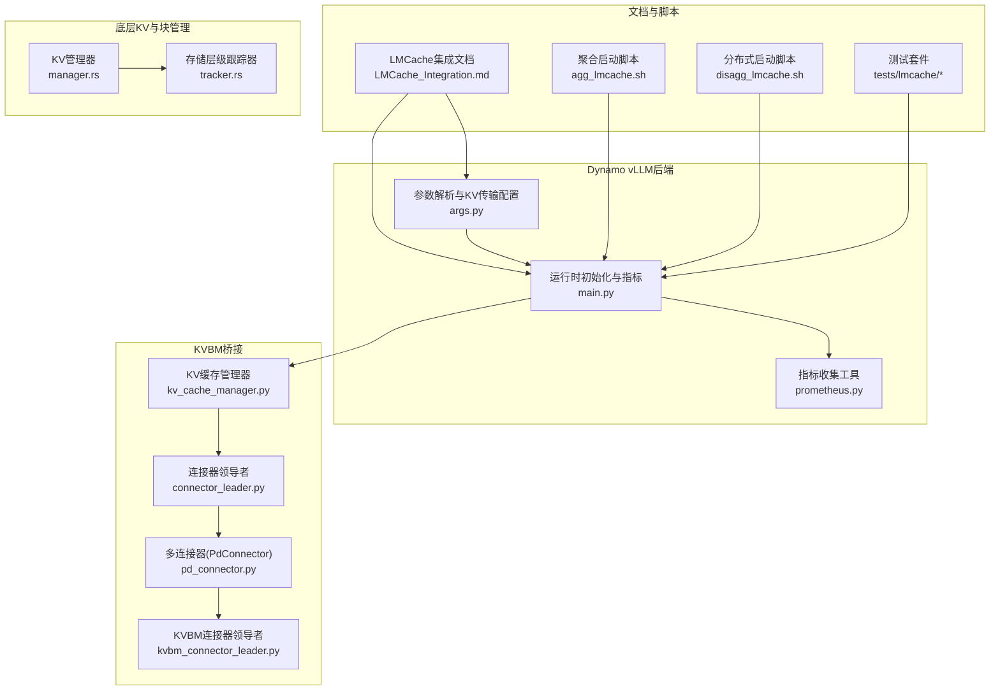
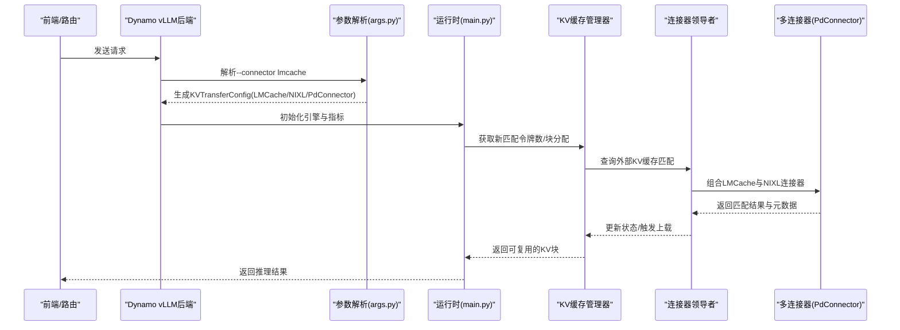
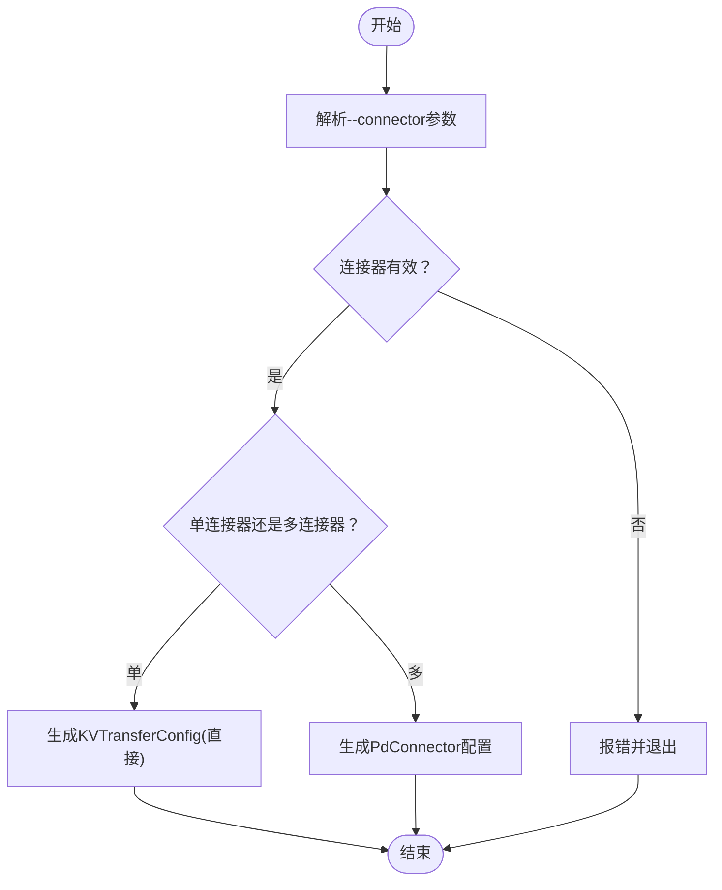
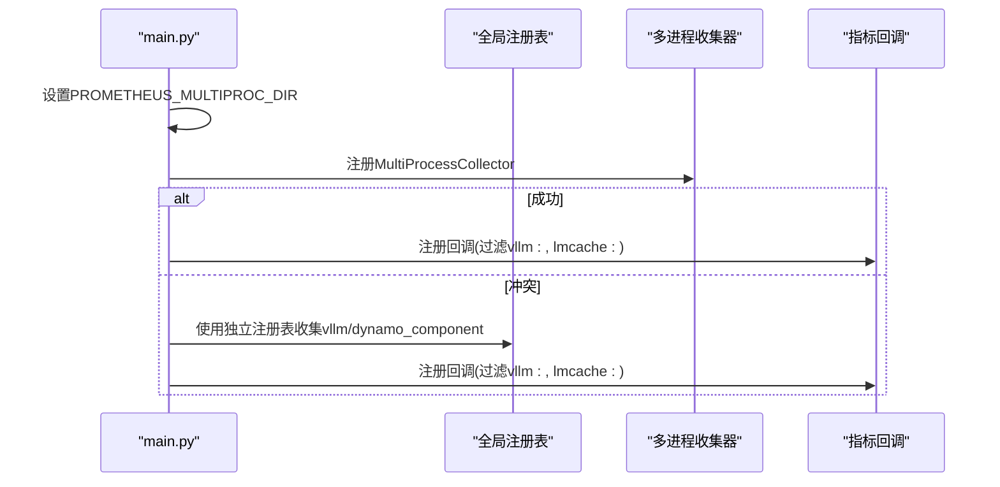
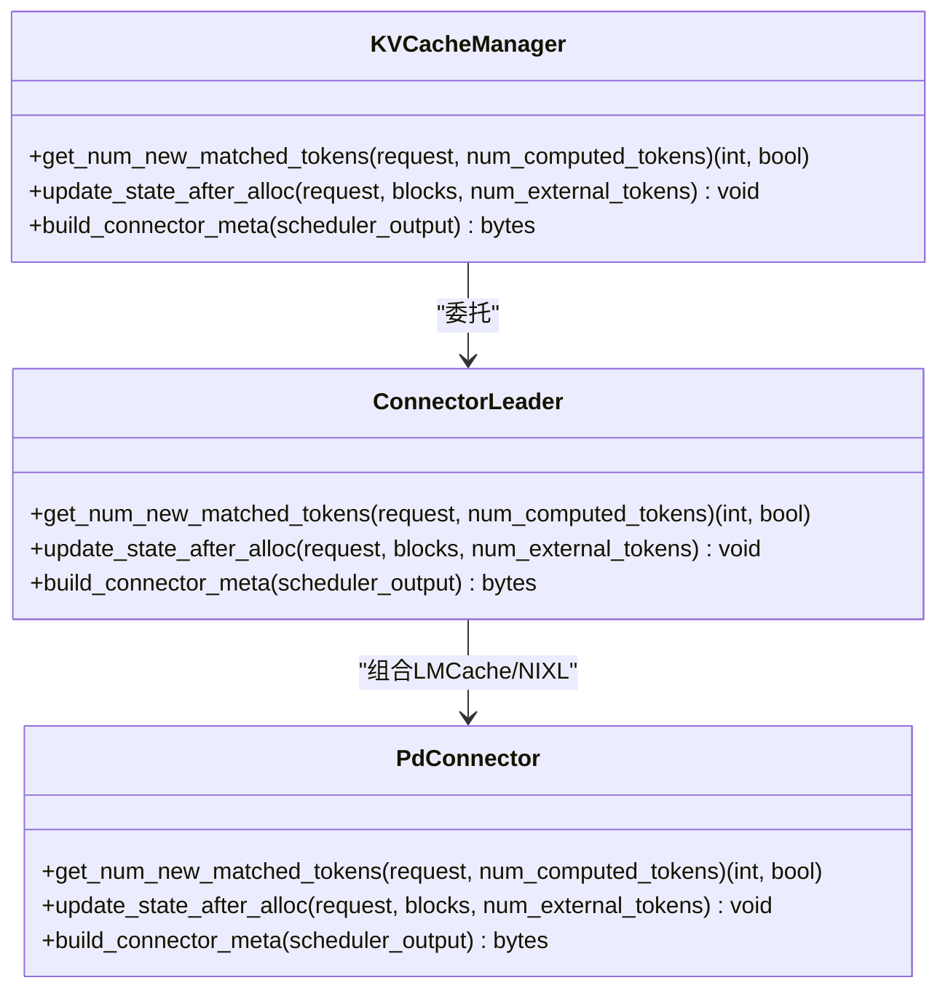
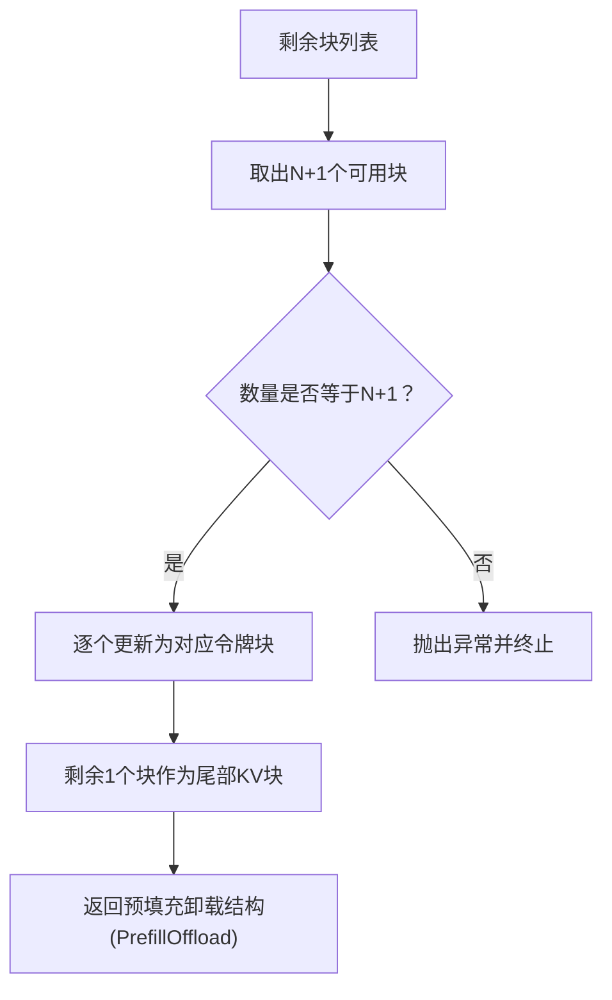
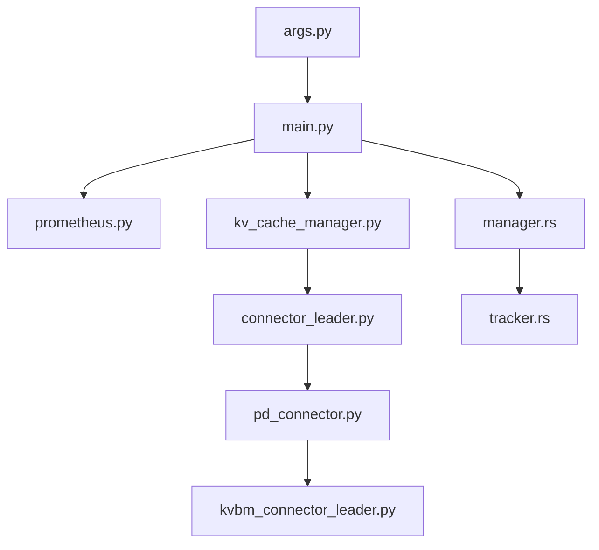

# LMCache缓存集成

<cite>
**本文引用的文件**
- [LMCache_Integration.md](file://docs/backends/vllm/LMCache_Integration.md)
- [agg_lmcache.sh](file://examples/backends/vllm/launch/agg_lmcache.sh)
- [agg_lmcache_multiproc.sh](file://examples/backends/vllm/launch/agg_lmcache_multiproc.sh)
- [disagg_lmcache.sh](file://examples/backends/vllm/launch/disagg_lmcache.sh)
- [args.py](file://components/src/dynamo/vllm/args.py)
- [main.py](file://components/src/dynamo/vllm/main.py)
- [README.md](file://tests/lmcache/README.md)
- [prometheus.py](file://components/src/dynamo/common/utils/prometheus.py)
- [kv_cache_manager.py](file://lib/bindings/kvbm/python/kvbm/vllm_integration/kv_cache_manager.py)
- [connector_leader.py](file://lib/bindings/kvbm/python/kvbm/vllm_integration/connector_leader.py)
- [kvbm_connector_leader.py](file://lib/bindings/kvbm/python/kvbm/trtllm_integration/connector/kvbm_connector_leader.py)
- [pd_connector.py](file://lib/bindings/kvbm/python/kvbm/vllm_integration/connector/pd_connector.py)
- [manager.rs](file://lib/llm/src/kv/manager.rs)
- [tracker.rs](file://lib/llm/src/block_manager/kv_consolidator/tracker.rs)
- [kv_consolidator.py](file://lib/runtime/src/config/environment_names.rs)
- [config.rs](file://lib/memory/src/nixl/config.rs)
- [config.rs](file://lib/llm/src/block_manager/v2/physical/transfer/nixl_agent/config.rs)
- [summarize_scores_dynamo.py](file://tests/lmcache/summarize_scores_dynamo.py)
</cite>

## 目录
1. [简介](#简介)
2. [项目结构](#项目结构)
3. [核心组件](#核心组件)
4. [架构总览](#架构总览)
5. [详细组件分析](#详细组件分析)
6. [依赖关系分析](#依赖关系分析)
7. [性能考量](#性能考量)
8. [故障排查指南](#故障排查指南)
9. [结论](#结论)
10. [附录](#附录)

## 简介
本文件面向在Dynamo平台中集成LMCache缓存层的工程师与运维人员，系统性阐述LMCache作为高性能KV缓存层的核心原理与实现要点，重点覆盖以下主题：
- 预填充一次性（prefill-once）与跨实例复用（reuse-everywhere）语义的实现机制
- 聚合式与分布式（解码/预填充分离）服务的配置方法，包含--connector lmcache标志与环境变量配置
- 多存储后端支持（CPU RAM、本地存储、Redis、GDS后端、InfiniStore/Mooncake）的选择策略
- 预填充工作器与解码工作器的角色分工与配置差异
- 部署脚本使用示例与最佳实践，涵盖块大小调整、内存分配优化与工作负载适配建议

## 项目结构
围绕LMCache在Dynamo中的集成，相关代码与文档主要分布在以下位置：
- 文档与说明：docs/backends/vllm/LMCache_Integration.md
- 启动脚本：examples/backends/vllm/launch/（聚合与分布式）
- 参数解析与KV传输配置：components/src/dynamo/vllm/args.py
- 运行时初始化与指标收集：components/src/dynamo/vllm/main.py
- 测试与结果对比：tests/lmcache/（部署脚本、测试脚本、结果汇总）
- KVBM桥接与连接器：lib/bindings/kvbm/python/kvbm/vllm_integration/（管理器、连接器领导者、多连接器）
- KV缓存管理与块管理：lib/llm/src/kv/manager.rs、lib/llm/src/block_manager/kv_consolidator/tracker.rs
- 环境变量与后端配置：lib/runtime/src/config/environment_names.rs、lib/memory/src/nixl/config.rs、lib/llm/src/block_manager/v2/physical/transfer/nixl_agent/config.rs

**图表来源**
- [LMCache_Integration.md](file://docs/backends/vllm/LMCache_Integration.md#L1-L208)
- [agg_lmcache.sh](file://examples/backends/vllm/launch/agg_lmcache.sh#L1-L17)
- [disagg_lmcache.sh](file://examples/backends/vllm/launch/disagg_lmcache.sh#L1-L25)
- [args.py](file://components/src/dynamo/vllm/args.py#L509-L556)
- [main.py](file://components/src/dynamo/vllm/main.py#L154-L210)
- [kv_cache_manager.py](file://lib/bindings/kvbm/python/kvbm/vllm_integration/kv_cache_manager.py#L320-L355)
- [connector_leader.py](file://lib/bindings/kvbm/python/kvbm/vllm_integration/connector_leader.py#L114-L154)
- [kvbm_connector_leader.py](file://lib/bindings/kvbm/python/kvbm/trtllm_integration/connector/kvbm_connector_leader.py#L147-L175)
- [pd_connector.py](file://lib/bindings/kvbm/python/kvbm/vllm_integration/connector/pd_connector.py#L136-L178)
- [manager.rs](file://lib/llm/src/kv/manager.rs#L73-L123)
- [tracker.rs](file://lib/llm/src/block_manager/kv_consolidator/tracker.rs#L109-L141)

**章节来源**
- [LMCache_Integration.md](file://docs/backends/vllm/LMCache_Integration.md#L1-L208)
- [agg_lmcache.sh](file://examples/backends/vllm/launch/agg_lmcache.sh#L1-L17)
- [disagg_lmcache.sh](file://examples/backends/vllm/launch/disagg_lmcache.sh#L1-L25)

## 核心组件
- 参数解析与KV传输配置（args.py）
  - 支持--connector lmcache标志，并根据连接器列表自动构建KVTransferConfig
  - 在单连接器时返回直接配置，在多连接器时通过PdConnector组合
  - 对NIXL连接器在特定条件下强制使用多进程执行器以避免GIL竞争
- 运行时初始化与指标收集（main.py）
  - 设置Prometheus多进程目录，注册回调以同时收集vLLM与LMCache指标
  - 初始化引擎、事件发布器与模型注册流程
- KVBM桥接与连接器（kv_cache_manager.py、connector_leader.py、kvbm_connector_leader.py、pd_connector.py）
  - 提供KV缓存匹配、块分配后的状态更新与元数据构建
  - PdConnector在预填充工作器中组合LMCache与NIXL连接器，实现离线加载与跨节点KV传输
- 底层KV与块管理（manager.rs、tracker.rs）
  - 块管理器负责块的复用、尾部块处理与预填充卸载
  - 存储层级跟踪器将内部介质映射到GPU/CPU磁盘等存储层级

**章节来源**
- [args.py](file://components/src/dynamo/vllm/args.py#L509-L556)
- [main.py](file://components/src/dynamo/vllm/main.py#L154-L210)
- [kv_cache_manager.py](file://lib/bindings/kvbm/python/kvbm/vllm_integration/kv_cache_manager.py#L320-L355)
- [connector_leader.py](file://lib/bindings/kvbm/python/kvbm/vllm_integration/connector_leader.py#L114-L154)
- [kvbm_connector_leader.py](file://lib/bindings/kvbm/python/kvbm/trtllm_integration/connector/kvbm_connector_leader.py#L147-L175)
- [pd_connector.py](file://lib/bindings/kvbm/python/kvbm/vllm_integration/connector/pd_connector.py#L136-L178)
- [manager.rs](file://lib/llm/src/kv/manager.rs#L73-L123)
- [tracker.rs](file://lib/llm/src/block_manager/kv_consolidator/tracker.rs#L109-L141)

## 架构总览
LMCache在Dynamo中的集成遵循“预填充一次性、跨实例复用”的设计目标，通过KV传输配置与连接器组合实现：
- 聚合模式：使用LMCacheConnectorV1进行KV的读写
- 分布式模式：预填充工作器使用PdConnector组合LMCache与NIXL；解码工作器使用NIXL进行跨节点KV传输
- 指标统一：通过Dynamo的/metrics端点同时暴露vLLM与LMCache指标

**图表来源**
- [args.py](file://components/src/dynamo/vllm/args.py#L509-L556)
- [main.py](file://components/src/dynamo/vllm/main.py#L154-L210)
- [kv_cache_manager.py](file://lib/bindings/kvbm/python/kvbm/vllm_integration/kv_cache_manager.py#L320-L355)
- [connector_leader.py](file://lib/bindings/kvbm/python/kvbm/vllm_integration/connector_leader.py#L114-L154)
- [pd_connector.py](file://lib/bindings/kvbm/python/kvbm/vllm_integration/connector/pd_connector.py#L136-L178)

## 详细组件分析

### 参数解析与KV传输配置
- 支持的连接器集合与校验
  - 支持nixl、lmcache、kvbm、null/none等选项
  - 当指定none/null时禁止与其他连接器混用
- KV传输配置生成逻辑
  - 单连接器：直接返回LMCacheConnectorV1或NixlConnector配置
  - 多连接器：通过PdConnector组合多个连接器，适用于预填充工作器场景
- 执行器后端选择
  - 当使用NIXL且TP=1时，强制设置distributed-executor-backend=mp以避免GIL竞争

**图表来源**
- [args.py](file://components/src/dynamo/vllm/args.py#L430-L467)
- [args.py](file://components/src/dynamo/vllm/args.py#L509-L556)

**章节来源**
- [args.py](file://components/src/dynamo/vllm/args.py#L26-L467)
- [args.py](file://components/src/dynamo/vllm/args.py#L509-L556)

### 运行时初始化与指标收集
- Prometheus多进程目录设置
  - 若未设置PROMETHEUS_MULTIPROC_DIR，则创建临时目录
  - 注册回调以收集vLLM与LMCache指标，支持冲突处理（重复时间序列）
- 引擎初始化与模型注册
  - 从vLLM配置提取缓存与调度信息，注册模型类型与端点
- KV事件发布器
  - 根据启用的前缀缓存与KV事件配置，为每个数据并行rank创建ZMQ发布器

**图表来源**
- [main.py](file://components/src/dynamo/vllm/main.py#L154-L210)

**章节来源**
- [main.py](file://components/src/dynamo/vllm/main.py#L154-L210)

### KVBM桥接与连接器
- KV缓存管理器接口
  - 提供获取新匹配令牌数、块分配后的状态更新与元数据构建
- 连接器领导者
  - 将请求映射到具体连接器，调用底层实现获取匹配令牌数
- 多连接器（PdConnector）
  - 在预填充工作器中组合LMCache与NIXL连接器，分别负责离线加载与跨节点传输
  - 更新状态时仅对KV离线加载连接器分配块，NIXL连接器等待解码侧拉取

**图表来源**
- [kv_cache_manager.py](file://lib/bindings/kvbm/python/kvbm/vllm_integration/kv_cache_manager.py#L320-L355)
- [connector_leader.py](file://lib/bindings/kvbm/python/kvbm/vllm_integration/connector_leader.py#L114-L154)
- [pd_connector.py](file://lib/bindings/kvbm/python/kvbm/vllm_integration/connector/pd_connector.py#L136-L178)

**章节来源**
- [kv_cache_manager.py](file://lib/bindings/kvbm/python/kvbm/vllm_integration/kv_cache_manager.py#L320-L355)
- [connector_leader.py](file://lib/bindings/kvbm/python/kvbm/vllm_integration/connector_leader.py#L114-L154)
- [kvbm_connector_leader.py](file://lib/bindings/kvbm/python/kvbm/trtllm_integration/connector/kvbm_connector_leader.py#L147-L175)
- [pd_connector.py](file://lib/bindings/kvbm/python/kvbm/vllm_integration/connector/pd_connector.py#L136-L178)

### 底层KV与块管理
- 块管理器
  - 负责从可用块集中取出块，更新尾部块，形成完整预填充块与尾部块
- 存储层级跟踪器
  - 将内部介质（GPU/CPU_TIER1/CPU_TIER2）映射到vLLM的介质字符串表示

**图表来源**
- [manager.rs](file://lib/llm/src/kv/manager.rs#L73-L123)

**章节来源**
- [manager.rs](file://lib/llm/src/kv/manager.rs#L73-L123)
- [tracker.rs](file://lib/llm/src/block_manager/kv_consolidator/tracker.rs#L109-L141)

## 依赖关系分析
- 组件耦合与职责
  - args.py与main.py紧密协作：前者决定KV传输配置，后者负责引擎初始化与指标收集
  - KVBM桥接层通过连接器领导者与多连接器实现与底层LMCache/NIXL的解耦
  - 底层块管理器与存储层级跟踪器为上层提供稳定的块与介质抽象
- 外部依赖与集成点
  - Prometheus多进程指标收集与Dynamo统一指标端点
  - NIXL侧信道主机与端口配置（由args.py确保）
  - vLLM的KV事件发布与订阅（ZMQ）

**图表来源**
- [args.py](file://components/src/dynamo/vllm/args.py#L509-L556)
- [main.py](file://components/src/dynamo/vllm/main.py#L154-L210)
- [kv_cache_manager.py](file://lib/bindings/kvbm/python/kvbm/vllm_integration/kv_cache_manager.py#L320-L355)
- [connector_leader.py](file://lib/bindings/kvbm/python/kvbm/vllm_integration/connector_leader.py#L114-L154)
- [pd_connector.py](file://lib/bindings/kvbm/python/kvbm/vllm_integration/connector/pd_connector.py#L136-L178)
- [kvbm_connector_leader.py](file://lib/bindings/kvbm/python/kvbm/trtllm_integration/connector/kvbm_connector_leader.py#L147-L175)
- [manager.rs](file://lib/llm/src/kv/manager.rs#L73-L123)
- [tracker.rs](file://lib/llm/src/block_manager/kv_consolidator/tracker.rs#L109-L141)

**章节来源**
- [args.py](file://components/src/dynamo/vllm/args.py#L509-L556)
- [main.py](file://components/src/dynamo/vllm/main.py#L154-L210)

## 性能考量
- 块大小与缓存粒度
  - 较小块（如128-256）提升细粒度复用，适合多样化内容
  - 较大块（如512-1024）提升重复内容的效率，适合长文本与高重复率场景
- 内存分配与后端选择
  - CPU RAM：本地快速缓存，适合热点复用
  - 本地存储：持久化缓存，适合冷数据与重启恢复
  - Redis：分布式共享，适合多实例共享缓存
  - GDS后端：高吞吐直通存储，适合大规模数据迁移
  - InfiniStore/Mooncake：云原生存储，适合弹性扩展
- 工作负载适配
  - RAG、多轮对话、长会话等重复上下文场景收益显著
  - 预热缓存与持续访问有助于命中率提升

[本节为通用性能指导，不直接分析具体文件]

## 故障排查指南
- LMCache日志警告：PrometheusLogger实例已存在不同元数据
  - 现象：同一进程中多次初始化LMCache连接器导致警告
  - 影响：仅为日志警告，不影响服务；但可能影响指标标签一致性
  - 缓解：设置LMCACHE_LOG_LEVEL=CRITICAL以抑制日志
  - 上游参考：vLLM issue #30996
- vLLM日志：发现用户设置了PROMETHEUS_MULTIPROC_DIR
  - 现象：若手动设置该目录，需在每次运行前清理以避免陈旧指标
  - Dynamo行为：在多进程模式下自动管理该目录，避免清理问题
- 指标冲突与重复时间序列
  - 现象：当PROMETHEUS_MULTIPROC_DIR在进程启动前已存在，可能引发重复时间序列错误
  - 处理：Dynamo自动尝试添加MultiProcessCollector；失败则使用独立注册表分别收集

**章节来源**
- [LMCache_Integration.md](file://docs/backends/vllm/LMCache_Integration.md#L163-L201)
- [main.py](file://components/src/dynamo/vllm/main.py#L169-L210)

## 结论
LMCache在Dynamo中的集成通过明确的连接器配置、统一的指标收集与分层的KV管理，实现了“预填充一次性、跨实例复用”的高性能KV缓存方案。聚合与分布式两种部署形态均可灵活启用LMCache，并结合多存储后端满足不同场景需求。配合合理的块大小与内存分配策略，可在降低TTFT与提升吞吐方面取得显著收益。

[本节为总结性内容，不直接分析具体文件]

## 附录

### 配置与部署示例
- 聚合模式启用LMCache
  - 使用脚本：examples/backends/vllm/launch/agg_lmcache.sh
  - 关键点：设置DYN_SYSTEM_PORT，unset PROMETHEUS_MULTIPROC_DIR让Dynamo内部管理
- 分布式模式启用LMCache
  - 使用脚本：examples/backends/vllm/launch/disagg_lmcache.sh
  - 关键点：解码工作器（GPU 0）使用NIXL；预填充工作器（GPU 1）使用PdConnector组合LMCache与NIXL
- 多进程模式（K8s风格）
  - 使用脚本：examples/backends/vllm/launch/agg_lmcache_multiproc.sh
  - 关键点：显式设置PROMETHEUS_MULTIPROC_DIR并清理，避免冲突

**章节来源**
- [agg_lmcache.sh](file://examples/backends/vllm/launch/agg_lmcache.sh#L1-L17)
- [disagg_lmcache.sh](file://examples/backends/vllm/launch/disagg_lmcache.sh#L1-L25)
- [agg_lmcache_multiproc.sh](file://examples/backends/vllm/launch/agg_lmcache_multiproc.sh#L1-L29)

### 环境变量与后端选择
- LMCache核心环境变量
  - LMCACHE_CHUNK_SIZE：控制块大小（建议128-256用于细粒度复用，512-1024用于重复内容）
  - LMCACHE_LOCAL_CPU：启用本地CPU缓存
  - LMCACHE_MAX_LOCAL_CPU_SIZE：限制本地CPU缓存最大值
- 存储后端选择策略
  - CPU RAM：热点复用与低延迟场景
  - 本地存储：持久化与重启恢复
  - Redis：跨实例共享缓存
  - GDS后端：高吞吐直通存储
  - InfiniStore/Mooncake：云原生弹性扩展

**章节来源**
- [LMCache_Integration.md](file://docs/backends/vllm/LMCache_Integration.md#L137-L151)

### 测试与验证
- 测试套件概览
  - 基准测试：比较无LMCache与启用LMCache的MMLU结果
  - 部署脚本：分别运行基准与LMCache测试
  - 结果汇总：对比两组结果文件，判断一致性（差异<1%视为正确）
- API格式
  - 使用Dynamo的Chat Completions API进行测试
  - 固定种子与温度以保证可重复性

**章节来源**
- [README.md](file://tests/lmcache/README.md#L1-L106)
- [summarize_scores_dynamo.py](file://tests/lmcache/summarize_scores_dynamo.py#L190-L216)