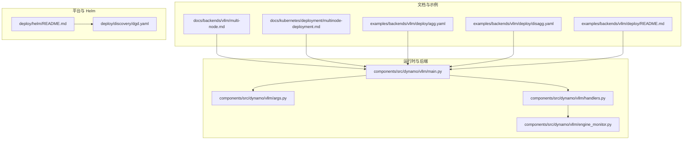
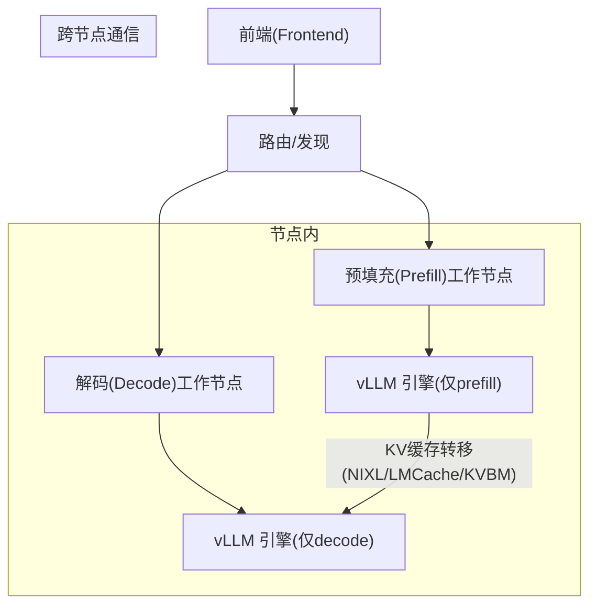
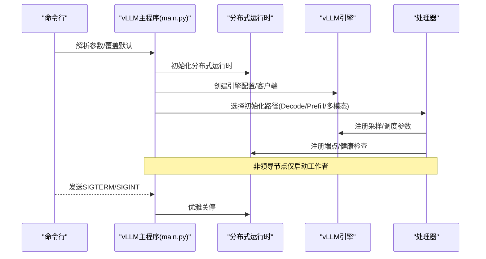
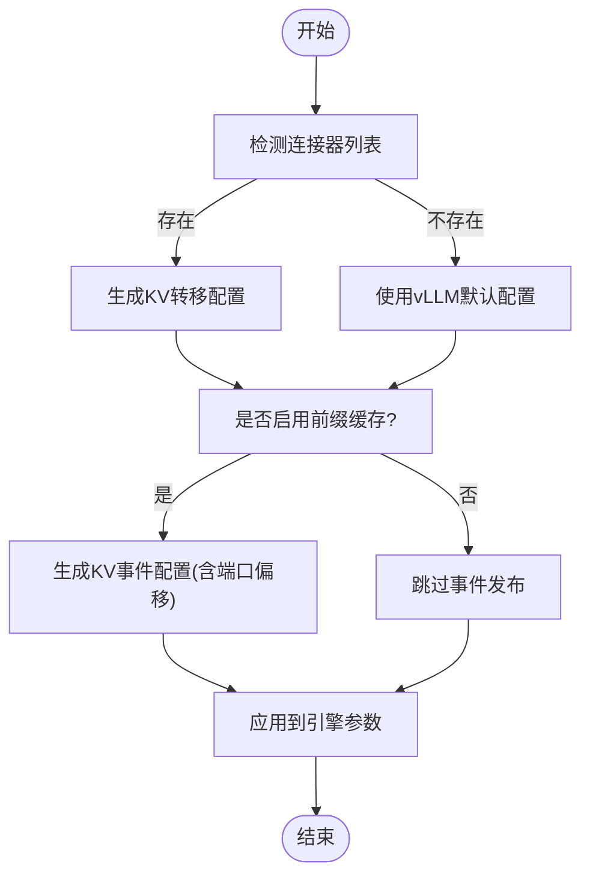
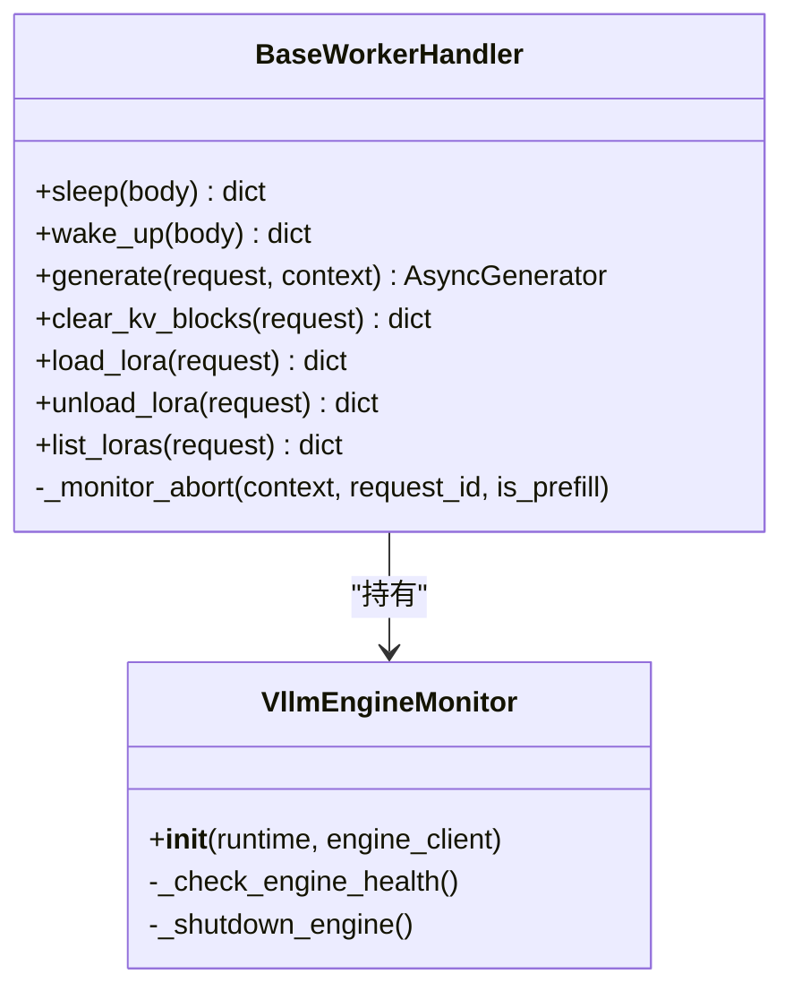
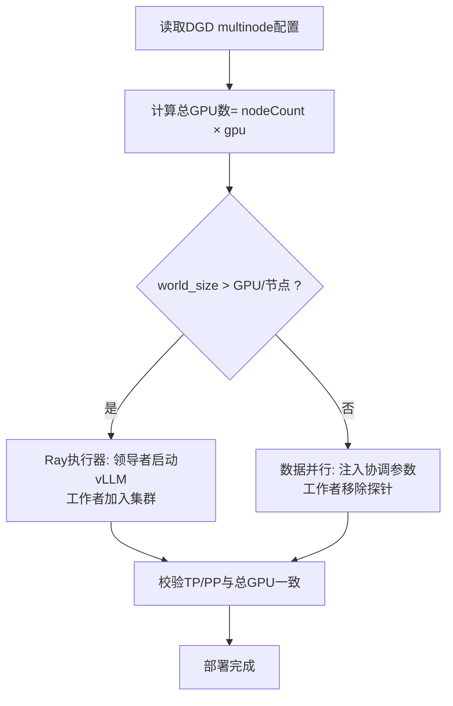
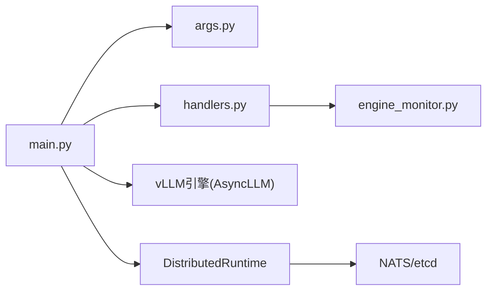

# 多节点部署架构

<cite>
**本文引用的文件**
- [docs/backends/vllm/multi-node.md](file://docs/backends/vllm/multi-node.md)
- [docs/kubernetes/deployment/multinode-deployment.md](file://docs/kubernetes/deployment/multinode-deployment.md)
- [components/src/dynamo/vllm/main.py](file://components/src/dynamo/vllm/main.py)
- [components/src/dynamo/vllm/args.py](file://components/src/dynamo/vllm/args.py)
- [components/src/dynamo/vllm/handlers.py](file://components/src/dynamo/vllm/handlers.py)
- [components/src/dynamo/vllm/engine_monitor.py](file://components/src/dynamo/vllm/engine_monitor.py)
- [deploy/helm/README.md](file://deploy/helm/README.md)
- [examples/backends/vllm/deploy/README.md](file://examples/backends/vllm/deploy/README.md)
- [examples/backends/vllm/deploy/disagg.yaml](file://examples/backends/vllm/deploy/disagg.yaml)
- [examples/backends/vllm/deploy/agg.yaml](file://examples/backends/vllm/deploy/agg.yaml)
- [deploy/discovery/dgd.yaml](file://deploy/discovery/dgd.yaml)
- [docs/performance/tuning.md](file://docs/performance/tuning.md)
</cite>

## 目录
1. [引言](#引言)
2. [项目结构](#项目结构)
3. [核心组件](#核心组件)
4. [架构总览](#架构总览)
5. [详细组件分析](#详细组件分析)
6. [依赖关系分析](#依赖关系分析)
7. [性能考量](#性能考量)
8. [故障排查指南](#故障排查指南)
9. [结论](#结论)
10. [附录](#附录)

## 引言
本文件面向多节点部署场景，系统性阐述 vLLM 在 Dynamo 平台上的分布式推理架构与实现细节，覆盖数据并行、流水线并行与张量并行的组合策略，以及多节点环境下的节点间通信、负载均衡与故障恢复机制。同时提供基于 Helm 的部署配置示例、资源分配与网络拓扑建议，并总结性能调优策略与监控最佳实践。

## 项目结构
围绕多节点部署，仓库中与 vLLM 相关的关键目录与文件如下：
- 文档与示例：docs/backends/vllm/multi-node.md、docs/kubernetes/deployment/multinode-deployment.md、examples/backends/vllm/deploy/*.yaml
- 运行时与后端：components/src/dynamo/vllm/main.py、args.py、handlers.py、engine_monitor.py
- 平台与 Helm：deploy/helm/README.md、deploy/discovery/dgd.yaml
- 性能与调优：docs/performance/tuning.md

**图示来源**
- [docs/backends/vllm/multi-node.md](file://docs/backends/vllm/multi-node.md#L1-L97)
- [docs/kubernetes/deployment/multinode-deployment.md](file://docs/kubernetes/deployment/multinode-deployment.md#L1-L309)
- [examples/backends/vllm/deploy/agg.yaml](file://examples/backends/vllm/deploy/agg.yaml#L1-L35)
- [examples/backends/vllm/deploy/disagg.yaml](file://examples/backends/vllm/deploy/disagg.yaml#L1-L56)
- [examples/backends/vllm/deploy/README.md](file://examples/backends/vllm/deploy/README.md#L1-L265)
- [components/src/dynamo/vllm/main.py](file://components/src/dynamo/vllm/main.py#L1-L1028)
- [components/src/dynamo/vllm/args.py](file://components/src/dynamo/vllm/args.py#L1-L649)
- [components/src/dynamo/vllm/handlers.py](file://components/src/dynamo/vllm/handlers.py#L1-L1540)
- [components/src/dynamo/vllm/engine_monitor.py](file://components/src/dynamo/vllm/engine_monitor.py#L1-L82)
- [deploy/helm/README.md](file://deploy/helm/README.md#L1-L23)
- [deploy/discovery/dgd.yaml](file://deploy/discovery/dgd.yaml#L1-L59)

**章节来源**
- [docs/backends/vllm/multi-node.md](file://docs/backends/vllm/multi-node.md#L1-L97)
- [docs/kubernetes/deployment/multinode-deployment.md](file://docs/kubernetes/deployment/multinode-deployment.md#L1-L309)
- [examples/backends/vllm/deploy/README.md](file://examples/backends/vllm/deploy/README.md#L1-L265)

## 核心组件
- vLLM 后端主程序：负责解析参数、初始化分布式运行时、选择工作模式（聚合/拆分）、注册端点与健康检查、处理优雅停机与非领导节点行为。
- 参数与配置：封装 vLLM AsyncEngineArgs，注入 KV 转移与事件发布配置，支持连接器链路（如 NIXL、LMCache、KVBM）。
- 请求处理器：统一生成与清理 KV 块、请求取消监控、LoRA 管理、文本/嵌入输入构建等。
- 引擎监控：定期健康检查，异常时触发引擎关闭与运行时关停，保障资源回收。
- 部署与发现：通过 Helm Chart 安装平台组件（Operator、NATS、etcd、Grove/Kai），使用 DynamoGraphDeployment 描述多节点拓扑与资源。

**章节来源**
- [components/src/dynamo/vllm/main.py](file://components/src/dynamo/vllm/main.py#L76-L152)
- [components/src/dynamo/vllm/args.py](file://components/src/dynamo/vllm/args.py#L110-L468)
- [components/src/dynamo/vllm/handlers.py](file://components/src/dynamo/vllm/handlers.py#L230-L742)
- [components/src/dynamo/vllm/engine_monitor.py](file://components/src/dynamo/vllm/engine_monitor.py#L23-L82)

## 架构总览
多节点部署采用“前端路由 + 工作节点”两级结构，支持聚合与拆分两种服务形态：
- 聚合模式：单个 decode worker 承担 prefill/decode；适合小规模或测试场景。
- 拆分模式：prefill 与 decode 分离，通过 NIXL 等连接器进行 KV 缓存转移；适合高并发与低时延场景。
- 多节点扩展：通过 DynamoGraphDeployment 的 multinode 节点计数与每节点 GPU 数限制，自动推导世界规模（TP×PP）与后端执行器（Ray 或 mp）。

**图示来源**
- [examples/backends/vllm/deploy/disagg.yaml](file://examples/backends/vllm/deploy/disagg.yaml#L1-L56)
- [examples/backends/vllm/deploy/agg.yaml](file://examples/backends/vllm/deploy/agg.yaml#L1-L35)
- [docs/backends/vllm/multi-node.md](file://docs/backends/vllm/multi-node.md#L47-L97)

## 详细组件分析

### vLLM 主流程与多节点模式
- 参数解析与默认注入：根据连接器列表与用户配置生成 KV 转移与事件发布配置，必要时强制 mp 执行器以避免 GIL 竞态。
- 初始化路径选择：根据标志位选择 prefill/decode/多模态/编码器等不同初始化流程。
- 数据并行非领导节点：非领导节点不暴露端点，仅作为 Ray/进程组的工作者参与。
- 健康与优雅停机：信号处理触发分布式运行时关停，确保在迁移限制允许下等待在途请求完成。

**图示来源**
- [components/src/dynamo/vllm/main.py](file://components/src/dynamo/vllm/main.py#L76-L152)
- [components/src/dynamo/vllm/args.py](file://components/src/dynamo/vllm/args.py#L559-L606)

**章节来源**
- [components/src/dynamo/vllm/main.py](file://components/src/dynamo/vllm/main.py#L51-L152)
- [components/src/dynamo/vllm/args.py](file://components/src/dynamo/vllm/args.py#L559-L606)

### 参数与连接器配置
- 连接器链路：支持 nixl、lmcache、kvbm 等，按顺序组合为多连接器链路；当启用 nixl 且 TP=1 时，强制 mp 执行器。
- KV 事件与转移：根据是否启用前缀缓存与连接器，自动生成 KVEventsConfig 与 KVTransferConfig，决定事件发布与 KV 转移通道。
- 端口与角色：decode worker 不发布 KV 事件；prefill worker 依据数据并行秩计算事件端口偏移。

**图示来源**
- [components/src/dynamo/vllm/args.py](file://components/src/dynamo/vllm/args.py#L470-L557)

**章节来源**
- [components/src/dynamo/vllm/args.py](file://components/src/dynamo/vllm/args.py#L470-L557)

### 请求处理与监控
- 统一生成接口：根据输入类型（文本/令牌/嵌入）构建 vLLM 输入，动态设置采样参数与最大生成长度。
- 取消与迁移：后台任务监听上下文取消，主动中止请求；支持迁移上限，平衡时延与稳定性。
- 引擎监控：周期性健康检查，异常时触发引擎关闭与运行时关停，防止僵尸进程占用资源。

**图示来源**
- [components/src/dynamo/vllm/handlers.py](file://components/src/dynamo/vllm/handlers.py#L230-L742)
- [components/src/dynamo/vllm/engine_monitor.py](file://components/src/dynamo/vllm/engine_monitor.py#L23-L82)

**章节来源**
- [components/src/dynamo/vllm/handlers.py](file://components/src/dynamo/vllm/handlers.py#L230-L742)
- [components/src/dynamo/vllm/engine_monitor.py](file://components/src/dynamo/vllm/engine_monitor.py#L23-L82)

### 多节点部署与资源分配
- 多节点声明：通过 DynamoGraphDeployment 的 multinode.nodeCount 与 per-node gpu 限制，自动计算总 GPU 数与世界规模。
- 执行器选择：当世界规模超过单节点 GPU 数时，自动采用 Ray 执行器进行多节点张量/流水线并行；否则采用数据并行模式。
- 领导者与工作者：领导者启动 vLLM，工作者加入集群但不暴露端点；数据并行工作者移除探针，领导者保留探针。

**图示来源**
- [docs/kubernetes/deployment/multinode-deployment.md](file://docs/kubernetes/deployment/multinode-deployment.md#L117-L224)

**章节来源**
- [docs/kubernetes/deployment/multinode-deployment.md](file://docs/kubernetes/deployment/multinode-deployment.md#L117-L224)

### Helm 部署与平台组件
- Helm 图表：platform 安装完整平台（Operator、NATS、etcd、Grove、Kai Scheduler），crds 安装 CRD。
- 平台安装：通过 platform Chart 完成 Operator 与基础设施部署，随后使用 DGD 描述多节点拓扑。

**章节来源**
- [deploy/helm/README.md](file://deploy/helm/README.md#L18-L23)
- [deploy/discovery/dgd.yaml](file://deploy/discovery/dgd.yaml#L1-L59)

## 依赖关系分析
- 组件耦合：main.py 依赖 args.py 提供的配置与默认值，handlers.py 依赖 engine_monitor 进行健康守护；engine_monitor 依赖 vLLM AsyncLLM。
- 外部依赖：Ray 执行器用于多节点张量/流水线并行；NATS/etcd 用于服务发现与键值存储；ZMQ 用于 KV 事件发布。
- 配置契约：DynamoGraphDeployment 的 multinode 与 per-node gpu 限制必须与 vLLM 的 --tp-size 对齐。

**图示来源**
- [components/src/dynamo/vllm/main.py](file://components/src/dynamo/vllm/main.py#L92-L94)
- [components/src/dynamo/vllm/args.py](file://components/src/dynamo/vllm/args.py#L559-L606)
- [components/src/dynamo/vllm/handlers.py](file://components/src/dynamo/vllm/handlers.py#L36-L36)
- [components/src/dynamo/vllm/engine_monitor.py](file://components/src/dynamo/vllm/engine_monitor.py#L28-L40)

**章节来源**
- [components/src/dynamo/vllm/main.py](file://components/src/dynamo/vllm/main.py#L92-L94)
- [components/src/dynamo/vllm/args.py](file://components/src/dynamo/vllm/args.py#L559-L606)
- [components/src/dynamo/vllm/handlers.py](file://components/src/dynamo/vllm/handlers.py#L36-L36)
- [components/src/dynamo/vllm/engine_monitor.py](file://components/src/dynamo/vllm/engine_monitor.py#L28-L40)

## 性能考量
- 并行映射与 GPU 数：根据模型密度与硬件特性选择 TP 内节点、PP 跨节点；通过 AIPerf 进行 ISL/OSL/并发测试，结合 SLA 评估最佳 GPU 数。
- 块大小与批大小：块大小过小导致传输碎片与较差的 P->D KV 转移性能；块过大降低前缀缓存命中率。批大小与最大 token 数影响中间张量尺寸与 KV 缓存占用。
- 拆分路由策略：在预填充优先与分块预填充之间权衡 TTFT 与 ITL；当前 vLLM 后端暂未支持分块预填充，建议通过增大本地预填充长度与合理设置最大 token 数优化。
- KV 缓存容量：高负载下，增加 TP 与减少预填充引擎数量可提升解码阶段的前缀缓存命中率与 ITL；当前实现会在请求到达时立即分配 KV 块，建议尽量减少预填充引擎数量以最大化解码阶段可用 KV。

**章节来源**
- [docs/performance/tuning.md](file://docs/performance/tuning.md#L31-L149)

## 故障排查指南
- 健康检查失败：检查模型加载日志、适当提高初始延迟；确认 Prometheus/Metrics 端口可达。
- 资源不足：GPU 未分配或内存溢出时，调整资源限制或减少批大小；核对多节点 GPU 数与 --tp-size 是否一致。
- 端口转发问题：确认正确的 Pod UUID 与服务端口；使用示例中的端口转发命令验证。
- 连接器与执行器：启用 nixl 且 TP=1 时强制 mp 执行器；检查连接器链路与端口偏移。
- 引擎崩溃：引擎监控会触发关停并记录堆栈；检查日志定位具体错误。

**章节来源**
- [examples/backends/vllm/deploy/README.md](file://examples/backends/vllm/deploy/README.md#L254-L265)
- [components/src/dynamo/vllm/engine_monitor.py](file://components/src/dynamo/vllm/engine_monitor.py#L68-L82)
- [components/src/dynamo/vllm/args.py](file://components/src/dynamo/vllm/args.py#L304-L312)

## 结论
多节点部署通过 Dynamo 的统一抽象与 vLLM 的分布式执行器，实现了灵活的张量/流水线/数据并行组合。配合 Helm 平台与 CRD 配置，可在多节点环境中高效地扩展推理能力。通过合理的并行映射、KV 缓存策略与监控告警，可获得稳定的低时延与高吞吐表现。

## 附录

### 部署配置示例（Helm 与 CRD）
- 平台安装：使用 platform Chart 安装 Operator、NATS、etcd、Grove、Kai Scheduler。
- 发现与服务：通过 DGD 描述前端与工作节点，设置镜像、资源与命令行参数。
- 示例模板：聚合与拆分部署模板分别展示单 worker 与 prefill/decode 分离的配置。

**章节来源**
- [deploy/helm/README.md](file://deploy/helm/README.md#L18-L23)
- [deploy/discovery/dgd.yaml](file://deploy/discovery/dgd.yaml#L1-L59)
- [examples/backends/vllm/deploy/README.md](file://examples/backends/vllm/deploy/README.md#L1-L265)
- [examples/backends/vllm/deploy/agg.yaml](file://examples/backends/vllm/deploy/agg.yaml#L1-L35)
- [examples/backends/vllm/deploy/disagg.yaml](file://examples/backends/vllm/deploy/disagg.yaml#L1-L56)

### 多节点网络拓扑与带宽优化
- 高速互联：推荐 InfiniBand/RoCE 或高带宽以太网，降低跨节点 KV 转移与 Ray 通信开销。
- 端口规划：确保 NATS/etcd 端口开放，KV 事件发布端口按数据并行秩偏移分配，避免冲突。
- 负载均衡：前端路由基于 KV 路由与发现机制进行请求分发，结合迁移限制提升容错。

**章节来源**
- [docs/backends/vllm/multi-node.md](file://docs/backends/vllm/multi-node.md#L10-L44)
- [docs/kubernetes/deployment/multinode-deployment.md](file://docs/kubernetes/deployment/multinode-deployment.md#L21-L49)