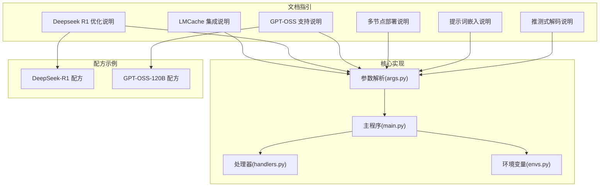
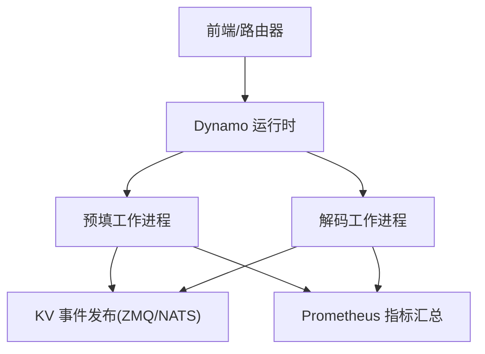
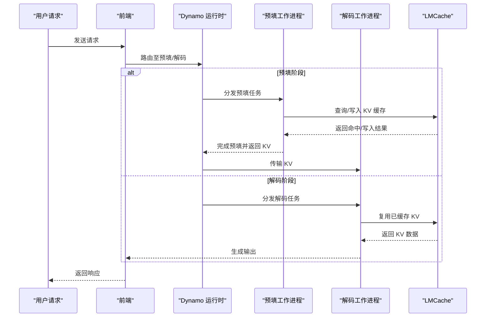
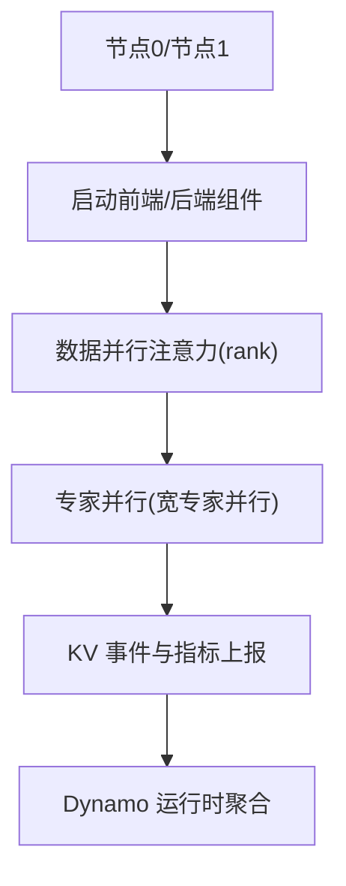
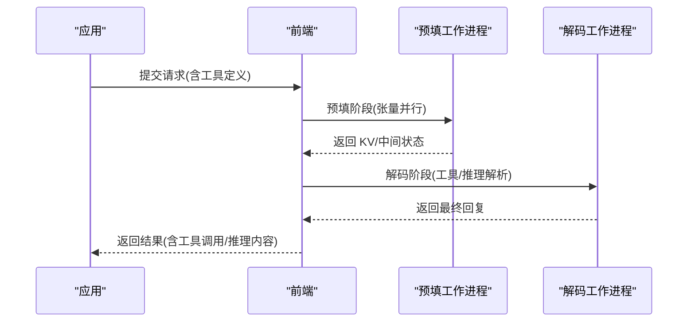
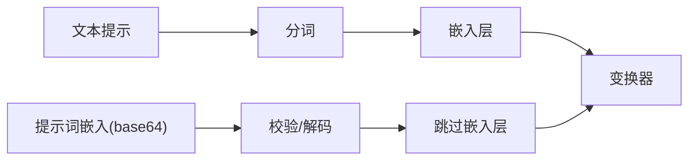
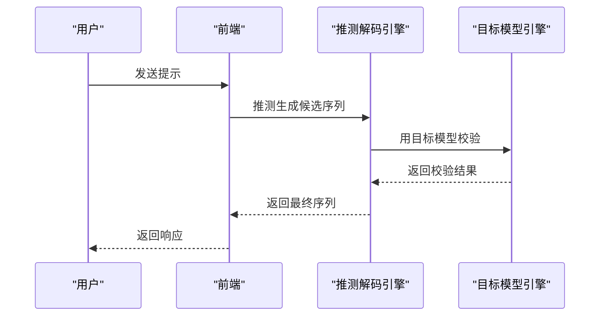
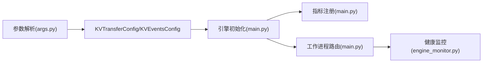

# 性能优化特性

<cite>
**本文引用的文件**
- [LMCache 集成说明](file://docs/backends/vllm/LMCache_Integration.md)
- [Deepseek R1 优化说明](file://docs/backends/vllm/deepseek-r1.md)
- [GPT-OSS 支持说明](file://docs/backends/vllm/gpt-oss.md)
- [多节点部署说明](file://docs/backends/vllm/multi-node.md)
- [提示词嵌入说明](file://docs/backends/vllm/prompt-embeddings.md)
- [推测式解码说明](file://docs/backends/vllm/speculative_decoding.md)
- [vLLM 后端主程序](file://components/src/dynamo/vllm/main.py)
- [vLLM 后端参数解析](file://components/src/dynamo/vllm/args.py)
- [vLLM 后端处理器](file://components/src/dynamo/vllm/handlers.py)
- [vLLM 环境变量配置](file://components/src/dynamo/vllm/envs.py)
- [DeepSeek-R1 配方总览](file://recipes/deepseek-r1/README.md)
- [GPT-OSS-120B 配方总览](file://recipes/gpt-oss-120b/README.md)
</cite>

## 目录
1. [简介](#简介)
2. [项目结构](#项目结构)
3. [核心组件](#核心组件)
4. [架构总览](#架构总览)
5. [详细组件分析](#详细组件分析)
6. [依赖关系分析](#依赖关系分析)
7. [性能考量](#性能考量)
8. [故障排查指南](#故障排查指南)
9. [结论](#结论)
10. [附录](#附录)

## 简介
本文件聚焦于 Dynamo vLLM 后端的性能优化特性，围绕以下主题展开：LMCache 高效 KV 缓存层的集成与配置、DeepSeek R1 的专家并行与宽专家并行（Wide EP）优化、GPT-OSS 推理与工具调用的解耦部署、多节点分布式部署（数据并行、流水线并行、张量并行）的配置方法、提示词嵌入（Prompt Embeddings）的输入替代方案及其安全优势、以及推测式解码（Speculative Decoding）在单节点上的部署与收益。文档同时提供可操作的配置示例与调优建议，帮助在不同硬件与业务场景下获得最佳吞吐与延迟表现。

## 项目结构
vLLM 后端的性能优化能力由“文档指引 + 核心实现 + 配方示例”三部分组成：
- 文档指引：位于 docs/backends/vllm 下，覆盖 LMCache、DeepSeek R1、GPT-OSS、多节点、提示词嵌入、推测式解码等专题。
- 核心实现：位于 components/src/dynamo/vllm 下，包含参数解析、引擎初始化、处理器与监控等关键逻辑。
- 配方示例：位于 recipes 下，提供 DeepSeek R1 与 GPT-OSS 的生产级部署参考。



图示来源
- [vLLM 后端主程序](file://components/src/dynamo/vllm/main.py#L1-L1028)
- [vLLM 后端参数解析](file://components/src/dynamo/vllm/args.py#L1-L649)
- [vLLM 后端处理器](file://components/src/dynamo/vllm/handlers.py#L1-L1540)
- [vLLM 环境变量配置](file://components/src/dynamo/vllm/envs.py#L1-L83)

章节来源
- [vLLM 后端主程序](file://components/src/dynamo/vllm/main.py#L1-L1028)
- [vLLM 后端参数解析](file://components/src/dynamo/vllm/args.py#L1-L649)
- [vLLM 后端处理器](file://components/src/dynamo/vllm/handlers.py#L1-L1540)
- [vLLM 环境变量配置](file://components/src/dynamo/vllm/envs.py#L1-L83)

## 核心组件
- 参数解析与 KV 转移配置：通过命令行参数与环境变量组合，动态生成 vLLM 的 KVTransferConfig 与 KVEventsConfig，支持 LMCache、NIXL、KVBM 等连接器的串联或并联。
- 引擎初始化与指标采集：统一设置 Prometheus 多进程目录、注册 vLLM 与 LMCache 指标回调，支持多进程模式下的冲突处理。
- 工作进程路由：根据是否预填/解码/多模态等角色，选择合适的 Handler 并注册端点；支持睡眠/唤醒以释放/恢复 GPU 资源。
- 引擎健康监控：定期检查 vLLM AsyncLLM 健康状态，异常时触发引擎关闭与运行时关停，避免僵尸进程占用资源。

章节来源
- [vLLM 后端参数解析](file://components/src/dynamo/vllm/args.py#L509-L649)
- [vLLM 后端主程序](file://components/src/dynamo/vllm/main.py#L154-L210)
- [vLLM 后端主程序](file://components/src/dynamo/vllm/main.py#L418-L528)
- [vLLM 后端主程序](file://components/src/dynamo/vllm/main.py#L530-L674)
- [vLLM 后端处理器](file://components/src/dynamo/vllm/handlers.py#L230-L382)
- [vLLM 后端处理器](file://components/src/dynamo/vllm/handlers.py#L275-L336)
- [vLLM 后端处理器](file://components/src/dynamo/vllm/handlers.py#L371-L377)
- [vLLM 后端处理器](file://components/src/dynamo/vllm/handlers.py#L743-L806)
- [vLLM 后端主程序](file://components/src/dynamo/vllm/engine_monitor.py#L1-L82)

## 架构总览
vLLM 后端在 Dynamo 中采用“前端路由 + 组件化工作进程”的分布式架构。根据部署模式（聚合/解耦）、连接器（NIXL/LMCache/KVBM）与任务类型（预填/解码/多模态），系统自动装配 KV 转移与事件发布配置，并通过 Prometheus 汇总 vLLM 与外部组件的指标。



图示来源
- [vLLM 后端主程序](file://components/src/dynamo/vllm/main.py#L212-L286)
- [vLLM 后端参数解析](file://components/src/dynamo/vllm/args.py#L509-L556)

## 详细组件分析

### LMCache 集成与 KV 缓存优化
- 核心思想：通过“一次预填、全局复用”的策略，将重复文本的 KV 缓存持久化到 CPU/磁盘/分布式缓存中，显著降低 TTFT 并缓解显存压力。
- 支持平台：当前仅 x86 架构；ARM64 不支持。
- 部署模式：
  - 聚合模式：使用 LMCacheConnectorV1，KV 角色为读写。
  - 解耦模式：预填/解码分别部署，预填侧使用 MultiConnector（LMCache+NIXL）实现跨节点 KV 传输与本地缓存复用。
- 关键配置点：
  - 通过 --connector lmcache 启用；可通过环境变量定制分块大小、最大本地 CPU 缓存等。
  - 在多节点/解耦场景下，KVTransferConfig 自动装配 PdConnector 与 NIXL 连接器。
- 指标与可观测性：当设置 DYN_SYSTEM_PORT 时，LMCache 指标会与 vLLM/Dynamo 指标一起暴露在 /metrics。
- 故障排查：
  - vLLM v0.12.0 存在 PrometheusLogger 单例冲突告警，属于日志级别问题，不影响服务；可通过设置日志级别抑制。
  - vLLM v1 使用 prometheus_client.multiprocess 时，若用户设置了 PROMETHEUS_MULTIPROC_DIR，需在每次启动前清理目录，否则会出现过期指标。



图示来源
- [LMCache 集成说明](file://docs/backends/vllm/LMCache_Integration.md#L58-L123)
- [vLLM 后端参数解析](file://components/src/dynamo/vllm/args.py#L509-L556)
- [vLLM 后端主程序](file://components/src/dynamo/vllm/main.py#L418-L528)

章节来源
- [LMCache 集成说明](file://docs/backends/vllm/LMCache_Integration.md#L1-L208)
- [vLLM 后端参数解析](file://components/src/dynamo/vllm/args.py#L509-L556)
- [vLLM 后端主程序](file://components/src/dynamo/vllm/main.py#L154-L210)

### DeepSeek R1 优化：专家并行与宽专家并行（Wide EP）
- 技术要点：
  - 数据并行注意力（DP）+ 宽专家并行（Wide EP）：每个数据并行注意力秩是一个独立的 Dynamo 组件，各自发出 KV 事件与指标。
  - vLLM 控制专家并行：通过 --enable-expert-parallel 开启。
- 部署示例：
  - 双节点、每节点 8 卡、总 DP=16 的配置，可在两节点上分别启动脚本完成部署与验证。
- 生产建议：
  - 大模型（671B MoE）对显存要求极高，建议使用 FP8 量化；多节点需高带宽网络（InfiniBand/RoCE）。
  - 若出现 NCCL 错误，通常为 OOM 导致，应适当降低静态内存比例。



图示来源
- [Deepseek R1 优化说明](file://docs/backends/vllm/deepseek-r1.md#L6-L43)
- [DeepSeek-R1 配方总览](file://recipes/deepseek-r1/README.md#L1-L104)

章节来源
- [Deepseek R1 优化说明](file://docs/backends/vllm/deepseek-r1.md#L1-L43)
- [DeepSeek-R1 配方总览](file://recipes/deepseek-r1/README.md#L1-L104)

### GPT-OSS 支持：解耦预填/解码与工具调用
- 部署形态：单 H100 节点 8 卡，1 个预填工作进程（4 卡，张量并行）+ 1 个解码工作进程（4 卡，优化 token 生成吞吐）。
- 工具调用与推理解析：通过 --dyn-reasoning-parser 与 --dyn-tool-call-parser 启用推理与工具调用解析。
- 请求流程：OpenAI 兼容 API -> 前端 -> 预填/解码 -> 输出；支持多轮对话与工具链协作。
- 注意事项：GPT-OSS 是推理模型，具备工具调用能力，确保工作进程以正确解析器启动。



图示来源
- [GPT-OSS 支持说明](file://docs/backends/vllm/gpt-oss.md#L6-L108)
- [GPT-OSS 支持说明](file://docs/backends/vllm/gpt-oss.md#L109-L287)

章节来源
- [GPT-OSS 支持说明](file://docs/backends/vllm/gpt-oss.md#L1-L287)

### 多节点部署：数据并行、流水线并行与张量并行
- 基础要求：多节点 GPU、节点间高速网络、开放 NATS/ETCD 端口。
- 部署模式：
  - 聚合模式：多节点横向扩展，每个节点部署 vLLM 工作进程。
  - 解耦模式：预填/解码分别部署在不同节点，优化资源利用。
- 关键步骤：在主节点启动 NATS/ETCD；各节点设置 HEAD_NODE_IP 与服务端点；按节点分别启动前端与工作进程。
- 并行策略：
  - 数据并行（DP）：同一模型的不同副本，通过 Dynamo 的发现与路由实现负载均衡。
  - 流水线并行（PP）：在 DeepSeek R1 的 Wide EP 场景中体现。
  - 张量并行（TP）：在 GPT-OSS 的预填/解码工作进程中启用。

```mermaid
graph TB
subgraph "节点1"
N1_FE["前端/入口"]
N1_PW["预填工作进程(张量并行)"]
end
subgraph "节点2"
N2_FE["前端/入口"]
N2_DW["解码工作进程(张量并行)"]
end
N1_FE < --> N2_FE
N1_PW < --> N2_DW
```

图示来源
- [多节点部署说明](file://docs/backends/vllm/multi-node.md#L1-L97)

章节来源
- [多节点部署说明](file://docs/backends/vllm/multi-node.md#L1-L97)

### 提示词嵌入（Prompt Embeddings）：隐私与性能双优
- 工作原理：前端对明文提示进行分词；若使用提示词嵌入，则跳过分词，直接校验并解码 base64 的 PyTorch 张量，绕过嵌入层进入变换器。
- 架构路径：文本提示 -> 分词 → 嵌入层 → 变换器；提示词嵌入 -> 校验 → 跳过嵌入层 → 变换器。
- 配置要点：
  - 启用 --enable-prompt-embeds；NATS 默认已配置足够载荷上限。
  - 请求体中提供 prompt_embeds 字段（base64 编码的 PyTorch 张量），格式与尺寸有严格限制。
- 优势：减少敏感信息在服务端暴露风险，提升吞吐（跳过嵌入层与分词）。



图示来源
- [提示词嵌入说明](file://docs/backends/vllm/prompt-embeddings.md#L11-L62)
- [vLLM 后端处理器](file://components/src/dynamo/vllm/handlers.py#L743-L806)

章节来源
- [提示词嵌入说明](file://docs/backends/vllm/prompt-embeddings.md#L1-L255)
- [vLLM 后端处理器](file://components/src/dynamo/vllm/handlers.py#L743-L806)

### 推测式解码（Speculative Decoding）：单节点加速
- 适用模型：Meta-Llama-3.1-8B-Instruct（小参数模型，单卡即可）。
- 部署方式：聚合模式，使用 Eagle3 推测解码，在单节点上显著提升吞吐。
- 验证方法：发送简单聊天请求，观察输出与指标变化。



图示来源
- [推测式解码说明](file://docs/backends/vllm/speculative_decoding.md#L17-L121)

章节来源
- [推测式解码说明](file://docs/backends/vllm/speculative_decoding.md#L1-L121)

## 依赖关系分析
- 参数解析与 KV 转移：
  - --connector 列表决定 KVTransferConfig 的连接器顺序与组合（LMCache/NIXL/KVBM）。
  - --kv-transfer-config 与 --connector 互斥，用户自定义优先。
- 引擎初始化与指标：
  - Prometheus 多进程目录未设置时，自动创建临时目录；若用户设置则需注意清理。
  - 注册 vLLM 与 LMCache 指标回调，支持冲突场景下的双注册策略。
- 工作进程路由：
  - 预填/解码/多模态等角色通过组件名与端点名区分；非主节点（数据并行秩>0）不提供服务端点。
- 健康监控：
  - 定期检查 vLLM AsyncLLM 健康，失败时执行引擎关闭与运行时关停。



图示来源
- [vLLM 后端参数解析](file://components/src/dynamo/vllm/args.py#L509-L649)
- [vLLM 后端主程序](file://components/src/dynamo/vllm/main.py#L154-L210)
- [vLLM 后端主程序](file://components/src/dynamo/vllm/main.py#L530-L674)
- [vLLM 后端主程序](file://components/src/dynamo/vllm/engine_monitor.py#L1-L82)

章节来源
- [vLLM 后端参数解析](file://components/src/dynamo/vllm/args.py#L509-L649)
- [vLLM 后端主程序](file://components/src/dynamo/vllm/main.py#L154-L210)
- [vLLM 后端主程序](file://components/src/dynamo/vllm/main.py#L530-L674)
- [vLLM 后端主程序](file://components/src/dynamo/vllm/engine_monitor.py#L1-L82)

## 性能考量
- 显存与吞吐平衡
  - LMCache：通过 KV 缓存复用降低 TTFT 与显存峰值，适合重复提示/长会话场景；chunk 大小与本地缓存上限需结合业务特征调优。
  - GPT-OSS：预填/解码解耦，预填侧张量并行优化吞吐，解码侧专注 token 生成；工具/推理解析器需匹配模型能力。
- 并行策略
  - DeepSeek R1：Wide EP + DP 实现高效 MoE 推理；多节点需高带宽网络，NCCL 错误多为 OOM，需降低静态内存比例。
  - 多节点：NATS/ETCD 通信开销与网络拓扑影响整体延迟；建议使用 InfiniBand 或 RoCE。
- 输入优化
  - 提示词嵌入：跳过分词与嵌入层，减少敏感信息暴露，适合高安全要求场景；需满足张量形状与大小约束。
- 解码加速
  - 推测式解码：小模型单卡即可部署，显著提升吞吐；大模型可考虑其他加速手段（如 FP8/量化）。
- 指标与可观测性
  - Prometheus 多进程模式下，注意清理 PROMETHEUS_MULTIPROC_DIR；LMCache 指标与 vLLM/Dynamo 指标统一暴露，便于联合分析。

## 故障排查指南
- LMCache 日志告警（vLLM v0.12.0）
  - 现象：PrometheusLogger 单例元数据冲突告警（日志级别）。
  - 影响：不影响服务；可通过设置日志级别抑制。
  - 上游链接：vLLM issue #30996。
- vLLM 多进程指标目录警告
  - 现象：用户设置 PROMETHEUS_MULTIPROC_DIR 且未清理导致过期指标。
  - 处理：在容器/Shell 环境中避免导出该变量，或在每次启动前清理目录。
- DeepSeek R1 NCCL 错误
  - 现象：多为 OOM 导致。
  - 处理：降低 --mem-fraction-static；确认网络与存储类配置。
- 提示词嵌入错误
  - 常见错误：未启用 --enable-prompt-embeds、base64 编码错误、张量大小/形状不匹配、格式非 PyTorch。
  - 处理：确保开启标志、使用 torch.save 序列化、核对形状与 dtype。

章节来源
- [LMCache 集成说明](file://docs/backends/vllm/LMCache_Integration.md#L163-L201)
- [DeepSeek-R1 配方总览](file://recipes/deepseek-r1/README.md#L84-L89)
- [提示词嵌入说明](file://docs/backends/vllm/prompt-embeddings.md#L183-L193)

## 结论
Dynamo vLLM 后端通过 LMCache、解耦预填/解码、提示词嵌入与推测式解码等手段，实现了从 KV 缓存复用到输入路径优化再到并行策略的全栈性能增强。配合 DeepSeek R1 的 Wide EP 与 GPT-OSS 的工具/推理解析，可在多节点环境下实现高吞吐、低延迟与高安全性的推理服务。建议在实际部署中结合业务场景与硬件条件，针对性地调整 KV 缓存策略、并行规模与输入优化方案，并持续通过 Prometheus 指标进行观测与迭代。

## 附录
- 快速配置清单
  - 启用 LMCache：--connector lmcache；设置 LMCACHE_* 环境变量（如分块大小、本地缓存上限）。
  - 启用提示词嵌入：--enable-prompt-embeds；确保 NATS 最大载荷满足需求。
  - 启用推测式解码：单节点部署，使用 Eagle3；小模型（如 Llama-3.1-8B）即可。
  - DeepSeek R1：--enable-expert-parallel；多节点部署需高带宽网络与正确的存储类配置。
  - GPT-OSS：预填/解码解耦，分别设置张量并行与推理/工具解析器。
- 参考文档
  - [LMCache 集成说明](file://docs/backends/vllm/LMCache_Integration.md#L1-L208)
  - [Deepseek R1 优化说明](file://docs/backends/vllm/deepseek-r1.md#L1-L43)
  - [GPT-OSS 支持说明](file://docs/backends/vllm/gpt-oss.md#L1-L287)
  - [多节点部署说明](file://docs/backends/vllm/multi-node.md#L1-L97)
  - [提示词嵌入说明](file://docs/backends/vllm/prompt-embeddings.md#L1-L255)
  - [推测式解码说明](file://docs/backends/vllm/speculative_decoding.md#L1-L121)