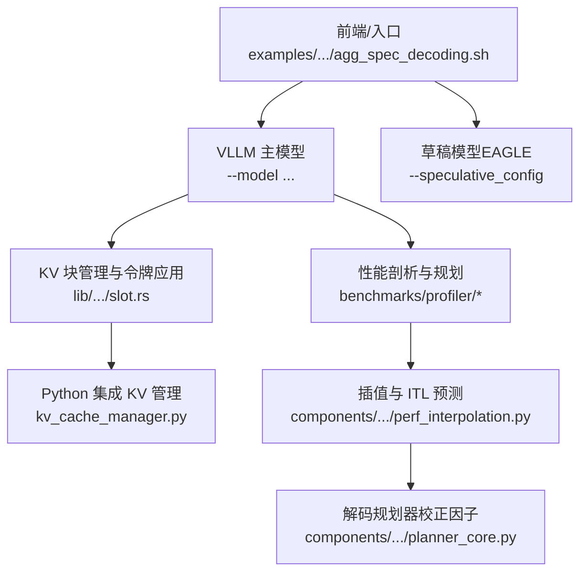
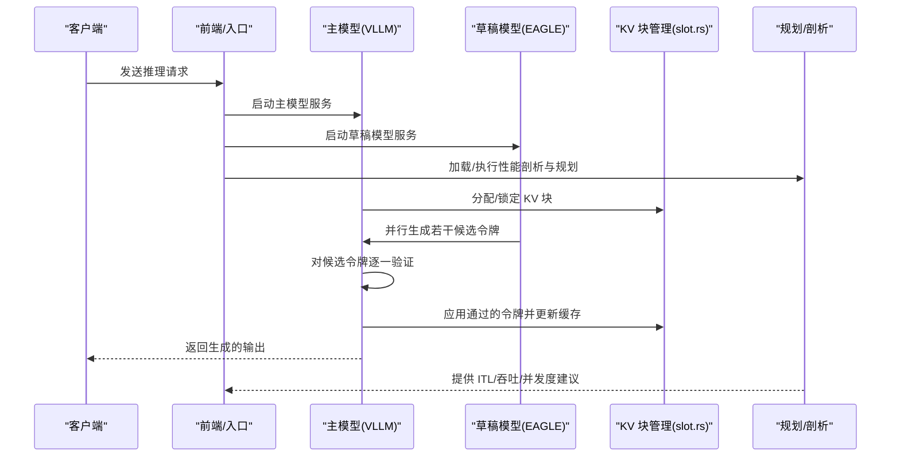
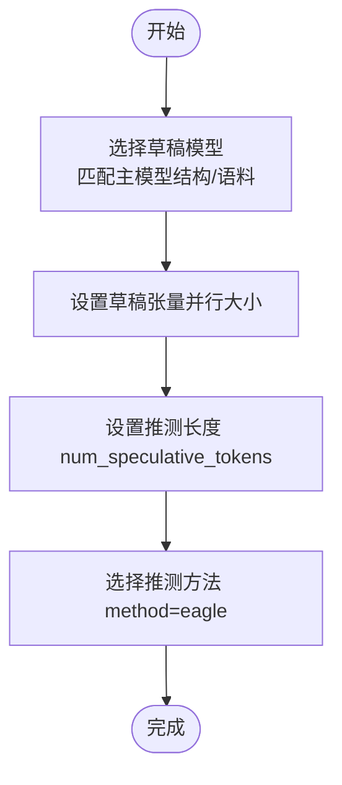
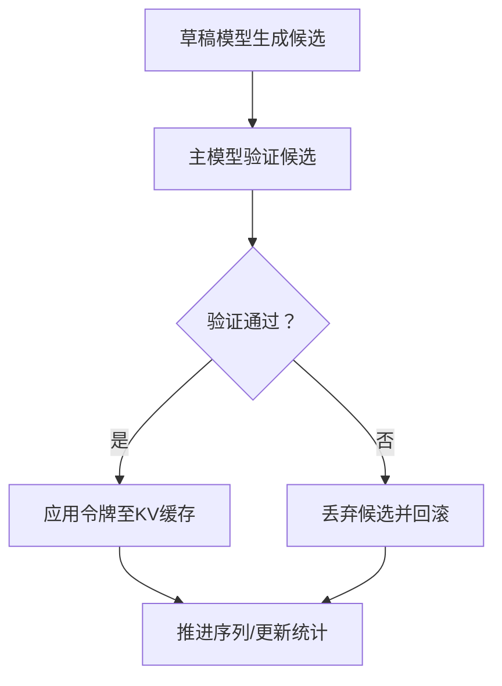
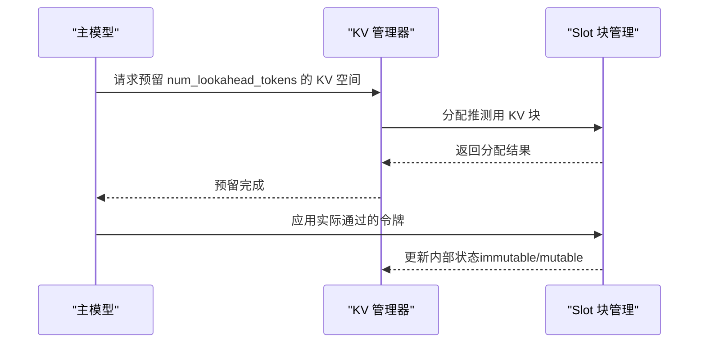
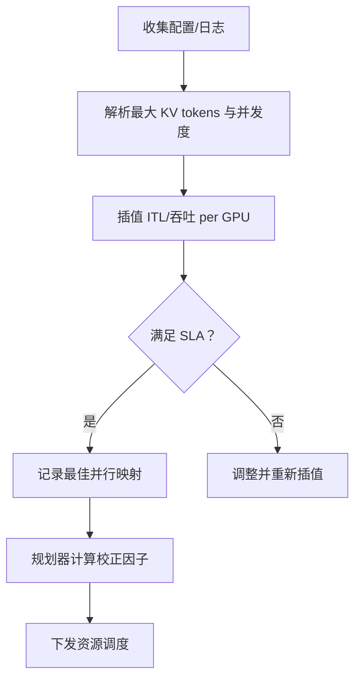
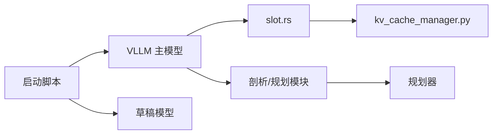

# 推测式解码

<cite>
**本文引用的文件**
- [docs/backends/vllm/speculative_decoding.md](file://docs/backends/vllm/speculative_decoding.md)
- [fern/pages/backends/vllm/speculative-decoding.md](file://fern/pages/backends/vllm/speculative-decoding.md)
- [examples/backends/vllm/launch/agg_spec_decoding.sh](file://examples/backends/vllm/launch/agg_spec_decoding.sh)
- [lib/bindings/kvbm/src/block_manager/vllm/slot.rs](file://lib/bindings/kvbm/src/block_manager/vllm/slot.rs)
- [lib/bindings/kvbm/python/kvbm/vllm_integration/kv_cache_manager.py](file://lib/bindings/kvbm/python/kvbm/vllm_integration/kv_cache_manager.py)
- [lib/llm/src/mocker/scheduler.rs](file://lib/llm/src/mocker/scheduler.rs)
- [benchmarks/profiler/utils/profile_decode.py](file://benchmarks/profiler/utils/profile_decode.py)
- [benchmarks/profiler/profile_sla.py](file://benchmarks/profiler/profile_sla.py)
- [components/src/dynamo/planner/utils/perf_interpolation.py](file://components/src/dynamo/planner/utils/perf_interpolation.py)
- [components/src/dynamo/planner/utils/planner_core.py](file://components/src/dynamo/planner/utils/planner_core.py)
- [examples/backends/trtllm/performance_sweeps/scripts/gen_yaml.py](file://examples/backends/trtllm/performance_sweeps/scripts/gen_yaml.py)
</cite>

## 目录
1. [引言](#引言)
2. [项目结构](#项目结构)
3. [核心组件](#核心组件)
4. [架构总览](#架构总览)
5. [详细组件分析](#详细组件分析)
6. [依赖关系分析](#依赖关系分析)
7. [性能考量](#性能考量)
8. [故障排查指南](#故障排查指南)
9. [结论](#结论)
10. [附录](#附录)

## 引言
本技术文档围绕“推测式解码（Speculative Decoding）”展开，系统阐述其工作原理、算法实现与工程落地方式。推测式解码通过引入一个轻量级的草稿模型（Draft Model），在主模型之外并行预测多个候选令牌，并由主模型对这些候选进行快速验证，仅将验证通过的令牌提交为主模型的输出，从而显著降低主模型的解码计算负担，提升整体推理吞吐与时延指标。

本仓库中，推测式解码在 VLLM 后端已形成可复用的部署与运行示例，并在 KV 缓存管理、块分配与令牌应用等底层实现层面提供了稳健的工程保障；同时，规划器与性能剖析工具链支持对解码阶段的 ITL、并发度与 KV 使用率进行建模与优化。

## 项目结构
与推测式解码直接相关的核心位置如下：
- 文档与示例：位于 docs/backends/vllm/speculative_decoding.md、fern/pages/backends/vllm/speculative-decoding.md 以及 examples/backends/vllm/launch/agg_spec_decoding.sh
- KV 缓存与块管理：lib/bindings/kvbm/src/block_manager/vllm/slot.rs 及其 Python 集成 kv_cache_manager.py
- 性能剖析与规划：benchmarks/profiler 下的 profile_sla.py、profile_decode.py 与 components/planner 下的 perf_interpolation.py、planner_core.py
- TRTLLM 示例中的推测式配置注入：examples/backends/trtllm/performance_sweeps/scripts/gen_yaml.py

图表来源
- [examples/backends/vllm/launch/agg_spec_decoding.sh](file://examples/backends/vllm/launch/agg_spec_decoding.sh#L18-L29)
- [lib/bindings/kvbm/src/block_manager/vllm/slot.rs](file://lib/bindings/kvbm/src/block_manager/vllm/slot.rs#L1500-L1582)
- [lib/bindings/kvbm/python/kvbm/vllm_integration/kv_cache_manager.py](file://lib/bindings/kvbm/python/kvbm/vllm_integration/kv_cache_manager.py#L139-L153)
- [benchmarks/profiler/profile_sla.py](file://benchmarks/profiler/profile_sla.py#L403-L670)
- [components/src/dynamo/planner/utils/perf_interpolation.py](file://components/src/dynamo/planner/utils/perf_interpolation.py#L285-L308)
- [components/src/dynamo/planner/utils/planner_core.py](file://components/src/dynamo/planner/utils/planner_core.py#L711-L731)

章节来源
- [docs/backends/vllm/speculative_decoding.md](file://docs/backends/vllm/speculative_decoding.md#L17-L121)
- [fern/pages/backends/vllm/speculative-decoding.md](file://fern/pages/backends/vllm/speculative-decoding.md#L1-L109)
- [examples/backends/vllm/launch/agg_spec_decoding.sh](file://examples/backends/vllm/launch/agg_spec_decoding.sh#L1-L29)

## 核心组件
- 草稿模型（Draft Model）
  - 在 VLLM 中以 --speculative_config 指定，包含草稿模型名称、草稿张量并行大小、推测长度与方法（如 eagle）。示例脚本展示了 EAGLE3 的使用方式。
- 主模型（Target Model）
  - 承担最终验证与输出生成，通常为更大更慢的模型，负责对草稿模型的候选令牌进行逐个或批量验证。
- KV 块管理与令牌应用
  - slot.rs 提供了针对推测式解码的块分配、令牌应用与状态管理能力，支持“超额分配但按实际使用计费”的机制，确保缓存一致性与资源回收。
- KV 缓存集成
  - kv_cache_manager.py 在 Python 层面暴露 num_lookahead_tokens 参数，用于向草稿模型（如 Eagle）预留推测令牌的 KV 缓存空间。
- 规划与性能剖析
  - profile_sla.py 与 profile_decode.py 提供解码阶段的 ITL 插值与并发度扫描；perf_interpolation.py 与 planner_core.py 则基于插值结果计算 ITL 与校正因子，指导解码资源调度。

章节来源
- [examples/backends/vllm/launch/agg_spec_decoding.sh](file://examples/backends/vllm/launch/agg_spec_decoding.sh#L22-L27)
- [lib/bindings/kvbm/src/block_manager/vllm/slot.rs](file://lib/bindings/kvbm/src/block_manager/vllm/slot.rs#L1500-L1582)
- [lib/bindings/kvbm/python/kvbm/vllm_integration/kv_cache_manager.py](file://lib/bindings/kvbm/python/kvbm/vllm_integration/kv_cache_manager.py#L139-L153)
- [benchmarks/profiler/profile_sla.py](file://benchmarks/profiler/profile_sla.py#L403-L670)
- [components/src/dynamo/planner/utils/perf_interpolation.py](file://components/src/dynamo/planner/utils/perf_interpolation.py#L285-L308)
- [components/src/dynamo/planner/utils/planner_core.py](file://components/src/dynamo/planner/utils/planner_core.py#L711-L731)

## 架构总览
推测式解码的端到端流程如下：

图表来源
- [examples/backends/vllm/launch/agg_spec_decoding.sh](file://examples/backends/vllm/launch/agg_spec_decoding.sh#L11-L29)
- [lib/bindings/kvbm/src/block_manager/vllm/slot.rs](file://lib/bindings/kvbm/src/block_manager/vllm/slot.rs#L1500-L1582)
- [benchmarks/profiler/profile_sla.py](file://benchmarks/profiler/profile_sla.py#L403-L670)

## 详细组件分析

### 组件A：草稿模型与推测长度
- 草稿模型选择策略
  - 优先选择与主模型在结构与语料上相近的小模型，以提高候选令牌的准确性；同时考虑张量并行规模与显存占用，避免草稿侧成为瓶颈。
  - 在示例脚本中，草稿模型通过 --speculative_config 指定，包含模型名、draft_tensor_parallel_size、num_speculative_tokens 与 method。
- 推测长度设置
  - num_speculative_tokens 决定每次迭代从草稿模型获取的候选数量；过小会降低收益，过大则增加验证开销与错误回滚成本。
- 方法选择
  - method 字段用于标识具体推测方法（如 eagle），决定草稿模型的推理与验证流程。

图表来源
- [examples/backends/vllm/launch/agg_spec_decoding.sh](file://examples/backends/vllm/launch/agg_spec_decoding.sh#L22-L27)

章节来源
- [examples/backends/vllm/launch/agg_spec_decoding.sh](file://examples/backends/vllm/launch/agg_spec_decoding.sh#L18-L29)

### 组件B：令牌生成的并行处理与验证机制
- 并行生成
  - 草稿模型在主模型之外并行生成多个候选令牌，减少主模型等待时间。
- 验证与应用
  - 主模型对候选令牌进行验证，仅将通过的令牌写入 KV 缓存并推进序列；未通过的候选会被丢弃，避免无效计算。
- KV 块管理
  - slot.rs 支持超额分配推测令牌的 KV 块，按实际使用的令牌数进行状态更新与回收，保证缓存一致性与资源利用率。

图表来源
- [lib/bindings/kvbm/src/block_manager/vllm/slot.rs](file://lib/bindings/kvbm/src/block_manager/vllm/slot.rs#L1500-L1582)

章节来源
- [lib/bindings/kvbm/src/block_manager/vllm/slot.rs](file://lib/bindings/kvbm/src/block_manager/vllm/slot.rs#L1500-L1582)

### 组件C：KV 缓存与推测令牌预留
- num_lookahead_tokens
  - Python 层的 kv_cache_manager.py 明确指出，num_lookahead_tokens 用于为带有 KV 缓存的推测式提议器（如 eagle）预留推测令牌的 KV 空间。
- 运行期行为
  - 在推测解码场景下，先完成预填充（prefill），随后为推测生成预留 KV 块容量，再按实际通过的令牌数进行应用与回收。

图表来源
- [lib/bindings/kvbm/python/kvbm/vllm_integration/kv_cache_manager.py](file://lib/bindings/kvbm/python/kvbm/vllm_integration/kv_cache_manager.py#L139-L153)
- [lib/bindings/kvbm/src/block_manager/vllm/slot.rs](file://lib/bindings/kvbm/src/block_manager/vllm/slot.rs#L1500-L1582)

章节来源
- [lib/bindings/kvbm/python/kvbm/vllm_integration/kv_cache_manager.py](file://lib/bindings/kvbm/python/kvbm/vllm_integration/kv_cache_manager.py#L139-L153)
- [lib/bindings/kvbm/src/block_manager/vllm/slot.rs](file://lib/bindings/kvbm/src/block_manager/vllm/slot.rs#L1500-L1582)

### 组件D：性能剖析与规划
- 解码 ITL 插值
  - profile_decode.py 与 profile_sla.py 提供对解码阶段 ITL 与吞吐的插值与并发度扫描，结合注意力并行度与最大 KV tokens，确定最优并行映射。
- 规划器校正因子
  - perf_interpolation.py 基于插值结果估计 ITL 与吞吐；planner_core.py 计算解码 ITL 的校正因子，用于动态调整解码资源分配。

图表来源
- [benchmarks/profiler/utils/profile_decode.py](file://benchmarks/profiler/utils/profile_decode.py#L40-L57)
- [benchmarks/profiler/profile_sla.py](file://benchmarks/profiler/profile_sla.py#L403-L670)
- [components/src/dynamo/planner/utils/perf_interpolation.py](file://components/src/dynamo/planner/utils/perf_interpolation.py#L285-L308)
- [components/src/dynamo/planner/utils/planner_core.py](file://components/src/dynamo/planner/utils/planner_core.py#L711-L731)

章节来源
- [benchmarks/profiler/utils/profile_decode.py](file://benchmarks/profiler/utils/profile_decode.py#L40-L57)
- [benchmarks/profiler/profile_sla.py](file://benchmarks/profiler/profile_sla.py#L403-L670)
- [components/src/dynamo/planner/utils/perf_interpolation.py](file://components/src/dynamo/planner/utils/perf_interpolation.py#L285-L308)
- [components/src/dynamo/planner/utils/planner_core.py](file://components/src/dynamo/planner/utils/planner_core.py#L711-L731)

## 依赖关系分析
- 组件耦合
  - 前端/入口脚本与 VLLM 主模型耦合，通过命令行参数传递推测式配置。
  - 主模型与草稿模型之间通过 KV 缓存与块管理协同，slot.rs 是关键的底层依赖。
  - 规划与剖析模块独立于推理引擎，但依赖于性能日志与配置，为资源调度提供数据支撑。
- 外部依赖
  - TRTLLM 示例中也存在推测式配置注入逻辑，表明推测式解码在多后端具备通用性与可移植性。

图表来源
- [examples/backends/vllm/launch/agg_spec_decoding.sh](file://examples/backends/vllm/launch/agg_spec_decoding.sh#L11-L29)
- [lib/bindings/kvbm/src/block_manager/vllm/slot.rs](file://lib/bindings/kvbm/src/block_manager/vllm/slot.rs#L1500-L1582)
- [lib/bindings/kvbm/python/kvbm/vllm_integration/kv_cache_manager.py](file://lib/bindings/kvbm/python/kvbm/vllm_integration/kv_cache_manager.py#L139-L153)
- [benchmarks/profiler/profile_sla.py](file://benchmarks/profiler/profile_sla.py#L403-L670)

章节来源
- [examples/backends/trtllm/performance_sweeps/scripts/gen_yaml.py](file://examples/backends/trtllm/performance_sweeps/scripts/gen_yaml.py#L270-L274)

## 性能考量
- 草稿模型性能要求
  - 小而快：草稿模型应具备较低延迟与较小显存占用，避免成为瓶颈；张量并行规模需与硬件资源匹配。
- 推测长度设置
  - 建议从较小值（如 1~3）起步，结合 ITL 与吞吐插值逐步增大，直至收益边际递减或验证失败增多导致回滚成本上升。
- 验证阈值与容错
  - 验证失败的候选应快速丢弃并回滚，避免 KV 状态污染；可通过校正因子动态调整并发度与并行映射。
- 资源与并发度
  - 结合 profile_sla.py 与 perf_interpolation.py 的插值结果，选择满足 ITL 目标的并行映射与并发度，最大化每 GPU 吞吐。

[本节为通用性能讨论，不直接分析具体文件]

## 故障排查指南
- KV 块超额分配与回收
  - slot.rs 的测试覆盖了“超额分配但仅按实际使用计费”的场景，若出现缓存未释放或状态异常，检查是否正确调用了应用与回收流程。
- 缓存命中与互斥操作
  - 测试用例验证了缓存命中后继续进行解码令牌应用的互斥与一致性，若出现状态不一致，检查缓存哈希与序列匹配逻辑。
- 规划与剖析偏差
  - 若规划器校正因子持续偏大或偏小，检查插值数据质量与并发度扫描粒度，必要时扩大插值范围或调整注意力并行度。

章节来源
- [lib/bindings/kvbm/src/block_manager/vllm/slot.rs](file://lib/bindings/kvbm/src/block_manager/vllm/slot.rs#L1500-L1582)
- [lib/llm/src/mocker/scheduler.rs](file://lib/llm/src/mocker/scheduler.rs#L426-L461)
- [components/src/dynamo/planner/utils/planner_core.py](file://components/src/dynamo/planner/utils/planner_core.py#L711-L731)

## 结论
推测式解码通过“草稿模型并行预测 + 主模型串行验证”的组合，在不牺牲生成质量的前提下显著降低主模型的解码压力，提升整体吞吐与响应效率。本仓库提供了从部署示例、KV 块管理到性能剖析与规划的完整闭环，便于在不同模型与场景下进行工程化落地与持续优化。

[本节为总结性内容，不直接分析具体文件]

## 附录
- 快速参考
  - 部署示例：参见 docs/backends/vllm/speculative_decoding.md 与 fern/pages/backends/vllm/speculative-decoding.md
  - 启动脚本：参见 examples/backends/vllm/launch/agg_spec_decoding.sh
  - KV 缓存预留：参见 lib/bindings/kvbm/python/kvbm/vllm_integration/kv_cache_manager.py
  - 性能剖析与规划：参见 benchmarks/profiler/profile_sla.py、benchmarks/profiler/utils/profile_decode.py 与 components/planner/utils/*

[本节为补充信息，不直接分析具体文件]