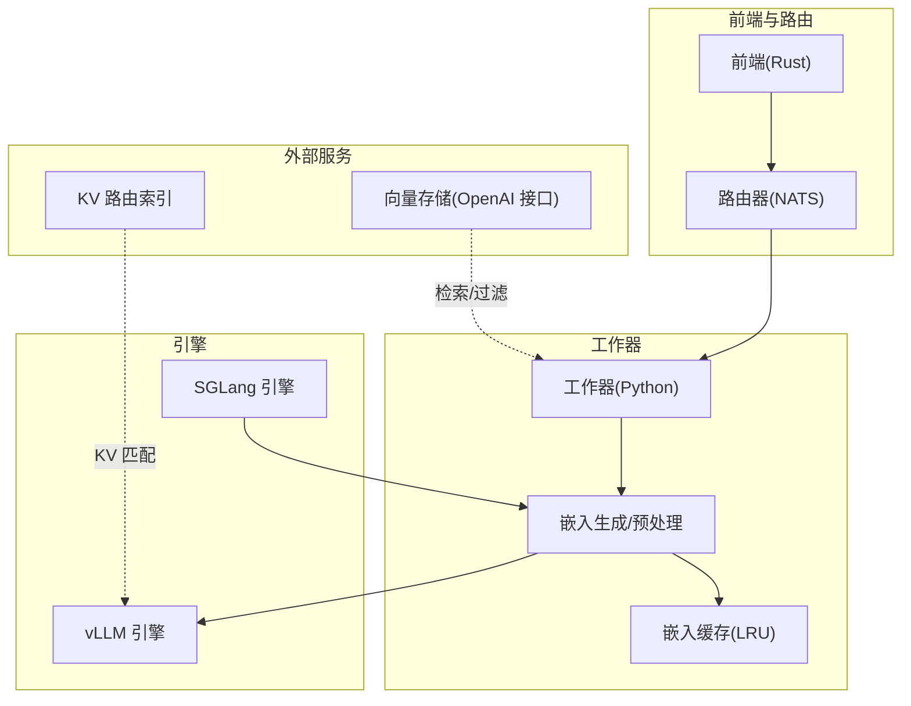
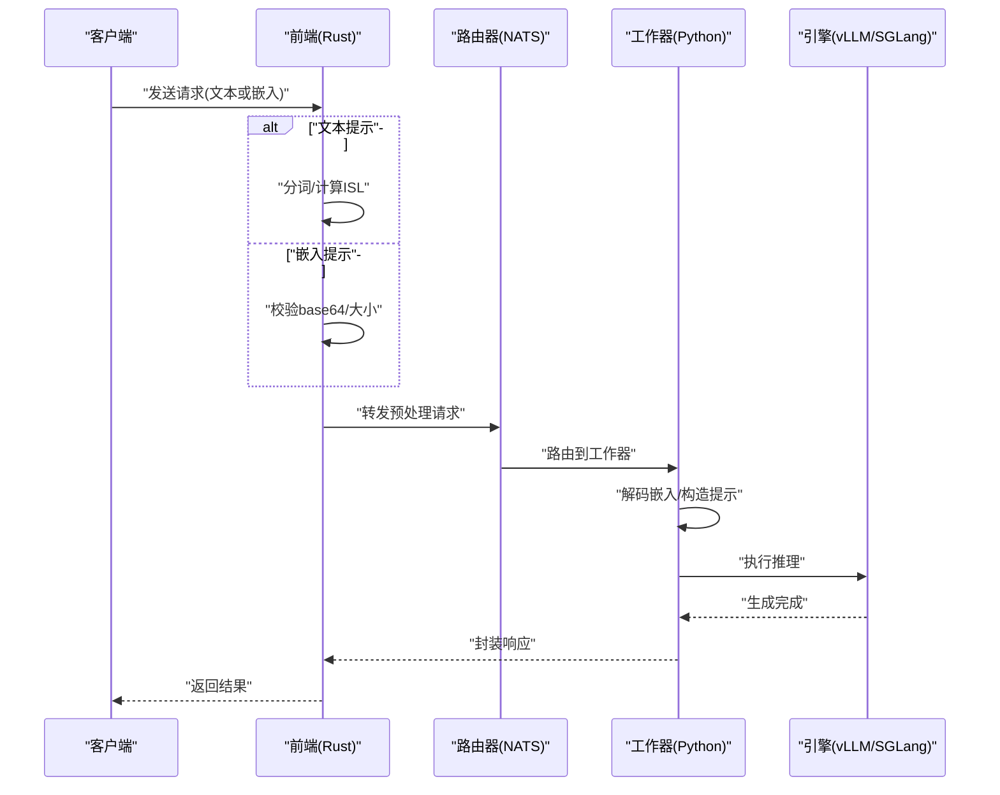
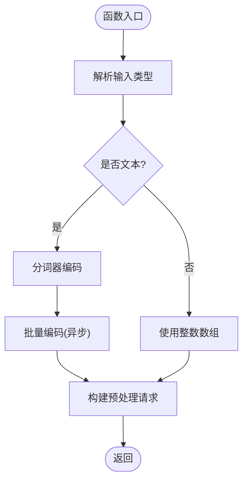
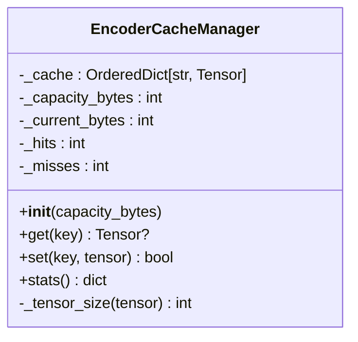
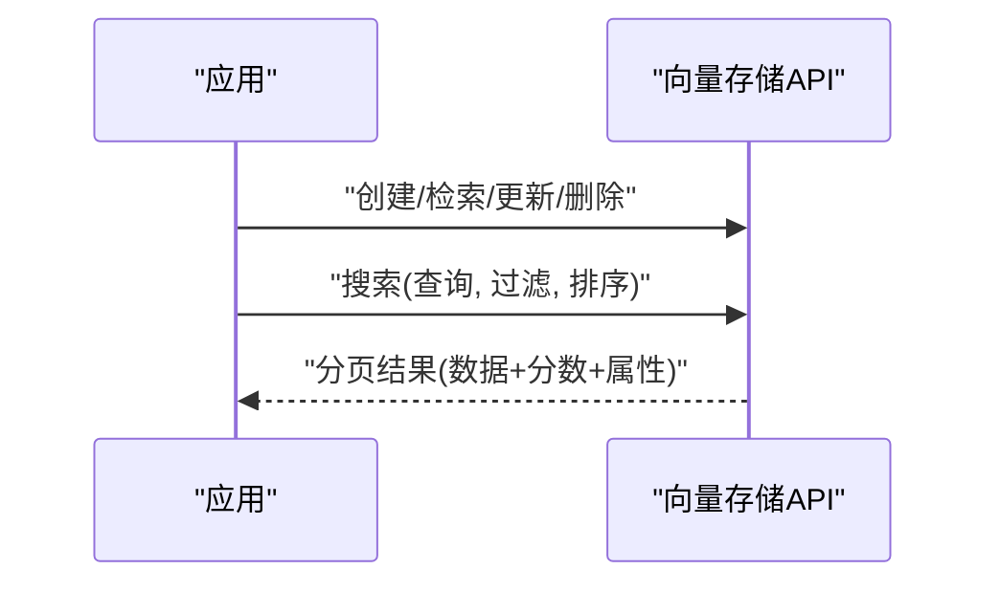
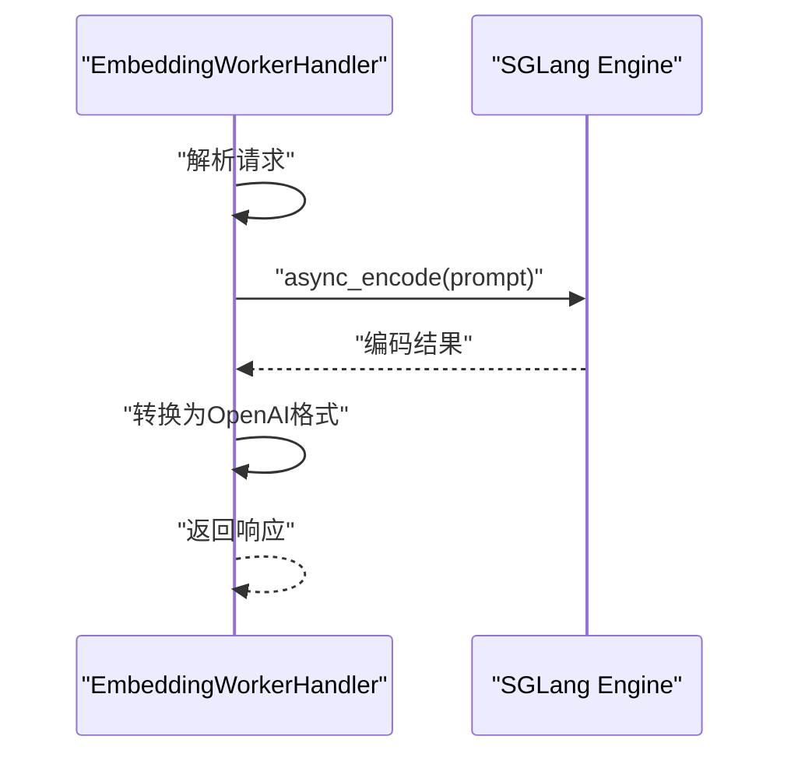
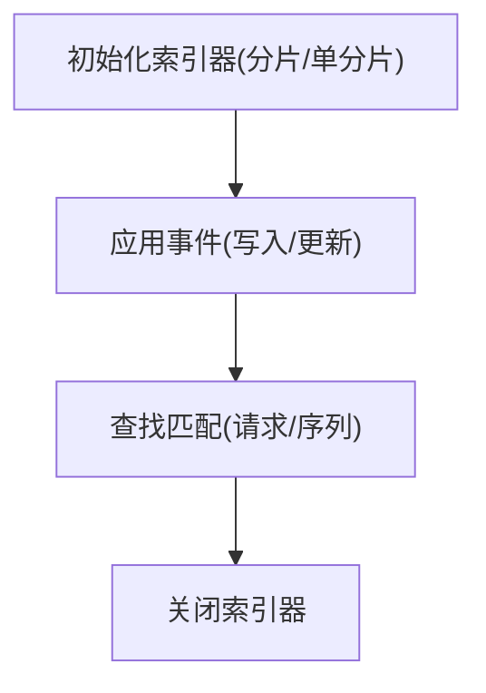
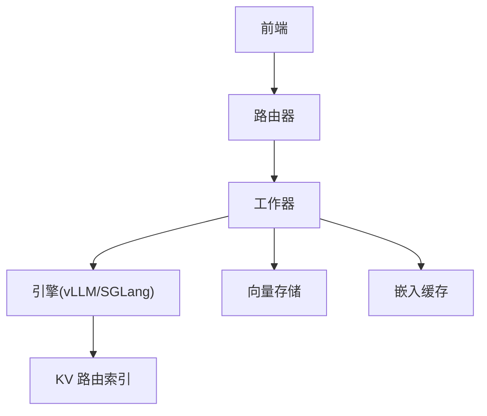

# 提示词嵌入技术

<cite>
**本文引用的文件**
- [prompt-embeddings.md](file://docs/backends/vllm/prompt-embeddings.md)
- [encoder_cache_manager.py](file://components/src/dynamo/common/memory/encoder_cache_manager.py)
- [embedding_handler.py](file://components/src/dynamo/sglang/request_handlers/embedding/embedding_handler.py)
- [preprocessor.rs](file://lib/llm/src/preprocessor.rs)
- [test_prompt_embeds.py](file://tests/frontend/test_prompt_embeds.py)
- [vector_stores.rs](file://lib/async-openai/src/vector_stores.rs)
- [vector_store.rs](file://lib/async-openai/src/types/vector_store.rs)
- [args.py](file://components/src/dynamo/sglang/args.py)
- [main.py](file://components/src/dynamo/sglang/main.py)
- [multimodal_encode_utils.py](file://components/src/dynamo/sglang/multimodal_utils/multimodal_encode_utils.py)
- [indexer.rs](file://lib/kv-router/src/indexer.rs)
</cite>

## 目录
1. [简介](#简介)
2. [项目结构](#项目结构)
3. [核心组件](#核心组件)
4. [架构总览](#架构总览)
5. [详细组件分析](#详细组件分析)
6. [依赖关系分析](#依赖关系分析)
7. [性能考量](#性能考量)
8. [故障排查指南](#故障排查指南)
9. [结论](#结论)
10. [附录](#附录)

## 简介
本技术文档围绕提示词嵌入（Prompt Embeddings）展开，系统阐述其生成原理、实现机制与工程化落地方式，包括嵌入向量的计算方法、存储策略、检索算法与在检索增强生成（RAG）等场景中的应用价值。文档重点覆盖以下方面：
- 嵌入向量的生成与预处理路径（文本/分词与直接输入嵌入）
- 向量缓存与索引（LRU 缓存、KV 路由索引）
- 检索与相似度计算（OpenAI 向量存储接口与过滤条件）
- 在 RAG 中的性能提升（检索精度与延迟优化）
- 配置示例与使用指南（维度、相似度、过滤条件）
- 端到端测试与常见问题定位

## 项目结构
与提示词嵌入相关的关键模块分布如下：
- 文档与使用指南：docs/backends/vllm/prompt-embeddings.md
- 嵌入生成与预处理：lib/llm/src/preprocessor.rs、components/src/dynamo/sglang/request_handlers/embedding/embedding_handler.py
- 向量缓存：components/src/dynamo/common/memory/encoder_cache_manager.py
- 向量存储与检索：lib/async-openai/src/vector_stores.rs、lib/async-openai/src/types/vector_store.rs
- 多模态嵌入编码：components/src/dynamo/sglang/multimodal_utils/multimodal_encode_utils.py
- KV 路由索引：lib/kv-router/src/indexer.rs
- 端到端测试：tests/frontend/test_prompt_embeds.py
- SGLang 嵌入工作流集成：components/src/dynamo/sglang/args.py、components/src/dynamo/sglang/main.py

**图示来源**
- [prompt-embeddings.md](file://docs/backends/vllm/prompt-embeddings.md#L19-L62)
- [preprocessor.rs](file://lib/llm/src/preprocessor.rs#L491-L748)
- [embedding_handler.py](file://components/src/dynamo/sglang/request_handlers/embedding/embedding_handler.py#L32-L86)
- [encoder_cache_manager.py](file://components/src/dynamo/common/memory/encoder_cache_manager.py#L29-L177)
- [vector_stores.rs](file://lib/async-openai/src/vector_stores.rs#L94-L104)
- [indexer.rs](file://lib/kv-router/src/indexer.rs#L1661-L1749)

**章节来源**
- [prompt-embeddings.md](file://docs/backends/vllm/prompt-embeddings.md#L1-L255)
- [preprocessor.rs](file://lib/llm/src/preprocessor.rs#L485-L748)
- [embedding_handler.py](file://components/src/dynamo/sglang/request_handlers/embedding/embedding_handler.py#L1-L86)
- [encoder_cache_manager.py](file://components/src/dynamo/common/memory/encoder_cache_manager.py#L1-L177)
- [vector_stores.rs](file://lib/async-openai/src/vector_stores.rs#L44-L104)
- [vector_store.rs](file://lib/async-openai/src/types/vector_store.rs#L334-L528)
- [multimodal_encode_utils.py](file://components/src/dynamo/sglang/multimodal_utils/multimodal_encode_utils.py#L130-L170)
- [indexer.rs](file://lib/kv-router/src/indexer.rs#L1661-L1749)
- [args.py](file://components/src/dynamo/sglang/args.py#L93-L97)
- [main.py](file://components/src/dynamo/sglang/main.py#L105-L106)

## 核心组件
- 嵌入生成与预处理
  - 文本/分词路径：将输入文本通过分词器编码为 token_ids，再进入嵌入层生成向量。
  - 直接嵌入路径：接收已序列化的 PyTorch 张量（base64 编码），绕过分词与嵌入层，直接送入解码后的张量作为提示。
- 嵌入缓存
  - 基于内容哈希键的 LRU 缓存，按字节容量回收，支持命中/未命中统计。
- 向量存储与检索
  - 支持创建、检索、更新、搜索向量存储；搜索请求支持查询文本或数组、过滤条件（比较/复合）与排序选项。
- KV 路由索引
  - 为 KV 缓存块构建索引，支持分片与匹配查找，用于检索命中与延迟优化。

**章节来源**
- [preprocessor.rs](file://lib/llm/src/preprocessor.rs#L491-L748)
- [encoder_cache_manager.py](file://components/src/dynamo/common/memory/encoder_cache_manager.py#L29-L177)
- [vector_stores.rs](file://lib/async-openai/src/vector_stores.rs#L94-L104)
- [vector_store.rs](file://lib/async-openai/src/types/vector_store.rs#L334-L528)
- [indexer.rs](file://lib/kv-router/src/indexer.rs#L1661-L1749)

## 架构总览
提示词嵌入在 Dynamo 中的端到端流程如下：
- 文本提示：前端进行分词与 ISL 计算，随后路由至工作器。
- 嵌入提示：前端验证 base64 与大小后，直接携带嵌入张量，跳过分词与嵌入层。
- 工作器：将嵌入解码为张量，构造提示对象，交由引擎处理。
- 引擎：在 vLLM/SGLang 中执行推理，输出完成响应。

**图示来源**
- [prompt-embeddings.md](file://docs/backends/vllm/prompt-embeddings.md#L19-L62)
- [preprocessor.rs](file://lib/llm/src/preprocessor.rs#L491-L748)
- [embedding_handler.py](file://components/src/dynamo/sglang/request_handlers/embedding/embedding_handler.py#L32-L86)

## 详细组件分析

### 组件A：嵌入生成与预处理
- 功能要点
  - 支持字符串、字符串数组、整数数组与整数数组数组四种输入类型。
  - 文本输入通过分词器批量编码；整数数组直接复用。
  - 嵌入输出转换为 OpenAI 格式，包含索引与向量值。
- 关键流程
  - 输入解析与分词
  - 批量编码（异步任务）
  - 输出格式转换

**图示来源**
- [preprocessor.rs](file://lib/llm/src/preprocessor.rs#L491-L525)

**章节来源**
- [preprocessor.rs](file://lib/llm/src/preprocessor.rs#L485-L748)

### 组件B：嵌入缓存管理（LRU）
- 功能要点
  - 以内容哈希为键，存储张量；容量超限时按 LRU 淘汰。
  - 统计命中/未命中与利用率，便于性能观测。
- 关键流程
  - 查询命中：移动至末尾（最近使用）
  - 存储：若单条张量超过容量则拒绝；否则逐出直到有足够空间
  - 统计：计算命中率与占用比例

**图示来源**
- [encoder_cache_manager.py](file://components/src/dynamo/common/memory/encoder_cache_manager.py#L29-L177)

**章节来源**
- [encoder_cache_manager.py](file://components/src/dynamo/common/memory/encoder_cache_manager.py#L1-L177)

### 组件C：向量存储与检索（OpenAI 接口）
- 功能要点
  - 创建/检索/更新/删除向量存储。
  - 搜索支持文本或文本数组、过滤条件（比较/复合）、排序选项。
  - 结果包含文件 ID、名称、相似度分数、属性与内容片段。
- 关键流程
  - 发起搜索请求（带查询与过滤）
  - 返回分页结果与下一页标记

**图示来源**
- [vector_stores.rs](file://lib/async-openai/src/vector_stores.rs#L94-L104)
- [vector_store.rs](file://lib/async-openai/src/types/vector_store.rs#L334-L528)

**章节来源**
- [vector_stores.rs](file://lib/async-openai/src/vector_stores.rs#L44-L104)
- [vector_store.rs](file://lib/async-openai/src/types/vector_store.rs#L334-L528)

### 组件D：SGLang 嵌入工作器
- 功能要点
  - 解析嵌入请求，支持字符串与数组输入。
  - 调用引擎 async_encode 生成嵌入。
  - 转换为 OpenAI 格式的嵌入响应，包含 prompt_tokens 统计。
- 关键流程
  - 请求解析
  - 引擎编码
  - 响应转换

**图示来源**
- [embedding_handler.py](file://components/src/dynamo/sglang/request_handlers/embedding/embedding_handler.py#L32-L86)

**章节来源**
- [embedding_handler.py](file://components/src/dynamo/sglang/request_handlers/embedding/embedding_handler.py#L1-L86)

### 组件E：KV 路由索引
- 功能要点
  - 构建 KV 块索引，支持单分片与分片模式。
  - 提供匹配查找、事件应用与关闭流程。
- 关键流程
  - 初始化索引器（单分片/分片）
  - 查找匹配与应用事件
  - 关闭资源

**图示来源**
- [indexer.rs](file://lib/kv-router/src/indexer.rs#L1661-L1749)

**章节来源**
- [indexer.rs](file://lib/kv-router/src/indexer.rs#L1661-L1749)

### 组件F：多模态嵌入编码
- 功能要点
  - 对图像等多模态输入进行编码，统一输出形状并规范化。
- 关键流程
  - 选择编码器
  - 规范化输出形状

**章节来源**
- [multimodal_encode_utils.py](file://components/src/dynamo/sglang/multimodal_utils/multimodal_encode_utils.py#L130-L170)

## 依赖关系分析
- 前端与工作器通过 NATS 路由通信，工作器负责嵌入解码与提示构造。
- vLLM/SGLang 引擎执行推理，输出完成响应。
- 向量存储与 KV 索引分别服务于检索增强与 KV 缓存命中优化。
- 嵌入缓存作为中间层，减少重复编码与传输开销。

**图示来源**
- [prompt-embeddings.md](file://docs/backends/vllm/prompt-embeddings.md#L19-L62)
- [vector_stores.rs](file://lib/async-openai/src/vector_stores.rs#L94-L104)
- [indexer.rs](file://lib/kv-router/src/indexer.rs#L1661-L1749)
- [encoder_cache_manager.py](file://components/src/dynamo/common/memory/encoder_cache_manager.py#L29-L177)

**章节来源**
- [prompt-embeddings.md](file://docs/backends/vllm/prompt-embeddings.md#L1-L255)
- [vector_stores.rs](file://lib/async-openai/src/vector_stores.rs#L44-L104)
- [indexer.rs](file://lib/kv-router/src/indexer.rs#L1661-L1749)
- [encoder_cache_manager.py](file://components/src/dynamo/common/memory/encoder_cache_manager.py#L1-L177)

## 性能考量
- 嵌入向量的计算
  - 文本路径：分词与嵌入层带来额外时延；可通过预计算嵌入（直接嵌入路径）降低时延。
  - 直接嵌入路径：避免分词与嵌入层，显著降低前端与路由时延。
- 存储与缓存
  - 嵌入缓存采用 LRU，按容量回收，命中率统计有助于评估缓存效果。
  - 合理设置缓存容量可平衡内存占用与命中率。
- 检索与索引
  - 向量存储支持过滤与排序，可在大规模语料中快速收敛目标片段。
  - KV 路由索引提升 KV 命中概率，减少重复解码与计算。
- 端到端测试验证
  - 流式响应、大体积嵌入（NATS 限制）、并发请求与使用统计均通过端到端测试覆盖。

**章节来源**
- [prompt-embeddings.md](file://docs/backends/vllm/prompt-embeddings.md#L183-L255)
- [encoder_cache_manager.py](file://components/src/dynamo/common/memory/encoder_cache_manager.py#L154-L177)
- [test_prompt_embeds.py](file://tests/frontend/test_prompt_embeds.py#L193-L330)

## 故障排查指南
- 常见错误与修复
  - 必须启用嵌入功能标志：缺少 --enable-prompt-embeds 导致请求失败。
  - base64 格式错误：确保使用正确的 base64 编码与解码流程。
  - 数据大小限制：解码后需在 100 字节到 10MB 之间。
  - 张量格式：必须为 PyTorch 张量（torch.save），不支持 NumPy。
  - 维度不匹配：张量隐藏维度需与模型一致。
- 端到端验证
  - 流式响应：确认工作器正确处理流式输出。
  - 大体积嵌入：验证 NATS 最大负载配置（默认 15MB）。
  - 并发请求：确保多线程并发无竞态与资源冲突。
  - 使用统计：确认 prompt_tokens 正确提取自嵌入形状。

**章节来源**
- [prompt-embeddings.md](file://docs/backends/vllm/prompt-embeddings.md#L183-L255)
- [test_prompt_embeds.py](file://tests/frontend/test_prompt_embeds.py#L216-L330)

## 结论
提示词嵌入通过“直接嵌入路径”显著降低推理时延与隐私风险，结合嵌入缓存、向量存储与 KV 索引，可在 RAG 等场景中实现更高的检索精度与更低的延迟。工程上，合理的缓存容量、严格的输入校验与完善的端到端测试是保障稳定性的关键。

## 附录

### 配置示例与使用指南
- 启用提示词嵌入
  - vLLM 后端：启动参数添加启用标志。
  - SGLang 集成：通过参数与主程序初始化嵌入工作器。
- 请求与响应
  - 请求体包含模型名、空或非空提示、base64 编码的嵌入张量与最大生成长度。
  - 响应遵循 OpenAI 格式，包含使用统计（prompt_tokens、completion_tokens、total_tokens）。
- NATS 配置
  - 默认部署已配置最大负载，满足嵌入张量传输需求。
- Docker/Kubernetes
  - 提供命令行与配置模板，确保嵌入功能开启。

**章节来源**
- [prompt-embeddings.md](file://docs/backends/vllm/prompt-embeddings.md#L64-L167)
- [args.py](file://components/src/dynamo/sglang/args.py#L93-L97)
- [main.py](file://components/src/dynamo/sglang/main.py#L105-L106)

### 相似度计算与过滤条件
- 相似度
  - 向量存储搜索返回分数，范围最小 0、最大 1，越接近 1 表示越相似。
- 过滤条件
  - 支持比较过滤（等于/不等于/大于/小于等）与复合过滤（组合多个条件）。
  - 属性值支持字符串、数字与布尔类型。

**章节来源**
- [vector_store.rs](file://lib/async-openai/src/types/vector_store.rs#L511-L512)
- [vector_store.rs](file://lib/async-openai/src/types/vector_store.rs#L391-L435)