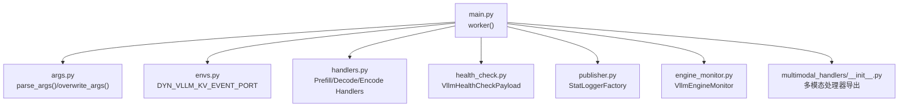
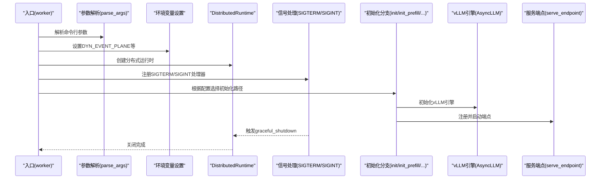
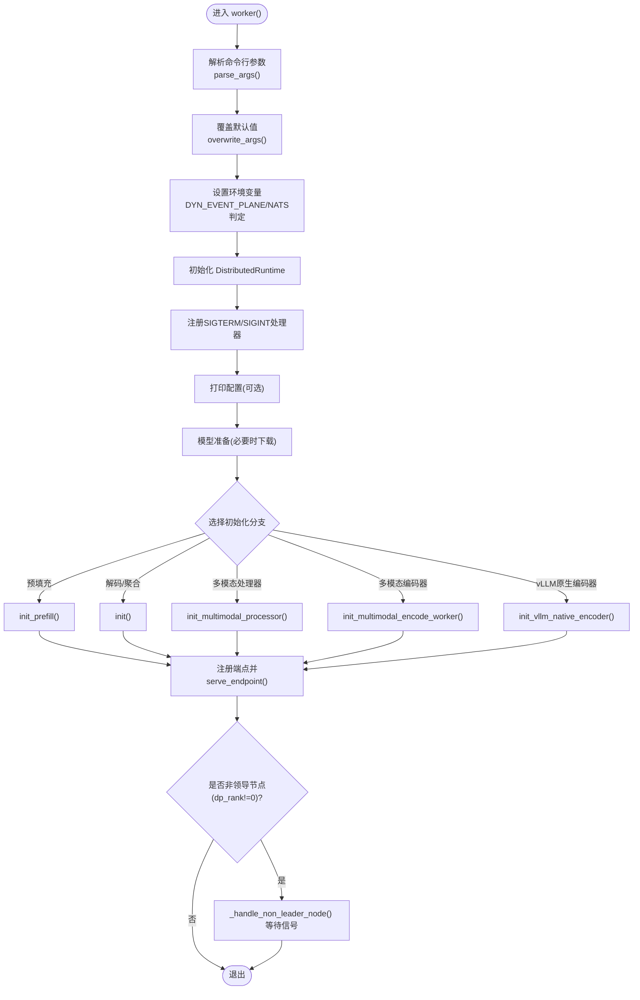
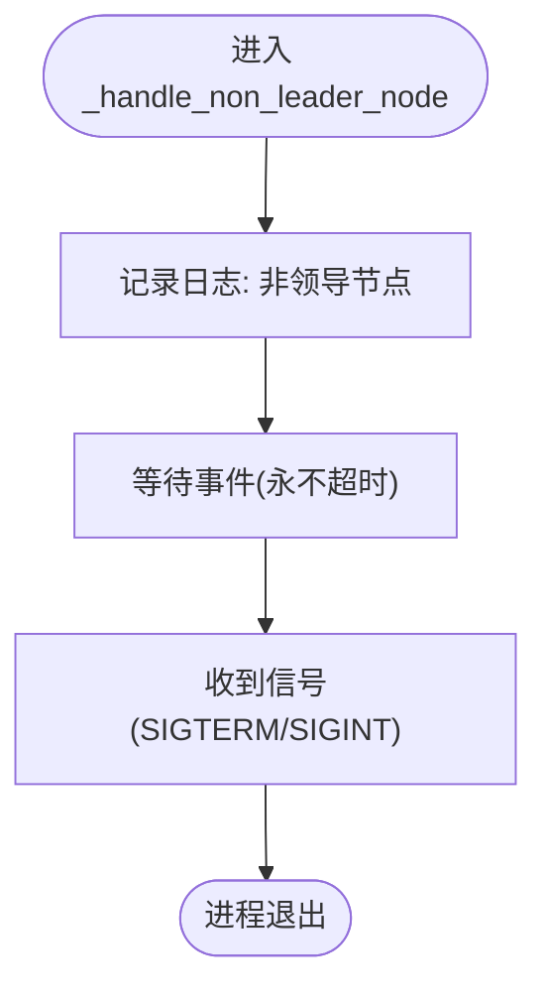
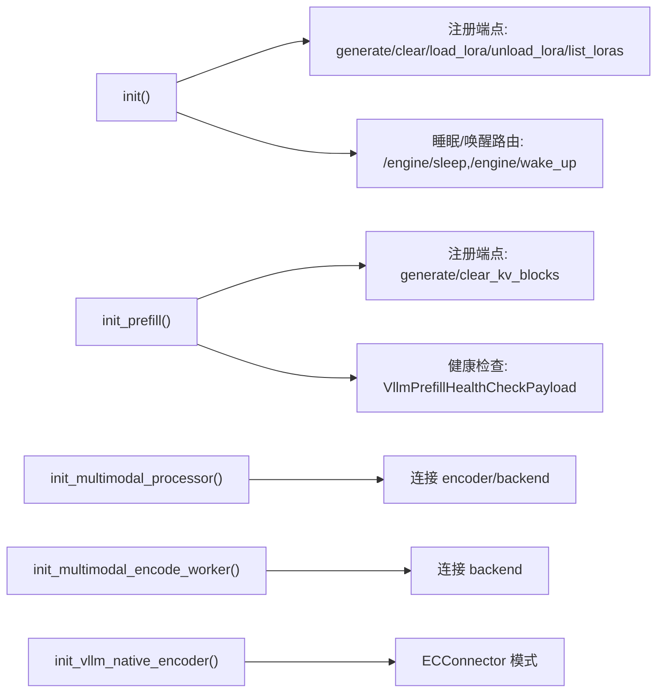
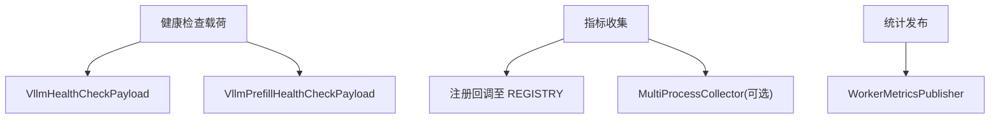
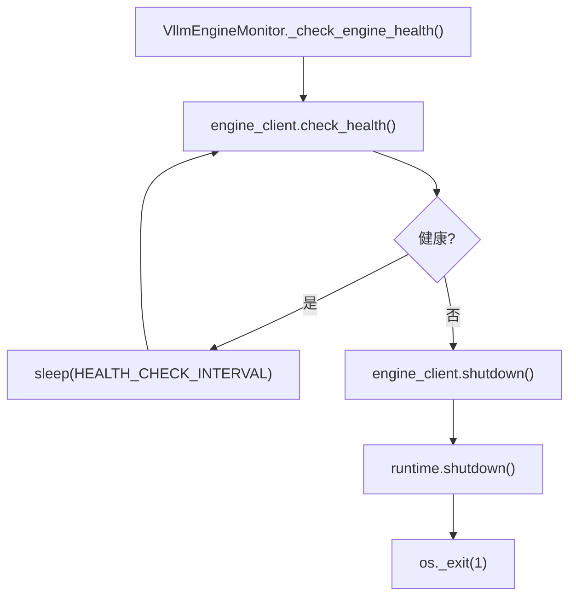
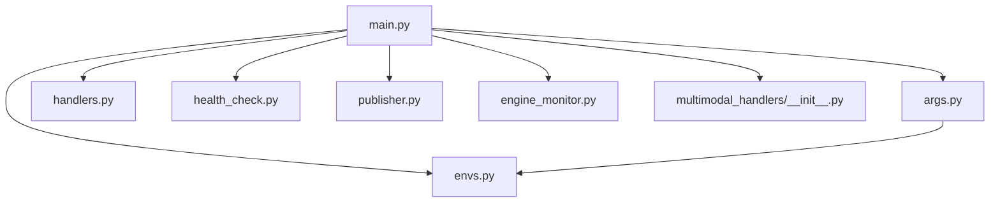

# 主入口点和初始化流程

<cite>
**本文引用的文件**
- [main.py](file://components/src/dynamo/vllm/main.py)
- [args.py](file://components/src/dynamo/vllm/args.py)
- [envs.py](file://components/src/dynamo/vllm/envs.py)
- [handlers.py](file://components/src/dynamo/vllm/handlers.py)
- [health_check.py](file://components/src/dynamo/vllm/health_check.py)
- [publisher.py](file://components/src/dynamo/vllm/publisher.py)
- [engine_monitor.py](file://components/src/dynamo/vllm/engine_monitor.py)
- [multimodal_handlers/__init__.py](file://components/src/dynamo/vllm/multimodal_handlers/__init__.py)
</cite>

## 目录
1. [简介](#简介)
2. [项目结构](#项目结构)
3. [核心组件](#核心组件)
4. [架构总览](#架构总览)
5. [详细组件分析](#详细组件分析)
6. [依赖关系分析](#依赖关系分析)
7. [性能考量](#性能考量)
8. [故障排查指南](#故障排查指南)
9. [结论](#结论)
10. [附录](#附录)

## 简介
本文件聚焦于 vLLM 后端在 Dynamo 平台中的主入口点与初始化流程，系统性梳理 worker() 函数的工作流：从命令行参数解析与环境变量设置，到分布式运行时初始化（DistributedRuntime）、信号处理与优雅关闭；深入解析多节点部署中非领导节点的处理逻辑；详解引擎初始化的多条路径（预填充工作器、多模态处理器、编码器工作器等）；最后给出优雅关闭机制的实现细节与最佳实践。

## 项目结构
围绕 vLLM 主入口与初始化的关键文件组织如下：
- 入口与初始化：main.py
- 命令行参数与默认值覆盖：args.py
- 环境变量常量：envs.py
- 请求处理与引擎交互：handlers.py
- 健康检查载荷：health_check.py
- 指标发布与统计：publisher.py
- 引擎健康监控：engine_monitor.py
- 多模态处理器导出：multimodal_handlers/__init__.py



**图表来源**
- [main.py](file://components/src/dynamo/vllm/main.py#L76-L152)
- [args.py](file://components/src/dynamo/vllm/args.py#L110-L467)
- [envs.py](file://components/src/dynamo/vllm/envs.py#L57-L82)
- [handlers.py](file://components/src/dynamo/vllm/handlers.py#L230-L376)
- [health_check.py](file://components/src/dynamo/vllm/health_check.py#L82-L121)
- [publisher.py](file://components/src/dynamo/vllm/publisher.py#L81-L116)
- [engine_monitor.py](file://components/src/dynamo/vllm/engine_monitor.py#L23-L82)
- [multimodal_handlers/__init__.py](file://components/src/dynamo/vllm/multimodal_handlers/__init__.py#L1-L25)

**章节来源**
- [main.py](file://components/src/dynamo/vllm/main.py#L76-L152)
- [args.py](file://components/src/dynamo/vllm/args.py#L110-L467)
- [envs.py](file://components/src/dynamo/vllm/envs.py#L57-L82)
- [handlers.py](file://components/src/dynamo/vllm/handlers.py#L230-L376)
- [health_check.py](file://components/src/dynamo/vllm/health_check.py#L82-L121)
- [publisher.py](file://components/src/dynamo/vllm/publisher.py#L81-L116)
- [engine_monitor.py](file://components/src/dynamo/vllm/engine_monitor.py#L23-L82)
- [multimodal_handlers/__init__.py](file://components/src/dynamo/vllm/multimodal_handlers/__init__.py#L1-L25)

## 核心组件
- worker()：主入口协程，负责解析参数、设置环境变量、初始化 DistributedRuntime、注册信号处理、按配置分支初始化不同引擎模式，并在非领导节点执行等待退出。
- 配置对象 Config：封装命令行参数、引擎参数、连接器列表、多模态开关、请求平面/事件平面等。
- 分支初始化函数：init()、init_prefill()、init_multimodal_processor()、init_multimodal_encode_worker()、init_vllm_native_encoder() 等。
- 信号与优雅关闭：graceful_shutdown()，绑定 SIGTERM/SIGINT。
- 引擎与指标：setup_vllm_engine()、setup_metrics_collection()、StatLoggerFactory。
- 健康检查：VllmHealthCheckPayload、VllmPrefillHealthCheckPayload。
- 引擎监控：VllmEngineMonitor，检测 EngineDeadError 并触发运行时关闭。

**章节来源**
- [main.py](file://components/src/dynamo/vllm/main.py#L76-L152)
- [args.py](file://components/src/dynamo/vllm/args.py#L30-L102)
- [handlers.py](file://components/src/dynamo/vllm/handlers.py#L230-L376)
- [health_check.py](file://components/src/dynamo/vllm/health_check.py#L82-L121)
- [publisher.py](file://components/src/dynamo/vllm/publisher.py#L81-L116)
- [engine_monitor.py](file://components/src/dynamo/vllm/engine_monitor.py#L23-L82)

## 架构总览
下图展示了从 worker() 到各初始化分支、再到服务端点的总体流程，以及信号与健康监控的集成点。



**图表来源**
- [main.py](file://components/src/dynamo/vllm/main.py#L76-L152)
- [args.py](file://components/src/dynamo/vllm/args.py#L110-L467)
- [envs.py](file://components/src/dynamo/vllm/envs.py#L57-L82)
- [handlers.py](file://components/src/dynamo/vllm/handlers.py#L530-L674)

## 详细组件分析

### worker() 函数整体工作流
- 参数解析与覆盖：parse_args() 生成 Config；overwrite_args() 设置 vLLM 默认与 KV 事件/传输配置。
- 环境变量设置：根据配置设置 DYN_EVENT_PLANE；根据请求平面/事件平面与 KV 事件标志决定是否启用 NATS。
- 运行时初始化：构造 DistributedRuntime，传入存储后端、请求平面、是否启用 NATS。
- 信号处理：为 SIGTERM/SIGINT 注册 graceful_shutdown 回调。
- 配置落地与模型准备：打印配置、命名模型、必要时下载模型。
- 路径选择：依据配置标志选择 init()、init_prefill()、多模态或编码器初始化分支。
- 非领导节点处理：若 data_parallel_rank 非零，调用 _handle_non_leader_node() 等待信号退出。



**图表来源**
- [main.py](file://components/src/dynamo/vllm/main.py#L76-L152)
- [args.py](file://components/src/dynamo/vllm/args.py#L559-L605)

**章节来源**
- [main.py](file://components/src/dynamo/vllm/main.py#L76-L152)
- [args.py](file://components/src/dynamo/vllm/args.py#L559-L605)

### 非领导节点处理逻辑（_handle_non_leader_node）
- 输入：data_parallel_rank
- 行为：记录日志提示非领导节点，不对外提供端点服务，仅无限等待；通过信号处理器触发的 graceful_shutdown 实现进程终止。
- 适用场景：多节点/多数据并行副本部署中，仅允许 rank=0 的节点对外提供服务，其余节点仅参与计算但不暴露端点。



**图表来源**
- [main.py](file://components/src/dynamo/vllm/main.py#L51-L61)

**章节来源**
- [main.py](file://components/src/dynamo/vllm/main.py#L51-L61)

### 引擎初始化路径选择
- init()：通用解码/聚合工作器，注册 generate/clear/load_lora/unload_lora/list_loras 端点，支持迁移限制与睡眠/唤醒路由。
- init_prefill()：预填充工作器，注册 prefill 专用端点，支持睡眠/唤醒，健康检查载荷适配文本或 token_ids。
- 多模态处理器：init_multimodal_processor()，连接 encoder 与 backend，作为预处理入口。
- 多模态编码器：init_multimodal_encode_worker()，连接 backend，处理图像/视频编码。
- vLLM 原生编码器：init_vllm_native_encoder()，使用 ECConnector 模式进行编码缓存与存储管理。



**图表来源**
- [main.py](file://components/src/dynamo/vllm/main.py#L530-L674)
- [main.py](file://components/src/dynamo/vllm/main.py#L418-L528)
- [main.py](file://components/src/dynamo/vllm/main.py#L702-L754)
- [main.py](file://components/src/dynamo/vllm/main.py#L757-L792)
- [main.py](file://components/src/dynamo/vllm/main.py#L795-L800)

**章节来源**
- [main.py](file://components/src/dynamo/vllm/main.py#L530-L674)
- [main.py](file://components/src/dynamo/vllm/main.py#L418-L528)
- [main.py](file://components/src/dynamo/vllm/main.py#L702-L792)

### 优雅关闭机制（graceful_shutdown）
- 触发条件：捕获 SIGTERM/SIGINT，异步调度 graceful_shutdown。
- 关闭流程：记录日志 → runtime.shutdown() → 记录完成。
- 与非领导节点协作：非领导节点通过等待事件并在收到信号后退出，确保进程被父进程或编排系统回收。

```mermaid
sequenceDiagram
    participant OS as "操作系统"
    participant Loop as "事件循环"
    participant Handler as "signal_handler()"
    participant Grace as "graceful_shutdown()"
    participant RT as "DistributedRuntime"
    
    OS->>Loop: "发送SIGTERM/SIGINT"
    Loop->>Handler: "调用回调"
    Handler->>Grace: "创建任务调度"
    Grace->>RT: "shutdown()"
    RT-->>Grace: "完成"
    Grace-->>Handler: "返回"
```

**图表来源**
- [main.py](file://components/src/dynamo/vllm/main.py#L96-L101)
- [main.py](file://components/src/dynamo/vllm/main.py#L64-L73)

**章节来源**
- [main.py](file://components/src/dynamo/vllm/main.py#L96-L101)
- [main.py](file://components/src/dynamo/vllm/main.py#L64-L73)

### 健康检查与指标收集
- 健康检查载荷：VllmHealthCheckPayload/VllmPrefillHealthCheckPayload 提供默认采样与停止条件，支持文本输入或 token_ids。
- 指标收集：setup_metrics_collection() 根据 PROMETHEUS_MULTIPROC_DIR 状态选择直接注册或分离 Registry，并注册 vLLM/LMCache/Dynamo 指标回调。
- 统计发布：StatLoggerFactory 与 DynamoStatLoggerPublisher 将调度统计转换为 KV 块占用指标并通过 WorkerMetricsPublisher 发布。



**图表来源**
- [health_check.py](file://components/src/dynamo/vllm/health_check.py#L82-L121)
- [main.py](file://components/src/dynamo/vllm/main.py#L154-L210)
- [publisher.py](file://components/src/dynamo/vllm/publisher.py#L34-L116)

**章节来源**
- [health_check.py](file://components/src/dynamo/vllm/health_check.py#L82-L121)
- [main.py](file://components/src/dynamo/vllm/main.py#L154-L210)
- [publisher.py](file://components/src/dynamo/vllm/publisher.py#L34-L116)

### 引擎监控与异常恢复
- VllmEngineMonitor 定期检查 AsyncLLM 健康状态；当抛出 EngineDeadError 时，记录堆栈与警告，执行 vLLM 引擎 shutdown，随后触发 DistributedRuntime shutdown，并以非零退出码终止进程，确保资源释放。



**图表来源**
- [engine_monitor.py](file://components/src/dynamo/vllm/engine_monitor.py#L68-L82)

**章节来源**
- [engine_monitor.py](file://components/src/dynamo/vllm/engine_monitor.py#L23-L82)

### 多模态处理器与组件导出
- 多模态处理器导出：通过 multimodal_handlers/__init__.py 导出 EncodeWorkerHandler、VLLMEncodeWorkerHandler、PreprocessedHandler、ECProcessorHandler、MultimodalPDWorkerHandler、MultimodalDecodeWorkerHandler 等，用于不同多模态工作器模式的初始化与注册。

**章节来源**
- [multimodal_handlers/__init__.py](file://components/src/dynamo/vllm/multimodal_handlers/__init__.py#L1-L25)

## 依赖关系分析
- 入口依赖：main.py 依赖 args.py（参数解析与覆盖）、envs.py（端口常量）、handlers.py（端点与处理）、health_check.py（健康检查）、publisher.py（指标）、engine_monitor.py（健康监控）、multimodal_handlers/__init__.py（多模态导出）。
- 参数覆盖：args.py 的 overwrite_args() 会注入 KV 事件与传输配置，并根据连接器设置 use_kv_events。
- 环境变量：envs.py 提供 DYN_VLLM_KV_EVENT_PORT 的解析与校验，供 KV 事件配置使用。



**图表来源**
- [main.py](file://components/src/dynamo/vllm/main.py#L42-L45)
- [args.py](file://components/src/dynamo/vllm/args.py#L559-L605)
- [envs.py](file://components/src/dynamo/vllm/envs.py#L57-L82)

**章节来源**
- [main.py](file://components/src/dynamo/vllm/main.py#L42-L45)
- [args.py](file://components/src/dynamo/vllm/args.py#L559-L605)
- [envs.py](file://components/src/dynamo/vllm/envs.py#L57-L82)

## 性能考量
- Prometheus 多进程指标：在存在 PROMETHEUS_MULTIPROC_DIR 时优先使用 MultiProcessCollector，避免重复指标；否则注册到全局 REGISTRY。
- 临时目录管理：setup_vllm_engine() 在未设置 PROMETHEUS_MULTIPROC_DIR 时创建临时目录并设置环境变量，确保指标文件安全清理。
- 连接器后端选择：args.py 中对 NIXL 连接器在 TP=1 场景强制使用 mp 执行器以规避 GIL 竞态问题。
- KV 事件端口：envs.py 对 DYN_VLLM_KV_EVENT_PORT 提供端口范围校验，避免非法端口导致通信失败。

**章节来源**
- [main.py](file://components/src/dynamo/vllm/main.py#L289-L361)
- [args.py](file://components/src/dynamo/vllm/args.py#L295-L312)
- [envs.py](file://components/src/dynamo/vllm/envs.py#L23-L54)

## 故障排查指南
- 健康检查失败：VllmEngineMonitor 捕获 EngineDeadError 后会记录堆栈并触发 runtime.shutdown()，随后进程以非零码退出。建议检查引擎日志与资源占用。
- 端点不可用：确认非领导节点不会对外提供端点；检查 data_parallel_rank 是否为 0；确认 serve_endpoint 已成功注册。
- 指标缺失：若 PROMETHEUS_MULTIPROC_DIR 已存在且冲突，setup_metrics_collection() 会回退到独立 Registry；请检查目录权限与内容。
- 多模态配置冲突：args.py 对多模态标志进行了互斥校验，确保仅启用一种模式；同时要求开启 --enable-multimodal。
- NATS/KV 事件：根据请求平面/事件平面与 use_kv_events 决定是否启用 NATS；如需 KV 事件发布，请确保 KVEventsConfig 正确配置。

**章节来源**
- [engine_monitor.py](file://components/src/dynamo/vllm/engine_monitor.py#L68-L82)
- [main.py](file://components/src/dynamo/vllm/main.py#L51-L61)
- [main.py](file://components/src/dynamo/vllm/main.py#L154-L210)
- [args.py](file://components/src/dynamo/vllm/args.py#L332-L350)
- [args.py](file://components/src/dynamo/vllm/args.py#L88-L90)

## 结论
vLLM 在 Dynamo 中的主入口通过清晰的参数解析、环境变量设置与分布式运行时初始化，结合多分支引擎初始化路径与严格的信号处理与健康监控，实现了在单机与多节点部署下的稳定运行。非领导节点的处理策略保证了服务端点的唯一性与一致性；优雅关闭与引擎监控共同保障了资源的正确释放与异常恢复。多模态与原生编码器模式进一步扩展了推理链路的灵活性与性能表现。

## 附录
- 示例启动要点（基于仓库现有脚本与配置）：
  - 聚合模式：参考 examples/backends/vllm/launch 下的脚本，设置模型路径、连接器、请求/事件平面等。
  - 分离模式（预填充/解码）：使用 --is-prefill-worker 与相应组件命名，确保与编码器/后端组件协同。
  - 多模态模式：启用 --enable-multimodal，并选择单一多模态工作器类型（处理器/编码器/解码器/原生编码器）。
  - KV 事件与前缀缓存：根据需要启用前缀缓存与 KV 事件发布，确保端口与连接器配置一致。
- 错误处理与异常恢复：
  - 使用 graceful_shutdown() 与 VllmEngineMonitor 双重保障，确保在异常情况下快速释放资源并退出。
  - 对于多模态与连接器配置冲突，遵循 args.py 的校验规则，避免运行时错误。