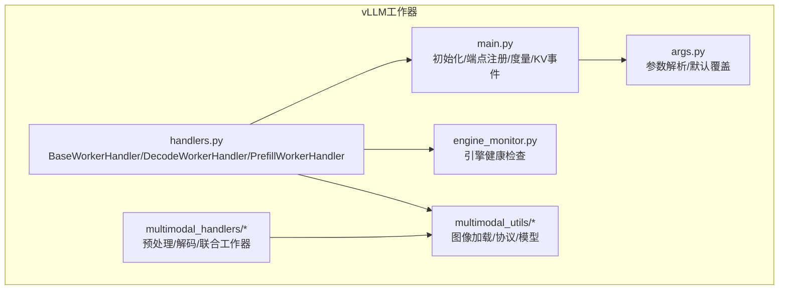
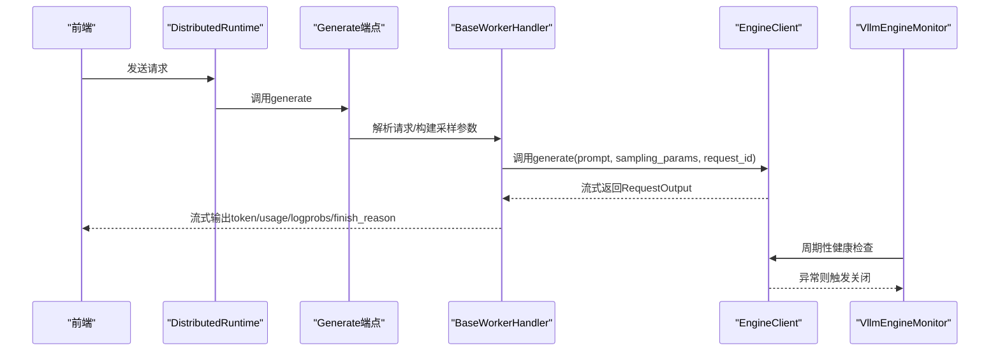
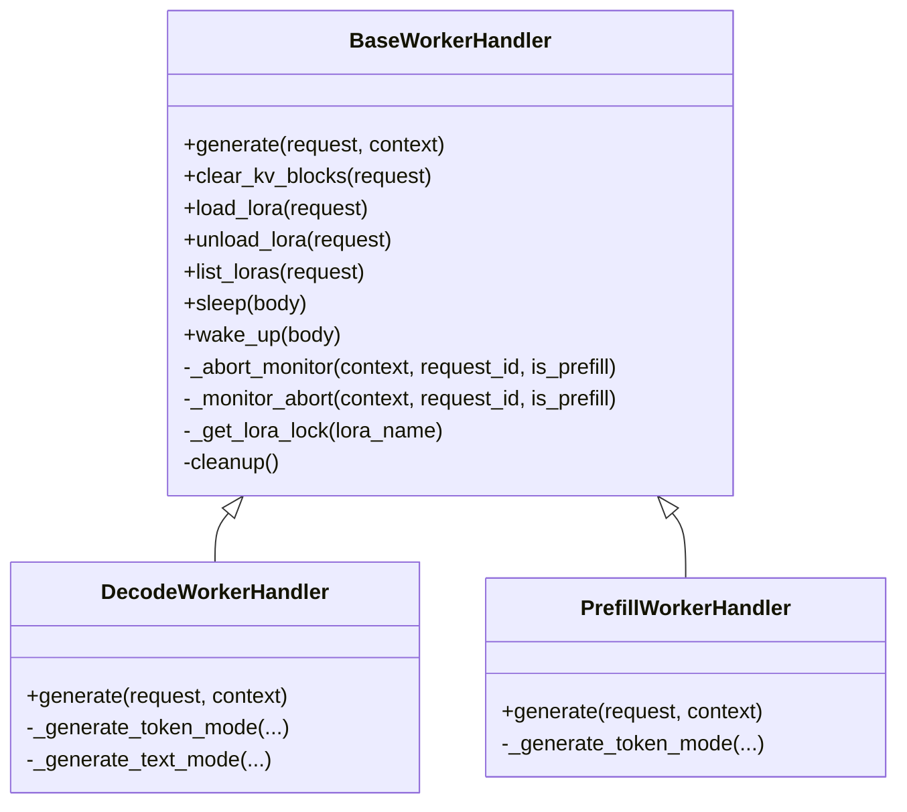
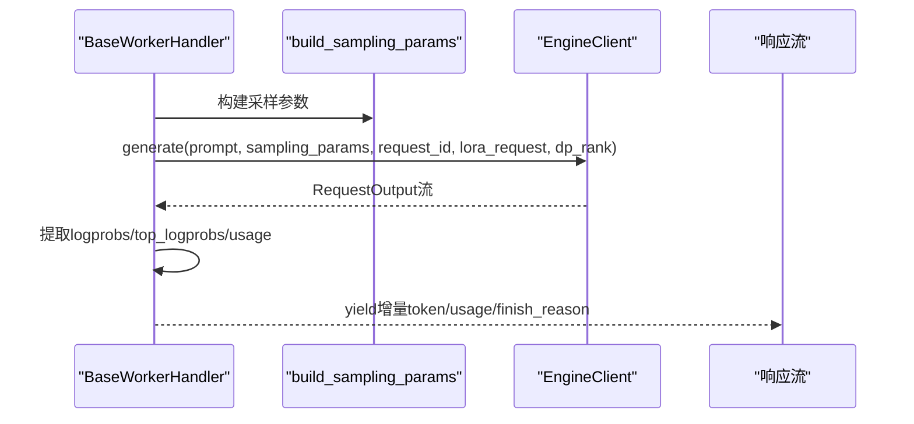
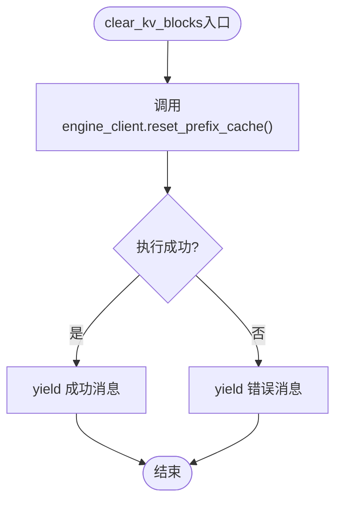
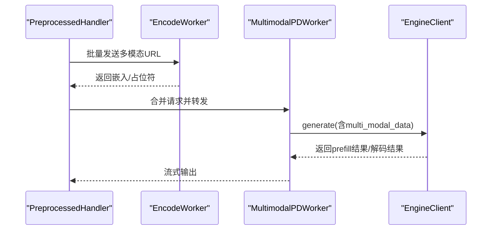
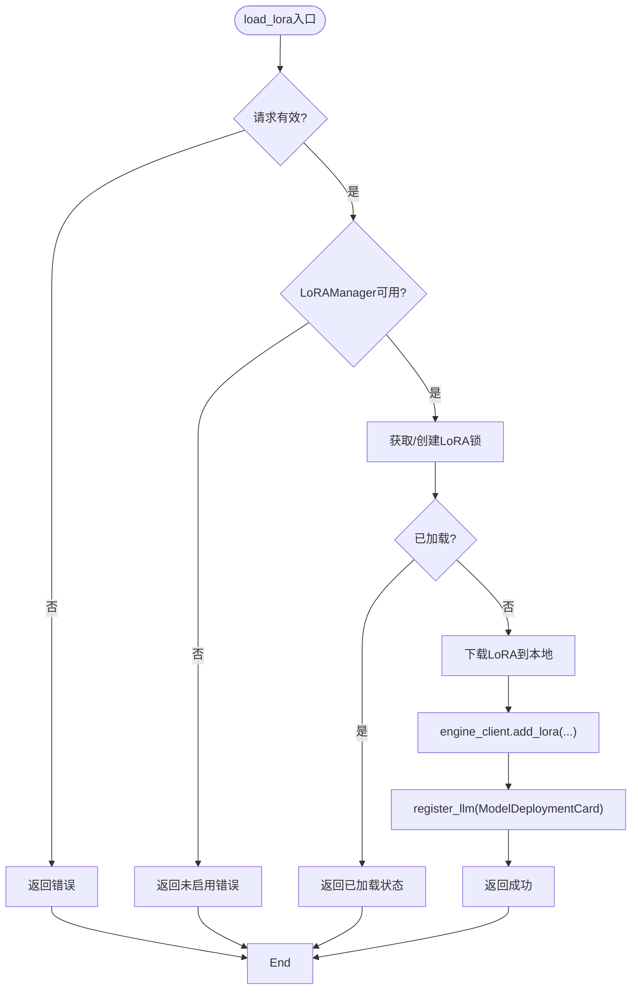
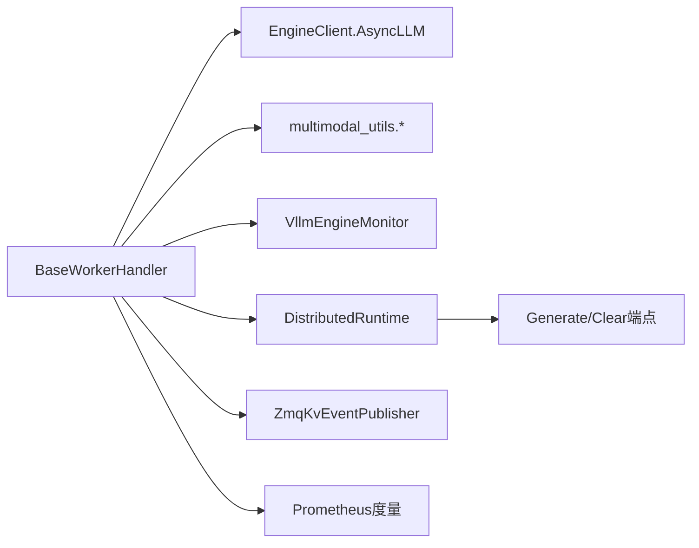

# 工作器处理器实现

<cite>
**本文档引用的文件**
- [handlers.py](file://components/src/dynamo/vllm/handlers.py)
- [main.py](file://components/src/dynamo/vllm/main.py)
- [engine_monitor.py](file://components/src/dynamo/vllm/engine_monitor.py)
- [image_loader.py](file://components/src/dynamo/vllm/multimodal_utils/image_loader.py)
- [model.py](file://components/src/dynamo/vllm/multimodal_utils/model.py)
- [protocol.py](file://components/src/dynamo/vllm/multimodal_utils/protocol.py)
- [preprocessed_handler.py](file://components/src/dynamo/vllm/multimodal_handlers/preprocessed_handler.py)
- [worker_handler.py](file://components/src/dynamo/vllm/multimodal_handlers/worker_handler.py)
- [args.py](file://components/src/dynamo/vllm/args.py)
</cite>

## 目录
1. [简介](#简介)
2. [项目结构](#项目结构)
3. [核心组件](#核心组件)
4. [架构总览](#架构总览)
5. [详细组件分析](#详细组件分析)
6. [依赖关系分析](#依赖关系分析)
7. [性能考虑](#性能考虑)
8. [故障排查指南](#故障排查指南)
9. [结论](#结论)
10. [附录](#附录)

## 简介
本文件面向vLLM工作器处理器的实现，系统性梳理DecodeWorkerHandler与PrefillWorkerHandler在请求处理、错误处理与资源管理上的核心差异；详解generate方法的输入校验、引擎调用、响应处理与流式输出；阐述KV缓存管理（包含clear_kv_blocks、缓存事件处理与内存优化）；说明多模态支持（图像/音频/视频）的集成路径；并给出LoRA微调的加载、卸载与动态切换机制。最后提供可复用的自定义处理器实现建议与最佳实践。

## 项目结构
vLLM工作器位于components/src/dynamo/vllm目录，关键模块如下：
- handlers.py：基础处理器与Decode/Prefill工作器实现
- main.py：工作器启动、端点注册、度量与KV事件发布
- engine_monitor.py：引擎健康检查与异常时的运行时关闭
- multimodal_utils/*：多模态工具（图像加载、协议、模型适配）
- multimodal_handlers/*：多模态预处理与解码/联合工作器
- args.py：命令行参数解析与默认值覆盖

**图表来源**
- [handlers.py](file://components/src/dynamo/vllm/handlers.py#L230-L1540)
- [main.py](file://components/src/dynamo/vllm/main.py#L418-L700)
- [engine_monitor.py](file://components/src/dynamo/vllm/engine_monitor.py#L23-L82)
- [args.py](file://components/src/dynamo/vllm/args.py#L30-L467)

**章节来源**
- [handlers.py](file://components/src/dynamo/vllm/handlers.py#L1-L1540)
- [main.py](file://components/src/dynamo/vllm/main.py#L1-L1028)
- [engine_monitor.py](file://components/src/dynamo/vllm/engine_monitor.py#L1-L82)
- [args.py](file://components/src/dynamo/vllm/args.py#L1-L649)

## 核心组件
- BaseWorkerHandler：抽象基类，统一管理引擎客户端、采样参数构建、多模态数据提取、日志概率提取、使用统计构建、中止监控、LoRA生命周期管理、临时资源清理等。
- DecodeWorkerHandler：解码阶段工作器，支持文本入/文本出（OpenAI兼容）与令牌入/令牌出两种模式；负责从预填充结果中继承KV传输参数，支持LoRA请求注入与追踪头传递。
- PrefillWorkerHandler：预填充阶段工作器，强制max/min_tokens=1，启用远程解码参数，生成KV传输参数供后续解码阶段使用；同样支持LoRA请求注入。
- 多模态处理器：PreprocessedHandler、MultimodalDecodeWorkerHandler、MultimodalPDWorkerHandler，分别负责多模态预处理、解码与联合（预填充+解码）工作器。
- 引擎监控：VllmEngineMonitor，周期性健康检查，异常时触发引擎关闭与运行时关闭。
- 参数与配置：args.py提供命令行参数解析、连接器配置、KV事件与传输配置覆盖。

**章节来源**
- [handlers.py](file://components/src/dynamo/vllm/handlers.py#L230-L1540)
- [engine_monitor.py](file://components/src/dynamo/vllm/engine_monitor.py#L23-L82)
- [preprocessed_handler.py](file://components/src/dynamo/vllm/multimodal_handlers/preprocessed_handler.py#L42-L384)
- [worker_handler.py](file://components/src/dynamo/vllm/multimodal_handlers/worker_handler.py#L31-L365)
- [args.py](file://components/src/dynamo/vllm/args.py#L30-L467)

## 架构总览
vLLM工作器通过DistributedRuntime暴露端点，Decode/Prefill工作器分别注册generate与clear_kv_blocks端点；多模态场景下，预处理组件将图像/视频URL转换为嵌入或占位符，再由PD工作器完成预填充与解码；KV事件通过ZMQ发布，支持前缀缓存与跨节点KV传输。

**图表来源**
- [handlers.py](file://components/src/dynamo/vllm/handlers.py#L1088-L1178)
- [main.py](file://components/src/dynamo/vllm/main.py#L530-L674)
- [engine_monitor.py](file://components/src/dynamo/vllm/engine_monitor.py#L68-L81)

**章节来源**
- [handlers.py](file://components/src/dynamo/vllm/handlers.py#L1088-L1178)
- [main.py](file://components/src/dynamo/vllm/main.py#L530-L674)
- [engine_monitor.py](file://components/src/dynamo/vllm/engine_monitor.py#L68-L81)

## 详细组件分析

### DecodeWorkerHandler vs PrefillWorkerHandler：核心差异
- 请求处理逻辑
  - Decode：支持文本入/文本出（OpenAI兼容）与令牌入/令牌出两种模式；从预填充结果继承kv_transfer_params用于远程解码；可注入LoRA请求；支持追踪头透传。
  - Prefill：强制max_tokens=min_tokens=1，开启远程解码参数；生成kv_transfer_params供解码阶段使用；同样支持LoRA请求注入。
- 错误处理机制
  - 两者均通过_abort_monitor在上下文取消时主动abort引擎请求；捕获EngineDeadError时触发运行时关闭。
- 资源管理策略
  - 统一通过BaseWorkerHandler的cleanup清理临时目录；LoRA加载/卸载采用按名称锁避免并发冲突；支持睡眠/唤醒引擎以释放/恢复GPU内存。

**图表来源**
- [handlers.py](file://components/src/dynamo/vllm/handlers.py#L230-L1540)

**章节来源**
- [handlers.py](file://components/src/dynamo/vllm/handlers.py#L1180-L1387)
- [handlers.py](file://components/src/dynamo/vllm/handlers.py#L1389-L1540)

### generate方法实现详解
- 输入验证
  - 内部协议：校验prompt_embeds格式（base64+PyTorch张量），或使用token_ids；多模态数据需显式启用；LoRA名称存在性检查。
  - OpenAI兼容：使用InputParamManager获取文本输入，构建TokensPrompt或TextPrompt。
- 引擎调用
  - 通过engine_client.generate发起异步生成；Decode阶段可注入LoRARequest与数据并行rank；Prefill阶段强制仅生成1个token并设置远程解码参数。
- 响应处理
  - 流式输出token_ids；按需提取logprobs与top_logprobs；在finish_reason出现时补充completion_usage统计。
- 流式输出支持
  - 逐段yield增量token，保持低延迟；OpenAI兼容模式下构造chat.completion.chunk格式。

**图表来源**
- [handlers.py](file://components/src/dynamo/vllm/handlers.py#L1088-L1178)
- [handlers.py](file://components/src/dynamo/vllm/handlers.py#L1205-L1387)
- [handlers.py](file://components/src/dynamo/vllm/handlers.py#L1414-L1540)

**章节来源**
- [handlers.py](file://components/src/dynamo/vllm/handlers.py#L75-L172)
- [handlers.py](file://components/src/dynamo/vllm/handlers.py#L175-L227)
- [handlers.py](file://components/src/dynamo/vllm/handlers.py#L897-L1053)
- [handlers.py](file://components/src/dynamo/vllm/handlers.py#L1088-L1178)

### KV缓存管理机制
- 清理接口
  - clear_kv_blocks：调用engine_client.reset_prefix_cache，返回成功/错误状态。
- 缓存事件处理
  - 通过setup_kv_event_publisher为每个数据并行rank创建ZmqKvEventPublisher；Decode工作器不发布事件，仅订阅；可选择订阅KV事件聚合器。
- 内存优化策略
  - 使用block_size与前缀缓存；在多连接器场景下结合NIXL/LMCache/KVBM进行跨节点KV传输与索引；支持本地索引器以跟踪自身KV状态。

**图表来源**
- [handlers.py](file://components/src/dynamo/vllm/handlers.py#L371-L377)

**章节来源**
- [handlers.py](file://components/src/dynamo/vllm/handlers.py#L371-L377)
- [main.py](file://components/src/dynamo/vllm/main.py#L212-L286)

### 多模态支持实现
- 图像编码与加载
  - ImageLoader：支持HTTP/HTTPS/data URL，带缓存与线程池加载；支持base64数据URL与HTTP下载。
  - 模型适配：根据模型类型（如Qwen VL）构造image_embeds与image_grid_thw；对LLaVA使用projector映射。
- 协议与数据结构
  - vLLMMultimodalRequest/MultiModalGroup/MultiModalInput：封装多模态输入与元信息；PatchedTokensPrompt绕过Pydantic泛型限制。
- 预处理与联合工作器
  - PreprocessedHandler：从请求中抽取多模态URL，批量发送至编码器，再合并回主请求并转发至PD工作器；支持ECConnector原生编码器模式。
  - MultimodalDecodeWorkerHandler：解码阶段针对Qwen VL模型构造解码专用multi_modal_data，确保mRoPE初始化所需网格信息。
  - MultimodalPDWorkerHandler：预填充/解码或仅预填充工作器，支持ECConnector消费者模式与嵌入缓存直读。

**图表来源**
- [preprocessed_handler.py](file://components/src/dynamo/vllm/multimodal_handlers/preprocessed_handler.py#L63-L147)
- [worker_handler.py](file://components/src/dynamo/vllm/multimodal_handlers/worker_handler.py#L163-L365)

**章节来源**
- [image_loader.py](file://components/src/dynamo/vllm/multimodal_utils/image_loader.py#L41-L108)
- [model.py](file://components/src/dynamo/vllm/multimodal_utils/model.py#L162-L264)
- [protocol.py](file://components/src/dynamo/vllm/multimodal_utils/protocol.py#L157-L208)
- [preprocessed_handler.py](file://components/src/dynamo/vllm/multimodal_handlers/preprocessed_handler.py#L198-L247)
- [worker_handler.py](file://components/src/dynamo/vllm/multimodal_handlers/worker_handler.py#L31-L108)

### LoRA微调支持
- 动态加载/卸载
  - load_lora：基于LoRAManager从URI下载LoRA，生成确定性ID，注入到vLLM引擎；同时向发现服务注册ModelDeploymentCard以便路由。
  - unload_lora：从引擎移除LoRA并反注册ModelDeploymentCard；失败时回滚以保证一致性。
- 并发控制
  - 按LoRA名称维护锁，序列化同一LoRA的并发加载/卸载操作；避免重复加载与竞态。
- 运行时集成
  - 在generate阶段根据请求中的model字段匹配已加载LoRA，注入LoRARequest参与推理。

**图表来源**
- [handlers.py](file://components/src/dynamo/vllm/handlers.py#L392-L593)

**章节来源**
- [handlers.py](file://components/src/dynamo/vllm/handlers.py#L392-L593)
- [handlers.py](file://components/src/dynamo/vllm/handlers.py#L594-L734)

### 自定义处理器实现指南
- 基础要求
  - 继承BaseWorkerHandler，实现generate方法；在init中设置默认采样参数、是否启用多模态、是否使用vLLM分词器等。
- 错误处理
  - 使用_abort_monitor监听上下文取消；捕获EngineDeadError触发运行时关闭；对LoRA加载/卸载异常进行回滚。
- 性能优化
  - 合理设置block_size与前缀缓存；在NIXL场景下避免UniProcExecutor的GIL竞争；利用多连接器顺序组合提升KV传输效率。
- 监控集成
  - 注册度量回调；启用KV事件发布；在多数据并行rank下为每个rank创建独立发布器；必要时接入KV事件聚合器。

**章节来源**
- [handlers.py](file://components/src/dynamo/vllm/handlers.py#L230-L377)
- [main.py](file://components/src/dynamo/vllm/main.py#L154-L286)
- [args.py](file://components/src/dynamo/vllm/args.py#L559-L649)

## 依赖关系分析
- 组件耦合
  - BaseWorkerHandler与EngineClient强耦合，负责采样参数构建、多模态数据处理、LoRA生命周期与资源清理。
  - Decode/Prefill工作器共享大量通用逻辑，差异主要体现在采样参数与KV传输参数设置。
- 外部依赖
  - vLLM AsyncLLM引擎、ZMQ事件发布、Prometheus度量、NATS/TCP请求平面、Etcd/File键值存储。
- 连接器与KV传输
  - 支持NIXL、LMCache、KVBM等连接器；可通过args配置KV传输与事件发布；多连接器时使用PdConnector组合。

**图表来源**
- [handlers.py](file://components/src/dynamo/vllm/handlers.py#L230-L377)
- [main.py](file://components/src/dynamo/vllm/main.py#L212-L286)
- [engine_monitor.py](file://components/src/dynamo/vllm/engine_monitor.py#L23-L82)

**章节来源**
- [handlers.py](file://components/src/dynamo/vllm/handlers.py#L230-L377)
- [main.py](file://components/src/dynamo/vllm/main.py#L212-L286)
- [args.py](file://components/src/dynamo/vllm/args.py#L509-L557)

## 性能考虑
- 采样参数与生成长度
  - 预填充阶段强制max/min_tokens=1，减少首token开销；解码阶段依据模型最大长度动态推导max_tokens，避免过度生成。
- 多模态处理
  - 图像加载采用缓存与线程池，降低I/O阻塞；ECConnector模式下嵌入写入共享存储，解码阶段可直接命中缓存。
- 连接器与传输
  - NIXL在TP=1时强制mp后端以规避GIL竞争；多连接器顺序组合可提升跨节点KV传输稳定性。
- 度量与可观测性
  - Prometheus多进程收集与回调注册，确保vLLM与组件指标完整；KV事件聚合器可减少事件风暴。

[本节为通用指导，无需具体文件分析]

## 故障排查指南
- 引擎死亡
  - VllmEngineMonitor检测到EngineDeadError时，会触发引擎关闭与运行时关闭；检查日志堆栈定位根因。
- LoRA加载失败
  - 下载失败或注册失败时自动回滚；确认DYN_LORA_ENABLED环境变量与URI可达性；检查LoRA名称唯一性与锁状态。
- 多模态问题
  - 图像URL格式不正确或HTTP超时；确认enable_multimodal开关；检查ImageLoader缓存与线程池状态。
- KV事件异常
  - 检查ZMQ端点绑定与订阅；确认KV事件聚合器端口；验证block_size与前缀缓存配置。

**章节来源**
- [engine_monitor.py](file://components/src/dynamo/vllm/engine_monitor.py#L68-L81)
- [handlers.py](file://components/src/dynamo/vllm/handlers.py#L444-L593)
- [image_loader.py](file://components/src/dynamo/vllm/multimodal_utils/image_loader.py#L41-L108)
- [main.py](file://components/src/dynamo/vllm/main.py#L212-L286)

## 结论
vLLM工作器处理器通过清晰的职责分离与统一的基类抽象，实现了Decode/Prefill的差异化处理、完善的多模态与LoRA支持、健壮的错误处理与资源管理。结合KV事件发布与多连接器传输，满足大规模分布式推理需求。遵循本文的最佳实践，可在保证稳定性的前提下实现高性能与可扩展的自定义处理器。

## 附录
- 关键流程图与类图已在相应章节中给出，便于快速理解实现细节与交互关系。
- 如需进一步了解参数与配置项，请参考args.py中的详细注释与默认值覆盖逻辑。