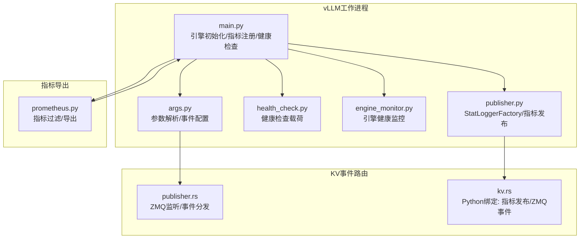
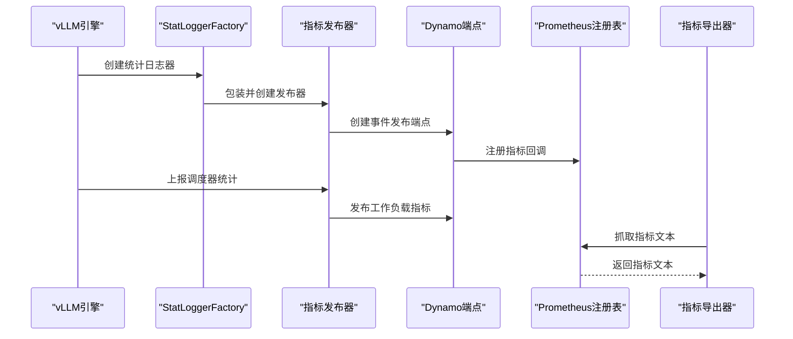
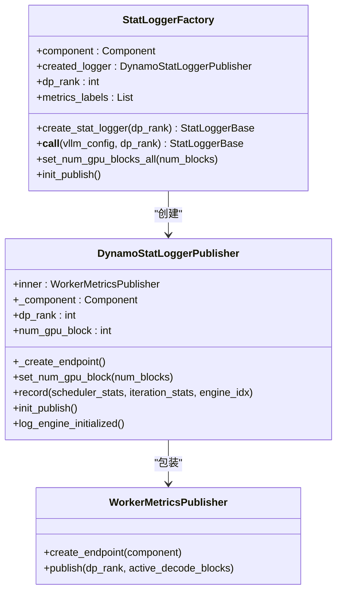
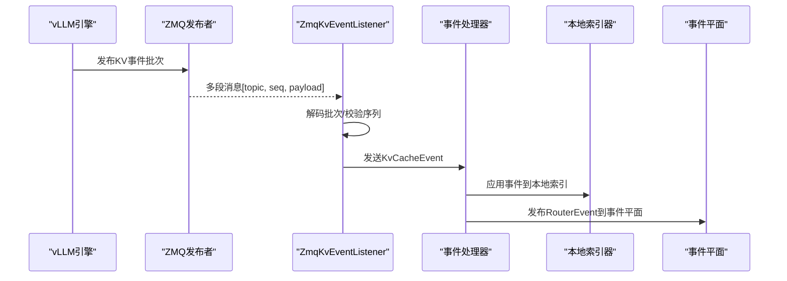
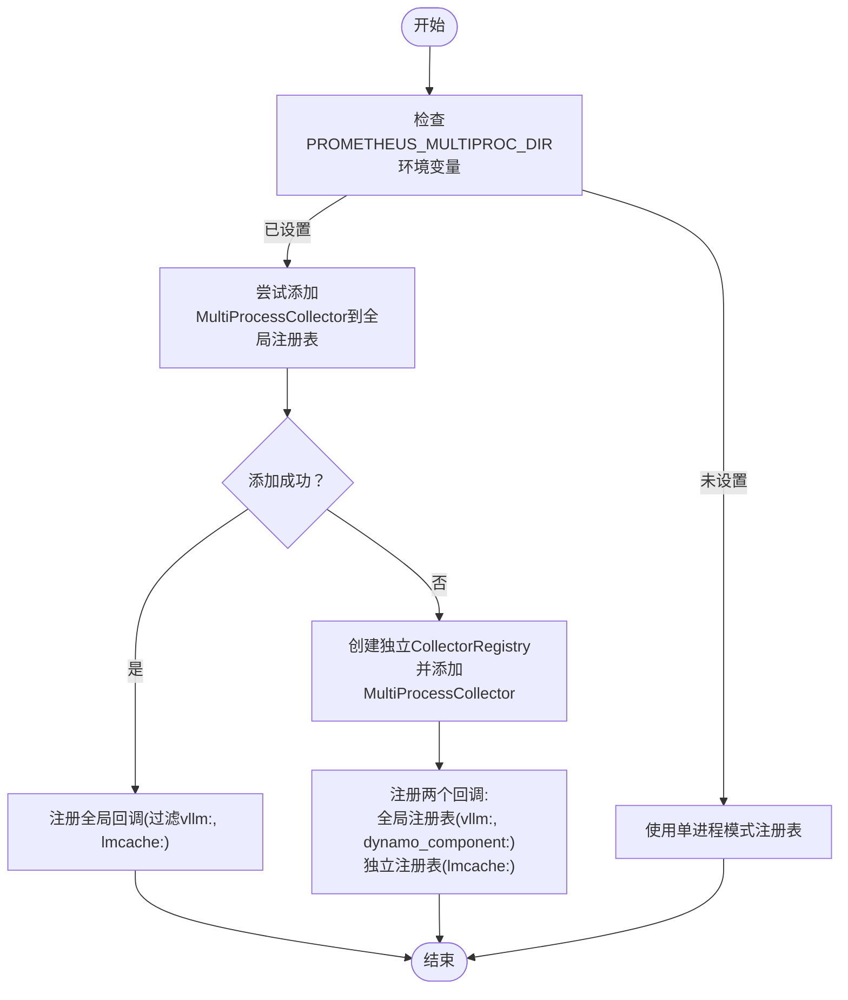
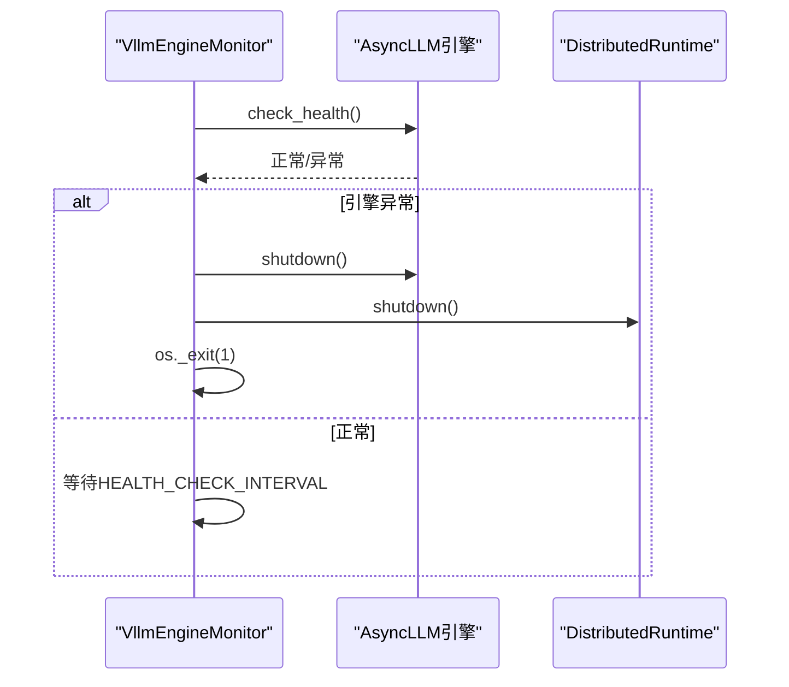
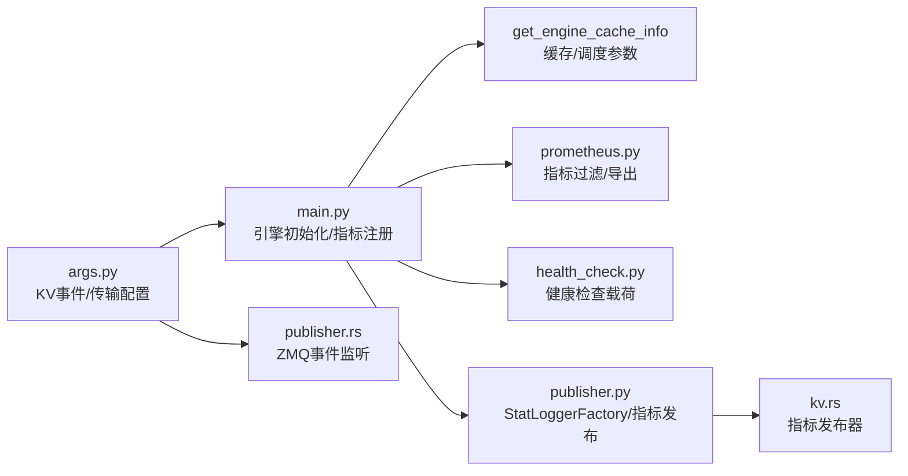

# 引擎监控与指标收集

<cite>
**本文档引用的文件**
- [engine_monitor.py](file://components/src/dynamo/vllm/engine_monitor.py)
- [health_check.py](file://components/src/dynamo/vllm/health_check.py)
- [publisher.py](file://components/src/dynamo/vllm/publisher.py)
- [main.py](file://components/src/dynamo/vllm/main.py)
- [args.py](file://components/src/dynamo/vllm/args.py)
- [prometheus.py](file://components/src/dynamo/common/utils/prometheus.py)
- [publisher.rs](file://lib/llm/src/kv_router/publisher.rs)
- [kv.rs](file://lib/bindings/python/rust/llm/kv.rs)
</cite>

## 目录
1. [简介](#简介)
2. [项目结构](#项目结构)
3. [核心组件](#核心组件)
4. [架构总览](#架构总览)
5. [详细组件分析](#详细组件分析)
6. [依赖关系分析](#依赖关系分析)
7. [性能考虑](#性能考虑)
8. [故障排查指南](#故障排查指南)
9. [结论](#结论)
10. [附录：监控配置示例](#附录监控配置示例)

## 简介
本文件面向vLLM引擎的监控与指标收集体系，系统性阐述以下主题：
- 缓存信息获取（get_engine_cache_info）与运行时配置同步
- 性能指标采集与导出（含多进程Prometheus支持）
- StatLoggerFactory设计架构（统计日志生成、指标聚合与发布）
- ZmqKvEventPublisher实现（KV事件监听、缓存状态跟踪与事件传播）
- 多进程指标收集策略（临时目录管理与冲突解决）
- 健康检查机制（引擎状态检测、响应时间监控与故障告警）
- 监控配置示例（指标导出、告警规则与性能基线）

## 项目结构
vLLM监控相关代码主要集中在以下模块：
- vLLM工作进程：负责引擎初始化、指标注册、KV事件发布与健康检查
- Prometheus工具：统一的指标过滤与导出工具
- KV事件路由：Rust侧ZMQ事件监听与全局分发
- Python绑定：指标发布器与KV事件发布器的Python接口

**图表来源**
- [main.py](file://components/src/dynamo/vllm/main.py#L154-L210)
- [publisher.py](file://components/src/dynamo/vllm/publisher.py#L81-L116)
- [health_check.py](file://components/src/dynamo/vllm/health_check.py#L82-L121)
- [engine_monitor.py](file://components/src/dynamo/vllm/engine_monitor.py#L23-L82)
- [args.py](file://components/src/dynamo/vllm/args.py#L470-L507)
- [prometheus.py](file://components/src/dynamo/common/utils/prometheus.py#L28-L77)
- [publisher.rs](file://lib/llm/src/kv_router/publisher.rs#L403-L532)
- [kv.rs](file://lib/bindings/python/rust/llm/kv.rs#L58-L102)

**章节来源**
- [main.py](file://components/src/dynamo/vllm/main.py#L154-L210)
- [publisher.py](file://components/src/dynamo/vllm/publisher.py#L81-L116)
- [health_check.py](file://components/src/dynamo/vllm/health_check.py#L82-L121)
- [engine_monitor.py](file://components/src/dynamo/vllm/engine_monitor.py#L23-L82)
- [args.py](file://components/src/dynamo/vllm/args.py#L470-L507)
- [prometheus.py](file://components/src/dynamo/common/utils/prometheus.py#L28-L77)
- [publisher.rs](file://lib/llm/src/kv_router/publisher.rs#L403-L532)
- [kv.rs](file://lib/bindings/python/rust/llm/kv.rs#L58-L102)

## 核心组件
- 引擎缓存信息获取：从vLLM配置中提取GPU块数、最大并发序列数、批处理令牌上限等关键运行时参数，用于注册模型运行时配置。
- StatLoggerFactory：工厂模式创建指标发布器，适配vLLM统计日志接口，将调度器统计转换为工作负载指标并发布到事件平面。
- Prometheus指标注册：在多进程模式下自动选择合适的Collector，避免重复时间序列；支持过滤特定前缀指标并统一导出。
- ZmqKvEventPublisher：基于ZMQ订阅vLLM发布的KV事件，转换为内部事件格式后通过事件平面进行全局分发或本地索引。
- 健康检查：根据是否使用tokenizer输入构造不同格式的健康检查载荷，确保引擎可用性验证。

**章节来源**
- [main.py](file://components/src/dynamo/vllm/main.py#L676-L700)
- [publisher.py](file://components/src/dynamo/vllm/publisher.py#L81-L116)
- [prometheus.py](file://components/src/dynamo/common/utils/prometheus.py#L28-L77)
- [publisher.rs](file://lib/llm/src/kv_router/publisher.rs#L403-L532)
- [health_check.py](file://components/src/dynamo/vllm/health_check.py#L82-L121)

## 架构总览
vLLM监控体系由“引擎侧指标采集”、“指标导出服务”和“事件路由与KV缓存状态跟踪”三部分组成。引擎启动时创建指标发布器与KV事件发布器，注册Prometheus回调以统一导出；同时通过健康检查保障引擎可用性。

**图表来源**
- [publisher.py](file://components/src/dynamo/vllm/publisher.py#L34-L79)
- [main.py](file://components/src/dynamo/vllm/main.py#L154-L210)
- [prometheus.py](file://components/src/dynamo/common/utils/prometheus.py#L28-L77)

## 详细组件分析

### 组件A：StatLoggerFactory与指标发布
- 设计要点
  - 工厂方法按数据并行rank创建对应的StatLogger实例，非leader节点返回空日志器以避免重复发布。
  - DynamoStatLoggerPublisher包装底层指标发布器，异步创建事件端点并在记录时将KV缓存使用率转换为活跃解码块数。
  - 提供set_num_gpu_blocks_all与init_publish辅助方法，确保在引擎配置就绪后发布初始状态。
- 关键流程
  - 初始化：创建工厂实例，传入组件、dp_rank与指标标签。
  - 创建：create_stat_logger根据dp_rank判断是否返回有效日志器。
  - 记录：record将scheduler_stats.kv_cache_usage转换为活跃块数并发布。
  - 导出：setup_metrics_collection注册回调，统一导出vLLM与Dynamo指标。

**图表来源**
- [publisher.py](file://components/src/dynamo/vllm/publisher.py#L81-L116)
- [publisher.py](file://components/src/dynamo/vllm/publisher.py#L34-L79)
- [kv.rs](file://lib/bindings/python/rust/llm/kv.rs#L58-L102)

**章节来源**
- [publisher.py](file://components/src/dynamo/vllm/publisher.py#L81-L116)
- [publisher.py](file://components/src/dynamo/vllm/publisher.py#L34-L79)
- [kv.rs](file://lib/bindings/python/rust/llm/kv.rs#L58-L102)

### 组件B：KV事件监听与传播（ZmqKvEventPublisher）
- 功能概述
  - 通过ZMQ订阅vLLM发布的KV事件，按批次解码为内部事件结构，支持本地索引与全局事件平面分发。
  - 支持指数退避与错误计数，防止网络抖动导致的资源浪费。
- 关键流程
  - 连接：订阅指定topic，连接到ZMQ端点。
  - 接收：接收multipart帧，校验长度与序列号，解码为事件批次。
  - 转换：将原始事件转换为内部KvCacheEvent并发送到通道。
  - 分发：事件处理器先写入本地索引器，再发布到事件平面（NATS JetStream或事件平面）。

**图表来源**
- [publisher.rs](file://lib/llm/src/kv_router/publisher.rs#L403-L532)
- [publisher.rs](file://lib/llm/src/kv_router/publisher.rs#L304-L393)
- [kv.rs](file://lib/bindings/python/rust/llm/kv.rs#L174-L241)

**章节来源**
- [publisher.rs](file://lib/llm/src/kv_router/publisher.rs#L403-L532)
- [publisher.rs](file://lib/llm/src/kv_router/publisher.rs#L304-L393)
- [kv.rs](file://lib/bindings/python/rust/llm/kv.rs#L174-L241)

### 组件C：多进程指标收集与冲突解决
- 多进程支持
  - 在PROMETHEUS_MULTIPROC_DIR已设置的情况下，尝试向全局注册表添加MultiProcessCollector；若出现重复时间序列冲突，则使用独立CollectorRegistry仅读取磁盘.db文件，同时保留全局注册表中的内存指标。
- 指标过滤与导出
  - 通过register_engine_metrics_callback注册回调，在/metrics端点抓取指标文本；支持按前缀过滤、排除特定前缀与添加前缀等操作。

**图表来源**
- [main.py](file://components/src/dynamo/vllm/main.py#L154-L210)
- [prometheus.py](file://components/src/dynamo/common/utils/prometheus.py#L28-L77)

**章节来源**
- [main.py](file://components/src/dynamo/vllm/main.py#L154-L210)
- [prometheus.py](file://components/src/dynamo/common/utils/prometheus.py#L28-L77)

### 组件D：健康检查与引擎监控
- 健康检查载荷
  - 根据是否使用tokenizer输入构造不同格式的请求载荷，优先从引擎tokenizer提取BOS token ID，否则回退为默认值。
- 引擎监控
  - 定期调用check_health，捕获EngineDeadError后触发引擎与运行时关闭，并安全退出进程。

**图表来源**
- [engine_monitor.py](file://components/src/dynamo/vllm/engine_monitor.py#L68-L82)
- [health_check.py](file://components/src/dynamo/vllm/health_check.py#L82-L121)

**章节来源**
- [engine_monitor.py](file://components/src/dynamo/vllm/engine_monitor.py#L68-L82)
- [health_check.py](file://components/src/dynamo/vllm/health_check.py#L82-L121)

## 依赖关系分析
- vLLM引擎配置与运行时参数
  - 通过get_engine_cache_info从vLLM配置中提取缓存与调度参数，用于注册模型运行时配置。
- KV事件配置
  - 通过args.py中的create_kv_events_config与create_kv_transfer_config生成事件与传输配置，决定是否启用前缀缓存与事件发布。
- 指标导出
  - main.py中的setup_metrics_collection与prometheus.py中的get_prometheus_expfmt共同完成指标过滤与导出。

**图表来源**
- [args.py](file://components/src/dynamo/vllm/args.py#L470-L507)
- [main.py](file://components/src/dynamo/vllm/main.py#L676-L700)
- [prometheus.py](file://components/src/dynamo/common/utils/prometheus.py#L108-L240)
- [publisher.py](file://components/src/dynamo/vllm/publisher.py#L81-L116)
- [publisher.rs](file://lib/llm/src/kv_router/publisher.rs#L403-L532)
- [kv.rs](file://lib/bindings/python/rust/llm/kv.rs#L58-L102)

**章节来源**
- [args.py](file://components/src/dynamo/vllm/args.py#L470-L507)
- [main.py](file://components/src/dynamo/vllm/main.py#L676-L700)
- [prometheus.py](file://components/src/dynamo/common/utils/prometheus.py#L108-L240)
- [publisher.py](file://components/src/dynamo/vllm/publisher.py#L81-L116)
- [publisher.rs](file://lib/llm/src/kv_router/publisher.rs#L403-L532)
- [kv.rs](file://lib/bindings/python/rust/llm/kv.rs#L58-L102)

## 性能考虑
- 指标导出延迟：引擎指标在初始化后才可采集，Dynamo运行时指标初始化即可用，建议在/metrics端点抓取时区分两类指标来源。
- 多进程冲突：在K8s等环境中PROMETHEUS_MULTIPROC_DIR可能提前设置，需采用独立注册表策略避免重复时间序列。
- KV事件处理：ZMQ监听采用指数退避与错误计数，降低网络抖动对系统的影响；本地索引器可提升事件处理的可靠性与可观测性。

[本节为通用指导，无需具体文件引用]

## 故障排查指南
- 引擎崩溃处理
  - 当check_health抛出EngineDeadError时，监控器会调用引擎shutdown并关闭运行时，随后进程退出。可通过日志定位traceback并检查资源释放。
- 指标导出异常
  - 若出现重复时间序列错误，确认是否已在进程启动前设置了PROMETHEUS_MULTIPROC_DIR；如已设置，采用独立注册表方案。
- KV事件丢失
  - 检查ZMQ端点连通性与订阅topic；关注指数退避日志，确认是否存在持续错误导致监听终止。

**章节来源**
- [engine_monitor.py](file://components/src/dynamo/vllm/engine_monitor.py#L68-L82)
- [main.py](file://components/src/dynamo/vllm/main.py#L154-L210)
- [publisher.rs](file://lib/llm/src/kv_router/publisher.rs#L403-L532)

## 结论
vLLM监控体系通过StatLoggerFactory与指标发布器实现对调度器统计的采集与发布，结合多进程Prometheus支持与统一导出工具，形成完整的指标生态。ZMQ事件监听与事件平面分发确保KV缓存状态的实时可见性，健康检查与引擎监控则保障引擎可用性与稳定性。配合合理的监控配置与告警策略，可构建完善的观测体系。

[本节为总结性内容，无需具体文件引用]

## 附录：监控配置示例
- 指标导出
  - 使用register_engine_metrics_callback注册回调，过滤vllm与lmcache指标，或添加前缀以区分不同后端。
- 告警规则
  - 基于/vllm:request_success_total与/vllm:time_to_first_token_seconds等指标设置成功率阈值与延迟告警。
- 性能基线
  - 结合get_engine_cache_info提供的num_gpu_blocks、max_num_seqs与max_num_batched_tokens，设定工作负载基线与容量规划。

**章节来源**
- [prometheus.py](file://components/src/dynamo/common/utils/prometheus.py#L28-L77)
- [main.py](file://components/src/dynamo/vllm/main.py#L154-L210)
- [health_check.py](file://components/src/dynamo/vllm/health_check.py#L82-L121)
- [engine_monitor.py](file://components/src/dynamo/vllm/engine_monitor.py#L23-L82)
- [args.py](file://components/src/dynamo/vllm/args.py#L470-L507)