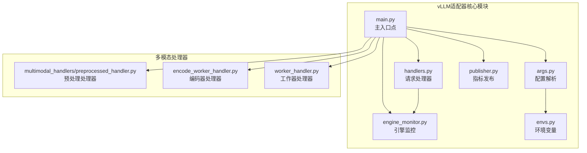
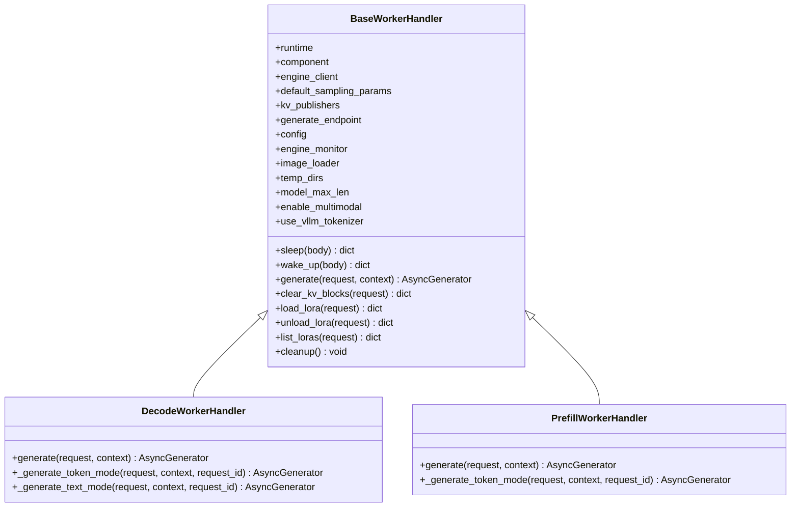
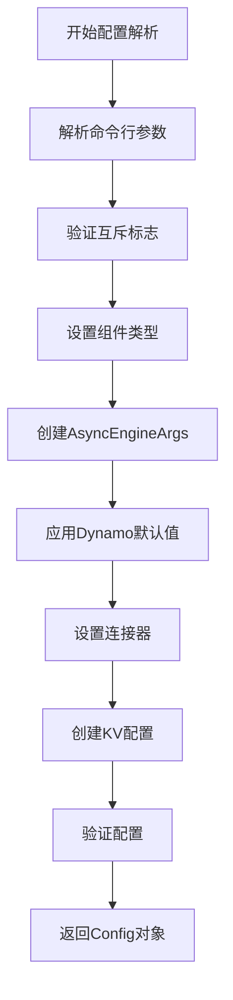
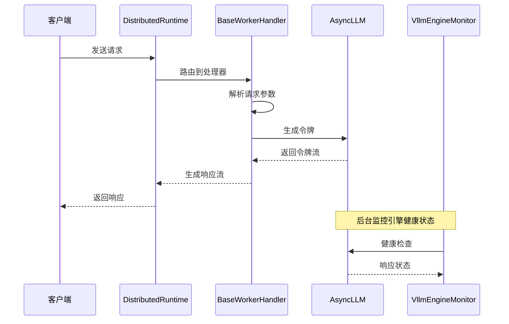
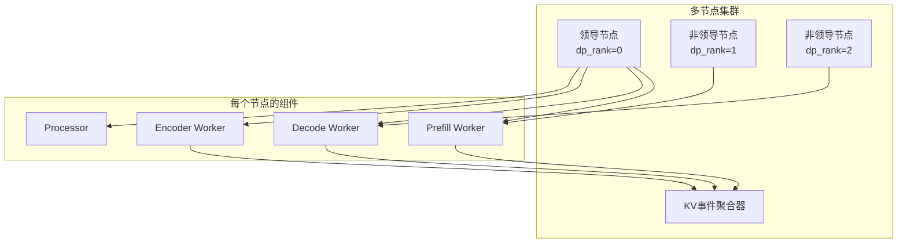
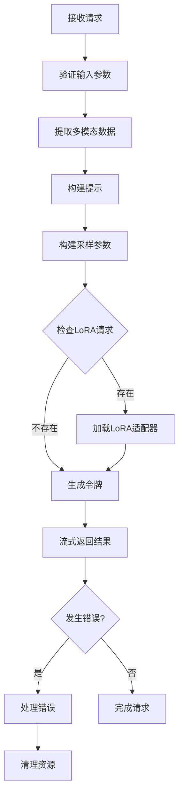
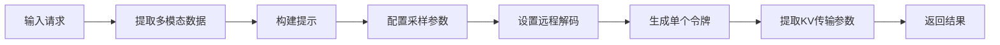
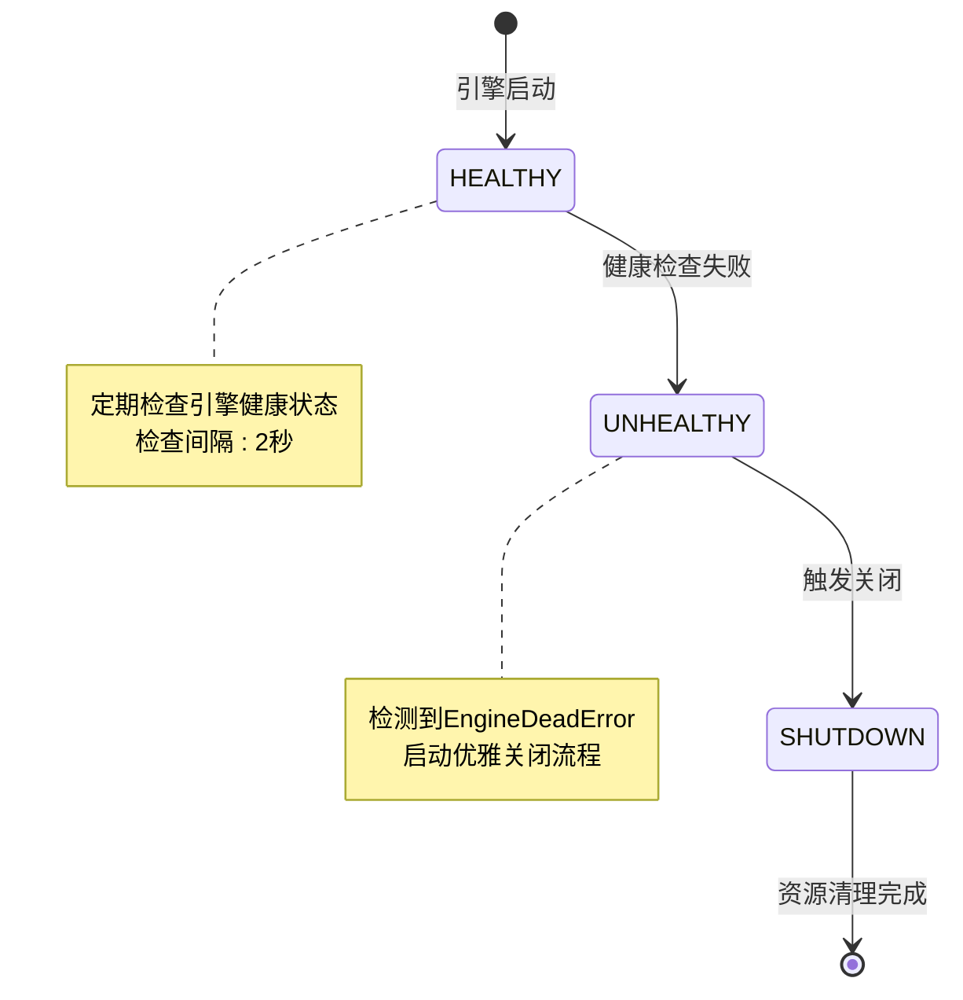
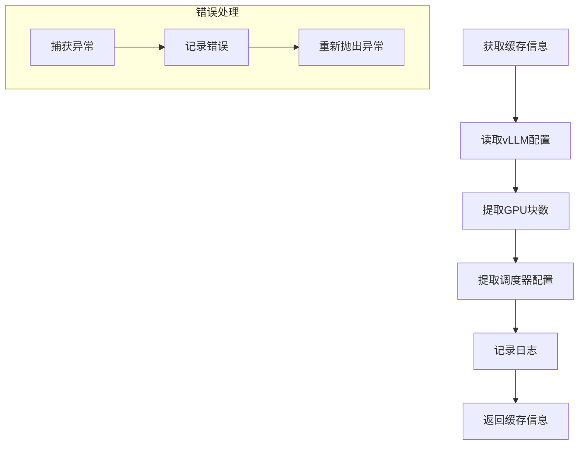
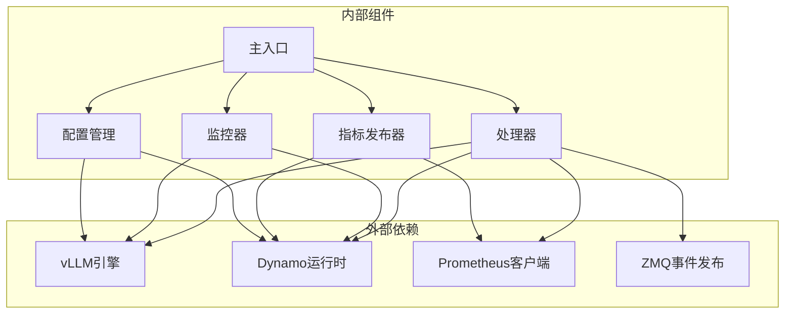

# 核心适配器实现

<cite>
**本文档引用的文件**
- [main.py](file://components/src/dynamo/vllm/main.py)
- [handlers.py](file://components/src/dynamo/vllm/handlers.py)
- [args.py](file://components/src/dynamo/vllm/args.py)
- [engine_monitor.py](file://components/src/dynamo/vllm/engine_monitor.py)
- [envs.py](file://components/src/dynamo/vllm/envs.py)
- [publisher.py](file://components/src/dynamo/vllm/publisher.py)
- [preprocessed_handler.py](file://components/src/dynamo/vllm/multimodal_handlers/preprocessed_handler.py)
</cite>

## 目录
1. [简介](#简介)
2. [项目结构](#项目结构)
3. [核心组件](#核心组件)
4. [架构概览](#架构概览)
5. [详细组件分析](#详细组件分析)
6. [依赖关系分析](#依赖关系分析)
7. [性能考虑](#性能考虑)
8. [故障排除指南](#故障排除指南)
9. [结论](#结论)

## 简介

本文档深入分析了vLLM核心适配器实现，这是一个为Dynamo平台集成vLLM引擎而设计的完整解决方案。该适配器实现了从配置解析到引擎初始化、组件注册和端点服务设置的完整工作流程，支持多种部署模式和高级功能。

该实现特别关注以下关键特性：
- 多节点部署支持和非领导节点处理
- 前缀缓存和KV事件发布机制
- 动态LoRA适配器加载和卸载
- 文本输入/输出模式的灵活切换
- 优雅的关闭机制和资源管理
- 监控和指标收集系统

## 项目结构

vLLM适配器位于`components/src/dynamo/vllm/`目录下，采用模块化设计，每个模块负责特定的功能领域：

**图表来源**
- [main.py](file://components/src/dynamo/vllm/main.py#L1-L150)
- [handlers.py](file://components/src/dynamo/vllm/handlers.py#L1-L100)
- [args.py](file://components/src/dynamo/vllm/args.py#L1-L100)

**章节来源**
- [main.py](file://components/src/dynamo/vllm/main.py#L1-L150)
- [handlers.py](file://components/src/dynamo/vllm/handlers.py#L1-L100)
- [args.py](file://components/src/dynamo/vllm/args.py#L1-L100)

## 核心组件

### 主入口点系统

主入口点`worker()`函数是整个适配器的核心协调器，负责：

1. **配置解析和验证**：通过`parse_args()`解析命令行参数
2. **运行时初始化**：创建DistributedRuntime实例
3. **信号处理**：设置优雅关闭的信号处理器
4. **模型下载**：自动下载必要的模型文件
5. **组件路由**：根据配置选择合适的初始化路径

### 请求处理器架构

系统实现了基于抽象基类的处理器架构：

**图表来源**
- [handlers.py](file://components/src/dynamo/vllm/handlers.py#L230-L370)
- [handlers.py](file://components/src/dynamo/vllm/handlers.py#L1180-L1387)
- [handlers.py](file://components/src/dynamo/vllm/handlers.py#L1389-L1540)

### 配置管理系统

配置系统采用分层设计，支持多种配置源：

**图表来源**
- [args.py](file://components/src/dynamo/vllm/args.py#L110-L467)
- [args.py](file://components/src/dynamo/vllm/args.py#L559-L605)

**章节来源**
- [main.py](file://components/src/dynamo/vllm/main.py#L76-L152)
- [handlers.py](file://components/src/dynamo/vllm/handlers.py#L230-L370)
- [args.py](file://components/src/dynamo/vllm/args.py#L110-L467)

## 架构概览

vLLM适配器采用分层架构设计，实现了完整的请求生命周期管理：

**图表来源**
- [main.py](file://components/src/dynamo/vllm/main.py#L530-L674)
- [handlers.py](file://components/src/dynamo/vllm/handlers.py#L1088-L1178)
- [engine_monitor.py](file://components/src/dynamo/vllm/engine_monitor.py#L68-L82)

### 多节点部署架构

系统支持复杂的多节点部署场景：

**图表来源**
- [main.py](file://components/src/dynamo/vllm/main.py#L51-L62)
- [main.py](file://components/src/dynamo/vllm/main.py#L418-L528)

**章节来源**
- [main.py](file://components/src/dynamo/vllm/main.py#L51-L62)
- [main.py](file://components/src/dynamo/vllm/main.py#L418-L528)

## 详细组件分析

### DecodeWorkerHandler 实现分析

DecodeWorkerHandler专门处理解码阶段的请求，具有以下特点：

#### 请求处理逻辑

1. **双模式支持**：
   - 令牌输入/输出模式（内部协议）
   - 文本输入/文本输出模式（OpenAI兼容）

2. **LoRA适配器管理**：
   - 并发加载保护
   - 自动发现和注册
   - 动态卸载支持

#### 错误处理机制

**图表来源**
- [handlers.py](file://components/src/dynamo/vllm/handlers.py#L1205-L1301)
- [handlers.py](file://components/src/dynamo/vllm/handlers.py#L1302-L1386)

#### 资源管理

- **临时目录管理**：自动清理Prometheus相关临时文件
- **内存优化**：使用锁机制防止并发加载冲突
- **异常安全**：确保在异常情况下正确释放资源

**章节来源**
- [handlers.py](file://components/src/dynamo/vllm/handlers.py#L1180-L1387)

### PrefillWorkerHandler 实现分析

PrefillWorkerHandler专注于预填充阶段的处理，有其独特的实现要求：

#### 请求处理差异

1. **固定令牌生成**：预填充阶段只生成1个令牌
2. **KV传输参数**：配置远程解码参数
3. **断言处理**：不支持请求迁移

#### 关键实现特点

**图表来源**
- [handlers.py](file://components/src/dynamo/vllm/handlers.py#L1414-L1540)

#### 错误处理特殊性

- **不可迁移性**：预填充请求不支持迁移，需要立即返回
- **资源清理**：确保在任何情况下都正确清理资源
- **状态同步**：与解码阶段的状态保持一致

**章节来源**
- [handlers.py](file://components/src/dynamo/vllm/handlers.py#L1389-L1540)

### 配置系统详解

#### 命令行参数配置

配置系统支持丰富的命令行参数：

| 参数类别 | 关键参数 | 描述 |
|---------|----------|------|
| 基础配置 | `--is-prefill-worker` | 启用预填充功能 |
| | `--migration-limit` | 请求迁移限制 |
| | `--connector` | 连接器列表 |
| 多模态 | `--enable-multimodal` | 启用多模态处理 |
| | `--multimodal-worker` | 多模态工作器 |
| 环境 | `--store-kv` | 键值存储后端 |
| | `--request-plane` | 请求平面选择 |
| | `--event-plane` | 事件平面选择 |

#### 引擎参数管理

系统自动管理vLLM引擎参数：

1. **默认值覆盖**：应用Dynamo特定的默认值
2. **连接器集成**：根据连接器类型配置KV传输
3. **事件配置**：设置前缀缓存事件发布

**章节来源**
- [args.py](file://components/src/dynamo/vllm/args.py#L110-L467)
- [args.py](file://components/src/dynamo/vllm/args.py#L559-L605)

### 引擎监控机制

VllmEngineMonitor提供了全面的引擎健康监控：

**图表来源**
- [engine_monitor.py](file://components/src/dynamo/vllm/engine_monitor.py#L23-L82)

#### 监控特性

- **自动健康检查**：每2秒检查一次引擎状态
- **超时保护**：关闭操作最多等待30秒
- **进程终止**：监控任务结束后终止进程

**章节来源**
- [engine_monitor.py](file://components/src/dynamo/vllm/engine_monitor.py#L1-L82)

### 缓存信息获取和运行时配置同步

系统提供了完整的缓存信息获取机制：

**图表来源**
- [main.py](file://components/src/dynamo/vllm/main.py#L676-L700)

**章节来源**
- [main.py](file://components/src/dynamo/vllm/main.py#L676-L700)

## 依赖关系分析

### 组件耦合度分析

**图表来源**
- [main.py](file://components/src/dynamo/vllm/main.py#L1-L50)
- [handlers.py](file://components/src/dynamo/vllm/handlers.py#L1-L50)

### 关键依赖链

1. **配置依赖**：所有组件都依赖于Config对象
2. **引擎依赖**：处理器直接依赖AsyncLLM引擎
3. **运行时依赖**：监控器和发布器依赖DistributedRuntime
4. **外部接口**：ZMQ事件发布和Prometheus指标收集

**章节来源**
- [main.py](file://components/src/dynamo/vllm/main.py#L1-L50)
- [handlers.py](file://components/src/dynamo/vllm/handlers.py#L1-L50)

## 性能考虑

### 内存管理优化

1. **临时目录清理**：自动清理Prometheus相关临时文件
2. **LoRA适配器缓存**：避免重复加载相同适配器
3. **并发控制**：使用锁机制防止竞态条件

### 网络通信优化

1. **连接器选择**：根据部署需求选择最优连接器
2. **事件发布优化**：批量发布KV事件减少网络开销
3. **指标收集**：异步指标发布避免阻塞主请求处理

### 扩展性设计

- **插件架构**：支持动态加载新的连接器
- **多模态扩展**：可轻松添加新的多模态数据类型
- **监控扩展**：支持自定义监控指标

## 故障排除指南

### 常见问题诊断

#### 引擎健康问题

**症状**：引擎频繁崩溃或响应缓慢
**诊断步骤**：
1. 检查VllmEngineMonitor日志
2. 验证GPU内存使用情况
3. 检查连接器配置

**解决方法**：
- 调整批处理大小
- 优化采样参数
- 检查模型文件完整性

#### 多模态处理问题

**症状**：图像加载失败或格式错误
**诊断步骤**：
1. 验证图像URL可达性
2. 检查图像格式支持
3. 确认多模态标志已启用

**解决方法**：
- 使用支持的图像格式
- 检查网络连接
- 验证文件权限

#### LoRA适配器问题

**症状**：LoRA加载失败或无法卸载
**诊断步骤**：
1. 检查LoRA文件路径
2. 验证URI格式正确性
3. 确认并发加载锁状态

**解决方法**：
- 重新下载LoRA文件
- 检查文件完整性
- 清理锁定状态

**章节来源**
- [engine_monitor.py](file://components/src/dynamo/vllm/engine_monitor.py#L68-L82)
- [handlers.py](file://components/src/dynamo/vllm/handlers.py#L392-L734)

## 结论

vLLM核心适配器实现了一个功能完整、性能优异的推理引擎集成方案。该实现的关键优势包括：

1. **模块化设计**：清晰的组件分离和职责划分
2. **多部署模式支持**：灵活支持单节点和多节点部署
3. **高级功能集成**：LoRA适配器、多模态处理、前缀缓存等
4. **监控和可观测性**：完善的健康监控和指标收集
5. **错误处理机制**：健壮的异常处理和恢复策略

该适配器为Dynamo平台提供了可靠的vLLM引擎集成基础，支持各种生产环境需求，包括大规模部署、高可用性和性能优化。