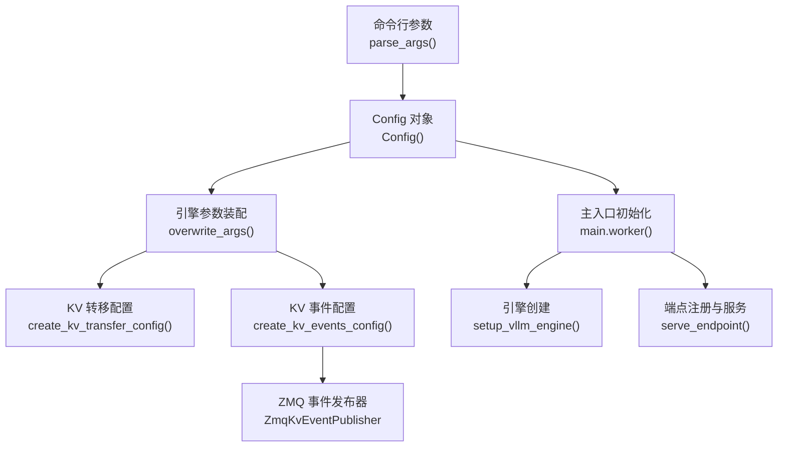
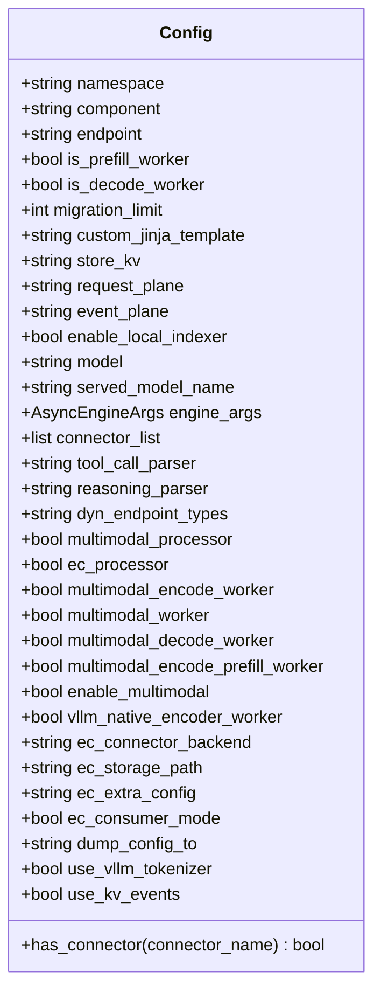
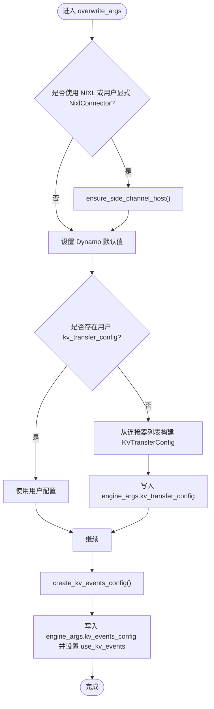
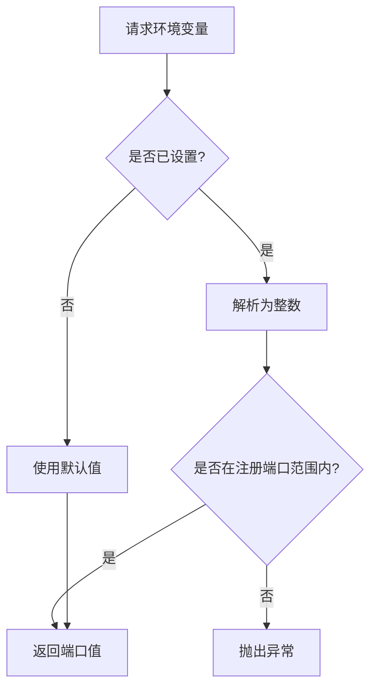
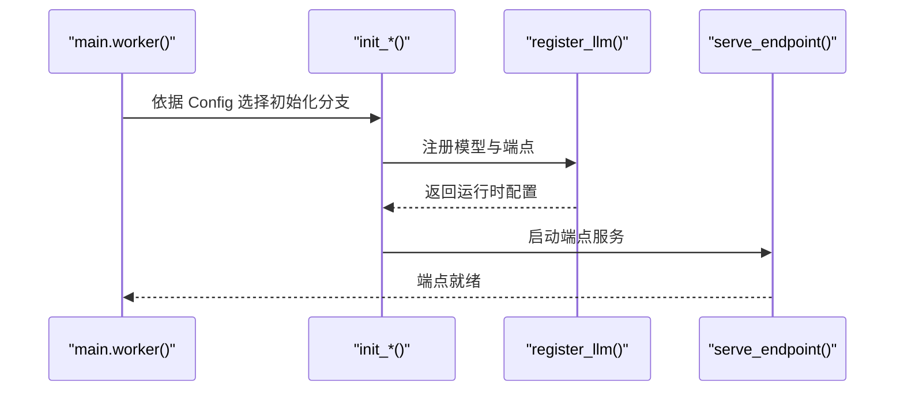
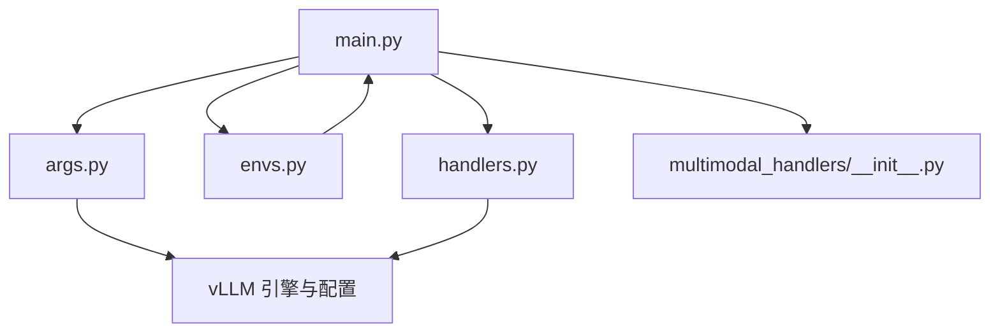

# 配置管理与参数系统

<cite>
**本文引用的文件**
- [args.py](file://components/src/dynamo/vllm/args.py)
- [envs.py](file://components/src/dynamo/vllm/envs.py)
- [main.py](file://components/src/dynamo/vllm/main.py)
- [handlers.py](file://components/src/dynamo/vllm/handlers.py)
- [multimodal_handlers/__init__.py](file://components/src/dynamo/vllm/multimodal_handlers/__init__.py)
</cite>

## 目录
1. [简介](#简介)
2. [项目结构](#项目结构)
3. [核心组件](#核心组件)
4. [架构总览](#架构总览)
5. [详细组件分析](#详细组件分析)
6. [依赖关系分析](#依赖关系分析)
7. [性能考量](#性能考量)
8. [故障排查指南](#故障排查指南)
9. [结论](#结论)
10. [附录：配置示例](#附录配置示例)

## 简介
本文件面向 vLLM 后端在 Dynamo 平台中的配置管理与参数系统，系统性阐述以下内容：
- Config 类的设计与职责边界，包括参数解析、默认值设置与校验
- engine_args 的配置选项与行为（模型参数、调度参数、缓存配置、性能调优）
- 环境变量管理系统（envs），包括运行时检测、配置覆盖与动态调整
- 命令行参数优先级与合并策略（配置文件、环境变量、命令行）
- 多模态配置的特殊处理（媒体类型检测、编码器参数、处理器配置）
- 实战配置示例（基础、高级调优、故障排查）

## 项目结构
vLLM 配置与参数系统主要由以下模块构成：
- 参数解析与配置对象：args.py 中的 Config 类与 parse_args 函数
- 引擎参数装配与默认值覆盖：args.py 中的 overwrite_args 与 create_*_config 工具函数
- 运行时环境变量：envs.py 提供端口等环境变量的集中化访问
- 主入口与初始化流程：main.py 负责解析参数、设置默认值、初始化引擎与服务端点
- 请求处理与采样参数构建：handlers.py 负责从请求中提取采样参数并适配 vLLM
- 多模态组件导出：multimodal_handlers/__init__.py 汇总多模态处理器



图表来源
- [args.py](file://components/src/dynamo/vllm/args.py#L110-L467)
- [args.py](file://components/src/dynamo/vllm/args.py#L559-L605)
- [args.py](file://components/src/dynamo/vllm/args.py#L509-L556)
- [args.py](file://components/src/dynamo/vllm/args.py#L470-L507)
- [main.py](file://components/src/dynamo/vllm/main.py#L76-L151)
- [main.py](file://components/src/dynamo/vllm/main.py#L289-L361)
- [main.py](file://components/src/dynamo/vllm/main.py#L212-L286)

章节来源
- [args.py](file://components/src/dynamo/vllm/args.py#L110-L467)
- [main.py](file://components/src/dynamo/vllm/main.py#L76-L151)

## 核心组件
- Config 类：封装所有可配置项，包括 Dynamo 特定参数、vLLM 模型参数、多模态开关、连接器列表、工具与推理解析器、端点类型、KV 事件与存储平面等。
- parse_args：使用 FlexibleArgumentParser 解析命令行参数，并将结果映射到 Config；同时对多模态角色互斥、自定义模板路径存在性、连接器合法性进行严格校验。
- overwrite_args：为 vLLM 设置 Dynamo 默认值，注入 KV 转移与事件配置，并根据连接器或用户显式配置推断 use_kv_events。
- create_kv_transfer_config / create_kv_events_config：基于连接器列表或用户配置生成 KV 转移与事件配置对象。
- envs：集中化环境变量访问，提供端口解析与范围校验。

章节来源
- [args.py](file://components/src/dynamo/vllm/args.py#L30-L107)
- [args.py](file://components/src/dynamo/vllm/args.py#L110-L467)
- [args.py](file://components/src/dynamo/vllm/args.py#L559-L605)
- [args.py](file://components/src/dynamo/vllm/args.py#L509-L556)
- [args.py](file://components/src/dynamo/vllm/args.py#L470-L507)
- [envs.py](file://components/src/dynamo/vllm/envs.py#L57-L83)

## 架构总览
下图展示从命令行到引擎初始化的关键流程，以及环境变量与配置对象之间的交互。

```mermaid
sequenceDiagram
participant CLI as "命令行"
participant Parser as "parse_args()"
participant CFG as "Config"
participant Over as "overwrite_args()"
participant KVT as "create_kv_transfer_config()"
participant KVE as "create_kv_events_config()"
participant Main as "main.worker()"
participant Eng as "setup_vllm_engine()"
CLI->>Parser : 解析参数
Parser->>CFG : 构造 Config 对象
Parser->>Over : 调用 overwrite_args()
Over->>KVT : 生成 KV 转移配置
Over->>KVE : 生成 KV 事件配置
Over-->>CFG : 注入默认值与配置
Main->>Eng : 初始化 vLLM 引擎
Eng-->>Main : 返回引擎客户端与配置
```

图表来源
- [args.py](file://components/src/dynamo/vllm/args.py#L110-L467)
- [args.py](file://components/src/dynamo/vllm/args.py#L559-L605)
- [args.py](file://components/src/dynamo/vllm/args.py#L509-L556)
- [args.py](file://components/src/dynamo/vllm/args.py#L470-L507)
- [main.py](file://components/src/dynamo/vllm/main.py#L76-L151)
- [main.py](file://components/src/dynamo/vllm/main.py#L289-L361)

## 详细组件分析

### Config 类与参数解析
- 设计要点
  - 字段覆盖 Dynamo 特定参数（命名空间、组件、端点、工作角色、迁移限制、模板、索引器等）与 vLLM 模型参数（模型名、服务模型名）。
  - 包含多模态相关字段（处理器、编码器、解码器、统一编码预填充、提示模板、vLLM 原生编码器模式等）。
  - 提供 has_connector 辅助方法判断连接器是否启用。
- 解析逻辑
  - 使用 FlexibleArgumentParser 添加 Dynamo 专属参数与 vLLM AsyncEngineArgs 的 CLI 参数。
  - 对多模态角色进行互斥校验，要求仅能启用一个相关标志；若启用多模态处理，则必须显式开启 enable_multimodal。
  - 自定义 Jinja 模板路径存在性校验与环境变量/波浪号展开。
  - 连接器列表合法性校验，禁止与 none/null 组合其他连接器；当提供 kv_transfer_config 时禁止同时指定 connector。
  - 为 block_size 设置合理默认值。
- 默认值与覆盖
  - overwrite_args 为 vLLM 设置 Dynamo 默认值（如 runner、skip_tokenizer_init、日志开关等），并注入 KV 转移与事件配置。
  - 若使用 NIXL 连接器且分布式执行后端未设置，TP=1 时强制使用 mp 后端以避免 GIL 竞态问题。
  - prefix caching 未显式设置时，默认启用（保持 vLLM v1 行为）。



图表来源
- [args.py](file://components/src/dynamo/vllm/args.py#L30-L107)

章节来源
- [args.py](file://components/src/dynamo/vllm/args.py#L110-L467)
- [args.py](file://components/src/dynamo/vllm/args.py#L559-L605)

### 引擎参数装配与默认值覆盖
- overwrite_args
  - 为 vLLM 设置 Dynamo 默认值（runner、skip_tokenizer_init、日志开关等）。
  - 根据连接器列表或用户提供的 kv_transfer_config 创建 KV 转移配置；若启用 NIXL 或用户显式使用 NixlConnector，确保侧通道主机可用。
  - 基于前缀缓存与事件配置生成 KV 事件配置，并据此推断 use_kv_events。
- KV 转移配置
  - 支持单连接器（lmcache、nixl、kvbm）与多连接器组合（PdConnector）。
  - 通过 KVTransferConfig 注入到 engine_args。
- KV 事件配置
  - 当启用前缀缓存且非解码工作节点时，按环境变量端口创建事件配置；否则返回 None。
  - 若用户提供自定义 kv_events_config，将检查 enable_kv_cache_events 并给出警告。



图表来源
- [args.py](file://components/src/dynamo/vllm/args.py#L559-L605)
- [args.py](file://components/src/dynamo/vllm/args.py#L509-L556)
- [args.py](file://components/src/dynamo/vllm/args.py#L470-L507)
- [args.py](file://components/src/dynamo/vllm/args.py#L636-L649)

章节来源
- [args.py](file://components/src/dynamo/vllm/args.py#L559-L605)
- [args.py](file://components/src/dynamo/vllm/args.py#L509-L556)
- [args.py](file://components/src/dynamo/vllm/args.py#L470-L507)
- [args.py](file://components/src/dynamo/vllm/args.py#L636-L649)

### 环境变量管理系统（envs）
- 功能概述
  - 将环境变量集中化，提供延迟求值与存在性检查。
  - 对端口类变量进行范围校验（注册端口范围），并支持默认值回退。
- 关键变量
  - DYN_VLLM_KV_EVENT_PORT：KV 事件发布端口，用于前缀缓存事件发布。
- 访问方式
  - 通过属性访问（如 envs.DYN_VLLM_KV_EVENT_PORT）获取当前值；is_set 可检查是否显式设置。



图表来源
- [envs.py](file://components/src/dynamo/vllm/envs.py#L23-L54)
- [envs.py](file://components/src/dynamo/vllm/envs.py#L57-L83)

章节来源
- [envs.py](file://components/src/dynamo/vllm/envs.py#L23-L54)
- [envs.py](file://components/src/dynamo/vllm/envs.py#L57-L83)

### 命令行参数优先级与合并策略
- 解析顺序
  - 先解析 vLLM AsyncEngineArgs 的 CLI 参数，再解析 Dynamo 专属参数。
  - 最终将两者合并到 Config 对象中。
- 优先级规则
  - 命令行参数优先于环境变量；环境变量优先于 vLLM 默认值。
  - Dynamo 专属参数中，DYN_* 环境变量用于默认值回退（例如 store_kv、request_plane、event_plane、enable_local_indexer）。
  - 自定义模板路径在解析阶段即进行存在性校验，不存在则报错。
  - 连接器列表与用户提供的 kv_transfer_config 互斥；none/null 不能与其他连接器组合。
- 特殊处理
  - TP=1 且使用 NIXL 时，强制分布式执行后端为 mp，避免 GIL 竞态。
  - prefix caching 未显式设置时默认启用。

章节来源
- [args.py](file://components/src/dynamo/vllm/args.py#L110-L467)
- [args.py](file://components/src/dynamo/vllm/args.py#L284-L311)
- [args.py](file://components/src/dynamo/vllm/args.py#L313-L317)

### 多模态配置的特殊处理
- 角色互斥与启用约束
  - 多模态处理器、EC 处理器、编码器工作节点、LLM 推理解码工作节点、统一编码+预填充工作节点、vLLM 原生编码器工作节点只能启用其一；若启用多模态处理，需显式开启 enable_multimodal。
- 模板与提示
  - 支持自定义多模态提示模板，用户提示会替换模板中的占位符。
- vLLM 原生编码器模式
  - 当启用 vllm_native_encoder_worker 时，需提供共享存储路径（ECExampleConnector 后端）或提供其他后端的可选配置。
- ECConnector 消费者模式
  - 在 PD 工作节点启用 ec_consumer_mode 时，将配置为从共享存储加载嵌入向量。
- 初始化流程
  - 根据不同工作节点类型（预填充、解码、多模态 PD、vLLM 原生编码器、EC 处理器等）选择对应的初始化与端点注册逻辑。



图表来源
- [main.py](file://components/src/dynamo/vllm/main.py#L124-L151)
- [main.py](file://components/src/dynamo/vllm/main.py#L418-L528)
- [main.py](file://components/src/dynamo/vllm/main.py#L530-L674)
- [main.py](file://components/src/dynamo/vllm/main.py#L702-L754)
- [main.py](file://components/src/dynamo/vllm/main.py#L795-L854)
- [main.py](file://components/src/dynamo/vllm/main.py#L856-L924)
- [main.py](file://components/src/dynamo/vllm/main.py#L926-L1020)

章节来源
- [args.py](file://components/src/dynamo/vllm/args.py#L332-L361)
- [args.py](file://components/src/dynamo/vllm/args.py#L362-L387)
- [args.py](file://components/src/dynamo/vllm/args.py#L417-L428)
- [main.py](file://components/src/dynamo/vllm/main.py#L124-L151)
- [multimodal_handlers/__init__.py](file://components/src/dynamo/vllm/multimodal_handlers/__init__.py#L17-L24)

### 采样参数构建与输出处理
- 从内部协议格式构建 SamplingParams
  - 以默认采样参数为基础，应用 guided_decoding（结构化输出）、stop 条件、logprobs/prompt_logprobs 等输出选项。
  - 若未提供 max_tokens，基于模型最大长度与输入长度计算动态默认值。
- 从 OpenAI 兼容格式构建 SamplingParams
  - 映射常见参数（temperature、top_p、presence_penalty、frequency_penalty、seed、top_k、repetition_penalty、min_p、length_penalty、use_beam_search）。
  - 处理 max_tokens、stop 序列、自定义扩展（ignore_eos、min_tokens）。
- 文本输入/分词器模式
  - 当 use_vllm_tokenizer 为真时，使用 vLLM 分词器进行文本输入处理；否则使用令牌输入。

章节来源
- [handlers.py](file://components/src/dynamo/vllm/handlers.py#L75-L172)
- [handlers.py](file://components/src/dynamo/vllm/handlers.py#L175-L227)
- [handlers.py](file://components/src/dynamo/vllm/handlers.py#L269-L273)

## 依赖关系分析
- 模块耦合
  - main.py 依赖 args.py 完成参数解析与默认值覆盖；依赖 envs 获取端口等环境变量。
  - handlers.py 依赖 vLLM 的输入/采样接口，负责请求到 vLLM 参数的转换。
  - 多模态组件通过 multimodal_handlers/__init__.py 汇总导出，main.py 在多模态场景下调用相应初始化函数。
- 外部依赖
  - vLLM AsyncEngineArgs、KVTransferConfig、KVEventsConfig、AsyncLLM 等。
  - Prometheus、ZMQ 事件发布器等监控与事件基础设施。



图表来源
- [main.py](file://components/src/dynamo/vllm/main.py#L42-L45)
- [args.py](file://components/src/dynamo/vllm/args.py#L10-L22)
- [envs.py](file://components/src/dynamo/vllm/envs.py#L11-L13)
- [multimodal_handlers/__init__.py](file://components/src/dynamo/vllm/multimodal_handlers/__init__.py#L4-L15)

章节来源
- [main.py](file://components/src/dynamo/vllm/main.py#L42-L45)
- [args.py](file://components/src/dynamo/vllm/args.py#L10-L22)
- [envs.py](file://components/src/dynamo/vllm/envs.py#L11-L13)
- [multimodal_handlers/__init__.py](file://components/src/dynamo/vllm/multimodal_handlers/__init__.py#L4-L15)

## 性能考量
- 执行后端选择
  - TP=1 且使用 NIXL 时强制分布式执行后端为 mp，避免 UniProcExecutor 导致的 GIL 竞态，提升并发稳定性。
- 前缀缓存与事件发布
  - 默认启用前缀缓存；通过 KVEventsConfig 与 ZmqKvEventPublisher 发布 KV 事件，支持本地索引器与多数据并行实例的事件订阅。
- Prometheus 多进程指标
  - 在多进程模式下自动处理内存与磁盘指标收集，避免重复时间序列冲突；必要时使用独立注册表分别收集不同来源指标。
- LoRA 动态加载
  - 支持运行时动态加载/卸载 LoRA，采用锁机制保证同一 LoRA 的并发操作串行化，减少资源竞争。

章节来源
- [args.py](file://components/src/dynamo/vllm/args.py#L296-L311)
- [main.py](file://components/src/dynamo/vllm/main.py#L154-L210)
- [handlers.py](file://components/src/dynamo/vllm/handlers.py#L392-L593)

## 故障排查指南
- 多模态角色冲突
  - 症状：启动时报“仅能启用一个相关标志”或“需显式启用 enable_multimodal”。
  - 处理：确保仅启用一个多模态工作节点标志，并在启用多模态处理时添加 --enable-multimodal。
- 自定义模板路径无效
  - 症状：启动时报“自定义 Jinja 模板文件不存在”。
  - 处理：确认路径存在且支持环境变量与波浪号展开。
- 连接器配置冲突
  - 症状：同时指定 --connector 与 --kv-transfer-config，或 --connector 包含 none/null 与其他连接器。
  - 处理：二选一；none/null 不得与其他连接器组合。
- NIXL 侧通道主机
  - 症状：NIXL 相关功能不稳定。
  - 处理：确保主机 IP 可用，必要时检查网络绑定权限；系统会自动设置 VLLM_NIXL_SIDE_CHANNEL_HOST。
- 前缀缓存事件未发布
  - 症状：前端未收到 KV 事件。
  - 处理：确认启用前缀缓存且 kv_events_config.enable_kv_cache_events 为真；检查 DYN_VLLM_KV_EVENT_PORT 是否在注册端口范围内。

章节来源
- [args.py](file://components/src/dynamo/vllm/args.py#L332-L361)
- [args.py](file://components/src/dynamo/vllm/args.py#L417-L428)
- [args.py](file://components/src/dynamo/vllm/args.py#L438-L457)
- [args.py](file://components/src/dynamo/vllm/args.py#L636-L649)
- [envs.py](file://components/src/dynamo/vllm/envs.py#L23-L54)
- [args.py](file://components/src/dynamo/vllm/args.py#L484-L493)

## 结论
vLLM 配置管理与参数系统在 Dynamo 平台中实现了：
- 清晰的参数解析与校验（Config 类与 parse_args）
- 可靠的默认值覆盖与连接器集成（overwrite_args 与 create_*_config）
- 集中化的环境变量管理（envs）
- 多模态场景下的专用处理与初始化路径
- 与 vLLM 生态的深度集成与性能优化

该体系为 vLLM 后端提供了稳定、可扩展且易于调试的配置能力。

## 附录：配置示例
以下示例基于仓库中的参数与行为说明，帮助正确设置 vLLM 后端参数。请根据实际部署环境调整路径、端口与连接器。

- 基础配置（单机解码工作节点）
  - 使用 vLLM 默认参数，启用前缀缓存与本地索引器，选择 TCP 请求平面与 NATS 事件平面（当需要时）。
  - 示例参数
    - --dyn-endpoint-types chat,completions
    - --enable-local-indexer true
    - --request-plane tcp
    - --event-plane nats
    - --enable-prefix-caching（默认启用，可省略）
  - 环境变量
    - DYN_STORE_KV=etcd
    - DYN_LOCAL_INDEXER=true

- 高级调优（NIXL 连接器 + 多进程执行后端）
  - TP=1 且使用 NIXL 时，系统会强制分布式执行后端为 mp，避免 GIL 竞态。
  - 示例参数
    - --connector nixl
    - --distributed-executor-backend mp（系统自动设置，无需手动指定）
  - 注意
    - 如需自定义 kv_transfer_config，请不要同时指定 --connector。

- 多模态配置（vLLM 原生编码器 + ECConnector）
  - 启用 vLLM 原生编码器工作节点，提供共享存储路径与可选额外配置。
  - 示例参数
    - --vllm-native-encoder-worker
    - --ec-storage-path /shared/storage
    - --ec-connector-backend ECExampleConnector
    - --ec-extra-config '{"key":"value"}'

- 多模态配置（EC 处理器 + 编码器 + PD 工作节点）
  - 使用 ECConnector 模式，先将多模态数据发送至编码器，再转发至 PD 工作节点。
  - 示例参数
    - --ec-processor
    - --enable-multimodal
    - --mm-prompt-template "USER: <image>\n<prompt> ASSISTANT:"
    - --ec-consumer-mode（在 PD 工作节点启用）

- 故障排查配置
  - 检查 KV 事件端口范围与可用性
    - DYN_VLLM_KV_EVENT_PORT=20080（注册端口范围内）
  - 禁用前缀缓存事件发布
    - 在 kv_events_config 中显式设置 enable_kv_cache_events=false
  - 自定义模板路径不存在
    - 确认 --custom-jinja-template 指向的文件存在且可访问

章节来源
- [args.py](file://components/src/dynamo/vllm/args.py#L110-L467)
- [args.py](file://components/src/dynamo/vllm/args.py#L296-L311)
- [args.py](file://components/src/dynamo/vllm/args.py#L438-L457)
- [envs.py](file://components/src/dynamo/vllm/envs.py#L23-L54)
- [main.py](file://components/src/dynamo/vllm/main.py#L124-L151)