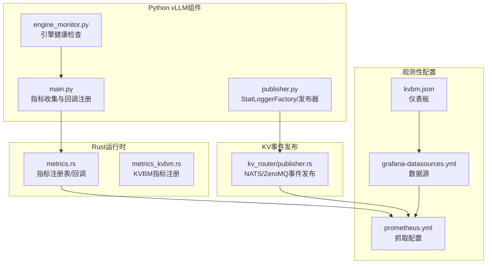
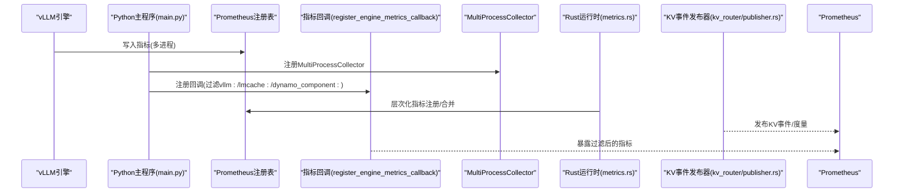
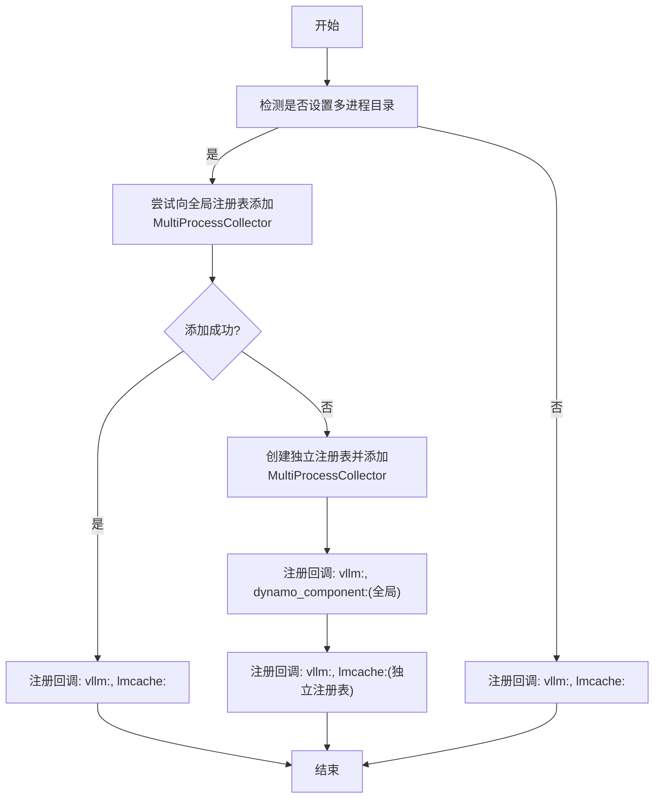
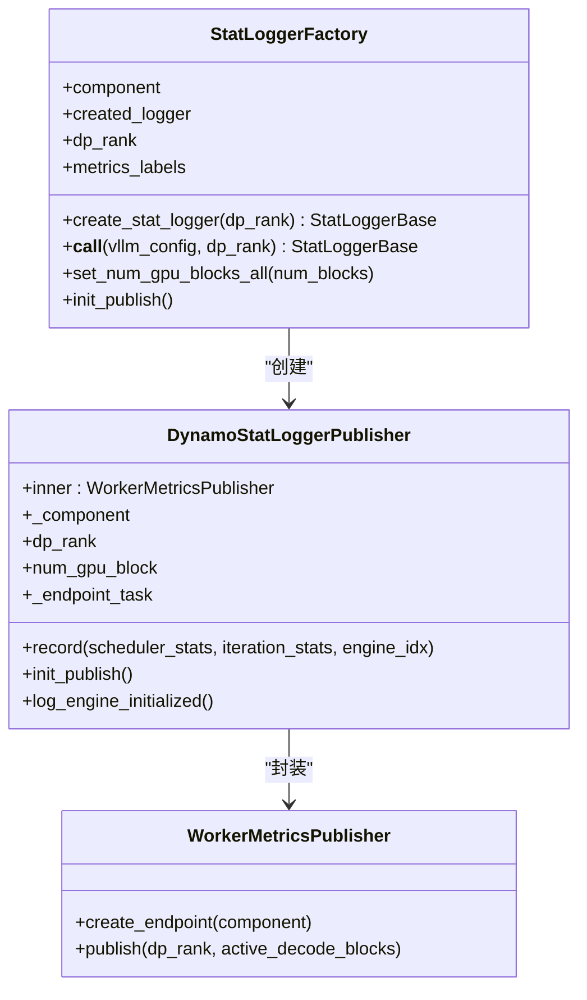
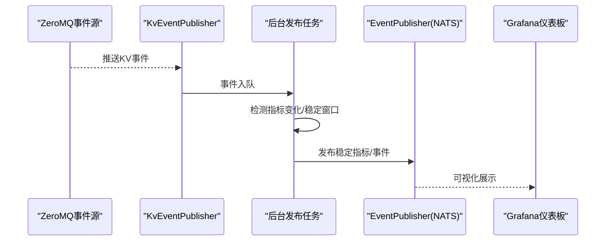
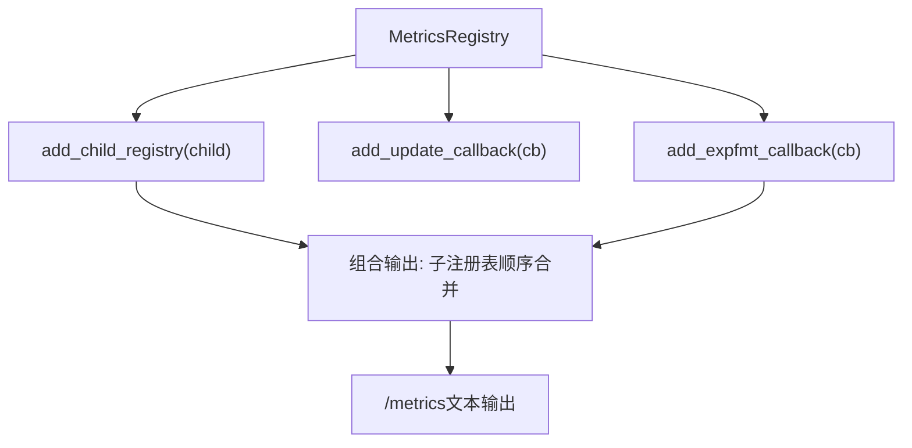
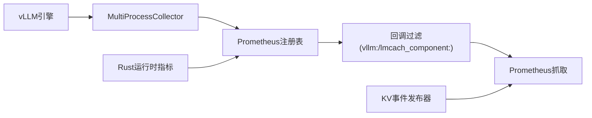

# 监控和指标集成

<cite>
**本文引用的文件**
- [components/src/dynamo/vllm/main.py](file://components/src/dynamo/vllm/main.py)
- [components/src/dynamo/vllm/publisher.py](file://components/src/dynamo/vllm/publisher.py)
- [components/src/dynamo/vllm/engine_monitor.py](file://components/src/dynamo/vllm/engine_monitor.py)
- [lib/llm/src/kv_router/publisher.rs](file://lib/llm/src/kv_router/publisher.rs)
- [lib/rust/src/metrics.rs](file://lib/rust/src/metrics.rs)
- [lib/llm/src/block_manager/metrics_kvbm.rs](file://lib/llm/src/block_manager/metrics_kvbm.rs)
- [deploy/observability/prometheus.yml](file://deploy/observability/prometheus.yml)
- [deploy/observability/grafana-datasources.yml](file://deploy/observability/grafana-datasources.yml)
- [deploy/observability/grafana_dashboards/kvbm.json](file://deploy/observability/grafana_dashboards/kvbm.json)
- [docs/observability/metrics.md](file://docs/observability/metrics.md)
- [docs/kubernetes/observability/metrics.md](file://docs/kubernetes/observability/metrics.md)
- [docs/backends/vllm/prometheus.md](file://docs/backends/vllm/prometheus.md)
</cite>

## 目录
1. [简介](#简介)
2. [项目结构](#项目结构)
3. [核心组件](#核心组件)
4. [架构总览](#架构总览)
5. [组件详解](#组件详解)
6. [依赖关系分析](#依赖关系分析)
7. [性能考量](#性能考量)
8. [故障排查指南](#故障排查指南)
9. [结论](#结论)
10. [附录](#附录)

## 简介
本文件面向vLLM监控与指标集成场景，系统性阐述以下能力与实践：
- Prometheus指标收集：vLLM原生指标、LMCache指标与Dynamo组件指标的统一采集与暴露
- MultiProcessCollector配置与进程间指标共享、冲突解决策略
- StatLoggerFactory设计与使用：统计日志的生成、发布与聚合
- KV事件发布器：前缀缓存事件的监控与分析
- 监控配置示例：Prometheus、Grafana与告警规则
- 性能指标解读与故障排查技巧

## 项目结构
围绕监控与指标的关键目录与文件如下：
- Python后端（vLLM）：指标注册、回调、多进程收集与统计日志发布
- Rust运行时：指标注册表、层次化指标输出与回调机制
- KV事件发布：基于NATS/ZeroMQ的KV事件与度量发布
- 观测性配置：Prometheus抓取、Grafana数据源与仪表板

图表来源
- [components/src/dynamo/vllm/main.py](file://components/src/dynamo/vllm/main.py#L154-L209)
- [components/src/dynamo/vllm/publisher.py](file://components/src/dynamo/vllm/publisher.py#L81-L116)
- [lib/rust/src/metrics.rs](file://lib/rust/src/metrics.rs#L662-L856)
- [lib/llm/src/block_manager/metrics_kvbm.rs](file://lib/llm/src/block_manager/metrics_kvbm.rs#L282-L325)
- [lib/llm/src/kv_router/publisher.rs](file://lib/llm/src/kv_router/publisher.rs#L961-L1010)
- [deploy/observability/prometheus.yml](file://deploy/observability/prometheus.yml#L20-L63)
- [deploy/observability/grafana-datasources.yml](file://deploy/observability/grafana-datasources.yml#L18-L24)
- [deploy/observability/grafana_dashboards/kvbm.json](file://deploy/observability/grafana_dashboards/kvbm.json#L1-L60)

章节来源
- [components/src/dynamo/vllm/main.py](file://components/src/dynamo/vllm/main.py#L154-L209)
- [components/src/dynamo/vllm/publisher.py](file://components/src/dynamo/vllm/publisher.py#L81-L116)
- [lib/rust/src/metrics.rs](file://lib/rust/src/metrics.rs#L662-L856)
- [lib/llm/src/block_manager/metrics_kvbm.rs](file://lib/llm/src/block_manager/metrics_kvbm.rs#L282-L325)
- [lib/llm/src/kv_router/publisher.rs](file://lib/llm/src/kv_router/publisher.rs#L961-L1010)
- [deploy/observability/prometheus.yml](file://deploy/observability/prometheus.yml#L20-L63)
- [deploy/observability/grafana-datasources.yml](file://deploy/observability/grafana-datasources.yml#L18-L24)
- [deploy/observability/grafana_dashboards/kvbm.json](file://deploy/observability/grafana_dashboards/kvbm.json#L1-L60)

## 核心组件
- 指标收集与回调注册：在多进程模式下，通过MultiProcessCollector聚合内存与磁盘指标，并注册回调以过滤与合并vLLM、LMCache与Dynamo组件指标
- StatLoggerFactory：适配vLLM统计日志接口，桥接Dynamo的WorkerMetricsPublisher，实现KV缓存占用等指标的发布
- 运行时指标注册表：提供层次化指标输出、子注册表合并与回调执行，确保跨组件指标一致暴露
- KV事件发布器：支持NATS/ZeroMQ事件源，稳定发布KV事件与度量，具备去抖与定时发布机制
- 观测性配置：Prometheus抓取配置、Grafana数据源与KVBM仪表板

章节来源
- [components/src/dynamo/vllm/main.py](file://components/src/dynamo/vllm/main.py#L154-L209)
- [components/src/dynamo/vllm/publisher.py](file://components/src/dynamo/vllm/publisher.py#L81-L116)
- [lib/rust/src/metrics.rs](file://lib/rust/src/metrics.rs#L662-L856)
- [lib/llm/src/kv_router/publisher.rs](file://lib/llm/src/kv_router/publisher.rs#L961-L1010)

## 架构总览
下图展示从vLLM到Prometheus的整体链路，包括多进程指标聚合、Dynamo组件指标注入与KV事件发布。

图表来源
- [components/src/dynamo/vllm/main.py](file://components/src/dynamo/vllm/main.py#L154-L209)
- [lib/rust/src/metrics.rs](file://lib/rust/src/metrics.rs#L662-L856)
- [lib/llm/src/kv_router/publisher.rs](file://lib/llm/src/kv_router/publisher.rs#L961-L1010)

## 组件详解

### 多进程指标收集与冲突解决（MultiProcessCollector）
- 多进程模式：当设置环境变量指示多进程指标目录时，指标同时写入内存注册表与磁盘文件；MultiProcessCollector负责从磁盘文件读取并聚合
- 冲突处理：若直接向全局注册表添加MultiProcessCollector导致重复时间序列错误，则改用独立注册表仅读取磁盘文件，并分别注册回调，保证vLLM、LMCache与Dynamo组件指标均被收集

图表来源
- [components/src/dynamo/vllm/main.py](file://components/src/dynamo/vllm/main.py#L154-L209)

章节来源
- [components/src/dynamo/vllm/main.py](file://components/src/dynamo/vllm/main.py#L154-L209)

### StatLoggerFactory与统计日志发布
- 设计目标：适配vLLM的StatLoggerBase接口，将调度器与迭代统计转换为KV缓存占用等指标，并通过Dynamo的WorkerMetricsPublisher发布
- 关键点：
  - 工厂按数据并行rank选择性创建发布器，避免非主节点产生无意义指标
  - 提供初始化发布与GPU块数设置，用于计算活跃解码块数量
  - 通过异步任务创建NATS端点，失败时记录异常并抛出

图表来源
- [components/src/dynamo/vllm/publisher.py](file://components/src/dynamo/vllm/publisher.py#L81-L116)

章节来源
- [components/src/dynamo/vllm/publisher.py](file://components/src/dynamo/vllm/publisher.py#L81-L116)

### KV事件发布器与前缀缓存监控
- 事件源：当前支持ZeroMQ作为KV事件源，可从指定端点与主题订阅事件
- 发布流程：后台任务监听指标变化，采用“稳定性窗口”（例如1ms）去抖后发布；支持本地索引器与查询端点
- 监控价值：结合Grafana仪表板，可观察前缀缓存命中率、KV缓存占用与路由行为

图表来源
- [lib/llm/src/kv_router/publisher.rs](file://lib/llm/src/kv_router/publisher.rs#L961-L1010)
- [deploy/observability/grafana_dashboards/kvbm.json](file://deploy/observability/grafana_dashboards/kvbm.json#L1-L60)

章节来源
- [lib/llm/src/kv_router/publisher.rs](file://lib/llm/src/kv_router/publisher.rs#L961-L1010)
- [deploy/observability/grafana_dashboards/kvbm.json](file://deploy/observability/grafana_dashboards/kvbm.json#L1-L60)

### 运行时指标注册表与层次化输出
- 能力概览：提供新增子注册表、更新回调与导出格式回调的机制；组合多个注册表输出，确保Dynamo组件指标与第三方引擎指标统一暴露
- 使用建议：在组件/端点层级注册特定指标，根级注册表汇总输出，便于Prometheus一次性抓取

图表来源
- [lib/rust/src/metrics.rs](file://lib/rust/src/metrics.rs#L662-L856)

章节来源
- [lib/rust/src/metrics.rs](file://lib/rust/src/metrics.rs#L662-L856)

### KVBM指标注册与命名规范
- 通过KVBM指标注册器创建计数器与仪表，自动对指标名进行规范化并附加常量标签，确保Prometheus兼容性与可查询性

章节来源
- [lib/llm/src/block_manager/metrics_kvbm.rs](file://lib/llm/src/block_manager/metrics_kvbm.rs#L282-L325)

## 依赖关系分析
- vLLM指标：由vLLM引擎在多进程模式下写入内存与磁盘，Python侧通过MultiProcessCollector与回调统一暴露
- Dynamo组件指标：通过运行时指标注册表与回调机制，按层次化结构合并输出
- KV事件：通过NATS/ZeroMQ事件发布器稳定发布，供可视化与告警使用

图表来源
- [components/src/dynamo/vllm/main.py](file://components/src/dynamo/vllm/main.py#L154-L209)
- [lib/rust/src/metrics.rs](file://lib/rust/src/metrics.rs#L662-L856)
- [lib/llm/src/kv_router/publisher.rs](file://lib/llm/src/kv_router/publisher.rs#L961-L1010)

章节来源
- [components/src/dynamo/vllm/main.py](file://components/src/dynamo/vllm/main.py#L154-L209)
- [lib/rust/src/metrics.rs](file://lib/rust/src/metrics.rs#L662-L856)
- [lib/llm/src/kv_router/publisher.rs](file://lib/llm/src/kv_router/publisher.rs#L961-L1010)

## 性能考量
- 指标开销控制：避免在高频路径中频繁创建指标对象；优先复用已注册指标
- 多进程聚合：合理设置多进程目录与清理策略，防止磁盘空间膨胀
- 回调过滤：仅暴露必要前缀，减少Prometheus抓取与存储压力
- KV事件去抖：根据业务需求调整稳定窗口，平衡实时性与抖动抑制

## 故障排查指南
- vLLM多进程指标冲突
  - 现象：向全局注册表添加MultiProcessCollector时报重复时间序列错误
  - 处理：使用独立注册表仅读取磁盘文件，并分别注册回调，确保vLLM/LMCache/Dynamo指标均被收集
  - 参考：[components/src/dynamo/vllm/main.py](file://components/src/dynamo/vllm/main.py#L154-L209)
- Prometheus抓取异常
  - 检查抓取目标端口与网络连通性
  - 确认数据源配置正确
  - 参考：[deploy/observability/prometheus.yml](file://deploy/observability/prometheus.yml#L20-L63)、[deploy/observability/grafana-datasources.yml](file://deploy/observability/grafana-datasources.yml#L18-L24)
- KV事件未显示
  - 确认事件发布器已创建端点并启动后台任务
  - 检查NATS/ZeroMQ连接参数与主题匹配
  - 参考：[lib/llm/src/kv_router/publisher.rs](file://lib/llm/src/kv_router/publisher.rs#L961-L1010)
- 指标命名与前缀
  - vLLM指标前缀为“vllm:”，LMCache为“lmcache:”，Dynamo组件为“dynamo_component:”
  - 参考：[docs/backends/vllm/prometheus.md](file://docs/backends/vllm/prometheus.md#L64-L107)、[docs/observability/metrics.md](file://docs/observability/metrics.md#L61-L99)

章节来源
- [components/src/dynamo/vllm/main.py](file://components/src/dynamo/vllm/main.py#L154-L209)
- [deploy/observability/prometheus.yml](file://deploy/observability/prometheus.yml#L20-L63)
- [deploy/observability/grafana-datasources.yml](file://deploy/observability/grafana-datasources.yml#L18-L24)
- [lib/llm/src/kv_router/publisher.rs](file://lib/llm/src/kv_router/publisher.rs#L961-L1010)
- [docs/backends/vllm/prometheus.md](file://docs/backends/vllm/prometheus.md#L64-L107)
- [docs/observability/metrics.md](file://docs/observability/metrics.md#L61-L99)

## 结论
通过MultiProcessCollector与回调机制，vLLM原生指标、LMCache指标与Dynamo组件指标得以统一采集与暴露；StatLoggerFactory将调度统计转化为KV占用等关键指标并发布；KV事件发布器为前缀缓存监控提供稳定通道。配合Prometheus/Grafana配置与仪表板，可实现端到端的可观测性闭环。

## 附录

### 监控配置示例

- Prometheus抓取配置
  - 抓取间隔、目标服务与端口参考：[deploy/observability/prometheus.yml](file://deploy/observability/prometheus.yml#L20-L63)
  - 建议：根据集群规模与延迟要求调整抓取间隔

- Grafana数据源
  - 数据源类型与URL参考：[deploy/observability/grafana-datasources.yml](file://deploy/observability/grafana-datasources.yml#L18-L24)

- KVBM仪表板
  - KVBM相关面板与查询参考：[deploy/observability/grafana_dashboards/kvbm.json](file://deploy/observability/grafana_dashboards/kvbm.json#L1-L60)

- 文档与指标参考
  - Dynamo指标总览与端口说明：[docs/observability/metrics.md](file://docs/observability/metrics.md#L16-L124)
  - Kubernetes环境指标收集与PodMonitor配置：[docs/kubernetes/observability/metrics.md](file://docs/kubernetes/observability/metrics.md#L107-L174)
  - vLLM指标前缀与LMCache集成：[docs/backends/vllm/prometheus.md](file://docs/backends/vllm/prometheus.md#L64-L147)