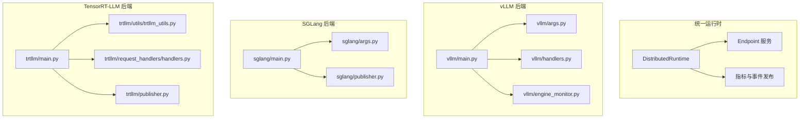
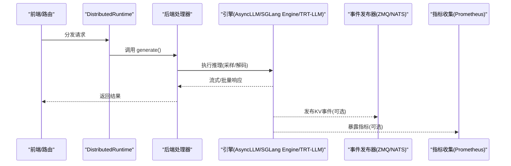
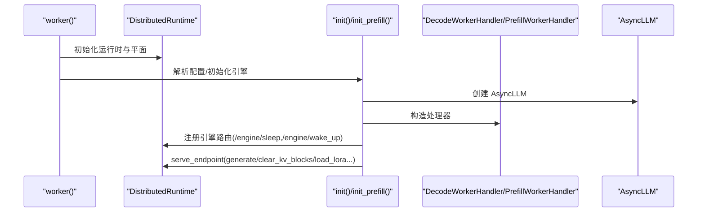
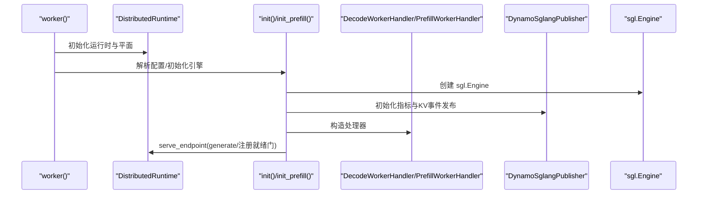
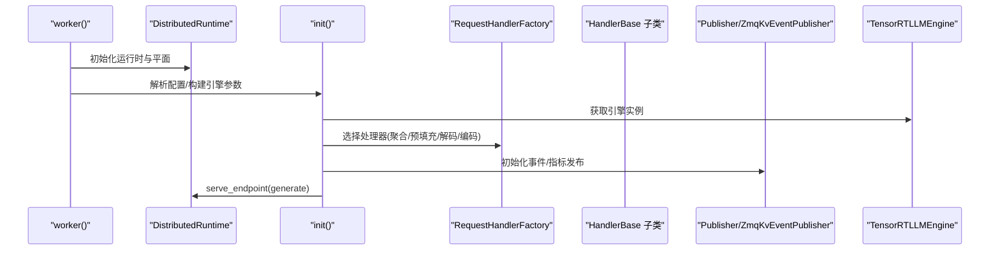
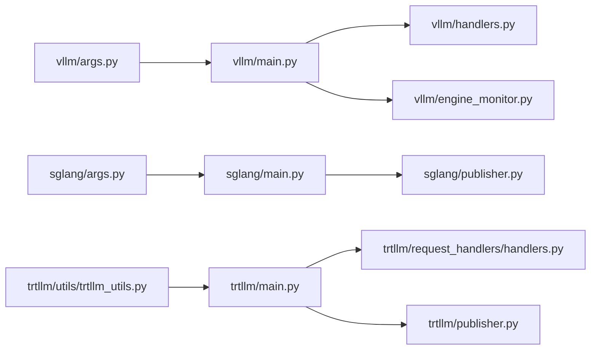

# 后端对比和选择指南

<cite>
**本文档引用的文件**
- [components/src/dynamo/vllm/main.py](file://components/src/dynamo/vllm/main.py)
- [components/src/dynamo/vllm/args.py](file://components/src/dynamo/vllm/args.py)
- [components/src/dynamo/vllm/handlers.py](file://components/src/dynamo/vllm/handlers.py)
- [components/src/dynamo/vllm/engine_monitor.py](file://components/src/dynamo/vllm/engine_monitor.py)
- [components/src/dynamo/sglang/main.py](file://components/src/dynamo/sglang/main.py)
- [components/src/dynamo/sglang/args.py](file://components/src/dynamo/sglang/args.py)
- [components/src/dynamo/sglang/publisher.py](file://components/src/dynamo/sglang/publisher.py)
- [components/src/dynamo/trtllm/main.py](file://components/src/dynamo/trtllm/main.py)
- [components/src/dynamo/trtllm/utils/trtllm_utils.py](file://components/src/dynamo/trtllm/utils/trtllm_utils.py)
- [components/src/dynamo/trtllm/publisher.py](file://components/src/dynamo/trtllm/publisher.py)
- [components/src/dynamo/trtllm/request_handlers/handlers.py](file://components/src/dynamo/trtllm/request_handlers/handlers.py)
</cite>

## 目录
1. [简介](#简介)
2. [项目结构](#项目结构)
3. [核心组件](#核心组件)
4. [架构总览](#架构总览)
5. [详细组件分析](#详细组件分析)
6. [依赖关系分析](#依赖关系分析)
7. [性能考量](#性能考量)
8. [故障排查指南](#故障排查指南)
9. [结论](#结论)
10. [附录](#附录)

## 简介
本指南面向需要在 Dynamo 平台中选择 vLLM、SGLang、TensorRT-LLM 三类后端的工程与运维人员。通过对三者在功能覆盖、性能表现、资源消耗、部署复杂度、多模态支持、可扩展性与可观测性等方面的系统化对比，帮助读者在开发测试、生产部署、多模态应用、大规模推理等不同场景下做出技术选型决策，并提供迁移与切换的最佳实践。

## 项目结构
三类后端均通过统一的运行时框架（DistributedRuntime）接入前端路由与事件平面，采用模块化的请求处理器与发布器实现解耦。主要差异体现在引擎初始化、参数解析、KV 事件发布与指标采集、多模态处理路径以及多节点/多进程并行策略上。

图表来源
- [components/src/dynamo/vllm/main.py](file://components/src/dynamo/vllm/main.py#L1-L120)
- [components/src/dynamo/sglang/main.py](file://components/src/dynamo/sglang/main.py#L1-L120)
- [components/src/dynamo/trtllm/main.py](file://components/src/dynamo/trtllm/main.py#L1-L120)

章节来源
- [components/src/dynamo/vllm/main.py](file://components/src/dynamo/vllm/main.py#L1-L120)
- [components/src/dynamo/sglang/main.py](file://components/src/dynamo/sglang/main.py#L1-L120)
- [components/src/dynamo/trtllm/main.py](file://components/src/dynamo/trtllm/main.py#L1-L120)

## 核心组件
- vLLM 后端
  - 引擎与参数：通过 AsyncLLM 与 vLLM 配置对象初始化，支持 LoRA 动态加载、前缀缓存、多连接器（NIXL/LMCache/KVBM）组合。
  - 请求处理：Decode/Prefill/多模态处理器，支持工具调用与推理解析器、睡眠/唤醒、KV 清理、流式输出。
  - 可观测性：Prometheus 多进程注册、KV 事件 ZMQ 发布、引擎健康监控。
- SGLang 后端
  - 引擎与参数：ServerArgs 驱动，支持嵌入式、扩散语言模型、多模态编码/预填充/解码工作流。
  - 请求处理：统一的 WorkerHandler 抽象，支持多模式（聚合/预填充/解码），内置预热以降低首字延迟。
  - 可观测性：共享内存多进程 Prometheus 注册、ZMQ KV 事件发布、非领导节点仅暴露指标。
- TensorRT-LLM 后端
  - 引擎与参数：基于 tensorrt_llm.llmapi 的 BuildConfig/调度器/动态批配置，支持 KV 缓存事件与指标发布。
  - 请求处理：按模式（聚合/预填充/解码/编码）分发到对应处理器，支持本地媒体处理与 NIXL 连接。
  - 可观测性：TRT-LLM 原生指标收集、ZMQ/NATS 事件发布、线程化事件轮询与错误队列。

章节来源
- [components/src/dynamo/vllm/args.py](file://components/src/dynamo/vllm/args.py#L1-L120)
- [components/src/dynamo/vllm/handlers.py](file://components/src/dynamo/vllm/handlers.py#L1-L120)
- [components/src/dynamo/sglang/args.py](file://components/src/dynamo/sglang/args.py#L1-L120)
- [components/src/dynamo/trtllm/utils/trtllm_utils.py](file://components/src/dynamo/trtllm/utils/trtllm_utils.py#L1-L120)

## 架构总览
三后端均遵循“统一运行时 + 组件化处理器 + 事件/指标发布”的通用模式，但在具体实现上存在显著差异：

图表来源
- [components/src/dynamo/vllm/main.py](file://components/src/dynamo/vllm/main.py#L530-L674)
- [components/src/dynamo/sglang/main.py](file://components/src/dynamo/sglang/main.py#L125-L210)
- [components/src/dynamo/trtllm/main.py](file://components/src/dynamo/trtllm/main.py#L370-L520)

## 详细组件分析

### vLLM 后端
- 功能覆盖
  - 支持聊天/补全端点类型、自定义模板、工具调用与推理解析器、LoRA 动态加载/卸载/枚举、睡眠/唤醒、KV 清理。
  - 前缀缓存与 KV 事件发布（ZMQ）、多连接器组合（NIXL/LMCache/KVBM）。
- 性能与资源
  - 通过分布式执行后端与多进程隔离避免 GIL 竞争；默认启用前缀缓存；支持多进程 Prometheus。
- 部署复杂度
  - 参数丰富，支持多种连接器与多模态角色；需注意 vLLM 版本差异与 GIL 相关兼容性。
- 多模态
  - 支持处理器/编码器/解码器/预填充/原生编码器等多种角色，适配不同多模态流水线。
- 关键流程（注册与端点服务）

图表来源
- [components/src/dynamo/vllm/main.py](file://components/src/dynamo/vllm/main.py#L76-L152)
- [components/src/dynamo/vllm/main.py](file://components/src/dynamo/vllm/main.py#L530-L674)

章节来源
- [components/src/dynamo/vllm/main.py](file://components/src/dynamo/vllm/main.py#L1-L200)
- [components/src/dynamo/vllm/handlers.py](file://components/src/dynamo/vllm/handlers.py#L230-L370)
- [components/src/dynamo/vllm/args.py](file://components/src/dynamo/vllm/args.py#L110-L220)

### SGLang 后端
- 功能覆盖
  - 支持嵌入式、扩散语言模型、多模态编码/预填充/解码；统一的 WorkerHandler 抽象；非领导节点仅暴露指标。
- 性能与资源
  - 通过共享内存多进程 Prometheus 注册；预填充工作流支持预热以降低首字延迟；多进程架构减少阻塞。
- 部署复杂度
  - 参数解析支持嵌套配置文件与键提取；自动设置引导端口；与 Dynamo 的端点映射灵活。
- 多模态
  - 提供专用处理器与编码器/预填充/解码工作流，支持外部编码器与 NIXL。
- 关键流程（初始化与指标发布）

图表来源
- [components/src/dynamo/sglang/main.py](file://components/src/dynamo/sglang/main.py#L69-L124)
- [components/src/dynamo/sglang/main.py](file://components/src/dynamo/sglang/main.py#L125-L210)
- [components/src/dynamo/sglang/publisher.py](file://components/src/dynamo/sglang/publisher.py#L170-L201)

章节来源
- [components/src/dynamo/sglang/main.py](file://components/src/dynamo/sglang/main.py#L1-L120)
- [components/src/dynamo/sglang/args.py](file://components/src/dynamo/sglang/args.py#L324-L586)
- [components/src/dynamo/sglang/publisher.py](file://components/src/dynamo/sglang/publisher.py#L1-L120)

### TensorRT-LLM 后端
- 功能覆盖
  - 支持聚合/预填充/解码/编码四种模式；本地媒体处理与 NIXL；KV 事件与指标发布；动态批与容量调度策略。
- 性能与资源
  - 原生 TRT-LLM 指标导出；事件轮询线程化；支持 KV 缓存事件缓冲区；PyTorch 后端用于事件发布。
- 部署复杂度
  - 参数通过命令行与 YAML 覆盖；支持专家并行与 GPU 数量推断；事件发布逻辑区分是否启用合并器。
- 多模态
  - 通过 MultimodalRequestProcessor 与 EncodeHelper 实现图像/视频编码与嵌入读取。
- 关键流程（引擎初始化与事件发布）

图表来源
- [components/src/dynamo/trtllm/main.py](file://components/src/dynamo/trtllm/main.py#L128-L160)
- [components/src/dynamo/trtllm/main.py](file://components/src/dynamo/trtllm/main.py#L370-L520)
- [components/src/dynamo/trtllm/request_handlers/handlers.py](file://components/src/dynamo/trtllm/request_handlers/handlers.py#L20-L39)
- [components/src/dynamo/trtllm/publisher.py](file://components/src/dynamo/trtllm/publisher.py#L257-L364)

章节来源
- [components/src/dynamo/trtllm/main.py](file://components/src/dynamo/trtllm/main.py#L1-L120)
- [components/src/dynamo/trtllm/utils/trtllm_utils.py](file://components/src/dynamo/trtllm/utils/trtllm_utils.py#L139-L434)
- [components/src/dynamo/trtllm/request_handlers/handlers.py](file://components/src/dynamo/trtllm/request_handlers/handlers.py#L1-L120)
- [components/src/dynamo/trtllm/publisher.py](file://components/src/dynamo/trtllm/publisher.py#L1-L120)

## 依赖关系分析
- vLLM
  - 依赖 vLLM AsyncLLM、KV 事件配置、Prometheus 多进程注册、ZMQ 事件发布器。
  - 引擎监控类负责健康检查与异常时的运行时关闭。
- SGLang
  - 依赖 sglang.Engine、ZMQ 事件发布器、共享内存多进程 Prometheus 注册。
  - 非领导节点仅注册指标回调，不参与请求处理。
- TensorRT-LLM
  - 依赖 tensorrt_llm.llmapi、MetricsCollector、ZMQ/NATS 事件发布器。
  - 支持 KV 缓存事件合并器与本地索引器开关。

图表来源
- [components/src/dynamo/vllm/args.py](file://components/src/dynamo/vllm/args.py#L1-L120)
- [components/src/dynamo/sglang/args.py](file://components/src/dynamo/sglang/args.py#L1-L120)
- [components/src/dynamo/trtllm/utils/trtllm_utils.py](file://components/src/dynamo/trtllm/utils/trtllm_utils.py#L1-L120)

章节来源
- [components/src/dynamo/vllm/engine_monitor.py](file://components/src/dynamo/vllm/engine_monitor.py#L1-L82)
- [components/src/dynamo/sglang/publisher.py](file://components/src/dynamo/sglang/publisher.py#L136-L168)
- [components/src/dynamo/trtllm/publisher.py](file://components/src/dynamo/trtllm/publisher.py#L655-L684)

## 性能考量
- 推理吞吐与延迟
  - vLLM：默认启用前缀缓存与多进程 Prometheus；可通过连接器组合优化冷启动与重用率。
  - SGLang：预填充预热可降低首字延迟；共享内存多进程指标更易集成。
  - TensorRT-LLM：原生指标导出与动态批策略；事件发布线程化减少主循环开销。
- 资源占用
  - vLLM：LoRA 动态加载/卸载需注意内存峰值；多进程后端可缓解 GIL 竞争。
  - SGLang：多进程架构减少阻塞；非领导节点仅暴露指标，降低额外负载。
  - TensorRT-LLM：KV 事件缓冲区与 PyTorch 后端用于事件发布，需平衡内存与 CPU 开销。
- 可观测性
  - 三后端均支持 Prometheus 指标导出；vLLM 与 SGLang 支持 KV 事件 ZMQ 发布；TRTLLM 支持 NATS/ZMQ 事件发布与本地索引器。

[本节为通用指导，无需特定文件引用]

## 故障排查指南
- vLLM
  - 引擎健康监控：当检测到引擎死亡时触发运行时关闭，防止僵尸进程与资源泄漏。
  - 参数校验：自定义 Jinja 模板路径需存在且可访问；多模态角色互斥；连接器列表与 KV 转移配置互斥。
- SGLang
  - 非领导节点：仅注册指标回调，不参与请求处理；预填充预热失败会记录警告并继续。
  - 参数冲突：自定义模板与使用 SGLang 分词器不可同时使用；配置文件嵌套键提取需确保键存在。
- TensorRT-LLM
  - 事件发布：根据是否启用合并器选择 ZMQ 或 NATS 发布；错误队列用于捕获发布线程异常。
  - 参数覆盖：YAML 与 JSON 覆盖需保证键名正确；GPU 数量与并行度需与硬件匹配。

章节来源
- [components/src/dynamo/vllm/engine_monitor.py](file://components/src/dynamo/vllm/engine_monitor.py#L49-L82)
- [components/src/dynamo/vllm/args.py](file://components/src/dynamo/vllm/args.py#L332-L468)
- [components/src/dynamo/sglang/main.py](file://components/src/dynamo/sglang/main.py#L39-L67)
- [components/src/dynamo/trtllm/publisher.py](file://components/src/dynamo/trtllm/publisher.py#L587-L617)

## 结论
- 开发测试阶段
  - 优先选择 SGLang：参数解析灵活、预热机制降低首字延迟、非领导节点仅暴露指标便于调试。
- 生产部署阶段
  - vLLM：功能最全面（LoRA、前缀缓存、多连接器），适合复杂场景；注意 GIL 与连接器组合。
  - TensorRT-LLM：原生指标与事件发布成熟，适合对吞吐与可观测性要求高的场景。
- 多模态应用
  - 三后端均提供多模态工作流；SGLang 与 vLLM 的处理器/编码器/解码器角色更丰富；TRTLLM 提供本地媒体处理与 NIXL。
- 大规模推理
  - TensorRT-LLM 的动态批与容量调度策略更适合高并发；vLLM 的连接器组合可提升缓存命中与重用率。

[本节为总结性内容，无需特定文件引用]

## 附录

### 场景化选择建议
- 开发测试
  - 优先 SGLang，快速验证与调试；必要时切换至 vLLM 进行功能完整性验证。
- 生产部署
  - 通用场景：vLLM（功能完备、生态丰富）。
  - 高吞吐/低延迟：TensorRT-LLM（原生指标、事件发布、动态批）。
  - 低延迟首字：SGLang（预热机制）。
- 多模态
  - vLLM：处理器/编码器/解码器角色齐全，适合复杂流水线。
  - SGLang：统一抽象与多模态工作流。
  - TRTLLM：本地媒体处理与 NIXL，适合 I/O 密集场景。
- 大规模推理
  - TensorRT-LLM（动态批/容量调度）+ vLLM（连接器组合）。

[本节为通用指导，无需特定文件引用]

### 迁移与切换最佳实践
- 参数对齐
  - 端点类型与端点名称保持一致；分词器策略（Dynamo 分词器 vs 后端内置）需明确。
- 连接器与缓存
  - vLLM 的连接器顺序与 KV 转移配置需与目标后端兼容；TRTLLM 的事件发布需与 KV 合并器配置一致。
- 指标与事件
  - 统一 Prometheus 指标前缀与标签；KV 事件发布端点需与路由/合并器配置一致。
- 多模态流水线
  - 明确编码器/预填充/解码器职责边界；SGLang 的预热与 vLLM 的原生编码器模式需分别评估。
- 回滚策略
  - 在灰度环境中逐步切换；保留旧后端实例直至新后端稳定；准备一键回滚脚本。

[本节为通用指导，无需特定文件引用]