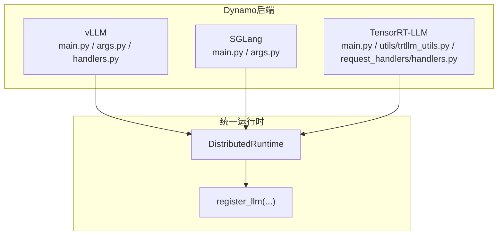
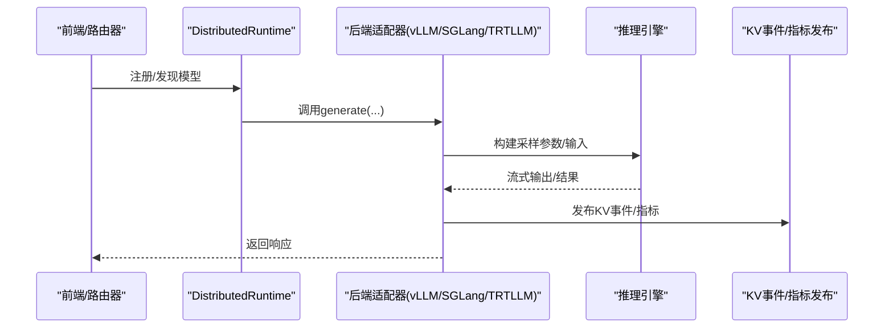
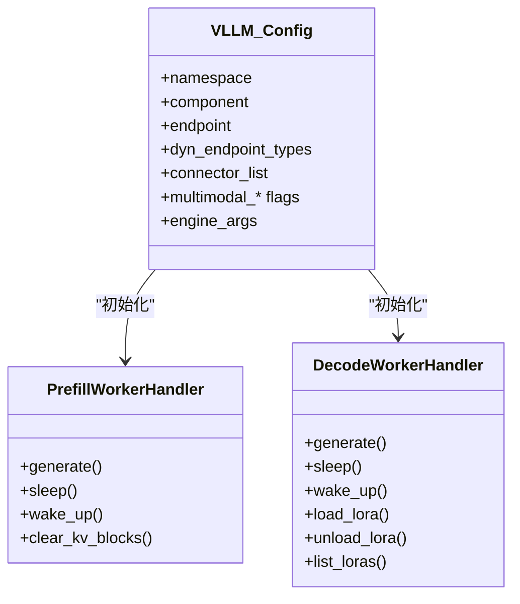
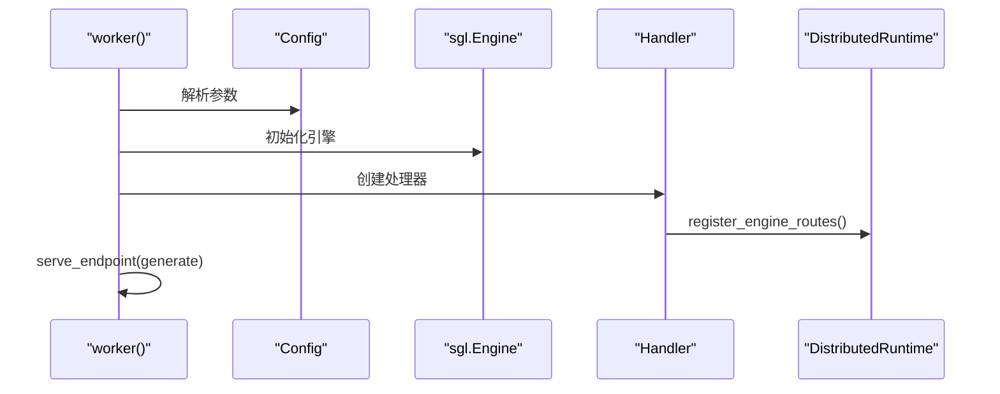
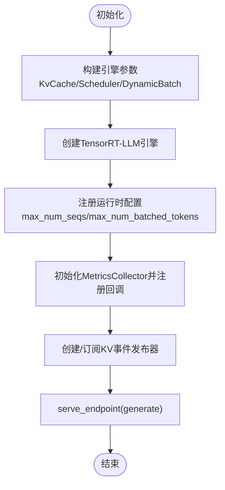
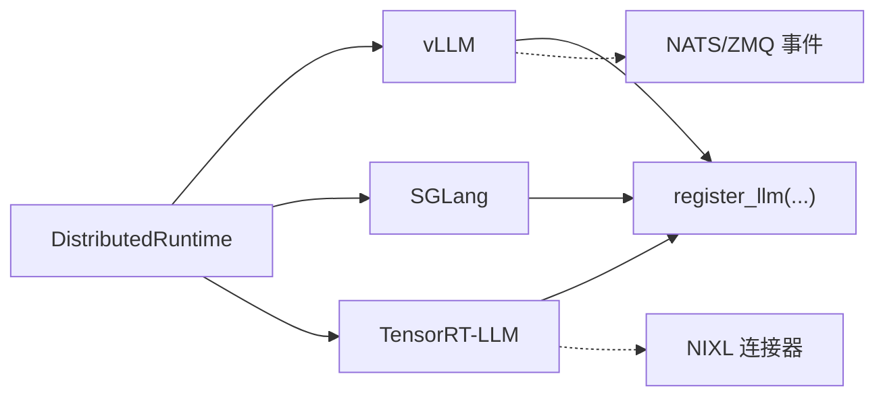

# 后端集成

<cite>
**本文引用的文件**
- [components/src/dynamo/vllm/main.py](file://components/src/dynamo/vllm/main.py)
- [components/src/dynamo/vllm/args.py](file://components/src/dynamo/vllm/args.py)
- [components/src/dynamo/vllm/handlers.py](file://components/src/dynamo/vllm/handlers.py)
- [components/src/dynamo/sglang/main.py](file://components/src/dynamo/sglang/main.py)
- [components/src/dynamo/sglang/args.py](file://components/src/dynamo/sglang/args.py)
- [components/src/dynamo/trtllm/main.py](file://components/src/dynamo/trtllm/main.py)
- [components/src/dynamo/trtllm/utils/trtllm_utils.py](file://components/src/dynamo/trtllm/utils/trtllm_utils.py)
- [components/src/dynamo/trtllm/request_handlers/handlers.py](file://components/src/dynamo/trtllm/request_handlers/handlers.py)
- [components/README.md](file://components/README.md)
- [docs/backends/vllm/README.md](file://docs/backends/vllm/README.md)
</cite>

## 目录
1. [引言](#引言)
2. [项目结构](#项目结构)
3. [核心组件](#核心组件)
4. [架构总览](#架构总览)
5. [详细组件分析](#详细组件分析)
6. [依赖关系分析](#依赖关系分析)
7. [性能考量](#性能考量)
8. [故障排查指南](#故障排查指南)
9. [结论](#结论)
10. [附录](#附录)

## 引言
本文件系统性阐述Dynamo的后端集成架构，重点说明其如何通过统一抽象层支持不同推理引擎（vLLM、SGLang、TensorRT-LLM），并给出后端适配器的设计模式、接口规范与实现细节。文档还覆盖多模态、LoRA微调、工具调用等在各后端中的差异化实现，并提供后端选择指南与性能对比要点。

## 项目结构
Dynamo后端位于components/src/dynamo目录下，按引擎划分子模块：
- vLLM：入口脚本、参数解析、请求处理器、健康检查与发布器等
- SGLang：入口脚本、参数解析、请求处理器集合、健康检查与指标发布
- TensorRT-LLM：入口脚本、引擎封装、请求处理器工厂与基类、指标与事件发布

图示来源
- [components/src/dynamo/vllm/main.py](file://components/src/dynamo/vllm/main.py#L69-L150)
- [components/src/dynamo/sglang/main.py](file://components/src/dynamo/sglang/main.py#L69-L124)
- [components/src/dynamo/trtllm/main.py](file://components/src/dynamo/trtllm/main.py#L128-L160)

章节来源
- [components/README.md](file://components/README.md#L24-L33)

## 核心组件
- 统一入口与生命周期管理
  - vLLM：worker函数解析参数、初始化分布式运行时、根据配置分支到不同初始化流程（预填充/解码/多模态/编码器等），并注册优雅停机信号处理
  - SGLang：worker函数解析参数、初始化分布式运行时、根据服务模式（聚合/预填充/解码/扩散/嵌入）分支到对应初始化流程
  - TensorRT-LLM：worker函数解析参数、构建引擎参数、创建引擎实例、注册指标与事件发布器、按模式分派请求处理器
- 请求处理器与适配器
  - vLLM：Prefill/DecodeWorkerHandler负责生成、KV事件发布、指标收集；多模态处理器覆盖编码、预处理、解码等场景
  - SGLang：Decode/Prefill/Embedding/Diffusion/Multimodal系列处理器，统一注册引擎路由与就绪门
  - TensorRT-LLM：RequestHandlerFactory按模式返回Aggregated/Encode/PrefillHandler等，统一生成流程
- 配置与参数
  - vLLM：Config封装Dynamo特定参数与vLLM AsyncEngineArgs，支持连接器列表、端点类型、多模态开关、工具/推理解析器等
  - SGLang：DynamoArgs与ServerArgs组合，支持离散化模式枚举、多模态/嵌入/扩散等专用标志
  - TensorRT-LLM：Config封装引擎参数、并行度、最大批大小、最大token数、KV缓存配置、事件缓冲区等

章节来源
- [components/src/dynamo/vllm/main.py](file://components/src/dynamo/vllm/main.py#L69-L150)
- [components/src/dynamo/vllm/args.py](file://components/src/dynamo/vllm/args.py#L30-L102)
- [components/src/dynamo/sglang/main.py](file://components/src/dynamo/sglang/main.py#L69-L124)
- [components/src/dynamo/sglang/args.py](file://components/src/dynamo/sglang/args.py#L137-L200)
- [components/src/dynamo/trtllm/main.py](file://components/src/dynamo/trtllm/main.py#L128-L160)
- [components/src/dynamo/trtllm/utils/trtllm_utils.py](file://components/src/dynamo/trtllm/utils/trtllm_utils.py#L29-L104)

## 架构总览
Dynamo通过统一的DistributedRuntime与register_llm接口，屏蔽底层引擎差异，向上提供一致的模型注册、路由与健康检查能力。后端适配器负责：
- 将外部请求映射为引擎可执行的采样参数与输入格式
- 管理KV缓存事件发布与订阅，支撑KV感知路由
- 暴露统一的健康检查负载与指标回调
- 支持多模态、LoRA、工具调用等高级特性

图示来源
- [components/src/dynamo/vllm/main.py](file://components/src/dynamo/vllm/main.py#L530-L674)
- [components/src/dynamo/sglang/main.py](file://components/src/dynamo/sglang/main.py#L125-L210)
- [components/src/dynamo/trtllm/main.py](file://components/src/dynamo/trtllm/main.py#L446-L520)

## 详细组件分析

### vLLM后端适配器
- 设计模式
  - 工厂/分支初始化：根据是否预填充、多模态、Native编码器等标志，进入不同初始化路径
  - 处理器职责分离：Prefill/DecodeWorkerHandler分别承担预填充与解码阶段的生成逻辑与KV事件发布
  - 统一注册：通过register_llm完成模型输入类型、运行时配置（KV块数、最大并发序列、批token上限等）注册
- 接口规范
  - 生成接口：generate(request, context) → 流式响应
  - 引擎路由：sleep/wake_up等引擎控制路由
  - 健康检查：VllmHealthCheckPayload/VllmPrefillHealthCheckPayload
- 关键实现细节
  - Prometheus多进程指标：支持MultiprocessCollector与自定义回调，避免冲突
  - KV事件发布：基于ZMQ事件发布器，支持KVBM合并器或本地索引器
  - LoRA：通过LoRAManager支持URI下载与动态加载，提供load/unload/list接口
  - 多模态：图像/视频加载、预处理、ECProcessor/Native编码器模式
- 特性与优化
  - 广覆盖：vLLM特性矩阵完备，支持KV感知路由、SLA规划、LMCache、WideEP等
  - 运行时配置：从引擎配置中提取KV块数、最大并发序列、批token上限等

图示来源
- [components/src/dynamo/vllm/args.py](file://components/src/dynamo/vllm/args.py#L30-L102)
- [components/src/dynamo/vllm/handlers.py](file://components/src/dynamo/vllm/handlers.py#L1-L200)

章节来源
- [components/src/dynamo/vllm/main.py](file://components/src/dynamo/vllm/main.py#L418-L674)
- [components/src/dynamo/vllm/handlers.py](file://components/src/dynamo/vllm/handlers.py#L1-L200)
- [docs/backends/vllm/README.md](file://docs/backends/vllm/README.md#L32-L54)

### SGLang后端适配器
- 设计模式
  - 服务模式枚举：聚合/预填充/解码三种模式，按ServerArgs.disaggregation_mode切换
  - 就绪门机制：register_llm_with_readiness_gate确保模型注册完成前阻塞请求
  - 指标与事件：setup_sgl_metrics与setup_prometheus_registry统一暴露SGLang指标
- 接口规范
  - 生成接口：generate(request, context) → 流式响应
  - 引擎路由：sleep/wake_up等引擎控制路由
  - 健康检查：SglangHealthCheckPayload/SglangPrefillHealthCheckPayload
- 关键实现细节
  - 非主节点处理：非零node_rank仅运行调度器并暴露指标，不处理请求
  - 预填充预热：对预填充引擎进行dummy warmup以降低首次TTFT
  - 多模态/扩散/嵌入：分别提供专用处理器
- 特性与优化
  - 高吞吐服务：SGLang强调高性能推理与低延迟，适合高并发场景
  - 多模态与扩散：内置对扩散语言模型与多模态编码/解码的支持

图示来源
- [components/src/dynamo/sglang/main.py](file://components/src/dynamo/sglang/main.py#L69-L210)

章节来源
- [components/src/dynamo/sglang/main.py](file://components/src/dynamo/sglang/main.py#L125-L210)
- [components/src/dynamo/sglang/args.py](file://components/src/dynamo/sglang/args.py#L177-L200)

### TensorRT-LLM后端适配器
- 设计模式
  - 请求处理器工厂：根据离散化模式返回Aggregated/Encode/PrefillHandler
  - 引擎参数构建：KvCacheConfig、SchedulerConfig、DynamicBatchConfig等
  - 指标与事件：MetricsCollector与注册回调，支持TRTLLM原生指标
- 接口规范
  - 生成接口：generate(request, context) → 流式响应
  - 健康检查：TrtllmHealthCheckPayload
- 关键实现细节
  - KV连接器：支持KVBM连接器或禁用
  - 事件缓冲区：启用事件与指标时自动添加event_buffer_max_size
  - 多模态：MultimodalRequestProcessor与NIXL连接器配合
  - 运行时配置：从配置直接设置最大并发序列与批token上限，保证指标可用
- 特性与优化
  - 最大性能：TensorRT加速与精细的调度策略，适合追求极致吞吐与延迟表现的场景
  - 离散化模式：支持预填充/解码分离，便于资源弹性与迁移

图示来源
- [components/src/dynamo/trtllm/main.py](file://components/src/dynamo/trtllm/main.py#L162-L520)
- [components/src/dynamo/trtllm/utils/trtllm_utils.py](file://components/src/dynamo/trtllm/utils/trtllm_utils.py#L29-L104)
- [components/src/dynamo/trtllm/request_handlers/handlers.py](file://components/src/dynamo/trtllm/request_handlers/handlers.py#L20-L38)

章节来源
- [components/src/dynamo/trtllm/main.py](file://components/src/dynamo/trtllm/main.py#L162-L520)
- [components/src/dynamo/trtllm/request_handlers/handlers.py](file://components/src/dynamo/trtllm/request_handlers/handlers.py#L20-L38)

## 依赖关系分析
- 统一抽象层
  - vLLM：AsyncLLM、ZmqKvEventPublisher、register_llm
  - SGLang：sgl.Engine、register_llm_with_readiness_gate
  - TensorRT-LLM：TensorRTLLMEngine、MetricsCollector、register_llm
- 运行时耦合
  - DistributedRuntime负责请求平面、事件平面、KV存储的选择与连接
  - 各后端均通过endpoint.serve_endpoint对外提供生成服务
- 外部依赖
  - vLLM：NATS/ZMQ事件、LMCache/KVBM连接器
  - SGLang：共享内存指标、ZMQ事件
  - TensorRT-LLM：NIXL连接器、TRTLLM原生指标

图示来源
- [components/src/dynamo/vllm/main.py](file://components/src/dynamo/vllm/main.py#L91-L96)
- [components/src/dynamo/sglang/main.py](file://components/src/dynamo/sglang/main.py#L91-L96)
- [components/src/dynamo/trtllm/main.py](file://components/src/dynamo/trtllm/main.py#L145-L147)

章节来源
- [components/src/dynamo/vllm/main.py](file://components/src/dynamo/vllm/main.py#L91-L96)
- [components/src/dynamo/sglang/main.py](file://components/src/dynamo/sglang/main.py#L91-L96)
- [components/src/dynamo/trtllm/main.py](file://components/src/dynamo/trtllm/main.py#L145-L147)

## 性能考量
- vLLM
  - 特性覆盖广，支持KV感知路由、SLA规划、LMCache、WideEP等，适合需要灵活调度与路由的场景
  - Prometheus多进程指标与KV事件发布完善，便于可观测性与性能分析
- SGLang
  - 高吞吐服务，适合高并发与低延迟需求；预填充预热减少首次TTFT
  - 指标通过共享内存暴露，部署简单
- TensorRT-LLM
  - 强调最大性能，TRT加速与精细调度策略，适合对吞吐/延迟敏感的生产环境
  - 支持离散化模式，便于资源弹性与迁移

章节来源
- [docs/backends/vllm/README.md](file://docs/backends/vllm/README.md#L32-L54)
- [components/src/dynamo/sglang/main.py](file://components/src/dynamo/sglang/main.py#L617-L650)
- [components/src/dynamo/trtllm/main.py](file://components/src/dynamo/trtllm/main.py#L405-L429)

## 故障排查指南
- 优雅停机
  - 各后端均注册SIGTERM/SIGINT信号处理器，触发DistributedRuntime.shutdown，确保在请求完成后停止
- 健康检查
  - vLLM：VllmHealthCheckPayload/VllmPrefillHealthCheckPayload
  - SGLang：SglangHealthCheckPayload/SglangPrefillHealthCheckPayload
  - TensorRT-LLM：TrtllmHealthCheckPayload
- 多模态问题
  - 确认多模态处理器已正确初始化并与下游组件建立客户端连接
- LoRA相关
  - vLLM：确认DYN_LORA_ENABLED已启用，URI格式正确，使用load/unload/list端点
- 指标与事件
  - 检查Prometheus注册与MultiprocessCollector冲突；确认事件发布器端点与订阅者配置

章节来源
- [components/src/dynamo/vllm/main.py](file://components/src/dynamo/vllm/main.py#L64-L101)
- [components/src/dynamo/sglang/main.py](file://components/src/dynamo/sglang/main.py#L652-L656)
- [components/src/dynamo/trtllm/main.py](file://components/src/dynamo/trtllm/main.py#L74-L79)

## 结论
Dynamo通过统一抽象层与适配器模式，成功屏蔽了vLLM、SGLang、TensorRT-LLM三大引擎的差异，向上提供一致的模型注册、路由与可观测性能力。不同后端在多模态、LoRA、工具调用等方面各有侧重：vLLM覆盖最全、SGLang强调高吞吐、TensorRT-LLM追求最大性能。结合KV事件与指标发布，Dynamo实现了KV感知路由与SLA驱动的动态规划，满足多样化部署与性能需求。

## 附录
- 后端选择指南
  - 需要广泛特性与生态：优先vLLM
  - 高并发低延迟：优先SGLang
  - 极致吞吐与延迟：优先TensorRT-LLM
- 功能矩阵参考
  - vLLM特性矩阵与单机示例见官方文档

章节来源
- [docs/backends/vllm/README.md](file://docs/backends/vllm/README.md#L32-L204)