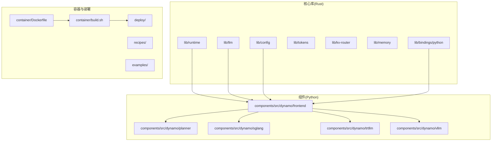
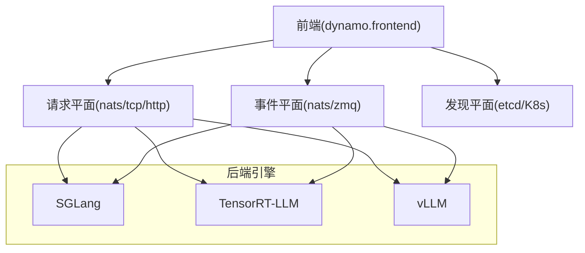
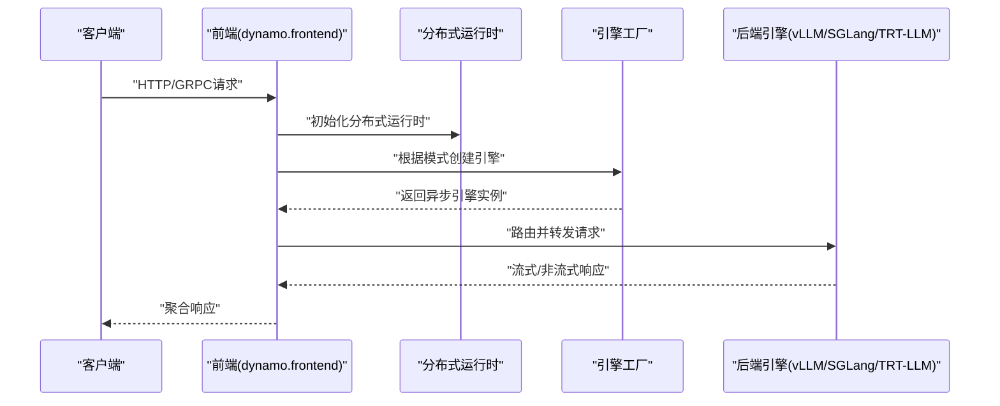
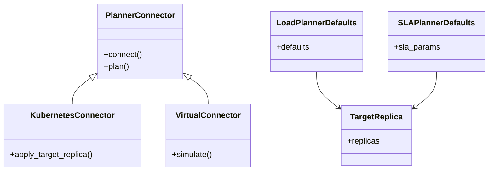
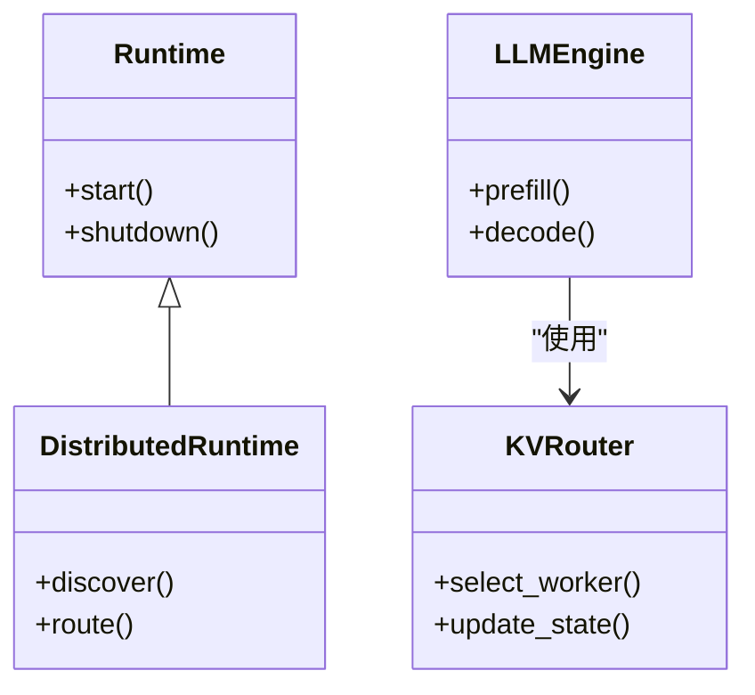
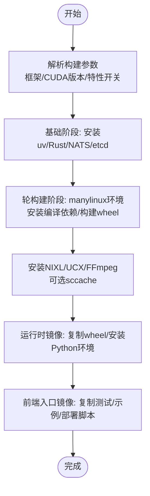
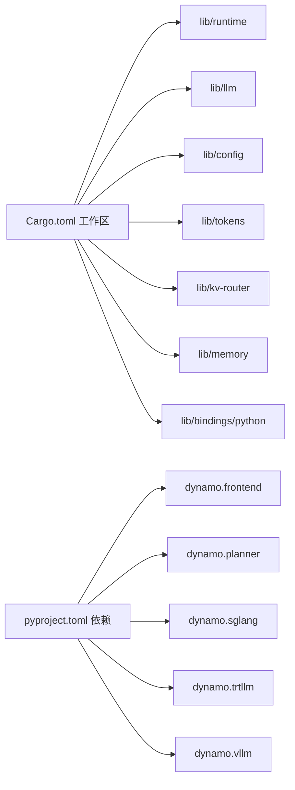

# 开发者指南

<cite>
**本文档引用的文件**
- [README.md](file://README.md)
- [CONTRIBUTING.md](file://CONTRIBUTING.md)
- [Cargo.toml](file://Cargo.toml)
- [pyproject.toml](file://pyproject.toml)
- [.pre-commit-config.yaml](file://.pre-commit-config.yaml)
- [deny.toml](file://deny.toml)
- [container/build.sh](file://container/build.sh)
- [container/Dockerfile](file://container/Dockerfile)
- [launch/dynamo-run/Cargo.toml](file://launch/dynamo-run/Cargo.toml)
- [components/src/dynamo/frontend/main.py](file://components/src/dynamo/frontend/main.py)
- [components/src/dynamo/planner/__init__.py](file://components/src/dynamo/planner/__init__.py)
- [lib/runtime/src/lib.rs](file://lib/runtime/src/lib.rs)
- [lib/llm/src/lib.rs](file://lib/llm/src/lib.rs)
- [tests/conftest.py](file://tests/conftest.py)
- [rust-toolchain.toml](file://rust-toolchain.toml)
</cite>

## 目录
1. [简介](#简介)
2. [项目结构](#项目结构)
3. [核心组件](#核心组件)
4. [架构总览](#架构总览)
5. [详细组件分析](#详细组件分析)
6. [依赖分析](#依赖分析)
7. [性能考虑](#性能考虑)
8. [故障排除指南](#故障排除指南)
9. [结论](#结论)
10. [附录](#附录)

## 简介
本指南面向Dynamo项目的贡献者与维护者，提供从环境搭建到开发、测试、文档与CI/CD的全流程说明。Dynamo是一个高性能、低延迟的大模型推理框架，支持多后端（vLLM、SGLang、TensorRT-LLM），采用Rust实现核心运行时与LLM引擎，Python用于后端集成与运维脚本，Go用于Kubernetes Operator。

## 项目结构
仓库采用分层与按功能域混合的组织方式：
- 核心库（Rust）：位于lib/，包含运行时、LLM引擎、KV路由器、内存管理等
- 组件（Python）：位于components/，包含前端、路由、规划器、后端适配器等
- 容器与部署：container/、deploy/、recipes/、examples/ 提供镜像构建、K8s部署与示例
- 基准与性能：benchmarks/ 提供AIPerf、SLA驱动配置等
- 文档：docs/ 与 fern/ 提供用户与开发者文档
- 测试：tests/ 覆盖单元、集成、端到端与性能测试
- 工具与脚本：scripts/、.pre-commit-config.yaml、deny.toml 等

**图表来源**
- [Cargo.toml](file://Cargo.toml#L4-L32)
- [lib/runtime/src/lib.rs](file://lib/runtime/src/lib.rs#L20-L56)
- [lib/llm/src/lib.rs](file://lib/llm/src/lib.rs#L13-L47)
- [components/src/dynamo/frontend/main.py](file://components/src/dynamo/frontend/main.py#L1-L50)
- [container/Dockerfile](file://container/Dockerfile#L1-L60)

**章节来源**
- [README.md](file://README.md#L27-L52)
- [Cargo.toml](file://Cargo.toml#L4-L32)

## 核心组件
- 运行时（lib/runtime）：分布式运行时、发现、健康检查、度量、传输、系统状态服务等
- LLM引擎（lib/llm）：请求预处理、路由、KV路由器、后端引擎抽象、协议、令牌化等
- 前端（components/src/dynamo/frontend）：OpenAI兼容HTTP/GRPC服务、自动发现、预处理器、路由选择
- 规划器（components/src/dynamo/planner）：负载与SLA规划器连接器、K8s连接器、虚拟连接器
- 后端适配（components/src/dynamo/{sglang,trtllm,vllm}）：各后端集成、发布/订阅、健康检查
- 构建与绑定（lib/bindings/python）：Rust-Python绑定，使用maturin构建wheel
- 容器与镜像（container/）：多阶段构建、NIXL/UCX/FFmpeg安装、sccache缓存、多后端镜像

**章节来源**
- [lib/runtime/src/lib.rs](file://lib/runtime/src/lib.rs#L20-L56)
- [lib/llm/src/lib.rs](file://lib/llm/src/lib.rs#L13-L47)
- [components/src/dynamo/frontend/main.py](file://components/src/dynamo/frontend/main.py#L18-L52)
- [components/src/dynamo/planner/__init__.py](file://components/src/dynamo/planner/__init__.py#L4-L12)
- [container/Dockerfile](file://container/Dockerfile#L108-L176)

## 架构总览
Dynamo采用“请求平面”“事件平面”“发现平面”的分层通信设计：
- 请求平面：前端到后端的工作节点调度，支持TCP、NATS或HTTP
- 事件平面：KV缓存事件传播，用于KV感知路由与副本同步
- 发现平面：基于etcd或K8s的服务注册与发现

**图表来源**
- [components/src/dynamo/frontend/main.py](file://components/src/dynamo/frontend/main.py#L361-L368)
- [README.md](file://README.md#L225-L243)

**章节来源**
- [README.md](file://README.md#L225-L243)

## 详细组件分析

### 前端组件分析
前端负责启动OpenAI兼容HTTP/GRPC服务、自动发现、预处理与路由。支持TLS、KV感知路由、自定义后端指标采集、多种存储后端（etcd/file/mem）与请求平面（nats/tcp/http）。

**图表来源**
- [components/src/dynamo/frontend/main.py](file://components/src/dynamo/frontend/main.py#L329-L451)

**章节来源**
- [components/src/dynamo/frontend/main.py](file://components/src/dynamo/frontend/main.py#L88-L327)
- [components/src/dynamo/frontend/main.py](file://components/src/dynamo/frontend/main.py#L329-L451)

### 规划器组件分析
规划器提供负载与SLA规划能力，支持Kubernetes连接器与虚拟连接器，导出默认配置与目标副本类型。

**图表来源**
- [components/src/dynamo/planner/__init__.py](file://components/src/dynamo/planner/__init__.py#L4-L21)

**章节来源**
- [components/src/dynamo/planner/__init__.py](file://components/src/dynamo/planner/__init__.py#L1-L32)

### Rust运行时与LLM库分析
运行时库提供分布式运行时、组件生命周期、健康检查、度量与传输；LLM库提供后端抽象、KV路由器、预处理、令牌化与协议。

**图表来源**
- [lib/runtime/src/lib.rs](file://lib/runtime/src/lib.rs#L50-L56)
- [lib/llm/src/lib.rs](file://lib/llm/src/lib.rs#L13-L47)

**章节来源**
- [lib/runtime/src/lib.rs](file://lib/runtime/src/lib.rs#L20-L56)
- [lib/llm/src/lib.rs](file://lib/llm/src/lib.rs#L13-L47)

### 构建与镜像流程
容器构建脚本与Dockerfile支持多后端镜像、NIXL/UCX/FFmpeg安装、sccache缓存、manylinux打包与多架构支持。

**图表来源**
- [container/build.sh](file://container/build.sh#L173-L502)
- [container/Dockerfile](file://container/Dockerfile#L108-L176)

**章节来源**
- [container/build.sh](file://container/build.sh#L1-L120)
- [container/Dockerfile](file://container/Dockerfile#L108-L176)

## 依赖分析
- 工作区与成员：Cargo.toml定义了工作区成员与默认成员，统一版本与依赖
- Python依赖：pyproject.toml定义了可选后端（vLLM、SGLang、TRT-LLM）、测试与文档依赖
- 依赖治理：deny.toml限制许可证与禁止依赖，确保供应链安全
- 预提交钩子：统一格式化、静态检查与文件一致性校验

**图表来源**
- [Cargo.toml](file://Cargo.toml#L4-L32)
- [pyproject.toml](file://pyproject.toml#L50-L72)

**章节来源**
- [Cargo.toml](file://Cargo.toml#L45-L128)
- [pyproject.toml](file://pyproject.toml#L15-L29)
- [deny.toml](file://deny.toml#L19-L65)
- [.pre-commit-config.yaml](file://.pre-commit-config.yaml#L16-L101)

## 性能考虑
- 编译优化：Rust Profile Release启用LTO与单代码单元以提升二进制性能
- 构建缓存：sccache通过S3桶缓存编译产物，加速重复构建
- 多架构支持：Dockerfile支持x86_64与aarch64，自动设置Rust目标与包后缀
- 运行时特性：Tokio控制台特性可用于性能分析与调试

**章节来源**
- [Cargo.toml](file://Cargo.toml#L137-L142)
- [container/Dockerfile](file://container/Dockerfile#L48-L52)
- [launch/dynamo-run/Cargo.toml](file://launch/dynamo-run/Cargo.toml#L15-L24)

## 故障排除指南
- 端口冲突：使用动态端口分配与端口释放逻辑，避免并发测试中的端口竞争
- NATS/etcd可用性：提供共享与动态端口两种模式，支持JetStream与Core模式切换
- 模型下载：通过HF_TOKEN进行认证下载，失败不阻塞测试执行
- 日志与诊断：集中日志输出到测试目录，便于定位问题

**章节来源**
- [tests/conftest.py](file://tests/conftest.py#L227-L298)
- [tests/conftest.py](file://tests/conftest.py#L300-L414)
- [tests/conftest.py](file://tests/conftest.py#L552-L622)
- [tests/conftest.py](file://tests/conftest.py#L688-L713)

## 结论
本指南提供了Dynamo从环境搭建到开发、测试、文档与CI/CD的完整路径。建议贡献者遵循统一的代码风格、依赖治理与测试策略，并利用容器与Kubernetes部署工具快速验证改动。

## 附录

### 本地开发环境搭建
- Rust工具链：使用rust-toolchain.toml指定版本，确保与工作区一致
- Python环境：使用uv作为包管理器，创建虚拟环境并安装可选后端
- 构建工具：安装maturin用于Rust-Python绑定构建
- 可选：安装NIXL/UCX/FFmpeg以启用媒体与高性能网络特性

**章节来源**
- [rust-toolchain.toml](file://rust-toolchain.toml#L1-L3)
- [README.md](file://README.md#L295-L326)
- [container/Dockerfile](file://container/Dockerfile#L217-L384)

### 代码结构与模块依赖
- Rust工作区：统一版本与依赖，核心库与绑定分离
- Python包：通过hatchling构建wheel，按后端拆分可选依赖
- 组件边界：前端负责接口与路由，后端负责具体推理引擎

**章节来源**
- [Cargo.toml](file://Cargo.toml#L4-L32)
- [pyproject.toml](file://pyproject.toml#L104-L106)

### 测试策略与质量保证
- 标记体系：pytest标记覆盖并行、GPU规模、组件、性能等维度
- 服务模拟：NATS/etcd动态端口与会话级共享，支持Core/JetStream模式
- 模型预下载：按需下载与忽略权重，减少测试阻塞
- 静态检查：pre-commit钩子统一格式化与检查

**章节来源**
- [tests/conftest.py](file://tests/conftest.py#L27-L66)
- [tests/conftest.py](file://tests/conftest.py#L158-L188)
- [.pre-commit-config.yaml](file://.pre-commit-config.yaml#L16-L101)

### 持续集成流程
- 依赖治理：cargo-deny检查许可证与禁止依赖
- 预提交：统一的lint与格式化流程
- 构建与镜像：多后端镜像构建、sccache缓存、多架构支持

**章节来源**
- [deny.toml](file://deny.toml#L19-L65)
- [.pre-commit-config.yaml](file://.pre-commit-config.yaml#L16-L101)
- [container/build.sh](file://container/build.sh#L1-L120)

### API文档生成与维护
- 前端OpenAPI：通过Rust二进制生成OpenAPI规范并写入docs/frontends/openapi.json
- 文档工具链：Sphinx及相关扩展用于文档构建与发布

**章节来源**
- [README.md](file://README.md#L253-L262)
- [pyproject.toml](file://pyproject.toml#L75-L94)

### 版本管理与发布
- 版本号：统一在工作区与包元数据中声明
- 镜像版本：基于Git标签与提交ID生成镜像标签
- 发布工件：wheel与容器镜像

**章节来源**
- [Cargo.toml](file://Cargo.toml#L35-L44)
- [pyproject.toml](file://pyproject.toml#L4-L6)
- [container/build.sh](file://container/build.sh#L31-L58)

### 贡献流程
- 分支与提交：遵循DCO签名，使用约定式提交信息
- 审查流程：Issue优先流程，维护者批准后PR合并
- 代码风格：Rust使用cargo fmt/clippy，Python使用black/ruff

**章节来源**
- [CONTRIBUTING.md](file://CONTRIBUTING.md#L176-L214)
- [CONTRIBUTING.md](file://CONTRIBUTING.md#L216-L252)
- [.pre-commit-config.yaml](file://.pre-commit-config.yaml#L16-L101)

### 调试技巧与性能分析
- Tokio控制台：启用tokio-console特性进行运行时分析
- 日志级别：通过DYN_LOG/RUST_LOG调整日志详细度
- 端口与进程：动态端口分配与进程管理，避免资源泄漏

**章节来源**
- [launch/dynamo-run/Cargo.toml](file://launch/dynamo-run/Cargo.toml#L23-L24)
- [README.md](file://README.md#L354-L356)
- [tests/conftest.py](file://tests/conftest.py#L752-L766)

### 开发工具与IDE配置
- Rust：使用rust-toolchain.toml固定工具链版本
- Python：uv虚拟环境，maturin绑定构建
- IDE：VS Code Dev Container已内置，参考根目录README说明

**章节来源**
- [rust-toolchain.toml](file://rust-toolchain.toml#L1-L3)
- [README.md](file://README.md#L356-L357)