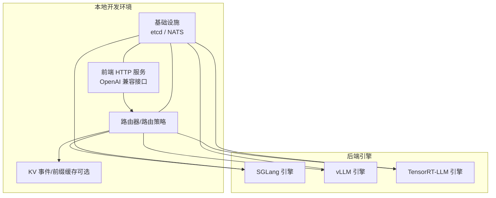
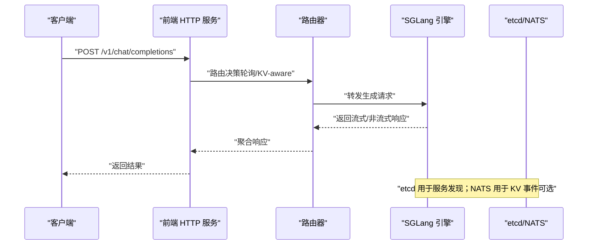
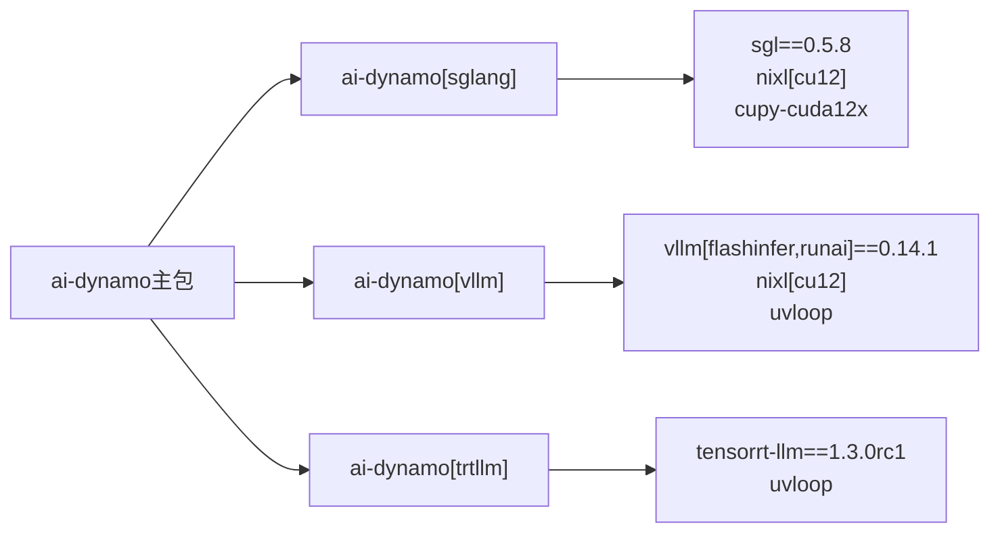

# 快速开始

<cite>
**本文引用的文件**
- [README.md](file://README.md)
- [pyproject.toml](file://pyproject.toml)
- [sanity_check.py](file://deploy/sanity_check.py)
- [main.py（前端）](file://components/src/dynamo/frontend/main.py)
- [main.py（SGLang 引擎）](file://components/src/dynamo/sglang/main.py)
- [support-matrix.md](file://docs/reference/support-matrix.md)
- [sglang 快速开始](file://docs/backends/sglang/README.md)
- [vLLM 快速开始](file://docs/backends/vllm/README.md)
- [docker-compose.yml](file://deploy/docker-compose.yml)
- [quick_start_local.rst](file://docs/_includes/quick_start_local.rst)
- [Dockerfile（容器构建）](file://container/Dockerfile)
- [requirements.txt（容器依赖）](file://container/deps/requirements.txt)
- [requirements.standard.txt](file://container/deps/requirements.standard.txt)
- [agg.sh（SGLang 示例）](file://examples/backends/sglang/launch/agg.sh)
- [agg.sh（vLLM 示例）](file://examples/backends/vllm/launch/agg.sh)
</cite>

## 目录
1. [简介](#简介)
2. [项目结构](#项目结构)
3. [核心组件](#核心组件)
4. [架构总览](#架构总览)
5. [详细组件分析](#详细组件分析)
6. [依赖关系分析](#依赖关系分析)
7. [性能注意事项](#性能注意事项)
8. [故障排查指南](#故障排查指南)
9. [结论](#结论)
10. [附录](#附录)

## 简介
本指南面向首次接触 Dynamo 的用户，目标是在 5–10 分钟内完成从零到运行的完整流程：系统要求与依赖安装、Python 环境配置、引擎选择与安装、本地开发环境设置、启动 OpenAI 兼容 HTTP 服务器与 SGLang 引擎、发送测试请求、sanity check 验证与常见问题排查。同时覆盖不同操作系统与环境的安装指导。

## 项目结构
Dynamo 采用“多语言混合”架构：核心运行时以 Rust 实现，Python 提供上层组件与可选后端引擎绑定；容器镜像统一打包了 Python 运行时、uv 包管理器、NATS/etcd 服务以及各后端引擎（vLLM/SGLang/TensorRT-LLM）。本地快速开始主要涉及以下模块：
- 前端 HTTP 服务：OpenAI 兼容接口、路由与预处理
- 后端引擎：SGLang、vLLM 或 TRT-LLM（通过可选依赖安装）
- 本地基础设施：etcd（服务发现）、NATS（事件发布，KV 路由场景）

图示来源
- [main.py（前端）](file://components/src/dynamo/frontend/main.py#L1-L469)
- [main.py（SGLang 引擎）](file://components/src/dynamo/sglang/main.py#L1-L664)
- [docker-compose.yml](file://deploy/docker-compose.yml#L1-L36)

章节来源
- [README.md](file://README.md#L91-L181)
- [pyproject.toml](file://pyproject.toml#L50-L67)

## 核心组件
- 前端 HTTP 服务（dynamo.frontend）
  - 提供 OpenAI 兼容的 /v1/chat/completions 等接口
  - 支持多种路由模式（轮询、随机、KV-aware），默认轮询
  - 可配置 TLS、命名空间、事件平面、请求平面等
- SGLang 引擎（dynamo.sglang）
  - 将 SGLang 引擎集成到 Dynamo 分布式运行时
  - 支持聚合/解耦（Prefill/Decode）部署、多模态、指标导出、健康检查
- vLLM 引擎（dynamo.vllm）
  - 使用 vLLM 的原生参数解析，支持 KV 事件、LMCache/KVBM、指标导出等
- 基础设施
  - etcd：服务发现（默认）
  - NATS：KV 路由事件通道（可选）

章节来源
- [main.py（前端）](file://components/src/dynamo/frontend/main.py#L88-L326)
- [main.py（SGLang 引擎）](file://components/src/dynamo/sglang/main.py#L69-L124)
- [docker-compose.yml](file://deploy/docker-compose.yml#L11-L36)

## 架构总览
下图展示了本地开发场景下的典型交互：前端监听 8000 端口，接收请求后根据路由策略分发至后端引擎；SGLang 引擎注册自身并对外提供生成接口；etcd/NATS 用于服务发现与事件传递。

图示来源
- [main.py（前端）](file://components/src/dynamo/frontend/main.py#L329-L451)
- [main.py（SGLang 引擎）](file://components/src/dynamo/sglang/main.py#L125-L210)
- [docker-compose.yml](file://deploy/docker-compose.yml#L11-L36)

## 详细组件分析

### 系统要求与依赖安装
- 操作系统与硬件
  - Ubuntu 22.04/24.04（x86_64/ARM64），支持多架构容器镜像
  - GPU：NVIDIA Hopper/Ada/Lovelace/Blackwell 架构
  - Python 版本：3.10+（推荐 3.12，KVBM 仅支持 3.12）
- 依赖工具
  - uv：推荐的 Python 包管理器（安装脚本见 README）
  - Python 开发头文件：用于后端引擎的 JIT 编译（如 SGLang/Cupy）
  - Rust 工具链（构建源码时需要）
- 容器镜像
  - 提供多架构镜像（x86_64/ARM64），内置 Python、uv、NATS/etcd、后端引擎
  - 可直接拉取或自行构建

章节来源
- [README.md](file://README.md#L93-L111)
- [support-matrix.md](file://docs/reference/support-matrix.md#L40-L114)
- [Dockerfile（容器构建）](file://container/Dockerfile#L63-L104)
- [requirements.txt（容器依赖）](file://container/deps/requirements.txt#L1-L63)

### Python 环境配置与引擎选择
- 推荐使用 uv 创建隔离虚拟环境，并安装对应后端的可选依赖
  - SGLang：ai-dynamo[sglang]
  - vLLM：ai-dynamo[vllm]
  - TensorRT-LLM：ai-dynamo[trtllm]（需使用 pip，不支持 uv 的 URL 依赖）
- Python 版本建议
  - 3.12（KVBM 支持）
  - 3.10/3.11（通用）

章节来源
- [README.md](file://README.md#L112-L123)
- [pyproject.toml](file://pyproject.toml#L50-L67)
- [sglang 快速开始](file://docs/backends/sglang/README.md#L88-L127)

### 本地开发环境设置（uv + Python 头文件）
- 安装 uv 并创建虚拟环境
- 安装 Python 开发头文件（Ubuntu）
- 选择并安装后端引擎（例如 SGLang）
- 可选：使用 Docker Compose 启动 etcd/NATS（本地开发）

章节来源
- [README.md](file://README.md#L98-L123)
- [quick_start_local.rst](file://docs/_includes/quick_start_local.rst#L1-L46)
- [docker-compose.yml](file://deploy/docker-compose.yml#L11-L36)

### 启动 OpenAI 兼容 HTTP 服务器
- 默认监听 0.0.0.0:8000，可通过 --http-host/--http-port 或环境变量 DYN_HTTP_HOST/DYN_HTTP_PORT 调整
- 支持 TLS（--tls-cert-path/--tls-key-path）
- 路由模式：轮询/随机/KV-aware（--router-mode），KV-aware 需要 NATS 或启用 KV 事件
- 存储 KV：默认 etcd，本地开发可用 --store-kv file 避免 etcd；vLLM 在本地禁用 KV 事件时需添加 --kv-events-config '{"enable_kv_cache_events": false}'
- 命令示例（来自 README）
  - 启动前端：python3 -m dynamo.frontend --http-port 8000 --store-kv file
  - 发送测试请求：curl localhost:8000/v1/chat/completions ...

章节来源
- [main.py（前端）](file://components/src/dynamo/frontend/main.py#L88-L326)
- [README.md](file://README.md#L137-L171)
- [quick_start_local.rst](file://docs/_includes/quick_start_local.rst#L25-L46)

### 启动 SGLang 引擎
- 通过 python3 -m dynamo.sglang 启动
- 支持聚合/解耦（Prefill/Decode）部署、多模态、指标导出、健康检查
- 本地开发可使用示例脚本（聚合模式）
- 命令示例（来自 README）
  - python3 -m dynamo.sglang --model-path deepseek-ai/DeepSeek-R1-Distill-Llama-8B --store-kv file

章节来源
- [main.py（SGLang 引擎）](file://components/src/dynamo/sglang/main.py#L69-L124)
- [README.md](file://README.md#L145-L153)
- [agg.sh（SGLang 示例）](file://examples/backends/sglang/launch/agg.sh#L57-L75)

### 发送测试请求
- 使用 curl 向 /v1/chat/completions 发送 JSON 请求
- 可开启流式输出（stream=true）以实时接收响应
- 参考 README 中的 curl 示例与 quick_start_local.rst

章节来源
- [README.md](file://README.md#L157-L171)
- [quick_start_local.rst](file://docs/_includes/quick_start_local.rst#L35-L46)

### 完整本地运行示例（SGLang）
- 终端 A：启动前端
  - python3 -m dynamo.frontend --http-port 8000 --store-kv file
- 终端 B：启动 SGLang 引擎
  - python3 -m dynamo.sglang --model-path Qwen/Qwen3-0.6B --store-kv file
- 终端 C：发送测试请求
  - curl localhost:8000/v1/chat/completions ...

章节来源
- [README.md](file://README.md#L137-L171)
- [agg.sh（SGLang 示例）](file://examples/backends/sglang/launch/agg.sh#L57-L75)

### 完整本地运行示例（vLLM）
- 终端 A：启动前端
  - python3 -m dynamo.frontend
- 终端 B：启动 vLLM 引擎（本地禁用 KV 事件）
  - python3 -m dynamo.vllm --model Qwen/Qwen3-0.6B --kv-events-config '{"enable_kv_cache_events": false}'
- 终端 C：发送测试请求
  - curl localhost:8000/v1/chat/completions ...

章节来源
- [vLLM 快速开始](file://docs/backends/vllm/README.md#L55-L86)
- [agg.sh（vLLM 示例）](file://examples/backends/vllm/launch/agg.sh#L25-L33)

## 依赖关系分析
- Python 可选依赖（后端引擎）
  - vLLM：uvloop、nixl[cu12]、vllm[flashinfer,runai]==0.14.1
  - SGLang：uvloop、sgl==0.5.8、nixl[cu12]、cupy-cuda12x>=13.0.0
  - TensorRT-LLM：uvloop、tensorrt-llm==1.3.0rc1
- 容器镜像依赖
  - Python 版本固定（容器构建阶段指定），并安装 uv、NATS/etcd、后端引擎
  - CUDA/UCX/Libfabric/NIXL 等底层库在镜像中预置

图示来源
- [pyproject.toml](file://pyproject.toml#L50-L67)
- [requirements.txt（容器依赖）](file://container/deps/requirements.txt#L1-L63)
- [requirements.standard.txt](file://container/deps/requirements.standard.txt#L1-L13)

章节来源
- [pyproject.toml](file://pyproject.toml#L50-L67)
- [requirements.txt（容器依赖）](file://container/deps/requirements.txt#L1-L63)

## 性能注意事项
- 本地开发建议使用 --store-kv file 避免 etcd，减少外部依赖
- vLLM 在本地禁用 KV 事件可避免 NATS，但会失去 KV-aware 路由能力
- KV-aware 路由需要 NATS 或启用 KV 事件；若关闭事件，需合理配置 TTL/树大小等参数
- 多模态/解耦部署对显存与带宽要求更高，建议在具备足够资源的 GPU 上进行

章节来源
- [README.md](file://README.md#L155-L156)
- [main.py（前端）](file://components/src/dynamo/frontend/main.py#L361-L368)

## 故障排查指南
- 使用 sanity check 工具进行系统与依赖检查
  - 基本检查：系统资源、容器/主机上下文、开发工具（Rust/Cargo/Maturin/Python）、框架（vLLM/SGLang/TensorRT-LLM）、Dynamo 组件
  - 深入检查：文件权限、目录大小、磁盘空间、ulimit、CUDA/NVIDIA 信息、DYN_* 环境变量、HuggingFace 模型缓存
  - 命令：python3 deploy/sanity_check.py [--thorough-check] [--runtime-check-only] [--json-output]
- 常见问题
  - 端口冲突：调整 --http-port 或停止占用进程
  - NATS/etcd 未启动：使用 docker compose -f deploy/docker-compose.yml up -d 启动
  - CUDA/驱动不匹配：参考支持矩阵中的 CUDA 与驱动版本要求
  - Python 版本不兼容：KVBM 仅支持 3.12；TRT-LLM 不支持 3.11
  - 模型路径错误：确认 --model-path 或 --model 参数正确

章节来源
- [sanity_check.py](file://deploy/sanity_check.py#L1-L148)
- [support-matrix.md](file://docs/reference/support-matrix.md#L76-L114)
- [README.md](file://README.md#L127-L136)

## 结论
通过本指南，您可以在本地快速完成 Dynamo 的安装与运行：使用 uv 创建虚拟环境、安装所需后端引擎、启动前端与引擎、发送测试请求，并借助 sanity check 验证环境。如需生产部署或更复杂的拓扑（如解耦/多模态/SLA 驱动规划），可参考官方文档与示例。

## 附录

### 不同操作系统与环境的安装指导
- Ubuntu 22.04/24.04（x86_64/ARM64）
  - 安装 Python 开发头文件与 uv，按 README 步骤安装 ai-dynamo[sglang]/[vllm]/[trtllm]
- macOS（开发构建）
  - 安装 Xcode、Homebrew、cmake、protobuf；Metal 可用性检查
- 容器镜像
  - 使用 container/Dockerfile 构建或拉取官方镜像；镜像内置 Python、uv、NATS/etcd、后端引擎

章节来源
- [README.md](file://README.md#L269-L294)
- [Dockerfile（容器构建）](file://container/Dockerfile#L63-L104)