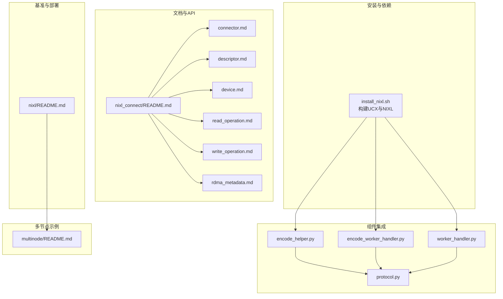
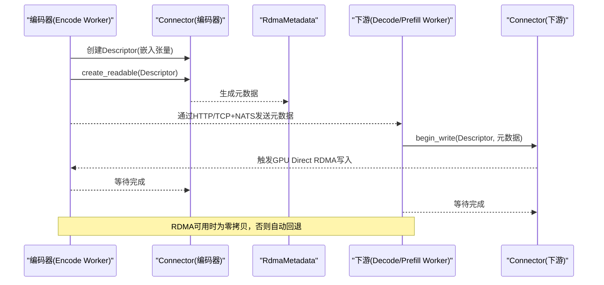
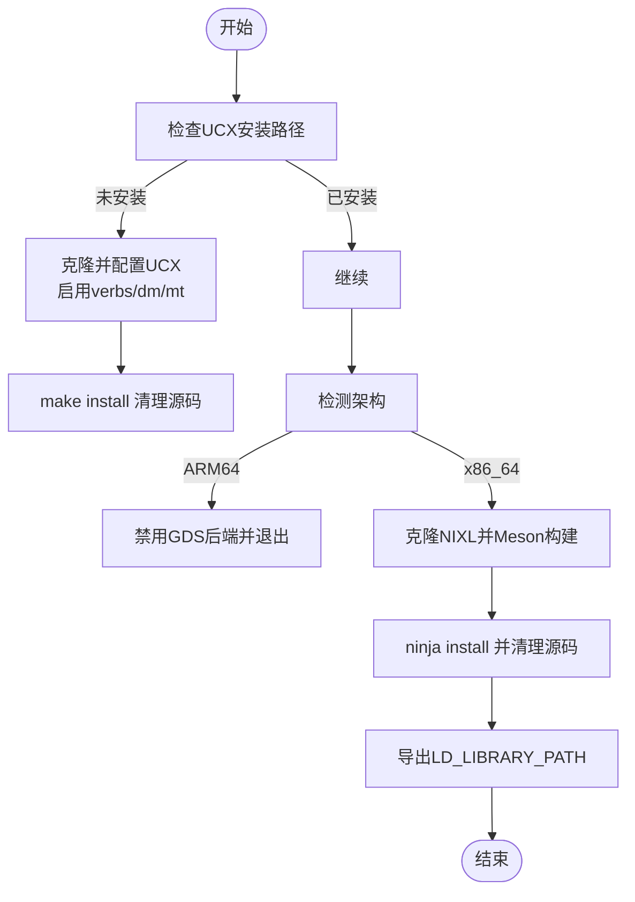
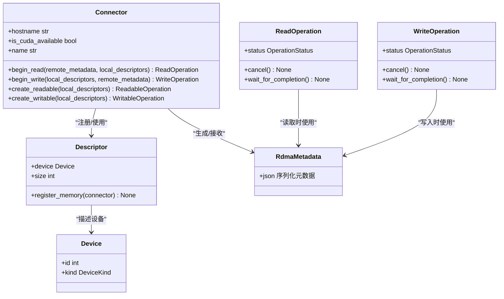
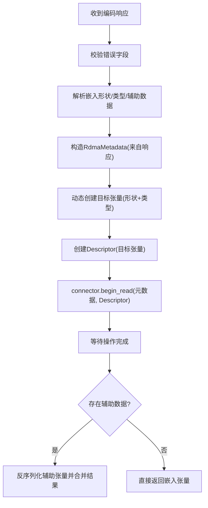
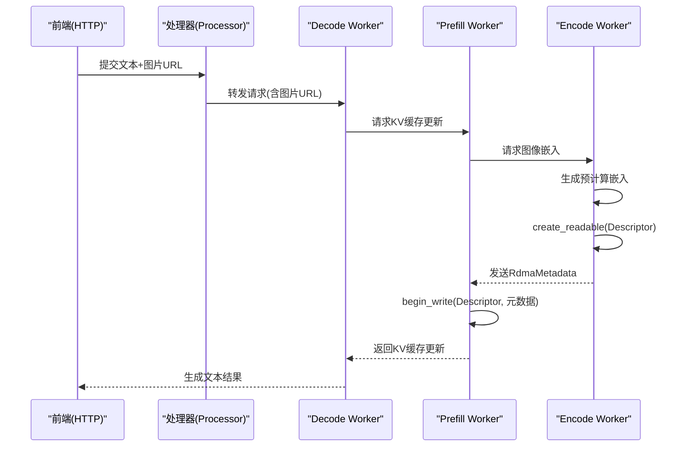
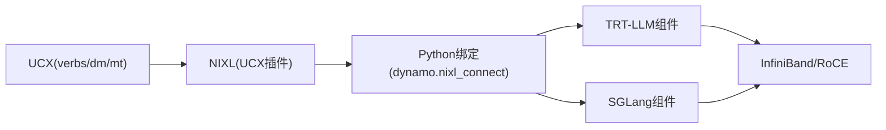

# NIXL数据传输优化

<cite>
**本文档引用的文件**
- [install_nixl.sh](file://container/deps/trtllm/install_nixl.sh)
- [README.md](file://deploy/pre-deployment/nixl/README.md)
- [README.md](file://docs/api/nixl_connect/README.md)
- [connector.md](file://docs/api/nixl_connect/connector.md)
- [descriptor.md](file://docs/api/nixl_connect/descriptor.md)
- [device.md](file://docs/api/nixl_connect/device.md)
- [read_operation.md](file://docs/api/nixl_connect/read_operation.md)
- [write_operation.md](file://docs/api/nixl_connect/write_operation.md)
- [rdma_metadata.md](file://docs/api/nixl_connect/rdma_metadata.md)
- [encode_helper.py](file://components/src/dynamo/trtllm/encode_helper.py)
- [protocol.py](file://components/src/dynamo/sglang/protocol.py)
- [encode_worker_handler.py](file://components/src/dynamo/sglang/request_handlers/multimodal/encode_worker_handler.py)
- [worker_handler.py](file://components/src/dynamo/sglang/request_handlers/multimodal/worker_handler.py)
- [README.md](file://examples/basics/multinode/README.md)
</cite>

## 目录
1. [简介](#简介)
2. [项目结构](#项目结构)
3. [核心组件](#核心组件)
4. [架构总览](#架构总览)
5. [详细组件分析](#详细组件分析)
6. [依赖关系分析](#依赖关系分析)
7. [性能考量](#性能考量)
8. [故障排查指南](#故障排查指南)
9. [结论](#结论)
10. [附录](#附录)

## 简介
本文件系统性阐述NIXL（NVIDIA InfiniBand eXtension Library）在Dynamo平台中的数据传输优化方案，重点覆盖以下方面：
- NIXL工作原理与性能优势：基于GPU Direct RDMA的零拷贝传输、动态内存注册与元数据协商、自动回退至非加速路径等。
- 分布式推理中的应用：在多模态解耦流水线中，通过NIXL在编码器与预填充/解码器之间高效传递嵌入特征，减少CPU拷贝与网络开销。
- 数据传输路径优化与带宽利用率：通过Descriptor注册、RdmaMetadata元数据交换、Readable/Writable操作配对，最大化硬件能力。
- 配置参数与调优：安装脚本中的UCX构建参数、架构差异处理、以及Python API的使用模式。
- 网络拓扑与多节点协调：端口要求、高带宽互连（InfiniBand/RoCE）的重要性、跨节点调度与延迟控制。
- 部署与监控：基准测试部署流程、验证步骤、常见问题定位与清理。

## 项目结构
围绕NIXL的关键目录与文件如下：
- 安装与依赖：容器层的NIXL安装脚本，确保UCX与NIXL正确编译与链接。
- 文档与API：Python绑定的NIXL Connect API文档，涵盖Connector、Descriptor、Device、Read/Write Operation及RdmaMetadata。
- 组件集成：TRT-LLM与SGLang组件中对NIXL的使用示例，展示从编码到下游推理的数据流。
- 基准与部署：NIXL基准部署指南，包括Kubernetes部署、镜像构建、环境变量与监控命令。
- 多节点示例：多节点部署的网络端口与硬件要求说明。

**图表来源**
- [install_nixl.sh](file://container/deps/trtllm/install_nixl.sh#L1-L81)
- [README.md](file://docs/api/nixl_connect/README.md#L1-L183)
- [connector.md](file://docs/api/nixl_connect/connector.md#L1-L191)
- [descriptor.md](file://docs/api/nixl_connect/descriptor.md#L1-L81)
- [device.md](file://docs/api/nixl_connect/device.md#L1-L64)
- [read_operation.md](file://docs/api/nixl_connect/read_operation.md#L1-L89)
- [write_operation.md](file://docs/api/nixl_connect/write_operation.md#L1-L90)
- [rdma_metadata.md](file://docs/api/nixl_connect/rdma_metadata.md#L1-L47)
- [encode_helper.py](file://components/src/dynamo/trtllm/encode_helper.py#L1-L440)
- [protocol.py](file://components/src/dynamo/sglang/protocol.py#L1-L134)
- [encode_worker_handler.py](file://components/src/dynamo/sglang/request_handlers/multimodal/encode_worker_handler.py#L1-L189)
- [worker_handler.py](file://components/src/dynamo/sglang/request_handlers/multimodal/worker_handler.py#L1-L521)
- [README.md](file://deploy/pre-deployment/nixl/README.md#L1-L292)
- [README.md](file://examples/basics/multinode/README.md#L93-L135)

**章节来源**
- [install_nixl.sh](file://container/deps/trtllm/install_nixl.sh#L1-L81)
- [README.md](file://docs/api/nixl_connect/README.md#L1-L183)
- [README.md](file://deploy/pre-deployment/nixl/README.md#L1-L292)
- [README.md](file://examples/basics/multinode/README.md#L93-L135)

## 核心组件
- Connector：连接管理核心，负责创建可读/可写操作、发起读/写操作，并返回元数据用于远端完成配对。
- Descriptor：内存描述符，封装本地内存缓冲区并注册到NIXL子系统，支持从Tensor、数组或裸指针构造。
- Device：设备抽象，区分主机与GPU设备，支持多GPU场景下的设备选择。
- ReadOperation/WriteOperation：读/写操作对象，封装异步等待完成、取消与状态查询。
- RdmaMetadata：JSON序列化后的NIXL元数据，包含远端访问所需的身份信息与密钥。
- 组件集成：TRT-LLM的EncodeHelper与SGLang的多模态处理器通过NIXL实现零拷贝传输。

**章节来源**
- [connector.md](file://docs/api/nixl_connect/connector.md#L1-L191)
- [descriptor.md](file://docs/api/nixl_connect/descriptor.md#L1-L81)
- [device.md](file://docs/api/nixl_connect/device.md#L1-L64)
- [read_operation.md](file://docs/api/nixl_connect/read_operation.md#L1-L89)
- [write_operation.md](file://docs/api/nixl_connect/write_operation.md#L1-L90)
- [rdma_metadata.md](file://docs/api/nixl_connect/rdma_metadata.md#L1-L47)
- [encode_helper.py](file://components/src/dynamo/trtllm/encode_helper.py#L130-L190)
- [protocol.py](file://components/src/dynamo/sglang/protocol.py#L119-L134)
- [encode_worker_handler.py](file://components/src/dynamo/sglang/request_handlers/multimodal/encode_worker_handler.py#L160-L171)
- [worker_handler.py](file://components/src/dynamo/sglang/request_handlers/multimodal/worker_handler.py#L106-L111)

## 架构总览
下图展示了NIXL在Dynamo多模态解耦流水线中的数据流：编码器生成嵌入后通过NIXL可读操作暴露给下游，下游通过可写操作发起RDMA写入，最终在GPU内存间完成零拷贝传输。

**图表来源**
- [README.md](file://docs/api/nixl_connect/README.md#L65-L78)
- [README.md](file://docs/api/nixl_connect/README.md#L88-L99)
- [encode_worker_handler.py](file://components/src/dynamo/sglang/request_handlers/multimodal/encode_worker_handler.py#L160-L171)
- [worker_handler.py](file://components/src/dynamo/sglang/request_handlers/multimodal/worker_handler.py#L106-L111)
- [connector.md](file://docs/api/nixl_connect/connector.md#L84-L106)

## 详细组件分析

### 安装与依赖（UCX/NIXL）
- UCX版本与安装路径：脚本固定UCX版本并启用共享库、多线程、verbs与dm支持，确保与CUDA与InfiniBand兼容。
- 架构差异：x86_64默认启用GDS后端；ARM64平台当前禁用GDS后端并提示不可用。
- 构建工具链：Meson/Ninja/pybind11，静态插件选择UCX，发布模式编译。
- 运行时库路径：安装完成后追加LD_LIBRARY_PATH，便于运行时加载。

**图表来源**
- [install_nixl.sh](file://container/deps/trtllm/install_nixl.sh#L38-L80)

**章节来源**
- [install_nixl.sh](file://container/deps/trtllm/install_nixl.sh#L26-L80)

### Python API类关系
下图展示NIXL Connect Python API的核心类及其职责与关联。

**图表来源**
- [connector.md](file://docs/api/nixl_connect/connector.md#L18-L191)
- [descriptor.md](file://docs/api/nixl_connect/descriptor.md#L17-L81)
- [device.md](file://docs/api/nixl_connect/device.md#L18-L64)
- [read_operation.md](file://docs/api/nixl_connect/read_operation.md#L18-L89)
- [write_operation.md](file://docs/api/nixl_connect/write_operation.md#L18-L90)
- [rdma_metadata.md](file://docs/api/nixl_connect/rdma_metadata.md#L18-L47)

**章节来源**
- [connector.md](file://docs/api/nixl_connect/connector.md#L18-L191)
- [descriptor.md](file://docs/api/nixl_connect/descriptor.md#L17-L81)
- [device.md](file://docs/api/nixl_connect/device.md#L18-L64)
- [read_operation.md](file://docs/api/nixl_connect/read_operation.md#L18-L89)
- [write_operation.md](file://docs/api/nixl_connect/write_operation.md#L18-L90)
- [rdma_metadata.md](file://docs/api/nixl_connect/rdma_metadata.md#L18-L47)

### TRT-LLM嵌入读取流程
该流程演示如何在TRT-LLM侧通过NIXL读取编码器产生的嵌入，动态分配张量、创建Descriptor并发起begin_read，等待完成后再进行后续处理。

**图表来源**
- [encode_helper.py](file://components/src/dynamo/trtllm/encode_helper.py#L130-L190)

**章节来源**
- [encode_helper.py](file://components/src/dynamo/trtllm/encode_helper.py#L130-L190)

### SGLang多模态流水线
- 编码器侧：生成预计算嵌入，创建Descriptor并通过create_readable暴露，生成RdmaMetadata并通过消息通道发送给下游。
- 下游侧：根据请求中的元数据创建WritableOperation，触发GPU Direct RDMA写入，完成后继续推理。

**图表来源**
- [README.md](file://docs/api/nixl_connect/README.md#L104-L152)
- [encode_worker_handler.py](file://components/src/dynamo/sglang/request_handlers/multimodal/encode_worker_handler.py#L160-L171)
- [worker_handler.py](file://components/src/dynamo/sglang/request_handlers/multimodal/worker_handler.py#L106-L111)

**章节来源**
- [README.md](file://docs/api/nixl_connect/README.md#L104-L152)
- [encode_worker_handler.py](file://components/src/dynamo/sglang/request_handlers/multimodal/encode_worker_handler.py#L160-L171)
- [worker_handler.py](file://components/src/dynamo/sglang/request_handlers/multimodal/worker_handler.py#L106-L111)

## 依赖关系分析
- 安装阶段：install_nixl.sh依赖UCX与NIXL源码，通过Meson构建并安装至系统库路径。
- 运行阶段：组件通过dynamo.nixl_connect导入Python绑定，使用Connector与Descriptor进行内存注册与操作配对。
- 多节点：多节点示例强调端口可达性与高带宽互连，以保障NIXL RDMA路径的稳定性与低延迟。

**图表来源**
- [install_nixl.sh](file://container/deps/trtllm/install_nixl.sh#L38-L80)
- [encode_helper.py](file://components/src/dynamo/trtllm/encode_helper.py#L12-L13)
- [protocol.py](file://components/src/dynamo/sglang/protocol.py#L9-L11)
- [README.md](file://examples/basics/multinode/README.md#L93-L101)

**章节来源**
- [install_nixl.sh](file://container/deps/trtllm/install_nixl.sh#L38-L80)
- [encode_helper.py](file://components/src/dynamo/trtllm/encode_helper.py#L12-L13)
- [protocol.py](file://components/src/dynamo/sglang/protocol.py#L9-L11)
- [README.md](file://examples/basics/multinode/README.md#L93-L101)

## 性能考量
- GPU Direct RDMA零拷贝：当硬件与驱动满足条件时，NIXL可直接在GPU内存间传输，避免CPU拷贝与内核态切换。
- 动态内存注册：Descriptor负责注册本地内存，支持多种输入形式，简化集成复杂度。
- 自动回退：若RDMA不可用，系统自动选择次优路径，保证功能可用性。
- 端口与网络：多节点部署需开放etcd、NATS、前端HTTP与自定义引导端口，并优先使用InfiniBand/RoCE以获得更高带宽与更低延迟。
- 架构差异：x86_64启用GDS后端，ARM64当前禁用，部署前需确认目标平台支持情况。

**章节来源**
- [README.md](file://docs/api/nixl_connect/README.md#L26-L35)
- [README.md](file://examples/basics/multinode/README.md#L93-L101)
- [install_nixl.sh](file://container/deps/trtllm/install_nixl.sh#L60-L69)

## 故障排查指南
- 集群级问题：先执行预部署检查，确认kubectl连通、GPU节点标签、GPU Operator状态。
- NIXL特定问题：
  - ETCD连接：确认服务运行、端点可达、命名空间正确。
  - 镜像拉取：检查仓库凭证、镜像存在性与推送状态。
  - 构建失败：确认Docker守护进程、磁盘空间、网络连通、工具安装。
  - 部署文件缺失：先生成再部署，检查权限与路径。
- 调试命令：列出生成文件、查看部署状态、获取事件列表。
- 清理：删除部署与生成的YAML文件。

**章节来源**
- [README.md](file://deploy/pre-deployment/nixl/README.md#L210-L276)

## 结论
NIXL通过GPU Direct RDMA与动态内存注册，在Dynamo的多模态与分布式推理场景中实现了高效的零拷贝数据传输。结合Python API的易用性与自动回退机制，既提升了吞吐与延迟表现，又增强了部署灵活性。配合正确的网络拓扑与多节点端口配置，可在大规模推理任务中显著降低传输延迟并提高带宽利用率。

## 附录
- 部署与监控要点：
  - 使用交互式脚本构建镜像、更新部署文件并部署到Kubernetes。
  - 关注Pod状态、日志与资源使用，必要时指定命名空间。
  - 清理时删除部署并移除生成文件。

**章节来源**
- [README.md](file://deploy/pre-deployment/nixl/README.md#L50-L206)