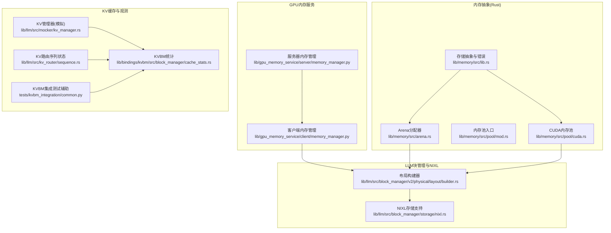
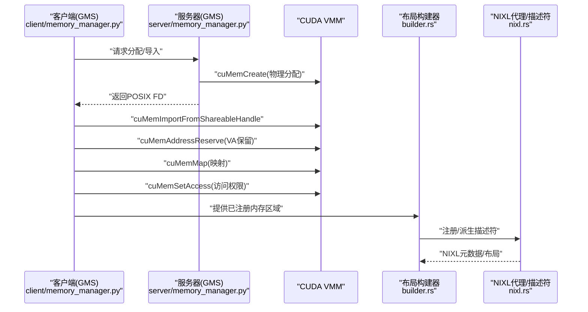
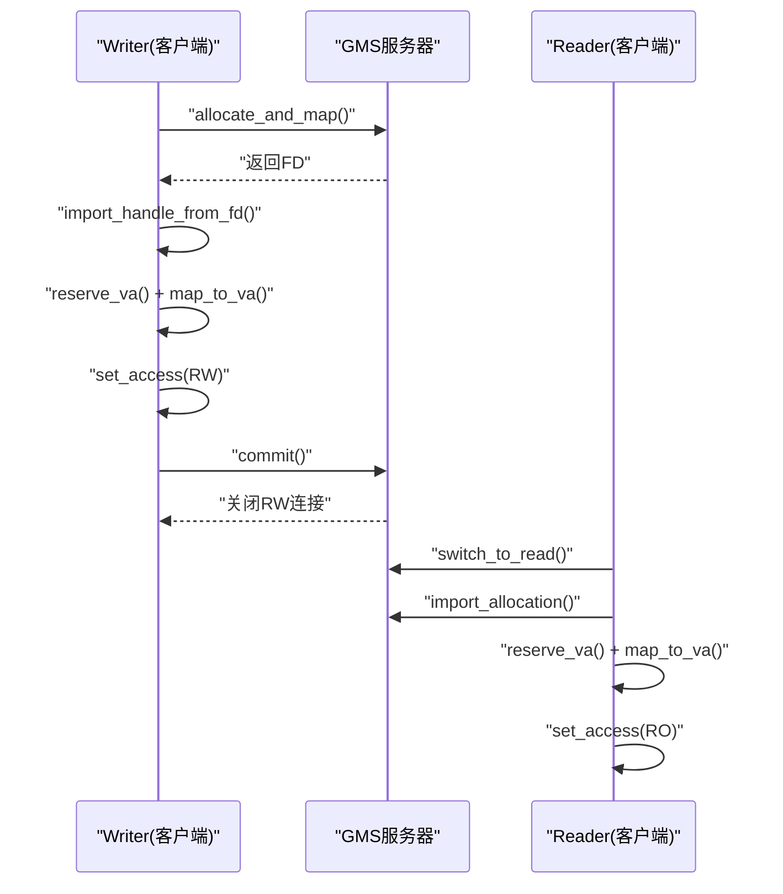
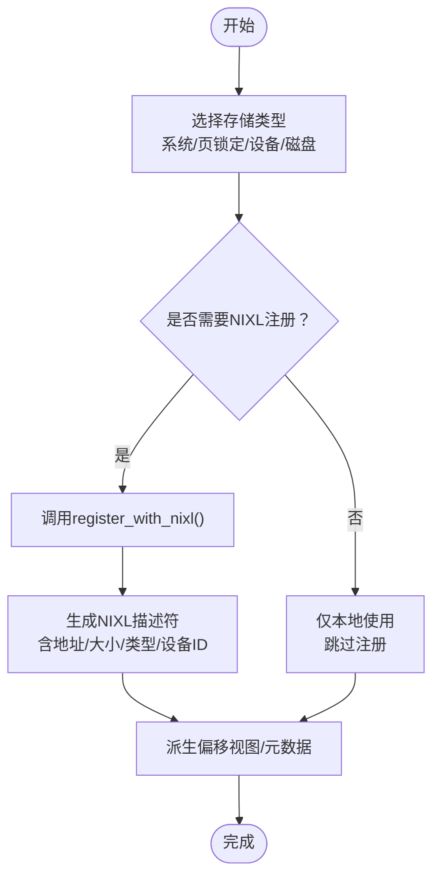
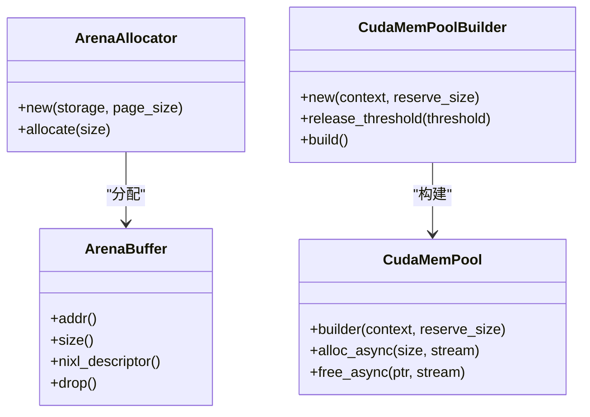
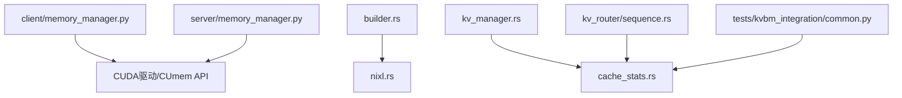

# 内存优化

<cite>
**本文引用的文件**
- [lib/gpu_memory_service/server/memory_manager.py](file://lib/gpu_memory_service/server/memory_manager.py)
- [lib/gpu_memory_service/client/memory_manager.py](file://lib/gpu_memory_service/client/memory_manager.py)
- [lib/memory/src/lib.rs](file://lib/memory/src/lib.rs)
- [lib/memory/src/arena.rs](file://lib/memory/src/arena.rs)
- [lib/memory/src/pool/mod.rs](file://lib/memory/src/pool/mod.rs)
- [lib/memory/src/pool/cuda.rs](file://lib/memory/src/pool/cuda.rs)
- [lib/llm/src/block_manager/v2/physical/layout/builder.rs](file://lib/llm/src/block_manager/v2/physical/layout/builder.rs)
- [lib/llm/src/block_manager/storage/nixl.rs](file://lib/llm/src/block_manager/storage/nixl.rs)
- [docs/kvbm/kvbm_design_deepdive.md](file://docs/kvbm/kvbm_design_deepdive.md)
- [fern/pages/kvbm/kvbm-design-deepdive.md](file://fern/pages/kvbm/kvbm-design-deepdive.md)
- [lib/llm/src/mocker/kv_manager.rs](file://lib/llm/src/mocker/kv_manager.rs)
- [lib/bindings/kvbm/src/block_manager/cache_stats.rs](file://lib/bindings/kvbm/src/block_manager/cache_stats.rs)
- [lib/llm/src/kv_router/sequence.rs](file://lib/llm/src/kv_router/sequence.rs)
- [tests/kvbm_integration/common.py](file://tests/kvbm_integration/common.py)
</cite>

## 目录
1. [引言](#引言)
2. [项目结构](#项目结构)
3. [核心组件](#核心组件)
4. [架构总览](#架构总览)
5. [详细组件分析](#详细组件分析)
6. [依赖关系分析](#依赖关系分析)
7. [性能考量](#性能考量)
8. [故障排查指南](#故障排查指南)
9. [结论](#结论)
10. [附录](#附录)

## 引言
本指南聚焦于Dynamo在GPU内存管理与KV缓存优化方面的系统性设计与实现，覆盖以下主题：
- GPU内存管理服务（GMS）：基于CUDA VMM的物理内存分配、导出共享句柄、客户端VA映射与访问控制。
- NIXL远程内存注册与布局同步：跨节点共享与RDMA式传输的抽象与序列化/反序列化。
- 多级内存层次结构：系统内存、页锁定内存、设备显存、磁盘存储的统一建模与分层布局。
- KV缓存内存管理：块管理器、LRU淘汰、引用计数与部分块到全块的提升策略。
- 块管理器优化与内存池：Arena分配器、CUDA内存池、偏移视图与注册描述符。
- 内存分配策略、复用与泄漏防护：RAII生命周期、句柄自动清理、VA稳定重映射。
- 内存监控与压力处理：KVBM统计滑动窗口、离线测试验证卸载行为。

## 项目结构
围绕内存优化的关键模块分布如下：
- GPU内存服务（Python）：服务端负责物理分配与导出；客户端负责导入、VA保留与映射、只读/读写切换、VA稳定卸载与重映射。
- 内存抽象与分配（Rust）：统一的存储类型、NIXL兼容描述符、Arena分配器、CUDA内存池。
- LLM块管理与NIXL集成（Rust）：布局构建器、注册流程、偏移视图派生、元数据推导。
- KV缓存与路由（Rust/Python）：块管理器、事件发布、统计跟踪、KVBM集成测试。

**图表来源**
- [lib/gpu_memory_service/server/memory_manager.py](file://lib/gpu_memory_service/server/memory_manager.py#L58-L223)
- [lib/gpu_memory_service/client/memory_manager.py](file://lib/gpu_memory_service/client/memory_manager.py#L105-L651)
- [lib/memory/src/lib.rs](file://lib/memory/src/lib.rs#L1-L179)
- [lib/memory/src/arena.rs](file://lib/memory/src/arena.rs#L1-L470)
- [lib/memory/src/pool/mod.rs](file://lib/memory/src/pool/mod.rs#L1-L9)
- [lib/memory/src/pool/cuda.rs](file://lib/memory/src/pool/cuda.rs#L1-L352)
- [lib/llm/src/block_manager/v2/physical/layout/builder.rs](file://lib/llm/src/block_manager/v2/physical/layout/builder.rs#L1-L865)
- [lib/llm/src/block_manager/storage/nixl.rs](file://lib/llm/src/block_manager/storage/nixl.rs#L1-L415)
- [lib/llm/src/mocker/kv_manager.rs](file://lib/llm/src/mocker/kv_manager.rs#L1-L121)
- [lib/bindings/kvbm/src/block_manager/cache_stats.rs](file://lib/bindings/kvbm/src/block_manager/cache_stats.rs#L1-L31)
- [lib/llm/src/kv_router/sequence.rs](file://lib/llm/src/kv_router/sequence.rs#L145-L172)
- [tests/kvbm_integration/common.py](file://tests/kvbm_integration/common.py#L860-L889)

**章节来源**
- [lib/gpu_memory_service/server/memory_manager.py](file://lib/gpu_memory_service/server/memory_manager.py#L1-L223)
- [lib/gpu_memory_service/client/memory_manager.py](file://lib/gpu_memory_service/client/memory_manager.py#L1-L651)
- [lib/memory/src/lib.rs](file://lib/memory/src/lib.rs#L1-L179)
- [lib/memory/src/arena.rs](file://lib/memory/src/arena.rs#L1-L470)
- [lib/memory/src/pool/mod.rs](file://lib/memory/src/pool/mod.rs#L1-L9)
- [lib/memory/src/pool/cuda.rs](file://lib/memory/src/pool/cuda.rs#L1-L352)
- [lib/llm/src/block_manager/v2/physical/layout/builder.rs](file://lib/llm/src/block_manager/v2/physical/layout/builder.rs#L1-L865)
- [lib/llm/src/block_manager/storage/nixl.rs](file://lib/llm/src/block_manager/storage/nixl.rs#L1-L415)
- [lib/llm/src/mocker/kv_manager.rs](file://lib/llm/src/mocker/kv_manager.rs#L1-L121)
- [lib/bindings/kvbm/src/block_manager/cache_stats.rs](file://lib/bindings/kvbm/src/block_manager/cache_stats.rs#L1-L31)
- [lib/llm/src/kv_router/sequence.rs](file://lib/llm/src/kv_router/sequence.rs#L145-L172)
- [tests/kvbm_integration/common.py](file://tests/kvbm_integration/common.py#L860-L889)

## 核心组件
- GPU内存服务（GMS）
  - 服务器：通过CUDA VMM创建物理分配，导出POSIX文件描述符用于进程间共享，不进行VA映射以避免驱动失败影响。
  - 客户端：支持RW/RO锁模式，导入共享句柄、保留VA、映射本地、设置访问权限；提供VA稳定卸载/重映射，确保指针稳定。
- 内存抽象与分配
  - 统一存储类型（系统/页锁定/设备/磁盘）、NIXL兼容描述符、类型擦除缓冲区。
  - Arena分配器：页对齐、连续分配、线程安全、析构释放。
  - CUDA内存池：预热、异步分配/释放、阈值回收、线程安全串行化。
- LLM块管理与NIXL
  - 布局构建器：配置→布局选择→内存规划（分配或已注册区域），自动NIXL注册与描述符派生。
  - NIXL存储支持：远程描述符、注册/去注册、内存类型映射、设备ID跟踪。
- KV缓存与路由
  - KV管理器：活跃/非活跃块池、LRU淘汰、手动引用计数、部分块提升为全块。
  - 统计与观测：滑动窗口命中率、周期性日志、集成测试验证卸载行为。

**章节来源**
- [lib/gpu_memory_service/server/memory_manager.py](file://lib/gpu_memory_service/server/memory_manager.py#L58-L223)
- [lib/gpu_memory_service/client/memory_manager.py](file://lib/gpu_memory_service/client/memory_manager.py#L105-L651)
- [lib/memory/src/lib.rs](file://lib/memory/src/lib.rs#L1-L179)
- [lib/memory/src/arena.rs](file://lib/memory/src/arena.rs#L1-L470)
- [lib/memory/src/pool/cuda.rs](file://lib/memory/src/pool/cuda.rs#L1-L352)
- [lib/llm/src/block_manager/v2/physical/layout/builder.rs](file://lib/llm/src/block_manager/v2/physical/layout/builder.rs#L1-L865)
- [lib/llm/src/block_manager/storage/nixl.rs](file://lib/llm/src/block_manager/storage/nixl.rs#L1-L415)
- [lib/llm/src/mocker/kv_manager.rs](file://lib/llm/src/mocker/kv_manager.rs#L1-L121)
- [lib/bindings/kvbm/src/block_manager/cache_stats.rs](file://lib/bindings/kvbm/src/block_manager/cache_stats.rs#L1-L31)

## 架构总览
下图展示从GPU内存服务到LLM块管理与NIXL的端到端交互路径，以及KV缓存统计与测试验证闭环。

**图表来源**
- [lib/gpu_memory_service/client/memory_manager.py](file://lib/gpu_memory_service/client/memory_manager.py#L219-L322)
- [lib/gpu_memory_service/server/memory_manager.py](file://lib/gpu_memory_service/server/memory_manager.py#L110-L180)
- [lib/llm/src/block_manager/v2/physical/layout/builder.rs](file://lib/llm/src/block_manager/v2/physical/layout/builder.rs#L351-L490)
- [lib/llm/src/block_manager/storage/nixl.rs](file://lib/llm/src/block_manager/storage/nixl.rs#L160-L219)

## 详细组件分析

### GPU内存服务（GMS）工作原理与优化
- 服务器侧
  - 使用CUDA VMM创建物理分配，导出POSIX文件描述符，便于跨进程共享。
  - 不映射VA，避免创建CUDA上下文，提高对驱动异常的韧性。
  - 提供列表、查询、清空等操作，支持按标签聚合。
- 客户端侧
  - 支持RW/RO锁模式，RW用于权重加载与发布，RO用于推理阶段只读访问。
  - 导入FD后保留VA并映射，设置访问权限；VA稳定卸载/重映射保证指针不变。
  - 提供提交发布（发布权重、关闭RW连接）、切换只读、清理等能力。
- 优化要点
  - VA稳定重映射：卸载时保留VA，重映射时校验布局哈希，防止结构变化导致的数据不一致。
  - 访问控制：根据锁类型设置RW/RO，减少不必要的写屏障。
  - 错误检测：StaleMemoryLayoutError用于检测结构变更，保障一致性。

**图表来源**
- [lib/gpu_memory_service/client/memory_manager.py](file://lib/gpu_memory_service/client/memory_manager.py#L219-L358)
- [lib/gpu_memory_service/server/memory_manager.py](file://lib/gpu_memory_service/server/memory_manager.py#L110-L180)

**章节来源**
- [lib/gpu_memory_service/server/memory_manager.py](file://lib/gpu_memory_service/server/memory_manager.py#L58-L223)
- [lib/gpu_memory_service/client/memory_manager.py](file://lib/gpu_memory_service/client/memory_manager.py#L105-L651)

### NIXL内存传输优化与多级内存层次
- NIXL远程内存集成
  - 通过NIXL代理注册内存区域，生成可序列化的描述符，支持跨节点共享与RDMA式传输。
  - 远程描述符包含地址、大小、内存类型（VRAM/DRAM/FILE）与设备ID，便于跨系统布局对齐。
- 多级内存层次结构
  - 系统内存/页锁定内存：适合主机侧数据与CPU/GPU间拷贝。
  - 设备显存：直接GPU访问，NIXL注册后可跨节点远程访问。
  - 磁盘存储：文件映射，注册后可作为远程内存使用。
- 布局构建与注册
  - 布局构建器根据配置计算所需尺寸，按策略分配或复用已注册区域，自动派生偏移视图与描述符。
  - 注册决策依据存储类型与可用后端（UCX/GDS/POSIX），未注册区域仅限本地使用。

**图表来源**
- [lib/llm/src/block_manager/v2/physical/layout/builder.rs](file://lib/llm/src/block_manager/v2/physical/layout/builder.rs#L434-L490)
- [lib/llm/src/block_manager/storage/nixl.rs](file://lib/llm/src/block_manager/storage/nixl.rs#L160-L219)

**章节来源**
- [lib/llm/src/block_manager/storage/nixl.rs](file://lib/llm/src/block_manager/storage/nixl.rs#L1-L415)
- [lib/llm/src/block_manager/v2/physical/layout/builder.rs](file://lib/llm/src/block_manager/v2/physical/layout/builder.rs#L351-L490)
- [docs/kvbm/kvbm_design_deepdive.md](file://docs/kvbm/kvbm_design_deepdive.md#L116-L173)
- [fern/pages/kvbm/kvbm-design-deepdive.md](file://fern/pages/kvbm/kvbm-design-deepdive.md#L91-L159)

### KV缓存内存管理、块管理器优化与内存池
- KV管理器（模拟）
  - 活跃/非活跃块池，LRU淘汰策略；手动引用计数，单引用块标记为“分数块”参与调度。
  - 支持Use/Deref/Destroy/Promote四种信号，Promote将部分块提升为全块。
- 块管理器优化
  - Arena分配器：页对齐、连续分配、线程安全、析构释放，适合热路径小对象分配。
  - CUDA内存池：预热、异步分配/释放、阈值回收，降低频繁分配开销。
  - 偏移视图与描述符：从基础注册存储派生子区域描述符，支持跨节点布局一致性。
- 内存池技术
  - CUDA内存池通过cuMemPool接口实现，内部互斥串行化主机侧调用，GPU侧保持异步流序。

**图表来源**
- [lib/memory/src/arena.rs](file://lib/memory/src/arena.rs#L75-L230)
- [lib/memory/src/pool/cuda.rs](file://lib/memory/src/pool/cuda.rs#L27-L284)

**章节来源**
- [lib/llm/src/mocker/kv_manager.rs](file://lib/llm/src/mocker/kv_manager.rs#L1-L121)
- [lib/memory/src/arena.rs](file://lib/memory/src/arena.rs#L1-L470)
- [lib/memory/src/pool/cuda.rs](file://lib/memory/src/pool/cuda.rs#L1-L352)
- [lib/memory/src/lib.rs](file://lib/memory/src/lib.rs#L1-L179)

### 内存分配策略、复用与泄漏防护
- 分配策略
  - 布局构建器按配置计算总需求，按系统/页锁定/设备/磁盘策略分配，或复用已注册区域。
  - 页对齐与偏移派生，确保跨节点布局语义一致。
- 内存复用
  - CUDA内存池：预热后复用，释放回池而非立即归还系统，超过阈值再回收。
  - Arena分配器：析构时释放页，支持后续重用。
- 泄漏防护
  - NIXL注册句柄RAII：注册后自动清理，避免悬挂注册。
  - GMS客户端VA稳定卸载/重映射：卸载保留VA，重映射校验布局哈希，防止结构变更导致的悬空指针。

**章节来源**
- [lib/llm/src/block_manager/v2/physical/layout/builder.rs](file://lib/llm/src/block_manager/v2/physical/layout/builder.rs#L596-L631)
- [lib/memory/src/pool/cuda.rs](file://lib/memory/src/pool/cuda.rs#L286-L300)
- [lib/llm/src/block_manager/storage/nixl.rs](file://lib/llm/src/block_manager/storage/nixl.rs#L152-L158)
- [lib/gpu_memory_service/client/memory_manager.py](file://lib/gpu_memory_service/client/memory_manager.py#L533-L637)

### GPU内存使用监控、内存压力处理与碎片整理
- 监控与统计
  - KVBM统计采用滑动窗口记录主机/磁盘缓存命中情况，周期性输出日志。
  - 集成测试通过前后指标差值判断是否存在卸载活动，验证内存压力下的确定性行为。
- 压力处理
  - KV管理器在Use失败时触发抢占信号，避免新请求因水位检查而失败。
  - KVBM通过统计与测试验证在高负载下仍能产生卸载行为。
- 碎片整理
  - CUDA内存池通过阈值属性将闲置内存归还系统，缓解碎片。
  - Arena分配器按页粒度管理，减少外部碎片；偏移视图派生避免内部碎片。

**章节来源**
- [lib/bindings/kvbm/src/block_manager/cache_stats.rs](file://lib/bindings/kvbm/src/block_manager/cache_stats.rs#L1-L31)
- [tests/kvbm_integration/common.py](file://tests/kvbm_integration/common.py#L860-L889)
- [lib/llm/src/mocker/kv_manager.rs](file://lib/llm/src/mocker/kv_manager.rs#L26-L29)
- [lib/memory/src/pool/cuda.rs](file://lib/memory/src/pool/cuda.rs#L80-L97)

## 依赖关系分析
- 组件耦合
  - GMS客户端依赖CUDA驱动API与Unix域套接字RPC；服务器依赖CUDA VMM。
  - 布局构建器依赖NIXL代理与存储类型，自动决定是否注册与派生描述符。
  - KV管理器依赖LRU淘汰与事件发布，统计模块提供观测数据。
- 外部依赖
  - CUDA VMM/CUDA驱动、NIXL后端（UCX/GDS/POSIX）、操作系统文件描述符传递。

**图表来源**
- [lib/gpu_memory_service/client/memory_manager.py](file://lib/gpu_memory_service/client/memory_manager.py#L1-L651)
- [lib/gpu_memory_service/server/memory_manager.py](file://lib/gpu_memory_service/server/memory_manager.py#L1-L223)
- [lib/llm/src/block_manager/v2/physical/layout/builder.rs](file://lib/llm/src/block_manager/v2/physical/layout/builder.rs#L1-L865)
- [lib/llm/src/block_manager/storage/nixl.rs](file://lib/llm/src/block_manager/storage/nixl.rs#L1-L415)
- [lib/llm/src/mocker/kv_manager.rs](file://lib/llm/src/mocker/kv_manager.rs#L1-L121)
- [lib/bindings/kvbm/src/block_manager/cache_stats.rs](file://lib/bindings/kvbm/src/block_manager/cache_stats.rs#L1-L31)
- [lib/llm/src/kv_router/sequence.rs](file://lib/llm/src/kv_router/sequence.rs#L145-L172)
- [tests/kvbm_integration/common.py](file://tests/kvbm_integration/common.py#L860-L889)

**章节来源**
- [lib/gpu_memory_service/client/memory_manager.py](file://lib/gpu_memory_service/client/memory_manager.py#L1-L651)
- [lib/gpu_memory_service/server/memory_manager.py](file://lib/gpu_memory_service/server/memory_manager.py#L1-L223)
- [lib/llm/src/block_manager/v2/physical/layout/builder.rs](file://lib/llm/src/block_manager/v2/physical/layout/builder.rs#L1-L865)
- [lib/llm/src/block_manager/storage/nixl.rs](file://lib/llm/src/block_manager/storage/nixl.rs#L1-L415)
- [lib/llm/src/mocker/kv_manager.rs](file://lib/llm/src/mocker/kv_manager.rs#L1-L121)
- [lib/bindings/kvbm/src/block_manager/cache_stats.rs](file://lib/bindings/kvbm/src/block_manager/cache_stats.rs#L1-L31)
- [lib/llm/src/kv_router/sequence.rs](file://lib/llm/src/kv_router/sequence.rs#L145-L172)
- [tests/kvbm_integration/common.py](file://tests/kvbm_integration/common.py#L860-L889)

## 性能考量
- 减少分配开销
  - 使用CUDA内存池预热，避免频繁cuMemAlloc/cudaFree带来的同步开销。
  - Arena分配器在热路径上提供连续页分配，降低外部碎片与分配次数。
- 降低跨节点通信成本
  - NIXL注册后仅传输描述符，结合序列化布局元数据，避免重复传输原始数据。
  - UCX/GDS后端选择依据存储类型与硬件条件，最大化带宽与延迟表现。
- 保持指针稳定性
  - VA稳定卸载/重映射确保模型权重在推理期间指针不变，减少指针失效带来的重绑定成本。
- 控制内存膨胀
  - 通过释放阈值将闲置内存归还系统，配合LRU淘汰与分数块策略，平衡命中率与内存占用。

## 故障排查指南
- GMS客户端常见问题
  - StaleMemoryLayoutError：当布局结构在卸载期间被修改时触发，需重新导入或等待结构稳定。
  - unmap/remap失败：检查锁状态、VA保留、句柄有效性与设备一致性。
- NIXL注册问题
  - 注册失败：确认后端可用（UCX/GDS/POSIX），设备ID与内存类型匹配。
  - 描述符为空：在测试构建中允许未注册布局，生产构建必须注册。
- KV缓存问题
  - Use失败触发抢占：检查水位与LRU淘汰策略，必要时增大容量或调整页面大小。
  - 统计无卸载：通过集成测试辅助函数对比前后指标，确认存在内存压力场景。

**章节来源**
- [lib/gpu_memory_service/client/memory_manager.py](file://lib/gpu_memory_service/client/memory_manager.py#L50-L67)
- [lib/llm/src/block_manager/v2/physical/layout/builder.rs](file://lib/llm/src/block_manager/v2/physical/layout/builder.rs#L434-L490)
- [lib/llm/src/mocker/kv_manager.rs](file://lib/llm/src/mocker/kv_manager.rs#L26-L29)
- [tests/kvbm_integration/common.py](file://tests/kvbm_integration/common.py#L860-L889)

## 结论
Dynamo的内存优化体系以“服务化GPU内存+多级存储+远程内存注册+NIXL传输+KV缓存统计”为核心，形成从分配、共享、映射到观测的完整闭环。通过CUDA内存池与Arena分配器降低分配开销，通过NIXL实现跨节点高效传输，通过VA稳定重映射与严格的生命周期管理保障一致性与安全性，最终在高负载与复杂拓扑下实现稳定的性能与可维护性。

## 附录
- 最佳实践
  - 在高并发场景启用GMS的RW/RO锁与VA稳定重映射，避免频繁VA变更。
  - 合理设置CUDA内存池阈值，平衡内存占用与回收频率。
  - 使用Arena分配器管理热路径小对象，减少外部碎片。
  - 在跨节点部署中优先启用NIXL注册与元数据交换，确保布局一致性。
- 性能调优案例
  - 通过KVBM统计滑动窗口观察命中率变化，结合集成测试验证压力下的确定性行为。
  - 调整页大小与LRU容量，观察吞吐与延迟权衡，定位瓶颈点。