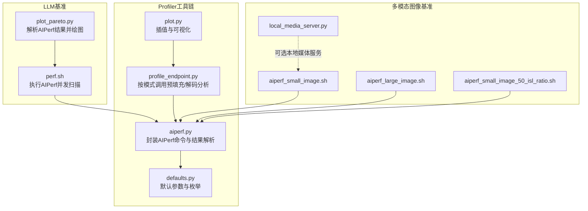
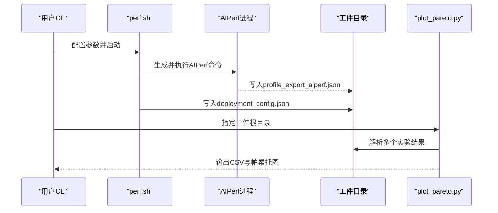
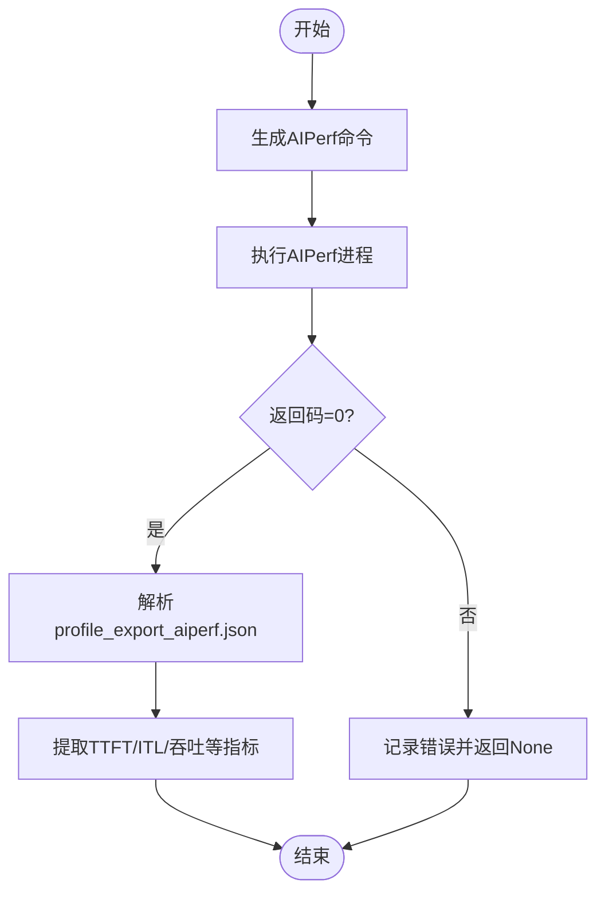
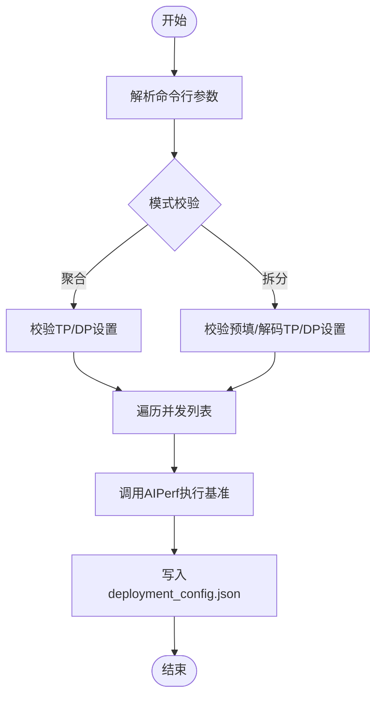
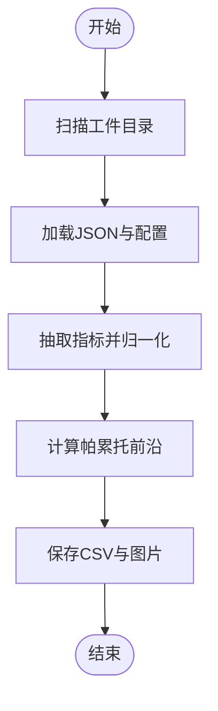
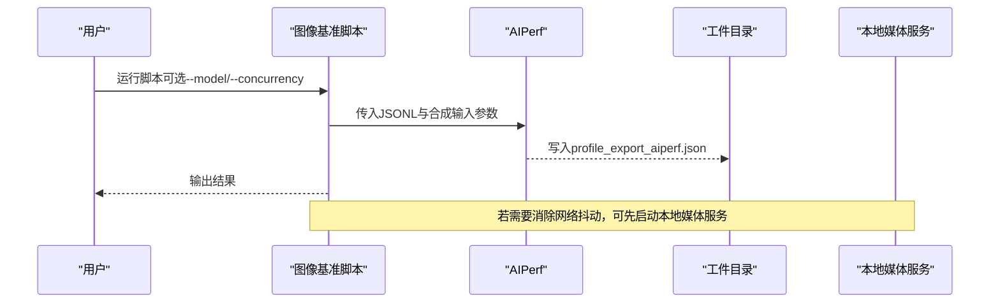
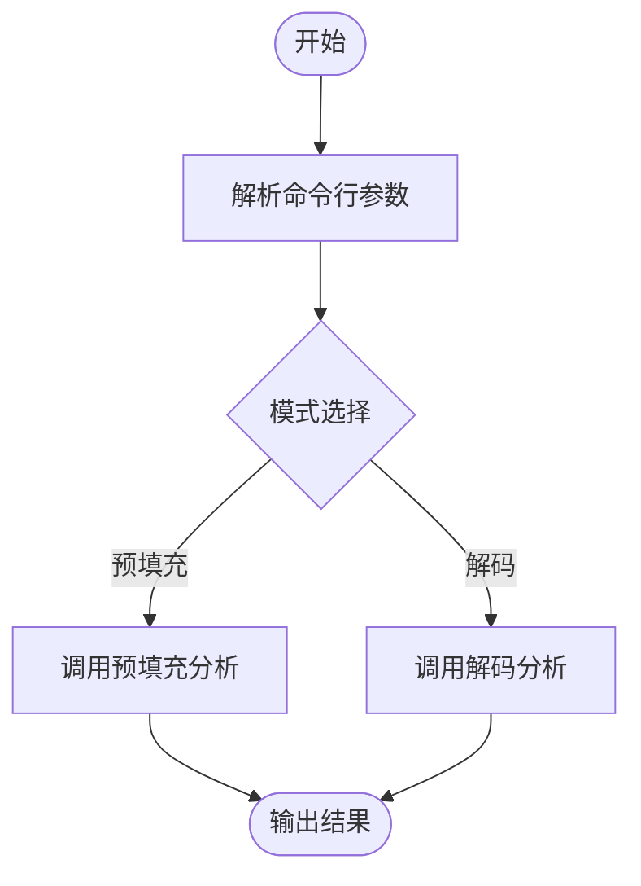
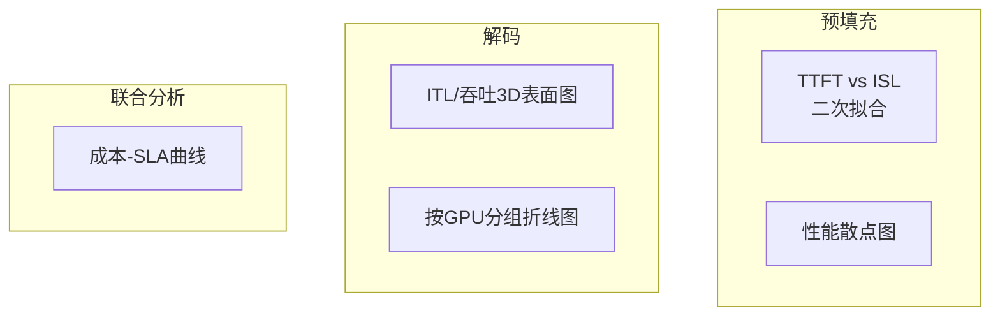
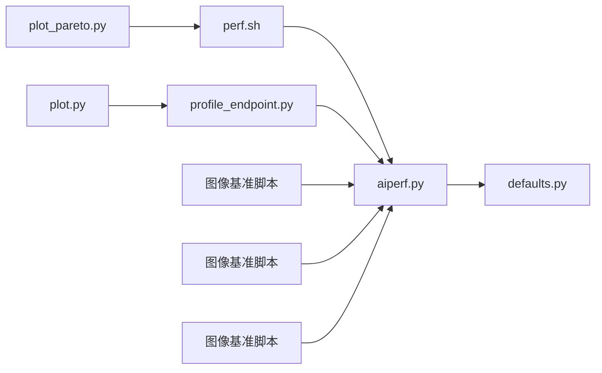

# 基准测试工具

<cite>
**本文引用的文件**
- [benchmarks/llm/perf.sh](file://benchmarks/llm/perf.sh)
- [benchmarks/profiler/utils/aiperf.py](file://benchmarks/profiler/utils/aiperf.py)
- [benchmarks/profiler/profile_endpoint.py](file://benchmarks/profiler/profile_endpoint.py)
- [benchmarks/llm/plot_pareto.py](file://benchmarks/llm/plot_pareto.py)
- [benchmarks/profiler/utils/defaults.py](file://benchmarks/profiler/utils/defaults.py)
- [benchmarks/profiler/utils/plot.py](file://benchmarks/profiler/utils/plot.py)
- [benchmarks/multimodal/image/aiperf_small_image.sh](file://benchmarks/multimodal/image/aiperf_small_image.sh)
- [benchmarks/multimodal/image/aiperf_large_image.sh](file://benchmarks/multimodal/image/aiperf_large_image.sh)
- [benchmarks/multimodal/image/aiperf_small_image_50_isl_ratio.sh](file://benchmarks/multimodal/image/aiperf_small_image_50_isl_ratio.sh)
- [benchmarks/multimodal/local_media_server.py](file://benchmarks/multimodal/local_media_server.py)
- [benchmarks/README.md](file://benchmarks/README.md)
- [benchmarks/llm/README.md](file://benchmarks/llm/README.md)
- [tests/planner/utils/load_generator.py](file://tests/planner/utils/load_generator.py)
</cite>

## 目录
1. [简介](#简介)
2. [项目结构](#项目结构)
3. [核心组件](#核心组件)
4. [架构总览](#架构总览)
5. [详细组件分析](#详细组件分析)
6. [依赖关系分析](#依赖关系分析)
7. [性能考量](#性能考量)
8. [故障排查指南](#故障排查指南)
9. [结论](#结论)
10. [附录](#附录)

## 简介
本文件系统化梳理Dynamo基准测试工具链，重点覆盖以下方面：
- AIPerf工具在Dynamo部署中的使用方法与参数配置
- LLM基准测试脚本perf.sh的执行流程与参数说明
- 多模态（图像）基准测试脚本的使用方法与图像/音频编码评估思路
- 性能分析工具（AIPerf结果解析、帕累托图绘制、插值与可视化）
- 实战案例、测试环境配置与结果解读方法
- 性能回归检测与对比分析方法论

## 项目结构
本仓库的基准测试相关能力主要分布在以下路径：
- LLM基准：benchmarks/llm/perf.sh、benchmarks/llm/plot_pareto.py
- Profiler工具链：benchmarks/profiler/utils/aiperf.py、benchmarks/profiler/utils/defaults.py、benchmarks/profiler/utils/plot.py、benchmarks/profiler/profile_endpoint.py
- 多模态图像基准：benchmarks/multimodal/image/*.sh、benchmarks/multimodal/local_media_server.py
- 通用基准框架与使用说明：benchmarks/README.md、benchmarks/llm/README.md

**图表来源**
- [benchmarks/llm/perf.sh](file://benchmarks/llm/perf.sh#L211-L242)
- [benchmarks/llm/plot_pareto.py](file://benchmarks/llm/plot_pareto.py#L261-L273)
- [benchmarks/profiler/utils/aiperf.py](file://benchmarks/profiler/utils/aiperf.py#L40-L154)
- [benchmarks/profiler/utils/defaults.py](file://benchmarks/profiler/utils/defaults.py#L16-L41)
- [benchmarks/profiler/utils/plot.py](file://benchmarks/profiler/utils/plot.py#L38-L347)
- [benchmarks/profiler/profile_endpoint.py](file://benchmarks/profiler/profile_endpoint.py#L22-L124)
- [benchmarks/multimodal/image/aiperf_small_image.sh](file://benchmarks/multimodal/image/aiperf_small_image.sh#L45-L51)
- [benchmarks/multimodal/image/aiperf_large_image.sh](file://benchmarks/multimodal/image/aiperf_large_image.sh#L44-L50)
- [benchmarks/multimodal/image/aiperf_small_image_50_isl_ratio.sh](file://benchmarks/multimodal/image/aiperf_small_image_50_isl_ratio.sh#L50-L55)
- [benchmarks/multimodal/local_media_server.py](file://benchmarks/multimodal/local_media_server.py#L49-L84)

**章节来源**
- [benchmarks/README.md](file://benchmarks/README.md#L16-L75)
- [benchmarks/llm/README.md](file://benchmarks/llm/README.md#L1-L16)

## 核心组件
- AIPerf封装与结果解析：提供统一的AIPerf命令生成、进程执行、结果读取与指标提取（如TTFT、ITL、吞吐等），支持预填充与解码阶段。
- LLM基准脚本perf.sh：以AIPerf为后端，对指定URL进行并发扫描，自动保存部署配置与结果，并支持聚合/拆分两种部署模式。
- 结果可视化与帕累托分析：从AIPerf导出JSON中抽取关键指标，计算每GPU吞吐、每用户吞吐、请求吞吐等，并绘制帕累托前沿与成本-SLA曲线。
- 多模态图像基准脚本：针对不同分辨率/比例的图像输入，构造JSONL数据集，驱动AIPerf进行图像理解类任务的性能评估；可选本地媒体服务器消除外部网络影响。
- Profiler入口：按模式（预填充/解码）调用相应分析函数，支持注意力数据并行（DEP）场景下的特殊测量。

**章节来源**
- [benchmarks/profiler/utils/aiperf.py](file://benchmarks/profiler/utils/aiperf.py#L40-L374)
- [benchmarks/llm/perf.sh](file://benchmarks/llm/perf.sh#L17-L271)
- [benchmarks/llm/plot_pareto.py](file://benchmarks/llm/plot_pareto.py#L28-L274)
- [benchmarks/multimodal/image/aiperf_small_image.sh](file://benchmarks/multimodal/image/aiperf_small_image.sh#L1-L52)
- [benchmarks/profiler/profile_endpoint.py](file://benchmarks/profiler/profile_endpoint.py#L22-L124)

## 架构总览
下图展示了从命令行到AIPerf执行、再到结果解析与可视化的完整流程。

**图表来源**
- [benchmarks/llm/perf.sh](file://benchmarks/llm/perf.sh#L211-L271)
- [benchmarks/llm/plot_pareto.py](file://benchmarks/llm/plot_pareto.py#L261-L274)

## 详细组件分析

### AIPerf封装与结果解析（benchmarks/profiler/utils/aiperf.py）
- 命令生成：提供通用命令模板与预填充/解码专用命令拼装函数，统一设置endpoint类型、流式输出、超时、随机种子等。
- 执行与结果：通过子进程执行AIPerf，捕获标准输出/错误；成功后在工件目录中查找profile_export_aiperf.json并解析。
- 指标提取：
  - 预填充TTFT：支持注意力数据并行（DEP）场景，按波次并发与请求比例修正首Token时间。
  - 解码ITL与每GPU吞吐：从结果中提取平均ITL与总吞吐，按GPU数归一化。
- 并发与预热：提供预热请求数与请求计数的默认策略，避免冷启动偏差。

**图表来源**
- [benchmarks/profiler/utils/aiperf.py](file://benchmarks/profiler/utils/aiperf.py#L170-L209)
- [benchmarks/profiler/utils/aiperf.py](file://benchmarks/profiler/utils/aiperf.py#L313-L374)

**章节来源**
- [benchmarks/profiler/utils/aiperf.py](file://benchmarks/profiler/utils/aiperf.py#L40-L374)

### LLM基准脚本perf.sh（benchmarks/llm/perf.sh）
- 参数与模式：
  - 支持聚合（aggregated）与拆分（disaggregated）两种部署模式，分别校验TP/DP或预填充/解码TP/DP组合。
  - 关键参数：模型ID、ISL/OSL、URL、并发列表、工件根目录、部署标签等。
- 执行流程：
  - 校验并发列表有效性与模式合法性。
  - 逐并发运行AIPerf，传入合成输入与输出长度、流式响应、额外输入（如忽略EOS）等。
  - 生成并写入deployment_config.json，记录本次实验的配置信息。
- 注意事项：
  - 脚本不验证TP/DP设置是否匹配部署配置，需用户自行确保一致性，否则可能导致结果不可信。

**图表来源**
- [benchmarks/llm/perf.sh](file://benchmarks/llm/perf.sh#L61-L166)
- [benchmarks/llm/perf.sh](file://benchmarks/llm/perf.sh#L211-L271)

**章节来源**
- [benchmarks/llm/perf.sh](file://benchmarks/llm/perf.sh#L17-L271)

### 结果可视化与帕累托分析（benchmarks/llm/plot_pareto.py）
- 数据采集：递归搜索工件目录，定位每个实验的profile_export_aiperf.json与deployment_config.json。
- 指标抽取：从JSON中读取吞吐、TTFT、ITL、请求吞吐等统计值；根据模式计算每GPU/每用户指标。
- 帕累托前沿：基于“吞吐/用户”与“吞吐/GPU”的二维空间识别非支配点，绘制前沿线。
- 输出：生成CSV与PNG文件，便于后续对比与报告。

**图表来源**
- [benchmarks/llm/plot_pareto.py](file://benchmarks/llm/plot_pareto.py#L28-L131)
- [benchmarks/llm/plot_pareto.py](file://benchmarks/llm/plot_pareto.py#L133-L234)

**章节来源**
- [benchmarks/llm/plot_pareto.py](file://benchmarks/llm/plot_pareto.py#L1-L274)

### 多模态图像基准脚本
- 小图基准（aiperf_small_image.sh）：构造重复小图URL的JSONL，驱动AIPerf进行图像理解任务，支持自定义模型与并发。
- 大图基准（aiperf_large_image.sh）：构造重复大图URL的JSONL，用于评估高分辨率图像处理性能。
- 小图+高ISL比例（aiperf_small_image_50_isl_ratio.sh）：通过长文本提示提升输入序列长度比例，模拟复杂图文场景。
- 本地媒体服务（local_media_server.py）：可选地启动本地HTTP服务，将远程图片缓存到内存并提供GET接口，消除外部网络波动对结果的影响。

**图表来源**
- [benchmarks/multimodal/image/aiperf_small_image.sh](file://benchmarks/multimodal/image/aiperf_small_image.sh#L18-L51)
- [benchmarks/multimodal/image/aiperf_large_image.sh](file://benchmarks/multimodal/image/aiperf_large_image.sh#L17-L50)
- [benchmarks/multimodal/image/aiperf_small_image_50_isl_ratio.sh](file://benchmarks/multimodal/image/aiperf_small_image_50_isl_ratio.sh#L23-L55)
- [benchmarks/multimodal/local_media_server.py](file://benchmarks/multimodal/local_media_server.py#L49-L115)

**章节来源**
- [benchmarks/multimodal/image/aiperf_small_image.sh](file://benchmarks/multimodal/image/aiperf_small_image.sh#L1-L52)
- [benchmarks/multimodal/image/aiperf_large_image.sh](file://benchmarks/multimodal/image/aiperf_large_image.sh#L1-L51)
- [benchmarks/multimodal/image/aiperf_small_image_50_isl_ratio.sh](file://benchmarks/multimodal/image/aiperf_small_image_50_isl_ratio.sh#L1-L56)
- [benchmarks/multimodal/local_media_server.py](file://benchmarks/multimodal/local_media_server.py#L1-L115)

### Profiler入口与默认参数（benchmarks/profiler/profile_endpoint.py、benchmarks/profiler/utils/defaults.py）
- 入口逻辑：根据模式（prefill/decode）调用对应分析模块，支持KV容量、上下文长度、插值粒度、注意力数据并行规模等参数。
- 默认策略：定义AIPerf预热请求数、预填充基准OSL、DEP请求比例、最大并发、最大预填充Token数等，保障实验稳定性与可比性。

**图表来源**
- [benchmarks/profiler/profile_endpoint.py](file://benchmarks/profiler/profile_endpoint.py#L22-L124)
- [benchmarks/profiler/utils/defaults.py](file://benchmarks/profiler/utils/defaults.py#L16-L41)

**章节来源**
- [benchmarks/profiler/profile_endpoint.py](file://benchmarks/profiler/profile_endpoint.py#L1-L124)
- [benchmarks/profiler/utils/defaults.py](file://benchmarks/profiler/utils/defaults.py#L1-L41)

### 性能分析工具（benchmarks/profiler/utils/plot.py）
- 预填充/解码性能图：散点标注GPU数量与映射标签，叠加目标阈值参考线。
- 插值与表面图：预填充TTFT/吞吐随ISL变化的二次拟合；解码ITL/吞吐随KV使用率与上下文长度的3D曲面（立方/线性插值回退）。
- 成本-SLA联合图：结合预填充与解码结果，计算每1000请求的成本随SLA（TTFT/ITL）的变化曲线。

**图表来源**
- [benchmarks/profiler/utils/plot.py](file://benchmarks/profiler/utils/plot.py#L38-L194)
- [benchmarks/profiler/utils/plot.py](file://benchmarks/profiler/utils/plot.py#L196-L297)
- [benchmarks/profiler/utils/plot.py](file://benchmarks/profiler/utils/plot.py#L299-L347)

**章节来源**
- [benchmarks/profiler/utils/plot.py](file://benchmarks/profiler/utils/plot.py#L1-L347)

## 依赖关系分析
- 组件耦合：
  - perf.sh依赖AIPerf命令行工具；AIPerf封装模块负责命令拼装与结果解析。
  - plot_pareto.py依赖AIPerf导出的JSON结构；profile_endpoint.py依赖AIPerf封装模块与默认参数。
  - 多模态脚本直接调用AIPerf，构造JSONL数据集驱动图像/文本输入。
- 外部依赖：
  - AIPerf：作为性能测试引擎，负责请求调度、指标采集与工件输出。
  - Python生态：matplotlib/seaborn/numpy/pandas/scipy用于可视化与统计分析。

**图表来源**
- [benchmarks/llm/perf.sh](file://benchmarks/llm/perf.sh#L211-L242)
- [benchmarks/llm/plot_pareto.py](file://benchmarks/llm/plot_pareto.py#L261-L274)
- [benchmarks/profiler/utils/aiperf.py](file://benchmarks/profiler/utils/aiperf.py#L40-L154)
- [benchmarks/profiler/utils/defaults.py](file://benchmarks/profiler/utils/defaults.py#L16-L41)
- [benchmarks/profiler/utils/plot.py](file://benchmarks/profiler/utils/plot.py#L38-L194)
- [benchmarks/profiler/profile_endpoint.py](file://benchmarks/profiler/profile_endpoint.py#L22-L124)
- [benchmarks/multimodal/image/aiperf_small_image.sh](file://benchmarks/multimodal/image/aiperf_small_image.sh#L45-L51)

**章节来源**
- [benchmarks/llm/perf.sh](file://benchmarks/llm/perf.sh#L1-L271)
- [benchmarks/llm/plot_pareto.py](file://benchmarks/llm/plot_pareto.py#L1-L274)
- [benchmarks/profiler/utils/aiperf.py](file://benchmarks/profiler/utils/aiperf.py#L1-L374)
- [benchmarks/profiler/utils/defaults.py](file://benchmarks/profiler/utils/defaults.py#L1-L41)
- [benchmarks/profiler/utils/plot.py](file://benchmarks/profiler/utils/plot.py#L1-L347)
- [benchmarks/profiler/profile_endpoint.py](file://benchmarks/profiler/profile_endpoint.py#L1-L124)
- [benchmarks/multimodal/image/aiperf_small_image.sh](file://benchmarks/multimodal/image/aiperf_small_image.sh#L1-L52)

## 性能考量
- 并发与预热：合理设置预热请求数与请求总数，避免冷启动偏差；并发过高可能触发限流或资源争用。
- 模型与序列长度：ISL/OSL直接影响激活大小与内存占用；建议在固定预算内进行ISL扫描与插值分析。
- 部署拓扑：聚合/拆分模式的TP/DP设置必须与实际部署一致；DEP场景需考虑波次并发与请求比例。
- 多模态输入：图像分辨率与提示词长度共同决定ISL比例；重复URL可引入缓存效应，需明确缓存策略。
- 可视化与阈值：TTFT/ITL阈值应结合业务SLA设定；帕累托图与成本-SLA曲线有助于权衡性能与成本。

[本节为通用指导，无需列出具体文件来源]

## 故障排查指南
- AIPerf执行失败：
  - 检查返回码与stderr日志；确认URL可达、认证头正确、模型ID有效。
  - 参考测试侧解析逻辑，定位profile_export_aiperf.json是否存在以及字段完整性。
- 工件目录异常：
  - 确认工件根目录存在且可写；若存在历史目录，注意deployment_config.json是否被覆盖。
- 多模态脚本问题：
  - 确认JSONL格式与字段名（如images/texts）与AIPerf期望一致；必要时使用本地媒体服务稳定网络因素。
- 结果不可信：
  - 检查TP/DP设置是否与部署一致；DEP场景下需按波次并发与请求比例修正TTFT。

**章节来源**
- [tests/planner/utils/load_generator.py](file://tests/planner/utils/load_generator.py#L165-L196)
- [benchmarks/llm/perf.sh](file://benchmarks/llm/perf.sh#L175-L203)
- [benchmarks/multimodal/image/aiperf_small_image.sh](file://benchmarks/multimodal/image/aiperf_small_image.sh#L11-L16)
- [benchmarks/multimodal/image/aiperf_large_image.sh](file://benchmarks/multimodal/image/aiperf_large_image.sh#L10-L15)
- [benchmarks/multimodal/image/aiperf_small_image_50_isl_ratio.sh](file://benchmarks/multimodal/image/aiperf_small_image_50_isl_ratio.sh#L14-L21)

## 结论
本工具链以AIPerf为核心，围绕LLM与多模态场景构建了从命令行到可视化的一体化基准测试体系。通过perf.sh与Profiler入口实现标准化实验，借助plot_pareto.py与plot.py完成结果解读与决策支持。建议在真实部署环境中严格校验拓扑参数，并结合帕累托与成本-SLA分析进行性能优化与资源配置。

[本节为总结性内容，无需列出具体文件来源]

## 附录

### AIPerf使用与参数速查
- 常用参数（来自AIPerf封装与脚本）：
  - 模型与分词器：-m/--model、--tokenizer
  - 端点类型与路径：--endpoint-type、--endpoint
  - 输入/输出：--synthetic-input-tokens-mean/stddev、--output-tokens-mean/stddev
  - 流式与超时：--streaming、--request-timeout-seconds
  - 并发与计数：--concurrency、--request-count、--warmup-request-count
  - 额外输入：--extra-inputs（如max_tokens/min_tokens/ignore_eos）
  - 工件目录：--artifact-dir
  - 随机种子：--random-seed

**章节来源**
- [benchmarks/profiler/utils/aiperf.py](file://benchmarks/profiler/utils/aiperf.py#L40-L154)
- [benchmarks/llm/perf.sh](file://benchmarks/llm/perf.sh#L211-L242)

### LLM基准脚本perf.sh参数详解
- 模式与并行：--mode、--tensor-parallelism/--tp、--data-parallelism/--dp、--prefill-*/--decode-*并行参数
- 输入输出：--input-sequence-length/--isl、--output-sequence-length/--osl
- 目标服务：--url、--model
- 并发列表：--concurrency（逗号分隔）
- 工件与标签：--artifacts-root-dir、--deployment-kind

**章节来源**
- [benchmarks/llm/perf.sh](file://benchmarks/llm/perf.sh#L38-L128)

### 多模态基准脚本使用要点
- 小图/大图/高ISL比例脚本均通过--model与--concurrency控制；JSONL构造遵循AIPerf数据集类型要求。
- 如需排除网络抖动影响，可使用local_media_server.py启动本地HTTP服务并提供图片资源。

**章节来源**
- [benchmarks/multimodal/image/aiperf_small_image.sh](file://benchmarks/multimodal/image/aiperf_small_image.sh#L18-L51)
- [benchmarks/multimodal/image/aiperf_large_image.sh](file://benchmarks/multimodal/image/aiperf_large_image.sh#L17-L50)
- [benchmarks/multimodal/image/aiperf_small_image_50_isl_ratio.sh](file://benchmarks/multimodal/image/aiperf_small_image_50_isl_ratio.sh#L23-L55)
- [benchmarks/multimodal/local_media_server.py](file://benchmarks/multimodal/local_media_server.py#L49-L115)

### 结果解读与可视化
- 帕累托图：识别“更高吞吐/更低延迟”的非支配配置，辅助选择性价比方案。
- 成本-SLA：结合预填充与解码结果，计算每1000请求成本随SLA变化的曲线，支撑资源定价与容量规划。

**章节来源**
- [benchmarks/llm/plot_pareto.py](file://benchmarks/llm/plot_pareto.py#L133-L234)
- [benchmarks/profiler/utils/plot.py](file://benchmarks/profiler/utils/plot.py#L299-L347)

### 性能回归检测与对比分析方法论
- 回归检测：对比同一配置在不同版本下的profile_export_aiperf.json关键指标（TTFT、ITL、吞吐），设定阈值报警。
- 对比分析：使用plot_pareto.py批量解析多套实验，生成CSV与帕累托图，横向比较不同拓扑/模型/序列长度的性能表现。

**章节来源**
- [benchmarks/llm/plot_pareto.py](file://benchmarks/llm/plot_pareto.py#L261-L274)
- [benchmarks/profiler/utils/plot.py](file://benchmarks/profiler/utils/plot.py#L38-L194)