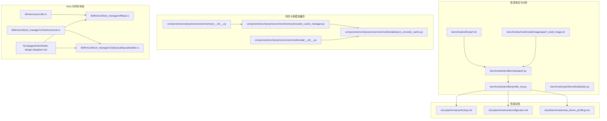
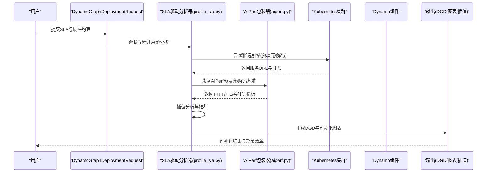
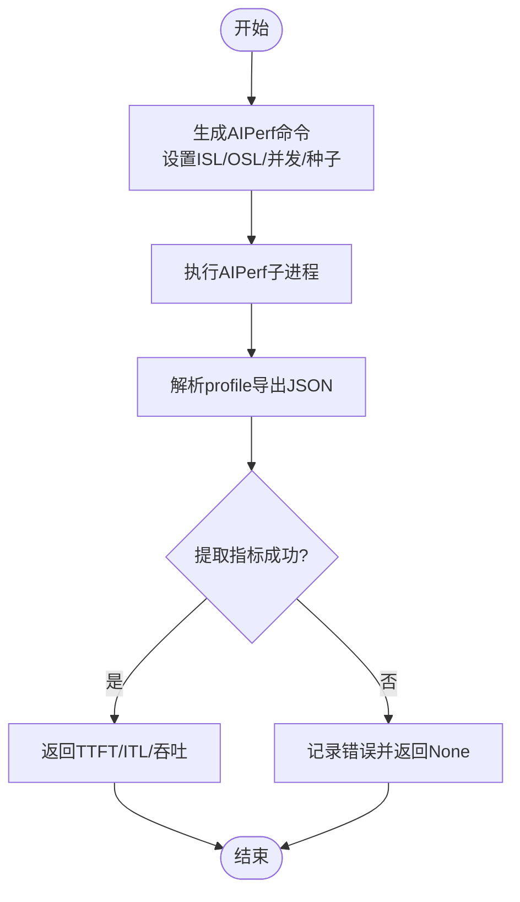
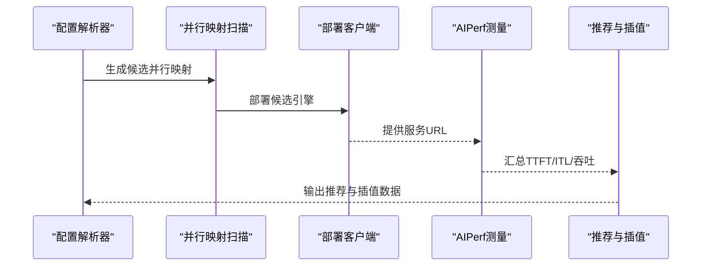
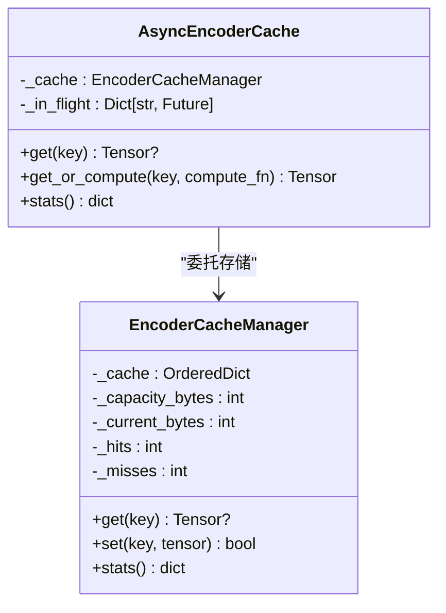
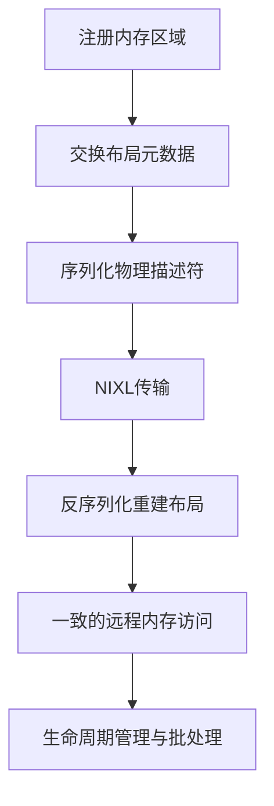
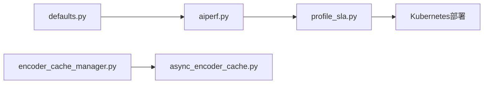

# 性能优化

<cite>
**本文引用的文件**
- [benchmarks/llm/perf.sh](file://benchmarks/llm/perf.sh)
- [benchmarks/multimodal/image/aiperf_small_image.sh](file://benchmarks/multimodal/image/aiperf_small_image.sh)
- [benchmarks/profiler/utils/aiperf.py](file://benchmarks/profiler/utils/aiperf.py)
- [benchmarks/profiler/profile_sla.py](file://benchmarks/profiler/profile_sla.py)
- [benchmarks/profiler/utils/defaults.py](file://benchmarks/profiler/utils/defaults.py)
- [docs/performance/tuning.md](file://docs/performance/tuning.md)
- [docs/performance/aiconfigurator.md](file://docs/performance/aiconfigurator.md)
- [docs/benchmarks/sla_driven_profiling.md](file://docs/benchmarks/sla_driven_profiling.md)
- [deploy/pre-deployment/nixl/README.md](file://deploy/pre-deployment/nixl/README.md)
- [components/src/dynamo/common/memory/encoder_cache_manager.py](file://components/src/dynamo/common/memory/encoder_cache_manager.py)
- [components/src/dynamo/common/multimodal/async_encoder_cache.py](file://components/src/dynamo/common/multimodal/async_encoder_cache.py)
- [components/src/dynamo/common/memory/__init__.py](file://components/src/dynamo/common/memory/__init__.py)
- [components/src/dynamo/common/multimodal/__init__.py](file://components/src/dynamo/common/multimodal/__init__.py)
- [lib/memory/src/lib.rs](file://lib/memory/src/lib.rs)
- [lib/llm/src/block_manager/offload.rs](file://lib/llm/src/block_manager/offload.rs)
- [lib/llm/src/block_manager/v2/memory/mod.rs](file://lib/llm/src/block_manager/v2/memory/mod.rs)
- [lib/llm/src/block_manager/v2/physical/layout/builder.rs](file://lib/llm/src/block_manager/v2/physical/layout/builder.rs)
- [fern/pages/kvbm/kvbm-design-deepdive.md](file://fern/pages/kvbm/kvbm-design-deepdive.md)
</cite>

## 目录
1. [简介](#简介)
2. [项目结构](#项目结构)
3. [核心组件](#核心组件)
4. [架构总览](#架构总览)
5. [详细组件分析](#详细组件分析)
6. [依赖关系分析](#依赖关系分析)
7. [性能考量](#性能考量)
8. [故障排查指南](#故障排查指南)
9. [结论](#结论)
10. [附录](#附录)

## 简介
本指南面向Dynamo平台的性能优化，围绕以下目标展开：系统化讲解AIPerf基准测试工具的使用与性能分析方法；深入剖析NIXL数据传输优化、GPU内存管理优化与多模态处理性能调优；总结不同部署拓扑的性能特征与选型标准；提供性能基准测试流程、瓶颈识别方法、优化策略与监控指标，并给出可复用的案例研究与最佳实践。

## 项目结构
Dynamo在“基准测试”“性能文档”“运行时内存与多模态缓存”“NIXL内核实现”等维度提供了完整的性能优化支撑。下图概览了与性能优化直接相关的模块与文件：

图表来源
- [benchmarks/llm/perf.sh](file://benchmarks/llm/perf.sh#L1-L271)
- [benchmarks/multimodal/image/aiperf_small_image.sh](file://benchmarks/multimodal/image/aiperf_small_image.sh#L1-L52)
- [benchmarks/profiler/utils/aiperf.py](file://benchmarks/profiler/utils/aiperf.py#L1-L374)
- [benchmarks/profiler/profile_sla.py](file://benchmarks/profiler/profile_sla.py#L1-L786)
- [benchmarks/profiler/utils/defaults.py](file://benchmarks/profiler/utils/defaults.py#L1-L41)
- [docs/performance/tuning.md](file://docs/performance/tuning.md#L1-L149)
- [docs/performance/aiconfigurator.md](file://docs/performance/aiconfigurator.md#L1-L155)
- [docs/benchmarks/sla_driven_profiling.md](file://docs/benchmarks/sla_driven_profiling.md#L1-L637)
- [components/src/dynamo/common/memory/encoder_cache_manager.py](file://components/src/dynamo/common/memory/encoder_cache_manager.py#L1-L177)
- [components/src/dynamo/common/multimodal/async_encoder_cache.py](file://components/src/dynamo/common/multimodal/async_encoder_cache.py#L1-L136)
- [lib/memory/src/lib.rs](file://lib/memory/src/lib.rs#L50-L103)
- [lib/llm/src/block_manager/offload.rs](file://lib/llm/src/block_manager/offload.rs#L710-L746)
- [lib/llm/src/block_manager/v2/memory/mod.rs](file://lib/llm/src/block_manager/v2/memory/mod.rs#L50-L103)
- [lib/llm/src/block_manager/v2/physical/layout/builder.rs](file://lib/llm/src/block_manager/v2/physical/layout/builder.rs#L712-L767)
- [fern/pages/kvbm/kvbm-design-deepdive.md](file://fern/pages/kvbm/kvbm-design-deepdive.md#L102-L159)

章节来源
- [benchmarks/llm/perf.sh](file://benchmarks/llm/perf.sh#L1-L271)
- [benchmarks/profiler/profile_sla.py](file://benchmarks/profiler/profile_sla.py#L1-L786)

## 核心组件
- AIPerf基准测试工具链：封装预填充（prefill）与解码（decode）两类场景的命令生成、执行与结果解析，支持并发、批量与预热参数控制，输出TTFT、ITL、吞吐等关键指标。
- SLA驱动的自动配置与部署：通过DGDR声明式配置，自动完成硬件发现、并行映射搜索、插值分析与DGD生成，兼顾在线实测与离线仿真两种模式。
- 多模态编码缓存：基于LRU的张量缓存与异步请求合并，降低重复编码开销，提升多模态吞吐。
- NIXL内存与布局：通过注册、元数据交换、序列化/反序列化与生命周期管理，实现跨节点的RDMA式远程内存访问与一致的KV块视图。

章节来源
- [benchmarks/profiler/utils/aiperf.py](file://benchmarks/profiler/utils/aiperf.py#L1-L374)
- [benchmarks/profiler/profile_sla.py](file://benchmarks/profiler/profile_sla.py#L1-L786)
- [components/src/dynamo/common/memory/encoder_cache_manager.py](file://components/src/dynamo/common/memory/encoder_cache_manager.py#L1-L177)
- [components/src/dynamo/common/multimodal/async_encoder_cache.py](file://components/src/dynamo/common/multimodal/async_encoder_cache.py#L1-L136)
- [lib/memory/src/lib.rs](file://lib/memory/src/lib.rs#L50-L103)

## 架构总览
下图展示了从用户配置到自动部署与性能分析的端到端流程，以及关键组件之间的交互关系。

图表来源
- [docs/benchmarks/sla_driven_profiling.md](file://docs/benchmarks/sla_driven_profiling.md#L1-L637)
- [benchmarks/profiler/profile_sla.py](file://benchmarks/profiler/profile_sla.py#L1-L786)
- [benchmarks/profiler/utils/aiperf.py](file://benchmarks/profiler/utils/aiperf.py#L1-L374)

## 详细组件分析

### AIPerf基准测试工具链
- 命令生成与参数化：统一构造预填充/解码场景的AIPerf命令，支持ISL/OSL、并发度、请求计数、随机种子、超时等参数。
- 执行与结果解析：通过子进程执行AIPerf，捕获标准输出/错误，解析profile导出JSON，提取TTFT、ITL、吞吐等指标。
- DEP感知的预填充测量：在注意力数据并行场景中，采用“波次并发”与去噪逻辑，稳定TTFT估计。
- 解码阶段的预热与一致性：先以相同随机种子进行预热，再进行真实测量，避免预填充阶段差异影响ITL。

图表来源
- [benchmarks/profiler/utils/aiperf.py](file://benchmarks/profiler/utils/aiperf.py#L156-L209)
- [benchmarks/profiler/utils/aiperf.py](file://benchmarks/profiler/utils/aiperf.py#L211-L274)
- [benchmarks/profiler/utils/aiperf.py](file://benchmarks/profiler/utils/aiperf.py#L276-L374)

章节来源
- [benchmarks/profiler/utils/aiperf.py](file://benchmarks/profiler/utils/aiperf.py#L1-L374)
- [benchmarks/profiler/utils/defaults.py](file://benchmarks/profiler/utils/defaults.py#L1-L41)

### SLA驱动的自动配置与部署
- 并行映射搜索：针对预填充与解码引擎，按候选TP/TEP/DEP组合进行性能评估，结合TTFT与ITL约束筛选最优配置。
- 插值分析：在推荐配置基础上，对ISL、KV使用率与上下文长度进行插值，生成SLA规划所需的性能模型。
- 在线实测与离线仿真：支持AIPerf在线实测（耗时较长）与AI Configurator离线仿真（快速估算）两种模式。
- WebUI交互选择：可视化展示多维性能曲线，支持手动挑选帕累托最优组合。

图表来源
- [benchmarks/profiler/profile_sla.py](file://benchmarks/profiler/profile_sla.py#L134-L786)
- [docs/benchmarks/sla_driven_profiling.md](file://docs/benchmarks/sla_driven_profiling.md#L1-L637)
- [docs/performance/aiconfigurator.md](file://docs/performance/aiconfigurator.md#L1-L155)

章节来源
- [benchmarks/profiler/profile_sla.py](file://benchmarks/profiler/profile_sla.py#L1-L786)
- [docs/benchmarks/sla_driven_profiling.md](file://docs/benchmarks/sla_driven_profiling.md#L1-L637)
- [docs/performance/aiconfigurator.md](file://docs/performance/aiconfigurator.md#L1-L155)

### 多模态编码缓存（LRU与请求合并）
- 缓存管理：基于有序字典的LRU缓存，按容量字节限制进行逐出，统计命中/未命中与利用率。
- 异步请求合并：同一内容键的并发请求被合并为单次计算，其他等待者共享结果，减少重复编码。
- 统计接口：提供条目数、当前占用、容量、命中率等指标，便于性能观测与调参。

图表来源
- [components/src/dynamo/common/memory/encoder_cache_manager.py](file://components/src/dynamo/common/memory/encoder_cache_manager.py#L1-L177)
- [components/src/dynamo/common/multimodal/async_encoder_cache.py](file://components/src/dynamo/common/multimodal/async_encoder_cache.py#L1-L136)

章节来源
- [components/src/dynamo/common/memory/encoder_cache_manager.py](file://components/src/dynamo/common/memory/encoder_cache_manager.py#L1-L177)
- [components/src/dynamo/common/multimodal/async_encoder_cache.py](file://components/src/dynamo/common/multimodal/async_encoder_cache.py#L1-L136)
- [components/src/dynamo/common/memory/__init__.py](file://components/src/dynamo/common/memory/__init__.py#L1-L9)
- [components/src/dynamo/common/multimodal/__init__.py](file://components/src/dynamo/common/multimodal/__init__.py#L1-L9)

### NIXL数据传输与内存布局
- 远程内存注册与元数据交换：通过NIXL注册设备内存，交换序列化的布局元数据，确保不同TP配置下的正确切片与对齐。
- 序列化/反序列化与一致性：导出物理内存描述符（类型、地址、大小、设备ID），在接收端重建布局，实现跨节点的一致逻辑视图。
- 生命周期与批处理：基于RAII的句柄在drop时自动移除注册，Publisher可批量化发布事件，提升高并发下的性能与可靠性。

图表来源
- [fern/pages/kvbm/kvbm-design-deepdive.md](file://fern/pages/kvbm/kvbm-design-deepdive.md#L102-L159)
- [lib/memory/src/lib.rs](file://lib/memory/src/lib.rs#L50-L103)
- [lib/llm/src/block_manager/offload.rs](file://lib/llm/src/block_manager/offload.rs#L710-L746)
- [lib/llm/src/block_manager/v2/memory/mod.rs](file://lib/llm/src/block_manager/v2/memory/mod.rs#L50-L103)
- [lib/llm/src/block_manager/v2/physical/layout/builder.rs](file://lib/llm/src/block_manager/v2/physical/layout/builder.rs#L712-L767)

章节来源
- [fern/pages/kvbm/kvbm-design-deepdive.md](file://fern/pages/kvbm/kvbm-design-deepdive.md#L102-L159)
- [lib/memory/src/lib.rs](file://lib/memory/src/lib.rs#L50-L103)
- [lib/llm/src/block_manager/offload.rs](file://lib/llm/src/block_manager/offload.rs#L710-L746)
- [lib/llm/src/block_manager/v2/memory/mod.rs](file://lib/llm/src/block_manager/v2/memory/mod.rs#L50-L103)
- [lib/llm/src/block_manager/v2/physical/layout/builder.rs](file://lib/llm/src/block_manager/v2/physical/layout/builder.rs#L712-L767)

## 依赖关系分析
- 配置与参数：默认参数集中定义了AIPerf预填充/解码基准的OSL、DEP波次比例、最大并发等关键阈值，保证不同后端与模型的可比性。
- 分析器与部署：profile_sla根据配置生成候选并行映射，通过部署客户端创建引擎实例，再调用AIPerf进行测量，最后输出推荐与插值数据。
- 多模态缓存：异步缓存依赖底层LRU缓存，二者共同提供命中率与并发控制能力。

图表来源
- [benchmarks/profiler/utils/defaults.py](file://benchmarks/profiler/utils/defaults.py#L1-L41)
- [benchmarks/profiler/utils/aiperf.py](file://benchmarks/profiler/utils/aiperf.py#L1-L374)
- [benchmarks/profiler/profile_sla.py](file://benchmarks/profiler/profile_sla.py#L1-L786)
- [components/src/dynamo/common/memory/encoder_cache_manager.py](file://components/src/dynamo/common/memory/encoder_cache_manager.py#L1-L177)
- [components/src/dynamo/common/multimodal/async_encoder_cache.py](file://components/src/dynamo/common/multimodal/async_encoder_cache.py#L1-L136)

章节来源
- [benchmarks/profiler/utils/defaults.py](file://benchmarks/profiler/utils/defaults.py#L1-L41)
- [benchmarks/profiler/utils/aiperf.py](file://benchmarks/profiler/utils/aiperf.py#L1-L374)
- [benchmarks/profiler/profile_sla.py](file://benchmarks/profiler/profile_sla.py#L1-L786)
- [components/src/dynamo/common/memory/encoder_cache_manager.py](file://components/src/dynamo/common/memory/encoder_cache_manager.py#L1-L177)
- [components/src/dynamo/common/multimodal/async_encoder_cache.py](file://components/src/dynamo/common/multimodal/async_encoder_cache.py#L1-L136)

## 性能考量
- 预填充与解码的权衡：低负载适合单体引擎；中高负载下，解耦的预填充/解码引擎可在TTFT与ITL之间取得更好平衡；高负载下需关注KV缓存容量与前填充引擎队列。
- 并行映射与块大小：TP优先于节点间并行通常更高效；块大小过小导致碎片与小块传输，过大则降低前缀缓存命中率；合理设置max_num_tokens与batch size以平衡中间张量规模与KV缓存大小。
- 多模态吞吐：通过编码缓存与请求合并显著降低重复计算；缓存容量应结合模型与流量峰值进行压测确定。
- 网络与内存：NIXL通过元数据交换与序列化/反序列化确保跨节点一致性；在高并发下启用批处理发布与生命周期管理，避免悬挂指针与资源泄漏。

## 故障排查指南
- AIPerf失败或无结果：检查服务URL可达性、并发与请求计数是否合理、随机种子是否一致导致预热失效。
- SLA无法满足：放宽TTFT/ITL目标、增加GPU数量、更换后端或模型；确认AI Configurator的注意力头约束（head数/TP上限）。
- 部署镜像拉取失败：配置镜像拉取密钥；确认命名空间与权限。
- 内存不足：降低GPU显存利用率、缩短上下文长度、减少TP配置。
- 不支持的并行映射：联系后端维护者升级或调整搜索范围。

章节来源
- [docs/benchmarks/sla_driven_profiling.md](file://docs/benchmarks/sla_driven_profiling.md#L533-L637)
- [docs/performance/aiconfigurator.md](file://docs/performance/aiconfigurator.md#L145-L155)

## 结论
通过AIPerf与SLA驱动的自动化分析，Dynamo能够在不同部署拓扑与后端上快速找到满足延迟与吞吐目标的最优配置。结合NIXL的跨节点内存一致性、GPU内存管理与多模态缓存策略，可进一步提升整体性能与稳定性。建议在生产部署前完成基准测试与插值分析，并持续监控关键指标以指导动态调优。

## 附录
- 基准脚本示例
  - LLM基准：[benchmarks/llm/perf.sh](file://benchmarks/llm/perf.sh#L1-L271)
  - 多模态图像基准：[benchmarks/multimodal/image/aiperf_small_image.sh](file://benchmarks/multimodal/image/aiperf_small_image.sh#L1-L52)
- 性能文档
  - 性能调优总览：[docs/performance/tuning.md](file://docs/performance/tuning.md#L1-L149)
  - AIConfigurator使用：[docs/performance/aiconfigurator.md](file://docs/performance/aiconfigurator.md#L1-L155)
  - SLA驱动分析：[docs/benchmarks/sla_driven_profiling.md](file://docs/benchmarks/sla_driven_profiling.md#L1-L637)
- NIXL部署与验证
  - NIXL基准部署指南：[deploy/pre-deployment/nixl/README.md](file://deploy/pre-deployment/nixl/README.md#L1-L292)