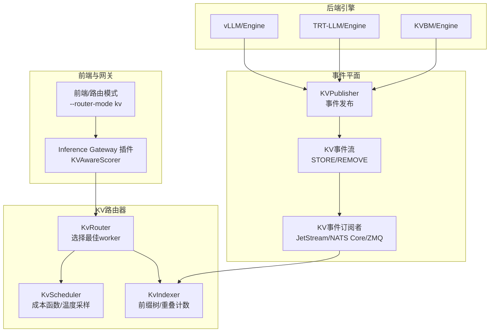
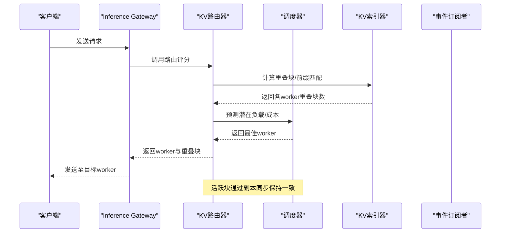
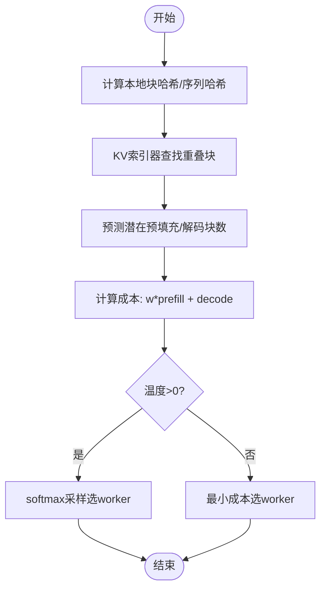
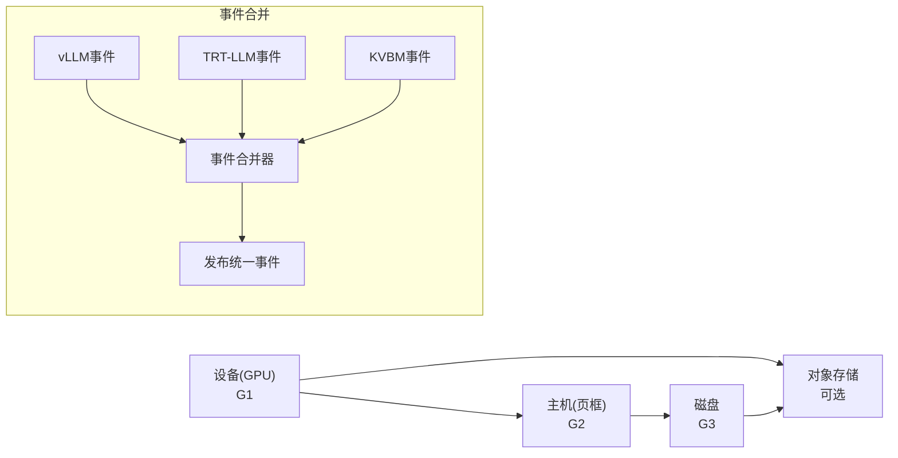
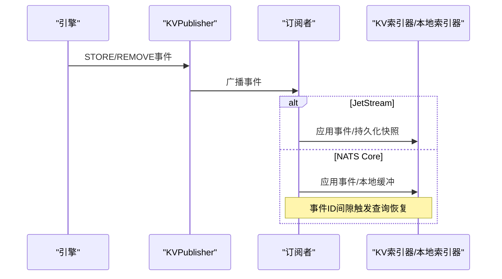
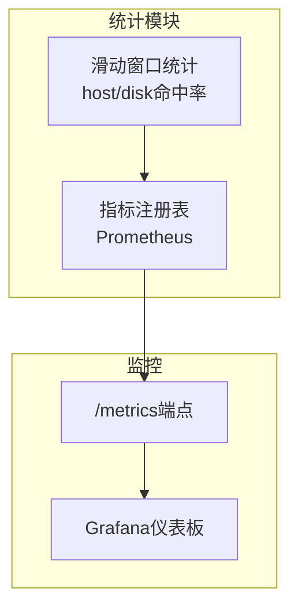
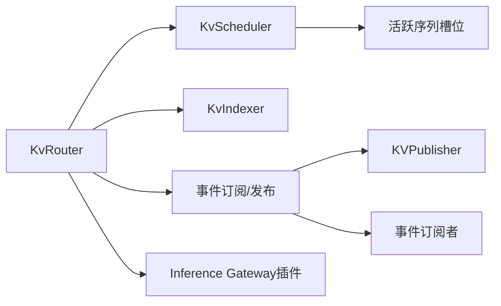

# 缓存策略优化

<cite>
**本文引用的文件**
- [kv_cache_routing.md](file://docs/router/kv_cache_routing.md)
- [kv_router.rs](file://lib/llm/src/kv_router.rs)
- [scheduler.rs](file://lib/llm/src/kv_router/scheduler.rs)
- [subscriber.rs](file://lib/llm/src/kv_router/subscriber.rs)
- [publisher.rs](file://lib/llm/src/kv_router/publisher.rs)
- [tracker.rs](file://lib/llm/src/block_manager/kv_consolidator/tracker.rs)
- [config.rs](file://lib/llm/src/block_manager/config.rs)
- [cache_stats.rs](file://lib/bindings/kvbm/src/block_manager/cache_stats.rs)
- [metrics_kvbm.rs](file://lib/llm/src/block_manager/metrics_kvbm.rs)
- [prometheus_names.rs](file://lib/runtime/src/metrics/prometheus_names.rs)
- [plugin.go](file://deploy/inference-gateway/epp/pkg/plugins/dynamo_kv_scorer/plugin.go)
- [kv-router-ab-testing.md](file://fern/pages/benchmarks/kv-router-ab-testing.md)
</cite>

## 目录
1. [简介](#简介)
2. [项目结构](#项目结构)
3. [核心组件](#核心组件)
4. [架构总览](#架构总览)
5. [详细组件分析](#详细组件分析)
6. [依赖关系分析](#依赖关系分析)
7. [性能考量](#性能考量)
8. [故障排查指南](#故障排查指南)
9. [结论](#结论)
10. [附录](#附录)

## 简介
本指南聚焦Dynamo的KV缓存策略优化，系统性阐述KV缓存路由算法、前缀匹配技术与命中率优化；详解分层缓存架构（设备/GPU、主机/页框内存、磁盘、对象存储）与多级缓存策略；说明缓存失效机制、缓存预热与预取、动态缓存调整；并给出统计指标采集、性能监控与瓶颈识别方法。最后结合实际场景提供策略选择建议、缓存大小调优与一致性保障方案，并通过基准测试文档中的数据进行对比分析。

## 项目结构
围绕KV缓存优化的关键模块分布如下：
- 路由与调度：KV路由器、工作选择器、调度器、事件订阅/发布
- 前缀匹配与索引：KV索引器、重叠块计算、序列哈希
- 多级缓存管理：块管理器配置、事件合并器、统计与指标
- 运行时集成：Inference Gateway插件、前端路由模式

图表来源
- [kv_router.rs](file://lib/llm/src/kv_router.rs#L313-L479)
- [scheduler.rs](file://lib/llm/src/kv_router/scheduler.rs#L92-L282)
- [subscriber.rs](file://lib/llm/src/kv_router/subscriber.rs#L747-L835)
- [publisher.rs](file://lib/llm/src/kv_router/publisher.rs#L303-L347)
- [plugin.go](file://deploy/inference-gateway/epp/pkg/plugins/dynamo_kv_scorer/plugin.go#L344-L433)

章节来源
- [kv_cache_routing.md](file://docs/router/kv_cache_routing.md#L1-L120)
- [kv_router.rs](file://lib/llm/src/kv_router.rs#L313-L479)

## 核心组件
- KV路由器（KvRouter）：负责根据输入tokens与全局KV状态选择最优worker，支持查询模式与自动生命周期管理。
- 工作选择器（WorkerSelector）：默认实现基于重叠块数量与解码块数量的成本函数，支持温度采样。
- 调度器（KvScheduler）：维护活跃序列槽位，预测潜在预填充与解码负载，处理请求生命周期事件。
- KV索引器（KvIndexer）：构建并维护全局前缀树，记录各worker的缓存命中块数与树规模。
- 事件系统：KVPublisher在引擎侧发布KV事件，订阅者接收并更新索引器或本地索引器。
- 多级缓存管理：块管理器配置、事件合并器（跨引擎去重）、统计与指标上报。
- Inference Gateway插件：在网关层调用Dynamo路由，完成预请求与请求前登记。

章节来源
- [kv_router.rs](file://lib/llm/src/kv_router.rs#L128-L256)
- [scheduler.rs](file://lib/llm/src/kv_router/scheduler.rs#L479-L611)
- [subscriber.rs](file://lib/llm/src/kv_router/subscriber.rs#L747-L835)
- [publisher.rs](file://lib/llm/src/kv_router/publisher.rs#L303-L347)
- [tracker.rs](file://lib/llm/src/block_manager/kv_consolidator/tracker.rs#L204-L384)
- [config.rs](file://lib/llm/src/block_manager/config.rs#L219-L267)
- [plugin.go](file://deploy/inference-gateway/epp/pkg/plugins/dynamo_kv_scorer/plugin.go#L344-L433)

## 架构总览
Dynamo的KV缓存路由采用“全局前缀视图 + 局部活跃块同步”的双层设计：
- 全局持久化：通过JetStream或NATS Core/ZMQ事件流维护KV前缀树快照与增量事件，确保多副本一致性与重启恢复。
- 局部活跃块：每个路由器副本维护活跃序列槽位，通过NATS Core消息同步预测的活跃块，保持跨副本负载估计一致。

图表来源
- [kv_router.rs](file://lib/llm/src/kv_router.rs#L486-L532)
- [scheduler.rs](file://lib/llm/src/kv_router/scheduler.rs#L198-L276)
- [subscriber.rs](file://lib/llm/src/kv_router/subscriber.rs#L747-L835)

章节来源
- [kv_cache_routing.md](file://docs/router/kv_cache_routing.md#L161-L320)

## 详细组件分析

### KV缓存路由与前缀匹配
- 重叠块计算：将输入tokens按固定块大小分块，计算本地块哈希与序列哈希（位置感知），通过KV索引器查询各worker的匹配块数。
- 成本函数：成本 = overlap_score_weight × 预填充块数 + 解码块数；权重越高越倾向缓存复用（改善TTFT），越低越倾向负载均衡（改善ITL）。
- 温度采样：非零温度下对成本logits进行softmax采样，引入随机性以改善负载分布。

图表来源
- [scheduler.rs](file://lib/llm/src/kv_router/scheduler.rs#L479-L611)
- [kv_router.rs](file://lib/llm/src/kv_router.rs#L486-L532)

章节来源
- [kv_router.rs](file://lib/llm/src/kv_router.rs#L128-L256)
- [scheduler.rs](file://lib/llm/src/kv_router/scheduler.rs#L479-L611)

### 分层缓存架构与多级策略
- 存储层级：设备（GPU/G1）、主机（页框内存/G2）、磁盘/G3、对象存储（可选）。
- 策略选择：根据环境变量决定是否绕过CPU缓存直接从设备到磁盘；支持对象存储离线归档/回填。
- 事件合并：跨引擎（vLLM/TRT-LLM/KVBM）事件统一去重，仅在首次出现或最后一次移除时发布事件，减少重复计算与网络开销。

图表来源
- [config.rs](file://lib/llm/src/block_manager/config.rs#L270-L305)
- [tracker.rs](file://lib/llm/src/block_manager/kv_consolidator/tracker.rs#L204-L384)

章节来源
- [config.rs](file://lib/llm/src/block_manager/config.rs#L270-L305)
- [tracker.rs](file://lib/llm/src/block_manager/kv_consolidator/tracker.rs#L204-L384)

### 缓存失效机制与近似模式
- 事件驱动：引擎侧发生块分配/释放时发布事件，订阅者更新索引器或本地索引器。
- 近似模式：当禁用KV事件时，路由器使用TTL与树大小裁剪维持本地预测，避免无限增长。
- Gap检测与恢复：NATS Core模式下通过事件ID间隙检测，向工作节点查询缺失范围并恢复状态。

图表来源
- [publisher.rs](file://lib/llm/src/kv_router/publisher.rs#L303-L347)
- [subscriber.rs](file://lib/llm/src/kv_router/subscriber.rs#L747-L835)

章节来源
- [kv_cache_routing.md](file://docs/router/kv_cache_routing.md#L269-L320)
- [subscriber.rs](file://lib/llm/src/kv_router/subscriber.rs#L747-L835)

### 缓存预热、预取与动态调整
- 预热：通过批量相似请求或模板注入提升共享前缀覆盖率，提高重叠块命中率。
- 预取：在请求到达前对热点序列进行预计算与缓存加载（需结合具体后端能力）。
- 动态调整：运行时调节overlap_score_weight与router_temperature；设置活跃块/预填充令牌阈值以控制负载均衡与TTFT权衡。

章节来源
- [kv_cache_routing.md](file://docs/router/kv_cache_routing.md#L702-L733)
- [scheduler.rs](file://lib/llm/src/kv_router/scheduler.rs#L479-L611)

### 统计与监控
- 滑动窗口统计：记录最近N次请求的主机/磁盘命中块数与总数，计算命中率并周期性日志输出。
- 指标上报：Prometheus指标包括匹配令牌数、各层级命中率、离线归档读写失败次数等。
- 网关集成：Inference Gateway插件在调度阶段调用Dynamo路由，完成预请求登记与后续生命周期同步。

图表来源
- [cache_stats.rs](file://lib/bindings/kvbm/src/block_manager/cache_stats.rs#L54-L237)
- [metrics_kvbm.rs](file://lib/llm/src/block_manager/metrics_kvbm.rs#L64-L253)
- [prometheus_names.rs](file://lib/runtime/src/metrics/prometheus_names.rs#L265-L296)
- [plugin.go](file://deploy/inference-gateway/epp/pkg/plugins/dynamo_kv_scorer/plugin.go#L344-L433)

章节来源
- [cache_stats.rs](file://lib/bindings/kvbm/src/block_manager/cache_stats.rs#L54-L237)
- [metrics_kvbm.rs](file://lib/llm/src/block_manager/metrics_kvbm.rs#L64-L253)
- [prometheus_names.rs](file://lib/runtime/src/metrics/prometheus_names.rs#L265-L296)
- [plugin.go](file://deploy/inference-gateway/epp/pkg/plugins/dynamo_kv_scorer/plugin.go#L344-L433)

## 依赖关系分析
- 组件耦合：KvRouter依赖KvScheduler与KvIndexer；调度器依赖活跃序列槽位管理；事件系统贯穿引擎与路由器。
- 外部依赖：NATS（JetStream/NATS Core）、ZMQ、Prometheus/Axum监控服务。
- 循环依赖：未见循环依赖迹象，模块职责清晰。

图表来源
- [kv_router.rs](file://lib/llm/src/kv_router.rs#L313-L479)
- [scheduler.rs](file://lib/llm/src/kv_router/scheduler.rs#L92-L282)
- [subscriber.rs](file://lib/llm/src/kv_router/subscriber.rs#L747-L835)
- [publisher.rs](file://lib/llm/src/kv_router/publisher.rs#L303-L347)
- [plugin.go](file://deploy/inference-gateway/epp/pkg/plugins/dynamo_kv_scorer/plugin.go#L344-L433)

章节来源
- [kv_router.rs](file://lib/llm/src/kv_router.rs#L313-L479)
- [scheduler.rs](file://lib/llm/src/kv_router/scheduler.rs#L92-L282)

## 性能考量
- 命中率优化：提升共享前缀覆盖率（模板、系统提示、长输入相似模式）；合理设置overlap_score_weight平衡TTFT与ITL。
- 负载均衡：温度采样与活跃块跟踪降低热点worker压力；必要时启用router_replica_sync保持跨副本负载一致。
- 缓存层次：根据延迟/吞吐需求选择是否绕过CPU缓存直连磁盘/对象存储；结合should_bypass_cpu_cache策略。
- 监控与告警：持续观察host/disk/object命中率、offload/onboard速率与失败计数，定位瓶颈。

## 故障排查指南
- 无缓存收益：检查overlap_score_weight是否为0；确认KV事件是否正常发布与订阅。
- 命中率异常：核查滑动窗口统计与指标；检查是否存在大量gap导致状态恢复不及时。
- 负载不均：调整router_temperature与活跃块阈值；确认router_replica_sync是否启用。
- 对象存储问题：关注object_read_failures与object_write_failures指标，排查网络/权限/配额。

章节来源
- [cache_stats.rs](file://lib/bindings/kvbm/src/block_manager/cache_stats.rs#L54-L237)
- [metrics_kvbm.rs](file://lib/llm/src/block_manager/metrics_kvbm.rs#L143-L253)

## 结论
Dynamo通过“全局前缀视图 + 局部活跃块同步”的KV缓存路由，在保证负载均衡的同时最大化缓存复用，显著降低TTFT与冗余计算。结合多级缓存策略、事件合并与近似模式，可在不同部署形态下获得稳定性能。配合完善的统计与监控体系，可实现可观测、可调优的缓存优化闭环。

## 附录

### 实际案例与性能对比
- 基准测试显示：在具有显著前缀重叠的真实轨迹上，KV智能路由相较随机/轮询路由在TTFT、端到端延迟与吞吐方面均有明显提升；当重叠度较低时收益有限。
- 建议：在生产环境中先进行AB测试，基于真实业务轨迹评估收益后再启用KV路由。

章节来源
- [kv-router-ab-testing.md](file://fern/pages/benchmarks/kv-router-ab-testing.md#L410-L623)