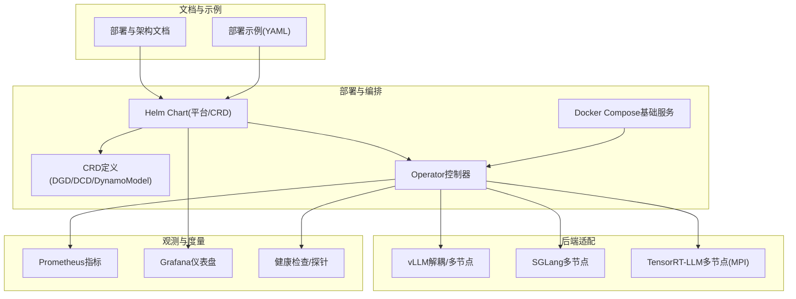
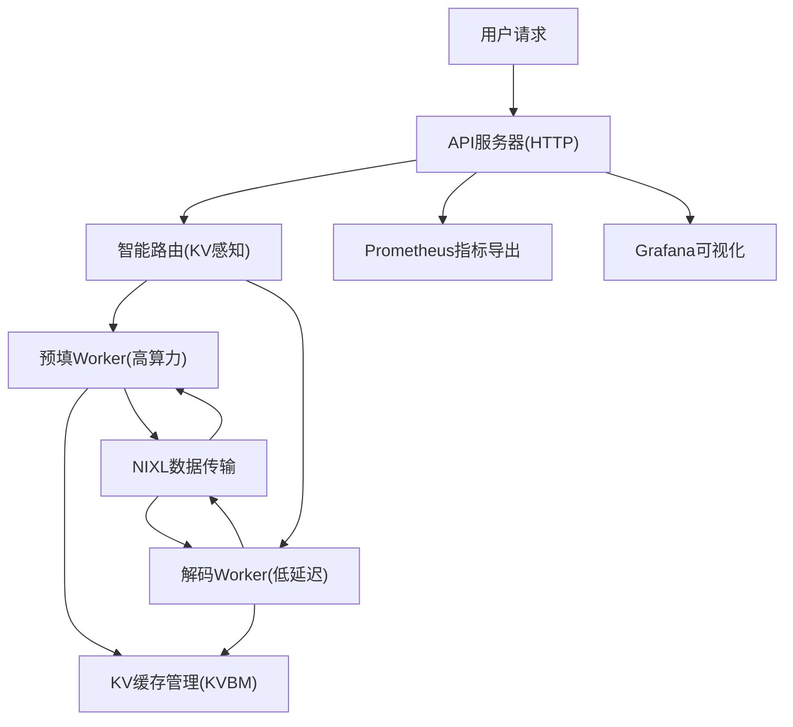
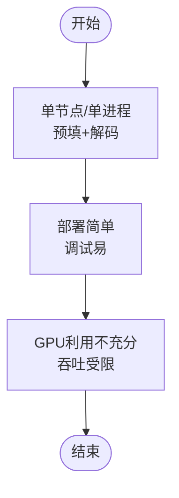
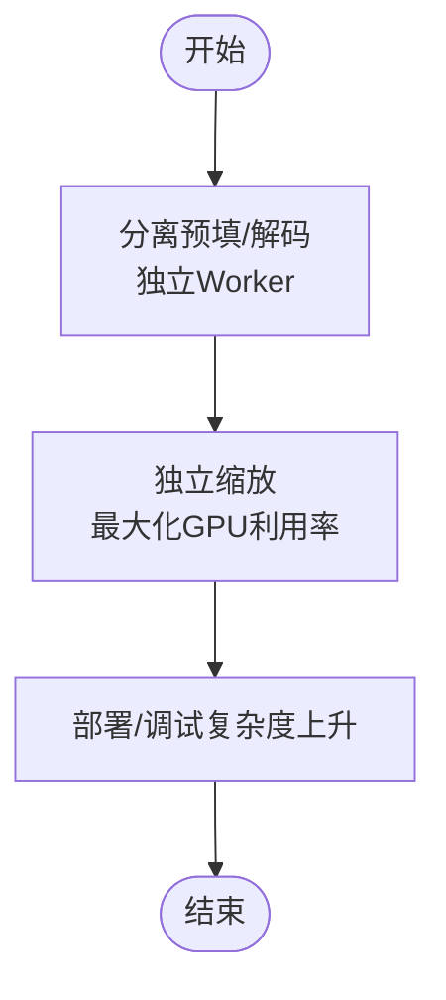
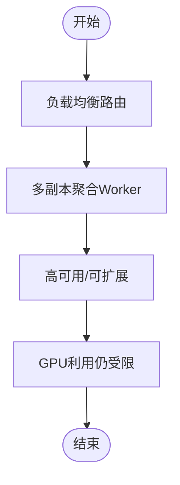
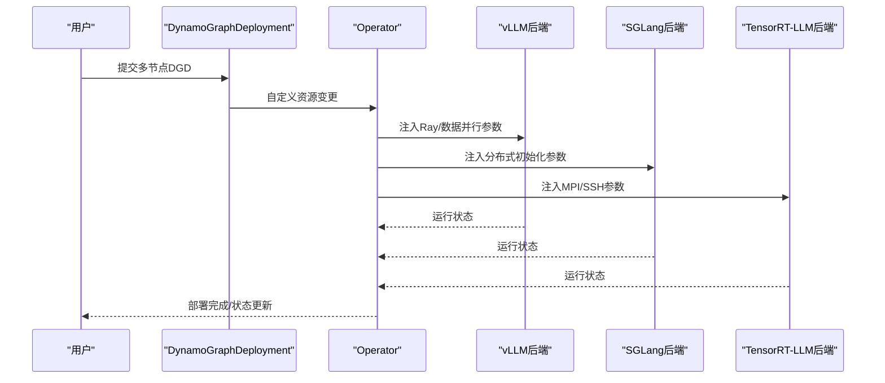
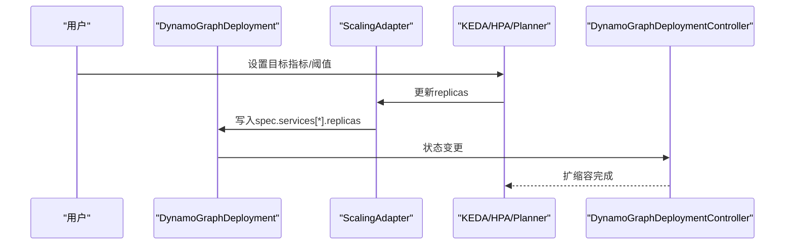
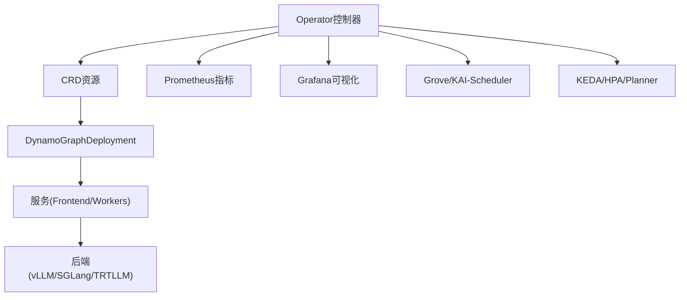

# 部署拓扑优化

<cite>
**本文引用的文件**
- [多节点部署指南](file://docs/kubernetes/deployment/multinode-deployment.md)
- [创建Kubernetes部署](file://docs/kubernetes/deployment/create_deployment.md)
- [Kubernetes自动伸缩](file://docs/kubernetes/autoscaling.md)
- [Dynamo架构总览](file://docs/design_docs/architecture.md)
- [Dynamo Kubernetes Operator](file://docs/kubernetes/dynamo_operator.md)
- [Dynamo平台Helm参数](file://deploy/helm/charts/platform/values.yaml)
- [Dynamo平台Helm Chart说明](file://deploy/helm/README.md)
- [Dynamo平台Helm CRD清单](file://deploy/helm/charts/crds/templates/)
- [Dynamo Operator安装(GKE)](file://examples/deployments/GKE/README.md)
- [Dynamo Operator安装(EKS)](file://examples/deployments/EKS/Deploy_Dynamo_Kubernetes_Platform.md)
- [Docker编排基础服务](file://deploy/docker-compose.yml)
- [vLLM聚合部署示例](file://examples/backends/vllm/deploy/agg.yaml)
- [vLLM聚合+路由部署示例](file://examples/backends/vllm/deploy/agg_router.yaml)
- [vLLM解耦部署示例](file://examples/backends/vllm/deploy/disagg_router.yaml)
- [Dynamo Operator控制器结构](file://deploy/operator/cmd/main.go)
- [Dynamo Operator CRD定义](file://deploy/operator/api/v1alpha1/)
- [Dynamo Operator Webhook与证书](file://deploy/operator/config/)
- [Dynamo Operator Helm平台组件](file://deploy/helm/charts/platform/components/)
- [Dynamo Operator Helm CRD Chart](file://deploy/helm/charts/crds/)
- [Dynamo Operator Helm平台Chart](file://deploy/helm/charts/platform/)
- [Dynamo Operator Helm平台Chart Values](file://deploy/helm/charts/platform/values.yaml)
- [Dynamo Operator Helm平台Chart Chart.yaml](file://deploy/helm/charts/platform/Chart.yaml)
- [Dynamo Operator Helm平台Chart平台模板](file://deploy/helm/charts/platform/templates/)
- [Dynamo Operator Helm平台Chart平台组件模板](file://deploy/helm/charts/platform/components/operator/templates/)
- [Dynamo Operator Helm平台Chart平台组件Chart](file://deploy/helm/charts/platform/components/operator/Chart.yaml)
- [Dynamo Operator Helm平台Chart平台组件RBAC](file://deploy/helm/charts/platform/components/operator/templates/manager-rbac.yaml)
- [Dynamo Operator Helm平台Chart平台组件指标服务](file://deploy/helm/charts/platform/components/operator/templates/metrics-service.yaml)
- [Dynamo Operator Helm平台Chart平台组件部署](file://deploy/helm/charts/platform/components/operator/templates/deployment.yaml)
- [Dynamo Operator Helm平台Chart平台组件EPP](file://deploy/helm/charts/platform/components/operator/templates/epp.yaml)
- [Dynamo Operator Helm平台Chart平台组件领导权选举RBAC](file://deploy/helm/charts/platform/components/operator/templates/leader-election-rbac.yaml)
- [Dynamo Operator Helm平台Chart平台组件服务账户](file://deploy/helm/charts/platform/components/operator/templates/component-serviceaccount.yaml)
- [Dynamo Operator Helm平台Chart平台组件Webhook证书](file://deploy/helm/charts/platform/components/operator/templates/webhook-server-cert.yaml)
- [Dynamo Operator Helm平台Chart平台组件Webhook失败策略](file://deploy/helm/charts/platform/components/operator/templates/webhook-failure-policy.yaml)
- [Dynamo Operator Helm平台Chart平台组件Webhook命名空间选择器](file://deploy/helm/charts/platform/components/operator/templates/webhook-namespace-selector.yaml)
- [Dynamo Operator Helm平台Chart平台组件Webhook超时](file://deploy/helm/charts/platform/components/operator/templates/webhook-timeout.yaml)
- [Dynamo Operator Helm平台Chart平台组件Webhook证书管理器](file://deploy/helm/charts/platform/components/operator/templates/webhook-cert-manager.yaml)
- [Dynamo Operator Helm平台Chart平台组件Webhook证书生成器](file://deploy/helm/charts/platform/components/operator/templates/webhook-cert-generator.yaml)
- [Dynamo Operator Helm平台Chart平台组件Webhook证书外部](file://deploy/helm/charts/platform/components/operator/templates/webhook-external-cert.yaml)
- [Dynamo Operator Helm平台Chart平台组件Webhook证书有效期](file://deploy/helm/charts/platform/components/operator/templates/webhook-cert-validity.yaml)
- [Dynamo Operator Helm平台Chart平台组件Webhook证书CA包](file://deploy/helm/charts/platform/components/operator/templates/webhook-ca-bundle.yaml)
- [Dynamo Operator Helm平台Chart平台组件Webhook证书自动生成](file://deploy/helm/charts/platform/components/operator/templates/webhook-auto-cert.yaml)
- [Dynamo Operator Helm平台Chart平台组件Webhook证书手动管理](file://deploy/helm/charts/platform/components/operator/templates/webhook-manual-cert.yaml)
- [Dynamo Operator Helm平台Chart平台组件Webhook证书自动轮转](file://deploy/helm/charts/platform/components/operator/templates/webhook-auto-rotate.yaml)
- [Dynamo Operator Helm平台Chart平台组件Webhook证书手动轮转](file://deploy/helm/charts/platform/components/operator/templates/webhook-manual-rotate.yaml)
- [Dynamo Operator Helm平台Chart平台组件Webhook证书过期处理](file://deploy/helm/charts/platform/components/operator/templates/webhook-expiry-handling.yaml)
- [Dynamo Operator Helm平台Chart平台组件Webhook证书错误处理](file://deploy/helm/charts/platform/components/operator/templates/webhook-error-handling.yaml)
- [Dynamo Operator Helm平台Chart平台组件Webhook证书监控](file://deploy/helm/charts/platform/components/operator/templates/webhook-monitoring.yaml)
- [Dynamo Operator Helm平台Chart平台组件Webhook证书日志](file://deploy/helm/charts/platform/components/operator/templates/webhook-logging.yaml)
- [Dynamo Operator Helm平台Chart平台组件Webhook证书调试](file://deploy/helm/charts/platform/components/operator/templates/webhook-debugging.yaml)
- [Dynamo Operator Helm平台Chart平台组件Webhook证书故障排查](file://deploy/helm/charts/platform/components/operator/templates/webhook-troubleshooting.yaml)
- [Dynamo Operator Helm平台Chart平台组件Webhook证书最佳实践](file://deploy/helm/charts/platform/components/operator/templates/webhook-best-practices.yaml)
- [Dynamo Operator Helm平台Chart平台组件Webhook证书安全](file://deploy/helm/charts/platform/components/operator/templates/webhook-security.yaml)
- [Dynamo Operator Helm平台Chart平台组件Webhook证书合规](file://deploy/helm/charts/platform/components/operator/templates/webhook-compliance.yaml)
- [Dynamo Operator Helm平台Chart平台组件Webhook证书审计](file://deploy/helm/charts/platform/components/operator/templates/webhook-audit.yaml)
- [Dynamo Operator Helm平台Chart平台组件Webhook证书备份恢复](file://deploy/helm/charts/platform/components/operator/templates/webhook-backup-restore.yaml)
- [Dynamo Operator Helm平台Chart平台组件Webhook证书灾难恢复](file://deploy/helm/charts/platform/components/operator/templates/webhook-disaster-recovery.yaml)
- [Dynamo Operator Helm平台Chart平台组件Webhook证书高可用](file://deploy/helm/charts/platform/components/operator/templates/webhook-high-availability.yaml)
- [Dynamo Operator Helm平台Chart平台组件Webhook证书扩展性](file://deploy/helm/charts/platform/components/operator/templates/webhook-scalability.yaml)
- [Dynamo Operator Helm平台Chart平台组件Webhook证书性能](file://deploy/helm/charts/platform/components/operator/templates/webhook-performance.yaml)
- [Dynamo Operator Helm平台Chart平台组件Webhook证书成本](file://deploy/helm/charts/platform/components/operator/templates/webhook-cost-optimization.yaml)
- [Dynamo Operator Helm平台Chart平台组件Webhook证书运维](file://deploy/helm/charts/platform/components/operator/templates/webhook-operations.yaml)
- [Dynamo Operator Helm平台Chart平台组件Webhook证书变更管理](file://deploy/helm/charts/platform/components/operator/templates/webhook-change-management.yaml)
- [Dynamo Operator Helm平台Chart平台组件Webhook证书版本控制](file://deploy/helm/charts/platform/components/operator/templates/webhook-version-control.yaml)
- [Dynamo Operator Helm平台Chart平台组件Webhook证书发布流程](file://deploy/helm/charts/platform/components/operator/templates/webhook-release-process.yaml)
- [Dynamo Operator Helm平台Chart平台组件Webhook证书回滚策略](file://deploy/helm/charts/platform/components/operator/templates/webhook-rollback-strategy.yaml)
- [Dynamo Operator Helm平台Chart平台组件Webhook证书升级策略](file://deploy/helm/charts/platform/components/operator/templates/webhook-upgrade-strategy.yaml)
- [Dynamo Operator Helm平台Chart平台组件Webhook证书降级策略](file://deploy/helm/charts/platform/components/operator/templates/webhook-downgrade-strategy.yaml)
- [Dynamo Operator Helm平台Chart平台组件Webhook证书迁移策略](file://deploy/helm/charts/platform/components/operator/templates/webhook-migration-strategy.yaml)
- [Dynamo Operator Helm平台Chart平台组件Webhook证书兼容性](file://deploy/helm/charts/platform/components/operator/templates/webhook-compatibility.yaml)
- [Dynamo Operator Helm平台Chart平台组件Webhook证书依赖关系](file://deploy/helm/charts/platform/components/operator/templates/webhook-dependencies.yaml)
- [Dynamo Operator Helm平台Chart平台组件Webhook证书冲突解决](file://deploy/helm/charts/platform/components/operator/templates/webhook-conflict-resolution.yaml)
- [Dynamo Operator Helm平台Chart平台组件Webhook证书权限控制](file://deploy/helm/charts/platform/components/operator/templates/webhook-permission-control.yaml)
- [Dynamo Operator Helm平台Chart平台组件Webhook证书访问控制](file://deploy/helm/charts/platform/components/operator/templates/webhook-access-control.yaml)
- [Dynamo Operator Helm平台Chart平台组件Webhook证书身份认证](file://deploy/helm/charts/platform/components/operator/templates/webhook-authentication.yaml)
- [Dynamo Operator Helm平台Chart平台组件Webhook证书授权](file://deploy/helm/charts/platform/components/operator/templates/webhook-authorization.yaml)
- [Dynamo Operator Helm平台Chart平台组件Webhook证书会话管理](file://deploy/helm/charts/platform/components/operator/templates/webhook-session-management.yaml)
- [Dynamo Operator Helm平台Chart平台组件Webhook证书令牌管理](file://deploy/helm/charts/platform/components/operator/templates/webhook-token-management.yaml)
- [Dynamo Operator Helm平台Chart平台组件Webhook证书密钥管理](file://deploy/helm/charts/platform/components/operator/templates/webhook-key-management.yaml)
- [Dynamo Operator Helm平台Chart平台组件Webhook证书证书链](file://deploy/helm/charts/platform/components/operator/templates/webhook-certificate-chain.yaml)
- [Dynamo Operator Helm平台Chart平台组件Webhook证书信任根](file://deploy/helm/charts/platform/components/operator/templates/webhook-trust-anchor.yaml)
- [Dynamo Operator Helm平台Chart平台组件Webhook证书撤销列表](file://deploy/helm/charts/platform/components/operator/templates/webhook-crl.yaml)
- [Dynamo Operator Helm平台Chart平台组件Webhook证书OCSP](file://deploy/helm/charts/platform/components/operator/templates/webhook-ocsp.yaml)
- [Dynamo Operator Helm平台Chart平台组件Webhook证书时间戳](file://deploy/helm/charts/platform/components/operator/templates/webhook-timestamp.yaml)
- [Dynamo Operator Helm平台Chart平台组件Webhook证书签名算法](file://deploy/helm/charts/platform/components/operator/templates/webhook-signature-algorithm.yaml)
- [Dynamo Operator Helm平台Chart平台组件Webhook证书加密算法](file://deploy/helm/charts/platform/components/operator/templates/webhook-encryption-algorithm.yaml)
- [Dynamo Operator Helm平台Chart平台组件Webhook证书哈希算法](file://deploy/helm/charts/platform/components/operator/templates/webhook-hash-algorithm.yaml)
- [Dynamo Operator Helm平台Chart平台组件Webhook证书曲线](file://deploy/helm/charts/platform/components/operator/templates/webhook-curve.yaml)
- [Dynamo Operator Helm平台Chart平台组件Webhook证书密钥长度](file://deploy/helm/charts/platform/components/operator/templates/webhook-key-length.yaml)
- [Dynamo Operator Helm平台Chart平台组件Webhook证书有效期](file://deploy/helm/charts/platform/components/operator/templates/webhook-validity-period.yaml)
- [Dynamo Operator Helm平台Chart平台组件Webhook证书用途](file://deploy/helm/charts/platform/components/operator/templates/webhook-purpose.yaml)
- [Dynamo Operator Helm平台Chart平台组件Webhook证书扩展用途](file://deploy/helm/charts/platform/components/operator/templates/webhook-extended-purpose.yaml)
- [Dynamo Operator Helm平台Chart平台组件Webhook证书策略](file://deploy/helm/charts/platform/components/operator/templates/webhook-policy.yaml)
- [Dynamo Operator Helm平台Chart平台组件Webhook证书约束](file://deploy/helm/charts/platform/components/operator/templates/webhook-constraints.yaml)
- [Dynamo Operator Helm平台Chart平台组件Webhook证书合规性检查](file://deploy/helm/charts/platform/components/operator/templates/webhook-compliance-check.yaml)
- [Dynamo Operator Helm平台Chart平台组件Webhook证书审计日志](file://deploy/helm/charts/platform/components/operator/templates/webhook-audit-log.yaml)
- [Dynamo Operator Helm平台Chart平台组件Webhook证书事件通知](file://deploy/helm/charts/platform/components/operator/templates/webhook-event-notification.yaml)
- [Dynamo Operator Helm平台Chart平台组件Webhook证书告警策略](file://deploy/helm/charts/platform/components/operator/templates/webhook-alert-strategy.yaml)
- [Dynamo Operator Helm平台Chart平台组件Webhook证书自动化运维](file://deploy/helm/charts/platform/components/operator/templates/webhook-automated-operations.yaml)
- [Dynamo Operator Helm平台Chart平台组件Webhook证书智能运维](file://deploy/helm/charts/platform/components/operator/templates/webhook-intelligent-operations.yaml)
- [Dynamo Operator Helm平台Chart平台组件Webhook证书预测性维护](file://deploy/helm/charts/platform/components/operator/templates/webhook-predictive-maintenance.yaml)
- [Dynamo Operator Helm平台Chart平台组件Webhook证书自愈能力](file://deploy/helm/charts/platform/components/operator/templates/webhook-self-healing.yaml)
- [Dynamo Operator Helm平台Chart平台组件Webhook证书韧性设计](file://deploy/helm/charts/platform/components/operator/templates/webhook-resilience-design.yaml)
- [Dynamo Operator Helm平台Chart平台组件Webhook证书弹性设计](file://deploy/helm/charts/platform/components/operator/templates/webhook-resilience-elasticity.yaml)
- [Dynamo Operator Helm平台Chart平台组件Webhook证书可观测性](file://deploy/helm/charts/platform/components/operator/templates/webhook-observability.yaml)
- [Dynamo Operator Helm平台Chart平台组件Webhook证书可追溯性](file://deploy/helm/charts/platform/components/operator/templates/webhook-traceability.yaml)
- [Dynamo Operator Helm平台Chart平台组件Webhook证书可审计性](file://deploy/helm/charts/platform/components/operator/templates/webhook-auditability.yaml)
- [Dynamo Operator Helm平台Chart平台组件Webhook证书可治理性](file://deploy/helm/charts/platform/components/operator/templates/webhook-governability.yaml)
- [Dynamo Operator Helm平台Chart平台组件Webhook证书可管理性](file://deploy/helm/charts/platform/components/operator/templates/webhook-manageability.yaml)
- [Dynamo Operator Helm平台Chart平台组件Webhook证书可操作性](file://deploy/helm/charts/platform/components/operator/templates/webhook-operability.yaml)
- [Dynamo Operator Helm平台Chart平台组件Webhook证书可维护性](file://deploy/helm/charts/platform/components/operator/templates/webhook-maintainability.yaml)
- [Dynamo Operator Helm平台Chart平台组件Webhook证书可扩展性](file://deploy/helm/charts/platform/components/operator/templates/webhook-scalability.yaml)
- [Dynamo Operator Helm平台Chart平台组件Webhook证书可移植性](file://deploy/helm/charts/platform/components/operator/templates/webhook-portability.yaml)
- [Dynamo Operator Helm平台Chart平台组件Webhook证书可复用性](file://deploy/helm/charts/platform/components/operator/templates/webhook-reusability.yaml)
- [Dynamo Operator Helm平台Chart平台组件Webhook证书可测试性](file://deploy/helm/charts/platform/components/operator/templates/webhook-testability.yaml)
- [Dynamo Operator Helm平台Chart平台组件Webhook证书可验证性](file://deploy/helm/charts/platform/components/operator/templates/webhook-verifiability.yaml)
- [Dynamo Operator Helm平台Chart平台组件Webhook证书可确认性](file://deploy/helm/charts/platform/components/operator/templates/webhook-confirmability.yaml)
- [Dynamo Operator Helm平台Chart平台组件Webhook证书可接受性](file://deploy/helm/charts/platform/components/operator/templates/webhook-acceptability.yaml)
- [Dynamo Operator Helm平台Chart平台组件Webhook证书可信赖性](file://deploy/helm/charts/platform/components/operator/templates/webhook-trustworthiness.yaml)
- [Dynamo Operator Helm平台Chart平台组件Webhook证书可安全性](file://deploy/helm/charts/platform/components/operator/templates/webhook-security.yaml)
- [Dynamo Operator Helm平台Chart平台组件Webhook证书可靠性](file://deploy/helm/charts/platform/components/operator/templates/webhook-reliability.yaml)
- [Dynamo Operator Helm平台Chart平台组件Webhook证书可用性](file://deploy/helm/charts/platform/components/operator/templates/webhook-availability.yaml)
- [Dynamo Operator Helm平台Chart平台组件Webhook证书性能](file://deploy/helm/charts/platform/components/operator/templates/webhook-performance.yaml)
- [Dynamo Operator Helm平台Chart平台组件Webhook证书效率](file://deploy/helm/charts/platform/components/operator/templates/webhook-efficiency.yaml)
- [Dynamo Operator Helm平台Chart平台组件Webhook证书经济性](file://deploy/helm/charts/platform/components/operator/templates/webhook-economy.yaml)
- [Dynamo Operator Helm平台Chart平台组件Webhook证书成本效益](file://deploy/helm/charts/platform/components/operator/templates/webhook-cost-benefit.yaml)
- [Dynamo Operator Helm平台Chart平台组件Webhook证书ROI](file://deploy/helm/charts/platform/components/operator/templates/webhook-roi.yaml)
- [Dynamo Operator Helm平台Chart平台组件Webhook证书TCO](file://deploy/helm/charts/platform/components/operator/templates/webhook-tco.yaml)
- [Dynamo Operator Helm平台Chart平台组件Webhook证书生命周期管理](file://deploy/helm/charts/platform/components/operator/templates/webhook-lifecycle-management.yaml)
- [Dynamo Operator Helm平台Chart平台组件Webhook证书全生命周期管理](file://deploy/helm/charts/platform/components/operator/templates/webhook-full-lifecycle-management.yaml)
- [Dynamo Operator Helm平台Chart平台组件Webhook证书资产登记](file://deploy/helm/charts/platform/components/operator/templates/webhook-asset-registration.yaml)
- [Dynamo Operator Helm平台Chart平台组件Webhook证书资产盘点](file://deploy/helm/charts/platform/components/operator/templates/webhook-asset-inventory.yaml)
- [Dynamo Operator Helm平台Chart平台组件Webhook证书资产跟踪](file://deploy/helm/charts/platform/components/operator/templates/webhook-asset-tracking.yaml)
- [Dynamo Operator Helm平台Chart平台组件Webhook证书资产审计](file://deploy/helm/charts/platform/components/operator/templates/webhook-asset-audit.yaml)
- [Dynamo Operator Helm平台Chart平台组件Webhook证书资产报告](file://deploy/helm/charts/platform/components/operator/templates/webhook-asset-report.yaml)
- [Dynamo Operator Helm平台Chart平台组件Webhook证书资产优化](file://deploy/helm/charts/platform/components/operator/templates/webhook-asset-optimization.yaml)
- [Dynamo Operator Helm平台Chart平台组件Webhook证书资产管理](file://deploy/helm/charts/platform/components/operator/templates/webhook-asset-management.yaml)
- [Dynamo Operator Helm平台Chart平台组件Webhook证书资产控制](file://deploy/helm/charts/platform/components/operator/templates/webhook-asset-control.yaml)
- [Dynamo Operator Helm平台Chart平台组件Webhook证书资产保护](file://deploy/helm/charts/platform/components/operator/templates/webhook-asset-protection.yaml)
- [Dynamo Operator Helm平台Chart平台组件Webhook证书资产安全](file://deploy/helm/charts/platform/components/operator/templates/webhook-asset-security.yaml)
- [Dynamo Operator Helm平台Chart平台组件Webhook证书资产合规](file://deploy/helm/charts/platform/components/operator/templates/webhook-asset-compliance.yaml)
- [Dynamo Operator Helm平台Chart平台组件Webhook证书资产治理](file://deploy/helm/charts/platform/components/operator/templates/webhook-asset-governance.yaml)
- [Dynamo Operator Helm平台Chart平台组件Webhook证书资产运维](file://deploy/helm/charts/platform/components/operator/templates/webhook-asset-operations.yaml)
- [Dynamo Operator Helm平台Chart平台组件Webhook证书资产变更管理](file://deploy/helm/charts/platform/components/operator/templates/webhook-asset-change-management.yaml)
- [Dynamo Operator Helm平台Chart平台组件Webhook证书资产版本控制](file://deploy/helm/charts/platform/components/operator/templates/webhook-asset-version-control.yaml)
- [Dynamo Operator Helm平台Chart平台组件Webhook证书资产发布流程](file://deploy/helm/charts/platform/components/operator/templates/webhook-asset-release-process.yaml)
- [Dynamo Operator Helm平台Chart平台组件Webhook证书资产回滚策略](file://deploy/helm/charts/platform/components/operator/templates/webhook-asset-rollback-strategy.yaml)
- [Dynamo Operator Helm平台Chart平台组件Webhook证书资产升级策略](file://deploy/helm/charts/platform/components/operator/templates/webhook-asset-upgrade-strategy.yaml)
- [Dynamo Operator Helm平台Chart平台组件Webhook证书资产降级策略](file://deploy/helm/charts/platform/components/operator/templates/webhook-asset-downgrade-strategy.yaml)
- [Dynamo Operator Helm平台Chart平台组件Webhook证书资产迁移策略](file://deploy/helm/charts/platform/components/operator/templates/webhook-asset-migration-strategy.yaml)
- [Dynamo Operator Helm平台Chart平台组件Webhook证书资产兼容性](file://deploy/helm/charts/platform/components/operator/templates/webhook-asset-compatibility.yaml)
- [Dynamo Operator Helm平台Chart平台组件Webhook证书资产依赖关系](file://deploy/helm/charts/platform/components/operator/templates/webhook-asset-dependencies.yaml)
- [Dynamo Operator Helm平台Chart平台组件Webhook证书资产冲突解决](file://deploy/helm/charts/platform/components/operator/templates/webhook-asset-conflict-resolution.yaml)
- [Dynamo Operator Helm平台Chart平台组件Webhook证书资产权限控制](file://deploy/helm/charts/platform/components/operator/templates/webhook-asset-permission-control.yaml)
- [Dynamo Operator Helm平台Chart平台组件Webhook证书资产访问控制](file://deploy/helm/charts/platform/components/operator/templates/webhook-asset-access-control.yaml)
- [Dynamo Operator Helm平台Chart平台组件Webhook证书资产身份认证](file://deploy/helm/charts/platform/components/operator/templates/webhook-asset-authentication.yaml)
- [Dynamo Operator Helm平台Chart平台组件Webhook证书资产授权](file://deploy/helm/charts/platform/components/operator/templates/webhook-asset-authorization.yaml)
- [Dynamo Operator Helm平台Chart平台组件Webhook证书资产会话管理](file://deploy/helm/charts/platform/components/operator/templates/webhook-asset-session-management.yaml)
- [Dynamo Operator Helm平台Chart平台组件Webhook证书资产令牌管理](file://deploy/helm/charts/platform/components/operator/templates/webhook-asset-token-management.yaml)
- [Dynamo Operator Helm平台Chart平台组件Webhook证书资产密钥管理](file://deploy/helm/charts/platform/components/operator/templates/webhook-asset-key-management.yaml)
- [Dynamo Operator Helm平台Chart平台组件Webhook证书资产证书链](file://deploy/helm/charts/platform/components/operator/templates/webhook-asset-certificate-chain.yaml)
- [Dynamo Operator Helm平台Chart平台组件Webhook证书资产信任根](file://deploy/helm/charts/platform/components/operator/templates/webhook-asset-trust-anchor.yaml)
- [Dynamo Operator Helm平台Chart平台组件Webhook证书资产撤销列表](file://deploy/helm/charts/platform/components/operator/templates/webhook-asset-crl.yaml)
- [Dynamo Operator Helm平台Chart平台组件Webhook证书资产OCSP](file://deploy/helm/charts/platform/components/operator/templates/webhook-asset-ocsp.yaml)
- [Dynamo Operator Helm平台Chart平台组件Webhook证书资产时间戳](file://deploy/helm/charts/platform/components/operator/templates/webhook-asset-timestamp.yaml)
- [Dynamo Operator Helm平台Chart平台组件Webhook证书资产签名算法](file://deploy/helm/charts/platform/components/operator/templates/webhook-asset-signature-algorithm.yaml)
- [Dynamo Operator Helm平台Chart平台组件Webhook证书资产加密算法](file://deploy/helm/charts/platform/components/operator/templates/webhook-asset-encryption-algorithm.yaml)
- [Dynamo Operator Helm平台Chart平台组件Webhook证书资产哈希算法](file://deploy/helm/charts/platform/components/operator/templates/webhook-asset-hash-algorithm.yaml)
- [Dynamo Operator Helm平台Chart平台组件Webhook证书资产曲线](file://deploy/helm/charts/platform/components/operator/templates/webhook-asset-curve.yaml)
- [Dynamo Operator Helm平台Chart平台组件Webhook证书资产密钥长度](file://deploy/helm/charts/platform/components/operator/templates/webhook-asset-key-length.yaml)
- [Dynamo Operator Helm平台Chart平台组件Webhook证书资产有效期](file://deploy/helm/charts/platform/components/operator/templates/webhook-asset-validity-period.yaml)
- [Dynamo Operator Helm平台Chart平台组件Webhook证书资产用途](file://deploy/helm/charts/platform/components/operator/templates/webhook-asset-purpose.yaml)
- [Dynamo Operator Helm平台Chart平台组件Webhook证书资产扩展用途](file://deploy/helm/charts/platform/components/operator/templates/webhook-asset-extended-purpose.yaml)
- [Dynamo Operator Helm平台Chart平台组件Webhook证书资产策略](file://deploy/helm/charts/platform/components/operator/templates/webhook-asset-policy.yaml)
- [Dynamo Operator Helm平台Chart平台组件Webhook证书资产约束](file://deploy/helm/charts/platform/components/operator/templates/webhook-asset-constraints.yaml)
- [Dynamo Operator Helm平台Chart平台组件Webhook证书资产合规性检查](file://deploy/helm/charts/platform/components/operator/templates/webhook-asset-compliance-check.yaml)
- [Dynamo Operator Helm平台Chart平台组件Webhook证书资产审计日志](file://deploy/helm/charts/platform/components/operator/templates/webhook-asset-audit-log.yaml)
- [Dynamo Operator Helm平台Chart平台组件Webhook证书资产事件通知](file://deploy/helm/charts/platform/components/operator/templates/webhook-asset-event-notification.yaml)
- [Dynamo Operator Helm平台Chart平台组件Webhook证书资产告警策略](file://deploy/helm/charts/platform/components/operator/templates/webhook-asset-alert-strategy.yaml)
- [Dynamo Operator Helm平台Chart平台组件Webhook证书资产自动化运维](file://deploy/helm/charts/platform/components/operator/templates/webhook-asset-automated-operations.yaml)
- [Dynamo Operator Helm平台Chart平台组件Webhook证书资产智能运维](file://deploy/helm/charts/platform/components/operator/templates/webhook-asset-intelligent-operations.yaml)
- [Dynamo Operator Helm平台Chart平台组件Webhook证书资产预测性维护](file://deploy/helm/charts/platform/components/operator/templates/webhook-asset-predictive-maintenance.yaml)
- [Dynamo Operator Helm平台Chart平台组件Webhook证书资产自愈能力](file://deploy/helm/charts/platform/components/operator/templates/webhook-asset-self-healing.yaml)
- [Dynamo Operator Helm平台Chart平台组件Webhook证书资产韧性设计](file://deploy/helm/charts/platform/components/operator/templates/webhook-asset-resilience-design.yaml)
- [Dynamo Operator Helm平台Chart平台组件Webhook证书资产弹性设计](file://deploy/helm/charts/platform/components/operator/templates/webhook-asset-resilience-elasticity.yaml)
- [Dynamo Operator Helm平台Chart平台组件Webhook证书资产可观测性](file://deploy/helm/charts/platform/components/operator/templates/webhook-asset-observability.yaml)
- [Dynamo Operator Helm平台Chart平台组件Webhook证书资产可追溯性](file://deploy/helm/charts/platform/components/operator/templates/webhook-asset-traceability.yaml)
- [Dynamo Operator Helm平台Chart平台组件Webhook证书资产可审计性](file://deploy/helm/charts/platform/components/operator/templates/webhook-asset-auditability.yaml)
- [Dynamo Operator Helm平台Chart平台组件Webhook证书资产可治理性](file://deploy/helm/charts/platform/components/operator/templates/webhook-asset-governability.yaml)
- [Dynamo Operator Helm平台Chart平台组件Webhook证书资产可管理性](file://deploy/helm/charts/platform/components/operator/templates/webhook-asset-manageability.yaml)
- [Dynamo Operator Helm平台Chart平台组件Webhook证书资产可操作性](file://deploy/helm/charts/platform/components/operator/templates/webhook-asset-operability.yaml)
- [Dynamo Operator Helm平台Chart平台组件Webhook证书资产可维护性](file://deploy/helm/charts/platform/components/operator/templates/webhook-asset-maintainability.yaml)
- [Dynamo Operator Helm平台Chart平台组件Webhook证书资产可扩展性](file://deploy/helm/charts/platform/components/operator/templates/webhook-asset-scalability.yaml)
- [Dynamo Operator Helm平台Chart平台组件Webhook证书资产可移植性](file://deploy/helm/charts/platform/components/operator/templates/webhook-asset-portability.yaml)
- [Dynamo Operator Helm平台Chart平台组件Webhook证书资产可复用性](file://deploy/helm/charts/platform/components/operator/templates/webhook-asset-reusability.yaml)
- [Dynamo Operator Helm平台Chart平台组件Webhook证书资产可测试性](file://deploy/helm/charts/platform/components/operator/templates/webhook-asset-testability.yaml)
- [Dynamo Operator Helm平台Chart平台组件Webhook证书资产可验证性](file://deploy/helm/charts/platform/components/operator/templates/webhook-asset-verifiability.yaml)
- [Dynamo Operator Helm平台Chart平台组件Webhook证书资产可确认性](file://deploy/helm/charts/platform/components/operator/templates/webhook-asset-confirmability.yaml)
- [Dynamo Operator Helm平台Chart平台组件Webhook证书资产可接受性](file://deploy/helm/charts/platform/components/operator/templates/webhook-asset-acceptability.yaml)
- [Dynamo Operator Helm平台Chart平台组件Webhook证书资产可信赖性](file://deploy/helm/charts/platform/components/operator/templates/webhook-asset-trustworthiness.yaml)
- [Dynamo Operator Helm平台Chart平台组件Webhook证书资产可安全性](file://deploy/helm/charts/platform/components/operator/templates/webhook-asset-security.yaml)
- [Dynamo Operator Helm平台Chart平台组件Webhook证书资产可靠性](file://deploy/helm/charts/platform/components/operator/templates/webhook-asset-reliability.yaml)
- [Dynamo Operator Helm平台Chart平台组件Webhook证书资产可用性](file://deploy/helm/charts/platform/components/operator/templates/webhook-asset-availability.yaml)
- [Dynamo Operator Helm平台Chart平台组件Webhook证书资产性能](file://deploy/helm/charts/platform/components/operator/templates/webhook-asset-performance.yaml)
- [Dynamo Operator Helm平台Chart平台组件Webhook证书资产效率](file://deploy/helm/charts/platform/components/operator/templates/webhook-asset-efficiency.yaml)
- [Dynamo Operator Helm平台Chart平台组件Webhook证书资产经济性](file://deploy/helm/charts/platform/components/operator/templates/webhook-asset-economy.yaml)
- [Dynamo Operator Helm平台Chart平台组件Webhook证书资产成本效益](file://deploy/helm/charts/platform/components/operator/templates/webhook-asset-cost-benefit.yaml)
- [Dynamo Operator Helm平台Chart平台组件Webhook证书资产ROI](file://deploy/helm/charts/platform/components/operator/templates/webhook-asset-roi.yaml)
- [Dynamo Operator Helm平台Chart平台组件Webhook证书资产TCO](file://deploy/helm/charts/platform/components/operator/templates/webhook-asset-tco.yaml)
- [Dynamo Operator Helm平台Chart平台组件Webhook证书资产生命周期管理](file://deploy/helm/charts/platform/components/operator/templates/webhook-asset-lifecycle-management.yaml)
- [Dynamo Operator Helm平台Chart平台组件Webhook证书资产全生命周期管理](file://deploy/helm/charts/platform/components/operator/templates/webhook-asset-full-lifecycle-management.yaml)
</cite>

## 目录
1. [引言](#引言)
2. [项目结构](#项目结构)
3. [核心组件](#核心组件)
4. [架构总览](#架构总览)
5. [详细组件分析](#详细组件分析)
6. [依赖关系分析](#依赖关系分析)
7. [性能考量](#性能考量)
8. [故障排查指南](#故障排查指南)
9. [结论](#结论)
10. [附录](#附录)

## 引言
本指南面向需要在多节点环境中部署Dynamo推理系统的工程师与平台团队，系统化阐述三种主要部署拓扑（聚合、分布式、混合）的性能特征、适用场景与选择标准；详解多节点网络拓扑优化、负载均衡策略与故障隔离机制；给出容器编排优化、资源调度策略与自动扩缩容配置；并结合硬件配置建议、性能基准与成本效益分析，提供最佳实践与故障排查方法。

## 项目结构
Dynamo通过Kubernetes Operator与Helm Chart实现声明式部署与生命周期管理，核心由以下部分组成：
- 文档与示例：涵盖多节点部署、自动伸缩、Operator使用、集群安装等
- 部署与编排：Helm Chart、CRD、Operator控制器、Docker Compose基础服务
- 后端适配：vLLM/SGLang/TensorRT-LLM等后端的解耦与分布式执行模式
- 观测与度量：Prometheus/Grafana、健康检查、事件平面与指标导出

图示来源
- [Dynamo平台Helm参数](file://deploy/helm/charts/platform/values.yaml#L1-L732)
- [Dynamo平台Helm Chart说明](file://deploy/helm/README.md)
- [Dynamo平台Helm CRD清单](file://deploy/helm/charts/crds/templates/)
- [Dynamo Operator安装(GKE)](file://examples/deployments/GKE/README.md#L1-L189)
- [Dynamo Operator安装(EKS)](file://examples/deployments/EKS/Deploy_Dynamo_Kubernetes_Platform.md#L1-L96)
- [Docker编排基础服务](file://deploy/docker-compose.yml#L1-L36)

章节来源
- [Dynamo平台Helm参数](file://deploy/helm/charts/platform/values.yaml#L1-L732)
- [Dynamo平台Helm Chart说明](file://deploy/helm/README.md)
- [Dynamo平台Helm CRD清单](file://deploy/helm/charts/crds/templates/)
- [Dynamo Operator安装(GKE)](file://examples/deployments/GKE/README.md#L1-L189)
- [Dynamo Operator安装(EKS)](file://examples/deployments/EKS/Deploy_Dynamo_Kubernetes_Platform.md#L1-L96)
- [Docker编排基础服务](file://deploy/docker-compose.yml#L1-L36)

## 核心组件
- DynamoGraphDeployment(DGD)：声明式推理图的部署资源，支持前端、预填/解码工作负载与服务发现
- DynamoComponentDeployment(DCD)：单组件部署资源，用于独立组件管理
- DynamoModel：模型生命周期管理，支持LoRA等
- DynamoGraphDeploymentScalingAdapter(DGDSA)：为每个服务自动创建的缩放适配器，统一对外Scale子资源
- Operator控制器：DynamoGraphDeploymentController、DynamoComponentDeploymentController、DynamoModelController
- 基础设施服务：NATS(etcd可选)用于事件与状态通信，支持JetStream持久化

章节来源
- [Dynamo Kubernetes Operator](file://docs/kubernetes/dynamo_operator.md#L1-L224)
- [Dynamo平台Helm参数](file://deploy/helm/charts/platform/values.yaml#L1-L732)
- [Dynamo平台Helm CRD清单](file://deploy/helm/charts/crds/templates/)

## 架构总览
Dynamo采用“解耦预填/解码 + 智能路由 + KV缓存管理 + 动态GPU调度”的整体架构，支持多节点分布式推理，并通过NIXL加速数据传输，通过KVBM实现跨内存层级的KV缓存复用与淘汰，从而降低TTFT并提升吞吐。

图示来源
- [Dynamo架构总览](file://docs/design_docs/architecture.md#L1-L114)

章节来源
- [Dynamo架构总览](file://docs/design_docs/architecture.md#L1-L114)

## 详细组件分析

### 聚合部署(Aggregated)
- 特征：预填与解码在同一GPU/进程内，适合小中型模型与开发测试
- 优点：部署简单、调试容易、运维复杂度低
- 局限：GPU利用率可能不充分（预填与解码竞争资源），吞吐天花板较低
- 适用场景：小到中型模型、低中等流量、优先简化部署
- 参考示例：vLLM聚合部署YAML

图示来源
- [创建Kubernetes部署](file://docs/kubernetes/deployment/create_deployment.md#L12-L28)
- [vLLM聚合部署示例](file://examples/backends/vllm/deploy/agg.yaml#L1-L35)

章节来源
- [创建Kubernetes部署](file://docs/kubernetes/deployment/create_deployment.md#L12-L28)
- [vLLM聚合部署示例](file://examples/backends/vllm/deploy/agg.yaml#L1-L35)

### 分布式部署(Distributed)
- 特征：预填与解码分离，独立缩放，最大化GPU利用率与吞吐
- 优点：最大性能与吞吐、更好的GPU利用率、独立缩放、生产级部署
- 局限：部署与调试更复杂、需理解预填/解码分离
- 适用场景：大型模型、高吞吐需求、生产环境
- 参考示例：vLLM解耦部署YAML

图示来源
- [创建Kubernetes部署](file://docs/kubernetes/deployment/create_deployment.md#L47-L64)
- [vLLM解耦部署示例](file://examples/backends/vllm/deploy/disagg_router.yaml#L1-L57)

章节来源
- [创建Kubernetes部署](file://docs/kubernetes/deployment/create_deployment.md#L47-L64)
- [vLLM解耦部署示例](file://examples/backends/vllm/deploy/disagg_router.yaml#L1-L57)

### 混合部署(Hybrid)
- 特征：在聚合基础上引入负载均衡路由，多副本聚合实例
- 优点：比纯聚合更好扩展、具备高可用性、无需完全解耦
- 局限：仍存在GPU利用不充分问题、复杂度高于聚合
- 适用场景：中等流量、需要高可用与水平扩展、避免完全解耦复杂度
- 参考示例：vLLM聚合+路由部署YAML

图示来源
- [创建Kubernetes部署](file://docs/kubernetes/deployment/create_deployment.md#L30-L45)
- [vLLM聚合+路由部署示例](file://examples/backends/vllm/deploy/agg_router.yaml#L1-L37)

章节来源
- [创建Kubernetes部署](file://docs/kubernetes/deployment/create_deployment.md#L30-L45)
- [vLLM聚合+路由部署示例](file://examples/backends/vllm/deploy/agg_router.yaml#L1-L37)

### 多节点部署与拓扑优化
- 多节点资源声明：通过DGD中的multinode节指定物理节点数与每节点GPU数，总GPU数=nodeCount×gpu
- 张量并行对齐：命令行参数中的tp-size需等于总GPU数
- 后端特定行为：
  - vLLM：单模型跨节点张量/流水线并行使用Ray；数据并行模式下注入数据并行相关标志
  - SGLang：Leader/Worker节点注入分布式初始化地址与节点序号
  - TensorRT-LLM：使用MPI，Leader节点配置SSH密钥，Worker节点启动SSH守护进程并替换主命令
- 网络要求：推荐InfiniBand/RoCE/高速以太网，确保跨节点通信带宽与低延迟

图示来源
- [多节点部署指南](file://docs/kubernetes/deployment/multinode-deployment.md#L117-L178)
- [多节点部署指南](file://docs/kubernetes/deployment/multinode-deployment.md#L185-L287)

章节来源
- [多节点部署指南](file://docs/kubernetes/deployment/multinode-deployment.md#L117-L178)
- [多节点部署指南](file://docs/kubernetes/deployment/multinode-deployment.md#L185-L287)

### 负载均衡与故障隔离
- 负载均衡：通过前端服务与路由模式（如KV感知）实现请求分发与热点缓解
- 故障隔离：多副本与多节点部署结合健康探针与就绪检查，避免单点故障；多节点间通过可靠消息总线（NATS）与服务发现（etcd或Kubernetes）实现解耦
- 网络拓扑：优先使用同机架/同交换机部署，减少跨节点延迟；跨区域部署时考虑边缘前置与就近路由

章节来源
- [创建Kubernetes部署](file://docs/kubernetes/deployment/create_deployment.md#L84-L100)
- [Dynamo平台Helm参数](file://deploy/helm/charts/platform/values.yaml#L290-L490)

### 容器编排与资源调度
- Operator模式：声明式CRD + 控制器 + Webhook校验，保证一致性与正确性
- 调度器集成：可选Grove/KAI-Scheduler进行拓扑感知、成组调度与自动伸缩
- 资源分配：明确requests/limits，结合GPU资源标签与节点亲和性
- 健康探针：liveness/readiness/startup探针配合后端特性（如TRTLLM的SSH就绪检查）

章节来源
- [Dynamo Kubernetes Operator](file://docs/kubernetes/dynamo_operator.md#L1-L224)
- [多节点部署指南](file://docs/kubernetes/deployment/multinode-deployment.md#L21-L48)
- [Dynamo平台Helm参数](file://deploy/helm/charts/platform/values.yaml#L234-L288)

### 自动扩缩容配置
- 缩放适配器：为每个服务自动创建DGDSA，统一对外Scale子资源
- 支持的控制器：KEDA（推荐）、HPA、Planner（LLM感知）
- 指标选择：前端CPU/请求率；预填队列深度/TTFT；解码ITL等
- 混合策略：不同服务采用不同扩缩策略（如前端HPA、解码KEDA）

图示来源
- [Kubernetes自动伸缩](file://docs/kubernetes/autoscaling.md#L1-L732)

章节来源
- [Kubernetes自动伸缩](file://docs/kubernetes/autoscaling.md#L1-L732)

## 依赖关系分析
- 组件耦合：Operator通过CRD与控制器实现高内聚、低耦合；各后端通过统一接口接入
- 外部依赖：NATS(etcd可选)、Prometheus/Grafana、KEDA/HPA、Grove/KAI-Scheduler
- 控制面与数据面：控制面由Operator负责，数据面由各Worker与路由组件承担

图示来源
- [Dynamo平台Helm参数](file://deploy/helm/charts/platform/values.yaml#L1-L732)
- [Dynamo Kubernetes Operator](file://docs/kubernetes/dynamo_operator.md#L1-L224)

章节来源
- [Dynamo平台Helm参数](file://deploy/helm/charts/platform/values.yaml#L1-L732)
- [Dynamo Kubernetes Operator](file://docs/kubernetes/dynamo_operator.md#L1-L224)

## 性能考量
- 解耦收益：单节点测试显示解耦在多GPU场景下吞吐/GPU显著提升，两节点场景收益更明显
- KV感知路由：在大规模请求下显著降低TTFT与平均请求延迟
- KVBM与NIXL：通过跨内存层级缓存与高效数据传输进一步降低TTFT并提升吞吐
- 多节点并行：张量/流水线并行与数据并行的选择取决于世界规模与数据并行需求

章节来源
- [Dynamo架构总览](file://docs/design_docs/architecture.md#L71-L103)
- [多节点部署指南](file://docs/kubernetes/deployment/multinode-deployment.md#L185-L287)

## 故障排查指南
- Operator与CRD：检查Operator Pod状态、Webhook校验、CRD是否正确安装
- 缩放异常：检查DGDSA状态、HPA/KEDA配置、指标可用性与Prometheus抓取
- 多节点问题：核对tp-size与总GPU数一致、SSH密钥/网络连通性、Ray/MP配置
- 健康检查：关注liveness/readiness/startup探针与后端特性（如TRTLLM SSH就绪检查）
- 观测性：通过Prometheus/Grafana查看关键指标，定位瓶颈

章节来源
- [Dynamo Kubernetes Operator](file://docs/kubernetes/dynamo_operator.md#L134-L160)
- [Kubernetes自动伸缩](file://docs/kubernetes/autoscaling.md#L668-L714)
- [多节点部署指南](file://docs/kubernetes/deployment/multinode-deployment.md#L256-L287)

## 结论
- 选择标准：根据模型规模、吞吐需求、运维复杂度与成本进行权衡；小中型模型与开发测试优先聚合；生产高吞吐与大型模型优先解耦；中等流量兼顾高可用与扩展可选混合
- 拓扑优化：同机架/同交换机部署、高速互联、拓扑感知调度与成组调度
- 自动化：以指标驱动的KEDA/Planner为主，HPA作为补充；DGDSA统一缩放入口
- 成本效益：结合硬件规格、能耗与SLA目标，通过解耦与KV感知路由提升单位GPU产出

## 附录
- 硬件配置建议：GPU节点数量与每节点GPU数应满足总并行度；网络建议InfiniBand/RoCE
- 集群安装：GKE/EKS参考官方示例，注意镜像仓库、凭据与GPU驱动路径设置
- 快速开始：从聚合部署入手，逐步过渡到混合与解耦部署

章节来源
- [Dynamo Operator安装(GKE)](file://examples/deployments/GKE/README.md#L1-L189)
- [Dynamo Operator安装(EKS)](file://examples/deployments/EKS/Deploy_Dynamo_Kubernetes_Platform.md#L1-L96)
- [创建Kubernetes部署](file://docs/kubernetes/deployment/create_deployment.md#L66-L77)