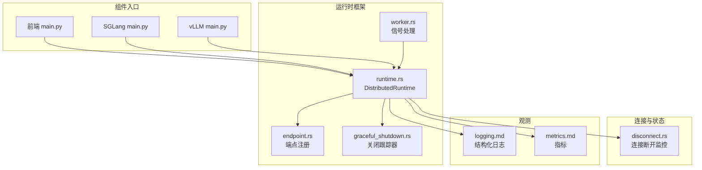
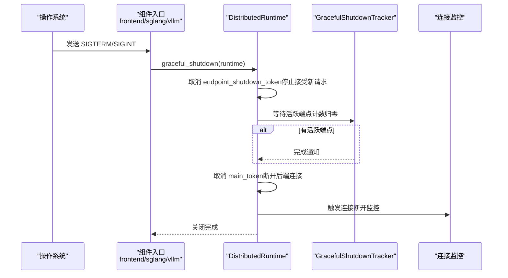
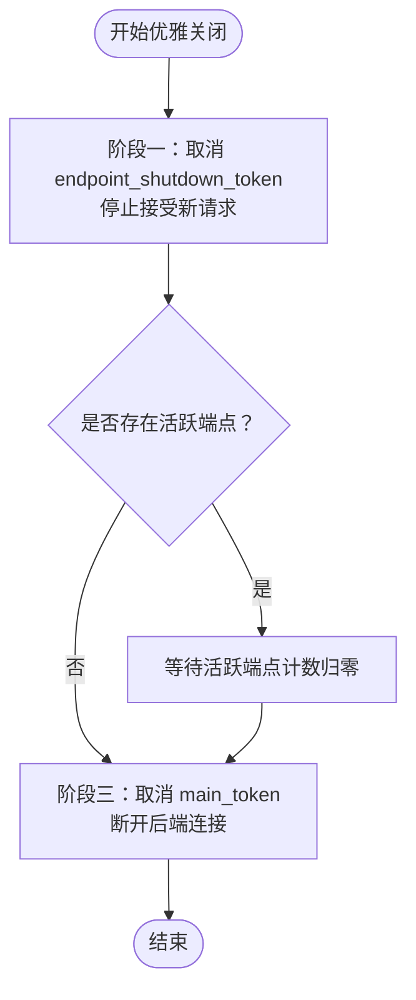
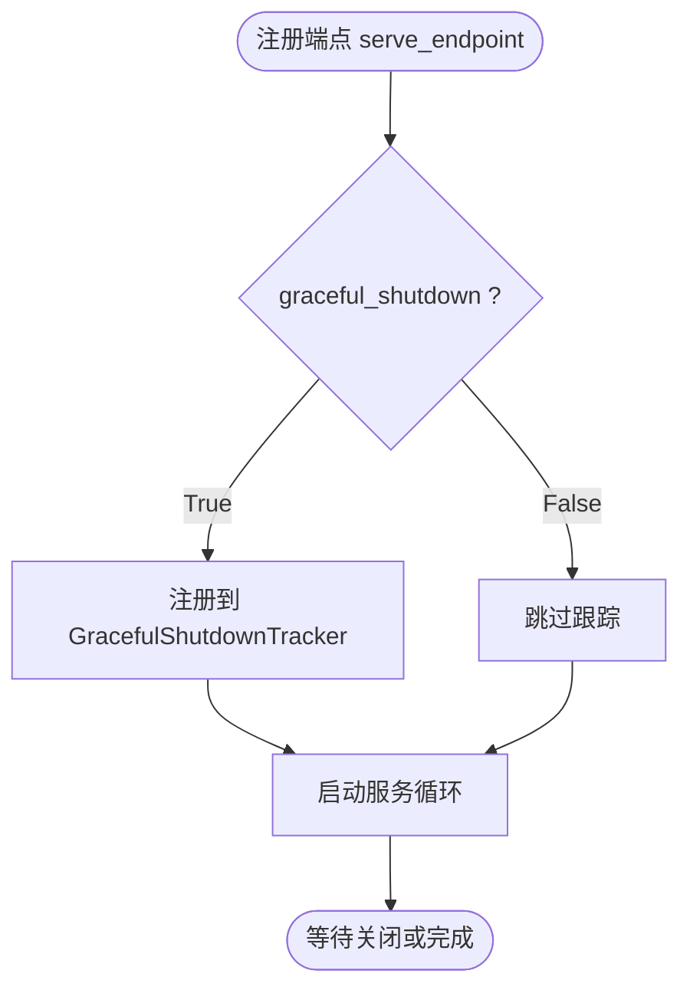
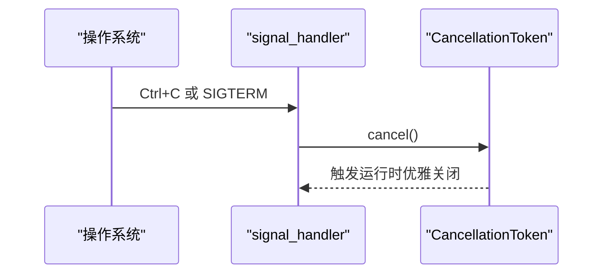
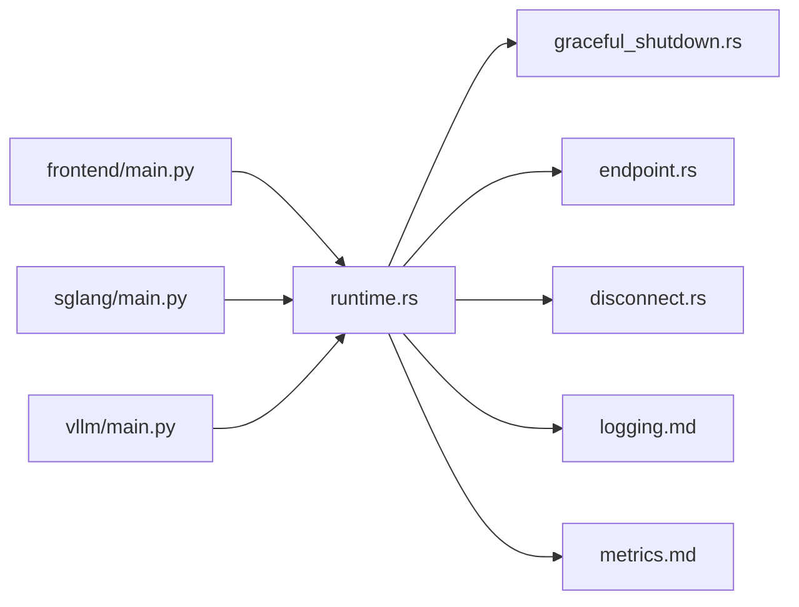

# 优雅关闭

<cite>
**本文引用的文件**
- [docs/fault_tolerance/graceful_shutdown.md](file://docs/fault_tolerance/graceful_shutdown.md)
- [fern/pages/fault-tolerance/graceful-shutdown.md](file://fern/pages/fault-tolerance/graceful-shutdown.md)
- [lib/runtime/src/runtime.rs](file://lib/runtime/src/runtime.rs)
- [lib/runtime/src/utils/graceful_shutdown.rs](file://lib/runtime/src/utils/graceful_shutdown.rs)
- [lib/runtime/src/component/endpoint.rs](file://lib/runtime/src/component/endpoint.rs)
- [lib/runtime/src/worker.rs](file://lib/runtime/src/worker.rs)
- [components/src/dynamo/frontend/main.py](file://components/src/dynamo/frontend/main.py)
- [components/src/dynamo/sglang/main.py](file://components/src/dynamo/sglang/main.py)
- [components/src/dynamo/vllm/main.py](file://components/src/dynamo/vllm/main.py)
- [docs/observability/logging.md](file://docs/observability/logging.md)
- [docs/observability/metrics.md](file://docs/observability/metrics.md)
- [lib/llm/src/http/service/disconnect.rs](file://lib/llm/src/http/service/disconnect.rs)
- [tests/utils/managed_process.py](file://tests/utils/managed_process.py)
</cite>

## 目录
1. [简介](#简介)
2. [项目结构](#项目结构)
3. [核心组件](#核心组件)
4. [架构总览](#架构总览)
5. [详细组件分析](#详细组件分析)
6. [依赖关系分析](#依赖关系分析)
7. [性能考量](#性能考量)
8. [故障排查指南](#故障排查指南)
9. [结论](#结论)
10. [附录](#附录)

## 简介
本文件系统性阐述 Dynamo 的优雅关闭机制，覆盖服务停止过程中的资源清理、连接断开与状态保存策略；深入说明关闭信号处理、任务协调与进程终止的实现细节；解释如何确保在停机期间正在进行的请求能正常完成，避免数据丢失与状态不一致；包含关闭过程中的超时处理、强制终止机制与异常情况处理；对比前端、路由器、工作节点等不同组件的优雅关闭差异；说明关闭过程中的监控与日志记录，并提供可操作的配置示例与最佳实践。

## 项目结构
Dynamo 的优雅关闭由“运行时框架 + 组件入口 + 连接管理 + 监控日志”四部分协同实现：
- 运行时框架：统一的分布式运行时与信号处理、端点注册与优雅关闭跟踪
- 组件入口：前端、SGLang 工作节点、vLLM 工作节点均注册信号处理器并调用运行时优雅关闭
- 连接管理：HTTP/TCP/NATS/ETCD 等后端连接在关闭令牌触发后断开
- 监控日志：通过结构化日志与指标暴露关键关闭阶段事件

图示来源
- [components/src/dynamo/frontend/main.py](file://components/src/dynamo/frontend/main.py#L373-L377)
- [components/src/dynamo/sglang/main.py](file://components/src/dynamo/sglang/main.py#L98-L102)
- [components/src/dynamo/vllm/main.py](file://components/src/dynamo/vllm/main.py#L96-L101)
- [lib/runtime/src/runtime.rs](file://lib/runtime/src/runtime.rs#L301-L333)
- [lib/runtime/src/component/endpoint.rs](file://lib/runtime/src/component/endpoint.rs#L83-L114)
- [lib/runtime/src/utils/graceful_shutdown.rs](file://lib/runtime/src/utils/graceful_shutdown.rs#L1-L39)
- [lib/runtime/src/worker.rs](file://lib/runtime/src/worker.rs#L208-L238)
- [lib/llm/src/http/service/disconnect.rs](file://lib/llm/src/http/service/disconnect.rs#L75-L145)
- [docs/observability/logging.md](file://docs/observability/logging.md#L1-L263)
- [docs/observability/metrics.md](file://docs/observability/metrics.md#L1-L224)

章节来源
- [components/src/dynamo/frontend/main.py](file://components/src/dynamo/frontend/main.py#L373-L377)
- [components/src/dynamo/sglang/main.py](file://components/src/dynamo/sglang/main.py#L98-L102)
- [components/src/dynamo/vllm/main.py](file://components/src/dynamo/vllm/main.py#L96-L101)
- [lib/runtime/src/runtime.rs](file://lib/runtime/src/runtime.rs#L301-L333)
- [lib/runtime/src/component/endpoint.rs](file://lib/runtime/src/component/endpoint.rs#L83-L114)
- [lib/runtime/src/utils/graceful_shutdown.rs](file://lib/runtime/src/utils/graceful_shutdown.rs#L1-L39)
- [lib/runtime/src/worker.rs](file://lib/runtime/src/worker.rs#L208-L238)
- [lib/llm/src/http/service/disconnect.rs](file://lib/llm/src/http/service/disconnect.rs#L75-L145)
- [docs/observability/logging.md](file://docs/observability/logging.md#L1-L263)
- [docs/observability/metrics.md](file://docs/observability/metrics.md#L1-L224)

## 核心组件
- 分布式运行时（DistributedRuntime）
  - 提供统一的优雅关闭流程：取消端点接受新请求、等待端点内所有请求完成、断开后端连接
  - 提供关闭令牌与子令牌，用于信号处理与任务协调
- 优雅关闭跟踪器（GracefulShutdownTracker）
  - 记录活跃端点数量，在关闭阶段等待所有活跃端点完成
- 端点注册与关闭协调（endpoint.rs）
  - 在 serve_endpoint 时根据 graceful_shutdown 参数决定是否纳入关闭跟踪
- 信号处理（worker.rs、各组件入口）
  - 注册 SIGTERM/SIGINT 处理器，触发运行时优雅关闭
- 连接断开监控（disconnect.rs）
  - 监控客户端断开，区分“优雅断开”与“意外断开”，必要时直接取消引擎上下文

章节来源
- [lib/runtime/src/runtime.rs](file://lib/runtime/src/runtime.rs#L301-L333)
- [lib/runtime/src/utils/graceful_shutdown.rs](file://lib/runtime/src/utils/graceful_shutdown.rs#L1-L39)
- [lib/runtime/src/component/endpoint.rs](file://lib/runtime/src/component/endpoint.rs#L83-L114)
- [lib/runtime/src/worker.rs](file://lib/runtime/src/worker.rs#L208-L238)
- [lib/llm/src/http/service/disconnect.rs](file://lib/llm/src/http/service/disconnect.rs#L75-L145)

## 架构总览
优雅关闭的总体流程分为三个阶段：
1) 端点失效：立即停止接受新请求
2) 请求完成：等待所有活跃端点内的请求完成或迁移
3) 资源断开：断开与后端（NATS/ETCD 等）的连接，执行清理

图示来源
- [components/src/dynamo/frontend/main.py](file://components/src/dynamo/frontend/main.py#L453-L459)
- [components/src/dynamo/sglang/main.py](file://components/src/dynamo/sglang/main.py#L652-L655)
- [components/src/dynamo/vllm/main.py](file://components/src/dynamo/vllm/main.py#L64-L73)
- [lib/runtime/src/runtime.rs](file://lib/runtime/src/runtime.rs#L301-L333)
- [lib/runtime/src/utils/graceful_shutdown.rs](file://lib/runtime/src/utils/graceful_shutdown.rs#L1-L39)
- [lib/llm/src/http/service/disconnect.rs](file://lib/llm/src/http/service/disconnect.rs#L75-L145)

## 详细组件分析

### 通用优雅关闭流程（运行时）
- 关键点
  - 阶段一：取消 endpoint_shutdown_token，使端点不再接受新请求
  - 阶段二：若存在活跃端点，等待其完成；否则继续
  - 阶段三：取消 main_token，断开与后端的连接
- 并发与顺序
  - 使用 tokio handle 异步执行关闭协调，避免阻塞主循环
  - 关闭令牌按层级传递，确保子任务被正确取消

图示来源
- [lib/runtime/src/runtime.rs](file://lib/runtime/src/runtime.rs#L301-L333)
- [lib/runtime/src/utils/graceful_shutdown.rs](file://lib/runtime/src/utils/graceful_shutdown.rs#L1-L39)

章节来源
- [lib/runtime/src/runtime.rs](file://lib/runtime/src/runtime.rs#L301-L333)
- [lib/runtime/src/utils/graceful_shutdown.rs](file://lib/runtime/src/utils/graceful_shutdown.rs#L1-L39)

### 端点注册与关闭参数（serve_endpoint）
- 关键点
  - serve_endpoint 支持 graceful_shutdown 参数
  - 当 graceful_shutdown=True 时，端点注册到关闭跟踪器；False 则跳过
  - 不同组件默认行为不同（见下节）

图示来源
- [lib/runtime/src/component/endpoint.rs](file://lib/runtime/src/component/endpoint.rs#L83-L114)

章节来源
- [lib/runtime/src/component/endpoint.rs](file://lib/runtime/src/component/endpoint.rs#L83-L114)

### 信号处理与进程终止
- 前端、SGLang、vLLM 组件均注册 SIGTERM/SIGINT 处理器，收到信号后调用 graceful_shutdown(runtime)
- worker.rs 中的 signal_handler 同时监听 Ctrl+C 与 SIGTERM，触发运行时关闭令牌
- 测试工具中展示了进程组终止与超时后的强制 SIGKILL

图示来源
- [components/src/dynamo/frontend/main.py](file://components/src/dynamo/frontend/main.py#L373-L377)
- [components/src/dynamo/sglang/main.py](file://components/src/dynamo/sglang/main.py#L98-L102)
- [components/src/dynamo/vllm/main.py](file://components/src/dynamo/vllm/main.py#L96-L101)
- [lib/runtime/src/worker.rs](file://lib/runtime/src/worker.rs#L208-L238)
- [tests/utils/managed_process.py](file://tests/utils/managed_process.py#L280-L323)

章节来源
- [components/src/dynamo/frontend/main.py](file://components/src/dynamo/frontend/main.py#L373-L377)
- [components/src/dynamo/sglang/main.py](file://components/src/dynamo/sglang/main.py#L98-L102)
- [components/src/dynamo/vllm/main.py](file://components/src/dynamo/vllm/main.py#L96-L101)
- [lib/runtime/src/worker.rs](file://lib/runtime/src/worker.rs#L208-L238)
- [tests/utils/managed_process.py](file://tests/utils/managed_process.py#L280-L323)

### 组件特定的优雅关闭差异
- 前端（HTTP 服务器）
  - 作为 HTTP 服务器，自身负责关闭监听与处理队列；通过 DistributedRuntime 的关闭令牌停止路由与健康检查
- 预填充（Prefill）工作节点
  - 默认 graceful_shutdown=True，确保预填充计算完整完成，避免浪费
- 解码（Decode）工作节点
  - 条件性优雅关闭：当启用请求迁移（migration_limit > 0）时立即关闭以允许迁移；否则等待请求完成
- 路由器
  - 默认 graceful_shutdown=True，保证路由决策完成

章节来源
- [docs/fault_tolerance/graceful_shutdown.md](file://docs/fault_tolerance/graceful_shutdown.md#L70-L110)
- [fern/pages/fault-tolerance/graceful-shutdown.md](file://fern/pages/fault-tolerance/graceful-shutdown.md#L69-L97)
- [components/src/dynamo/vllm/main.py](file://components/src/dynamo/vllm/main.py#L640-L648)

### 连接断开与异常处理
- 连接断开监控
  - 通过 ConnectionHandle 在“优雅断开”和“意外断开”时发出不同信号
  - 优雅断开：仅记录，不做额外处理
  - 意外断开：触发引擎上下文取消，避免悬挂任务
- 强制终止与超时
  - 测试工具展示进程组终止后轮询等待，超时则发送 SIGKILL
  - 运行时关闭阶段使用 tokio select 等机制避免阻塞

章节来源
- [lib/llm/src/http/service/disconnect.rs](file://lib/llm/src/http/service/disconnect.rs#L75-L145)
- [tests/utils/managed_process.py](file://tests/utils/managed_process.py#L280-L323)

### 监控与日志记录
- 日志
  - 结构化 JSONL 输出，支持 trace_id/span_id，便于跨组件关联
  - 关键关闭事件（如“Received shutdown signal”、“DistributedRuntime shutdown complete”）均有日志输出
- 指标
  - 后端组件在系统端口暴露 /metrics，包含活跃请求数、请求耗时等
  - 前端暴露前端相关指标，如排队请求数、首 token 时间等

章节来源
- [docs/observability/logging.md](file://docs/observability/logging.md#L1-L263)
- [docs/observability/metrics.md](file://docs/observability/metrics.md#L1-L224)
- [components/src/dynamo/vllm/main.py](file://components/src/dynamo/vllm/main.py#L64-L73)

## 依赖关系分析
- 组件入口依赖 DistributedRuntime 提供的关闭令牌与端点注册能力
- DistributedRuntime 依赖 GracefulShutdownTracker 实现对活跃端点的等待
- 连接层依赖运行时关闭令牌进行断开
- 观测层为关闭过程提供日志与指标支撑

图示来源
- [components/src/dynamo/frontend/main.py](file://components/src/dynamo/frontend/main.py#L373-L377)
- [components/src/dynamo/sglang/main.py](file://components/src/dynamo/sglang/main.py#L98-L102)
- [components/src/dynamo/vllm/main.py](file://components/src/dynamo/vllm/main.py#L96-L101)
- [lib/runtime/src/runtime.rs](file://lib/runtime/src/runtime.rs#L301-L333)
- [lib/runtime/src/utils/graceful_shutdown.rs](file://lib/runtime/src/utils/graceful_shutdown.rs#L1-L39)
- [lib/runtime/src/component/endpoint.rs](file://lib/runtime/src/component/endpoint.rs#L83-L114)
- [lib/llm/src/http/service/disconnect.rs](file://lib/llm/src/http/service/disconnect.rs#L75-L145)
- [docs/observability/logging.md](file://docs/observability/logging.md#L1-L263)
- [docs/observability/metrics.md](file://docs/observability/metrics.md#L1-L224)

章节来源
- [components/src/dynamo/frontend/main.py](file://components/src/dynamo/frontend/main.py#L373-L377)
- [components/src/dynamo/sglang/main.py](file://components/src/dynamo/sglang/main.py#L98-L102)
- [components/src/dynamo/vllm/main.py](file://components/src/dynamo/vllm/main.py#L96-L101)
- [lib/runtime/src/runtime.rs](file://lib/runtime/src/runtime.rs#L301-L333)
- [lib/runtime/src/utils/graceful_shutdown.rs](file://lib/runtime/src/utils/graceful_shutdown.rs#L1-L39)
- [lib/runtime/src/component/endpoint.rs](file://lib/runtime/src/component/endpoint.rs#L83-L114)
- [lib/llm/src/http/service/disconnect.rs](file://lib/llm/src/http/service/disconnect.rs#L75-L145)
- [docs/observability/logging.md](file://docs/observability/logging.md#L1-L263)
- [docs/observability/metrics.md](file://docs/observability/metrics.md#L1-L224)

## 性能考量
- 等待时间取决于活跃端点数量与请求处理时长，可通过合理设置 graceful_shutdown 与迁移策略平衡停机时间
- 避免长时间阻塞：使用 tokio 的异步等待与通知机制，确保关闭流程非阻塞
- 资源释放：在 finally 块中清理临时目录、引擎资源，防止泄漏

## 故障排查指南
- 关闭无响应
  - 检查是否存在未注册到关闭跟踪器的端点（graceful_shutdown=False）
  - 查看日志中“Active graceful endpoints”与“Phase 2: Waiting for graceful endpoints to complete”
- 请求中断
  - 若客户端提前断开，连接监控会区分“优雅断开”与“意外断开”，必要时触发引擎取消
- 强制终止
  - Kubernetes/测试工具会在超时后发送 SIGKILL，需确保 finally 清理逻辑健壮

章节来源
- [lib/runtime/src/runtime.rs](file://lib/runtime/src/runtime.rs#L317-L325)
- [lib/llm/src/http/service/disconnect.rs](file://lib/llm/src/http/service/disconnect.rs#L132-L144)
- [tests/utils/managed_process.py](file://tests/utils/managed_process.py#L280-L323)

## 结论
Dynamo 的优雅关闭通过“令牌分层 + 端点跟踪 + 连接断开 + 观测日志”的组合，实现了可控、可观测且可扩展的停机流程。前端、路由器与工作节点在统一运行时框架下保持一致的行为语义，同时允许组件级差异化策略（如解码节点的迁移支持）。配合完善的日志与指标体系，用户可以快速定位停机问题并优化停机窗口。

## 附录

### 配置示例与最佳实践
- 设置合适的终止宽限期（Kubernetes）
  - terminationGracePeriodSeconds 应覆盖最长请求的预期完成时间
- 启用请求迁移（解码节点）
  - 通过 migration_limit 控制迁移尝试次数，缩短停机时间
- 监控关闭事件
  - 关注日志中的“Received shutdown signal”“DistributedRuntime shutdown complete”
  - 通过 /metrics 指标观察停机前后活跃请求数变化

章节来源
- [docs/fault_tolerance/graceful_shutdown.md](file://docs/fault_tolerance/graceful_shutdown.md#L197-L227)
- [fern/pages/fault-tolerance/graceful-shutdown.md](file://fern/pages/fault-tolerance/graceful-shutdown.md#L184-L214)
- [docs/observability/logging.md](file://docs/observability/logging.md#L209-L218)
- [docs/observability/metrics.md](file://docs/observability/metrics.md#L107-L124)