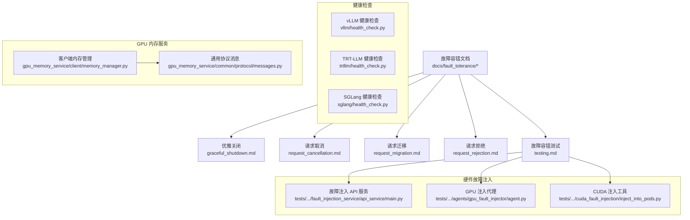
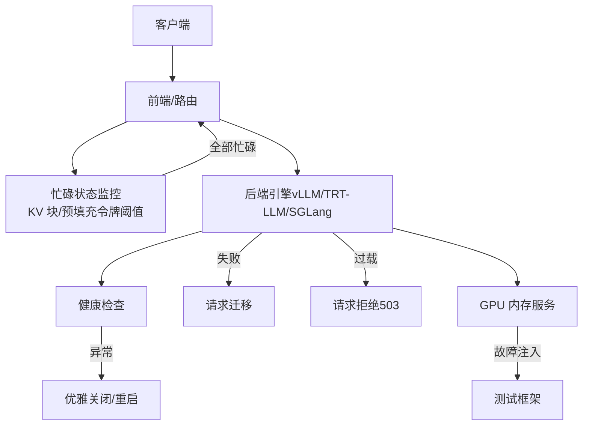
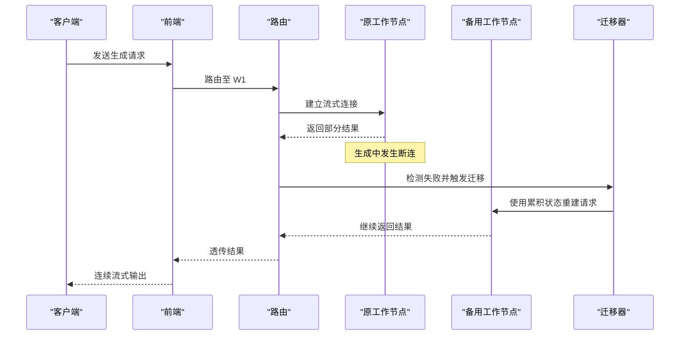
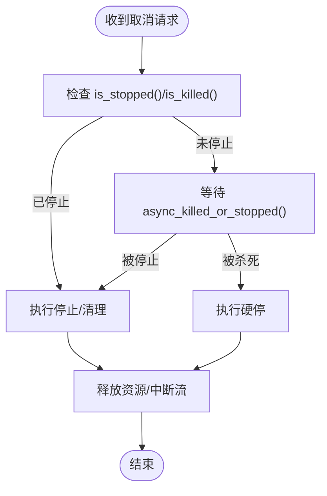
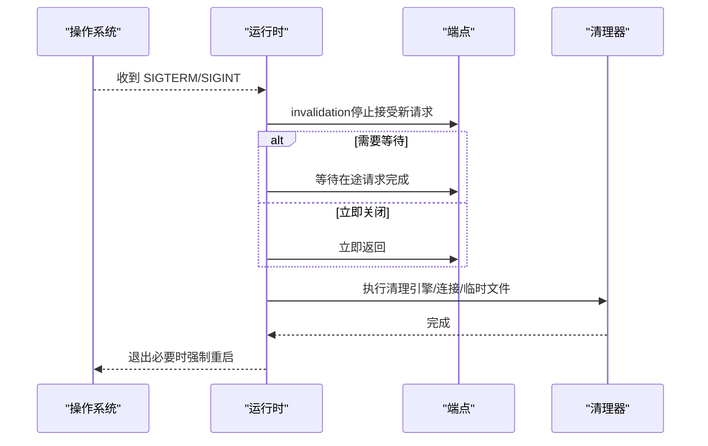
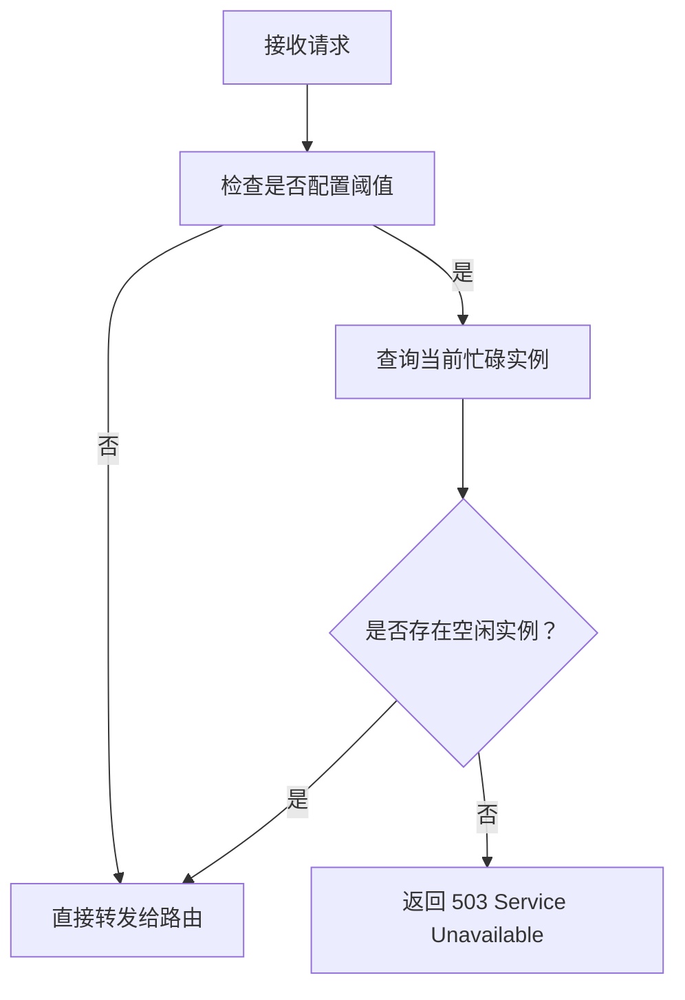
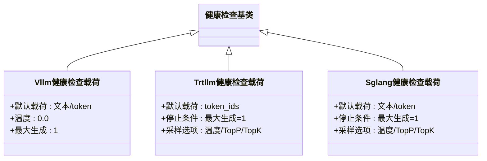
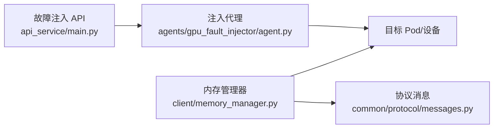
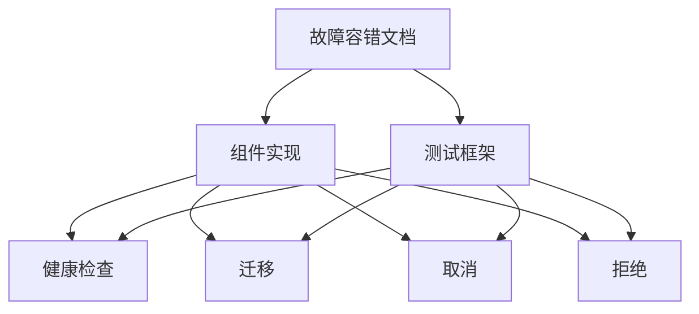

# 故障容错

<cite>
**本文引用的文件**
- [故障容错总览](file://docs/fault_tolerance/README.md)
- [优雅关闭](file://docs/fault_tolerance/graceful_shutdown.md)
- [请求取消](file://docs/fault_tolerance/request_cancellation.md)
- [请求迁移](file://docs/fault_tolerance/request_migration.md)
- [请求拒绝（限流）](file://docs/fault_tolerance/request_rejection.md)
- [故障容错测试](file://docs/fault_tolerance/testing.md)
- [vLLM 健康检查](file://components/src/dynamo/vllm/health_check.py)
- [TRT-LLM 健康检查](file://components/src/dynamo/trtllm/health_check.py)
- [SGLang 健康检查](file://components/src/dynamo/sglang/health_check.py)
- [GPU 内存服务（客户端与协议）](file://lib/gpu_memory_service/client/memory_manager.py)
- [GPU 内存服务（通用协议）](file://lib/gpu_memory_service/common/protocol/messages.py)
- [GPU 故障注入服务（API）](file://tests/fault_tolerance/hardware/fault_injection_service/api_service/main.py)
- [GPU 故障注入代理](file://tests/fault_tolerance/hardware/fault_injection_service/agents/gpu_fault_injector/agent.py)
- [CUDA 故障注入工具](file://tests/fault_tolerance/hardware/fault_injection_service/cuda_fault_injection/inject_into_pods.py)
</cite>

## 目录
1. [简介](#简介)
2. [项目结构](#项目结构)
3. [核心组件](#核心组件)
4. [架构总览](#架构总览)
5. [详细组件分析](#详细组件分析)
6. [依赖关系分析](#依赖关系分析)
7. [性能考量](#性能考量)
8. [故障排查指南](#故障排查指南)
9. [结论](#结论)
10. [附录](#附录)

## 简介
本文件系统化梳理 Dynamo 在生产级 LLM 推理中的故障容错机制，覆盖请求迁移、优雅关闭、请求取消与拒绝处理；阐述分布式环境下的故障检测、自动恢复与一致性保障；说明 GPU 内存服务的故障注入测试与硬件故障模拟；给出故障场景分析、RTO/RPO 设定建议、排查方法与应急流程；并总结负载均衡故障转移与多活部署策略及高可用设计与灾备建议。

## 项目结构
围绕故障容错的关键目录与文件：
- 文档层：docs/fault_tolerance 下的各专题文档，涵盖总体策略、优雅关闭、请求取消、请求迁移、请求拒绝与测试。
- 组件层：各后端引擎的健康检查配置，统一通过健康检查基类派生，确保一致的探测行为。
- 测试层：tests/fault_tolerance 下的端到端测试框架，支持取消、迁移、etcd HA、硬件故障注入等场景。
- 运行时与客户端：lib/gpu_memory_service 提供 GPU 内存管理与协议，支撑内存相关故障注入与一致性验证。

图表来源
- [故障容错总览](file://docs/fault_tolerance/README.md#L18-L143)
- [优雅关闭](file://docs/fault_tolerance/graceful_shutdown.md#L18-L275)
- [请求取消](file://docs/fault_tolerance/request_cancellation.md#L1-L89)
- [请求迁移](file://docs/fault_tolerance/request_migration.md#L1-L137)
- [请求拒绝（限流）](file://docs/fault_tolerance/request_rejection.md#L1-L329)
- [vLLM 健康检查](file://components/src/dynamo/vllm/health_check.py#L1-L121)
- [TRT-LLM 健康检查](file://components/src/dynamo/trtllm/health_check.py#L1-L92)
- [SGLang 健康检查](file://components/src/dynamo/sglang/health_check.py#L1-L121)
- [GPU 内存服务（客户端与协议）](file://lib/gpu_memory_service/client/memory_manager.py)
- [GPU 内存服务（通用协议）](file://lib/gpu_memory_service/common/protocol/messages.py)
- [GPU 故障注入服务（API）](file://tests/fault_tolerance/hardware/fault_injection_service/api_service/main.py)
- [GPU 故障注入代理](file://tests/fault_tolerance/hardware/fault_injection_service/agents/gpu_fault_injector/agent.py)
- [CUDA 故障注入工具](file://tests/fault_tolerance/hardware/fault_injection_service/cuda_fault_injection/inject_into_pods.py)

章节来源
- [故障容错总览](file://docs/fault_tolerance/README.md#L18-L143)

## 核心组件
- 请求迁移：在工作节点失败时，保留已生成部分状态并透明迁移到健康节点继续生成，避免中断与重复计算。
- 请求取消：通过上下文链路传播停止/硬停信号，支持父子请求联动取消，节省资源。
- 优雅关闭：接收 SIGTERM/SIGINT 后立即停止接受新请求，按配置决定是否等待在途请求完成，随后清理资源并退出。
- 请求拒绝（限流）：基于 KV 缓存块利用率与预填充令牌数阈值动态拒绝新请求，防止级联过载。
- 健康检查：为 vLLM/TRT-LLM/SGLang 提供统一健康检查载荷与探测逻辑，支持引擎/分词器能力差异。
- GPU 内存服务：提供内存分配、释放与一致性校验接口，支撑内存相关故障注入与一致性验证。
- 硬件故障注入：通过 API 服务与注入代理模拟 GPU/XID、网络分区等硬件故障，验证系统韧性。

章节来源
- [请求迁移](file://docs/fault_tolerance/request_migration.md#L1-L137)
- [请求取消](file://docs/fault_tolerance/request_cancellation.md#L1-L89)
- [优雅关闭](file://docs/fault_tolerance/graceful_shutdown.md#L18-L275)
- [请求拒绝（限流）](file://docs/fault_tolerance/request_rejection.md#L1-L329)
- [vLLM 健康检查](file://components/src/dynamo/vllm/health_check.py#L1-L121)
- [TRT-LLM 健康检查](file://components/src/dynamo/trtllm/health_check.py#L1-L92)
- [SGLang 健康检查](file://components/src/dynamo/sglang/health_check.py#L1-L121)
- [GPU 内存服务（客户端与协议）](file://lib/gpu_memory_service/client/memory_manager.py)
- [GPU 内存服务（通用协议）](file://lib/gpu_memory_service/common/protocol/messages.py)
- [GPU 故障注入服务（API）](file://tests/fault_tolerance/hardware/fault_injection_service/api_service/main.py)
- [GPU 故障注入代理](file://tests/fault_tolerance/hardware/fault_injection_service/agents/gpu_fault_injector/agent.py)
- [CUDA 故障注入工具](file://tests/fault_tolerance/hardware/fault_injection_service/cuda_fault_injection/inject_into_pods.py)

## 架构总览
下图展示故障容错在整体推理流水线中的位置与交互：前端负责接入与限流，路由根据健康/忙碌状态选择后端；后端执行推理并通过健康检查维持存活；异常路径触发迁移、取消或拒绝；GPU 内存服务与故障注入贯穿测试与运行期验证。

图表来源
- [请求拒绝（限流）](file://docs/fault_tolerance/request_rejection.md#L32-L52)
- [优雅关闭](file://docs/fault_tolerance/graceful_shutdown.md#L197-L227)
- [请求迁移](file://docs/fault_tolerance/request_migration.md#L9-L20)
- [GPU 内存服务（客户端与协议）](file://lib/gpu_memory_service/client/memory_manager.py)
- [GPU 故障注入服务（API）](file://tests/fault_tolerance/hardware/fault_injection_service/api_service/main.py)

## 详细组件分析

### 请求迁移（跨节点故障恢复）
- 触发条件：初始连接失败或生成过程中断。
- 状态保存：累积已生成 token 序列与剩余预算，重建请求上下文。
- 透明续跑：新节点接收完整上下文，从断点继续生成，客户端感知连续。
- 配置维度：模型/引擎级别可设置最大迁移次数，兼顾可靠性与开销。

图表来源
- [请求迁移](file://docs/fault_tolerance/request_migration.md#L44-L90)

章节来源
- [请求迁移](file://docs/fault_tolerance/request_migration.md#L1-L137)

### 请求取消（资源节约与链路传播）
- 上下文契约：AsyncEngineContext 提供 id、is_stopped/is_killed、异步监听、stop/kill 等能力。
- Python 绑定：Context 类映射 Rust 方法，支持同步检查与异步等待。
- 子请求联动：父上下文取消时自动联动子请求，适用于解耦的前后端链路。

图表来源
- [请求取消](file://docs/fault_tolerance/request_cancellation.md#L5-L48)

章节来源
- [请求取消](file://docs/fault_tolerance/request_cancellation.md#L1-L89)

### 优雅关闭（平滑退场与资源回收）
- 信号处理：注册 SIGTERM/SIGINT，进入关闭流程。
- 端点失效：立即停止接受新请求。
- 在途决策：根据配置决定是否等待在途请求完成；解耦场景下 decode 工作节点可立即关闭以允许迁移。
- 清理阶段：各引擎清理临时目录、释放引擎资源、关闭连接。
- 错误驱动关闭：引擎健康检查失败时触发关闭并退出，确保系统重启。

图表来源
- [优雅关闭](file://docs/fault_tolerance/graceful_shutdown.md#L31-L110)

章节来源
- [优雅关闭](file://docs/fault_tolerance/graceful_shutdown.md#L18-L275)

### 请求拒绝（限流与过载保护）
- 双阈值判定：KV 解码块利用率或预填充令牌数任一超过阈值即标记忙碌。
- 数据并行聚合：多数据并行 rank 全部忙碌才视为整体忙碌，避免误判。
- 动态调整：支持启动参数与 /busy_threshold API 实时调节阈值。
- 拒绝策略：当无空闲实例且阈值启用时返回 503 并提示重试，客户端采用指数退避。

图表来源
- [请求拒绝（限流）](file://docs/fault_tolerance/request_rejection.md#L160-L170)

章节来源
- [请求拒绝（限流）](file://docs/fault_tolerance/request_rejection.md#L1-L329)

### 健康检查（多引擎统一探测）
- vLLM：从引擎 tokenizer 提取 BOS token ID，构造最小采样与停止条件的健康载荷。
- TRT-LLM：从分词器提取 BOS token ID，提供 token_ids、stop_conditions、sampling_options 的标准结构。
- SGLang：支持文本/token 输入两种模式，构造最小生成长度的载荷并兼容预填充场景。

图表来源
- [vLLM 健康检查](file://components/src/dynamo/vllm/health_check.py#L82-L121)
- [TRT-LLM 健康检查](file://components/src/dynamo/trtllm/health_check.py#L51-L92)
- [SGLang 健康检查](file://components/src/dynamo/sglang/health_check.py#L50-L121)

章节来源
- [vLLM 健康检查](file://components/src/dynamo/vllm/health_check.py#L1-L121)
- [TRT-LLM 健康检查](file://components/src/dynamo/trtllm/health_check.py#L1-L92)
- [SGLang 健康检查](file://components/src/dynamo/sglang/health_check.py#L1-L121)

### GPU 内存服务（一致性与故障注入）
- 客户端内存管理：封装分配、释放与一致性校验，暴露统一接口。
- 通用协议：定义消息格式与序列化约定，确保跨组件通信一致。
- 故障注入：通过 API 服务与注入代理模拟 GPU/XID、网络分区等故障，验证迁移与恢复。

图表来源
- [GPU 内存服务（客户端与协议）](file://lib/gpu_memory_service/client/memory_manager.py)
- [GPU 内存服务（通用协议）](file://lib/gpu_memory_service/common/protocol/messages.py)
- [GPU 故障注入服务（API）](file://tests/fault_tolerance/hardware/fault_injection_service/api_service/main.py)
- [GPU 故障注入代理](file://tests/fault_tolerance/hardware/fault_injection_service/agents/gpu_fault_injector/agent.py)

章节来源
- [GPU 内存服务（客户端与协议）](file://lib/gpu_memory_service/client/memory_manager.py)
- [GPU 内存服务（通用协议）](file://lib/gpu_memory_service/common/protocol/messages.py)
- [GPU 故障注入服务（API）](file://tests/fault_tolerance/hardware/fault_injection_service/api_service/main.py)
- [GPU 故障注入代理](file://tests/fault_tolerance/hardware/fault_injection_service/agents/gpu_fault_injector/agent.py)
- [CUDA 故障注入工具](file://tests/fault_tolerance/hardware/fault_injection_service/cuda_fault_injection/inject_into_pods.py)

## 依赖关系分析
- 文档与实现解耦：故障容错文档定义策略与流程，具体实现分布于各组件与测试框架。
- 健康检查统一抽象：vLLM/TRT-LLM/SGLang 基于同一基类扩展，降低维护成本。
- 测试框架闭环：取消、迁移、etcd HA、硬件注入四类测试覆盖关键路径，形成可重复验证的流水线。

图表来源
- [故障容错总览](file://docs/fault_tolerance/README.md#L22-L83)
- [故障容错测试](file://docs/fault_tolerance/testing.md#L22-L63)

章节来源
- [故障容错总览](file://docs/fault_tolerance/README.md#L18-L143)
- [故障容错测试](file://docs/fault_tolerance/testing.md#L1-L504)

## 性能考量
- 迁移成本与收益平衡：迁移次数上限与状态保存需权衡 CPU/网络开销与可用性收益。
- 限流阈值调优：保守阈值提升尾延迟稳定性，激进阈值提高吞吐但增加抖动风险；应结合 HPA 与观测指标动态调整。
- 关闭窗口与资源回收：合理设置终止宽限期，避免 SIGKILL 强制退出导致数据不一致。
- 健康检查频率：健康检查间隔与超时需与业务 RTO 对齐，避免探测本身成为瓶颈。

## 故障排查指南
- 快速定位
  - 查看健康检查端点与探针状态，确认工作节点存活与就绪。
  - 检查迁移与拒绝指标，判断是否因过载或失败触发。
  - 观察优雅关闭日志，确认是否正确等待在途请求或立即回收。
- 日志与指标
  - 迁移计数、拒绝计数、排队请求数、KV 块使用率、预填充令牌数等。
  - 客户端指数退避策略是否生效，避免雪崩。
- 硬件故障验证
  - 使用故障注入服务模拟 GPU/XID 与网络分区，验证迁移与恢复路径。
  - CUDA 注入工具可在目标 Pod 中注入特定错误码，辅助回归测试。

章节来源
- [请求迁移](file://docs/fault_tolerance/request_migration.md#L112-L136)
- [请求拒绝（限流）](file://docs/fault_tolerance/request_rejection.md#L207-L244)
- [优雅关闭](file://docs/fault_tolerance/graceful_shutdown.md#L197-L227)
- [故障容错测试](file://docs/fault_tolerance/testing.md#L202-L284)

## 结论
Dynamo 通过“请求迁移+请求取消+优雅关闭+请求拒绝”的组合拳，在分布式推理场景下实现了高可用与低中断体验。健康检查统一抽象与测试框架闭环进一步提升了系统的可观测性与可验证性。配合 GPU 内存服务与硬件故障注入，能够在真实环境中验证一致性与恢复能力，支撑生产级高可用与灾备设计。

## 附录
- RTO/RPO 设定建议
  - RTO：根据业务 SLA 与关闭宽限期倒推，解耦 decode 工作节点建议在迁移可用时缩短 RTO。
  - RPO：迁移过程保持 token 累积状态，理论上接近零丢失；需结合日志与指标核对一致性。
- 多活与故障转移
  - 通过 etcd/NATS 协同与健康检查实现跨机房/多集群发现与切换。
  - 路由层基于健康/忙碌状态进行故障转移，结合限流避免热点扩散。
- 生产高可用与灾备
  - 建议开启迁移、健康检查与限流；配置合理的终止宽限期与阈值；结合 HPA 与告警完善自愈闭环。
  - 定期演练硬件故障注入与 etcd HA 场景，固化应急流程与回滚预案。