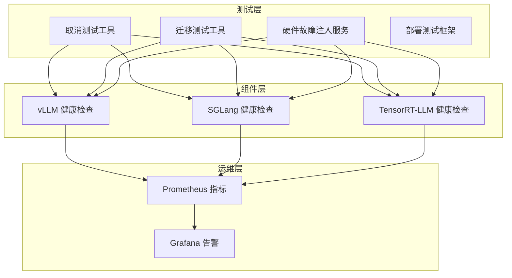
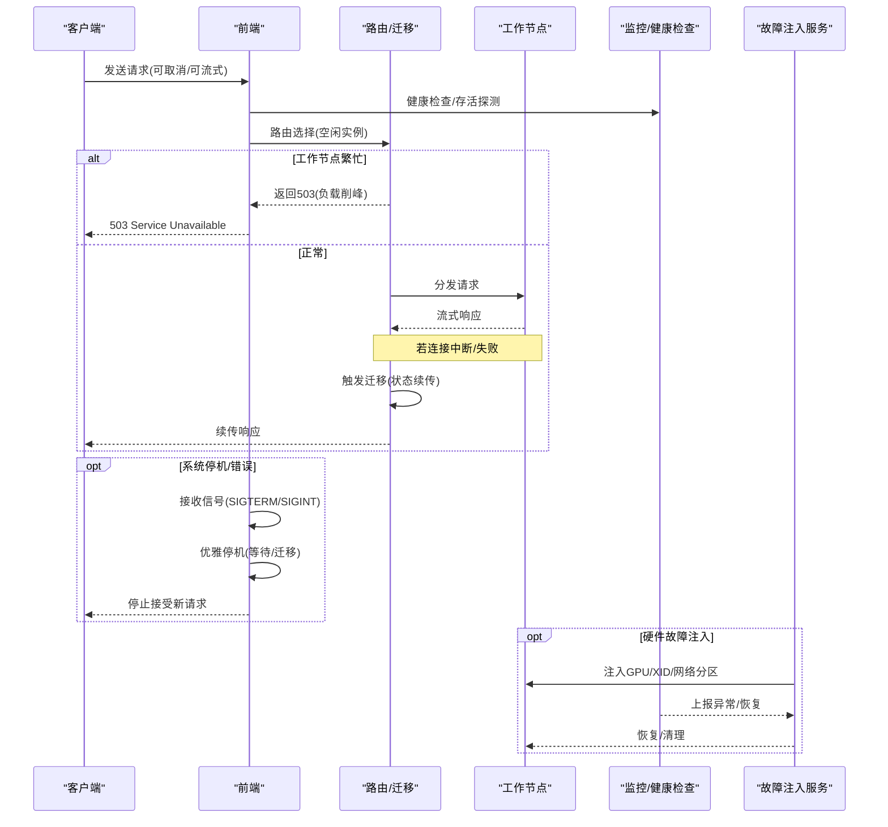
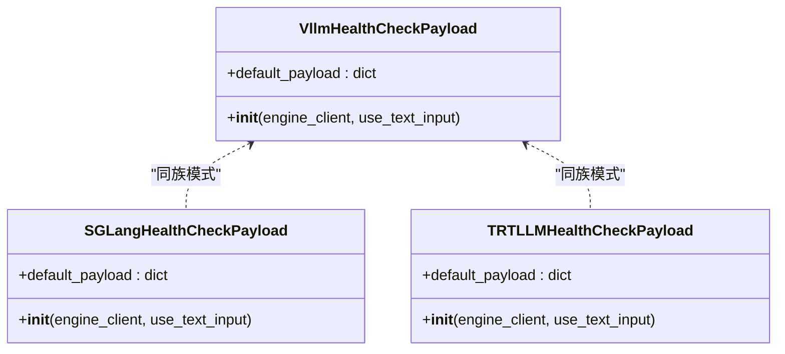
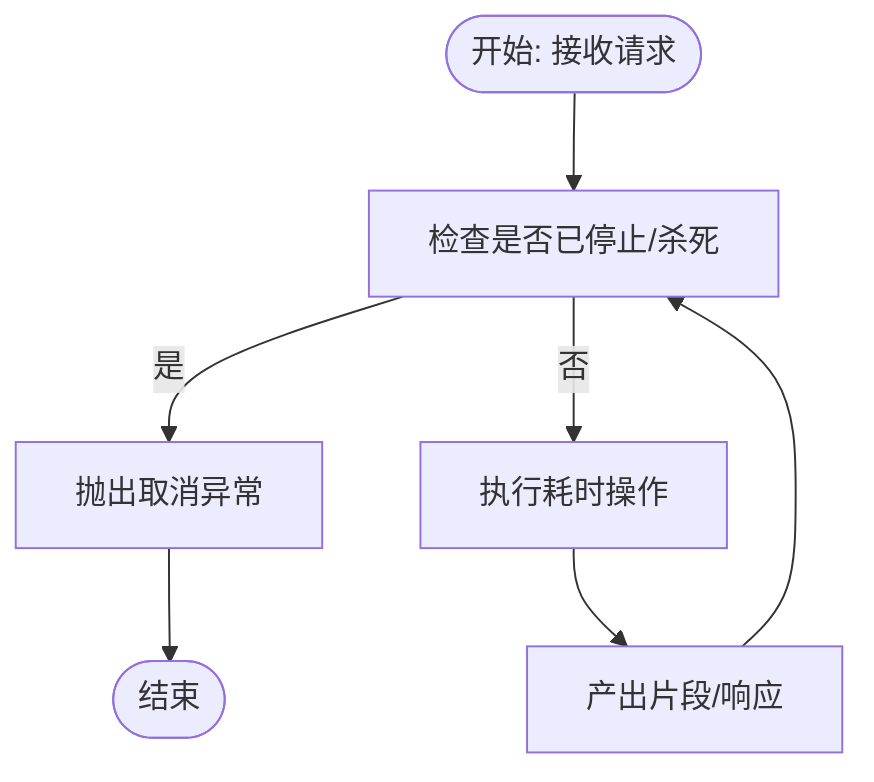
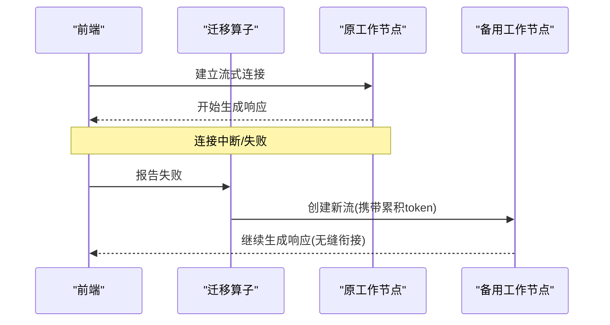
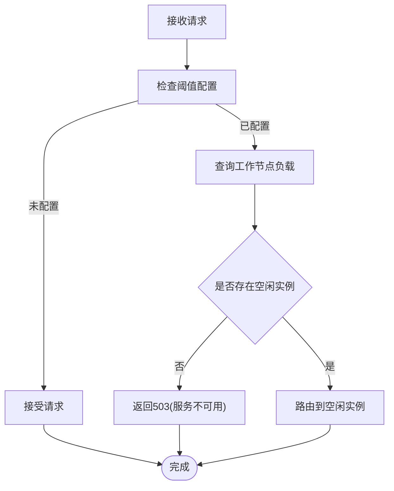
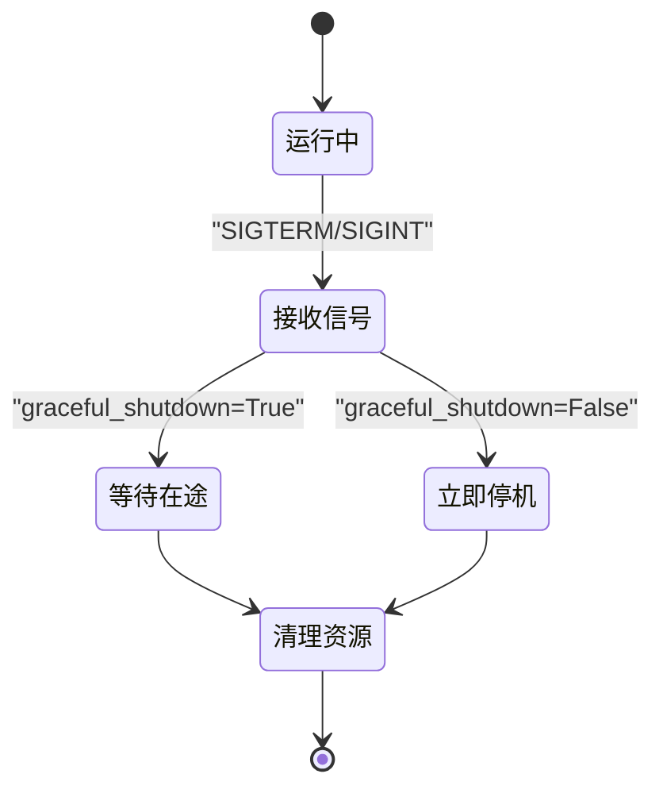
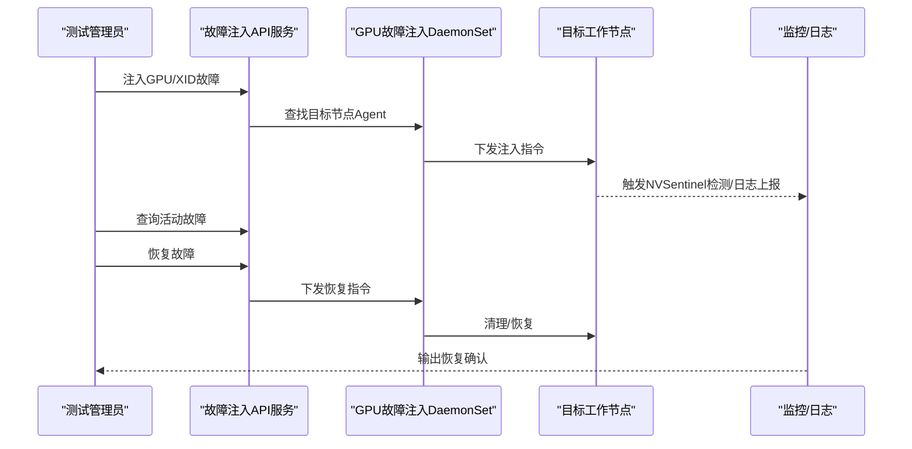
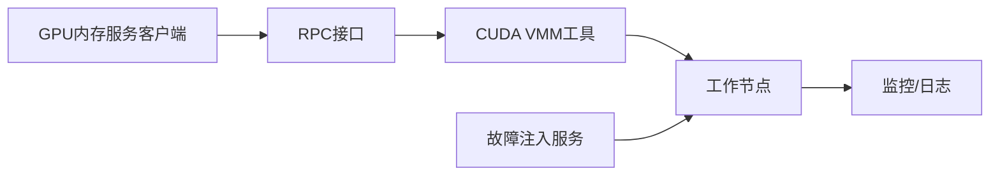
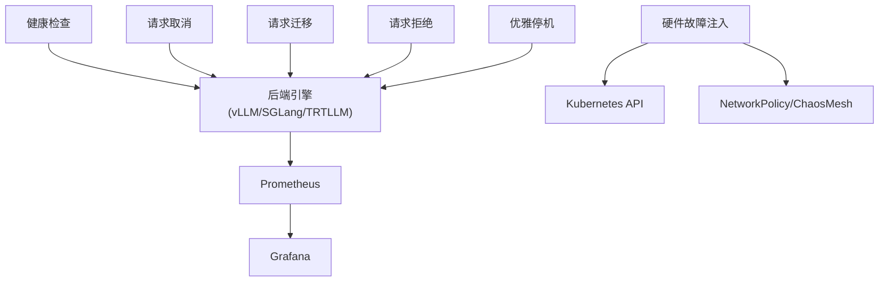

# 故障检测与测试

<cite>
**本文引用的文件**
- [故障容忍测试总览](file://docs/fault_tolerance/testing.md)
- [优雅停机](file://docs/fault_tolerance/graceful_shutdown.md)
- [请求取消架构](file://docs/fault_tolerance/request_cancellation.md)
- [请求迁移架构](file://docs/fault_tolerance/request_migration.md)
- [请求拒绝（负载削峰）](file://docs/fault_tolerance/request_rejection.md)
- [vLLM 健康检查](file://components/src/dynamo/vllm/health_check.py)
- [SGLang 健康检查](file://components/src/dynamo/sglang/health_check.py)
- [TensorRT-LLM 健康检查](file://components/src/dynamo/trtllm/health_check.py)
- [取消测试工具](file://tests/fault_tolerance/cancellation/utils.py)
- [迁移测试工具](file://tests/fault_tolerance/migration/utils.py)
- [故障注入服务 API](file://tests/fault_tolerance/hardware/fault_injection_service/api_service/main.py)
- [GPU 内存服务模块](file://lib/gpu_memory_service/)
</cite>

## 目录
1. [简介](#简介)
2. [项目结构](#项目结构)
3. [核心组件](#核心组件)
4. [架构总览](#架构总览)
5. [详细组件分析](#详细组件分析)
6. [依赖关系分析](#依赖关系分析)
7. [性能考量](#性能考量)
8. [故障排查指南](#故障排查指南)
9. [结论](#结论)
10. [附录](#附录)

## 简介
本文件面向Dynamo的故障检测与测试体系，系统化梳理健康检查、心跳监控、异常告警、请求取消、请求迁移、请求拒绝（负载削峰）、优雅停机以及硬件故障注入等能力，并结合测试框架设计、测试用例编写与自动化流程，给出覆盖度与质量保障措施、测试结果分析与性能回归检测方法，以及最佳实践与工具使用指南。

## 项目结构
Dynamo在多个层面提供故障容错能力：
- 组件层：各后端引擎（vLLM/SGLang/TensorRT-LLM）提供健康检查与运行时监控。
- 测试层：针对取消、迁移、etcd高可用、硬件故障注入与部署级端到端测试的完整套件。
- 运维层：通过Prometheus/Grafana等可观测性组件进行指标采集与告警。

**图表来源**
- [vLLM 健康检查](file://components/src/dynamo/vllm/health_check.py#L1-L121)
- [SGLang 健康检查](file://components/src/dynamo/sglang/health_check.py#L1-L200)
- [TensorRT-LLM 健康检查](file://components/src/dynamo/trtllm/health_check.py#L1-L200)
- [取消测试工具](file://tests/fault_tolerance/cancellation/utils.py#L1-L392)
- [迁移测试工具](file://tests/fault_tolerance/migration/utils.py#L1-L619)
- [故障注入服务 API](file://tests/fault_tolerance/hardware/fault_injection_service/api_service/main.py#L1-L800)

**章节来源**
- [故障容忍测试总览](file://docs/fault_tolerance/testing.md#L1-L504)

## 核心组件
- 健康检查与心跳监控
  - 各后端引擎提供健康检查载荷与默认参数，确保服务就绪与存活探测稳定。
  - vLLM健康检查支持文本输入或token_ids两种模式，并可从模型tokenizer提取BOS token。
- 请求取消
  - 通过AsyncEngineContext在多线程/异步任务间传播取消信号，支持优雅停止与硬性终止。
- 请求迁移
  - 在管道中插入迁移算子，对连接失败与流中断进行自动重试与状态续传，保证无损继续。
- 请求拒绝（负载削峰）
  - 基于KV缓存块利用率与预填充token数双阈值判断工作负载，必要时返回503并提示客户端退避重试。
- 优雅停机
  - 统一处理SIGTERM/SIGINT，按配置等待在途请求完成或立即迁移，确保资源清理与平滑重启。
- 硬件故障注入
  - 提供GPU/XID/热节流/内存压力/过热/计算饱和等故障类型；支持网络分区（前端-Worker/NATS/Worker-Worker/CUSTOM），并具备恢复与清理能力。

**章节来源**
- [vLLM 健康检查](file://components/src/dynamo/vllm/health_check.py#L1-L121)
- [SGLang 健康检查](file://components/src/dynamo/sglang/health_check.py#L1-L200)
- [TensorRT-LLM 健康检查](file://components/src/dynamo/trtllm/health_check.py#L1-L200)
- [请求取消架构](file://docs/fault_tolerance/request_cancellation.md#L1-L89)
- [请求迁移架构](file://docs/fault_tolerance/request_migration.md#L1-L137)
- [请求拒绝（负载削峰）](file://docs/fault_tolerance/request_rejection.md#L1-L329)
- [优雅停机](file://docs/fault_tolerance/graceful_shutdown.md#L1-L275)
- [故障容忍测试总览](file://docs/fault_tolerance/testing.md#L200-L320)

## 架构总览
下图展示Dynamo在“取消-迁移-拒绝-停机-注入”全链路中的交互关系与数据流：

**图表来源**
- [请求取消架构](file://docs/fault_tolerance/request_cancellation.md#L1-L89)
- [请求迁移架构](file://docs/fault_tolerance/request_migration.md#L1-L137)
- [请求拒绝（负载削峰）](file://docs/fault_tolerance/request_rejection.md#L1-L329)
- [优雅停机](file://docs/fault_tolerance/graceful_shutdown.md#L1-L275)
- [故障注入服务 API](file://tests/fault_tolerance/hardware/fault_injection_service/api_service/main.py#L1-L800)

## 详细组件分析

### 健康检查与心跳监控
- vLLM健康检查
  - 支持文本输入与token_ids两种payload生成方式，优先从模型tokenizer提取BOS token，否则回退默认值。
  - 可通过环境变量覆盖默认采样与停止条件，便于快速验证引擎健康。
- SGLang/TensorRT-LLM健康检查
  - 与vLLM类似，提供引擎特定的健康检查载荷与环境覆盖能力，确保不同后端的一致性。

**图表来源**
- [vLLM 健康检查](file://components/src/dynamo/vllm/health_check.py#L1-L121)
- [SGLang 健康检查](file://components/src/dynamo/sglang/health_check.py#L1-L200)
- [TensorRT-LLM 健康检查](file://components/src/dynamo/trtllm/health_check.py#L1-L200)

**章节来源**
- [vLLM 健康检查](file://components/src/dynamo/vllm/health_check.py#L1-L121)

### 请求取消
- 异步引擎上下文（AsyncEngineContext）提供统一的取消语义：
  - is_stopped/is_killed：同步查询状态
  - stopped/killed：异步等待状态变化
  - stop_generating/stop/kill：取消控制
  - link_child：父子上下文联动
- Python绑定Context类映射上述能力，便于在入站/出站请求中传播取消信号。

**图表来源**
- [请求取消架构](file://docs/fault_tolerance/request_cancellation.md#L1-L89)

**章节来源**
- [请求取消架构](file://docs/fault_tolerance/request_cancellation.md#L1-L89)

### 请求迁移
- 迁移算子位于后端前的管道中，拦截所有通信并管理失败场景：
  - 新请求迁移：初始连接失败时重试并创建新流
  - 进行中迁移：流中断后保留已生成token，重建流从断点继续
- 通过Prometheus指标统计迁移次数与类型，辅助观测与告警。

**图表来源**
- [请求迁移架构](file://docs/fault_tolerance/request_migration.md#L1-L137)

**章节来源**
- [请求迁移架构](file://docs/fault_tolerance/request_migration.md#L1-L137)

### 请求拒绝（负载削峰）
- 双阈值策略：
  - KV缓存块利用率阈值
  - 预填充token数量阈值
- 对多数据并行rank采用“全部忙碌”才标记为忙，避免误判。
- 拒绝时返回503，建议客户端指数退避重试。
- Prometheus指标用于监控拒绝总量与排队长度，支持Grafana告警。

**图表来源**
- [请求拒绝（负载削峰）](file://docs/fault_tolerance/request_rejection.md#L1-L329)

**章节来源**
- [请求拒绝（负载削峰）](file://docs/fault_tolerance/request_rejection.md#L1-L329)

### 优雅停机
- 信号处理：统一捕获SIGTERM/SIGINT，触发运行时关闭与资源清理。
- 端点排水：根据graceful_shutdown参数决定是否等待在途请求完成。
- 组件清理：各后端在finally块中释放临时目录、引擎资源等。
- 错误驱动停机：引擎健康监控检测到致命错误时主动发起停机并退出进程以触发重启。

**图表来源**
- [优雅停机](file://docs/fault_tolerance/graceful_shutdown.md#L1-L275)

**章节来源**
- [优雅停机](file://docs/fault_tolerance/graceful_shutdown.md#L1-L275)

### 硬件故障注入与网络分区
- GPU故障类型：XID错误、热节流、内存压力、过热、计算饱和等。
- 网络分区类型：前端-Worker、Worker-NATS、Worker-Worker、自定义分区。
- 服务端API：
  - 注入GPU/XID故障
  - 注入网络分区（NetworkPolicy/ChaosMesh）
  - 列表/恢复故障
  - 查询指标（GPU/网络/推理/节点健康）
- 客户端代理：
  - GPU故障注入DaemonSet代理（内核态注入XID）
  - 通过Pod内HTTP接口下发故障指令与恢复命令。

**图表来源**
- [故障注入服务 API](file://tests/fault_tolerance/hardware/fault_injection_service/api_service/main.py#L1-L800)

**章节来源**
- [故障容忍测试总览](file://docs/fault_tolerance/testing.md#L200-L320)
- [故障注入服务 API](file://tests/fault_tolerance/hardware/fault_injection_service/api_service/main.py#L1-L800)

### GPU内存服务的故障注入测试与硬件模拟
- GPU内存服务模块提供客户端与RPC接口，支持CUDA VMM工具、内存分配器与Torch扩展，便于在测试中模拟显存压力与回收行为。
- 结合故障注入服务，可在目标节点上触发XID/内存压力等事件，观察系统迁移、拒绝与恢复行为。

**图表来源**
- [GPU 内存服务模块](file://lib/gpu_memory_service/)

**章节来源**
- [GPU 内存服务模块](file://lib/gpu_memory_service/)

## 依赖关系分析
- 组件耦合
  - 健康检查与后端引擎强耦合，需随引擎版本演进调整payload。
  - 迁移与路由/后端通信紧密，需保证状态续传一致性。
  - 负载削峰依赖KV缓存指标，需与后端指标发布保持一致。
  - 优雅停机与信号处理、资源清理流程需跨组件协同。
  - 硬件故障注入与Kubernetes/DaemonSet/ChaosMesh集成，存在外部依赖风险。
- 外部依赖
  - Kubernetes API（Pod/NetworkPolicy/ChaosMesh）
  - Prometheus/Grafana（指标与告警）
  - 客户端SDK（请求取消/迁移验证）

**图表来源**
- [vLLM 健康检查](file://components/src/dynamo/vllm/health_check.py#L1-L121)
- [SGLang 健康检查](file://components/src/dynamo/sglang/health_check.py#L1-L200)
- [TensorRT-LLM 健康检查](file://components/src/dynamo/trtllm/health_check.py#L1-L200)
- [请求取消架构](file://docs/fault_tolerance/request_cancellation.md#L1-L89)
- [请求迁移架构](file://docs/fault_tolerance/request_migration.md#L1-L137)
- [请求拒绝（负载削峰）](file://docs/fault_tolerance/request_rejection.md#L1-L329)
- [优雅停机](file://docs/fault_tolerance/graceful_shutdown.md#L1-L275)
- [故障注入服务 API](file://tests/fault_tolerance/hardware/fault_injection_service/api_service/main.py#L1-L800)

## 性能考量
- 负载削峰阈值调优
  - 保守设置降低尾延迟但可能提高拒绝率；激进设置提升吞吐但增加抖动。
  - 与HPA联动，确保在触发扩容前先进行拒绝缓冲。
- 迁移成本
  - 迁移次数与成功率应纳入SLA；过度迁移可能影响整体吞吐。
- 健康检查开销
  - 采样与停止条件应最小化对生产流量的影响。
- 硬件注入频率
  - 控制注入周期与持续时间，避免对稳定性造成二次冲击。

[本节为通用指导，无需列出具体文件来源]

## 故障排查指南
- 健康检查失败
  - 检查后端引擎是否正常启动、tokenizer是否可读、payload字段是否匹配。
- 请求取消无效
  - 确认上游是否正确传递Context，下游是否定期检查is_stopped。
- 迁移未发生
  - 检查迁移限制配置、日志中是否出现“流中断/重建”消息、迁移指标是否增长。
- 拒绝过多
  - 观察KV缓存利用率与预填充token数，适当上调阈值或扩容。
- 优雅停机卡住
  - 检查graceful_shutdown参数、资源清理是否阻塞、K8s终止宽限期设置。
- 硬件注入异常
  - 确认DaemonSet是否在目标节点运行、Agent端口可达、恢复脚本是否执行。

**章节来源**
- [请求取消架构](file://docs/fault_tolerance/request_cancellation.md#L1-L89)
- [请求迁移架构](file://docs/fault_tolerance/request_migration.md#L1-L137)
- [请求拒绝（负载削峰）](file://docs/fault_tolerance/request_rejection.md#L1-L329)
- [优雅停机](file://docs/fault_tolerance/graceful_shutdown.md#L1-L275)
- [故障容忍测试总览](file://docs/fault_tolerance/testing.md#L450-L504)

## 结论
Dynamo通过“健康检查+取消+迁移+拒绝+停机+注入”的全栈能力，构建了高可用、可观测、可测试的故障容忍体系。测试框架覆盖端到端场景，结合指标与告警，能够有效评估系统在真实故障下的鲁棒性与恢复能力。建议在生产环境中持续完善阈值与告警策略，配合自动化回归与混沌工程演练，持续提升系统稳定性与可维护性。

[本节为总结性内容，无需列出具体文件来源]

## 附录

### 测试框架与用例编写
- 取消测试
  - 使用CancellableRequest封装请求生命周期，支持强制关闭底层TCP连接实现硬性取消。
  - 提供poll_for_pattern在日志中定位取消确认信息。
- 迁移测试
  - 提供长请求生成、并发日志轮询、响应解析与延迟校验、迁移指标解析与断言。
  - 支持即时杀进程与优雅停机两种停机方式，验证迁移开关效果。
- 部署测试
  - 场景化配置（负载、故障类型、触发时机），三阶段（标准/溢出/恢复）结果解析。
- 硬件注入测试
  - 通过API服务注入GPU/XID与网络分区，支持列表/恢复/清理，结合监控验证恢复。

**章节来源**
- [取消测试工具](file://tests/fault_tolerance/cancellation/utils.py#L1-L392)
- [迁移测试工具](file://tests/fault_tolerance/migration/utils.py#L1-L619)
- [故障容忍测试总览](file://docs/fault_tolerance/testing.md#L200-L384)

### 测试执行与最佳实践
- 环境准备
  - Kubernetes集群（含GPU节点）、Dynamo部署、etcd集群（HA测试）、故障注入服务。
- 执行方式
  - 使用pytest运行各子目录测试，支持标记过滤（如gpu/k8s/etcd_ha/slow）。
- 最佳实践
  - 专用命名空间隔离测试；测试后清理故障与残留策略；收集日志与指标；监控期间观察关键指标与告警。

**章节来源**
- [故障容忍测试总览](file://docs/fault_tolerance/testing.md#L417-L496)