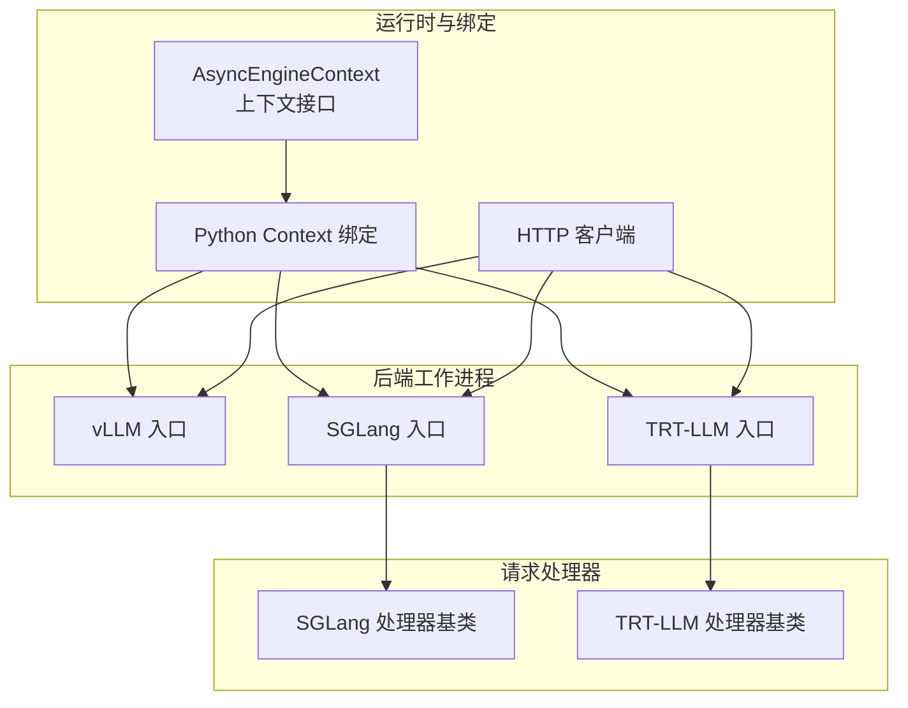
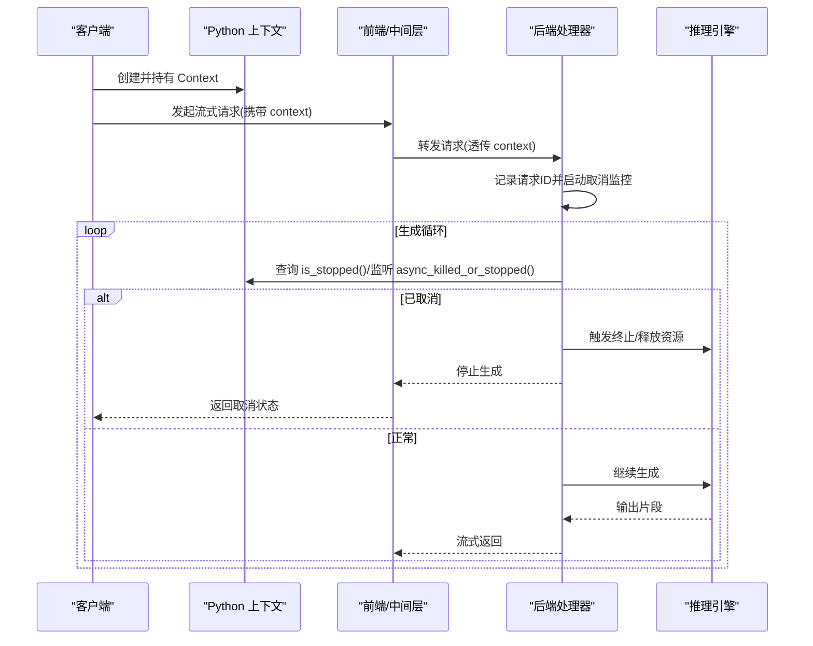
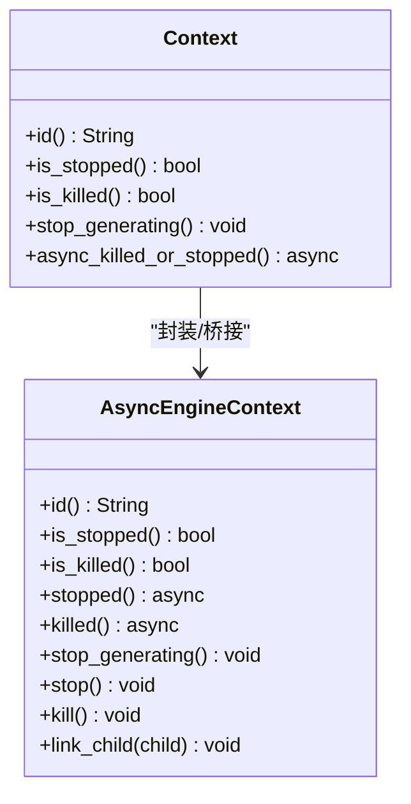
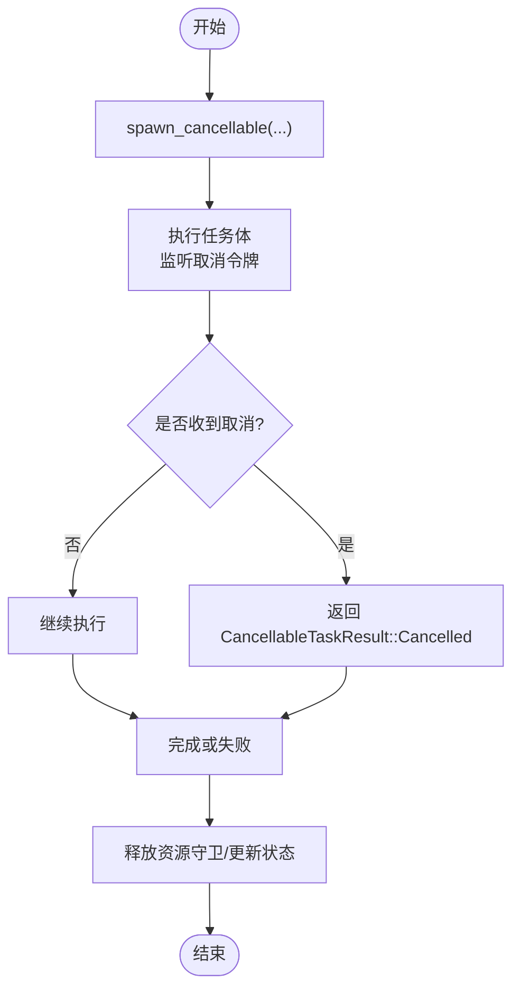
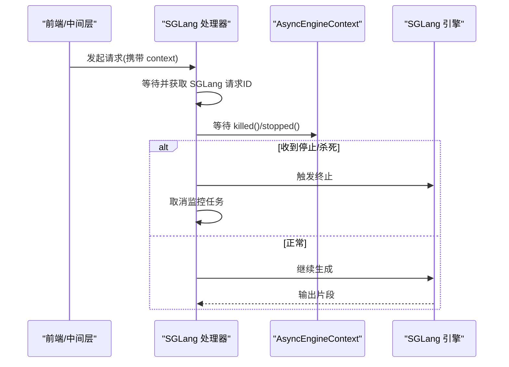
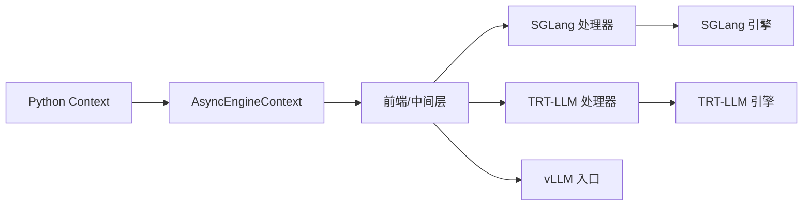

# 请求取消

<cite>
**本文引用的文件**
- [docs/fault_tolerance/request_cancellation.md](file://docs/fault_tolerance/request_cancellation.md)
- [lib/runtime/src/utils/tasks/tracker.rs](file://lib/runtime/src/utils/tasks/tracker.rs)
- [lib/runtime/src/pipeline/context.rs](file://lib/runtime/src/pipeline/context.rs)
- [lib/llm/src/http/client.rs](file://lib/llm/src/http/client.rs)
- [lib/bindings/python/rust/lib.rs](file://lib/bindings/python/rust/lib.rs)
- [lib/bindings/python/rust/context.rs](file://lib/bindings/python/rust/context.rs)
- [lib/bindings/python/tests/cancellation/test_cancellation.py](file://lib/bindings/python/tests/cancellation/test_cancellation.py)
- [components/src/dynamo/vllm/main.py](file://components/src/dynamo/vllm/main.py)
- [components/src/dynamo/sglang/main.py](file://components/src/dynamo/sglang/main.py)
- [components/src/dynamo/trtllm/main.py](file://components/src/dynamo/trtllm/main.py)
- [components/src/dynamo/sglang/request_handlers/handler_base.py](file://components/src/dynamo/sglang/request_handlers/handler_base.py)
- [components/src/dynamo/trtllm/request_handlers/handler_base.py](file://components/src/dynamo/trtllm/request_handlers/handler_base.py)
- [examples/custom_backend/cancellation/README.md](file://examples/custom_backend/cancellation/README.md)
- [examples/custom_backend/cancellation/client.py](file://examples/custom_backend/cancellation/client.py)
- [examples/custom_backend/cancellation/server.py](file://examples/custom_backend/cancellation/server.py)
- [examples/custom_backend/cancellation/middle_server.py](file://examples/custom_backend/cancellation/middle_server.py)
- [tests/fault_tolerance/README.md](file://tests/fault_tolerance/README.md)
- [tests/fault_tolerance/cancellation/test_sglang.py](file://tests/fault_tolerance/cancellation/test_sglang.py)
- [tests/fault_tolerance/cancellation/test_trtllm.py](file://tests/fault_tolerance/cancellation/test_trtllm.py)
</cite>

## 目录
1. [简介](#简介)
2. [项目结构](#项目结构)
3. [核心组件](#核心组件)
4. [架构总览](#架构总览)
5. [详细组件分析](#详细组件分析)
6. [依赖关系分析](#依赖关系分析)
7. [性能考量](#性能考量)
8. [故障排查指南](#故障排查指南)
9. [结论](#结论)
10. [附录](#附录)

## 简介
本文件系统化阐述 Dynamo 的请求取消机制，覆盖从客户端到后端引擎的完整生命周期：取消信号的产生与传播、资源回收与状态更新、错误处理与清理策略、不同后端（vLLM、SGLang、TensorRT-LLM）的适配差异、性能影响与优化建议、数据一致性保障与异常恢复、监控指标与调试方法，并提供可直接参考的 API 使用示例与最佳实践。

## 项目结构
围绕请求取消的关键代码分布在以下层次：
- 运行时与上下文层：定义统一的异步引擎上下文接口、Python 绑定、HTTP 客户端取消控制。
- 后端集成层：各后端工作进程入口与请求处理器，负责接收取消信号并执行终止逻辑。
- 示例与测试：演示直连与代理链路下的取消行为，验证跨组件传播。

**图表来源**
- [lib/runtime/src/pipeline/context.rs](file://lib/runtime/src/pipeline/context.rs#L351-L404)
- [lib/bindings/python/rust/context.rs](file://lib/bindings/python/rust/context.rs#L38-L90)
- [lib/llm/src/http/client.rs](file://lib/llm/src/http/client.rs#L165-L213)
- [components/src/dynamo/vllm/main.py](file://components/src/dynamo/vllm/main.py#L1-L120)
- [components/src/dynamo/sglang/main.py](file://components/src/dynamo/sglang/main.py#L1-L120)
- [components/src/dynamo/trtllm/main.py](file://components/src/dynamo/trtllm/main.py#L1-L120)
- [components/src/dynamo/sglang/request_handlers/handler_base.py](file://components/src/dynamo/sglang/request_handlers/handler_base.py#L303-L392)
- [components/src/dynamo/trtllm/request_handlers/handler_base.py](file://components/src/dynamo/trtllm/request_handlers/handler_base.py#L765-L790)

**章节来源**
- [docs/fault_tolerance/request_cancellation.md](file://docs/fault_tolerance/request_cancellation.md#L1-L89)
- [lib/runtime/src/pipeline/context.rs](file://lib/runtime/src/pipeline/context.rs#L351-L404)
- [lib/bindings/python/rust/context.rs](file://lib/bindings/python/rust/context.rs#L38-L90)
- [lib/llm/src/http/client.rs](file://lib/llm/src/http/client.rs#L165-L213)
- [components/src/dynamo/vllm/main.py](file://components/src/dynamo/vllm/main.py#L1-L120)
- [components/src/dynamo/sglang/main.py](file://components/src/dynamo/sglang/main.py#L1-L120)
- [components/src/dynamo/trtllm/main.py](file://components/src/dynamo/trtllm/main.py#L1-L120)

## 核心组件
- 异步引擎上下文（AsyncEngineContext）
  - 提供请求标识、停止/杀死状态查询、异步等待停止/杀死、停止生成、链接子上下文等能力。
  - Python 绑定通过 Context 暴露同步与异步方法，支持在入站/出站场景传递取消语义。
- 取消令牌与任务跟踪
  - 支持可取消任务的执行、结果状态（成功/取消/失败）、资源守卫与重调度策略。
- 后端工作进程与处理器
  - 各后端入口负责注册模型、启动服务端点；处理器在生成循环中轮询取消状态并执行终止逻辑。

**章节来源**
- [docs/fault_tolerance/request_cancellation.md](file://docs/fault_tolerance/request_cancellation.md#L5-L89)
- [lib/runtime/src/utils/tasks/tracker.rs](file://lib/runtime/src/utils/tasks/tracker.rs#L1285-L1316)
- [lib/runtime/src/utils/tasks/tracker.rs](file://lib/runtime/src/utils/tasks/tracker.rs#L2655-L2680)
- [lib/runtime/src/utils/tasks/tracker.rs](file://lib/runtime/src/utils/tasks/tracker.rs#L3980-L5978)
- [lib/bindings/python/rust/context.rs](file://lib/bindings/python/rust/context.rs#L38-L90)

## 架构总览
下图展示从客户端到后端引擎的取消信号路径与关键交互点。

**图表来源**
- [lib/bindings/python/rust/context.rs](file://lib/bindings/python/rust/context.rs#L38-L90)
- [lib/runtime/src/pipeline/context.rs](file://lib/runtime/src/pipeline/context.rs#L351-L404)
- [components/src/dynamo/sglang/request_handlers/handler_base.py](file://components/src/dynamo/sglang/request_handlers/handler_base.py#L303-L392)
- [components/src/dynamo/trtllm/request_handlers/handler_base.py](file://components/src/dynamo/trtllm/request_handlers/handler_base.py#L765-L790)

## 详细组件分析

### 1) 异步引擎上下文与 Python 绑定
- 上下文接口
  - 标识：唯一请求 ID
  - 状态：is_stopped/is_killed
  - 异步等待：stopped/killed
  - 控制：stop_generating/stop/kill
  - 子上下文：link_child 实现级联取消
- Python 绑定
  - Context 提供 id()/is_stopped()/is_killed()/stop_generating()/async_killed_or_stopped()
  - 在入站/出站场景均可使用，便于在多级链路中传播取消

**图表来源**
- [docs/fault_tolerance/request_cancellation.md](file://docs/fault_tolerance/request_cancellation.md#L9-L48)
- [lib/bindings/python/rust/context.rs](file://lib/bindings/python/rust/context.rs#L38-L90)

**章节来源**
- [docs/fault_tolerance/request_cancellation.md](file://docs/fault_tolerance/request_cancellation.md#L34-L89)
- [lib/bindings/python/rust/context.rs](file://lib/bindings/python/rust/context.rs#L38-L90)
- [lib/runtime/src/pipeline/context.rs](file://lib/runtime/src/pipeline/context.rs#L351-L404)

### 2) 取消令牌与任务跟踪
- 可取消任务执行器
  - 支持在任务中监听取消令牌，返回显式的取消/错误/成功结果类型
  - 任务调度器与资源守卫确保在获取执行槽位期间正确持有资源并在完成后释放
- 错误策略与自定义动作
  - 可在错误发生时触发自定义取消令牌动作，实现跨组件的联动取消

**图表来源**
- [lib/runtime/src/utils/tasks/tracker.rs](file://lib/runtime/src/utils/tasks/tracker.rs#L1220-L1238)
- [lib/runtime/src/utils/tasks/tracker.rs](file://lib/runtime/src/utils/tasks/tracker.rs#L1285-L1316)
- [lib/runtime/src/utils/tasks/tracker.rs](file://lib/runtime/src/utils/tasks/tracker.rs#L2655-L2680)
- [lib/runtime/src/utils/tasks/tracker.rs](file://lib/runtime/src/utils/tasks/tracker.rs#L3455-L3466)

**章节来源**
- [lib/runtime/src/utils/tasks/tracker.rs](file://lib/runtime/src/utils/tasks/tracker.rs#L1285-L1316)
- [lib/runtime/src/utils/tasks/tracker.rs](file://lib/runtime/src/utils/tasks/tracker.rs#L2655-L2680)
- [lib/runtime/src/utils/tasks/tracker.rs](file://lib/runtime/src/utils/tasks/tracker.rs#L3455-L3466)

### 3) HTTP 客户端取消控制
- HTTP 客户端在 stop_generating()/kill() 时设置内部停止标志并广播取消令牌
- 适用于通过 HTTP 客户端发起的请求取消

**章节来源**
- [lib/llm/src/http/client.rs](file://lib/llm/src/http/client.rs#L165-L213)

### 4) vLLM 后端
- 入口与服务
  - 初始化分布式运行时、注册模型、启动生成端点
  - 支持优雅关闭与健康检查负载
- 取消处理
  - 在生成循环中轮询上下文状态，检测到取消后立即停止生成并释放相关资源

**章节来源**
- [components/src/dynamo/vllm/main.py](file://components/src/dynamo/vllm/main.py#L530-L674)
- [components/src/dynamo/vllm/main.py](file://components/src/dynamo/vllm/main.py#L676-L700)

### 5) SGLang 后端
- 入口与服务
  - 解析参数、初始化引擎、注册模型、启动生成端点
  - 支持预热以降低首次耗时
- 取消处理
  - 处理器记录请求 ID 并启动取消监控任务
  - 监控任务等待父上下文的 killed/stopped，收到信号后触发终止流程并取消监控任务

**图表来源**
- [components/src/dynamo/sglang/main.py](file://components/src/dynamo/sglang/main.py#L125-L210)
- [components/src/dynamo/sglang/request_handlers/handler_base.py](file://components/src/dynamo/sglang/request_handlers/handler_base.py#L303-L392)

**章节来源**
- [components/src/dynamo/sglang/main.py](file://components/src/dynamo/sglang/main.py#L125-L210)
- [components/src/dynamo/sglang/request_handlers/handler_base.py](file://components/src/dynamo/sglang/request_handlers/handler_base.py#L303-L392)

### 6) TensorRT-LLM 后端
- 入口与服务
  - 构建引擎参数、注册模型、启动生成端点
  - 支持事件与指标发布配置
- 取消处理
  - 在生成循环中捕获客户端取消异常，记录日志并返回，避免错误响应

**章节来源**
- [components/src/dynamo/trtllm/main.py](file://components/src/dynamo/trtllm/main.py#L162-L520)
- [components/src/dynamo/trtllm/request_handlers/handler_base.py](file://components/src/dynamo/trtllm/request_handlers/handler_base.py#L765-L790)

### 7) 示例与测试
- 示例演示
  - 直连与代理两种链路，客户端调用 context.stop_generating()，后端通过 context.is_stopped() 检测并优雅退出
- 测试验证
  - 针对 SGLang 与 TRT-LLM 的取消测试模式与运行示例，涵盖聚合与拆分阶段的取消场景

**章节来源**
- [examples/custom_backend/cancellation/README.md](file://examples/custom_backend/cancellation/README.md#L1-L92)
- [examples/custom_backend/cancellation/client.py](file://examples/custom_backend/cancellation/client.py#L1-L78)
- [examples/custom_backend/cancellation/server.py](file://examples/custom_backend/cancellation/server.py#L1-L53)
- [examples/custom_backend/cancellation/middle_server.py](file://examples/custom_backend/cancellation/middle_server.py#L1-L75)
- [tests/fault_tolerance/README.md](file://tests/fault_tolerance/README.md#L87-L114)
- [tests/fault_tolerance/cancellation/test_sglang.py](file://tests/fault_tolerance/cancellation/test_sglang.py#L264-L300)
- [tests/fault_tolerance/cancellation/test_trtllm.py](file://tests/fault_tolerance/cancellation/test_trtllm.py#L140-L174)

## 依赖关系分析
- 组件耦合
  - Python Context 与 AsyncEngineContext 强绑定，确保取消语义一致
  - 后端处理器依赖上下文进行取消检测，引擎层负责实际终止
- 外部依赖
  - 各后端引擎（vLLM/SGLang/TRT-LLM）的版本与特性差异会影响取消时机与资源回收策略

**图表来源**
- [lib/bindings/python/rust/context.rs](file://lib/bindings/python/rust/context.rs#L38-L90)
- [lib/runtime/src/pipeline/context.rs](file://lib/runtime/src/pipeline/context.rs#L351-L404)
- [components/src/dynamo/sglang/request_handlers/handler_base.py](file://components/src/dynamo/sglang/request_handlers/handler_base.py#L303-L392)
- [components/src/dynamo/trtllm/request_handlers/handler_base.py](file://components/src/dynamo/trtllm/request_handlers/handler_base.py#L765-L790)
- [components/src/dynamo/vllm/main.py](file://components/src/dynamo/vllm/main.py#L530-L674)

**章节来源**
- [lib/bindings/python/rust/context.rs](file://lib/bindings/python/rust/context.rs#L38-L90)
- [lib/runtime/src/pipeline/context.rs](file://lib/runtime/src/pipeline/context.rs#L351-L404)
- [components/src/dynamo/sglang/request_handlers/handler_base.py](file://components/src/dynamo/sglang/request_handlers/handler_base.py#L303-L392)
- [components/src/dynamo/trtllm/request_handlers/handler_base.py](file://components/src/dynamo/trtllm/request_handlers/handler_base.py#L765-L790)
- [components/src/dynamo/vllm/main.py](file://components/src/dynamo/vllm/main.py#L530-L674)

## 性能考量
- 取消时机
  - 尽早检测取消可减少无效计算；在长耗时操作前轮询 is_stopped() 是关键
- 资源回收
  - 使用资源守卫确保执行期间资源锁定，完成后自动释放，避免泄漏
- 批量与并发
  - 在批量/并发场景中，应优先取消高价值请求，避免阻塞队列
- 指标与观测
  - 结合后端原生指标（如 TRT-LLM Prometheus 指标）与 Dynamo 层面的取消计数，评估取消对吞吐与延迟的影响

[本节为通用指导，无需列出具体文件来源]

## 故障排查指南
- 常见问题
  - 取消未生效：确认处理器中确实轮询了上下文状态；检查链路中是否正确透传了 Context
  - 资源未释放：核查资源守卫是否在作用域内，异常路径是否触发了清理
  - 日志与可观测性：关注后端日志中的“Aborted Request ID”“Client cancelled”等提示
- 调试方法
  - 使用示例程序直连与代理两种模式复现
  - 在处理器中增加日志，记录请求 ID、取消信号到达时间、终止原因
  - 利用测试用例的运行模式快速定位问题

**章节来源**
- [examples/custom_backend/cancellation/README.md](file://examples/custom_backend/cancellation/README.md#L59-L92)
- [tests/fault_tolerance/cancellation/test_sglang.py](file://tests/fault_tolerance/cancellation/test_sglang.py#L264-L300)
- [tests/fault_tolerance/cancellation/test_trtllm.py](file://tests/fault_tolerance/cancellation/test_trtllm.py#L140-L174)

## 结论
Dynamo 的请求取消机制通过统一的 AsyncEngineContext 抽象与 Python 绑定，在前端/中间层与后端引擎之间建立了清晰的取消传播路径。结合各后端的处理器实现与资源守卫策略，可在不牺牲数据一致性的前提下高效回收资源、缩短响应时间。建议在生产环境中配合指标监控与日志审计，持续优化取消策略与性能表现。

[本节为总结性内容，无需列出具体文件来源]

## 附录

### A. API 使用示例与最佳实践
- 客户端侧
  - 创建 Context，发起流式请求并携带 context
  - 在收到若干响应后调用 context.stop_generating() 触发取消
- 中间层（可选）
  - 接收请求后转发给下游，透传同一 context，实现级联取消
- 后端处理器
  - 在每次生成迭代前检查 context.is_stopped()，若已取消则抛出取消异常并返回
- 最佳实践
  - 在每个长时间操作前检查取消状态
  - 明确区分“停止生成”与“杀死”，按需选择
  - 对异常路径进行资源清理与状态回滚

**章节来源**
- [examples/custom_backend/cancellation/README.md](file://examples/custom_backend/cancellation/README.md#L28-L92)
- [examples/custom_backend/cancellation/client.py](file://examples/custom_backend/cancellation/client.py#L14-L37)
- [examples/custom_backend/cancellation/server.py](file://examples/custom_backend/cancellation/server.py#L16-L29)
- [examples/custom_backend/cancellation/middle_server.py](file://examples/custom_backend/cancellation/middle_server.py#L31-L48)
- [docs/fault_tolerance/request_cancellation.md](file://docs/fault_tolerance/request_cancellation.md#L50-L89)

### B. 不同后端的取消支持与差异
- vLLM
  - 通过生成端点的服务实现与上下文轮询，实现取消后的资源回收
- SGLang
  - 处理器启动取消监控任务，等待父上下文的 killed/stopped 信号，随后终止引擎并清理
- TRT-LLM
  - 在生成循环中捕获客户端取消异常，记录日志并返回，避免错误响应

**章节来源**
- [components/src/dynamo/vllm/main.py](file://components/src/dynamo/vllm/main.py#L530-L674)
- [components/src/dynamo/sglang/request_handlers/handler_base.py](file://components/src/dynamo/sglang/request_handlers/handler_base.py#L303-L392)
- [components/src/dynamo/trtllm/request_handlers/handler_base.py](file://components/src/dynamo/trtllm/request_handlers/handler_base.py#L765-L790)

### C. 监控指标与调试方法
- 指标
  - TRT-LLM Prometheus 指标：请求延迟、TTFT、TPOT 等
  - Dynamo 层面的取消计数与任务状态统计
- 调试
  - 使用示例程序与测试用例快速复现
  - 在处理器中增加日志，记录请求 ID、取消信号到达与终止原因

**章节来源**
- [components/src/dynamo/trtllm/main.py](file://components/src/dynamo/trtllm/main.py#L405-L430)
- [tests/fault_tolerance/README.md](file://tests/fault_tolerance/README.md#L87-L114)