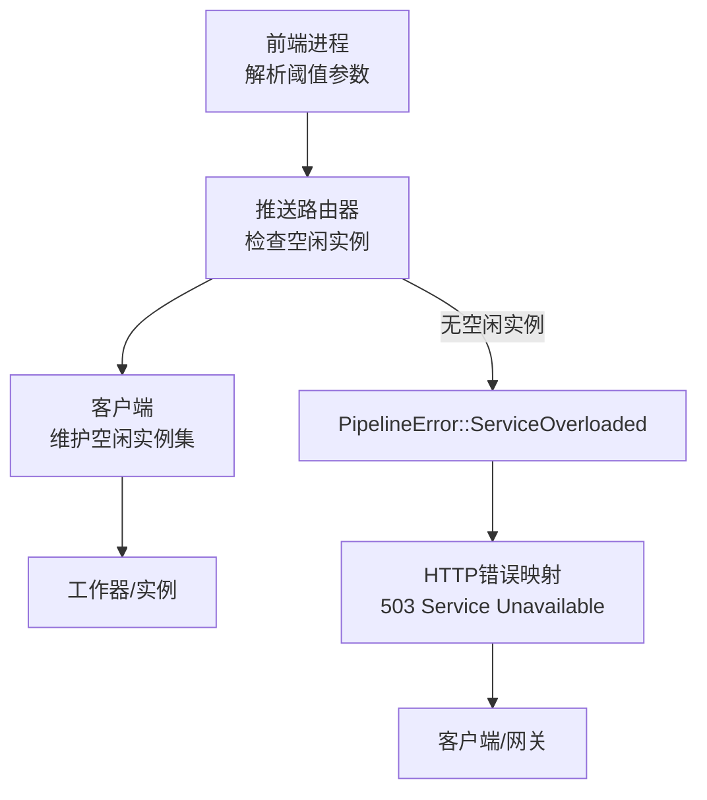
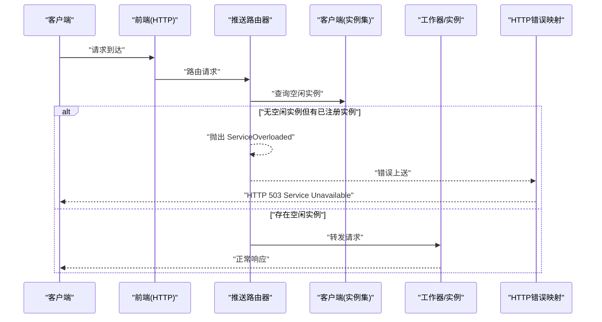
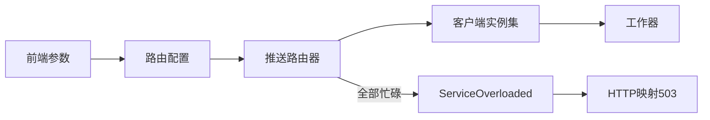

# 请求拒绝

<cite>
**本文引用的文件**
- [components/src/dynamo/frontend/main.py](file://components/src/dynamo/frontend/main.py)
- [docs/fault_tolerance/request_rejection.md](file://docs/fault_tolerance/request_rejection.md)
- [lib/llm/src/http/service/openai.rs](file://lib/llm/src/http/service/openai.rs)
- [lib/rust/runtime/src/pipeline/network/egress/push_router.rs](file://lib/rust/runtime/src/pipeline/network/egress/push_router.rs)
- [lib/rust/runtime/src/pipeline/error.rs](file://lib/rust/runtime/src/pipeline/error.rs)
- [lib/rust/runtime/src/component/client.rs](file://lib/rust/runtime/src/component/client.rs)
- [lib/rust/runtime/examples/system_metrics/README.md](file://lib/rust/runtime/examples/system_metrics/README.md)
- [tests/router/common.py](file://tests/router/common.py)
- [docs/kubernetes/autoscaling.md](file://docs/kubernetes/autoscaling.md)
- [deploy/operator/config/crd/bases/nvidia.com_dynamocomponentdeployments.yaml](file://deploy/operator/config/crd/bases/nvidia.com_dynamocomponentdeployments.yaml)
- [deploy/helm/charts/crds/templates/nvidia.com_dynamocomponentdeployments.yaml](file://deploy/helm/charts/crds/templates/nvidia.com_dynamocomponentdeployments.yaml)
</cite>

## 目录
1. [简介](#简介)
2. [项目结构](#项目结构)
3. [核心组件](#核心组件)
4. [架构总览](#架构总览)
5. [详细组件分析](#详细组件分析)
6. [依赖关系分析](#依赖关系分析)
7. [性能考量](#性能考量)
8. [故障排查指南](#故障排查指南)
9. [结论](#结论)
10. [附录](#附录)

## 简介
本技术文档聚焦Dynamo的请求拒绝（负载削峰）机制，系统性阐述在过载、资源不足或维护期间，如何通过“优雅拒绝”保障整体稳定性与延迟可预期性。拒绝策略覆盖阈值检测、路由层决策、错误转换与返回、以及与负载管理与自动扩缩容的协同。文档同时给出拒绝率监控、告警设置、配置调优建议与客户端重试策略。

## 项目结构
围绕请求拒绝的关键实现分布在以下模块：
- 前端参数与路由配置：负责接收并传递“忙碌阈值”参数，驱动路由层的拒绝逻辑
- 路由器与实例选择：在可用实例为空时触发拒绝
- 错误类型与HTTP映射：将内部“服务过载”错误映射为标准HTTP 503
- 客户端与实例状态：维护“空闲/忙碌”实例集合，支撑拒绝判断
- 文档与测试：定义拒绝行为、错误响应格式、监控指标与告警样例，并通过测试验证

图表来源
- [components/src/dynamo/frontend/main.py](file://components/src/dynamo/frontend/main.py#L233-L243)
- [lib/rust/runtime/src/pipeline/network/egress/push_router.rs](file://lib/rust/runtime/src/pipeline/network/egress/push_router.rs#L269-L300)
- [lib/rust/runtime/src/component/client.rs](file://lib/rust/runtime/src/component/client.rs#L141-L149)
- [lib/llm/src/http/service/openai.rs](file://lib/llm/src/http/service/openai.rs#L163-L187)

章节来源
- [components/src/dynamo/frontend/main.py](file://components/src/dynamo/frontend/main.py#L233-L243)
- [docs/fault_tolerance/request_rejection.md](file://docs/fault_tolerance/request_rejection.md#L32-L64)

## 核心组件
- 前端进程与阈值参数
  - 通过命令行参数设置“活跃解码块占比阈值”和“活跃预填充token阈值”，用于判定工作器是否“忙碌”
  - 参数透传到路由配置，驱动路由器在无空闲实例时进行拒绝
- 推送路由器
  - 在启用忙碌阈值时，查询当前空闲实例集合；若为空且存在已注册实例，则抛出“服务过载”错误
- 客户端与实例状态
  - 维护“全部实例”和“空闲实例”集合，支持基于忙碌实例ID更新空闲集合
- 错误映射与HTTP响应
  - 将内部“服务过载”错误映射为HTTP 503，携带统一错误体字段
- 监控与告警
  - 提供拒绝计数与队列长度指标，支持PromQL查询与Grafana告警规则

章节来源
- [components/src/dynamo/frontend/main.py](file://components/src/dynamo/frontend/main.py#L233-L243)
- [lib/rust/runtime/src/pipeline/network/egress/push_router.rs](file://lib/rust/runtime/src/pipeline/network/egress/push_router.rs#L269-L300)
- [lib/rust/runtime/src/component/client.rs](file://lib/rust/runtime/src/component/client.rs#L141-L149)
- [lib/llm/src/http/service/openai.rs](file://lib/llm/src/http/service/openai.rs#L163-L187)
- [docs/fault_tolerance/request_rejection.md](file://docs/fault_tolerance/request_rejection.md#L207-L244)

## 架构总览
下图展示从请求到达前端到被优雅拒绝的完整路径，以及错误如何映射为HTTP 503返回给客户端。

图表来源
- [lib/rust/runtime/src/pipeline/network/egress/push_router.rs](file://lib/rust/runtime/src/pipeline/network/egress/push_router.rs#L269-L300)
- [lib/llm/src/http/service/openai.rs](file://lib/llm/src/http/service/openai.rs#L163-L187)
- [docs/fault_tolerance/request_rejection.md](file://docs/fault_tolerance/request_rejection.md#L160-L184)

## 详细组件分析

### 前端参数与阈值配置
- 关键参数
  - 活跃解码块占比阈值：0.0–1.0，用于判定KV缓存块使用率
  - 活跃预填充token阈值：整数，用于判定当前正在预填充的token数量
- 配置方式
  - 启动参数直接设置
  - 运行时可通过API动态调整（见文档）
- 影响范围
  - 启用后，路由器在选择实例前会检查空闲集合；若为空则触发拒绝

章节来源
- [components/src/dynamo/frontend/main.py](file://components/src/dynamo/frontend/main.py#L233-L243)
- [docs/fault_tolerance/request_rejection.md](file://docs/fault_tolerance/request_rejection.md#L54-L104)

### 路由器与实例选择
- 选择逻辑
  - 若启用忙碌阈值：查询空闲实例集合
  - 若空闲集合为空且存在已注册实例：判定为“全部忙碌”，触发拒绝
- 实现要点
  - 支持轮询/随机等模式下的实例选择
  - 对于KV模式，路由器具备更复杂的缓存状态感知能力（与拒绝无直接冲突）

章节来源
- [lib/rust/runtime/src/pipeline/network/egress/push_router.rs](file://lib/rust/runtime/src/pipeline/network/egress/push_router.rs#L204-L227)
- [lib/rust/runtime/src/pipeline/network/egress/push_router.rs](file://lib/rust/runtime/src/pipeline/network/egress/push_router.rs#L269-L300)

### 客户端与实例状态管理
- 空闲实例更新
  - 基于“忙碌实例ID列表”计算当前空闲实例集合
  - 变更时通知订阅者，保证路由层可见最新状态
- 实例下线抑制
  - 当实例报告不可用时，将其从可用集合中移除

章节来源
- [lib/rust/runtime/src/component/client.rs](file://lib/rust/runtime/src/component/client.rs#L126-L149)

### 错误类型与HTTP映射
- 内部错误类型
  - “服务过载”错误类型用于表达“全部忙碌”的拒绝语义
- HTTP映射
  - 将“服务过载”错误映射为HTTP 503，携带统一错误体字段（消息、类型、状态码）
- 测试验证
  - 单测确保收到503且错误消息包含“全部忙碌”提示

章节来源
- [lib/rust/runtime/src/pipeline/error.rs](file://lib/rust/runtime/src/pipeline/error.rs#L123-L125)
- [lib/llm/src/http/service/openai.rs](file://lib/llm/src/http/service/openai.rs#L163-L187)
- [tests/router/common.py](file://tests/router/common.py#L1282-L1310)

### 错误响应格式与HTTP状态码
- HTTP状态码：503 Service Unavailable
- 响应体字段
  - message：人类可读的错误信息
  - type：错误类型标识
  - code：HTTP状态码数值
- 示例（来自文档）
  - 包含“全部忙碌，请稍后再试”的提示

章节来源
- [docs/fault_tolerance/request_rejection.md](file://docs/fault_tolerance/request_rejection.md#L171-L184)

### 不同类型的拒绝场景
- 服务不可用
  - 典型于工作器未就绪或健康检查失败，HTTP映射为503
- 资源限制
  - KV缓存块使用率或预填充token数超过阈值，导致全部实例被视为“忙碌”
- 容量饱和
  - 所有已注册实例均处于忙碌状态，无空闲实例可选

章节来源
- [docs/fault_tolerance/request_rejection.md](file://docs/fault_tolerance/request_rejection.md#L22-L30)
- [lib/llm/src/http/service/openai.rs](file://lib/llm/src/http/service/openai.rs#L109-L122)

### 拒绝策略与排队、优先级、负载均衡
- 排队策略
  - 文档未提供显式的队列实现；拒绝发生在路由层，避免请求进入下游
- 优先级处理
  - 路由层未实现多优先级队列；拒绝以“全部忙碌”为统一判定
- 负载均衡机制
  - 通过空闲实例集合与轮询/随机选择实现基本均衡
  - KV模式下结合缓存事件提升选择准确性

章节来源
- [docs/fault_tolerance/request_rejection.md](file://docs/fault_tolerance/request_rejection.md#L32-L64)
- [lib/rust/runtime/src/pipeline/network/egress/push_router.rs](file://lib/rust/runtime/src/pipeline/network/egress/push_router.rs#L204-L227)

### 拒绝率监控、告警与性能影响
- 指标
  - 拒绝总数、HTTP队列中的请求数
- 查询示例
  - 使用PromQL计算拒绝率与占比
- 告警
  - 基于拒绝率占比设定阈值告警
- 性能影响
  - 早期拒绝可避免尾延迟恶化与级联故障
  - 需平衡阈值保守性与吞吐

章节来源
- [docs/fault_tolerance/request_rejection.md](file://docs/fault_tolerance/request_rejection.md#L207-L244)

### 与负载管理、自动扩缩容的协同
- 负载管理
  - 通过忙碌阈值在扩缩容触发前主动限流
- 自动扩缩容
  - 文档建议HPA触发阈值低于拒绝阈值，形成“缓冲带”
  - CRD中包含HPA扩缩策略模板，便于在集群侧落地

章节来源
- [docs/fault_tolerance/request_rejection.md](file://docs/fault_tolerance/request_rejection.md#L314-L322)
- [docs/kubernetes/autoscaling.md](file://docs/kubernetes/autoscaling.md#L499-L732)
- [deploy/operator/config/crd/bases/nvidia.com_dynamocomponentdeployments.yaml](file://deploy/operator/config/crd/bases/nvidia.com_dynamocomponentdeployments.yaml#L103-L122)
- [deploy/helm/charts/crds/templates/nvidia.com_dynamocomponentdeployments.yaml](file://deploy/helm/charts/crds/templates/nvidia.com_dynamocomponentdeployments.yaml#L103-L122)

### 配置选项与调优建议
- 保守设置（低延迟优先）
  - 更低的忙碌阈值，提前拒绝，降低队列深度与尾延迟
- 激进设置（高吞吐优先）
  - 更高的忙碌阈值，允许更高利用率，可能增加延迟抖动
- 动态调整
  - 支持运行时通过API调整阈值，便于在线优化
- 最佳实践
  - 先观察再设阈值；在分部署场景分别针对预填充与解码工作器设置阈值

章节来源
- [docs/fault_tolerance/request_rejection.md](file://docs/fault_tolerance/request_rejection.md#L246-L313)

### 客户端重试策略
- 建议采用指数退避+抖动
- 避免雪崩式重试，结合服务端限速与客户端退避共同缓解

章节来源
- [docs/fault_tolerance/request_rejection.md](file://docs/fault_tolerance/request_rejection.md#L186-L205)

## 依赖关系分析
- 前端参数 → 路由器配置 → 实例状态查询 → 拒绝判定 → 错误映射 → HTTP响应
- 客户端负责维护实例可用性与空闲集合，是拒绝判定的直接依据

图表来源
- [components/src/dynamo/frontend/main.py](file://components/src/dynamo/frontend/main.py#L233-L243)
- [lib/rust/runtime/src/pipeline/network/egress/push_router.rs](file://lib/rust/runtime/src/pipeline/network/egress/push_router.rs#L269-L300)
- [lib/rust/runtime/src/component/client.rs](file://lib/rust/runtime/src/component/client.rs#L141-L149)
- [lib/llm/src/http/service/openai.rs](file://lib/llm/src/http/service/openai.rs#L163-L187)

## 性能考量
- 拒绝前置：在路由层快速拒绝，避免无效排队与资源浪费
- 队列长度：通过指标观测HTTP队列长度，指导容量规划
- 与扩缩容配合：在HPA之前通过拒绝控制流量，减少频繁扩缩带来的抖动

章节来源
- [docs/fault_tolerance/request_rejection.md](file://docs/fault_tolerance/request_rejection.md#L207-L244)

## 故障排查指南
- 现象：持续收到503
  - 检查忙碌阈值是否过高或过低
  - 观察工作器负载指标，确认是否存在异常峰值
- 现象：拒绝率突然升高
  - 结合PromQL查询拒绝率与队列长度，定位时段性流量洪峰
  - 校验HPA策略与拒绝阈值的关系
- 现象：客户端重试仍失败
  - 确认客户端退避策略是否合理
  - 检查服务端健康状态与实例可用性

章节来源
- [lib/rust/runtime/examples/system_metrics/README.md](file://lib/rust/runtime/examples/system_metrics/README.md#L78-L123)
- [tests/router/common.py](file://tests/router/common.py#L1282-L1310)

## 结论
Dynamo的请求拒绝机制通过“忙碌阈值 + 路由层拒绝 + 统一HTTP映射”形成闭环，既能在过载时保护系统，又能向客户端传达明确的“稍后重试”信号。配合监控、告警与自动扩缩容，可实现稳定、可预期的服务质量。建议在生产中采用保守阈值起步，结合PromQL与Grafana告警持续优化，并为客户端提供合理的指数退避策略。

## 附录
- 相关文档
  - [健康检查](file://docs/observability/health-checks.md)
  - [指标参考](file://docs/observability/metrics.md)
  - [请求迁移](file://docs/fault_tolerance/request_migration.md)