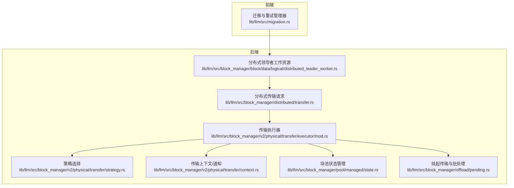
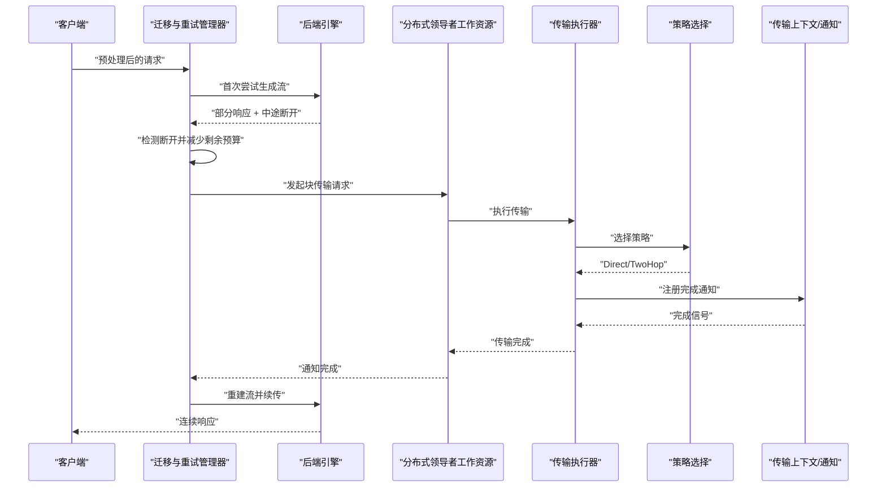
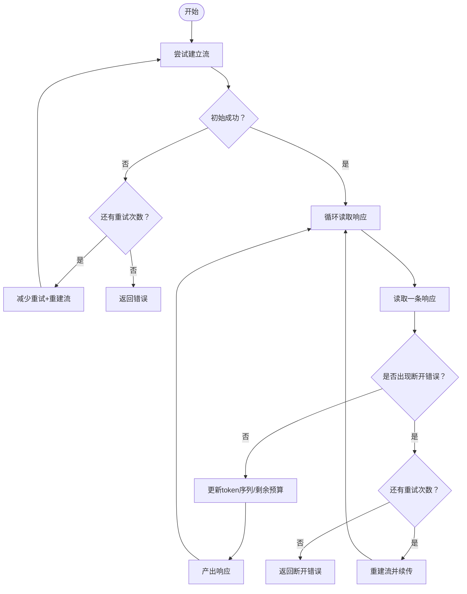
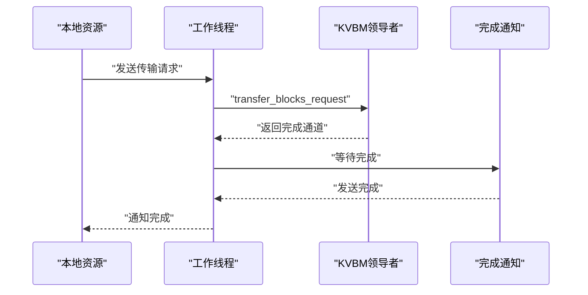
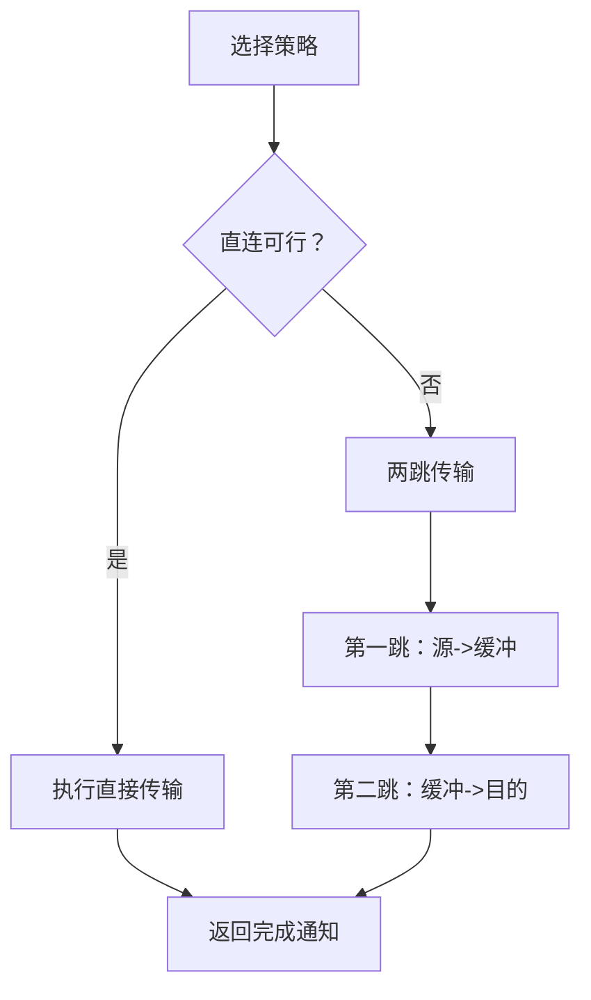
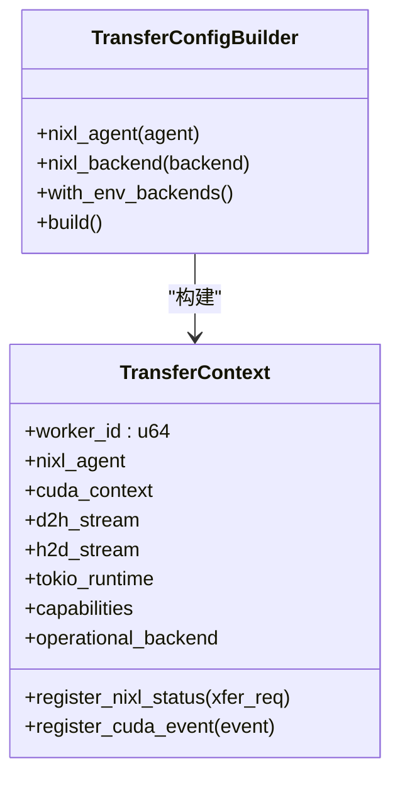
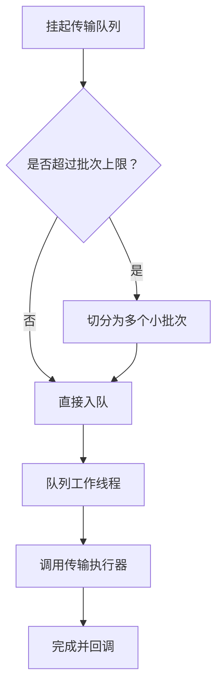
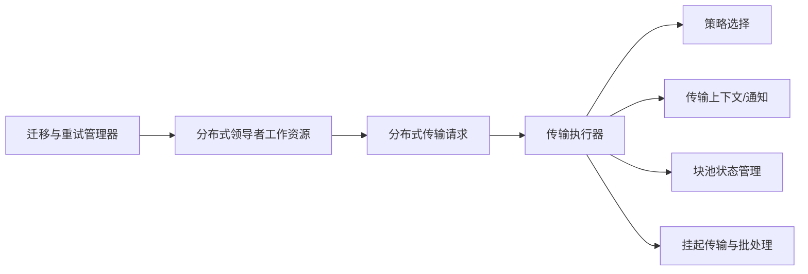

# 请求迁移

<cite>
**本文引用的文件**
- [请求迁移架构说明](file://docs/fault_tolerance/request_migration.md)
- [迁移与重试管理器](file://lib/llm/src/migration.rs)
- [物理块传输执行器](file://lib/llm/src/block_manager/v2/physical/transfer/executor/mod.rs)
- [传输策略选择](file://lib/llm/src/block_manager/v2/physical/transfer/strategy.rs)
- [传输上下文与通知](file://lib/llm/src/block_manager/v2/physical/transfer/context.rs)
- [分布式领导者工作资源](file://lib/llm/src/block_manager/block/data/logical/distributed_leader_worker.rs)
- [块池状态管理](file://lib/llm/src/block_manager/pool/managed/state.rs)
- [挂起传输与批处理](file://lib/llm/src/block_manager/offload/pending.rs)
- [分布式传输请求](file://lib/llm/src/block_manager/distributed/transfer.rs)
- [测试工具：迁移验证](file://tests/fault_tolerance/migration/utils.py)
</cite>

## 目录
1. [简介](#简介)
2. [项目结构](#项目结构)
3. [核心组件](#核心组件)
4. [架构总览](#架构总览)
5. [详细组件分析](#详细组件分析)
6. [依赖关系分析](#依赖关系分析)
7. [性能考量](#性能考量)
8. [故障排查指南](#故障排查指南)
9. [结论](#结论)
10. [附录](#附录)

## 简介
本文件系统化阐述Dynamo在分布式环境下的请求迁移机制，覆盖从触发条件、迁移协议到状态同步与数据完整性保障；解释多节点协调、迁移队列与并发控制；并给出节点故障、资源不足、负载均衡等场景下的迁移策略建议。同时提供性能优化技巧、监控指标与回滚/错误处理实践，帮助读者在生产环境中安全、高效地使用该能力。

## 项目结构
Dynamo的请求迁移由“前端迁移层”和“底层块传输层”协同完成：
- 前端迁移层负责检测失败、维护请求状态（已生成token、剩余预算）、重试与流重建。
- 底层块传输层负责跨存储位置（设备/主机/磁盘/远程）的块复制、两跳传输与通知机制。

图表来源
- [迁移与重试管理器](file://lib/llm/src/migration.rs#L1-L197)
- [分布式领导者工作资源](file://lib/llm/src/block_manager/block/data/logical/distributed_leader_worker.rs#L1-L139)
- [物理块传输执行器](file://lib/llm/src/block_manager/v2/physical/transfer/executor/mod.rs#L1-L369)
- [传输策略选择](file://lib/llm/src/block_manager/v2/physical/transfer/strategy.rs#L1-L507)
- [传输上下文与通知](file://lib/llm/src/block_manager/v2/physical/transfer/context.rs#L1-L373)
- [块池状态管理](file://lib/llm/src/block_manager/pool/managed/state.rs#L1-L386)
- [挂起传输与批处理](file://lib/llm/src/block_manager/offload/pending.rs#L112-L388)
- [分布式传输请求](file://lib/llm/src/block_manager/distributed/transfer.rs#L164-L196)

章节来源
- [请求迁移架构说明](file://docs/fault_tolerance/request_migration.md#L1-L137)
- [迁移与重试管理器](file://lib/llm/src/migration.rs#L1-L197)

## 核心组件
- 迁移与重试管理器：在前端拦截请求/响应，识别初始连接失败与中途中断两类场景，维护token序列与剩余预算，按迁移上限进行重试与流重建。
- 分布式领导者工作资源：封装跨节点块传输请求，将本地块传输请求转发给KVBM领导者，异步等待完成通知。
- 物理块传输执行器：根据源/目的位置与能力选择直接或两跳传输策略，支持memcpy/CUDA/NIXL等路径，并通过通知机制等待完成。
- 传输策略选择：基于本地/远端、设备/主机/磁盘/远程组合与能力位（如GPU RDMA/GDS），自动选择最优策略或两跳方案。
- 传输上下文与通知：封装NIXL代理、CUDA上下文、Tokio运行时与事件通道，注册状态轮询或事件通知以完成传输。
- 块池状态管理：负责块分配、注册、触摸、复位与返回，确保迁移前后块状态一致。
- 挂起传输与批处理：对批量传输进行分片与并发调度，避免资源耗尽。
- 分布式传输请求：将本地块写入目标布局，触发底层传输执行器并返回通知通道。

章节来源
- [迁移与重试管理器](file://lib/llm/src/migration.rs#L24-L197)
- [分布式领导者工作资源](file://lib/llm/src/block_manager/block/data/logical/distributed_leader_worker.rs#L14-L139)
- [物理块传输执行器](file://lib/llm/src/block_manager/v2/physical/transfer/executor/mod.rs#L25-L369)
- [传输策略选择](file://lib/llm/src/block_manager/v2/physical/transfer/strategy.rs#L81-L281)
- [传输上下文与通知](file://lib/llm/src/block_manager/v2/physical/transfer/context.rs#L199-L373)
- [块池状态管理](file://lib/llm/src/block_manager/pool/managed/state.rs#L134-L386)
- [挂起传输与批处理](file://lib/llm/src/block_manager/offload/pending.rs#L112-L388)
- [分布式传输请求](file://lib/llm/src/block_manager/distributed/transfer.rs#L164-L196)

## 架构总览
Dynamo的请求迁移在“前端迁移层”与“底层块传输层”之间形成清晰边界：
- 前端迁移层：透明拦截所有请求/响应，检测失败模式，维护请求状态，控制迁移次数与重试节奏。
- 底层块传输层：根据策略选择最优复制路径，支持两跳（经主机缓冲）以适配不同硬件能力，提供完成通知。

图表来源
- [迁移与重试管理器](file://lib/llm/src/migration.rs#L113-L197)
- [分布式领导者工作资源](file://lib/llm/src/block_manager/block/data/logical/distributed_leader_worker.rs#L61-L85)
- [物理块传输执行器](file://lib/llm/src/block_manager/v2/physical/transfer/executor/mod.rs#L25-L78)
- [传输策略选择](file://lib/llm/src/block_manager/v2/physical/transfer/strategy.rs#L81-L111)
- [传输上下文与通知](file://lib/llm/src/block_manager/v2/physical/transfer/context.rs#L299-L342)

## 详细组件分析

### 组件A：迁移与重试管理器
- 角色与职责
  - 拦截请求/响应，区分初始连接失败与中途中断两类场景。
  - 维护token序列与剩余预算，确保续传时不会超限。
  - 控制迁移上限，记录迁移计数器，暴露Prometheus指标。
- 关键流程
  - 初始尝试：若NATS无响应者，按迁移上限重试。
  - 中途断开：捕获特定“流未完成”错误，重建流并从断点续传。
  - 上下文传播：每次重试均携带子上下文，便于追踪与取消。
- 数据完整性
  - 仅在收到有效响应时更新token序列与剩余预算，避免重复或丢失。
- 并发与队列
  - 使用异步流与unfold模式，逐条产出响应，避免阻塞。
- 错误处理
  - 对“停止/被杀”上下文立即终止重建。
  - 迁移耗尽时返回原始错误，不吞没异常。

图表来源
- [迁移与重试管理器](file://lib/llm/src/migration.rs#L113-L197)

章节来源
- [迁移与重试管理器](file://lib/llm/src/migration.rs#L24-L197)

### 组件B：分布式领导者工作资源
- 角色与职责
  - 将本地块传输请求封装为统一格式，发送给KVBM领导者。
  - 异步等待领导者返回的完成通知，确保非阻塞。
- 多节点协调
  - 通过无界通道接收传输请求，内部任务循环处理，避免阻塞。
  - 支持空请求快速返回，降低无效开销。
- 错误处理
  - 长度不匹配时返回错误；功能禁用时panic，便于显式失败。

图表来源
- [分布式领导者工作资源](file://lib/llm/src/block_manager/block/data/logical/distributed_leader_worker.rs#L61-L85)

章节来源
- [分布式领导者工作资源](file://lib/llm/src/block_manager/block/data/logical/distributed_leader_worker.rs#L14-L139)

### 组件C：物理块传输执行器与策略
- 执行入口
  - 接收源/目的布局、块索引与选项，先做参数校验，再选择策略并执行。
- 策略选择
  - 本地直连：memcpy/CUDA/NIXL等；远端直连：NIXL写/读（含翻转顺序）。
  - 两跳策略：当直连不可行时，通过主机缓冲（Pinned）进行分段传输。
- 两跳执行
  - 支持单缓冲块与多缓冲块两种路径；多缓冲时采用双并发任务并行搬运。
- 完成通知
  - 通过oneshot通道返回完成通知，供上层等待与回调。

图表来源
- [物理块传输执行器](file://lib/llm/src/block_manager/v2/physical/transfer/executor/mod.rs#L25-L78)
- [传输策略选择](file://lib/llm/src/block_manager/v2/physical/transfer/strategy.rs#L81-L281)
- [物理块传输执行器](file://lib/llm/src/block_manager/v2/physical/transfer/executor/mod.rs#L132-L241)

章节来源
- [物理块传输执行器](file://lib/llm/src/block_manager/v2/physical/transfer/executor/mod.rs#L25-L369)
- [传输策略选择](file://lib/llm/src/block_manager/v2/physical/transfer/strategy.rs#L81-L281)

### 组件D：传输上下文与通知
- 能力与配置
  - 提供NIXL代理、CUDA上下文、Tokio运行时句柄与操作后端选择。
  - 支持从环境变量加载NIXL后端配置。
- 通知机制
  - 注册状态轮询通知（NIXL状态/CUDA事件）与事件通知，统一通过后台处理器处理。
- 并发与隔离
  - 后台通道容量有限，避免内存膨胀；Tokio运行时可共享或句柄注入。

图表来源
- [传输上下文与通知](file://lib/llm/src/block_manager/v2/physical/transfer/context.rs#L199-L373)

章节来源
- [传输上下文与通知](file://lib/llm/src/block_manager/v2/physical/transfer/context.rs#L1-L373)

### 组件E：块池状态管理与挂起传输
- 块池状态管理
  - 提供分配、注册、触摸、复位与返回等操作，确保块生命周期一致性。
  - 支持重复注册与去重设置，必要时将重复块归还至空闲池。
- 挂起传输与批处理
  - 对批量传输进行分片，避免一次性提交过多块导致资源紧张。
  - 使用FuturesUnordered与容量限制，防止队列堆积。

图表来源
- [块池状态管理](file://lib/llm/src/block_manager/pool/managed/state.rs#L134-L386)
- [挂起传输与批处理](file://lib/llm/src/block_manager/offload/pending.rs#L307-L388)

章节来源
- [块池状态管理](file://lib/llm/src/block_manager/pool/managed/state.rs#L134-L386)
- [挂起传输与批处理](file://lib/llm/src/block_manager/offload/pending.rs#L112-L388)

### 组件F：分布式传输请求
- 功能
  - 将本地块写入目标布局，触发底层传输执行器。
  - 支持批处理包装，避免资源过载。
- 协作
  - 与分布式领导者工作资源配合，完成跨节点块传输。

章节来源
- [分布式传输请求](file://lib/llm/src/block_manager/distributed/transfer.rs#L164-L196)

## 依赖关系分析
- 前端迁移层依赖后端传输层提供的完成通知与策略选择，确保在失败时能重建流并续传。
- 传输执行器依赖策略选择模块与上下文模块，以决定具体复制路径与通知方式。
- 块池状态管理与挂起传输模块为传输执行器提供块生命周期与批处理保障。
- 分布式领导者工作资源作为桥接，将本地请求转化为跨节点传输。

图表来源
- [迁移与重试管理器](file://lib/llm/src/migration.rs#L24-L197)
- [分布式领导者工作资源](file://lib/llm/src/block_manager/block/data/logical/distributed_leader_worker.rs#L14-L139)
- [分布式传输请求](file://lib/llm/src/block_manager/distributed/transfer.rs#L164-L196)
- [物理块传输执行器](file://lib/llm/src/block_manager/v2/physical/transfer/executor/mod.rs#L25-L369)
- [传输策略选择](file://lib/llm/src/block_manager/v2/physical/transfer/strategy.rs#L81-L281)
- [传输上下文与通知](file://lib/llm/src/block_manager/v2/physical/transfer/context.rs#L199-L373)
- [块池状态管理](file://lib/llm/src/block_manager/pool/managed/state.rs#L134-L386)
- [挂起传输与批处理](file://lib/llm/src/block_manager/offload/pending.rs#L307-L388)

章节来源
- [迁移与重试管理器](file://lib/llm/src/migration.rs#L24-L197)
- [物理块传输执行器](file://lib/llm/src/block_manager/v2/physical/transfer/executor/mod.rs#L25-L369)

## 性能考量
- 策略选择优先直连：在具备GPU RDMA/GDS能力时，优先使用直连以减少中间环节。
- 两跳并行化：多缓冲两跳时采用双并发任务，提升吞吐。
- 批量分片：对大批量传输进行分片，避免一次性占用过多带宽与内存。
- 通知机制：使用状态轮询或事件通知，减少忙等与CPU占用。
- 资源隔离：Tokio运行时可共享或注入，避免默认运行时阻塞影响。

## 故障排查指南
- 迁移指标
  - 前端暴露迁移计数指标，可用于监控可靠性与基础设施问题。
- 日志与告警
  - 断开与重建日志明确标注迁移类型；结合指标进行阈值告警。
- 测试验证
  - 通过测试工具验证迁移发生与延迟，定位迁移阻塞（如优雅停机）等问题。

章节来源
- [请求迁移架构说明](file://docs/fault_tolerance/request_migration.md#L112-L132)
- [测试工具：迁移验证](file://tests/fault_tolerance/migration/utils.py#L401-L429)

## 结论
Dynamo的请求迁移机制通过“前端迁移层+底层块传输层”的协作，在分布式环境下实现了对节点故障与网络中断的透明恢复。其设计强调：
- 明确的触发条件与两类迁移场景；
- 可靠的状态保存与续传策略；
- 策略自适应与两跳并行化；
- 批处理与资源隔离；
- 可观测性与可测试性。

这些特性共同保障了在复杂多变的生产环境中，请求能够持续、稳定地完成。

## 附录
- 迁移场景建议
  - 节点故障：优先启用迁移，结合迁移上限与重试策略，确保服务可用。
  - 资源不足：通过批处理与两跳策略缓解带宽压力，避免拥塞。
  - 负载均衡：结合迁移与动态路由，将热点流量分散至健康节点。
- 监控与运维
  - 关注迁移计数、断开频率与重建延迟，及时发现基础设施问题。
  - 在压测中模拟断开与重建，验证迁移链路与回退策略。