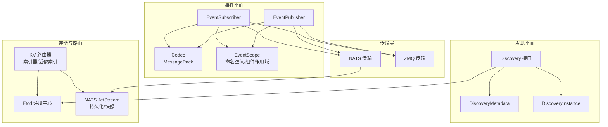
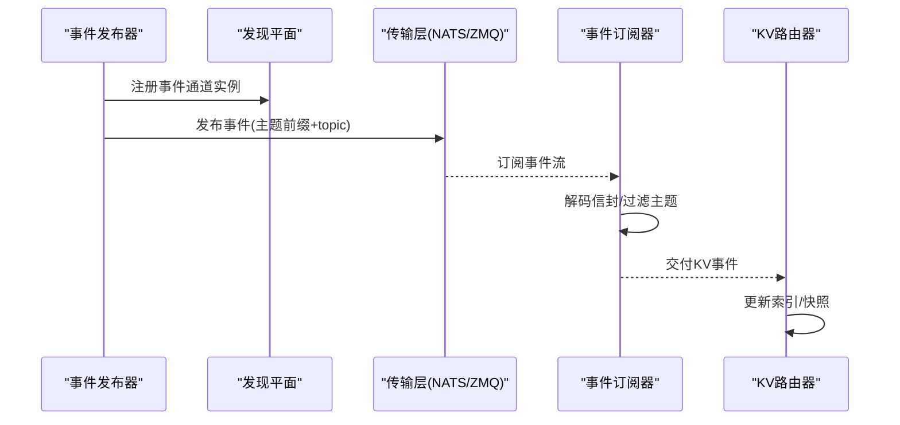
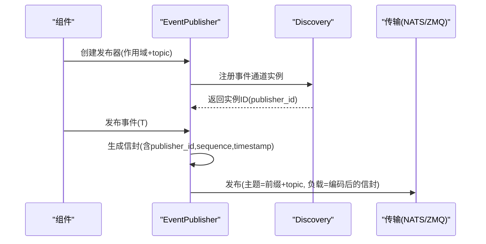
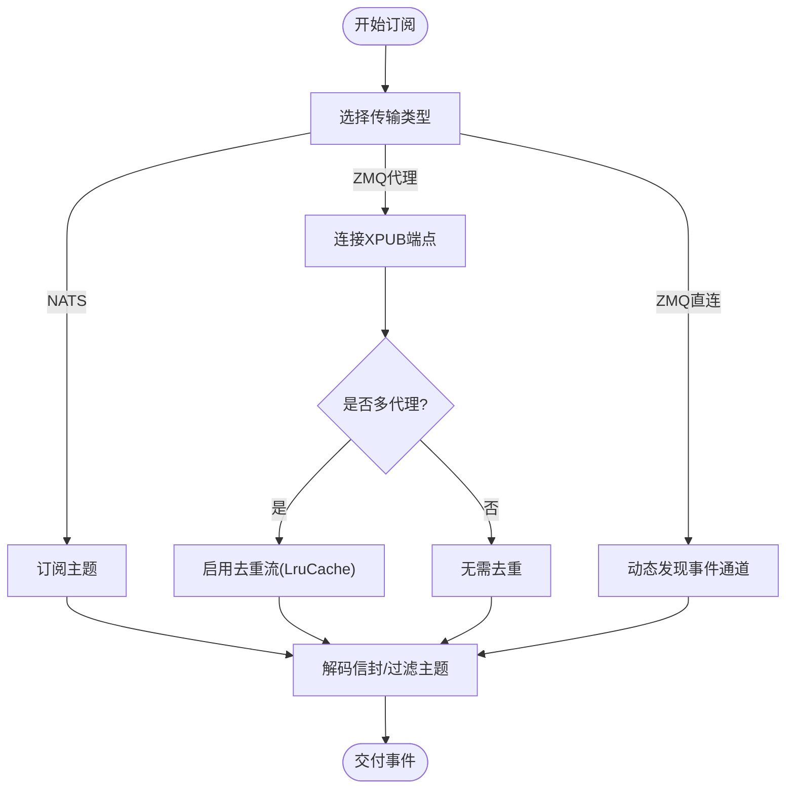
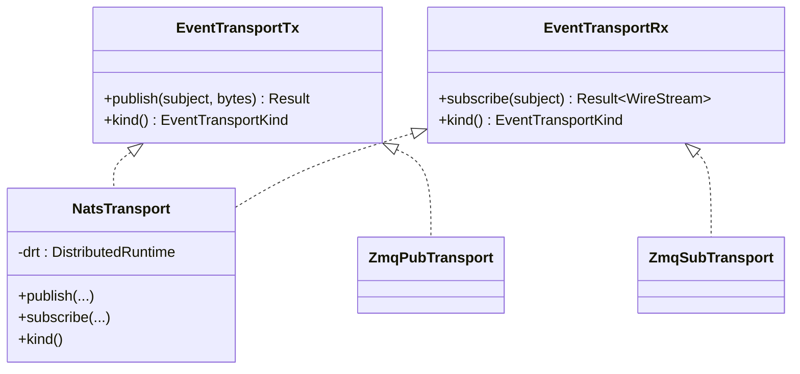
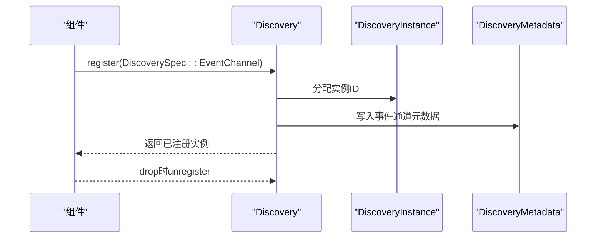
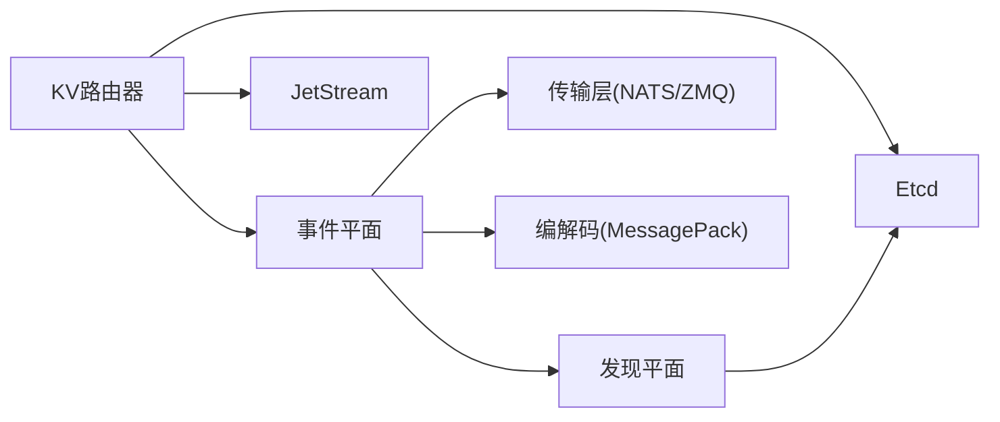

# 事件驱动架构

<cite>
**本文引用的文件**
- [event_plane.md](file://docs/design_docs/event_plane.md)
- [mod.rs（事件平面）](file://lib/runtime/src/transports/event_plane/mod.rs)
- [nats_transport.rs](file://lib/runtime/src/transports/event_plane/nats_transport.rs)
- [traits.rs（事件平面）](file://lib/runtime/src/transports/event_plane/traits.rs)
- [codec.rs（事件平面）](file://lib/runtime/src/transports/event_plane/codec.rs)
- [mod.rs（发现）](file://lib/runtime/src/discovery/mod.rs)
- [kv_cache_routing.md](file://docs/router/kv_cache_routing.md)
- [indexer.rs（KV路由器）](file://lib/kv-router/src/indexer.rs)
- [lib.rs（KV路由器）](file://lib/kv-router/src/lib.rs)
- [recorder.rs（KV记录器）](file://lib/llm/src/kv_router/recorder.rs)
</cite>

## 目录
1. [引言](#引言)
2. [项目结构](#项目结构)
3. [核心组件](#核心组件)
4. [架构总览](#架构总览)
5. [详细组件分析](#详细组件分析)
6. [依赖关系分析](#依赖关系分析)
7. [性能考量](#性能考量)
8. [故障排查指南](#故障排查指南)
9. [结论](#结论)
10. [附录](#附录)

## 引言
本文件面向Dynamo的事件驱动架构，系统化阐述事件的产生、传播与消费机制；解析事件平面的动态订阅者管理与事件路由算法；说明基于NATS的事件传输系统（序列化格式、传输优化与可靠性保障）；解释存储层对事件的统一集成（Etcd与NATS事件的协同）；并给出发现系统的事件驱动实现、事件幂等性与错误处理最佳实践及调试技巧。

## 项目结构
Dynamo的事件驱动能力由“事件平面”与“发现平面”共同支撑：
- 事件平面：提供跨传输（NATS/ZMQ）的发布/订阅抽象，统一消息编解码与路由语义。
- 发现平面：提供服务注册与发现、租约与心跳、分布式锁、事件通道注册等能力。
- 存储层：以Etcd为主（默认），可选NATS作为事件持久化与KV缓存事件通道。
- 路由与索引：KV路由器通过事件流构建与维护KV缓存索引，支持JetStream持久化与快照。

图示来源
- [mod.rs（事件平面）](file://lib/runtime/src/transports/event_plane/mod.rs#L46-L87)
- [nats_transport.rs](file://lib/runtime/src/transports/event_plane/nats_transport.rs#L15-L54)
- [mod.rs（发现）](file://lib/runtime/src/discovery/mod.rs#L26-L44)
- [kv_cache_routing.md](file://docs/router/kv_cache_routing.md#L169-L214)

章节来源
- [event_plane.md](file://docs/design_docs/event_plane.md#L22-L52)
- [mod.rs（事件平面）](file://lib/runtime/src/transports/event_plane/mod.rs#L46-L87)
- [mod.rs（发现）](file://lib/runtime/src/discovery/mod.rs#L124-L184)

## 核心组件
- 事件发布器（EventPublisher）
  - 支持命名空间级与组件级作用域，自动拼接主题前缀。
  - 统一编码为消息包（MessagePack），封装事件信封（含发布者ID、序列号、时间戳、主题、负载）。
  - 自动向发现平面注册事件通道实例，并在析构时注销。
- 事件订阅器（EventSubscriber）
  - 基于传输类型选择订阅路径：NATS直接订阅、ZMQ直连或代理模式。
  - NATS侧按主题过滤；ZMQ侧在多代理场景下进行去重。
- 传输抽象（NATS/ZMQ）
  - NATS传输：发布/订阅桥接到分布式运行时的NATS接口。
  - ZMQ传输：支持直连绑定与代理连接，代理模式支持多活与去重。
- 编解码（Codec）
  - 统一采用MessagePack二进制编解码，兼顾体积与性能。
- 发现平面（Discovery）
  - 提供事件通道查询、注册、注销与变更流；支持Kubernetes与Etcd后端。
- KV路由器（KV Router）
  - 消费KV事件流，维护KV缓存索引；支持JetStream持久化与快照。

章节来源
- [mod.rs（事件平面）](file://lib/runtime/src/transports/event_plane/mod.rs#L278-L508)
- [nats_transport.rs](file://lib/runtime/src/transports/event_plane/nats_transport.rs#L15-L54)
- [traits.rs（事件平面）](file://lib/runtime/src/transports/event_plane/traits.rs#L12-L25)
- [codec.rs（事件平面）](file://lib/runtime/src/transports/event_plane/codec.rs#L12-L61)
- [mod.rs（发现）](file://lib/runtime/src/discovery/mod.rs#L686-L710)
- [kv_cache_routing.md](file://docs/router/kv_cache_routing.md#L169-L214)

## 架构总览
事件驱动架构围绕“事件平面 + 发现平面 + 存储层 + 路由索引”的闭环展开：
- 事件产生：各组件（如引擎）通过EventPublisher发布事件到事件平面。
- 动态订阅：EventSubscriber根据作用域与主题动态发现并订阅事件通道。
- 传输与路由：NATS用于KV事件与副本同步，ZMQ用于组件间低延迟通信；两者均通过统一编解码与作用域前缀路由。
- 存储与一致性：Etcd负责服务注册与租约心跳；KV事件可持久化至JetStream，确保多副本一致性与重启恢复。
- 路由与索引：KV路由器消费事件流，维护KV缓存索引，支持近似路由与LRU过期。

图示来源
- [mod.rs（事件平面）](file://lib/runtime/src/transports/event_plane/mod.rs#L412-L470)
- [nats_transport.rs](file://lib/runtime/src/transports/event_plane/nats_transport.rs#L25-L54)
- [kv_cache_routing.md](file://docs/router/kv_cache_routing.md#L169-L214)

## 详细组件分析

### 事件发布器（EventPublisher）
- 作用域与主题
  - 命名空间级：主题前缀为“namespace.{name}”
  - 组件级：主题前缀为“namespace.{namespace}.component.{component}”
- 序列化与信封
  - 使用MessagePack编码事件负载与信封。
  - 信封包含publisher_id（来自发现实例ID）、单调递增sequence、published_at（毫秒时间戳）、topic与payload。
- 发布流程
  - 生成事件信封 → 编码信封与负载 → 拼接主题 → 通过传输层发布。
- 发现集成
  - 在NATS/ZMQ直连模式下，注册事件通道实例；ZMQ代理模式跳过注册。
- 生命周期
  - 析构时异步注销事件通道实例，避免悬挂注册。

图示来源
- [mod.rs（事件平面）](file://lib/runtime/src/transports/event_plane/mod.rs#L292-L330)
- [mod.rs（事件平面）](file://lib/runtime/src/transports/event_plane/mod.rs#L412-L470)
- [traits.rs（事件平面）](file://lib/runtime/src/transports/event_plane/traits.rs#L12-L25)
- [codec.rs（事件平面）](file://lib/runtime/src/transports/event_plane/codec.rs#L63-L86)

章节来源
- [mod.rs（事件平面）](file://lib/runtime/src/transports/event_plane/mod.rs#L278-L508)
- [traits.rs（事件平面）](file://lib/runtime/src/transports/event_plane/traits.rs#L12-L25)
- [codec.rs（事件平面）](file://lib/runtime/src/transports/event_plane/codec.rs#L12-L61)

### 事件订阅器（EventSubscriber）
- 传输选择
  - NATS：直接订阅主题，按主题过滤。
  - ZMQ：
    - 代理模式：连接XPUB端点，单代理无需去重，多代理启用去重流。
    - 直连模式：通过发现查询事件通道，动态连接发布器。
- 去重机制（ZMQ多代理）
  - 基于(LruCache)记录(publisher_id, sequence)，重复事件直接丢弃。
- 类型化订阅
  - 提供TypedEventSubscriber，自动解码负载为指定类型。

图示来源
- [mod.rs（事件平面）](file://lib/runtime/src/transports/event_plane/mod.rs#L591-L722)
- [mod.rs（事件平面）](file://lib/runtime/src/transports/event_plane/mod.rs#L217-L276)

章节来源
- [mod.rs（事件平面）](file://lib/runtime/src/transports/event_plane/mod.rs#L543-L722)
- [mod.rs（事件平面）](file://lib/runtime/src/transports/event_plane/mod.rs#L217-L276)

### 传输层：NATS与ZMQ
- NATS传输
  - 发布：调用分布式运行时的NATS发布接口。
  - 订阅：返回字节流，上层再解码信封与负载。
- ZMQ传输
  - 直连：发布器绑定端口，订阅器发现并连接。
  - 代理：发布器连接XSUB，订阅器连接XPUB；多代理时启用去重。

图示来源
- [nats_transport.rs](file://lib/runtime/src/transports/event_plane/nats_transport.rs#L15-L54)
- [mod.rs（事件平面）](file://lib/runtime/src/transports/event_plane/zmq_transport.rs)

章节来源
- [nats_transport.rs](file://lib/runtime/src/transports/event_plane/nats_transport.rs#L15-L54)
- [mod.rs（事件平面）](file://lib/runtime/src/transports/event_plane/zmq_transport.rs)

### 编解码：MessagePack统一格式
- 事件信封与负载均采用MessagePack编码，保证紧凑与高效。
- 提供通用Codec接口，便于扩展其他编解码器。

章节来源
- [codec.rs（事件平面）](file://lib/runtime/src/transports/event_plane/codec.rs#L12-L61)
- [traits.rs（事件平面）](file://lib/runtime/src/transports/event_plane/traits.rs#L12-L25)

### 发现平面：事件通道注册与查询
- 事件通道查询
  - 支持全量、命名空间、组件、主题等层级过滤。
- 事件通道注册
  - NATS：使用主题前缀；ZMQ：使用端点或代理端点集合。
- 实例生命周期
  - 注册时分配实例ID；析构时注销，避免悬挂。

图示来源
- [mod.rs（发现）](file://lib/runtime/src/discovery/mod.rs#L290-L406)
- [mod.rs（发现）](file://lib/runtime/src/discovery/mod.rs#L408-L504)

章节来源
- [mod.rs（发现）](file://lib/runtime/src/discovery/mod.rs#L186-L288)
- [mod.rs（发现）](file://lib/runtime/src/discovery/mod.rs#L290-L406)
- [mod.rs（发现）](file://lib/runtime/src/discovery/mod.rs#L408-L504)

### 存储层与事件集成：Etcd与NATS
- Etcd（默认）
  - 服务注册键格式：/services/{namespace}/{component}/{endpoint}/{instance_id}
  - 租约保活与自动清理，提供强一致的发现与锁能力。
- NATS（可选）
  - 用于KV缓存事件与副本同步；JetStream提供持久化与重放能力。
- 统一处理
  - 事件平面通过统一的事件通道抽象对接Etcd与NATS，屏蔽底层差异。

章节来源
- [event_plane.md](file://docs/design_docs/event_plane.md#L91-L143)
- [event_plane.md](file://docs/design_docs/event_plane.md#L227-L294)
- [kv_cache_routing.md](file://docs/router/kv_cache_routing.md#L169-L214)

### 发现系统的事件驱动实现
- 资源变化事件捕获
  - 通过发现查询与变更流监听事件通道实例的新增/移除。
- 处理流程
  - 新增：建立或更新订阅；移除：清理订阅并触发重路由。
- 与KV事件联动
  - 当启用KV感知路由时，前端/路由器通过订阅KV事件流实现状态同步。

章节来源
- [mod.rs（发现）](file://lib/runtime/src/discovery/mod.rs#L686-L710)
- [kv_cache_routing.md](file://docs/router/kv_cache_routing.md#L169-L214)

## 依赖关系分析
- 事件平面依赖
  - 发现平面：注册/注销事件通道实例，查询事件通道。
  - 传输层：NATS/ZMQ具体实现。
  - 编解码：统一MessagePack。
- KV路由器依赖
  - 事件平面：消费KV事件流。
  - JetStream：持久化与快照。
  - Etcd：服务注册与租约。

图示来源
- [mod.rs（事件平面）](file://lib/runtime/src/transports/event_plane/mod.rs#L330-L470)
- [mod.rs（发现）](file://lib/runtime/src/discovery/mod.rs#L686-L710)
- [kv_cache_routing.md](file://docs/router/kv_cache_routing.md#L169-L214)

章节来源
- [mod.rs（事件平面）](file://lib/runtime/src/transports/event_plane/mod.rs#L330-L470)
- [mod.rs（发现）](file://lib/runtime/src/discovery/mod.rs#L686-L710)

## 性能考量
- 编解码效率
  - MessagePack二进制编码，体积小、CPU开销低，适合高频事件。
- 传输选择
  - ZMQ直连适合低延迟、高吞吐的组件内通信；NATS适合跨节点、持久化与副本同步。
- 去重与缓存
  - ZMQ多代理去重使用LRU缓存，避免重复事件处理。
- 可靠性
  - NATS内置重连与缓冲；ZMQ通过发现与租约实现快速故障检测与切换。
- KV事件持久化
  - JetStream提供持久化与重放，降低重启后状态不一致风险。

[本节为通用指导，无需列出章节来源]

## 故障排查指南
- NATS不可达
  - 现象：发布/订阅失败、重连日志频繁。
  - 排查：确认NATS服务器地址、认证配置；检查网络连通性。
- ZMQ多代理重复事件
  - 现象：同一事件被多次处理。
  - 排查：确认代理模式与去重流配置；检查LruCache容量与命中率。
- 事件未到达订阅器
  - 现象：订阅器无事件。
  - 排查：核对主题前缀与作用域；确认订阅器是否正确过滤主题；检查发现查询范围。
- KV事件不同步
  - 现象：路由决策与实际KV状态不一致。
  - 排查：确认JetStream消费者组与偏移；检查事件序列号与去重逻辑；验证KV路由器索引更新。
- 发现注册异常
  - 现象：事件通道未注册或注销失败。
  - 排查：查看实例ID分配与注销日志；确认发现后端（Etcd/K8s）可用性。

章节来源
- [nats_transport.rs](file://lib/runtime/src/transports/event_plane/nats_transport.rs#L25-L54)
- [mod.rs（事件平面）](file://lib/runtime/src/transports/event_plane/mod.rs#L217-L276)
- [kv_cache_routing.md](file://docs/router/kv_cache_routing.md#L169-L214)

## 结论
Dynamo的事件驱动架构通过事件平面与发现平面的协同，实现了跨传输的一致性抽象；结合Etcd与NATS，既满足高性能组件内通信，又提供KV事件持久化与多副本一致性保障。通过统一的编解码与作用域前缀，系统具备良好的扩展性与可运维性。建议在生产中优先启用JetStream持久化与租约保活，配合严格的事件幂等与重试策略，确保系统稳定与可观测性。

[本节为总结性内容，无需列出章节来源]

## 附录

### 事件处理最佳实践
- 幂等性
  - 基于(publisher_id, sequence)去重；对重复事件直接忽略或幂等应用。
- 错误处理与重试
  - 发布失败：指数退避重试；订阅断连：自动重连与回放。
- 监控与可观测性
  - 记录事件吞吐、延迟、去重率与重试次数；对关键路径增加指标埋点。
- 配置与部署
  - 明确事件通道主题命名规范；区分命名空间与组件作用域；按需启用JetStream与ZMQ代理模式。

[本节为通用指导，无需列出章节来源]

### 事件处理示例与调试技巧
- 示例：KV事件录制与回放
  - 使用KV记录器将事件写入文件，便于离线分析与回归测试。
- 调试技巧
  - 启用JSON编解码（开发环境）以提升可读性；
  - 使用TypedEventSubscriber简化负载反序列化；
  - 在ZMQ多代理场景下观察去重日志，评估缓存大小与命中率。

章节来源
- [recorder.rs（KV记录器）](file://lib/llm/src/kv_router/recorder.rs#L74-L85)
- [codec.rs（事件平面）](file://lib/runtime/src/transports/event_plane/codec.rs#L88-L134)